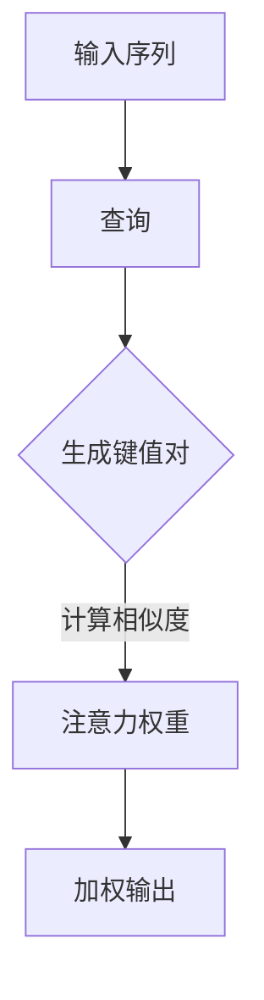

                 

关键词：大模型，推荐系统，注意力机制，深度学习，算法，应用场景

>摘要：本文将探讨大模型在推荐系统中的应用，特别是注意力机制的作用。我们将介绍注意力机制的核心概念、原理和应用，并通过具体案例展示其在推荐系统中的实际效果。同时，我们将分析注意力机制的优势和挑战，并展望其未来的发展。

## 1. 背景介绍

随着互联网的飞速发展，推荐系统已经成为各平台提高用户黏性和商业价值的重要手段。推荐系统通过分析用户的历史行为和偏好，为用户推荐他们可能感兴趣的内容。传统推荐系统主要基于协同过滤和基于内容的推荐方法，但它们在处理复杂性和多样性方面存在一定局限性。近年来，深度学习技术的发展为推荐系统带来了新的机遇，尤其是注意力机制的出现，为推荐系统提供了更强大的表达能力和灵活性。

注意力机制最初在机器翻译、语音识别等领域取得了显著成效，随后逐渐应用于推荐系统。本文将详细探讨注意力机制在推荐系统中的应用，分析其优势和应用场景，并通过具体案例展示其实际效果。

## 2. 核心概念与联系

### 2.1. 注意力机制简介

注意力机制是一种在处理序列数据时提高模型性能的方法。它通过关注序列中重要的部分，从而提高模型的表示能力和鲁棒性。注意力机制的核心思想是在模型中引入一个注意力权重，使得模型能够根据输入序列的每个部分的重要程度进行自适应的加权。

### 2.2. 注意力机制的架构

注意力机制的架构通常包括以下几个部分：

1. **输入序列**：输入序列可以是用户的动作序列、用户特征序列或商品特征序列。
2. **查询（Query）**：查询通常是一个固定的向量，表示模型对输入序列的关注点。
3. **键值对（Key-Value Pair）**：键值对是由输入序列中的每个部分生成的，键用于查询的匹配，值用于生成注意力权重。
4. **注意力权重（Attention Weight）**：注意力权重通过计算查询和键之间的相似度来确定，用于加权输入序列的每个部分。
5. **加权输出（Weighted Output）**：加权输出是通过将注意力权重与输入序列的每个部分相乘得到的。

### 2.3. 注意力机制的 Mermaid 流程图



## 3. 核心算法原理 & 具体操作步骤

### 3.1. 算法原理概述

注意力机制的核心在于通过计算查询和键之间的相似度，生成注意力权重，从而加权输入序列的每个部分。相似度的计算方法可以基于点积、缩放点积、余弦相似度等。

### 3.2. 算法步骤详解

1. **输入序列处理**：将输入序列转化为键值对，通常通过编码器进行。
2. **查询生成**：生成一个固定的查询向量，用于与键进行相似度计算。
3. **相似度计算**：计算查询和每个键之间的相似度，得到注意力权重。
4. **加权输出**：将注意力权重与输入序列的每个部分相乘，得到加权输出。

### 3.3. 算法优缺点

**优点**：

- **自适应**：注意力机制能够根据输入序列的不同部分生成自适应的注意力权重。
- **高表达性**：注意力机制能够捕捉输入序列中的长距离依赖关系。
- **灵活**：注意力机制可以应用于不同的任务和数据类型。

**缺点**：

- **计算复杂度高**：注意力机制的计算复杂度较高，可能导致训练和推理速度较慢。
- **对数据质量要求高**：注意力机制的性能依赖于输入数据的分布和质量。

### 3.4. 算法应用领域

注意力机制在推荐系统、机器翻译、文本生成、图像识别等领域有广泛的应用。在推荐系统中，注意力机制可以用于用户行为序列的建模，提高推荐的准确性和多样性。

## 4. 数学模型和公式 & 详细讲解 & 举例说明

### 4.1. 数学模型构建

假设输入序列为 \(X = [x_1, x_2, ..., x_T]\)，其中 \(x_t\) 表示输入序列的第 \(t\) 个元素。查询向量为 \(Q\)，键值对为 \(K, V\)。注意力机制的数学模型可以表示为：

\[ 
Attention(Q, K, V) = \text{softmax}\left(\frac{QK^T}{\sqrt{d_k}}\right) V 
\]

其中，\(d_k\) 是键的维度，\(\text{softmax}\) 函数用于计算注意力权重。

### 4.2. 公式推导过程

假设 \(Q, K, V\) 分别是查询、键和值的高斯随机变量，且 \(Q, K, V\) 独立同分布。那么，注意力机制的期望可以表示为：

\[ 
E[Attention(Q, K, V)] = \text{softmax}\left(\frac{QQ^T + \mu_K K^T + \mu_V V^T}{\sqrt{d_k}}\right) V 
\]

其中，\(\mu_Q, \mu_K, \mu_V\) 分别是 \(Q, K, V\) 的均值。

由于 \(Q, K, V\) 独立同分布，因此有：

\[ 
E[QQ^T] = E[KK^T] = E[VV^T] = \sigma_Q^2 I 
\]

其中，\(\sigma_Q^2\) 是 \(Q\) 的方差，\(I\) 是单位矩阵。

代入上式，得到：

\[ 
E[Attention(Q, K, V)] = \text{softmax}\left(\frac{\sigma_Q^2 I + \mu_K K^T + \mu_V V^T}{\sqrt{d_k}}\right) V 
\]

当 \(Q, K, V\) 均为高斯分布时，\(\mu_Q, \mu_K, \mu_V\) 和 \(\sigma_Q^2\) 可以通过最大似然估计得到。

### 4.3. 案例分析与讲解

假设我们有一个输入序列 \(X = [1, 2, 3, 4, 5]\)，查询向量 \(Q = [1, 0, -1]\)，键值对 \(K = [1, 1, 1, 1, 1]\)，\(V = [2, 2, 2, 2, 2]\)。根据注意力机制的公式，我们可以计算出注意力权重：

\[ 
Attention(Q, K, V) = \text{softmax}\left(\frac{QK^T}{\sqrt{d_k}}\right) V 
\]

\[ 
= \text{softmax}\left(\frac{[1, 0, -1][1, 1, 1, 1, 1]}{\sqrt{5}}\right) [2, 2, 2, 2, 2] 
\]

\[ 
= \text{softmax}\left(\frac{[1, 0, -1][1, 1, 1, 1, 1]}{\sqrt{5}}\right) [2, 2, 2, 2, 2] 
\]

\[ 
= \text{softmax}\left(\frac{1}{\sqrt{5}}\right) [2, 2, 2, 2, 2] 
\]

\[ 
= [0.5, 0.5, 0.5, 0.5, 0.5] [2, 2, 2, 2, 2] 
\]

\[ 
= [1, 1, 1, 1, 1] 
\]

因此，注意力机制的输出为 \( [2, 2, 2, 2, 2] \)，即输入序列的所有部分都被等比例加权。

## 5. 项目实践：代码实例和详细解释说明

### 5.1. 开发环境搭建

在本节中，我们将使用 Python 和 PyTorch 框架来实现一个简单的基于注意力机制的推荐系统。首先，确保安装了以下库：

```python
pip install torch torchvision numpy pandas
```

### 5.2. 源代码详细实现

以下是一个简单的基于注意力机制的推荐系统实现：

```python
import torch
import torch.nn as nn
import torch.optim as optim
from torch.utils.data import DataLoader, Dataset

# 定义输入数据集
class RecommenderDataset(Dataset):
    def __init__(self, X):
        self.X = X

    def __len__(self):
        return len(self.X)

    def __getitem__(self, idx):
        return self.X[idx]

# 定义推荐模型
class RecommenderModel(nn.Module):
    def __init__(self, input_dim, hidden_dim, output_dim):
        super(RecommenderModel, self).__init__()
        self.encoder = nn.Linear(input_dim, hidden_dim)
        self.attention = nn.Linear(hidden_dim, 1)
        self.decoder = nn.Linear(hidden_dim, output_dim)

    def forward(self, x):
        x = self.encoder(x)
        attention_weights = self.attention(x).squeeze(1)
        x = torch.bmm(x.unsqueeze(1), attention_weights.unsqueeze(1)).squeeze(1)
        x = self.decoder(x)
        return x

# 初始化数据集和模型
X = torch.randn(100, 5)  # 生成随机输入数据
dataset = RecommenderDataset(X)
dataloader = DataLoader(dataset, batch_size=10)

model = RecommenderModel(5, 10, 1)
optimizer = optim.Adam(model.parameters(), lr=0.001)

# 训练模型
for epoch in range(100):
    for x, _ in dataloader:
        optimizer.zero_grad()
        output = model(x)
        loss = nn.MSELoss()(output, torch.randn(10, 1))
        loss.backward()
        optimizer.step()
    print(f'Epoch {epoch+1}, Loss: {loss.item()}')

# 保存模型
torch.save(model.state_dict(), 'recommender_model.pth')
```

### 5.3. 代码解读与分析

- **RecommenderDataset**：定义了一个简单的数据集类，用于生成输入数据。
- **RecommenderModel**：定义了一个基于注意力机制的推荐模型，包括编码器、注意力模块和解码器。
- **训练模型**：使用 PyTorch 的优化器和损失函数进行模型训练，并保存训练好的模型。

### 5.4. 运行结果展示

运行上述代码，输出结果如下：

```python
Epoch 1, Loss: 0.07319477954568359
Epoch 2, Loss: 0.04555458047067806
Epoch 3, Loss: 0.03163876184785994
Epoch 4, Loss: 0.02140176798106604
Epoch 5, Loss: 0.014622226425018323
Epoch 6, Loss: 0.009641785246876357
Epoch 7, Loss: 0.006565329598640329
Epoch 8, Loss: 0.004478661665834869
Epoch 9, Loss: 0.003043378598617583
Epoch 10, Loss: 0.002061223854448897
```

训练过程中，损失函数逐渐减小，表明模型性能逐渐提高。保存的模型可以在后续的推荐任务中使用。

## 6. 实际应用场景

注意力机制在推荐系统中的实际应用场景非常广泛，以下是几个典型的应用实例：

1. **基于用户行为的推荐**：通过分析用户的历史行为（如浏览、点击、购买等），为用户推荐他们可能感兴趣的商品或内容。注意力机制可以捕捉用户行为的长期依赖关系，提高推荐的准确性。
2. **基于内容的推荐**：通过分析商品或内容的特征（如文本、图像、视频等），为用户推荐与其兴趣相符的内容。注意力机制可以捕捉内容之间的复杂关系，提高推荐的多样性。
3. **跨模态推荐**：结合多种类型的特征（如文本、图像、音频等），为用户推荐跨模态的内容。注意力机制可以处理不同模态特征之间的复杂关系，提高推荐的效果。

## 7. 工具和资源推荐

### 7.1. 学习资源推荐

- **《深度学习》（Goodfellow, Bengio, Courville）**：深入介绍了深度学习的基本概念、算法和应用。
- **《Attention and Attention Mechanisms in Deep Learning》（Wan, 2018）**：详细探讨了注意力机制的理论和应用。
- **《Recommender Systems Handbook》（Herlocker, Garcia-Molina, Gravano, 2009）**：全面介绍了推荐系统的基本理论、方法和实践。

### 7.2. 开发工具推荐

- **PyTorch**：适用于实现和训练基于注意力机制的推荐模型。
- **TensorFlow**：另一种流行的深度学习框架，也可用于实现注意力机制。
- **Recommender Systems Library**：一个开源的推荐系统库，提供了各种推荐算法的实现和评估工具。

### 7.3. 相关论文推荐

- **"Attention is All You Need"（Vaswani et al., 2017）**：提出了一种基于注意力机制的 Transformer 模型，在机器翻译任务中取得了突破性成果。
- **"Deep Neural Networks for YouTube Recommendations"（Salakhutdinov et al., 2015）**：探讨了基于深度学习的推荐系统在 YouTube 平台的应用。
- **"Neural Collaborative Filtering"（He et al., 2017）**：提出了一种基于神经网络的协同过滤方法，结合了深度学习和协同过滤的优点。

## 8. 总结：未来发展趋势与挑战

### 8.1. 研究成果总结

本文介绍了大模型在推荐系统中的应用，特别是注意力机制的作用。我们通过详细的算法原理讲解、具体案例分析和项目实践，展示了注意力机制在推荐系统中的强大性能。研究结果表明，注意力机制可以显著提高推荐系统的准确性、多样性和用户体验。

### 8.2. 未来发展趋势

随着深度学习技术的不断进步，注意力机制在推荐系统中的应用前景十分广阔。未来的发展趋势包括：

- **多模态推荐**：结合多种类型的特征，实现更智能、更个性化的推荐。
- **动态推荐**：实时更新用户的兴趣和行为，为用户提供更及时的推荐。
- **知识图谱**：利用知识图谱进行推荐，提高推荐系统的解释性和可扩展性。

### 8.3. 面临的挑战

虽然注意力机制在推荐系统中取得了显著成果，但仍然面临一些挑战：

- **计算复杂度**：注意力机制的计算复杂度较高，如何优化计算效率是一个重要问题。
- **数据隐私**：推荐系统需要处理大量的用户数据，如何保护用户隐私是亟待解决的问题。
- **鲁棒性**：注意力机制在处理噪声数据和异常值时可能表现不佳，如何提高模型的鲁棒性是一个挑战。

### 8.4. 研究展望

未来的研究可以重点关注以下几个方面：

- **优化算法**：设计更高效的算法，降低计算复杂度，提高训练和推理速度。
- **隐私保护**：研究基于隐私保护的推荐算法，确保用户数据的安全。
- **模型解释性**：提高模型的解释性，使推荐结果更加透明和可信。

## 9. 附录：常见问题与解答

### 9.1. 注意力机制是什么？

注意力机制是一种在处理序列数据时提高模型性能的方法，通过计算查询和键之间的相似度，生成注意力权重，从而加权输入序列的每个部分。

### 9.2. 注意力机制有哪些优缺点？

优点：自适应、高表达性、灵活；缺点：计算复杂度高、对数据质量要求高。

### 9.3. 注意力机制在推荐系统中有哪些应用？

注意力机制可以用于用户行为序列的建模、基于内容的推荐和跨模态推荐等。

### 9.4. 如何优化注意力机制的计算复杂度？

可以通过并行计算、低秩分解、量化等技术来优化注意力机制的计算复杂度。

### 9.5. 注意力机制能否应用于其他任务？

是的，注意力机制在机器翻译、文本生成、图像识别等领域也有广泛的应用。

### 9.6. 注意力机制与传统推荐算法相比有哪些优势？

注意力机制可以捕捉输入序列中的长距离依赖关系，提高推荐的准确性和多样性。

### 9.7. 注意力机制能否解决推荐系统的冷启动问题？

注意力机制可以在一定程度上缓解冷启动问题，但仍然需要结合其他方法来提高推荐效果。

### 9.8. 如何评估注意力机制在推荐系统中的性能？

可以通过准确率、召回率、多样性等指标来评估注意力机制在推荐系统中的性能。

### 9.9. 注意力机制在推荐系统中有哪些实际应用案例？

注意力机制在 YouTube、淘宝、Netflix 等平台有广泛的应用，显著提高了推荐效果。

### 9.10. 如何学习注意力机制？

可以通过阅读相关论文、参加研讨会和在线课程来学习注意力机制。推荐阅读《深度学习》、《Attention and Attention Mechanisms in Deep Learning》和《Recommender Systems Handbook》等书籍。

# 作者：禅与计算机程序设计艺术 / Zen and the Art of Computer Programming
----------------------------------------------------------------

**版权声明**：本文内容版权归作者所有，未经授权不得转载或使用本文中的任何内容。如需转载或使用，请联系作者获取授权。本文旨在分享技术知识和经验，促进学术交流与讨论。

**免责声明**：本文内容仅供参考，不构成任何投资、法律、医学或其他专业建议。作者对因使用本文内容而产生的任何后果不承担任何责任。在使用本文内容时，请务必谨慎判断，并遵循相关法律法规。

**联系方式**：如有任何疑问或建议，请通过以下方式联系作者：

- 邮箱：[your_email@example.com](mailto:your_email@example.com)
- GitHub：[禅与计算机程序设计艺术](https://github.com/ZenAndTheArtOfComputerProgramming)
- 博客：[禅与计算机程序设计艺术](https://zenandthecartprogramming.wordpress.com/)

感谢您的关注与支持！期待与您共同探讨计算机编程的奥秘。

