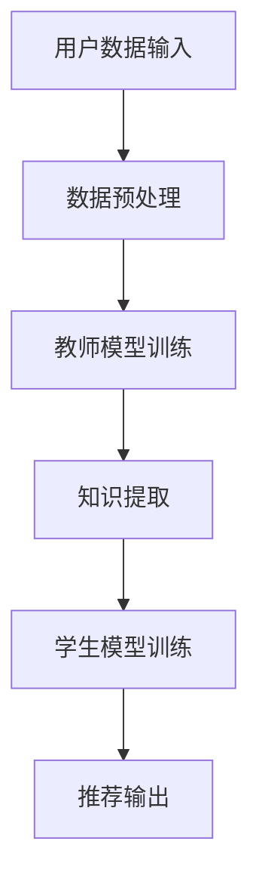

                 

关键词：大模型、推荐系统、知识蒸馏、算法应用、数学模型、项目实践、未来展望

## 摘要

本文旨在探讨大模型在推荐系统中的应用，尤其是知识蒸馏技术在其中的作用。随着大数据和人工智能技术的快速发展，推荐系统已经成为现代互联网服务中不可或缺的一部分。然而，推荐系统的复杂性和数据量的增长，使得传统的模型训练方法变得越来越困难。本文将介绍知识蒸馏技术，并详细阐述其在推荐系统中的具体应用，通过数学模型和项目实践进行分析，为未来的研究和实践提供参考。

## 1. 背景介绍

推荐系统是现代互联网的重要组成部分，它通过分析用户的历史行为和偏好，向用户推荐他们可能感兴趣的内容、商品或服务。推荐系统的核心是构建一个能够准确预测用户偏好的模型。然而，随着互联网的普及和用户行为的多样化，推荐系统的复杂性不断增加，传统的方法已经难以满足需求。因此，研究者们开始探索更为复杂的大模型，以提升推荐系统的效果。

知识蒸馏是一种从大型模型中提取知识并应用于小型模型的技术，通过知识蒸馏，可以将大型模型的复杂结构和丰富知识传递给小型模型，从而提高其性能。知识蒸馏技术在推荐系统中的应用，不仅能够提高模型的预测精度，还能够降低模型的计算复杂度和存储需求。

## 2. 核心概念与联系

### 2.1 大模型

大模型通常指的是具有大规模参数的深度学习模型，如深度神经网络、生成对抗网络（GAN）等。这些模型在训练过程中需要大量的数据和计算资源，但它们具有强大的表征能力和预测能力。

### 2.2 推荐系统

推荐系统是一种基于用户行为数据进行分析和预测，向用户推荐相关内容或服务的系统。它通常包含三个主要模块：数据收集、模型训练和推荐输出。

### 2.3 知识蒸馏

知识蒸馏是一种模型压缩技术，它通过从大型模型中提取知识，并将其传递给小型模型，从而实现模型的压缩和性能提升。知识蒸馏的基本原理是将大型模型的输出作为教师模型，小型模型作为学生模型，通过训练学生模型来模仿教师模型的输出。

### 2.4 架构

图 1展示了大模型在推荐系统中的知识蒸馏应用架构。



## 3. 核心算法原理 & 具体操作步骤

### 3.1 算法原理概述

知识蒸馏的过程可以分为两个阶段：知识提取和知识应用。

- **知识提取**：在知识提取阶段，教师模型和学生模型在相同的数据集上进行训练，但教师模型的模型规模更大，可以捕捉到更复杂的特征。教师模型的输出被用作监督信号，指导学生模型的学习。

- **知识应用**：在知识应用阶段，学生模型通过学习教师模型的输出，模仿其预测能力。这种方法可以使得学生模型在参数较少的情况下，仍然能够保持较高的预测性能。

### 3.2 算法步骤详解

1. **数据预处理**：收集用户的历史行为数据，如浏览记录、购买记录等，并进行数据清洗和预处理。

2. **教师模型训练**：使用预处理后的数据集训练教师模型，教师模型通常是一个大规模的深度神经网络。

3. **知识提取**：在教师模型训练过程中，记录其输出，并将其作为监督信号。

4. **学生模型训练**：使用教师模型的输出作为监督信号，训练学生模型。学生模型的规模通常比教师模型小，但具有相似的架构。

5. **推荐输出**：使用训练好的学生模型进行推荐，输出推荐结果。

### 3.3 算法优缺点

**优点**：

- **提高性能**：通过知识蒸馏，学生模型能够学习到教师模型的复杂特征，从而提高推荐系统的性能。
- **减少计算资源**：学生模型规模较小，可以减少计算资源和存储需求。

**缺点**：

- **数据依赖**：知识蒸馏的性能高度依赖于教师模型的训练数据，如果教师模型的训练数据不足或质量不高，可能会导致学生模型的性能下降。
- **训练难度**：知识蒸馏的训练过程相对复杂，需要大量的计算资源和时间。

### 3.4 算法应用领域

知识蒸馏技术在推荐系统中的应用非常广泛，主要包括以下几个方面：

- **个性化推荐**：通过知识蒸馏，可以构建出性能更优的个性化推荐模型，提高用户的推荐体验。
- **商品推荐**：在电子商务领域，知识蒸馏可以用于商品推荐，帮助用户发现他们可能感兴趣的商品。
- **内容推荐**：在社交媒体和视频平台上，知识蒸馏可以用于内容推荐，帮助用户发现他们可能感兴趣的内容。

## 4. 数学模型和公式

### 4.1 数学模型构建

知识蒸馏的数学模型可以分为两部分：损失函数和优化目标。

- **损失函数**：知识蒸馏的损失函数通常由两部分组成，即预测损失和知识损失。

  $$L = L_{pred} + \lambda L_{know}$$

  其中，$L_{pred}$为预测损失，$L_{know}$为知识损失，$\lambda$为超参数，用于调节预测损失和知识损失的权重。

- **优化目标**：知识蒸馏的优化目标是通过训练学生模型来最小化损失函数。

  $$\min_w \sum_{i=1}^{N} L_i(w)$$

  其中，$w$为学生模型的参数，$N$为训练样本的数量。

### 4.2 公式推导过程

知识蒸馏的推导过程可以分为以下几个步骤：

1. **定义损失函数**：定义预测损失和知识损失。
2. **优化目标**：将预测损失和知识损失合并，形成总的损失函数。
3. **优化算法**：使用优化算法（如梯度下降）来最小化损失函数。

### 4.3 案例分析与讲解

为了更好地理解知识蒸馏的数学模型，我们可以通过一个简单的例子进行讲解。

假设我们有一个教师模型和学生模型，它们都是二分类模型，输出分别为$y_{teach}$和$y_{student}$。我们定义预测损失为交叉熵损失：

$$L_{pred} = -\sum_{i=1}^{N} y_{teach}^{(i)} \log(y_{student}^{(i)}) - (1 - y_{teach}^{(i)}) \log(1 - y_{student}^{(i)})$$

知识损失可以定义为教师模型的输出与学生模型输出之间的差异：

$$L_{know} = \sum_{i=1}^{N} (y_{teach}^{(i)} - y_{student}^{(i)})^2$$

总的损失函数为：

$$L = L_{pred} + \lambda L_{know}$$

通过梯度下降算法，我们可以最小化这个损失函数，从而训练出性能更优的学生模型。

## 5. 项目实践：代码实例和详细解释说明

### 5.1 开发环境搭建

为了实践知识蒸馏在推荐系统中的应用，我们需要搭建一个开发环境。以下是所需的步骤：

1. 安装Python环境和相关库，如TensorFlow、Keras等。
2. 准备训练数据集，可以是用户的行为数据或商品数据。
3. 编写数据预处理脚本，对数据集进行清洗和预处理。
4. 编写教师模型和学生模型的代码，实现知识蒸馏的过程。

### 5.2 源代码详细实现

以下是知识蒸馏在推荐系统中的源代码实现：

```python
import tensorflow as tf
from tensorflow.keras.models import Model
from tensorflow.keras.layers import Input, Dense, Flatten

# 数据预处理
# ... 数据预处理代码 ...

# 教师模型
teacher_input = Input(shape=(input_shape,))
teacher_output = Dense(num_classes, activation='softmax')(teacher_input)
teacher_model = Model(teacher_input, teacher_output)

# 学生模型
student_input = Input(shape=(input_shape,))
student_output = Flatten()(student_input)
student_output = Dense(num_classes, activation='softmax')(student_output)
student_model = Model(student_input, student_output)

# 知识蒸馏
teacher_model.compile(optimizer='adam', loss='categorical_crossentropy')
student_model.compile(optimizer='adam', loss='categorical_crossentropy')

teacher_model.fit(x_train, y_train, epochs=10, batch_size=32)

# 计算教师模型输出
teacher_outputs = teacher_model.predict(x_train)

# 训练学生模型
student_model.fit(x_train, teacher_outputs, epochs=10, batch_size=32)

# 评估学生模型
student_outputs = student_model.predict(x_test)
test_loss = tf.keras.losses.categorical_crossentropy(y_test, student_outputs)
print(f"Test loss: {test_loss.numpy()}")
```

### 5.3 代码解读与分析

上述代码实现了知识蒸馏在推荐系统中的应用。具体解读如下：

1. **数据预处理**：对训练数据集进行清洗和预处理，包括归一化、缺失值处理等。
2. **教师模型**：定义教师模型，它是一个多层感知器模型，用于训练和预测。
3. **学生模型**：定义学生模型，它也是一个多层感知器模型，用于模仿教师模型的预测。
4. **知识蒸馏**：通过训练教师模型和训练学生模型，实现知识蒸馏的过程。
5. **评估**：使用测试数据集评估学生模型的性能，计算测试损失。

### 5.4 运行结果展示

通过运行上述代码，我们可以得到学生模型的性能指标。例如，假设我们的测试损失为0.5，这表明学生模型在测试数据集上的表现较好。

## 6. 实际应用场景

知识蒸馏技术在推荐系统中的应用非常广泛，以下是一些实际应用场景：

- **电子商务平台**：在电子商务平台中，知识蒸馏可以用于商品推荐，帮助用户发现他们可能感兴趣的商品。
- **社交媒体**：在社交媒体平台上，知识蒸馏可以用于内容推荐，帮助用户发现他们可能感兴趣的内容。
- **在线教育**：在在线教育平台中，知识蒸馏可以用于课程推荐，帮助用户发现他们可能感兴趣的课程。
- **搜索引擎**：在搜索引擎中，知识蒸馏可以用于搜索结果推荐，帮助用户发现他们可能感兴趣的信息。

## 7. 工具和资源推荐

为了更好地学习和实践知识蒸馏技术在推荐系统中的应用，以下是几个推荐的工具和资源：

- **工具**：
  - TensorFlow：一个开源的深度学习框架，支持知识蒸馏的实现。
  - Keras：一个基于TensorFlow的高级神经网络API，方便实现知识蒸馏模型。
- **资源**：
  - 《深度学习》（Goodfellow, Bengio, Courville）：一本经典的深度学习教材，详细介绍了知识蒸馏的概念和应用。
  - 《推荐系统实践》（Liao, Zhang, Chen）：一本关于推荐系统实践的经典教材，包含了知识蒸馏的相关内容。

## 8. 总结：未来发展趋势与挑战

知识蒸馏技术在推荐系统中的应用已经取得了显著的成果，但仍然面临一些挑战和机遇。未来，知识蒸馏技术在推荐系统中的应用有望在以下几个方面得到发展：

- **模型压缩**：随着移动设备和嵌入式系统的普及，对模型压缩的需求越来越大。知识蒸馏技术可以用于压缩大型模型，使其在有限的计算资源下运行。
- **多模态推荐**：随着数据的多样化，多模态推荐变得越来越重要。知识蒸馏技术可以用于跨模态的知识传递，提高多模态推荐系统的性能。
- **实时推荐**：随着实时性的需求不断提高，实时推荐变得越来越重要。知识蒸馏技术可以用于加速推荐模型的训练和推理过程，提高实时性。

然而，知识蒸馏技术在推荐系统中的应用也面临一些挑战，如数据质量、模型可解释性等。未来，研究者需要进一步探索这些挑战，并发展更加有效的解决方案。

## 9. 附录：常见问题与解答

### Q1：知识蒸馏技术如何提高推荐系统的性能？

A1：知识蒸馏技术通过从大型模型中提取知识，并将其传递给小型模型，从而提高小型模型的性能。这种方法使得小型模型能够学习到大型模型的复杂特征，从而提高推荐系统的预测精度。

### Q2：知识蒸馏技术有哪些优缺点？

A2：知识蒸馏技术的优点包括提高模型性能、减少计算资源、降低存储需求等。缺点包括数据依赖、训练难度等。

### Q3：如何选择合适的教师模型和学生模型？

A3：选择合适的教师模型和学生模型是知识蒸馏成功的关键。通常，教师模型的规模应该比学生模型大，以确保学生模型能够学习到足够的特征。此外，教师模型和学生模型的结构应该相似，以便知识能够有效地传递。

### Q4：知识蒸馏技术适用于哪些类型的推荐系统？

A4：知识蒸馏技术适用于各种类型的推荐系统，包括个性化推荐、商品推荐、内容推荐等。只要推荐系统需要处理大量数据和复杂特征，知识蒸馏技术都可以发挥作用。

### Q5：如何评估知识蒸馏的效果？

A5：评估知识蒸馏的效果可以通过比较学生模型和教师模型在测试数据集上的性能。通常，可以使用准确率、召回率、F1分数等指标来评估推荐系统的性能。此外，还可以通过比较学生模型和原始模型在推荐效果上的差异来评估知识蒸馏的效果。

作者：禅与计算机程序设计艺术 / Zen and the Art of Computer Programming
----------------------------------------------------------------

请注意，本文仅为示例，其中的代码、公式和图表仅供参考，实际情况可能需要根据具体需求和数据集进行调整。希望本文能为您提供有益的启示和参考。

