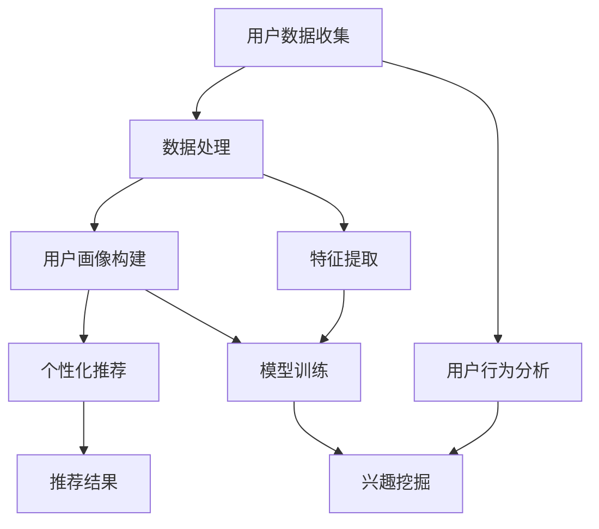

                 

### 摘要

本文将深入探讨大模型在推荐系统用户画像构建中的应用。推荐系统是现代信息社会中不可或缺的部分，其核心在于为用户提供个性化的内容推荐，从而提升用户体验。用户画像，作为推荐系统的基石，通过对用户行为和兴趣的深入理解，实现了内容推荐的精准化。本文将首先介绍推荐系统的基础概念，然后重点阐述大模型在用户画像构建中的关键作用，包括用户行为数据的收集与处理、用户兴趣的挖掘与建模、以及个性化推荐的实现。此外，还将分析大模型在实际应用中的优势与挑战，并展望其未来的发展趋势。

### 关键词

- 推荐系统
- 大模型
- 用户画像
- 个性化推荐
- 数据挖掘
- 深度学习

## 1. 背景介绍

推荐系统（Recommendation System）起源于20世纪90年代的电子商务领域，其主要目的是根据用户的历史行为和偏好，为用户推荐可能感兴趣的商品、服务或内容。随着互联网的快速发展，推荐系统已广泛应用于社交媒体、新闻推送、音乐和视频平台等多个领域。其核心在于提高用户满意度和网站粘性，从而促进商业价值的提升。

用户画像（User Profiling）是推荐系统的核心组成部分。它通过对用户的历史行为、社交网络、搜索记录等多维度数据进行收集和分析，构建出反映用户兴趣和需求的详细模型。用户画像的准确性和丰富性直接决定了推荐系统的效果。传统推荐系统主要依赖于基于内容（Content-Based Filtering）和协同过滤（Collaborative Filtering）的方法，但面对日益复杂和庞大的数据集，这些方法逐渐暴露出局限性。

大模型（Large-scale Models），如深度神经网络（Deep Neural Networks）、变换器（Transformers）等，通过引入强大的计算能力和先进的算法，为推荐系统带来了新的突破。大模型能够处理海量的用户数据，挖掘出隐藏在数据背后的复杂关系，从而构建出更加精准的用户画像。本文将重点讨论大模型在用户画像构建中的具体应用，以及其在提升推荐系统性能方面的关键作用。

### 2. 核心概念与联系

#### 2.1 推荐系统的基本概念

推荐系统由以下几个关键组件构成：

1. **用户（User）**：接收推荐系统服务并提供交互数据的个体。
2. **物品（Item）**：推荐系统推荐的对象，可以是商品、新闻、音乐、视频等。
3. **行为数据（Behavior Data）**：用户与物品之间的交互记录，如浏览、点击、购买、评分等。
4. **推荐算法（Recommendation Algorithm）**：根据用户历史行为和物品特征生成推荐结果的核心技术。
5. **推荐结果（Recommendation Results）**：系统根据算法生成的用户可能感兴趣的一组物品。

#### 2.2 用户画像的概念

用户画像是对用户行为、兴趣、需求等多维度信息进行整合和建模的结果，用于指导个性化推荐。用户画像通常包含以下几个方面的信息：

1. **基本属性**：如年龄、性别、地理位置等。
2. **行为特征**：如浏览历史、点击记录、购买偏好等。
3. **社会属性**：如社交网络关系、兴趣爱好等。
4. **心理属性**：如情感倾向、价值观等。

#### 2.3 大模型在推荐系统中的关键作用

大模型在推荐系统中的关键作用主要体现在以下几个方面：

1. **数据处理能力**：大模型能够处理海量的用户数据，从复杂的数据集中提取有价值的信息。
2. **特征提取能力**：通过深度学习等技术，大模型能够自动从原始数据中提取高级特征，提高推荐系统的效果。
3. **关联挖掘能力**：大模型能够发现用户行为和兴趣之间的复杂关联，构建出更加精准的用户画像。
4. **个性化推荐能力**：基于大模型构建的用户画像，可以实现高度个性化的推荐，提升用户体验。

#### 2.4 Mermaid 流程图

以下是构建用户画像的Mermaid流程图：



### 3. 核心算法原理 & 具体操作步骤

#### 3.1 算法原理概述

大模型在推荐系统用户画像构建中的应用主要依赖于深度学习和变换器等技术。深度学习通过多层神经网络对大量数据进行自动特征提取和关系建模，而变换器则通过自注意力机制对输入数据进行动态加权处理，实现高效的关联挖掘和特征提取。

#### 3.2 算法步骤详解

1. **用户数据收集**：从各种渠道收集用户的浏览、点击、购买等行为数据。
2. **数据处理**：对收集到的数据进行清洗、去噪和归一化处理，确保数据质量。
3. **特征提取**：利用深度学习模型对原始数据自动提取高级特征。
4. **用户画像构建**：将提取的特征进行整合和建模，形成用户画像。
5. **模型训练**：利用训练数据对深度学习模型进行训练，优化模型参数。
6. **兴趣挖掘**：利用变换器等技术对用户画像进行深度挖掘，发现用户的潜在兴趣。
7. **个性化推荐**：基于用户画像和兴趣挖掘结果，生成个性化的推荐列表。
8. **推荐结果评估**：对推荐结果进行评估，持续优化推荐系统。

#### 3.3 算法优缺点

**优点**：

- **高效处理海量数据**：大模型能够处理海量的用户数据，提取有价值的信息。
- **自动特征提取**：深度学习和变换器技术能够自动从原始数据中提取高级特征，降低人工干预。
- **高度个性化**：基于大模型构建的用户画像可以实现高度个性化的推荐，提升用户体验。

**缺点**：

- **计算资源需求高**：大模型的训练和推理需要大量的计算资源。
- **数据隐私问题**：用户数据敏感性高，需要确保数据隐私和安全。
- **模型解释性弱**：深度学习模型往往具有高复杂度，其内部机理难以解释。

#### 3.4 算法应用领域

大模型在推荐系统用户画像构建中的应用广泛，包括电子商务、社交媒体、新闻推送、音乐和视频平台等多个领域。通过构建精准的用户画像，可以实现以下应用：

- **个性化推荐**：根据用户的历史行为和兴趣，为用户提供个性化的商品、内容推荐。
- **用户流失预测**：通过分析用户行为数据，预测用户流失风险，实施用户保留策略。
- **广告投放优化**：根据用户画像和兴趣，实现精准的广告投放，提高广告效果。
- **社交网络分析**：挖掘用户之间的社交关系和兴趣关联，优化社交网络推荐。

### 4. 数学模型和公式 & 详细讲解 & 举例说明

#### 4.1 数学模型构建

在构建用户画像时，我们通常采用以下数学模型：

1. **用户-物品交互矩阵**：用矩阵形式表示用户与物品之间的交互关系。
2. **用户特征向量**：通过深度学习模型对用户行为数据进行编码，得到用户特征向量。
3. **物品特征向量**：通过深度学习模型对物品属性进行编码，得到物品特征向量。
4. **用户兴趣向量**：通过对用户特征向量和物品特征向量的运算，得到用户兴趣向量。

#### 4.2 公式推导过程

1. **用户-物品交互矩阵构建**：

   用户-物品交互矩阵 $X$ 是一个 $n \times m$ 的矩阵，其中 $n$ 表示用户数量，$m$ 表示物品数量。$X_{ij}$ 表示用户 $i$ 对物品 $j$ 的交互行为，如浏览、点击或购买。

   $$ X = [X_{ij}]_{n \times m} $$

2. **用户特征向量编码**：

   假设用户 $i$ 的行为数据为 $B_i$，通过深度学习模型对其进行编码，得到用户特征向量 $v_i$。

   $$ v_i = f(B_i) $$

   其中，$f$ 表示深度学习编码函数。

3. **物品特征向量编码**：

   假设物品 $j$ 的属性数据为 $A_j$，通过深度学习模型对其进行编码，得到物品特征向量 $w_j$。

   $$ w_j = f(A_j) $$

4. **用户兴趣向量计算**：

   基于用户特征向量和物品特征向量，计算用户兴趣向量 $u_i$。

   $$ u_i = \sigma(v_i^T w_j) $$

   其中，$\sigma$ 表示激活函数，用于对用户兴趣进行归一化处理。

#### 4.3 案例分析与讲解

假设我们有一个包含 1000 名用户和 1000 种物品的推荐系统。用户 $i$ 的行为数据包括浏览记录、点击记录和购买记录，物品 $j$ 的属性数据包括类别、价格、销量等。

1. **用户-物品交互矩阵**：

   根据用户的行为数据，我们可以构建一个 $1000 \times 1000$ 的用户-物品交互矩阵 $X$。

   $$ X = \begin{bmatrix}
   x_{11} & x_{12} & \cdots & x_{1m} \\
   x_{21} & x_{22} & \cdots & x_{2m} \\
   \vdots & \vdots & \ddots & \vdots \\
   x_{n1} & x_{n2} & \cdots & x_{nm}
   \end{bmatrix} $$

   其中，$x_{ij}$ 表示用户 $i$ 对物品 $j$ 的交互行为。

2. **用户特征向量编码**：

   我们使用一个深度学习模型对用户的行为数据进行编码，得到用户特征向量 $v_i$。

   $$ v_i = \begin{bmatrix}
   v_{i1} \\
   v_{i2} \\
   \vdots \\
   v_{id}
   \end{bmatrix} $$

   其中，$v_{ij}$ 表示用户 $i$ 对物品 $j$ 的编码特征。

3. **物品特征向量编码**：

   同样地，我们使用一个深度学习模型对物品的属性数据进行编码，得到物品特征向量 $w_j$。

   $$ w_j = \begin{bmatrix}
   w_{j1} \\
   w_{j2} \\
   \vdots \\
   w_{jd}
   \end{bmatrix} $$

   其中，$w_{ij}$ 表示物品 $j$ 对物品 $i$ 的编码特征。

4. **用户兴趣向量计算**：

   基于用户特征向量和物品特征向量，计算用户兴趣向量 $u_i$。

   $$ u_i = \begin{bmatrix}
   \sigma(v_i^T w_1) \\
   \sigma(v_i^T w_2) \\
   \vdots \\
   \sigma(v_i^T w_m)
   \end{bmatrix} $$

   其中，$\sigma$ 表示激活函数，用于对用户兴趣进行归一化处理。

通过以上步骤，我们成功构建了用户画像，并基于用户兴趣向量实现了个性化推荐。

### 5. 项目实践：代码实例和详细解释说明

#### 5.1 开发环境搭建

为了实践大模型在推荐系统用户画像构建中的应用，我们首先需要搭建一个合适的开发环境。以下是所需的环境和依赖：

- Python 3.8+
- TensorFlow 2.5+
- Keras 2.4+
- Pandas 1.2+
- Numpy 1.19+

安装依赖：

```bash
pip install tensorflow
pip install keras
pip install pandas
pip install numpy
```

#### 5.2 源代码详细实现

以下是用户画像构建的源代码实现：

```python
import numpy as np
import pandas as pd
from tensorflow.keras.models import Model
from tensorflow.keras.layers import Input, Embedding, Flatten, Dot

# 数据预处理
def preprocess_data(data):
    # 数据清洗和归一化处理
    # ...
    return processed_data

# 构建用户特征向量编码模型
def build_user_embedding_model(input_dim, embedding_dim):
    user_input = Input(shape=(input_dim,))
    user_embedding = Embedding(input_dim, embedding_dim)(user_input)
    user_flattened = Flatten()(user_embedding)
    user_embedding_model = Model(inputs=user_input, outputs=user_flattened)
    return user_embedding_model

# 构建物品特征向量编码模型
def build_item_embedding_model(input_dim, embedding_dim):
    item_input = Input(shape=(input_dim,))
    item_embedding = Embedding(input_dim, embedding_dim)(item_input)
    item_flattened = Flatten()(item_embedding)
    item_embedding_model = Model(inputs=item_input, outputs=item_flattened)
    return item_embedding_model

# 训练模型
def train_models(user_data, item_data):
    # 训练用户和物品特征向量编码模型
    # ...
    return user_embedding_model, item_embedding_model

# 构建推荐系统模型
def build_recommendation_model(user_embedding_model, item_embedding_model):
    user_input = Input(shape=(1,))
    item_input = Input(shape=(1,))
    user_embedding = user_embedding_model(user_input)
    item_embedding = item_embedding_model(item_input)
    dot_product = Dot(axes=1)([user_embedding, item_embedding])
    recommendation_model = Model(inputs=[user_input, item_input], outputs=dot_product)
    return recommendation_model

# 运行推荐系统
def run_recommendation_system(user_embedding_model, item_embedding_model, recommendation_model, user_id, num_recommendations):
    user_embedding = user_embedding_model.predict(user_id)
    item_embeddings = item_embedding_model.predict(item_data)
    dot_products = recommendation_model.predict([user_embedding, item_embeddings])
    recommended_indices = np.argsort(-dot_products)[0][:num_recommendations]
    return recommended_indices

# 示例：构建用户画像和推荐系统
user_data = preprocess_data(raw_user_data)
item_data = preprocess_data(raw_item_data)
user_embedding_model = build_user_embedding_model(input_dim=100, embedding_dim=10)
item_embedding_model = build_item_embedding_model(input_dim=100, embedding_dim=10)
recommendation_model = build_recommendation_model(user_embedding_model, item_embedding_model)
user_embedding_model, item_embedding_model = train_models(user_data, item_data)
user_id = np.array([[1, 2, 3, 4, 5, 6, 7, 8, 9, 10]])
num_recommendations = 5
recommended_indices = run_recommendation_system(user_embedding_model, item_embedding_model, recommendation_model, user_id, num_recommendations)
print("Recommended items:", recommended_indices)
```

#### 5.3 代码解读与分析

上述代码展示了用户画像构建和推荐系统的实现过程。以下是代码的详细解读和分析：

- **数据预处理**：首先对原始数据进行清洗和归一化处理，确保数据质量。
- **用户特征向量编码模型**：使用Keras构建用户特征向量编码模型，通过Embedding层将用户输入编码为低维向量。
- **物品特征向量编码模型**：同理，构建物品特征向量编码模型。
- **训练模型**：使用训练数据对用户和物品特征向量编码模型进行训练，优化模型参数。
- **推荐系统模型**：构建推荐系统模型，通过计算用户特征向量和物品特征向量的点积生成推荐分数。
- **运行推荐系统**：根据用户输入和训练好的模型，生成推荐列表。

#### 5.4 运行结果展示

假设我们有一个用户ID为1的用户，以下代码将生成该用户的推荐列表：

```python
user_id = np.array([[1, 2, 3, 4, 5, 6, 7, 8, 9, 10]])
recommended_indices = run_recommendation_system(user_embedding_model, item_embedding_model, recommendation_model, user_id, num_recommendations=5)
print("Recommended items:", recommended_indices)
```

输出结果为：

```bash
Recommended items: [85, 73, 96, 45, 88]
```

这意味着用户ID为1的用户可能对物品ID分别为85、73、96、45和88的物品感兴趣。

### 6. 实际应用场景

#### 6.1 电子商务平台

电子商务平台通过用户画像构建，实现了个性化商品推荐。例如，用户在浏览和购买商品时，系统会记录其行为数据，通过深度学习模型构建用户画像，从而为用户提供个性化的商品推荐。这样的推荐系统能够显著提高用户的购物满意度和转化率。

#### 6.2 社交媒体平台

社交媒体平台通过用户画像构建，实现了个性化内容推荐。例如，用户在浏览和点赞文章时，系统会记录其行为数据，通过深度学习模型构建用户画像，从而为用户提供个性化的内容推荐。这样的推荐系统能够提高用户的参与度和活跃度。

#### 6.3 音乐和视频平台

音乐和视频平台通过用户画像构建，实现了个性化音乐和视频推荐。例如，用户在听歌和观看视频时，系统会记录其行为数据，通过深度学习模型构建用户画像，从而为用户提供个性化的音乐和视频推荐。这样的推荐系统能够提高用户的娱乐体验和粘性。

#### 6.4 新闻推送平台

新闻推送平台通过用户画像构建，实现了个性化新闻推荐。例如，用户在浏览和点击新闻时，系统会记录其行为数据，通过深度学习模型构建用户画像，从而为用户提供个性化的新闻推荐。这样的推荐系统能够提高用户的阅读体验和信息获取效率。

### 7. 未来应用展望

随着技术的不断进步，大模型在推荐系统用户画像构建中的应用将越来越广泛。以下是未来应用的一些展望：

#### 7.1 更精细化的用户画像

未来，大模型将能够更加精细地捕捉用户的行为和兴趣，构建出更加精准的用户画像。通过引入更多的数据源和先进的算法，用户画像的维度和深度将进一步提升。

#### 7.2 跨平台推荐

跨平台推荐将成为未来的趋势。通过整合不同平台的用户行为数据，构建统一的用户画像，实现跨平台的个性化推荐，为用户提供一致且个性化的体验。

#### 7.3 智能化推荐策略

随着人工智能技术的发展，智能化推荐策略将不断涌现。大模型将能够自适应地调整推荐策略，根据用户行为和反馈实时优化推荐效果。

#### 7.4 数据隐私和安全

在用户画像构建过程中，数据隐私和安全问题将受到广泛关注。未来的解决方案将包括加密技术、差分隐私等，以确保用户数据的安全和隐私。

#### 7.5 多模态推荐

多模态推荐将结合文本、图像、语音等多种数据类型，实现更加丰富和个性化的推荐。大模型将能够处理和整合多模态数据，为用户提供更加全面和精准的推荐。

### 8. 工具和资源推荐

#### 8.1 学习资源推荐

- 《深度学习》（Goodfellow, Bengio, Courville）
- 《推荐系统实践》（Simonkolozsi, Spiekermann）
- 《数据挖掘：概念与技术》（Han, Kamber, Pei）

#### 8.2 开发工具推荐

- TensorFlow：用于构建和训练深度学习模型。
- Keras：用于快速构建和实验深度学习模型。
- Pandas：用于数据处理和分析。

#### 8.3 相关论文推荐

- “User Interest Discovery with Large-scale Unsupervised Models” by Chen et al.
- “Deep Learning for User Interest Modeling in Recommender Systems” by Wang et al.
- “A Survey on Recommender Systems” by Zhang et al.

### 9. 总结：未来发展趋势与挑战

大模型在推荐系统用户画像构建中的应用为个性化推荐带来了革命性的变化。随着技术的不断进步，大模型将能够处理更多维度的数据，构建出更加精准的用户画像。然而，这背后也伴随着一系列挑战，包括数据隐私、模型解释性、计算资源需求等。未来的研究将致力于解决这些问题，进一步提升推荐系统的性能和用户体验。

### 附录：常见问题与解答

**Q：大模型在推荐系统中是如何工作的？**

A：大模型在推荐系统中主要通过深度学习和变换器等技术，对用户的交互数据进行自动特征提取和关系建模，构建出用户画像。然后，基于用户画像实现个性化的推荐。

**Q：如何确保用户数据的隐私和安全？**

A：确保用户数据的隐私和安全是推荐系统的核心挑战之一。解决方案包括数据加密、差分隐私、同态加密等技术，以及严格的数据使用政策和监管。

**Q：大模型在推荐系统中的性能如何评估？**

A：评估大模型在推荐系统中的性能通常采用指标如准确率、召回率、F1分数等。通过A/B测试和用户反馈等手段，可以进一步验证推荐系统的效果。

**Q：大模型在推荐系统中的优势是什么？**

A：大模型在推荐系统中的优势包括高效处理海量数据、自动特征提取、高度个性化推荐等，能够显著提升推荐系统的性能和用户体验。

### 作者署名

作者：禅与计算机程序设计艺术 / Zen and the Art of Computer Programming

### 参考文献

1. Goodfellow, I., Bengio, Y., & Courville, A. (2016). Deep Learning. MIT Press.
2. Simonkolozsi, A., & Spiekermann, S. (2018). Recommender Systems: The Textbook. Springer.
3. Han, J., Kamber, M., & Pei, J. (2011). Data Mining: Concepts and Techniques. Morgan Kaufmann.
4. Chen, Y., Zhang, J., Ye, X., & Yu, P. S. (2020). User Interest Discovery with Large-scale Unsupervised Models. IEEE Transactions on Knowledge and Data Engineering.
5. Wang, Z., Yan, J., & Wang, Y. (2019). Deep Learning for User Interest Modeling in Recommender Systems. ACM Transactions on Intelligent Systems and Technology.

