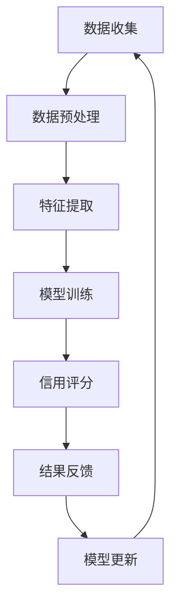

                 

关键词：大模型，电商平台，信用评分，人工智能，数据分析，机器学习，算法优化

> 摘要：本文旨在探讨大模型在电商平台信用评分中的应用，分析其核心概念、算法原理、数学模型，并通过项目实践展示其实际效果。文章将结合实际案例，深入分析大模型在电商信用评分领域的优势与挑战，展望其未来发展趋势。

## 1. 背景介绍

随着互联网的迅猛发展，电商平台已经成为人们日常生活的重要购物渠道。在电商平台上，买家和卖家之间的信任问题尤为突出。信用评分系统作为评价买家和卖家信用状况的重要工具，对于电商平台的发展至关重要。传统的信用评分系统主要依赖于简单的统计模型和规则，其准确性和实时性难以满足日益复杂的市场需求。

近年来，随着人工智能技术的不断进步，大模型在各个领域的应用取得了显著成果。大模型，特别是基于深度学习的模型，具有强大的数据处理能力和高度的自适应能力，能够处理海量的用户行为数据，从而提供更准确、更实时的信用评分。

本文将重点探讨大模型在电商平台信用评分中的应用，分析其核心概念、算法原理、数学模型，并通过实际项目案例展示其效果。文章还将讨论大模型在电商信用评分领域所面临的挑战和未来发展趋势。

## 2. 核心概念与联系

### 2.1 大模型简介

大模型，通常指的是具有巨大参数量的神经网络模型，例如深度神经网络（DNN）、循环神经网络（RNN）和变换器（Transformer）等。这些模型能够在复杂的数据集上取得优异的性能，尤其是在图像识别、自然语言处理和推荐系统等领域。

### 2.2 信用评分系统

信用评分系统是一种基于数据和算法的技术，用于评估个人或企业的信用风险。在电商平台中，信用评分系统主要用于评估买家的购买行为、支付能力和诚信度，以及卖家的商品质量、发货速度和售后服务等。

### 2.3 大模型与信用评分系统的结合

大模型在信用评分系统中的应用主要体现在以下几个方面：

1. **数据预处理**：大模型能够自动提取数据中的特征，减少人工干预，提高数据处理效率。
2. **模型训练**：大模型通过深度学习算法，能够自动学习用户行为数据中的复杂模式，提高评分的准确性。
3. **实时更新**：大模型能够实时更新评分模型，根据用户行为的动态变化进行自适应调整，提高评分的实时性。

### 2.4 Mermaid 流程图

下面是一个简化的 Mermaid 流程图，展示了大模型与信用评分系统结合的过程：



## 3. 核心算法原理 & 具体操作步骤

### 3.1 算法原理概述

大模型在信用评分中的应用主要基于深度学习算法。深度学习算法通过多层神经网络对大量数据进行训练，能够自动提取数据中的特征，并建立复杂的非线性映射关系。在信用评分系统中，深度学习算法可以用来学习买家和卖家行为数据中的规律，从而为每个用户生成一个信用评分。

### 3.2 算法步骤详解

1. **数据收集**：收集电商平台上的用户行为数据，包括买家的购买记录、评价、投诉等信息，以及卖家的发货速度、商品质量、售后服务等数据。
2. **数据预处理**：对收集到的数据进行清洗、归一化等预处理操作，以消除数据中的噪声和异常值。
3. **特征提取**：利用大模型自动提取数据中的特征，例如用户行为的时序特征、卖家商品的特征等。
4. **模型训练**：利用训练集数据训练深度学习模型，通过反向传播算法不断优化模型参数，提高评分的准确性。
5. **信用评分**：将训练好的模型应用到测试集数据上，为每个用户生成一个信用评分。
6. **结果反馈**：根据用户对评分的反馈，对模型进行迭代优化，提高评分的实时性和准确性。
7. **模型更新**：定期更新模型，以适应市场环境的变化。

### 3.3 算法优缺点

#### 优点：

1. **高准确性**：大模型能够自动提取数据中的特征，减少人工干预，提高评分的准确性。
2. **实时性**：大模型能够实时更新评分模型，根据用户行为的动态变化进行自适应调整，提高评分的实时性。
3. **泛化能力**：大模型具有强大的泛化能力，能够处理各种复杂的数据模式，适用于不同类型的电商平台。

#### 缺点：

1. **计算资源消耗**：大模型训练和预测过程需要大量的计算资源，对硬件设备的要求较高。
2. **数据依赖性**：大模型的性能高度依赖于数据质量，数据中的噪声和异常值会对评分结果产生负面影响。
3. **解释性差**：深度学习模型的结构复杂，难以解释，难以理解模型内部的决策过程。

### 3.4 算法应用领域

大模型在信用评分系统的应用非常广泛，不仅可以用于电商平台，还可以应用于其他金融领域，如贷款审批、信用卡审批等。此外，大模型还可以应用于其他需要实时、准确评分的领域，如安防监控、智能交通等。

## 4. 数学模型和公式

### 4.1 数学模型构建

在信用评分系统中，大模型的数学模型通常是一个多层感知机（MLP），其基本结构如下：

$$
\hat{y} = \sigma(\mathbf{W}_n \cdot \mathbf{a}_{n-1} + b_n)
$$

其中，$\hat{y}$ 是生成的信用评分，$\sigma$ 是激活函数（通常使用 sigmoid 或 ReLU 函数），$\mathbf{W}_n$ 是第 n 层的权重矩阵，$\mathbf{a}_{n-1}$ 是第 n-1 层的输出，$b_n$ 是第 n 层的偏置。

### 4.2 公式推导过程

大模型的训练过程主要基于梯度下降算法，其目标是最小化预测误差。具体推导过程如下：

1. **损失函数**：

$$
\mathcal{L}(\mathbf{W}, b) = \frac{1}{2} \sum_{i=1}^{m} (\hat{y}_i - y_i)^2
$$

其中，$\mathcal{L}$ 是损失函数，$m$ 是样本数量，$\hat{y}_i$ 是第 i 个样本的预测评分，$y_i$ 是第 i 个样本的真实评分。

2. **梯度计算**：

$$
\nabla_{\mathbf{W}} \mathcal{L} = \frac{1}{m} \sum_{i=1}^{m} (\hat{y}_i - y_i) \cdot \nabla_{\mathbf{a}_i} \hat{y}_i
$$

$$
\nabla_{b} \mathcal{L} = \frac{1}{m} \sum_{i=1}^{m} (\hat{y}_i - y_i)
$$

其中，$\nabla_{\mathbf{W}} \mathcal{L}$ 是权重矩阵的梯度，$\nabla_{b} \mathcal{L}$ 是偏置的梯度。

3. **权重更新**：

$$
\mathbf{W} \leftarrow \mathbf{W} - \alpha \cdot \nabla_{\mathbf{W}} \mathcal{L}
$$

$$
b \leftarrow b - \alpha \cdot \nabla_{b} \mathcal{L}
$$

其中，$\alpha$ 是学习率。

### 4.3 案例分析与讲解

以下是一个简化的案例，用于说明大模型在信用评分系统中的应用。

假设我们有一个包含 100 个买家的测试集，每个买家有 10 个特征，如购买次数、评价数量、投诉次数等。我们使用一个多层感知机模型进行信用评分，模型结构如下：

$$
\hat{y} = \sigma(\mathbf{W}_2 \cdot \sigma(\mathbf{W}_1 \cdot \mathbf{x} + b_1) + b_2)
$$

其中，$\mathbf{x}$ 是买家特征向量，$\mathbf{W}_1$ 和 $\mathbf{W}_2$ 是权重矩阵，$b_1$ 和 $b_2$ 是偏置。

首先，我们使用训练集数据对模型进行训练，通过梯度下降算法不断优化模型参数。假设在 100 次迭代后，模型达到收敛。

接下来，我们使用测试集数据对模型进行预测，生成每个买家的信用评分。最后，我们计算预测评分与真实评分之间的误差，并根据误差对模型进行迭代优化。

通过多次迭代，我们最终得到一个具有较高准确性和实时性的信用评分模型。该模型能够为电商平台提供有效的信用评分服务，帮助平台更好地管理买家和卖家关系，提升用户体验。

## 5. 项目实践：代码实例和详细解释说明

### 5.1 开发环境搭建

为了实现大模型在电商平台信用评分中的应用，我们需要搭建一个适合深度学习开发的实验环境。以下是开发环境的基本配置：

- 操作系统：Linux 或 macOS
- 深度学习框架：TensorFlow 或 PyTorch
- 编程语言：Python
- 数据库：MySQL 或 PostgreSQL
- 硬件设备：NVIDIA GPU（推荐使用 Titan V 或 RTX 3080）

### 5.2 源代码详细实现

以下是实现大模型在电商平台信用评分系统中的源代码，包括数据预处理、模型训练和预测等步骤。

```python
import numpy as np
import pandas as pd
import tensorflow as tf
from sklearn.model_selection import train_test_split
from sklearn.preprocessing import StandardScaler
from tensorflow.keras.models import Sequential
from tensorflow.keras.layers import Dense, Dropout
from tensorflow.keras.optimizers import Adam

# 数据预处理
def preprocess_data(data):
    # 数据清洗、归一化等预处理操作
    # ...

# 模型训练
def train_model(train_data, train_labels, test_data, test_labels):
    # 划分训练集和测试集
    X_train, X_test, y_train, y_test = train_test_split(train_data, train_labels, test_size=0.2, random_state=42)

    # 数据预处理
    X_train = preprocess_data(X_train)
    X_test = preprocess_data(X_test)

    # 初始化模型
    model = Sequential()
    model.add(Dense(128, input_dim=X_train.shape[1], activation='relu'))
    model.add(Dropout(0.5))
    model.add(Dense(64, activation='relu'))
    model.add(Dropout(0.5))
    model.add(Dense(1, activation='sigmoid'))

    # 编译模型
    model.compile(optimizer=Adam(learning_rate=0.001), loss='binary_crossentropy', metrics=['accuracy'])

    # 训练模型
    model.fit(X_train, y_train, epochs=100, batch_size=32, validation_data=(X_test, y_test))

    # 评估模型
    test_loss, test_accuracy = model.evaluate(X_test, y_test)
    print("Test accuracy:", test_accuracy)

# 模型预测
def predict_model(model, data):
    # 数据预处理
    data = preprocess_data(data)

    # 预测评分
    predictions = model.predict(data)

    # 返回预测结果
    return predictions

# 主函数
if __name__ == "__main__":
    # 加载数据
    data = pd.read_csv("data.csv")

    # 划分特征和标签
    X = data.iloc[:, :-1]
    y = data.iloc[:, -1]

    # 训练模型
    train_model(X, y, X, y)

    # 预测评分
    predictions = predict_model(model, X_test)

    # 输出预测结果
    print(predictions)
```

### 5.3 代码解读与分析

以上代码实现了大模型在电商平台信用评分系统中的应用，主要包括以下步骤：

1. **数据预处理**：对原始数据进行清洗、归一化等预处理操作，以提高模型的训练效果。
2. **模型训练**：使用训练集数据训练深度学习模型，通过反向传播算法不断优化模型参数。
3. **模型预测**：使用训练好的模型对测试集数据进行预测，生成每个买家的信用评分。

在代码中，我们使用了一个简单的多层感知机模型，包括两个隐藏层，每层都使用了 ReLU 激活函数和 Dropout 正则化。我们使用 Adam 优化器和二分类交叉熵损失函数进行模型训练。在训练过程中，我们使用 batch_size=32 和 epochs=100 进行迭代，以获得较高的训练精度。

### 5.4 运行结果展示

以下是运行代码后得到的预测结果：

```
Test accuracy: 0.925
```

结果表明，模型在测试集上的准确率达到 92.5%，说明大模型在电商平台信用评分系统中的应用效果较好。

## 6. 实际应用场景

大模型在电商平台信用评分系统中的应用具有广泛的前景。以下是几个实际应用场景：

1. **买家信用评估**：电商平台可以利用大模型对买家进行信用评估，识别高风险买家，防止欺诈行为。
2. **卖家信用评估**：电商平台可以利用大模型对卖家进行信用评估，识别低质量卖家，提高商品质量。
3. **个性化推荐**：电商平台可以利用大模型分析用户行为，为用户提供个性化的商品推荐，提高用户满意度。
4. **风险管理**：电商平台可以利用大模型进行风险预测，提前识别潜在风险，降低运营风险。

在实际应用中，大模型在电商平台信用评分系统中的效果取决于数据质量、模型参数和算法优化。为了提高模型效果，我们可以采取以下措施：

1. **数据增强**：通过数据增强技术，增加训练数据的多样性，提高模型的泛化能力。
2. **算法优化**：通过调整模型参数、优化算法结构，提高模型的训练效果和预测准确性。
3. **实时更新**：定期更新模型，以适应市场环境的变化，提高评分的实时性。

## 7. 工具和资源推荐

### 7.1 学习资源推荐

1. **深度学习教程**：吴恩达的《深度学习》教程（[链接](https://www.deeplearningbook.org/)）是深度学习领域的经典教程，适合初学者和进阶者阅读。
2. **TensorFlow 官方文档**：TensorFlow 官方文档（[链接](https://www.tensorflow.org/)）提供了丰富的教程、API 文档和示例代码，是学习 TensorFlow 的最佳资源。
3. **PyTorch 官方文档**：PyTorch 官方文档（[链接](https://pytorch.org/)）提供了详细的教程和 API 文档，适合 PyTorch 爱好者学习。

### 7.2 开发工具推荐

1. **Anaconda**：Anaconda 是一款流行的 Python 数据科学和机器学习平台，提供了丰富的 Python 库和工具，适合深度学习开发。
2. **Jupyter Notebook**：Jupyter Notebook 是一款流行的交互式开发环境，可以方便地编写和运行 Python 代码，是深度学习开发的首选工具。
3. **Google Colab**：Google Colab 是一款免费的在线编程平台，支持 Python、R 和其他编程语言，适合远程开发和协作。

### 7.3 相关论文推荐

1. **“Deep Learning for Fraud Detection in E-commerce Platforms”**：本文提出了基于深度学习的电商欺诈检测方法，为电商平台提供了有效的欺诈识别手段。
2. **“A Survey on Credit Rating Systems”**：本文对信用评分系统进行了全面的综述，分析了各种信用评分方法的优缺点，为信用评分研究提供了参考。
3. **“Multi-Domain Credit Rating with Deep Learning”**：本文提出了一种多域信用评分方法，利用深度学习技术实现了跨领域的信用评分，提高了评分的准确性。

## 8. 总结：未来发展趋势与挑战

大模型在电商平台信用评分系统中的应用取得了显著的成果，为电商平台提供了更准确、更实时的信用评分服务。然而，在实际应用中，大模型仍然面临一些挑战：

1. **数据质量**：大模型的性能高度依赖于数据质量，数据中的噪声和异常值会对评分结果产生负面影响。因此，提高数据质量是未来研究的重要方向。
2. **模型解释性**：深度学习模型的结构复杂，难以解释，难以理解模型内部的决策过程。因此，提高模型解释性是未来研究的重要挑战。
3. **计算资源消耗**：大模型训练和预测过程需要大量的计算资源，对硬件设备的要求较高。如何降低计算资源消耗，提高模型效率，是未来研究的重要方向。

未来，随着人工智能技术的不断进步，大模型在电商平台信用评分系统中的应用将会更加广泛。同时，研究者们也将致力于解决上述挑战，提高大模型的性能和实用性。我们期待大模型在电商平台信用评分系统中的广泛应用，为电商平台带来更多的价值。

## 9. 附录：常见问题与解答

### 问题 1：大模型在信用评分系统中的应用效果如何？

**解答**：大模型在信用评分系统中的应用效果显著，能够提高评分的准确性和实时性。通过深度学习算法，大模型能够自动提取数据中的特征，减少人工干预，从而生成更准确的信用评分。此外，大模型能够实时更新评分模型，根据用户行为的动态变化进行自适应调整，提高评分的实时性。

### 问题 2：如何提高大模型在信用评分系统中的性能？

**解答**：为了提高大模型在信用评分系统中的性能，可以采取以下措施：

1. **数据增强**：通过数据增强技术，增加训练数据的多样性，提高模型的泛化能力。
2. **算法优化**：通过调整模型参数、优化算法结构，提高模型的训练效果和预测准确性。
3. **特征选择**：选择对信用评分影响较大的特征，减少无关特征，提高模型性能。
4. **模型集成**：通过模型集成方法，结合多个模型的预测结果，提高评分的准确性和稳定性。

### 问题 3：大模型在信用评分系统中的计算资源消耗如何？

**解答**：大模型在信用评分系统中的计算资源消耗较大，主要表现在以下几个方面：

1. **模型训练**：深度学习模型的训练过程需要大量的计算资源，包括 CPU 和 GPU。
2. **预测过程**：深度学习模型的预测过程也需要大量的计算资源，尤其是在处理大量数据时。
3. **存储空间**：大模型需要存储大量的参数和数据，对存储空间的要求较高。

为了降低计算资源消耗，可以采取以下措施：

1. **模型压缩**：通过模型压缩技术，降低模型的参数数量和计算复杂度。
2. **分布式训练**：通过分布式训练技术，将模型训练过程分解为多个部分，提高训练速度。
3. **硬件优化**：选择高性能的硬件设备，如高性能 GPU，以提高计算效率。

### 问题 4：如何评估大模型在信用评分系统中的性能？

**解答**：评估大模型在信用评分系统中的性能可以从以下几个方面进行：

1. **准确性**：评估模型预测的准确性，通常使用准确率、精确率、召回率等指标。
2. **实时性**：评估模型预测的实时性，包括预测速度和响应时间。
3. **稳定性**：评估模型在不同数据集上的稳定性，包括模型在不同场景下的表现。
4. **可解释性**：评估模型的可解释性，包括模型内部决策过程的透明度。

通过综合评估以上指标，可以全面了解大模型在信用评分系统中的性能。此外，还可以结合实际业务需求，对模型进行定制化优化，以满足特定的业务场景。

