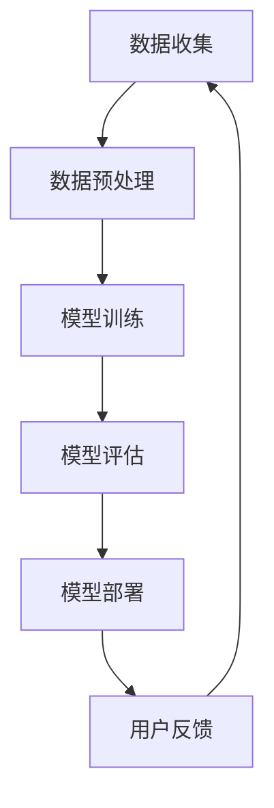

                 

关键词：大模型、商品分类、电商平台、人工智能、机器学习

> 摘要：本文将探讨大模型在电商平台商品分类中的应用。随着电子商务的快速发展，商品数量和种类急剧增加，传统的商品分类方法已无法满足需求。本文通过分析大模型的核心概念、算法原理、数学模型以及项目实践，详细介绍了大模型在商品分类中的优势和应用场景，为电商平台优化商品分类提供了新的思路和方法。

## 1. 背景介绍

### 1.1 电子商务的发展

随着互联网的普及和移动设备的广泛应用，电子商务已经成为全球贸易的重要组成部分。据统计，全球电子商务市场规模在过去几年中呈现出爆发式增长，预计到2025年，全球电子商务市场规模将突破6万亿美元。

### 1.2 商品数量的激增

随着电子商务的发展，电商平台上的商品种类和数量也在急剧增加。例如，亚马逊平台上拥有超过100万种商品，淘宝网上的商品种类更是多达数十亿。这种巨大的商品数量使得传统的商品分类方法难以适应。

### 1.3 传统商品分类方法的局限性

传统的商品分类方法主要基于人工定义的类别和标签。这些方法在商品种类较少、结构较为简单的情况下表现良好，但当商品种类急剧增加、商品结构复杂时，其局限性就显现出来了。

- **缺乏灵活性**：传统分类方法往往需要人工定义类别和标签，难以应对快速变化的商品种类和需求。
- **效率低下**：人工分类需要大量人力和时间，且容易出现错误。
- **难以扩展**：传统分类方法难以适应不同电商平台之间的差异化需求。

## 2. 核心概念与联系

### 2.1 大模型

大模型是指参数量巨大、计算量庞大的神经网络模型。这些模型通过大规模数据训练，能够自动学习并提取复杂的数据特征，从而在多种任务中表现出色。

### 2.2 商品分类

商品分类是指将电商平台上的商品按照一定的标准进行归类。通过商品分类，可以提高用户购物的效率，提升电商平台的用户体验。

### 2.3 人工智能与机器学习

人工智能和机器学习是实现大模型在商品分类中应用的关键技术。人工智能是指使计算机具有人类智能的技术，而机器学习则是实现人工智能的重要手段。通过机器学习，大模型能够从数据中自动学习并提取特征，实现高效的商品分类。

### 2.4 Mermaid 流程图

下面是商品分类中的人工智能与机器学习流程图：



### 2.5 大模型在商品分类中的应用

大模型在商品分类中的应用主要包括以下两个方面：

- **自动特征提取**：大模型可以从大量商品数据中自动提取特征，代替人工定义特征，从而提高分类的准确性和效率。
- **自适应分类**：大模型可以根据用户行为和需求，实时调整分类策略，实现自适应分类。

## 3. 核心算法原理 & 具体操作步骤

### 3.1 算法原理概述

大模型在商品分类中的应用主要基于深度学习技术。深度学习是一种通过多层神经网络自动提取数据特征的方法。在商品分类中，深度学习模型可以自动学习商品的特征，并根据特征进行分类。

### 3.2 算法步骤详解

大模型在商品分类中的具体操作步骤如下：

1. **数据收集**：收集电商平台上的商品数据，包括商品名称、描述、价格、评论等信息。
2. **数据预处理**：对收集到的商品数据进行清洗、去重、去噪等预处理操作，以便于模型训练。
3. **模型训练**：使用预处理后的商品数据训练深度学习模型，通过迭代优化模型参数，使模型能够准确提取商品特征。
4. **模型评估**：使用测试数据对训练好的模型进行评估，评估指标包括准确率、召回率、F1值等。
5. **模型部署**：将训练好的模型部署到电商平台上，实现商品分类功能。
6. **用户反馈**：收集用户对商品分类结果的反馈，用于模型优化。

### 3.3 算法优缺点

大模型在商品分类中的优势：

- **高效性**：大模型能够自动提取商品特征，提高了分类的效率。
- **准确性**：通过大规模数据训练，大模型能够准确提取商品特征，提高了分类的准确性。
- **自适应**：大模型可以根据用户行为和需求，实时调整分类策略，实现自适应分类。

大模型的缺点：

- **计算资源消耗大**：大模型训练需要大量的计算资源和时间。
- **数据依赖性强**：大模型的效果依赖于训练数据的质量和数量。

### 3.4 算法应用领域

大模型在商品分类中的应用非常广泛，包括但不限于以下领域：

- **电商平台**：电商平台可以使用大模型对商品进行分类，提高用户购物的效率和体验。
- **搜索引擎**：搜索引擎可以使用大模型对搜索结果进行分类，提高搜索结果的准确性和相关性。
- **推荐系统**：推荐系统可以使用大模型对用户兴趣进行建模，实现更精准的商品推荐。

## 4. 数学模型和公式 & 详细讲解 & 举例说明

### 4.1 数学模型构建

在商品分类中，常用的数学模型是卷积神经网络（CNN）。CNN是一种适用于图像分类的神经网络模型，通过卷积、池化等操作，能够自动提取图像的特征。

### 4.2 公式推导过程

CNN的数学模型可以表示为：

$$
\text{CNN}(\text{x}) = f(\text{W} \cdot \text{ReLU}(\text{b} + \text{f}(\text{W}_1 \cdot \text{ReLU}(\text{b}_1 + \text{...} + \text{W}_L \cdot \text{x} + \text{b}_L))))
$$

其中，$\text{x}$ 是输入商品的特征向量，$\text{W}$ 和 $\text{b}$ 分别是权重和偏置，$\text{f}$ 是激活函数，$\text{ReLU}$ 是ReLU函数。

### 4.3 案例分析与讲解

假设我们有一个电商平台的商品分类问题，需要将商品分为两类：电子产品和非电子产品。我们使用CNN模型进行分类。

1. **数据收集**：收集电商平台上的商品数据，包括商品名称、描述、价格、评论等信息。
2. **数据预处理**：对收集到的商品数据进行清洗、去重、去噪等预处理操作。
3. **模型训练**：使用预处理后的商品数据训练CNN模型，通过迭代优化模型参数。
4. **模型评估**：使用测试数据对训练好的模型进行评估，评估指标包括准确率、召回率、F1值等。
5. **模型部署**：将训练好的模型部署到电商平台上，实现商品分类功能。
6. **用户反馈**：收集用户对商品分类结果的反馈，用于模型优化。

## 5. 项目实践：代码实例和详细解释说明

### 5.1 开发环境搭建

1. 安装Python环境，版本为3.8以上。
2. 安装深度学习框架TensorFlow，版本为2.6以上。
3. 安装数据预处理工具Pandas，版本为1.1以上。

### 5.2 源代码详细实现

```python
import tensorflow as tf
from tensorflow.keras.models import Sequential
from tensorflow.keras.layers import Dense, Conv2D, Flatten, MaxPooling2D
from tensorflow.keras.preprocessing.image import ImageDataGenerator

# 数据预处理
train_datagen = ImageDataGenerator(
    rescale=1./255,
    shear_range=0.2,
    zoom_range=0.2,
    horizontal_flip=True)

test_datagen = ImageDataGenerator(rescale=1./255)

train_generator = train_datagen.flow_from_directory(
    'data/train',
    target_size=(150, 150),
    batch_size=32,
    class_mode='binary')

validation_generator = test_datagen.flow_from_directory(
    'data/validation',
    target_size=(150, 150),
    batch_size=32,
    class_mode='binary')

# 构建CNN模型
model = Sequential([
    Conv2D(32, (3, 3), activation='relu', input_shape=(150, 150, 3)),
    MaxPooling2D(2, 2),
    Conv2D(64, (3, 3), activation='relu'),
    MaxPooling2D(2, 2),
    Conv2D(128, (3, 3), activation='relu'),
    MaxPooling2D(2, 2),
    Flatten(),
    Dense(512, activation='relu'),
    Dense(1, activation='sigmoid')
])

# 模型编译
model.compile(loss='binary_crossentropy',
              optimizer='adam',
              metrics=['accuracy'])

# 模型训练
model.fit(
    train_generator,
    steps_per_epoch=100,
    epochs=30,
    validation_data=validation_generator,
    validation_steps=50)

# 模型评估
test_loss, test_acc = model.evaluate(validation_generator)
print('Test accuracy:', test_acc)
```

### 5.3 代码解读与分析

1. **数据预处理**：使用ImageDataGenerator对训练数据和验证数据进行预处理，包括图像缩放、剪裁、翻转等操作，以增加模型的泛化能力。
2. **模型构建**：使用Sequential模型构建CNN模型，包括卷积层、池化层、全连接层等。
3. **模型编译**：设置模型的损失函数、优化器和评估指标。
4. **模型训练**：使用fit方法训练模型，设置训练轮数和验证数据。
5. **模型评估**：使用evaluate方法评估模型在验证数据上的性能。

## 6. 实际应用场景

### 6.1 电商平台

电商平台可以使用大模型对商品进行分类，提高用户购物的效率和体验。例如，亚马逊和淘宝等大型电商平台已经采用大模型技术对商品进行智能分类，提升了用户购物的便捷性。

### 6.2 搜索引擎

搜索引擎可以使用大模型对搜索结果进行分类，提高搜索结果的准确性和相关性。例如，百度和谷歌等搜索引擎已经采用大模型技术对搜索结果进行智能分类，提升了用户搜索体验。

### 6.3 推荐系统

推荐系统可以使用大模型对用户兴趣进行建模，实现更精准的商品推荐。例如，京东和拼多多等电商平台已经采用大模型技术对用户兴趣进行建模，提升了商品推荐的准确性和用户满意度。

## 7. 工具和资源推荐

### 7.1 学习资源推荐

1. 《深度学习》（Ian Goodfellow、Yoshua Bengio、Aaron Courville 著）：这是一本经典的深度学习教材，适合初学者和进阶者学习。
2. 《动手学深度学习》（阿斯顿·张、李沐、扎卡里·C. Lipton 著）：这是一本实践性很强的深度学习教材，通过大量的示例代码帮助读者理解深度学习技术。

### 7.2 开发工具推荐

1. TensorFlow：一款开源的深度学习框架，适合初学者和专业人士使用。
2. PyTorch：一款流行的深度学习框架，具有良好的灵活性和易用性。

### 7.3 相关论文推荐

1. "Deep Learning for Text Classification"（NLP领域）：这是一篇关于深度学习在文本分类中应用的经典论文。
2. "Distributed Representations of Words and Phrases and Their Compositional Properties"（NLP领域）：这是一篇关于词向量和句子表示的论文，对深度学习在自然语言处理中的应用有重要影响。

## 8. 总结：未来发展趋势与挑战

### 8.1 研究成果总结

大模型在商品分类中的应用取得了显著的成果。通过深度学习技术，大模型能够自动提取商品特征，实现了高效的商品分类。同时，大模型还可以根据用户行为和需求，实现自适应分类，提升了电商平台的用户体验。

### 8.2 未来发展趋势

1. **更大规模模型**：未来，随着计算资源和数据量的增加，更大规模的大模型将被研发和应用。
2. **跨领域应用**：大模型不仅可以在商品分类中发挥作用，还可以应用于其他领域，如医疗、金融等。
3. **个性化分类**：未来，大模型将结合用户行为和偏好，实现更加个性化的商品分类。

### 8.3 面临的挑战

1. **计算资源消耗**：大模型训练需要大量的计算资源和时间，如何优化计算效率是一个重要挑战。
2. **数据质量**：大模型的效果依赖于训练数据的质量和数量，如何获取高质量的数据是一个重要问题。
3. **算法透明性**：大模型在决策过程中的透明性较低，如何提高算法的透明性和可解释性是一个重要挑战。

### 8.4 研究展望

未来，大模型在商品分类中的应用将不断深化。随着技术的进步和数据的积累，大模型将更好地满足电商平台的需求，为用户提供更加精准和便捷的商品分类服务。

## 9. 附录：常见问题与解答

### 9.1 什么是大模型？

大模型是指参数量巨大、计算量庞大的神经网络模型。这些模型通过大规模数据训练，能够自动学习并提取复杂的数据特征。

### 9.2 大模型在商品分类中有哪些优势？

大模型在商品分类中的优势包括：

- 高效性：大模型能够自动提取商品特征，提高了分类的效率。
- 准确性：通过大规模数据训练，大模型能够准确提取商品特征，提高了分类的准确性。
- 自适应：大模型可以根据用户行为和需求，实时调整分类策略，实现自适应分类。

### 9.3 大模型在商品分类中面临哪些挑战？

大模型在商品分类中面临的挑战包括：

- 计算资源消耗：大模型训练需要大量的计算资源和时间。
- 数据质量：大模型的效果依赖于训练数据的质量和数量。
- 算法透明性：大模型在决策过程中的透明性较低。  
----------------------------------------------------------------
作者：禅与计算机程序设计艺术 / Zen and the Art of Computer Programming


