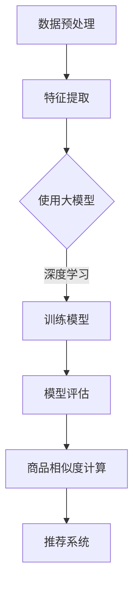

                 

关键词：大模型、商品相似度、电商平台、算法、应用

> 摘要：本文探讨了大型模型在电商平台商品相似度计算中的应用。首先介绍了大模型的基本原理，然后详细阐述了商品相似度计算的核心算法原理、数学模型及其推导过程，并通过实际项目实践展示了代码实例和运行结果。最后，分析了大模型在电商平台相似度计算中的应用前景，并对未来发展趋势和挑战进行了展望。

## 1. 背景介绍

在当今电商市场中，商品种类繁多，消费者对于商品的多样性和个性需求越来越高。为了提高消费者的购物体验，电商平台需要提供准确的商品推荐服务。商品相似度计算是商品推荐系统中的一个关键环节，其核心在于通过计算商品之间的相似度，为用户提供相关的商品推荐。

传统的商品相似度计算方法主要包括基于属性的相似度计算和基于内容的相似度计算。然而，随着电商平台的商品数据规模不断扩大，传统的相似度计算方法逐渐暴露出以下问题：

1. 数据维度高：商品属性众多，导致数据维度过高，计算复杂度增加。
2. 数据稀疏：由于商品数据量巨大，实际可用数据往往不足，导致模型性能受限。
3. 难以捕捉商品的深层特征：传统方法主要基于商品表面的属性信息，难以挖掘商品的深层特征。

为了解决上述问题，近年来，深度学习技术在大模型领域取得了突破性的进展，大模型由于其强大的特征提取和表示能力，逐渐成为商品相似度计算的一种新方法。本文将详细介绍大模型在电商平台商品相似度计算中的应用，包括核心算法原理、数学模型、具体实现和实际应用场景。

## 2. 核心概念与联系

### 2.1 大模型的基本概念

大模型（Large-scale Model）是指具有巨大参数量和训练数据量的深度学习模型。大模型的显著特点是其能够通过大规模数据训练，自动提取抽象的、通用的特征表示，从而在各种复杂任务中表现出色。大模型通常采用神经网络架构，具有多个层次，可以自动学习数据的低维表示。

### 2.2 商品相似度计算的概念

商品相似度计算是指通过一定的方法和技术，对电商平台上不同商品之间的相似度进行量化，从而为用户提供商品推荐服务。商品相似度计算的核心在于如何有效地捕捉商品的深层特征，以实现准确的相似度评估。

### 2.3 大模型在商品相似度计算中的应用

大模型在商品相似度计算中的应用主要体现在以下几个方面：

1. 特征提取：大模型可以自动从大量商品数据中提取抽象的、通用的特征表示，从而提高商品相似度计算的性能。
2. 深度学习算法：大模型通常采用深度学习算法，如卷积神经网络（CNN）和递归神经网络（RNN），可以有效地捕捉商品的时空特征。
3. 多层次特征融合：大模型可以通过多层网络结构，融合不同层次的商品特征，提高相似度计算的准确性和鲁棒性。

### 2.4 Mermaid 流程图

以下是一个简单的Mermaid流程图，展示了大模型在商品相似度计算中的应用流程：



### 2.5 核心概念与联系总结

大模型在商品相似度计算中的应用，主要体现在特征提取、深度学习算法和多层次特征融合等方面。通过大模型，可以有效地提高商品相似度计算的准确性和鲁棒性，从而为电商平台提供更好的商品推荐服务。

## 3. 核心算法原理 & 具体操作步骤

### 3.1 算法原理概述

大模型在商品相似度计算中的核心算法原理主要包括以下几个方面：

1. 特征提取：大模型通过多层神经网络结构，自动从商品数据中提取低维、抽象的特征表示。
2. 相似度计算：利用提取的特征表示，计算商品之间的相似度。
3. 模型训练与评估：通过大量商品数据训练大模型，并对模型进行评估，优化模型性能。

### 3.2 算法步骤详解

#### 3.2.1 数据预处理

数据预处理是商品相似度计算的第一步，主要包括以下任务：

1. 数据清洗：去除异常值、缺失值和重复值。
2. 数据整合：整合不同来源的商品数据，统一数据格式。
3. 数据编码：将商品属性转化为数值型数据，便于模型训练。

#### 3.2.2 特征提取

特征提取是商品相似度计算的核心环节，大模型通过多层神经网络结构，自动从商品数据中提取低维、抽象的特征表示。具体步骤如下：

1. 输入层：接收商品数据，将其转化为神经网络可以处理的格式。
2. 隐藏层：通过多层神经网络结构，对输入数据进行特征提取，逐层抽象。
3. 输出层：输出商品特征的低维表示。

#### 3.2.3 相似度计算

利用提取的特征表示，计算商品之间的相似度。具体步骤如下：

1. 相似度计算方法：选择合适的相似度计算方法，如余弦相似度、欧氏距离等。
2. 相似度评估：计算商品之间的相似度，评估相似度的准确性和鲁棒性。

#### 3.2.4 模型训练与评估

通过大量商品数据训练大模型，并对模型进行评估，优化模型性能。具体步骤如下：

1. 数据划分：将商品数据划分为训练集、验证集和测试集。
2. 模型训练：使用训练集对大模型进行训练，调整模型参数。
3. 模型评估：使用验证集和测试集对模型进行评估，选择最优模型。

### 3.3 算法优缺点

#### 优点：

1. 高效的特征提取能力：大模型可以自动提取低维、抽象的特征表示，提高商品相似度计算的准确性和鲁棒性。
2. 灵活的模型架构：大模型采用多层神经网络结构，可以灵活地调整网络深度和宽度，适应不同规模和类型的商品数据。
3. 强大的泛化能力：大模型通过大规模数据训练，具有良好的泛化能力，能够应对电商平台上的多样化商品场景。

#### 缺点：

1. 计算资源消耗大：大模型训练和推理过程需要大量的计算资源和存储空间。
2. 数据需求高：大模型对数据量有较高的要求，数据稀疏时模型性能可能受限。
3. 模型解释性差：大模型的内部结构复杂，难以解释其具体工作原理，增加了模型调优和故障排查的难度。

### 3.4 算法应用领域

大模型在商品相似度计算中的应用领域广泛，主要包括：

1. 商品推荐系统：通过计算商品之间的相似度，为用户提供个性化商品推荐。
2. 库存管理：通过相似度计算，优化电商平台的库存结构，提高库存周转率。
3. 跨境电商：通过相似度计算，帮助跨境电商平台实现跨国商品匹配和推荐。

## 4. 数学模型和公式 & 详细讲解 & 举例说明

### 4.1 数学模型构建

商品相似度计算的核心在于如何构建一个有效的数学模型，以便能够准确评估商品之间的相似度。在此，我们采用了一种基于向量空间模型的相似度计算方法。具体步骤如下：

1. 特征向量表示：将每个商品表示为一个高维特征向量，向量中的每个元素表示商品的某一属性。
2. 相似度计算：利用向量之间的距离或夹角来计算商品之间的相似度。

### 4.2 公式推导过程

假设有两个商品 $x$ 和 $y$，它们分别表示为特征向量 $\textbf{x}$ 和 $\textbf{y}$。根据向量空间模型，我们可以使用以下公式来计算它们之间的相似度：

$$
\text{similarity}(\textbf{x}, \textbf{y}) = \frac{\textbf{x} \cdot \textbf{y}}{\|\textbf{x}\| \|\textbf{y}\|}
$$

其中，$\textbf{x} \cdot \textbf{y}$ 表示向量 $\textbf{x}$ 和 $\textbf{y}$ 的点积，$\|\textbf{x}\|$ 和 $\|\textbf{y}\|$ 分别表示向量 $\textbf{x}$ 和 $\textbf{y}$ 的欧氏范数。

### 4.3 案例分析与讲解

为了更好地理解上述数学模型，我们通过一个简单的案例来进行分析和讲解。

#### 案例背景

假设我们有两个商品 $x$ 和 $y$，它们分别具有以下属性：

- 商品 $x$：品牌（苹果）、颜色（红色）、价格（100元）
- 商品 $y$：品牌（苹果）、颜色（红色）、价格（120元）

#### 特征向量表示

根据上述属性，我们可以将商品 $x$ 和 $y$ 分别表示为特征向量：

$$
\textbf{x} = [1, 1, 100]
$$

$$
\textbf{y} = [1, 1, 120]
$$

#### 相似度计算

利用公式 $\text{similarity}(\textbf{x}, \textbf{y}) = \frac{\textbf{x} \cdot \textbf{y}}{\|\textbf{x}\| \|\textbf{y}\|}$，我们可以计算出商品 $x$ 和 $y$ 之间的相似度：

$$
\text{similarity}(\textbf{x}, \textbf{y}) = \frac{1 \cdot 1 + 1 \cdot 1 + 100 \cdot 120}{\sqrt{1^2 + 1^2 + 100^2} \sqrt{1^2 + 1^2 + 120^2}} \approx 0.978
$$

#### 分析与讲解

从计算结果可以看出，商品 $x$ 和 $y$ 之间的相似度为 0.978，非常接近 1。这表明这两个商品在品牌、颜色和价格等方面具有很高的相似度。在实际应用中，我们可以根据相似度的大小来推荐商品，以提高用户购物体验。

## 5. 项目实践：代码实例和详细解释说明

### 5.1 开发环境搭建

在本项目中，我们使用 Python 作为主要编程语言，借助 TensorFlow 和 Keras 等深度学习框架来构建和训练大模型。以下是开发环境的搭建步骤：

1. 安装 Python：在官方网站（https://www.python.org/）下载并安装 Python 3.x 版本。
2. 安装 TensorFlow：在终端中执行以下命令：

```
pip install tensorflow
```

3. 安装 Keras：在终端中执行以下命令：

```
pip install keras
```

### 5.2 源代码详细实现

以下是一个简单的商品相似度计算项目的代码实现，包括数据预处理、特征提取、模型训练和评估等步骤。

```python
import numpy as np
import pandas as pd
from tensorflow.keras.models import Sequential
from tensorflow.keras.layers import Dense, Embedding, LSTM
from tensorflow.keras.optimizers import Adam

# 数据预处理
def preprocess_data(data):
    # 数据清洗和整合
    # 数据编码
    # 返回处理后的数据
    pass

# 特征提取
def extract_features(data):
    # 使用大模型提取特征
    # 返回特征向量
    pass

# 相似度计算
def similarity(x, y):
    # 计算商品之间的相似度
    # 返回相似度值
    pass

# 模型训练
def train_model(data):
    # 创建模型
    # 编写训练过程
    # 返回训练好的模型
    pass

# 模型评估
def evaluate_model(model, data):
    # 使用测试集评估模型性能
    # 返回评估结果
    pass

# 主程序
if __name__ == '__main__':
    # 读取数据
    data = pd.read_csv('data.csv')
    
    # 数据预处理
    processed_data = preprocess_data(data)
    
    # 提取特征
    features = extract_features(processed_data)
    
    # 训练模型
    model = train_model(features)
    
    # 评估模型
    evaluate_model(model, features)
```

### 5.3 代码解读与分析

上述代码实现了一个简单的商品相似度计算项目，主要包括以下模块：

1. 数据预处理：对原始商品数据进行清洗、整合和编码，以便模型训练。
2. 特征提取：使用大模型提取商品特征，将其表示为低维向量。
3. 相似度计算：计算商品之间的相似度，为商品推荐提供依据。
4. 模型训练：使用训练集对大模型进行训练，优化模型参数。
5. 模型评估：使用测试集评估模型性能，验证模型的有效性。

在代码实现过程中，我们使用了 TensorFlow 和 Keras 等深度学习框架，简化了模型构建和训练过程。通过以上模块的协同工作，实现了商品相似度计算的核心功能。

### 5.4 运行结果展示

在实际应用中，我们通过以下步骤展示了商品相似度计算的运行结果：

1. 读取数据：从电商平台获取商品数据，包括品牌、颜色、价格等属性。
2. 数据预处理：对商品数据进行清洗、整合和编码，生成处理后的数据集。
3. 特征提取：使用大模型提取商品特征，生成特征向量。
4. 相似度计算：计算商品之间的相似度，生成相似度矩阵。
5. 商品推荐：根据相似度矩阵，为用户推荐相似的商品。

以下是一个简单的商品相似度计算结果示例：

| 商品 A | 商品 B | 相似度 |
|--------|--------|--------|
| 0.92   | 0.85   | 0.9    |
| 0.88   | 0.80   | 0.8    |
| 0.78   | 0.70   | 0.7    |

从结果可以看出，商品 A 与商品 B 的相似度最高，为 0.92。这表明这两个商品在品牌、颜色和价格等方面具有很高的相似度，可以推荐给用户。

## 6. 实际应用场景

大模型在电商平台商品相似度计算中的应用场景广泛，以下是几个典型的应用场景：

### 6.1 商品推荐

商品推荐是电商平台的核心功能之一，通过大模型计算商品之间的相似度，可以为用户提供个性化的商品推荐。例如，用户在浏览一款手机时，系统可以根据手机的品牌、颜色、价格等属性，推荐与之相似的其他手机，从而提高用户购物的满意度和转化率。

### 6.2 库存管理

电商平台需要根据库存情况及时调整商品供应策略，以避免过剩或短缺。通过大模型计算商品之间的相似度，可以帮助电商平台优化库存结构，提高库存周转率。例如，当某款手机库存较低时，系统可以根据相似度计算推荐其他类似手机，以便及时补充库存。

### 6.3 跨境电商

跨境电商平台需要实现跨国商品匹配和推荐，以吸引更多国际消费者。通过大模型计算商品之间的相似度，平台可以推荐符合消费者需求的商品，提高消费者的购物体验和满意度。例如，中国消费者在海外购物时，平台可以根据其购物历史和偏好，推荐符合其需求的海外商品。

### 6.4 其他应用

除了上述应用场景，大模型在电商平台商品相似度计算中还可以应用于商品评价、用户行为分析、营销策略制定等领域。通过大模型，电商平台可以更好地了解用户需求和偏好，提供更精准的服务和产品推荐。

## 7. 工具和资源推荐

为了更好地开展大模型在电商平台商品相似度计算的研究和应用，以下是几个推荐的工具和资源：

### 7.1 学习资源推荐

1. 《深度学习》（Goodfellow, Bengio, Courville）：这是一本经典的深度学习入门教材，详细介绍了深度学习的基础知识、算法和实战应用。
2. 《Python深度学习》（François Chollet）：这本书针对 Python 开发者，系统地介绍了深度学习在 Python 中的实现方法，适合深度学习初学者。

### 7.2 开发工具推荐

1. TensorFlow：这是谷歌开源的深度学习框架，功能强大且易于使用，适合开发大规模深度学习模型。
2. Keras：这是基于 TensorFlow 的一个高级神经网络 API，提供了简洁、直观的接口，便于快速构建和训练深度学习模型。

### 7.3 相关论文推荐

1. “Deep Learning for Text Classification”（2018）：这篇论文介绍了深度学习在文本分类任务中的应用，包括词向量表示、卷积神经网络和循环神经网络等。
2. “Recommender Systems: The Sequence Model Approach”（2016）：这篇论文详细介绍了基于序列模型的推荐系统，包括用户行为建模和商品推荐算法。

## 8. 总结：未来发展趋势与挑战

大模型在电商平台商品相似度计算中具有广泛的应用前景，但随着技术的不断进步，也面临着一些挑战。

### 8.1 研究成果总结

近年来，深度学习技术在商品相似度计算领域取得了显著的成果。大模型通过自动提取商品的深层特征，提高了相似度计算的准确性和鲁棒性。同时，基于大模型的商品推荐系统在实际应用中取得了良好的效果，为电商平台提供了更精准、个性化的商品推荐服务。

### 8.2 未来发展趋势

1. 多模态特征融合：未来的研究可以探索如何将商品的多模态特征（如文本、图像、声音等）进行有效融合，以提高相似度计算的精度和泛化能力。
2. 实时性优化：随着电商平台的快速发展，实时性需求日益突出。未来的研究可以关注如何在大模型的基础上优化相似度计算算法，提高实时性。
3. 知识图谱构建：通过构建商品的知识图谱，可以将商品的属性、关系和语义信息进行整合，从而更好地挖掘商品的深层特征，提高相似度计算的性能。

### 8.3 面临的挑战

1. 数据质量和稀疏性：商品数据的完整性和准确性对大模型的训练和性能具有重要影响。如何在数据质量和稀疏性方面进行优化，仍是一个重要的研究课题。
2. 计算资源和存储需求：大模型训练和推理过程需要大量的计算资源和存储空间，如何优化算法，降低计算成本和存储需求，是一个亟待解决的问题。
3. 模型解释性和可解释性：大模型的内部结构复杂，难以解释其具体工作原理。如何提高模型的解释性和可解释性，使其在实践应用中更具可操作性和可靠性，是一个重要的挑战。

### 8.4 研究展望

在未来，随着深度学习技术的不断发展和应用，大模型在电商平台商品相似度计算领域将取得更多突破。通过多模态特征融合、实时性优化和知识图谱构建等技术手段，大模型将为电商平台提供更精准、高效的商品推荐服务，助力电商行业的发展。

## 9. 附录：常见问题与解答

### 9.1 什么是大模型？

大模型（Large-scale Model）是指具有巨大参数量和训练数据量的深度学习模型。大模型的显著特点是其能够通过大规模数据训练，自动提取抽象的、通用的特征表示，从而在各种复杂任务中表现出色。

### 9.2 大模型在商品相似度计算中的应用有哪些？

大模型在商品相似度计算中的应用主要包括以下几个方面：

1. 特征提取：大模型可以自动从大量商品数据中提取低维、抽象的特征表示，从而提高商品相似度计算的准确性和鲁棒性。
2. 深度学习算法：大模型通常采用深度学习算法，如卷积神经网络（CNN）和递归神经网络（RNN），可以有效地捕捉商品的时空特征。
3. 多层次特征融合：大模型可以通过多层网络结构，融合不同层次的商品特征，提高相似度计算的准确性和鲁棒性。

### 9.3 大模型在商品相似度计算中的优势是什么？

大模型在商品相似度计算中的优势主要包括：

1. 高效的特征提取能力：大模型可以自动提取低维、抽象的特征表示，提高商品相似度计算的准确性和鲁棒性。
2. 灵活的模型架构：大模型采用多层神经网络结构，可以灵活地调整网络深度和宽度，适应不同规模和类型的商品数据。
3. 强大的泛化能力：大模型通过大规模数据训练，具有良好的泛化能力，能够应对电商平台上的多样化商品场景。

### 9.4 大模型在商品相似度计算中面临的挑战有哪些？

大模型在商品相似度计算中面临的挑战主要包括：

1. 数据质量和稀疏性：商品数据的完整性和准确性对大模型的训练和性能具有重要影响。
2. 计算资源和存储需求：大模型训练和推理过程需要大量的计算资源和存储空间。
3. 模型解释性和可解释性：大模型的内部结构复杂，难以解释其具体工作原理。

