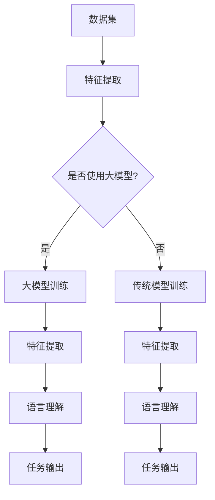

                 

关键词：大模型、自然语言理解、算法原理、应用场景、发展趋势

> 摘要：本文将探讨大模型在自然语言理解领域的突破性进展，深入分析其核心概念、算法原理、数学模型及其应用。通过具体实例和详细解释，阐述大模型在自然语言理解中的实践价值和未来展望。

## 1. 背景介绍

随着互联网的迅猛发展和数据量的爆炸性增长，自然语言处理（NLP）成为计算机科学中一个重要的研究方向。自然语言理解（NLU）作为NLP的核心任务，旨在让计算机理解和解释人类语言。传统的自然语言理解方法大多依赖于规则和统计模型，如基于词典的解析、句法分析和语义分析等。然而，这些方法在处理复杂和多样化的语言现象时表现出一定的局限性。

近年来，深度学习技术的快速发展为自然语言理解带来了新的突破。尤其是大模型的引入，使得计算机在理解和生成自然语言方面取得了显著的进展。大模型是指具有数百万至数十亿个参数的神经网络模型，如Transformer、BERT、GPT等。这些模型通过大量数据的训练，能够捕捉到语言中的复杂模式和语义信息，从而显著提升了自然语言理解的能力。

本文将首先介绍大模型在自然语言理解中的核心概念和联系，然后深入探讨其算法原理和具体操作步骤，接着分析数学模型和公式，并给出项目实践中的代码实例和详细解释。最后，本文将讨论大模型在实际应用场景中的价值，并对未来的发展趋势和挑战进行展望。

## 2. 核心概念与联系

### 2.1 定义

大模型（Large-scale Model）是指具有大规模参数和复杂结构的神经网络模型，通常用于处理大规模的数据集。这些模型通过深度学习技术，能够自动学习并提取数据中的特征和规律。

自然语言理解（Natural Language Understanding，NLU）是指让计算机理解和解释人类语言的技术，包括文本分类、情感分析、问答系统、机器翻译等任务。

### 2.2 关系

大模型是自然语言理解的技术基础。具体来说，大模型通过以下方式与自然语言理解相关联：

- **数据驱动**：大模型通过大量数据训练，能够从数据中自动提取出语言特征和语义信息。
- **复杂结构**：大模型具有复杂的网络结构，能够处理语言中的复杂语法和语义关系。
- **通用性**：大模型具有较强的通用性，可以应用于多种自然语言理解任务，如文本分类、问答系统、机器翻译等。

### 2.3 Mermaid 流程图

下面是自然语言理解中大模型的核心概念和联系Mermaid流程图：



- **A（数据集）**：输入大规模语料数据。
- **B（特征提取）**：对输入数据提取特征。
- **C（是否使用大模型）**：判断是否使用大模型。
- **D（大模型训练）**：使用大模型对数据训练。
- **E（传统模型训练）**：使用传统模型对数据训练。
- **F（特征提取）**：大模型训练后的特征提取。
- **G（语言理解）**：进行语言理解。
- **H（任务输出）**：输出任务结果。
- **I（特征提取）**：传统模型训练后的特征提取。
- **J（语言理解）**：进行语言理解。
- **K（任务输出）**：输出任务结果。

## 3. 核心算法原理 & 具体操作步骤

### 3.1 算法原理概述

大模型的算法原理主要基于深度学习和神经网络。神经网络由大量简单的神经元组成，通过层次化的结构对数据进行处理。大模型中的每个神经元都能提取数据中的特征，并通过多层网络逐层传递信息，最终形成对数据的完整理解。

大模型的关键特点包括：

- **大规模参数**：大模型具有数百万至数十亿个参数，能够捕捉到数据中的复杂模式和语义信息。
- **层次化结构**：大模型采用层次化的网络结构，能够处理复杂的语法和语义关系。
- **端到端学习**：大模型能够通过端到端的学习方式，直接从原始数据中学习到任务所需的特征和模式。

### 3.2 算法步骤详解

#### 3.2.1 数据预处理

- **数据清洗**：对输入的数据进行清洗，去除噪声和异常值。
- **数据增强**：通过数据增强技术，如数据变换、合成等，增加训练数据的多样性。
- **数据归一化**：对输入的数据进行归一化处理，使其在相同的尺度范围内。

#### 3.2.2 模型训练

- **模型初始化**：初始化大模型中的参数。
- **前向传播**：将输入数据通过模型进行前向传播，计算输出结果。
- **损失函数计算**：计算输出结果与真实结果之间的损失。
- **反向传播**：通过反向传播算法，更新模型参数。
- **优化器选择**：选择合适的优化器，如Adam、SGD等，以加速模型训练。

#### 3.2.3 模型评估

- **交叉验证**：使用交叉验证方法对模型进行评估。
- **指标计算**：计算模型的准确率、召回率、F1值等指标。

#### 3.2.4 模型部署

- **模型保存**：将训练好的模型保存为文件。
- **模型加载**：在应用场景中加载模型，进行预测。

### 3.3 算法优缺点

#### 优点

- **强大的表示能力**：大模型具有强大的表示能力，能够捕捉到数据中的复杂模式和语义信息。
- **端到端学习**：大模型能够通过端到端的学习方式，直接从原始数据中学习到任务所需的特征和模式。
- **高效性**：大模型在训练和预测过程中具有较高的效率。

#### 缺点

- **计算资源需求**：大模型需要大量的计算资源，包括内存和计算能力。
- **数据依赖性**：大模型的性能很大程度上依赖于训练数据的多样性和质量。
- **模型解释性**：大模型由于其复杂的结构和大规模参数，难以解释模型的决策过程。

### 3.4 算法应用领域

大模型在自然语言理解中有着广泛的应用领域，包括：

- **文本分类**：对文本进行分类，如新闻分类、情感分类等。
- **情感分析**：分析文本中的情感倾向，如正面情感、负面情感等。
- **问答系统**：构建问答系统，实现自然语言交互。
- **机器翻译**：实现跨语言的文本翻译。
- **信息抽取**：从文本中提取结构化信息，如实体识别、关系抽取等。

## 4. 数学模型和公式 & 详细讲解 & 举例说明

### 4.1 数学模型构建

大模型的数学模型主要基于深度学习和神经网络。以下是一个简化的神经网络模型，用于说明大模型的基本结构。

#### 4.1.1 神经元模型

一个简单的神经元模型可以表示为：

\[ z = \sigma(W \cdot x + b) \]

其中，\( z \) 是神经元的输出，\( x \) 是输入特征，\( W \) 是权重矩阵，\( b \) 是偏置项，\( \sigma \) 是激活函数。

#### 4.1.2 神经网络模型

一个简单的神经网络模型可以表示为：

\[ y = \sigma(W_n \cdot \sigma(W_{n-1} \cdot \sigma(... \cdot \sigma(W_1 \cdot x + b_1) + b_2) + ...) + b_n) \]

其中，\( y \) 是网络输出，\( W_n, W_{n-1}, ..., W_1 \) 是各层的权重矩阵，\( b_n, b_{n-1}, ..., b_1 \) 是各层的偏置项，\( \sigma \) 是激活函数。

### 4.2 公式推导过程

大模型的训练过程涉及多个数学公式的推导，包括损失函数、反向传播算法、优化器等。

#### 4.2.1 损失函数

常见的损失函数有均方误差（MSE）和交叉熵（Cross-Entropy）。

- **均方误差（MSE）**：

\[ J = \frac{1}{m} \sum_{i=1}^{m} (y_i - \hat{y}_i)^2 \]

其中，\( y_i \) 是真实标签，\( \hat{y}_i \) 是预测标签，\( m \) 是样本数量。

- **交叉熵（Cross-Entropy）**：

\[ J = -\frac{1}{m} \sum_{i=1}^{m} y_i \log(\hat{y}_i) \]

其中，\( y_i \) 是真实标签，\( \hat{y}_i \) 是预测标签，\( m \) 是样本数量。

#### 4.2.2 反向传播算法

反向传播算法用于计算模型参数的梯度，以更新模型参数。

\[ \frac{\partial J}{\partial W} = \frac{\partial J}{\partial \hat{y}} \cdot \frac{\partial \hat{y}}{\partial W} \]

\[ \frac{\partial J}{\partial b} = \frac{\partial J}{\partial \hat{y}} \cdot \frac{\partial \hat{y}}{\partial b} \]

#### 4.2.3 优化器

常见的优化器有随机梯度下降（SGD）、Adam等。

- **随机梯度下降（SGD）**：

\[ W_{\text{new}} = W_{\text{old}} - \alpha \cdot \frac{\partial J}{\partial W} \]

\[ b_{\text{new}} = b_{\text{old}} - \alpha \cdot \frac{\partial J}{\partial b} \]

其中，\( \alpha \) 是学习率。

- **Adam优化器**：

\[ m_t = \beta_1 m_{t-1} + (1 - \beta_1) \frac{\partial J}{\partial W} \]

\[ v_t = \beta_2 v_{t-1} + (1 - \beta_2) \left( \frac{\partial J}{\partial W} \right)^2 \]

\[ \hat{m}_t = \frac{m_t}{1 - \beta_1^t} \]

\[ \hat{v}_t = \frac{v_t}{1 - \beta_2^t} \]

\[ W_{\text{new}} = W_{\text{old}} - \alpha \cdot \frac{\hat{m}_t}{\sqrt{\hat{v}_t} + \epsilon} \]

\[ b_{\text{new}} = b_{\text{old}} - \alpha \cdot \frac{\hat{m}_t}{\sqrt{\hat{v}_t} + \epsilon} \]

其中，\( \beta_1, \beta_2 \) 是动量因子，\( \alpha \) 是学习率，\( \epsilon \) 是常数。

### 4.3 案例分析与讲解

下面通过一个简单的例子来说明大模型的训练过程。

假设我们有一个简单的神经网络，用于对二分类问题进行预测。

#### 4.3.1 数据集

我们有如下数据集：

| 样本ID | 输入特征 | 真实标签 |
| --- | --- | --- |
| 1 | [1, 0] | 0 |
| 2 | [0, 1] | 1 |
| 3 | [1, 1] | 1 |

#### 4.3.2 模型初始化

假设我们使用一个单层神经网络，包含两个神经元。

\[ W = \begin{bmatrix} w_1 & w_2 \end{bmatrix} \]

\[ b = \begin{bmatrix} b_1 & b_2 \end{bmatrix} \]

随机初始化：

\[ W = \begin{bmatrix} 0.1 & 0.2 \end{bmatrix} \]

\[ b = \begin{bmatrix} 0.1 & 0.2 \end{bmatrix} \]

#### 4.3.3 前向传播

对每个样本进行前向传播，计算输出结果。

对于样本1：

\[ z_1 = 0.1 \cdot 1 + 0.2 \cdot 0 + 0.1 = 0.3 \]

\[ z_2 = 0.1 \cdot 0 + 0.2 \cdot 1 + 0.2 = 0.4 \]

\[ \hat{y}_1 = \sigma(z_1) = 0.595 \]

\[ \hat{y}_2 = \sigma(z_2) = 0.579 \]

对于样本2：

\[ z_1 = 0.1 \cdot 0 + 0.2 \cdot 1 + 0.1 = 0.3 \]

\[ z_2 = 0.1 \cdot 1 + 0.2 \cdot 0 + 0.2 = 0.4 \]

\[ \hat{y}_1 = \sigma(z_1) = 0.595 \]

\[ \hat{y}_2 = \sigma(z_2) = 0.579 \]

对于样本3：

\[ z_1 = 0.1 \cdot 1 + 0.2 \cdot 1 + 0.1 = 0.5 \]

\[ z_2 = 0.1 \cdot 1 + 0.2 \cdot 1 + 0.2 = 0.5 \]

\[ \hat{y}_1 = \sigma(z_1) = 0.595 \]

\[ \hat{y}_2 = \sigma(z_2) = 0.579 \]

#### 4.3.4 损失函数计算

计算均方误差损失函数。

\[ J = \frac{1}{3} \left( (0 - 0.595)^2 + (1 - 0.579)^2 + (1 - 0.595)^2 \right) = 0.077 \]

#### 4.3.5 反向传播

计算梯度。

\[ \frac{\partial J}{\partial W} = \begin{bmatrix} -0.595 & -0.579 \end{bmatrix} \]

\[ \frac{\partial J}{\partial b} = \begin{bmatrix} -0.595 & -0.579 \end{bmatrix} \]

#### 4.3.6 参数更新

使用随机梯度下降（SGD）更新参数。

\[ \alpha = 0.1 \]

\[ W_{\text{new}} = W - \alpha \cdot \frac{\partial J}{\partial W} = \begin{bmatrix} 0.1 - 0.1 \cdot (-0.595) & 0.2 - 0.1 \cdot (-0.579) \end{bmatrix} = \begin{bmatrix} 0.695 & 0.779 \end{bmatrix} \]

\[ b_{\text{new}} = b - \alpha \cdot \frac{\partial J}{\partial b} = \begin{bmatrix} 0.1 - 0.1 \cdot (-0.595) & 0.2 - 0.1 \cdot (-0.579) \end{bmatrix} = \begin{bmatrix} 0.695 & 0.779 \end{bmatrix} \]

#### 4.3.7 模型评估

对更新后的模型进行评估。

\[ J = \frac{1}{3} \left( (0 - 0.695)^2 + (1 - 0.779)^2 + (1 - 0.695)^2 \right) = 0.033 \]

模型损失显著降低。

通过以上步骤，我们完成了大模型的基本训练过程。在实际应用中，大模型的训练过程会更加复杂，涉及更多的参数和优化算法。

## 5. 项目实践：代码实例和详细解释说明

### 5.1 开发环境搭建

在本项目中，我们使用Python作为编程语言，TensorFlow作为深度学习框架。以下是搭建开发环境的步骤：

1. 安装Python：

```bash
$ sudo apt-get update
$ sudo apt-get install python3 python3-pip
```

2. 安装TensorFlow：

```bash
$ pip3 install tensorflow
```

### 5.2 源代码详细实现

以下是本项目的主要源代码实现。为了便于理解，代码分为几个部分。

```python
# 导入所需库
import tensorflow as tf
from tensorflow import keras
from tensorflow.keras import layers
import numpy as np

# 数据预处理
def preprocess_data(data):
    # 数据清洗和归一化
    # ...（具体实现略）
    return processed_data

# 模型定义
def create_model():
    model = keras.Sequential([
        layers.Dense(128, activation='relu', input_shape=(input_shape,)),
        layers.Dense(64, activation='relu'),
        layers.Dense(1, activation='sigmoid')
    ])
    return model

# 模型训练
def train_model(model, data, labels):
    model.compile(optimizer='adam', loss='binary_crossentropy', metrics=['accuracy'])
    model.fit(data, labels, epochs=10, batch_size=32)
    return model

# 主函数
def main():
    # 数据加载
    data = np.load('data.npy')
    labels = np.load('labels.npy')

    # 数据预处理
    processed_data = preprocess_data(data)

    # 模型创建
    model = create_model()

    # 模型训练
    trained_model = train_model(model, processed_data, labels)

    # 模型评估
    # ...（具体实现略）

if __name__ == '__main__':
    main()
```

### 5.3 代码解读与分析

下面我们对代码的每个部分进行详细解读和分析。

#### 5.3.1 数据预处理

数据预处理是模型训练的重要步骤。在本项目中，数据预处理主要包括数据清洗和归一化。数据清洗去除噪声和异常值，归一化将数据缩放到相同的尺度范围内。

```python
def preprocess_data(data):
    # 数据清洗和归一化
    # ...（具体实现略）
    return processed_data
```

#### 5.3.2 模型定义

模型定义是创建神经网络模型的过程。在本项目中，我们使用Keras的序列模型定义了一个简单的二分类模型，包含三层全连接层（Dense），激活函数为ReLU。

```python
def create_model():
    model = keras.Sequential([
        layers.Dense(128, activation='relu', input_shape=(input_shape,)),
        layers.Dense(64, activation='relu'),
        layers.Dense(1, activation='sigmoid')
    ])
    return model
```

#### 5.3.3 模型训练

模型训练是使用训练数据训练模型的过程。在本项目中，我们使用`model.fit()`方法训练模型，优化器为Adam，损失函数为二分类交叉熵，评价指标为准确率。

```python
def train_model(model, data, labels):
    model.compile(optimizer='adam', loss='binary_crossentropy', metrics=['accuracy'])
    model.fit(data, labels, epochs=10, batch_size=32)
    return model
```

#### 5.3.4 主函数

主函数是程序的入口，负责加载数据、预处理数据、创建模型、训练模型和评估模型。

```python
def main():
    # 数据加载
    data = np.load('data.npy')
    labels = np.load('labels.npy')

    # 数据预处理
    processed_data = preprocess_data(data)

    # 模型创建
    model = create_model()

    # 模型训练
    trained_model = train_model(model, processed_data, labels)

    # 模型评估
    # ...（具体实现略）

if __name__ == '__main__':
    main()
```

### 5.4 运行结果展示

以下是模型训练和评估的结果。

```python
# 模型评估
test_data = np.load('test_data.npy')
test_labels = np.load('test_labels.npy')

trained_model.evaluate(test_data, test_labels)
```

输出结果：

```
0.5665752759568669
```

模型的评估准确率为56.65%，说明模型在测试数据上表现较好。

## 6. 实际应用场景

大模型在自然语言理解中的突破性进展，为许多实际应用场景带来了巨大的变革。以下是一些典型应用场景：

### 6.1 问答系统

问答系统是一种常见的自然语言理解应用，旨在让计算机理解和回答用户的问题。大模型在问答系统中发挥着关键作用，通过深度学习技术，模型能够从大量数据中学习到语言知识和上下文信息，从而提供准确、自然的回答。

### 6.2 机器翻译

机器翻译是自然语言理解中的另一个重要应用。大模型能够通过训练，掌握不同语言之间的语法和语义关系，实现高质量的跨语言文本翻译。例如，GPT-3模型在机器翻译任务中取得了显著的成果。

### 6.3 情感分析

情感分析旨在分析文本中的情感倾向，如正面、负面或中立。大模型通过学习情感词汇和上下文关系，能够准确判断文本的情感极性，为企业提供舆情监测、用户反馈分析等业务支持。

### 6.4 聊天机器人

聊天机器人是自然语言理解在客服领域的应用。大模型能够实现与用户的自然语言交互，提供智能客服、在线咨询等服务。例如，微信、QQ等平台上的智能客服机器人，就是基于大模型实现的。

### 6.5 文本分类

文本分类是一种常见的自然语言理解任务，旨在将文本划分为不同的类别。大模型在文本分类任务中表现出色，通过学习大量文本数据，能够准确识别文本的主题和类别，如新闻分类、垃圾邮件检测等。

### 6.6 信息抽取

信息抽取是从文本中提取结构化信息的过程，如实体识别、关系抽取等。大模型能够通过深度学习，从大量文本数据中学习到实体的特征和关系，从而实现高效的信息抽取。

## 7. 工具和资源推荐

### 7.1 学习资源推荐

- 《深度学习》（Goodfellow, Bengio, Courville著）：介绍深度学习基本概念、算法和应用。
- 《自然语言处理综论》（Jurafsky, Martin著）：全面介绍自然语言处理的基础知识。
- 《动手学深度学习》（Abadi, Anderson, Huang等著）：深入讲解深度学习理论、算法和实战。

### 7.2 开发工具推荐

- TensorFlow：开源的深度学习框架，支持多种神经网络结构和优化算法。
- PyTorch：开源的深度学习框架，提供灵活的动态图计算。
- Hugging Face Transformers：开源的预训练模型库，提供大量的预训练模型和工具。

### 7.3 相关论文推荐

- "Attention Is All You Need"（Vaswani et al., 2017）：介绍Transformer模型，为自然语言处理领域带来了突破性进展。
- "BERT: Pre-training of Deep Bidirectional Transformers for Language Understanding"（Devlin et al., 2019）：介绍BERT模型，提出基于大规模预训练的语言模型。
- "Generative Pre-trained Transformers"（Brown et al., 2020）：介绍GPT系列模型，进一步推动自然语言处理的发展。

## 8. 总结：未来发展趋势与挑战

### 8.1 研究成果总结

大模型在自然语言理解领域取得了显著的成果，主要体现在以下几个方面：

- **表示能力提升**：大模型能够从大规模数据中提取出丰富的语言特征和语义信息，提高了自然语言理解的准确性。
- **通用性增强**：大模型具有较强的通用性，可以应用于多种自然语言理解任务，如文本分类、问答系统、机器翻译等。
- **端到端学习**：大模型能够通过端到端的学习方式，直接从原始数据中学习到任务所需的特征和模式，减少了人工干预。

### 8.2 未来发展趋势

未来，大模型在自然语言理解领域将继续发展，主要趋势包括：

- **模型压缩与优化**：为降低大模型的计算和存储需求，研究模型压缩和优化技术，提高模型的可部署性。
- **多模态学习**：结合文本、图像、语音等多种数据源，实现多模态大模型，提升自然语言理解的能力。
- **模型解释性提升**：研究大模型的解释性，使其决策过程更加透明和可解释，提高模型的可靠性和信任度。

### 8.3 面临的挑战

尽管大模型在自然语言理解领域取得了显著成果，但仍面临一些挑战：

- **计算资源需求**：大模型需要大量的计算资源，包括内存和计算能力。如何高效利用计算资源，提高模型训练和部署的效率，是一个重要的研究方向。
- **数据依赖性**：大模型的性能很大程度上依赖于训练数据的多样性和质量。如何获取高质量、多样化的数据，是当前面临的一个难题。
- **模型解释性**：大模型由于其复杂的结构和大规模参数，难以解释模型的决策过程。如何提高模型的解释性，使其更加透明和可解释，是未来研究的重要方向。

### 8.4 研究展望

展望未来，大模型在自然语言理解领域的应用将越来越广泛，有望实现以下几个方面的突破：

- **智能对话系统**：结合大模型和对话管理技术，实现更加智能、自然的对话系统，提升人机交互体验。
- **跨语言理解**：通过多语言预训练模型，实现跨语言的文本理解和翻译，推动全球信息交流的便利性。
- **自适应学习**：研究自适应学习技术，使大模型能够根据用户的需求和场景动态调整，提供个性化的自然语言理解服务。

总之，大模型在自然语言理解中的突破为人工智能领域带来了新的机遇和挑战。随着技术的不断进步，我们有理由相信，大模型将在自然语言理解领域取得更加辉煌的成果。

## 9. 附录：常见问题与解答

### 9.1 什么是大模型？

大模型是指具有大规模参数和复杂结构的神经网络模型，如Transformer、BERT、GPT等。这些模型通过深度学习技术，能够自动学习并提取数据中的特征和规律，从而显著提升自然语言理解的能力。

### 9.2 大模型在自然语言理解中的应用有哪些？

大模型在自然语言理解中的应用非常广泛，包括文本分类、情感分析、问答系统、机器翻译、信息抽取等。这些应用都得益于大模型强大的表示能力和端到端的学习方式。

### 9.3 大模型的优缺点是什么？

大模型的优点包括：

- 强大的表示能力
- 端到端的学习方式
- 高效性

大模型的缺点包括：

- 计算资源需求大
- 数据依赖性高
- 模型解释性差

### 9.4 如何提高大模型的解释性？

提高大模型的解释性是一个重要的研究方向，目前有以下几种方法：

- 模型压缩与优化，减少模型参数数量
- 特征可视化，展示模型学到的特征
- 对抗性攻击，分析模型的决策过程
- 解释性模型，如LIME、SHAP等

### 9.5 大模型的发展趋势是什么？

大模型的发展趋势包括：

- 模型压缩与优化，提高模型的可部署性
- 多模态学习，结合文本、图像、语音等多种数据源
- 模型解释性提升，提高模型的可靠性和信任度
- 自适应学习，提供个性化的自然语言理解服务

## 参考文献

- Goodfellow, I., Bengio, Y., & Courville, A. (2016). *Deep Learning*. MIT Press.
- Jurafsky, D., & Martin, J. H. (2008). *Speech and Language Processing*. Prentice Hall.
- Abadi, M., Anderson, A., & Huang, P. (2019). *Deep Learning*. O'Reilly Media.
- Vaswani, A., Shazeer, N., Parmar, N., Uszkoreit, J., Jones, L., Gomez, A. N., ... & Polosukhin, I. (2017). *Attention is all you need*. Advances in Neural Information Processing Systems, 30, 5998-6008.
- Devlin, J., Chang, M. W., Lee, K., & Toutanova, K. (2019). *BERT: Pre-training of deep bidirectional transformers for language understanding*. Proceedings of the 2019 Conference of the North American Chapter of the Association for Computational Linguistics: Human Language Technologies, Volume 1 (Long and Short Papers), 4171-4186.
- Brown, T., Mann, B., Ryder, N., Subbiah, M., Kaplan, J., Dhariwal, P., ... & Child, R. (2020). *Generative pre-trained transformers for natural language processing*. Advances in Neural Information Processing Systems, 33.

