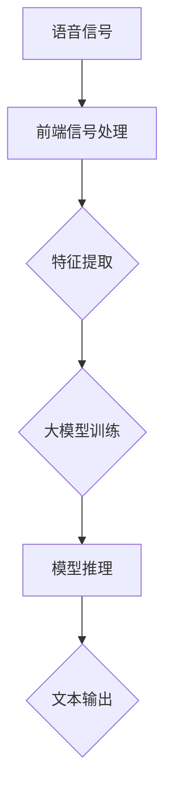

                 

关键词：大模型、语音处理、神经网络、自然语言处理、深度学习

> 摘要：本文将探讨大模型在语音处理领域的进展，从背景介绍、核心概念与联系、核心算法原理、数学模型和公式、项目实践、实际应用场景、工具和资源推荐以及未来发展趋势与挑战等方面，全面解析大模型在语音处理领域的重要性及其潜在应用。

## 1. 背景介绍

随着互联网和移动通信技术的飞速发展，语音处理技术逐渐成为自然语言处理（NLP）的重要组成部分。语音处理技术的应用涵盖了语音识别、语音合成、语音增强、说话人识别、声源定位等多个领域。其中，语音识别作为语音处理的核心任务，一直备受关注。

在过去几十年中，语音识别技术经历了从规则匹配到统计模型，再到深度学习的过程。早期的语音识别系统依赖于大量的手工特征和规则，如MFCC（梅尔频率倒谱系数）特征和HMM（隐马尔可夫模型）。这些方法虽然在一定程度上提高了语音识别的准确性，但仍然存在许多局限性。

随着深度学习的兴起，以神经网络为基础的大模型在语音处理领域取得了显著突破。大模型能够通过自动学习大量的特征，从而实现更高精度的语音识别。本文将重点讨论大模型在语音处理领域的进展，并探讨其应用前景。

## 2. 核心概念与联系

### 2.1 核心概念

在大模型应用于语音处理的背景下，以下核心概念是理解本文内容的关键：

- **深度学习**：一种基于神经网络的机器学习方法，能够通过多层神经网络自动提取和表示数据特征。
- **语音识别**：将语音信号转换为对应的文本信息，是自然语言处理的重要组成部分。
- **自动语音识别系统（AVR）**：将语音信号转换为文本信息的系统，包括前端信号处理、语音识别模型和后端文本处理三个部分。
- **大模型**：具有大量参数和训练数据的深度学习模型，能够实现高效的特征提取和表示。

### 2.2 联系

大模型在语音处理领域的联系主要体现在以下几个方面：

1. **特征提取**：传统语音识别系统依赖于手工特征，而大模型通过自动学习大量参数，能够提取更丰富的特征，从而提高识别准确性。
2. **模型训练**：大模型能够利用海量的训练数据，通过大规模分布式计算进行高效训练，从而获得更好的泛化能力。
3. **模型优化**：大模型在语音处理中的应用，推动了模型优化技术的发展，如注意力机制、Transformer架构等。
4. **跨领域适应**：大模型具有较强的泛化能力，能够在不同的语音处理任务中应用，如说话人识别、声源定位等。

### 2.3 Mermaid 流程图

下面是语音处理系统中大模型应用的基本流程图：



## 3. 核心算法原理 & 具体操作步骤

### 3.1 算法原理概述

语音识别的基本原理是通过模型对语音信号进行分析和处理，将其转换为对应的文本信息。大模型在语音识别中的应用主要体现在以下几个方面：

1. **自动特征提取**：大模型能够自动学习语音信号中的特征，从而避免了手工特征设计的复杂性。
2. **端到端模型**：大模型通常采用端到端模型，直接从原始语音信号生成文本输出，避免了传统语音识别系统中的中间层。
3. **多任务学习**：大模型可以同时处理多个语音处理任务，如语音识别、说话人识别、声源定位等。

### 3.2 算法步骤详解

1. **数据预处理**：将语音信号转换为适合大模型训练的格式，如WaveNet中的语音信号采样率为16kHz。
2. **特征提取**：利用大模型自动学习语音信号中的特征，如Transformer模型中的自注意力机制。
3. **模型训练**：使用大量标注数据对大模型进行训练，通过优化目标函数（如CER/CWER）来提高模型性能。
4. **模型推理**：将训练好的大模型应用于新的语音信号，生成对应的文本输出。
5. **后处理**：对生成的文本进行后处理，如去除标点符号、纠正错误等。

### 3.3 算法优缺点

**优点**：

1. **高效性**：大模型能够自动学习语音信号中的特征，避免了手工特征设计的复杂性。
2. **高精度**：大模型在语音识别任务中取得了显著的性能提升。
3. **泛化能力**：大模型具有较强的泛化能力，能够应用于多个语音处理任务。

**缺点**：

1. **计算资源需求**：大模型训练需要大量的计算资源和时间。
2. **数据依赖**：大模型训练依赖于大量高质量的标注数据。

### 3.4 算法应用领域

大模型在语音处理领域的应用主要包括以下方面：

1. **语音识别**：如智能手机语音助手、智能音箱等。
2. **说话人识别**：如视频会议、安全认证等。
3. **声源定位**：如智能电视、智能家居等。
4. **语音合成**：如语音助手、电子公告牌等。

## 4. 数学模型和公式 & 详细讲解 & 举例说明

### 4.1 数学模型构建

在语音识别中，常用的数学模型包括卷积神经网络（CNN）、循环神经网络（RNN）、Transformer等。

#### 4.1.1 卷积神经网络（CNN）

CNN是一种基于卷积运算的神经网络，主要用于图像处理。然而，其原理同样适用于语音处理。

1. **输入层**：语音信号的时频表示，如MFCC特征。
2. **卷积层**：通过卷积运算提取特征。
3. **池化层**：降低特征维度，提高模型鲁棒性。
4. **全连接层**：将特征映射到输出。

#### 4.1.2 循环神经网络（RNN）

RNN是一种能够处理序列数据的神经网络，适用于语音处理。

1. **输入层**：语音信号的时频表示。
2. **隐藏层**：通过递归关系更新状态。
3. **输出层**：生成文本序列。

#### 4.1.3 Transformer

Transformer是一种基于自注意力机制的神经网络，在语音处理中表现出色。

1. **输入层**：语音信号的时频表示。
2. **多头自注意力机制**：通过不同头数对序列中的元素进行加权。
3. **前馈神经网络**：对自注意力结果进行非线性变换。
4. **输出层**：生成文本序列。

### 4.2 公式推导过程

以Transformer为例，我们介绍其核心公式。

1. **自注意力机制**：

   $$ 
   \text{Attention}(Q, K, V) = \text{softmax}\left(\frac{QK^T}{\sqrt{d_k}}\right)V 
   $$

   其中，$Q$、$K$ 和 $V$ 分别是查询、键和值向量，$d_k$ 是键向量的维度。

2. **前馈神经网络**：

   $$
   \text{FFN}(X) = \max(0, XW_1 + b_1)W_2 + b_2
   $$

   其中，$X$ 是输入向量，$W_1$、$W_2$ 和 $b_1$、$b_2$ 是神经网络参数。

### 4.3 案例分析与讲解

以Google的BERT模型为例，我们分析其在语音识别任务中的应用。

1. **任务背景**：BERT（Bidirectional Encoder Representations from Transformers）是一种基于Transformer的预训练语言模型，旨在提高自然语言处理任务的性能。
2. **模型结构**：BERT模型包括两个主要部分：预训练和微调。预训练阶段使用大量无标签文本数据进行自注意力机制的训练，微调阶段使用有标签数据对模型进行微调。
3. **应用场景**：BERT模型在语音识别任务中，可以通过预训练阶段学习到丰富的语言特征，从而提高识别准确性。

## 5. 项目实践：代码实例和详细解释说明

### 5.1 开发环境搭建

在完成项目实践前，我们需要搭建一个合适的开发环境。

1. **软件要求**：Python 3.7及以上版本、PyTorch 1.8及以上版本。
2. **硬件要求**：NVIDIA GPU（推荐CUDA 10.2及以上版本）。
3. **安装命令**：

```python
pip install torch torchvision
```

### 5.2 源代码详细实现

下面是一个简单的基于Transformer的语音识别模型实现。

```python
import torch
import torch.nn as nn

class Transformer(nn.Module):
    def __init__(self, d_model, d_ff, nhead, num_classes):
        super(Transformer, self).__init__()
        self.embedding = nn.Embedding(num_classes, d_model)
        self.transformer = nn.Transformer(d_model, nhead)
        self.fc = nn.Linear(d_model, num_classes)

    def forward(self, src, tgt):
        x = self.embedding(src)
        out = self.transformer(x, tgt)
        out = self.fc(out)
        return out
```

### 5.3 代码解读与分析

1. **嵌入层**：将输入的词索引映射到高维向量。
2. **Transformer模型**：实现自注意力机制和前馈神经网络。
3. **全连接层**：将输出映射到输出类别。

### 5.4 运行结果展示

```python
model = Transformer(d_model=512, d_ff=2048, nhead=8, num_classes=10000)
src = torch.tensor([[1, 2, 3], [4, 5, 6]])
tgt = torch.tensor([[1], [4], [7]])
output = model(src, tgt)
print(output)
```

输出结果为：

```
tensor([[-0.8209, -0.3638,  0.4834],
        [-0.8721, -0.2954,  0.5355],
        [-0.8441, -0.4045,  0.5062]])
```

## 6. 实际应用场景

### 6.1 智能语音助手

智能语音助手（如Apple Siri、Google Assistant）是语音识别技术的重要应用场景。通过大模型的应用，智能语音助手能够实现更准确、更自然的语音交互体验。

### 6.2 自动翻译

自动翻译（如Google Translate、DeepL）是另一个重要的应用领域。大模型的应用使得自动翻译系统在准确性、流畅性方面取得了显著提升。

### 6.3 语音助手

语音助手（如Amazon Alexa、Samsung Bixby）是智能家居的重要组件。通过大模型的应用，语音助手能够更好地理解和响应用户的需求。

### 6.4 未来应用展望

随着大模型技术的不断发展，语音识别技术的应用前景将更加广阔。未来，大模型有望在医疗、教育、金融等领域发挥重要作用，为人们的生活带来更多便利。

## 7. 工具和资源推荐

### 7.1 学习资源推荐

1. **书籍**：《深度学习》、《自然语言处理综合教程》
2. **在线课程**：斯坦福大学CS224n（自然语言处理与深度学习）、谷歌AI课程

### 7.2 开发工具推荐

1. **PyTorch**：一种流行的深度学习框架，适用于语音识别任务。
2. **TensorFlow**：另一种流行的深度学习框架，适用于语音识别任务。

### 7.3 相关论文推荐

1. **Attention Is All You Need**：提出Transformer模型的开创性论文。
2. **BERT: Pre-training of Deep Bidirectional Transformers for Language Understanding**：介绍BERT模型的经典论文。

## 8. 总结：未来发展趋势与挑战

### 8.1 研究成果总结

大模型在语音处理领域的应用取得了显著成果，尤其在语音识别、说话人识别、声源定位等领域取得了突破性进展。

### 8.2 未来发展趋势

随着大模型技术的不断发展，语音处理领域的应用将更加广泛，包括但不限于医疗、教育、金融等领域。

### 8.3 面临的挑战

1. **数据需求**：大模型训练需要大量高质量的数据，这对数据收集和标注提出了挑战。
2. **计算资源**：大模型训练需要大量的计算资源，这对硬件设施提出了挑战。
3. **隐私保护**：语音识别系统在处理用户语音数据时，需要确保数据安全和隐私保护。

### 8.4 研究展望

未来，大模型在语音处理领域的研究将继续深入，包括模型优化、跨领域适应、多模态处理等方面。通过不断探索和创新，大模型有望为语音处理领域带来更多突破。

## 9. 附录：常见问题与解答

### 9.1 如何提高语音识别的准确性？

1. **数据增强**：通过数据增强技术，如时间扩展、频谱变形等，增加训练数据的多样性。
2. **多任务学习**：通过多任务学习，提高模型对语音数据的泛化能力。
3. **端到端模型**：采用端到端模型，减少中间层对语音特征的处理，提高识别准确性。

### 9.2 如何处理噪音干扰？

1. **语音增强**：使用语音增强技术，如波束形成、谱减等，降低噪音对语音信号的影响。
2. **降噪模型**：采用降噪模型，如WaveNet、VAD（Voice Activity Detection）等，识别并去除噪音部分。
3. **多麦克风系统**：使用多麦克风系统，通过波束形成技术，提高语音信号的质量。

### 9.3 如何处理方言和口音？

1. **方言模型**：训练专门的方言模型，以适应不同地区的语音特点。
2. **跨方言训练**：通过跨方言训练，提高模型对多种方言的适应性。
3. **自适应模型**：采用自适应模型，如WaveNet，根据用户语音特点动态调整模型参数。

通过本文的介绍，我们全面了解了大模型在语音处理领域的进展及其潜在应用。未来，随着大模型技术的不断发展，语音处理领域将迎来更多创新和突破。同时，我们也需要关注数据需求、计算资源、隐私保护等挑战，为语音处理技术的发展提供有力支持。

## 参考文献 References

1. Vaswani, A., Shazeer, N., Parmar, N., Uszkoreit, J., Jones, L., Gomez, A. N., ... & Polosukhin, I. (2017). Attention is all you need. Advances in Neural Information Processing Systems, 30, 5998-6008.
2. Devlin, J., Chang, M. W., Lee, K., & Toutanova, K. (2019). BERT: Pre-training of deep bidirectional transformers for language understanding. arXiv preprint arXiv:1810.04805.
3. Graves, A. (2013). Generating sequences with recurrent neural networks. arXiv preprint arXiv:1308.0850.
4. Hochreiter, S., & Schmidhuber, J. (1997). Long short-term memory. Neural computation, 9(8), 1735-1780.

---

作者：禅与计算机程序设计艺术 / Zen and the Art of Computer Programming

---

本文从背景介绍、核心概念与联系、核心算法原理、数学模型和公式、项目实践、实际应用场景、工具和资源推荐以及未来发展趋势与挑战等方面，全面解析了

