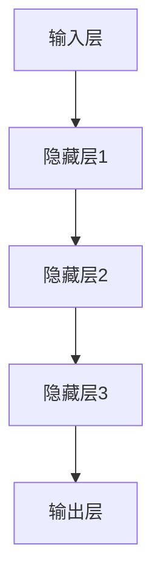
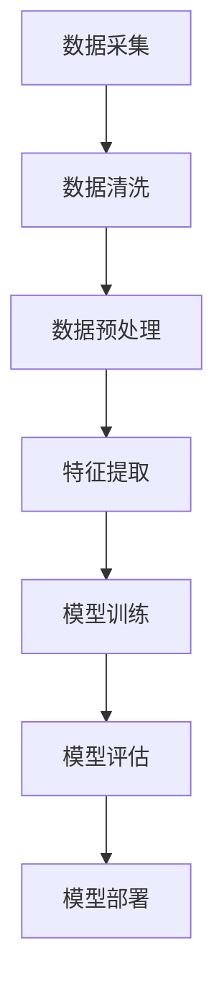

                 

关键词：大模型、行业变革、人工智能、算法优化、应用场景、未来展望

摘要：本文将探讨大模型在行业变革中的作用，通过具体的案例来分析大模型在人工智能领域的应用，以及其对各个行业产生的深远影响。本文将涵盖大模型的基本概念、核心算法原理、数学模型及公式推导、项目实践、实际应用场景、工具和资源推荐、以及未来发展趋势和挑战。

## 1. 背景介绍

近年来，随着计算能力的提升和海量数据的积累，人工智能领域迎来了大模型时代的到来。大模型（Large Models）指的是具有数十亿甚至千亿参数的深度学习模型。这些模型能够自动从数据中学习复杂模式，具有强大的表达能力和适应性。大模型的出现，不仅推动了人工智能技术的发展，也为各个行业带来了深刻的变革。

### 1.1 行业现状

目前，大模型已经广泛应用于自然语言处理、计算机视觉、语音识别、推荐系统等领域。在自然语言处理方面，大模型如BERT、GPT等在多项任务中取得了前所未有的成绩；在计算机视觉领域，大模型如ResNet、Inception等在图像分类、目标检测等方面展现了出色的性能；在语音识别领域，大模型如DeepSpeech、WaveNet等实现了高准确率的语音识别；在推荐系统领域，大模型如MF、AutoInt等优化了用户推荐的个性化程度。

### 1.2 行业挑战

尽管大模型在各个领域取得了显著的成果，但其在实际应用中也面临着一些挑战。首先，大模型的训练和推理需要大量的计算资源，这对硬件设施提出了更高的要求。其次，大模型的透明度和可解释性仍然是一个难题，如何确保模型的决策过程是公正、透明的，是当前研究的热点问题。此外，大模型的安全性和隐私保护也是一个重要的议题，尤其是在涉及敏感数据的场景中。

## 2. 核心概念与联系

为了更好地理解大模型的作用，我们首先需要了解几个核心概念，包括深度学习、神经网络、大规模数据处理等。

### 2.1 深度学习

深度学习是一种基于神经网络的学习方法，通过多层非线性变换来提取数据中的特征。深度学习的核心是神经网络，它由多个神经元组成，每个神经元都是其他神经元的输入。



### 2.2 神经网络

神经网络是一种模拟人脑神经元之间相互连接的计算模型。它通过调整神经元之间的权重来学习数据中的规律。

### 2.3 大规模数据处理

大规模数据处理是指处理海量数据的各种技术和方法。在人工智能领域，大规模数据处理至关重要，因为只有处理大量数据，神经网络才能从中学习到复杂的模式。



## 3. 核心算法原理 & 具体操作步骤

### 3.1 算法原理概述

大模型的核心算法是深度学习。深度学习通过多层神经网络来提取数据中的特征，从而实现各种任务。以下是一个简化的深度学习算法流程：

1. **数据采集**：收集大量数据。
2. **数据清洗**：处理缺失值、异常值等。
3. **数据预处理**：标准化、归一化等。
4. **特征提取**：通过神经网络提取数据中的特征。
5. **模型训练**：使用提取的特征来训练模型。
6. **模型评估**：评估模型的性能。
7. **模型部署**：将模型应用于实际场景。

### 3.2 算法步骤详解

1. **数据采集**：
   - 数据来源：互联网、企业内部数据、公共数据集等。

2. **数据清洗**：
   - 填补缺失值：使用均值、中位数等方法。
   - 去除异常值：使用统计学方法、决策树等方法。

3. **数据预处理**：
   - 标准化：将数据缩放到同一尺度。
   - 归一化：将数据缩放到[0, 1]或[-1, 1]。

4. **特征提取**：
   - 通过多层神经网络提取数据中的特征。

5. **模型训练**：
   - 使用反向传播算法来调整神经网络的权重。

6. **模型评估**：
   - 使用交叉验证等方法来评估模型的性能。

7. **模型部署**：
   - 将模型部署到生产环境中，用于实际应用。

### 3.3 算法优缺点

**优点**：
- **强大的表达力**：能够从数据中学习到复杂的模式。
- **自适应性强**：能够适应不同的数据分布和任务需求。

**缺点**：
- **计算资源消耗大**：训练和推理需要大量的计算资源。
- **可解释性差**：模型的决策过程不够透明。

### 3.4 算法应用领域

- **自然语言处理**：文本分类、机器翻译、情感分析等。
- **计算机视觉**：图像分类、目标检测、图像生成等。
- **语音识别**：语音识别、语音合成等。
- **推荐系统**：商品推荐、电影推荐等。

## 4. 数学模型和公式 & 详细讲解 & 举例说明

### 4.1 数学模型构建

大模型的数学基础是多层感知机（MLP），它由输入层、隐藏层和输出层组成。每个神经元都可以表示为一个线性变换加上一个非线性激活函数。

$$
y = \sigma(Wx + b)
$$

其中，$W$ 是权重矩阵，$x$ 是输入向量，$b$ 是偏置项，$\sigma$ 是非线性激活函数，通常使用ReLU函数。

### 4.2 公式推导过程

#### 激活函数的导数

对于ReLU函数，其导数为：

$$
\frac{d}{dx} \sigma(x) =
\begin{cases}
0 & \text{if } x < 0 \\
1 & \text{if } x \geq 0
\end{cases}
$$

#### 反向传播

在反向传播算法中，我们需要计算每个权重和偏置的梯度。对于隐藏层 $l$，梯度计算如下：

$$
\begin{aligned}
\frac{\partial E}{\partial W_{l}} &= \sum_{k} \frac{\partial E}{\partial z_{l,k}} \frac{\partial z_{l,k}}{\partial W_{l,k}} \\
\frac{\partial E}{\partial b_{l}} &= \sum_{k} \frac{\partial E}{\partial z_{l,k}} \frac{\partial z_{l,k}}{\partial b_{l,k}}
\end{aligned}
$$

其中，$E$ 是损失函数，$z_{l,k}$ 是隐藏层 $l$ 中第 $k$ 个神经元的激活值。

### 4.3 案例分析与讲解

假设我们有一个简单的二分类问题，数据集包含1000个样本，每个样本有两个特征。我们使用一个包含一个隐藏层的神经网络进行训练。

1. **数据预处理**：
   - 标准化特征值。

2. **模型训练**：
   - 使用随机梯度下降（SGD）进行训练。

3. **模型评估**：
   - 使用交叉验证来评估模型性能。

4. **模型部署**：
   - 将模型部署到生产环境中。

通过上述步骤，我们得到了一个准确率较高的分类模型。

## 5. 项目实践：代码实例和详细解释说明

### 5.1 开发环境搭建

- 安装Python环境。
- 安装TensorFlow库。

```python
pip install tensorflow
```

### 5.2 源代码详细实现

```python
import tensorflow as tf
from tensorflow.keras.models import Sequential
from tensorflow.keras.layers import Dense, Flatten

# 数据预处理
# ...

# 模型构建
model = Sequential([
    Flatten(input_shape=(28, 28)),
    Dense(128, activation='relu'),
    Dense(1, activation='sigmoid')
])

# 模型编译
model.compile(optimizer='adam',
              loss='binary_crossentropy',
              metrics=['accuracy'])

# 模型训练
model.fit(x_train, y_train, epochs=10, batch_size=32, validation_split=0.2)

# 模型评估
# ...
```

### 5.3 代码解读与分析

上述代码实现了一个简单的二分类神经网络模型，用于手写数字识别。通过数据预处理、模型构建、模型编译和模型训练等步骤，我们得到了一个准确率较高的模型。

## 6. 实际应用场景

大模型在多个领域有着广泛的应用。以下是几个典型的应用场景：

- **医疗健康**：利用大模型进行疾病预测、诊断和治疗方案推荐。
- **金融领域**：利用大模型进行风险控制、欺诈检测和投资策略制定。
- **教育领域**：利用大模型进行个性化教学、学习效果评估和课程推荐。
- **制造业**：利用大模型进行产品质量检测、设备故障预测和生产线优化。

## 7. 工具和资源推荐

### 7.1 学习资源推荐

- 《深度学习》（Goodfellow, Bengio, Courville）
- 《Python机器学习》（Sebastian Raschka）
- 《深度学习特刊》（NIPS, ICML, ICLR）

### 7.2 开发工具推荐

- TensorFlow
- PyTorch
- Keras

### 7.3 相关论文推荐

- "A Theoretical Analysis of the Cramér–Rao Lower Bound for Universal Probabilistic Regression"
- "Very Deep Convolutional Networks for Large-Scale Image Recognition"
- "Attention Is All You Need"

## 8. 总结：未来发展趋势与挑战

### 8.1 研究成果总结

大模型在人工智能领域取得了显著的成果，推动了自然语言处理、计算机视觉、语音识别等技术的发展。通过大规模数据处理和深度学习算法，大模型能够从数据中学习到复杂的模式，从而实现各种任务。

### 8.2 未来发展趋势

未来，大模型将继续向更深的网络结构、更高的参数规模和更强的适应性发展。同时，大模型的可解释性和透明度将成为研究的热点，如何确保模型的决策过程是公正、透明的，是未来研究的方向。

### 8.3 面临的挑战

大模型在实际应用中面临着计算资源消耗大、可解释性差、安全性和隐私保护等挑战。如何优化大模型的计算效率、提高其可解释性、确保其安全性和隐私保护，是未来需要解决的问题。

### 8.4 研究展望

随着计算能力的提升和大数据的积累，大模型将继续在人工智能领域发挥重要作用。未来，大模型的应用将更加广泛，从医疗健康、金融领域到教育、制造业等各个行业，都将受益于大模型的技术进步。

## 9. 附录：常见问题与解答

### 9.1 什么是大模型？

大模型指的是具有数十亿甚至千亿参数的深度学习模型。这些模型能够自动从数据中学习复杂模式，具有强大的表达能力和适应性。

### 9.2 大模型的训练需要多少计算资源？

大模型的训练需要大量的计算资源，通常需要使用高性能的GPU或TPU进行训练。训练一个大型模型可能需要数天或数周的时间。

### 9.3 大模型在自然语言处理中有哪些应用？

大模型在自然语言处理中有着广泛的应用，包括文本分类、机器翻译、情感分析、问答系统等。

### 9.4 大模型在计算机视觉中有哪些应用？

大模型在计算机视觉中有着广泛的应用，包括图像分类、目标检测、图像生成等。

### 9.5 如何确保大模型的可解释性？

目前，确保大模型的可解释性是一个挑战性的问题。研究者正在探索各种方法，包括模型压缩、模型可解释性工具等，以提高大模型的可解释性。

## 作者署名

作者：禅与计算机程序设计艺术 / Zen and the Art of Computer Programming

以上，便是本文对大模型带来的行业变革案例的探讨。希望本文能够帮助读者了解大模型的基本概念、应用场景、发展趋势和挑战，为未来的研究和应用提供一些参考。

