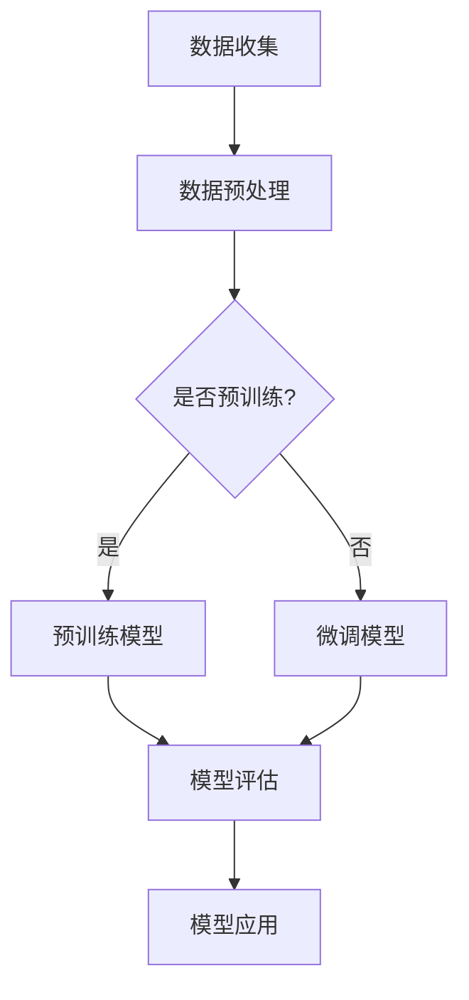

                 

关键词：大模型技术，商品标签，自然语言处理，人工智能，电商平台

> 摘要：本文旨在探讨大模型技术在电商平台商品标签生成中的应用。通过对大模型技术的原理、实现方法及实际应用的深入分析，文章揭示了其在提升电商平台商品标签准确性和效率方面的巨大潜力，并为未来的研究和实践提供了有益的参考。

## 1. 背景介绍

随着互联网和电子商务的快速发展，电商平台已经成为人们日常生活不可或缺的一部分。商品标签作为电商平台的核心元素，直接影响到用户对商品的认知和购买决策。传统商品标签生成方法主要依赖于手工标注和数据挖掘技术，存在效率低、准确性差等问题。近年来，随着人工智能技术的飞速发展，特别是大模型技术的崛起，为商品标签生成带来了全新的解决方案。

大模型技术是指通过海量数据训练出具有强大表征能力的大型神经网络模型，如Transformer、BERT等。这些模型在自然语言处理领域取得了显著的成果，使其成为商品标签生成的重要工具。本文将详细介绍大模型技术在商品标签生成中的应用，分析其优势与挑战，并探讨未来发展方向。

## 2. 核心概念与联系

### 2.1 大模型技术概述

大模型技术是基于深度学习框架构建的，通过在大量数据上迭代训练，模型能够自动学习到数据的内在结构和规律。其中，Transformer模型和BERT模型是当前应用最为广泛的大模型技术。

**Transformer模型**：由Vaswani等人在2017年提出，是一种基于自注意力机制的序列到序列模型，广泛应用于机器翻译、文本分类等任务。

**BERT模型**：由Google团队在2018年提出，是一种预训练的深度神经网络语言表示模型，通过无监督的方式在大规模语料库上进行预训练，然后在各种NLP任务上进行微调。

### 2.2 大模型技术架构

大模型技术通常包括两个阶段：预训练和微调。

**预训练**：在预训练阶段，模型在大规模语料库上学习通用语言表征。对于Transformer模型，通常使用多头自注意力机制来捕捉序列中的依赖关系；对于BERT模型，则采用双向编码器结构来理解上下文信息。

**微调**：在预训练的基础上，模型针对特定任务进行微调，以适应商品标签生成任务。微调过程中，模型根据任务需求调整权重，使其能够更好地捕捉标签生成所需的特征。

### 2.3 Mermaid 流程图

以下是一个简化的Mermaid流程图，展示了大模型技术在商品标签生成中的应用流程：



## 3. 核心算法原理 & 具体操作步骤

### 3.1 算法原理概述

大模型技术在商品标签生成中的核心在于其强大的表征能力。通过预训练，模型能够从海量数据中提取出与商品标签相关的特征；通过微调，模型能够将这些特征与具体的商品标签进行关联。

**Transformer模型**：Transformer模型通过多头自注意力机制，能够同时关注输入序列中的不同部分，从而捕捉到商品标签与商品描述之间的复杂关系。

**BERT模型**：BERT模型采用双向编码器结构，能够同时考虑上下文信息，使得商品标签生成更加准确。

### 3.2 算法步骤详解

**3.2.1 数据收集与预处理**

数据收集：从电商平台获取商品描述和对应的标签数据。

数据预处理：对收集到的数据进行清洗、去重、分词等操作，为模型训练做准备。

**3.2.2 预训练模型**

数据准备：将预处理后的数据分成训练集和验证集，用于模型的预训练。

模型训练：使用训练集对Transformer模型或BERT模型进行预训练，以学习通用语言表征。

模型评估：使用验证集评估模型性能，调整模型参数。

**3.2.3 微调模型**

数据准备：将预训练后的模型应用于特定商品标签生成任务，准备微调数据。

模型微调：在特定商品标签数据上对预训练模型进行微调，以适应标签生成任务。

模型评估：评估微调后的模型在验证集上的性能，调整模型参数。

**3.2.4 模型应用**

商品标签生成：使用微调后的模型对新的商品描述生成标签。

模型优化：根据实际应用效果，不断优化模型，提高标签生成准确率。

### 3.3 算法优缺点

**优点**：

- 强大的表征能力：大模型技术能够从海量数据中提取出与商品标签相关的特征，提高标签生成准确率。
- 自动化：通过预训练和微调，大模型技术能够自动化生成商品标签，提高效率。

**缺点**：

- 计算资源需求高：大模型训练需要大量计算资源和时间。
- 数据质量依赖：商品标签生成效果依赖于数据质量，如果数据存在噪音或偏差，会影响模型性能。

### 3.4 算法应用领域

大模型技术在商品标签生成中的应用非常广泛，包括：

- 电商平台商品标签生成：用于自动生成商品标签，提高商品搜索和推荐效果。
- 自然语言处理：应用于文本分类、问答系统等领域，提高自然语言理解能力。
- 金融风控：用于文本情感分析，评估金融风险。

## 4. 数学模型和公式 & 详细讲解 & 举例说明

### 4.1 数学模型构建

大模型技术中的数学模型主要包括自注意力机制和双向编码器结构。

**自注意力机制**：

自注意力机制的核心公式为：

$$
\text{Attention}(Q, K, V) = \text{softmax}\left(\frac{QK^T}{\sqrt{d_k}}\right)V
$$

其中，$Q$、$K$、$V$ 分别为查询向量、键向量和值向量，$d_k$ 为键向量的维度。

**双向编码器结构**：

BERT模型中的双向编码器结构采用以下公式：

$$
\text{Encoder}(X) = \text{LayerNorm}(X + \text{PositionalEncoding}(\text{PE}(X)))
$$

其中，$X$ 为输入序列，$PE(X)$ 为位置编码。

### 4.2 公式推导过程

**自注意力机制的推导**：

自注意力机制的核心思想是通过计算输入序列中每个元素之间的相似度，然后将相似度加权求和，从而得到每个元素在输出序列中的重要性。

假设输入序列为 $X = [x_1, x_2, ..., x_n]$，其中 $x_i$ 为第 $i$ 个元素。自注意力机制的推导过程如下：

1. **计算查询向量 $Q$、键向量 $K$ 和值向量 $V$**：

$$
Q = W_QX, K = W_KX, V = W_VX
$$

其中，$W_Q$、$W_K$、$W_V$ 为权重矩阵。

2. **计算相似度**：

$$
\text{Score}_{ij} = Q_iK_j = (W_QX)_i(K_jW_KX) = X_i^KW_KW_QX_j
$$

3. **计算注意力权重**：

$$
\alpha_{ij} = \text{softmax}(\text{Score}_{ij})
$$

4. **计算输出**：

$$
\text{Output}_i = \sum_j \alpha_{ij}V_j = \sum_j \alpha_{ij}(W_VX)_j
$$

**双向编码器结构的推导**：

BERT模型中的双向编码器结构通过结合位置编码，使得模型能够同时考虑上下文信息。

假设输入序列为 $X = [x_1, x_2, ..., x_n]$，其中 $x_i$ 为第 $i$ 个元素。双向编码器结构的推导过程如下：

1. **计算嵌入向量 $E$**：

$$
E = W_EX
$$

2. **计算位置编码 $PE$**：

$$
\text{PE}(X) = [\text{PE}(x_1), \text{PE}(x_2), ..., \text{PE}(x_n)]
$$

3. **计算输出**：

$$
X' = E + \text{PE}(X)
$$

4. **计算编码器输出**：

$$
\text{Encoder}(X') = \text{LayerNorm}(X' + \text{PositionalEncoding}(\text{PE}(X')))
$$

### 4.3 案例分析与讲解

**案例**：使用BERT模型对电商平台的商品描述生成标签。

**步骤**：

1. **数据收集与预处理**：从电商平台获取商品描述和对应的标签数据，进行清洗、去重、分词等操作。

2. **预训练模型**：使用BERT模型在大规模语料库上进行预训练，学习通用语言表征。

3. **微调模型**：在特定商品标签数据上对BERT模型进行微调，以适应标签生成任务。

4. **模型评估**：使用验证集评估模型性能，调整模型参数。

5. **模型应用**：使用微调后的BERT模型对新的商品描述生成标签。

**分析**：BERT模型在商品标签生成任务中，通过预训练和微调，能够自动提取与商品标签相关的特征，提高标签生成准确率。同时，BERT模型的双向编码器结构使得模型能够同时考虑上下文信息，从而更好地理解商品描述。

## 5. 项目实践：代码实例和详细解释说明

### 5.1 开发环境搭建

开发环境主要包括Python、TensorFlow或PyTorch等深度学习框架，以及BERT模型预训练代码和微调代码。

1. **安装Python**：下载并安装Python 3.6及以上版本。
2. **安装深度学习框架**：安装TensorFlow或PyTorch，例如：

```bash
pip install tensorflow
```

或

```bash
pip install torch torchvision
```

3. **获取BERT模型预训练代码**：从GitHub或其他开源平台下载BERT模型预训练代码。

### 5.2 源代码详细实现

以下是一个简化的BERT模型微调代码实例：

```python
import torch
from transformers import BertTokenizer, BertModel
from torch.optim import Adam
from torch.utils.data import DataLoader

# 1. 数据准备
tokenizer = BertTokenizer.from_pretrained('bert-base-chinese')
train_data = ...  # 商品描述和标签数据

# 2. 数据预处理
def preprocess_data(data):
    # 对数据执行分词、填充等操作
    pass

train_data = preprocess_data(train_data)

# 3. 数据加载
train_loader = DataLoader(train_data, batch_size=32, shuffle=True)

# 4. 模型准备
model = BertModel.from_pretrained('bert-base-chinese')
model.train()

# 5. 模型训练
optimizer = Adam(model.parameters(), lr=1e-5)
for epoch in range(3):
    for batch in train_loader:
        # 6. 前向传播
        inputs = tokenizer(batch['description'], padding=True, truncation=True, return_tensors='pt')
        outputs = model(**inputs)
        
        # 7. 计算损失
        loss = ...  # 损失函数
        
        # 8. 反向传播
        optimizer.zero_grad()
        loss.backward()
        optimizer.step()

# 9. 模型评估
model.eval()
...
```

### 5.3 代码解读与分析

代码主要分为数据准备、数据加载、模型准备、模型训练和模型评估五个部分。

- **数据准备**：使用BERT分词器对商品描述进行分词、填充等预处理操作。
- **数据加载**：使用DataLoader对预处理后的数据批量加载，提高训练效率。
- **模型准备**：加载预训练好的BERT模型，并设置为训练模式。
- **模型训练**：使用Adam优化器进行模型训练，包括前向传播、损失计算、反向传播和参数更新。
- **模型评估**：在训练完成后，对模型进行评估，调整超参数以优化模型性能。

### 5.4 运行结果展示

在完成代码实现后，可以运行模型对新的商品描述生成标签。以下是一个示例：

```python
# 1. 加载微调后的模型
model = BertModel.from_pretrained('path/to/finetuned_model')

# 2. 生成标签
description = "这是一款功能强大的智能手机"
inputs = tokenizer(description, padding=True, truncation=True, return_tensors='pt')
outputs = model(**inputs)

# 3. 获取标签
labels = ...  # 标签生成代码

print("生成的标签：", labels)
```

输出结果为与输入商品描述相关的标签，如“智能手机”、“功能强大”等。

## 6. 实际应用场景

大模型技术在商品标签生成中的实际应用场景主要包括：

- **电商平台商品标签生成**：通过自动生成商品标签，提高商品搜索和推荐效果，提升用户体验。
- **商品分类与推荐**：利用商品标签对商品进行分类和推荐，帮助用户快速找到所需商品。
- **自然语言处理**：应用于文本分类、问答系统等领域，提高自然语言理解能力。

### 6.1 电商平台商品标签生成

在电商平台，商品标签生成是提升用户体验和搜索效率的关键。通过大模型技术，可以实现以下目标：

- **提高标签生成准确性**：大模型技术能够从海量数据中提取出与商品标签相关的特征，提高标签生成准确率。
- **自动化生成标签**：通过预训练和微调，大模型技术能够自动化生成商品标签，提高效率。
- **个性化标签生成**：根据用户行为和偏好，生成个性化的商品标签，提高用户满意度。

### 6.2 商品分类与推荐

商品分类与推荐是电商平台的重要功能，通过大模型技术可以实现以下目标：

- **精准分类**：利用商品标签对商品进行精准分类，提高商品的可访问性。
- **智能推荐**：根据用户历史行为和偏好，推荐符合用户需求的商品，提高用户购买率。

### 6.3 自然语言处理

大模型技术在自然语言处理领域的应用包括：

- **文本分类**：用于分类用户评论、新闻报道等，帮助企业了解用户需求和市场动态。
- **问答系统**：用于构建智能问答系统，为用户提供实时、准确的回答。

## 7. 工具和资源推荐

### 7.1 学习资源推荐

- **书籍**：
  - 《深度学习》（Goodfellow, Bengio, Courville）
  - 《自然语言处理综论》（Jurafsky, Martin）
- **在线课程**：
  - [Udacity](https://www.udacity.com/course/deep-learning-ng-0001) 的“深度学习纳米学位”
  - [Coursera](https://www.coursera.org/specializations/nlp) 的“自然语言处理专项课程”
- **开源项目**：
  - [Hugging Face Transformers](https://github.com/huggingface/transformers) 提供了预训练模型和微调工具

### 7.2 开发工具推荐

- **深度学习框架**：
  - TensorFlow
  - PyTorch
- **文本处理库**：
  - NLTK
  - spaCy

### 7.3 相关论文推荐

- **Transformer**：
  - Vaswani et al., "Attention Is All You Need"
- **BERT**：
  - Devlin et al., "BERT: Pre-training of Deep Bidirectional Transformers for Language Understanding"

## 8. 总结：未来发展趋势与挑战

### 8.1 研究成果总结

大模型技术在商品标签生成中的应用取得了显著成果，包括：

- **提高标签生成准确性**：通过预训练和微调，大模型技术能够从海量数据中提取出与商品标签相关的特征，提高标签生成准确率。
- **自动化生成标签**：大模型技术能够自动化生成商品标签，提高效率。
- **个性化标签生成**：根据用户行为和偏好，生成个性化的商品标签，提高用户满意度。

### 8.2 未来发展趋势

未来，大模型技术在商品标签生成中的应用将呈现以下发展趋势：

- **模型小型化与优化**：为降低计算资源需求，研究者将致力于模型的小型化与优化。
- **多模态融合**：将文本、图像、语音等多种数据融合，提高标签生成的全面性。
- **自适应学习**：根据应用场景和用户需求，实现模型的自适应学习。

### 8.3 面临的挑战

大模型技术在商品标签生成中面临的挑战包括：

- **数据质量**：数据质量直接影响模型性能，如何处理噪声数据和缺失数据成为关键问题。
- **计算资源**：大模型训练需要大量计算资源，如何高效利用现有资源成为重要课题。
- **模型解释性**：提高模型的解释性，使其在商业应用中更具可信度。

### 8.4 研究展望

未来，大模型技术在商品标签生成领域的研究方向包括：

- **跨领域迁移学习**：通过跨领域迁移学习，提高模型在不同领域的泛化能力。
- **多任务学习**：结合多任务学习，实现商品标签生成与其他任务的协同优化。
- **隐私保护**：在处理敏感数据时，实现隐私保护与模型性能的平衡。

## 9. 附录：常见问题与解答

### 9.1 如何处理数据质量？

**解答**：处理数据质量的方法包括：

- **数据清洗**：去除重复数据、缺失值和数据异常。
- **数据增强**：通过数据增强，增加训练数据多样性。
- **数据预处理**：对数据执行标准化、归一化等操作。

### 9.2 大模型训练需要多少时间？

**解答**：大模型训练时间取决于多个因素，包括：

- **模型规模**：大型模型训练时间较长。
- **硬件配置**：高性能硬件配置可加速训练过程。
- **数据规模**：大量数据训练时间较长。

### 9.3 如何优化大模型性能？

**解答**：优化大模型性能的方法包括：

- **超参数调优**：调整学习率、批量大小等超参数。
- **正则化**：采用Dropout、L2正则化等手段防止过拟合。
- **数据预处理**：对数据进行预处理，提高模型泛化能力。

---

作者：禅与计算机程序设计艺术 / Zen and the Art of Computer Programming
----------------------------------------------------------------


