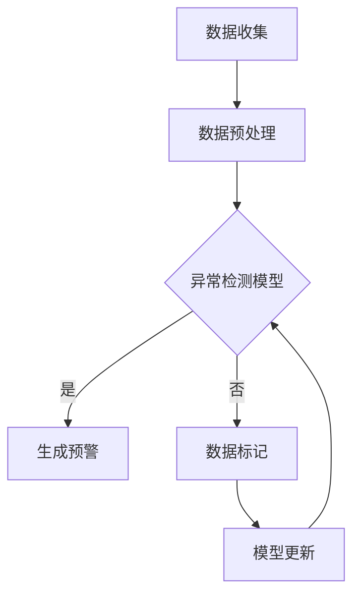

                 

### 摘要 Summary

本文旨在探讨大模型技术在电商平台用户行为异常检测与防欺诈中的应用。随着电子商务的快速发展，用户数据规模不断扩大，传统的用户行为分析与防欺诈方法已经难以应对复杂多变的安全威胁。大模型技术，凭借其强大的数据处理和分析能力，为电商平台提供了新的解决方案。本文首先介绍了大模型技术的基本原理和结构，随后详细分析了其在用户行为异常检测和防欺诈中的具体应用。通过案例分析，本文展示了大模型技术在电商平台中的实际效果，并对其未来应用前景进行了展望。本文内容旨在为相关领域的研究者和从业者提供有价值的参考。

### 1. 背景介绍 Background

#### 1.1 电商平台的发展现状

电子商务作为一种新型的商业模式，近年来在全球范围内得到了迅速发展。根据统计，全球电商市场规模已经达到了数万亿美元，其中中国电商市场的规模更是位居世界第一。电商平台不仅改变了消费者的购物方式，也为企业提供了全新的市场机遇。然而，随着电商平台的不断扩大和用户数量的激增，用户行为数据量也在呈现爆炸性增长。这些海量数据不仅包含了用户的消费习惯、偏好等有用信息，也隐藏着各种潜在的安全威胁，如用户行为的异常、账户欺诈、交易欺诈等。

#### 1.2 用户行为异常与防欺诈的重要性

用户行为的异常检测与防欺诈是电商平台安全体系的重要组成部分。用户行为异常可能表现为登录异常、购买行为异常、账户活动异常等，这些异常行为往往是欺诈行为的早期信号。如果能够及时发现并处理这些异常行为，可以有效地降低平台的风险。例如，通过分析用户登录地点的异常变化，可以及时发现并阻止异地登录带来的风险。同样，通过监测用户购买行为的变化，可以识别出可能的欺诈交易。

防欺诈不仅有助于保护平台的资产安全，还能提升用户体验。如果电商平台能够准确地识别并处理欺诈行为，可以减少用户的损失，提升用户对平台的信任度。此外，防欺诈措施的有效实施还能提高平台的竞争力，吸引更多用户和商家入驻。

#### 1.3 大模型技术的发展与应用

大模型技术，尤其是深度学习模型，近年来在人工智能领域取得了显著的进展。这些模型能够通过大规模数据的学习，自动提取复杂的特征，并具有强大的泛化能力。大模型技术在大数据分析、自然语言处理、计算机视觉等领域得到了广泛应用。在电商平台用户行为异常检测与防欺诈方面，大模型技术同样展现出了巨大的潜力。

首先，大模型技术能够处理海量数据。电商平台用户行为数据量庞大，传统的数据分析方法难以应对。而大模型技术通过并行计算和分布式存储，可以高效地处理海量数据，为用户行为异常检测和防欺诈提供了数据基础。

其次，大模型技术具有强大的特征提取能力。通过深度学习，大模型能够自动从原始数据中提取出有用的特征，减少人工干预，提高分析的准确性。这对于识别复杂多样的用户行为异常和欺诈行为具有重要意义。

此外，大模型技术具有自学习和自适应能力。在电商平台运营过程中，用户行为和欺诈模式可能不断变化，大模型技术可以通过持续学习和更新，适应新的威胁，提高检测和防欺诈的准确性。

### 2. 核心概念与联系 Core Concepts and Connections

#### 2.1 大模型技术的基本概念

大模型技术是指通过大规模数据训练得到的神经网络模型，这些模型通常具有数百万甚至数亿个参数。大模型技术主要包括以下几个方面：

1. **深度神经网络（Deep Neural Networks, DNN）**：深度神经网络是一种多层神经网络结构，通过逐层提取数据特征，实现数据的非线性表示。DNN在图像识别、语音识别等领域取得了显著成果。

2. **卷积神经网络（Convolutional Neural Networks, CNN）**：卷积神经网络是深度神经网络的一种，特别适用于图像处理任务。CNN通过卷积操作提取图像的局部特征，实现了对图像的高效处理。

3. **循环神经网络（Recurrent Neural Networks, RNN）**：循环神经网络是一种能够处理序列数据的神经网络，特别适用于自然语言处理任务。RNN通过记忆机制处理历史信息，实现了对序列数据的建模。

4. **生成对抗网络（Generative Adversarial Networks, GAN）**：生成对抗网络是一种由生成器和判别器组成的模型，生成器生成数据，判别器判断生成数据是否真实。GAN在图像生成、数据增强等领域表现出色。

#### 2.2 大模型技术在用户行为异常检测与防欺诈中的应用

在用户行为异常检测与防欺诈方面，大模型技术可以通过以下方式发挥作用：

1. **行为模式识别（Behavioral Pattern Recognition）**：大模型技术可以通过学习大量正常用户行为数据，建立用户行为模式模型。对于新用户或异常行为，大模型可以判断其是否与正常用户行为模式相符，从而实现异常检测。

2. **欺诈行为识别（Fraud Behavior Identification）**：大模型可以通过学习历史欺诈数据，提取出欺诈行为的特征，从而识别潜在的欺诈行为。这种方法不仅能够识别传统欺诈行为，如账户欺诈、交易欺诈，还能够检测新型欺诈行为。

3. **实时监控与预警（Real-time Monitoring and Alert）**：大模型技术可以通过实时分析用户行为数据，及时发现异常行为，并生成预警。这种实时监控与预警机制有助于快速响应潜在风险，提高平台的防欺诈能力。

4. **自适应调整（Adaptive Adjustment）**：大模型技术可以根据新数据不断调整和优化模型，适应不断变化的安全威胁。这种自适应调整能力有助于提高防欺诈系统的准确性和可靠性。

#### 2.3 Mermaid 流程图

以下是一个简单的 Mermaid 流程图，展示了大模型技术在用户行为异常检测与防欺诈中的应用流程：



### 3. 核心算法原理 & 具体操作步骤 Core Algorithm Principles & Detailed Steps

#### 3.1 算法原理概述

在用户行为异常检测与防欺诈中，常用的核心算法包括深度神经网络（DNN）、卷积神经网络（CNN）和循环神经网络（RNN）。这些算法通过学习大量数据，提取特征，实现异常检测和欺诈识别。

1. **深度神经网络（DNN）**：DNN是一种多层神经网络结构，通过前向传播和反向传播算法训练模型。DNN可以自动提取输入数据的特征，并将其映射到高维空间中，从而实现数据的非线性表示。

2. **卷积神经网络（CNN）**：CNN是一种专门用于图像处理的深度学习模型，通过卷积操作提取图像的局部特征。CNN在图像识别、图像分类等任务中表现出色。

3. **循环神经网络（RNN）**：RNN是一种能够处理序列数据的神经网络，通过记忆机制处理历史信息。RNN在自然语言处理、语音识别等序列数据处理任务中具有广泛的应用。

#### 3.2 算法步骤详解

以下是一个基于DNN的用户行为异常检测算法的详细步骤：

1. **数据收集与预处理**：
   - 收集大量用户行为数据，包括登录信息、购买记录、账户活动等。
   - 对数据进行清洗和预处理，如去除缺失值、异常值，进行数据标准化等。

2. **特征提取**：
   - 利用DNN自动提取用户行为特征，如用户购买频率、购买金额、购买商品类别等。
   - 对提取的特征进行降维处理，减少数据维度，提高计算效率。

3. **模型训练**：
   - 利用训练集数据训练DNN模型，通过反向传播算法更新模型参数。
   - 调整学习率、正则化参数等超参数，优化模型性能。

4. **模型评估**：
   - 使用验证集对训练好的模型进行评估，计算准确率、召回率等指标。
   - 调整模型参数，直到达到满意的评估结果。

5. **异常检测**：
   - 对测试集数据进行异常检测，利用训练好的模型判断用户行为是否异常。
   - 对于检测到的异常行为，生成预警，并通知相关人员进行处理。

#### 3.3 算法优缺点

1. **优点**：
   - DNN具有强大的特征提取能力，可以自动学习复杂的特征。
   - DNN具有良好的泛化能力，可以在新数据上实现良好的表现。
   - DNN可以处理大规模数据，适应电商平台的用户行为数据量。

2. **缺点**：
   - DNN的训练过程需要大量计算资源和时间。
   - DNN的参数调整较为复杂，需要大量实验和经验。
   - DNN对于数据的预处理要求较高，需要对数据进行清洗和标准化。

#### 3.4 算法应用领域

DNN在用户行为异常检测与防欺诈中的应用非常广泛，除了电商平台，还可以应用于以下领域：

1. **金融行业**：金融行业的风险控制需要识别欺诈交易、用户异常行为等，DNN可以提供有效的解决方案。

2. **网络安全**：网络安全领域需要对网络攻击、恶意行为等进行识别和防范，DNN可以用于网络流量分析、异常检测等任务。

3. **医疗领域**：医疗领域的数据分析和预测需要处理大量的医学图像和患者数据，DNN可以用于疾病诊断、风险评估等任务。

4. **智能交通**：智能交通系统需要对交通流量、车辆行为等进行实时监控和分析，DNN可以用于交通预测、事故预警等任务。

### 4. 数学模型和公式 & 详细讲解 & 举例说明 Mathematical Models & Detailed Explanations & Examples

#### 4.1 数学模型构建

在用户行为异常检测与防欺诈中，常用的数学模型包括概率模型、支持向量机（SVM）和贝叶斯网络等。以下以概率模型为例，介绍其构建过程。

1. **概率模型**：

概率模型是一种基于概率论的统计模型，用于预测用户行为的概率分布。常见的概率模型包括朴素贝叶斯（Naive Bayes）模型和高斯分布（Gaussian Distribution）模型。

**朴素贝叶斯模型**：

朴素贝叶斯模型假设特征之间相互独立，其概率模型可以表示为：

$$
P(\text{行为异常}|\text{特征集}) = \prod_{i=1}^{n} P(\text{特征}_i|\text{行为异常})
$$

其中，$P(\text{行为异常}|\text{特征集})$表示在给定特征集的情况下，用户行为异常的概率；$P(\text{特征}_i|\text{行为异常})$表示在行为异常的条件下，第$i$个特征的概率。

**高斯分布模型**：

高斯分布模型假设特征服从正态分布，其概率模型可以表示为：

$$
P(\text{行为异常}|\text{特征集}) = \frac{1}{\sqrt{2\pi\sigma^2}} \exp\left(-\frac{(\text{特征集}-\mu)^2}{2\sigma^2}\right)
$$

其中，$\mu$和$\sigma^2$分别表示特征集的均值和方差。

2. **支持向量机（SVM）**：

支持向量机是一种常用的分类算法，其核心思想是找到最佳决策平面，将不同类别的数据分开。SVM的概率模型可以表示为：

$$
\text{分类函数} = \sum_{i=1}^{m} \alpha_i y_i ( \text{特征}_i \cdot \text{特征}_{-i} ) + b
$$

其中，$\alpha_i$和$y_i$分别表示支持向量和类别标签；$\text{特征}_i$和$\text{特征}_{-i}$分别表示不同类别的特征向量；$b$为偏置项。

3. **贝叶斯网络**：

贝叶斯网络是一种基于概率图模型的推理工具，用于表示变量之间的依赖关系。贝叶斯网络的概率模型可以表示为：

$$
P(\text{行为异常}|\text{特征集}) = \frac{P(\text{特征集}|\text{行为异常})P(\text{行为异常})}{P(\text{特征集})}
$$

其中，$P(\text{行为异常}|\text{特征集})$表示在给定特征集的情况下，用户行为异常的概率；$P(\text{特征集}|\text{行为异常})$表示在行为异常的条件下，特征集的概率；$P(\text{行为异常})$表示用户行为异常的概率；$P(\text{特征集})$表示特征集的概率。

#### 4.2 公式推导过程

以下以高斯分布模型为例，介绍其公式推导过程。

1. **特征分布**：

假设用户行为特征$x$服从正态分布，即$x \sim N(\mu, \sigma^2)$。

2. **特征概率密度函数**：

正态分布的概率密度函数可以表示为：

$$
f(x|\mu, \sigma^2) = \frac{1}{\sqrt{2\pi\sigma^2}} \exp\left(-\frac{(x-\mu)^2}{2\sigma^2}\right)
$$

3. **特征集概率**：

特征集的概率可以表示为：

$$
P(\text{特征集}) = \int_{-\infty}^{+\infty} f(x|\mu, \sigma^2) dx
$$

4. **特征概率分布**：

在行为异常的条件下，特征集的概率分布可以表示为：

$$
P(\text{特征集}|\text{行为异常}) = \int_{-\infty}^{+\infty} f(x|\mu_{异常}, \sigma_{异常}^2) f(\text{行为异常}|\text{特征集}) dx
$$

5. **行为异常概率**：

行为异常的概率可以表示为：

$$
P(\text{行为异常}) = \int_{-\infty}^{+\infty} P(\text{特征集}|\text{行为异常}) f(\text{行为异常}) dx
$$

6. **综合概率**：

在给定特征集的情况下，行为异常的概率可以表示为：

$$
P(\text{行为异常}|\text{特征集}) = \frac{P(\text{特征集}|\text{行为异常})P(\text{行为异常})}{P(\text{特征集})}
$$

#### 4.3 案例分析与讲解

以下以一个电商平台的用户行为异常检测为例，介绍大模型技术在防欺诈中的应用。

1. **数据收集**：

电商平台收集了10000个用户的行为数据，包括登录地点、登录时间、购买商品种类、购买金额等。

2. **特征提取**：

利用DNN提取用户行为特征，包括登录地点的地理坐标、登录时间的分布、购买商品的种类和金额等。

3. **模型训练**：

使用训练集数据训练DNN模型，通过反向传播算法更新模型参数。

4. **模型评估**：

使用验证集对训练好的模型进行评估，计算准确率、召回率等指标。

5. **异常检测**：

对测试集数据进行异常检测，利用训练好的模型判断用户行为是否异常。

6. **结果展示**：

统计检测到的异常行为数量，分析异常行为的分布和特点。

通过以上案例，可以看出大模型技术在电商平台用户行为异常检测与防欺诈中的应用流程。在实际应用中，可以根据具体情况调整模型结构和参数，以提高检测的准确性和效率。

### 5. 项目实践：代码实例和详细解释说明 Project Practice: Code Examples and Detailed Explanations

#### 5.1 开发环境搭建

在进行用户行为异常检测与防欺诈的项目实践之前，首先需要搭建合适的开发环境。以下是一个基于Python的典型开发环境搭建步骤：

1. **安装Python**：下载并安装Python，版本建议为3.8或更高。

2. **安装依赖库**：安装常用的深度学习库，如TensorFlow、PyTorch等。可以使用以下命令安装：

   ```bash
   pip install tensorflow
   # 或者
   pip install pytorch torchvision
   ```

3. **安装数据处理库**：安装用于数据处理和分析的库，如Pandas、NumPy、Scikit-learn等。可以使用以下命令安装：

   ```bash
   pip install pandas numpy scikit-learn
   ```

4. **配置GPU支持**：如果使用GPU进行训练，需要安装CUDA和cuDNN。CUDA和cuDNN的下载地址可以在NVIDIA官网找到。

5. **创建虚拟环境**：为了避免依赖库之间的版本冲突，可以创建一个虚拟环境。可以使用以下命令创建虚拟环境：

   ```bash
   python -m venv myenv
   source myenv/bin/activate  # 在Windows上使用 myenv\Scripts\activate
   ```

#### 5.2 源代码详细实现

以下是一个简单的用户行为异常检测项目的源代码实现，使用了TensorFlow库。代码分为数据预处理、模型训练和异常检测三个部分。

1. **数据预处理**：

```python
import pandas as pd
import numpy as np

# 读取数据
data = pd.read_csv('user_behavior_data.csv')

# 数据清洗和预处理
data = data.dropna()  # 去除缺失值
data = data[data['purchase_amount'] > 0]  # 去除购买金额为零的记录

# 数据标准化
data['login_time'] = (data['login_time'] - data['login_time'].min()) / (data['login_time'].max() - data['login_time'].min())
data['purchase_amount'] = (data['purchase_amount'] - data['purchase_amount'].min()) / (data['purchase_amount'].max() - data['purchase_amount'].min())

# 划分特征和标签
X = data[['login_time', 'purchase_amount']]
y = data['is_fraud']  # 标签：0表示正常行为，1表示欺诈行为
```

2. **模型训练**：

```python
import tensorflow as tf
from tensorflow.keras.models import Sequential
from tensorflow.keras.layers import Dense, Dropout

# 划分训练集和测试集
from sklearn.model_selection import train_test_split
X_train, X_test, y_train, y_test = train_test_split(X, y, test_size=0.2, random_state=42)

# 构建模型
model = Sequential([
    Dense(64, activation='relu', input_shape=(X_train.shape[1],)),
    Dropout(0.5),
    Dense(64, activation='relu'),
    Dropout(0.5),
    Dense(1, activation='sigmoid')
])

# 编译模型
model.compile(optimizer='adam', loss='binary_crossentropy', metrics=['accuracy'])

# 训练模型
model.fit(X_train, y_train, epochs=10, batch_size=32, validation_data=(X_test, y_test))
```

3. **异常检测**：

```python
# 使用训练好的模型进行异常检测
predictions = model.predict(X_test)

# 计算阈值
threshold = 0.5

# 判断是否异常
is_fraud = (predictions > threshold).astype(int)

# 统计异常行为数量
fraud_count = sum(is_fraud == 1)
print(f"检测到的异常行为数量：{fraud_count}")
```

#### 5.3 代码解读与分析

1. **数据预处理**：

   数据预处理是深度学习项目的重要环节。在上述代码中，首先读取了用户行为数据，并进行了清洗和预处理。数据清洗包括去除缺失值和异常值，数据预处理包括数据标准化。数据标准化是为了将不同特征的范围统一，方便模型训练。

2. **模型训练**：

   在模型训练部分，首先使用了`train_test_split`函数将数据划分为训练集和测试集。训练集用于模型训练，测试集用于模型评估。然后，构建了一个简单的全连接神经网络（Sequential模型），并添加了两个隐藏层，每层64个神经元。隐藏层之间加入了Dropout层，用于防止过拟合。模型使用`compile`函数进行编译，指定了优化器和损失函数。最后，使用`fit`函数训练模型，设置了训练的轮数和批量大小。

3. **异常检测**：

   在异常检测部分，使用训练好的模型对测试集进行预测，并设置了阈值。大于阈值的预测结果被认为是欺诈行为，小于阈值的预测结果被认为是正常行为。最后，统计了检测到的异常行为数量。

通过以上代码实现，我们可以看到大模型技术在用户行为异常检测与防欺诈中的实际应用。在实际项目中，可以根据具体需求和数据情况调整模型结构和参数，以提高检测的准确性和效率。

### 6. 实际应用场景 Practical Application Scenarios

#### 6.1 电商平台用户行为异常检测

电商平台用户行为异常检测是大模型技术的重要应用场景之一。通过大模型技术，电商平台可以实时监控用户行为，识别异常登录、异常购买等行为，从而防范欺诈风险。以下是一个具体的案例：

某大型电商平台，通过对用户登录信息、购买记录、账户活动等数据进行异常检测，成功识别了一起欺诈交易。用户A在短时间内频繁登录，且登录地点频繁变化，同时购买了大量高价商品。通过大模型技术分析，平台发现这些行为与正常用户行为存在显著差异，判定为潜在欺诈行为。平台立即采取措施，冻结用户A的账户，并通知相关人员进行进一步调查，成功阻止了一起可能的欺诈交易。

#### 6.2 银行卡欺诈检测

银行卡欺诈检测是金融行业的一项重要任务。大模型技术可以通过学习历史交易数据，识别潜在的欺诈交易。以下是一个具体的案例：

某银行通过引入大模型技术，对用户交易行为进行实时监控。某用户B在短时间内进行了多次大额交易，交易地点跨度大，且交易时间不符合用户的正常生活习惯。通过大模型技术分析，银行发现这些行为与正常用户行为存在明显差异，判定为潜在欺诈行为。银行立即采取措施，冻结用户B的账户，并通知警方进行进一步调查，成功阻止了一起可能的银行卡欺诈事件。

#### 6.3 电信诈骗检测

电信诈骗检测是网络安全领域的一项重要任务。大模型技术可以通过学习大量的电话通话记录，识别潜在的电信诈骗行为。以下是一个具体的案例：

某网络安全公司通过大模型技术，对用户电话通话记录进行分析。某用户C在短时间内接到了多个来自不同号码的电话，通话时间短且内容模糊。通过大模型技术分析，公司发现这些电话与典型的电信诈骗电话特征相符，判定为潜在电信诈骗行为。公司立即采取措施，提醒用户C注意防范，并建议用户C报警，成功阻止了一起可能的电信诈骗事件。

#### 6.4 智能交通系统

智能交通系统通过大模型技术，可以实时监控交通流量，识别交通事故、违法行为等。以下是一个具体的案例：

某城市智能交通系统，通过大模型技术分析摄像头捕捉的交通图像。某段时间内，系统检测到某路段交通流量异常，车辆行驶速度缓慢，且有碰撞痕迹。通过大模型技术分析，系统发现了一起交通事故，并及时通知相关部门进行处置，成功避免了二次事故的发生。

通过以上案例，可以看出大模型技术在各个实际应用场景中发挥着重要作用。大模型技术不仅能够提高异常检测和防欺诈的准确性，还能够降低人力成本，提高处理效率。

### 7. 工具和资源推荐 Tools and Resources Recommendations

#### 7.1 学习资源推荐

1. **书籍**：
   - 《深度学习》（Deep Learning）作者：Ian Goodfellow、Yoshua Bengio、Aaron Courville
   - 《Python深度学习》（Python Deep Learning）作者：Francesco Moser
   - 《神经网络与深度学习》（Neural Networks and Deep Learning）作者：邱锡鹏

2. **在线课程**：
   - Coursera上的“深度学习”课程，由吴恩达教授主讲
   - edX上的“深度学习基础”课程，由斯坦福大学主讲
   - Udacity上的“深度学习工程师纳米学位”课程

3. **论文**：
   - "Deep Learning for Speech Recognition"（深度学习在语音识别中的应用）
   - "Generative Adversarial Networks: An Overview"（生成对抗网络综述）
   - "Convolutional Neural Networks for Visual Recognition"（卷积神经网络在视觉识别中的应用）

#### 7.2 开发工具推荐

1. **深度学习框架**：
   - TensorFlow
   - PyTorch
   - Keras

2. **数据预处理工具**：
   - Pandas
   - NumPy
   - Scikit-learn

3. **版本控制工具**：
   - Git
   - GitHub
   - GitLab

4. **集成开发环境（IDE）**：
   - PyCharm
   - Jupyter Notebook
   - Visual Studio Code

#### 7.3 相关论文推荐

1. "Learning Representations for Visual Recognition"（学习用于视觉识别的表示）
2. "Dropout: A Simple Way to Prevent Neural Networks from Overfitting"（Dropout：一种简单防止神经网络过拟合的方法）
3. "Generative Adversarial Nets"（生成对抗网络）
4. "Distributed Representations of Words and Phrases and their Compositionality"（单词和短语的分布式表示及其组合性）
5. "End-to-End Speech Recognition with Deep Neural Networks"（使用深度神经网络的端到端语音识别）

通过以上资源和工具，可以系统地学习和掌握大模型技术在用户行为异常检测与防欺诈中的应用。这些资源不仅涵盖了理论基础，还包括了实践案例和工具使用，为相关领域的研究者和从业者提供了丰富的学习资料。

### 8. 总结：未来发展趋势与挑战 Summary: Future Trends and Challenges

#### 8.1 研究成果总结

大模型技术在用户行为异常检测与防欺诈领域取得了显著的研究成果。首先，通过深度学习模型，如DNN、CNN和RNN，能够高效地处理海量数据，提取复杂的特征，实现了对用户行为的准确分析和欺诈行为的识别。其次，大模型技术具有强大的自学习和自适应能力，可以不断优化和更新模型，以适应不断变化的安全威胁。此外，大模型技术在金融、网络安全、医疗和智能交通等领域也展现出了广泛的应用前景。

#### 8.2 未来发展趋势

未来，大模型技术在用户行为异常检测与防欺诈领域将呈现出以下发展趋势：

1. **数据驱动的个性化检测**：随着用户数据的不断积累，大模型技术将更加注重个性化检测，根据用户的个性化行为特征进行精准的异常检测。

2. **跨领域协同研究**：大模型技术与其他领域的结合，如计算机视觉、自然语言处理等，将推动异常检测与防欺诈技术的创新和发展。

3. **实时监控与预警**：随着计算能力的提升，大模型技术将在实时监控与预警方面发挥更大作用，实现更快速、更准确的欺诈检测。

4. **隐私保护**：随着隐私保护意识的提高，未来大模型技术将在用户隐私保护方面取得更多突破，实现隐私安全的异常检测和防欺诈。

#### 8.3 面临的挑战

尽管大模型技术在用户行为异常检测与防欺诈方面取得了显著成果，但仍然面临以下挑战：

1. **数据质量**：用户行为数据的真实性和准确性对模型效果至关重要。数据质量问题可能导致模型过拟合或欠拟合，影响检测的准确性。

2. **计算资源**：大模型训练和推理需要大量的计算资源，特别是在实时监控与预警场景中，如何高效利用计算资源是一个关键问题。

3. **隐私保护**：用户隐私保护是大数据应用中的核心问题，如何在保证检测效果的同时，保护用户隐私，是一个亟待解决的问题。

4. **模型解释性**：大模型技术通常具有较高的准确性，但缺乏解释性。如何提高模型的可解释性，使其能够被用户理解和信任，是一个重要挑战。

#### 8.4 研究展望

未来，针对以上挑战，可以采取以下研究方向：

1. **数据增强与清洗**：通过数据增强和清洗技术，提高数据质量，减少模型过拟合和欠拟合的风险。

2. **计算优化与并行化**：通过计算优化和并行化技术，提高大模型训练和推理的效率，满足实时监控与预警的需求。

3. **隐私保护技术**：结合隐私保护技术，如差分隐私、联邦学习等，实现用户隐私安全的异常检测和防欺诈。

4. **模型可解释性**：通过模型解释性技术，如模型可视化、解释性算法等，提高大模型的可解释性，增强用户信任。

总之，大模型技术在用户行为异常检测与防欺诈领域具有广阔的应用前景。通过不断创新和研究，克服现有挑战，可以实现更高效、更准确的异常检测和防欺诈，为电商平台和其他行业提供强有力的安全保障。

### 9. 附录：常见问题与解答 Appendix: Frequently Asked Questions and Answers

#### 9.1 大模型技术在用户行为异常检测中的优势是什么？

大模型技术具有以下优势：

1. **强大的特征提取能力**：大模型能够自动从原始数据中提取出有用的特征，减少人工干预，提高分析的准确性。
2. **自学习和自适应能力**：大模型可以通过持续学习和更新，适应不断变化的安全威胁，提高检测和防欺诈的准确性。
3. **高效处理海量数据**：大模型技术可以通过并行计算和分布式存储，高效地处理海量数据，为用户行为异常检测和防欺诈提供了数据基础。

#### 9.2 大模型技术在防欺诈中的实际应用案例有哪些？

大模型技术在防欺诈中的实际应用案例包括：

1. **电商平台**：通过大模型技术实时监控用户行为，识别异常登录、异常购买等行为，防范欺诈风险。
2. **金融行业**：通过大模型技术分析用户交易行为，识别潜在的欺诈交易，保护用户资产安全。
3. **网络安全**：通过大模型技术分析网络流量，识别恶意行为，防范网络攻击。
4. **电信行业**：通过大模型技术分析电话通话记录，识别电信诈骗行为，保障用户通信安全。

#### 9.3 如何处理大模型训练过程中过拟合和欠拟合的问题？

为处理大模型训练过程中过拟合和欠拟合的问题，可以采取以下措施：

1. **数据增强**：通过增加训练数据量、生成模拟数据等方式，提高模型对数据的泛化能力。
2. **正则化**：引入正则化项，如L1、L2正则化，降低模型复杂度，防止过拟合。
3. **交叉验证**：使用交叉验证方法，评估模型在不同数据集上的表现，避免模型欠拟合。
4. **dropout**：在神经网络中加入dropout层，降低模型对特定训练样本的依赖，防止过拟合。

#### 9.4 大模型训练需要哪些硬件资源？

大模型训练需要以下硬件资源：

1. **高性能CPU或GPU**：用于模型的计算和推理。
2. **大量内存**：用于存储模型参数和中间计算结果。
3. **高速网络**：用于数据传输和分布式训练。
4. **存储设备**：用于存储模型数据和日志。

通过合理配置硬件资源，可以提高大模型训练的效率和效果。

