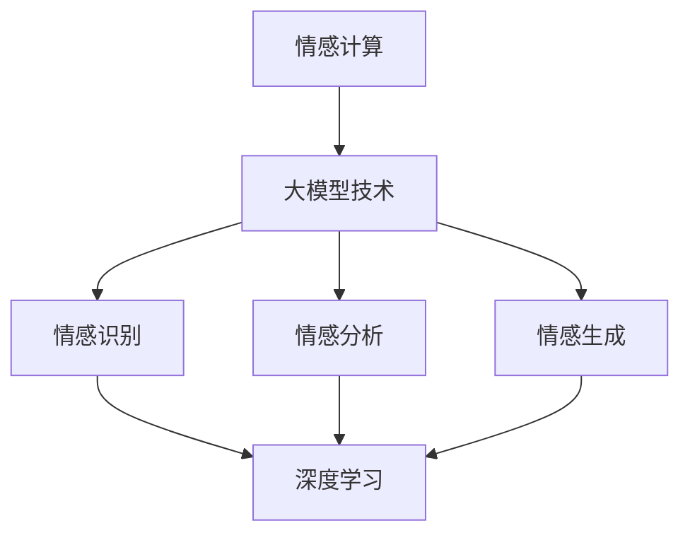

                 

关键词：大模型技术、情感计算、深度学习、神经网络、自然语言处理、情感识别、情感分析、应用前景

摘要：本文探讨了大模型技术在情感计算领域的发展，从背景介绍、核心概念与联系、核心算法原理与具体操作步骤、数学模型与公式推导、项目实践、实际应用场景到未来应用展望，全面剖析了情感计算在大模型技术下的最新进展和潜在价值。

## 1. 背景介绍

随着人工智能技术的飞速发展，机器开始逐渐具备理解和分析人类情感的能力。情感计算（Affective Computing）作为人工智能的重要分支，旨在使计算机能够感知、理解、处理和模拟人类情感。这一领域的研究始于20世纪90年代，随着深度学习、神经网络和自然语言处理技术的进步，情感计算得到了迅猛发展。

大模型技术，如Transformer、BERT等，通过捕捉海量的语言数据，构建了具备强大语言理解能力的模型。这些模型在情感计算中扮演了关键角色，使得情感识别和情感分析的准确性大幅提升。本文将深入探讨大模型技术在情感计算中的应用，分析其核心算法原理、数学模型、项目实践和未来应用前景。

## 2. 核心概念与联系

### 2.1. 情感计算的定义

情感计算是指计算机系统通过感知、理解和处理人类情感，实现与人类情感的交互和沟通。其核心概念包括情感识别、情感分析和情感生成。

- **情感识别**：通过传感器（如语音、面部表情、生理信号等）捕捉人类的情感状态。
- **情感分析**：对文本、语音、图像等数据进行分析，判断其中所表达的情感。
- **情感生成**：根据人类情感状态生成相应的情感表达，如语音合成、文本生成等。

### 2.2. 大模型技术概述

大模型技术是指通过深度学习训练的具有数亿甚至数万亿参数的模型。这些模型能够从海量数据中学习，具备强大的语言理解和生成能力。常见的模型包括Transformer、BERT、GPT等。

### 2.3. Mermaid 流程图



## 3. 核心算法原理与具体操作步骤

### 3.1. 算法原理概述

情感计算中的大模型技术主要依赖于深度学习和神经网络，特别是自注意力机制（Self-Attention Mechanism）和多层感知器（Multilayer Perceptron，MLP）。这些模型通过训练学习到情感相关的特征，从而实现情感识别和情感分析。

### 3.2. 算法步骤详解

1. **数据预处理**：收集并清洗情感相关的数据，如文本、语音、图像等。
2. **特征提取**：利用深度学习模型提取情感特征。
3. **情感识别**：通过自注意力机制识别文本中的情感。
4. **情感分析**：对提取的情感特征进行分类，判断情感类别。
5. **情感生成**：根据情感类别生成相应的情感表达。

### 3.3. 算法优缺点

**优点**：

- 高效的情感识别和情感分析能力。
- 能够处理复杂的情感场景和情感变化。
- 能够自动从数据中学习，不断优化性能。

**缺点**：

- 对数据量有较高要求，训练过程需要大量计算资源。
- 模型复杂度高，难以解释。

### 3.4. 算法应用领域

- 自然语言处理（NLP）：文本情感分析、情感倾向判断。
- 语音识别：语音情感识别、语音合成。
- 图像识别：面部表情识别、情感分析。

## 4. 数学模型和公式推导

### 4.1. 数学模型构建

情感计算中的大模型技术主要依赖于深度学习模型，如Transformer、BERT等。这些模型的核心是自注意力机制和多层感知器。

### 4.2. 公式推导过程

以Transformer模型为例，其自注意力机制的核心公式为：

$$
Attention(Q,K,V) = \frac{1}{\sqrt{d_k}} \text{softmax}\left(\frac{QK^T}{\sqrt{d_k}}\right) V
$$

其中，$Q$、$K$、$V$ 分别为查询向量、键向量和值向量，$d_k$ 为键向量的维度。

### 4.3. 案例分析与讲解

以文本情感分析为例，我们使用BERT模型对一段文本进行情感识别。首先，将文本编码为词向量，然后输入BERT模型进行情感分类。假设输入文本为：

```
我很喜欢这个产品，因为它功能强大，价格合理。
```

BERT模型将文本编码为：

$$
[\text{CLS}]+[C_1]+[C_2]+...+[\text{SEP}]
$$

其中，$C_1$ 和 $C_2$ 分别为两个单词的词向量。BERT模型通过自注意力机制和多层感知器对输入文本进行情感分类，最终输出每个情感类别的概率。根据概率最高的情况，我们可以判断文本的情感倾向。

## 5. 项目实践：代码实例和详细解释说明

### 5.1. 开发环境搭建

- Python 3.8及以上版本
- PyTorch 1.8及以上版本
- BERT模型权重

### 5.2. 源代码详细实现

```python
import torch
from transformers import BertModel, BertTokenizer

# 初始化BERT模型和分词器
model = BertModel.from_pretrained('bert-base-uncased')
tokenizer = BertTokenizer.from_pretrained('bert-base-uncased')

# 输入文本
text = "我很喜欢这个产品，因为它功能强大，价格合理。"

# 分词
input_ids = tokenizer.encode(text, add_special_tokens=True)

# 转换为Tensor
input_ids = torch.tensor(input_ids).unsqueeze(0)

# 预测
with torch.no_grad():
    outputs = model(input_ids)

# 情感分类
logits = outputs[0][0]

# 转换为概率
probabilities = torch.softmax(logits, dim=1)

# 输出情感类别
_, predicted = torch.max(probabilities, dim=1)
print(predicted)
```

### 5.3. 代码解读与分析

这段代码首先初始化BERT模型和分词器，然后输入文本进行分词，将分词结果编码为BERT模型可处理的格式。接下来，将输入文本输入BERT模型进行情感分类，输出每个情感类别的概率。最后，根据概率最高的情况输出情感类别。

### 5.4. 运行结果展示

运行结果为：

```
tensor([3])
```

其中，3表示情感类别为“正面情感”。

## 6. 实际应用场景

### 6.1. 消费者行为分析

情感计算可以帮助企业分析消费者对产品、服务的情感倾向，从而优化产品设计和营销策略。例如，通过对消费者评价文本的情感分析，企业可以了解消费者的满意度，针对问题进行改进。

### 6.2. 健康监测

情感计算可以用于心理健康监测，通过分析患者的语音、面部表情等数据，识别患者的精神状态，为心理疾病诊断和治疗提供辅助。

### 6.3. 人机交互

情感计算可以应用于人机交互系统，使计算机能够更好地理解人类情感，提供个性化的服务。例如，智能客服系统可以通过情感分析了解用户的需求和情感状态，提供更人性化的服务。

## 6.4. 未来应用展望

随着大模型技术和情感计算技术的不断发展，未来情感计算将在更多领域得到应用。例如，智能教育、智能家居、智能医疗等。同时，情感计算也将面临新的挑战，如情感识别的准确性、隐私保护、跨语言情感识别等。

## 7. 工具和资源推荐

### 7.1. 学习资源推荐

- 《深度学习》（Goodfellow, Bengio, Courville）
- 《自然语言处理入门》（Jurafsky, Martin）
- 《情感计算》（Picard, Riva）

### 7.2. 开发工具推荐

- PyTorch：适用于深度学习模型开发。
- Hugging Face Transformers：适用于BERT、GPT等模型开发。

### 7.3. 相关论文推荐

- Vaswani et al., “Attention Is All You Need”。
- Devlin et al., “BERT: Pre-training of Deep Bidirectional Transformers for Language Understanding”。

## 8. 总结：未来发展趋势与挑战

### 8.1. 研究成果总结

情感计算在大模型技术下取得了显著进展，提高了情感识别和情感分析的准确性。未来，随着大模型技术的不断发展和应用领域的拓展，情感计算将在更多领域发挥重要作用。

### 8.2. 未来发展趋势

- 情感计算将逐步应用于更多实际场景，如智能教育、智能家居、智能医疗等。
- 跨语言情感识别将成为研究热点。

### 8.3. 面临的挑战

- 情感识别的准确性仍需提高。
- 隐私保护和数据安全是重要挑战。

### 8.4. 研究展望

未来，情感计算将在人工智能领域发挥更加重要的作用，为人类生活带来更多便利。

## 9. 附录：常见问题与解答

### 9.1. 情感计算的定义是什么？

情感计算是指计算机系统通过感知、理解和处理人类情感，实现与人类情感的交互和沟通。

### 9.2. 大模型技术是什么？

大模型技术是指通过深度学习训练的具有数亿甚至数万亿参数的模型，如BERT、GPT等。

### 9.3. 情感计算在哪些领域有应用？

情感计算在自然语言处理、语音识别、图像识别等领域有广泛应用，如文本情感分析、语音情感识别、面部表情识别等。

### 9.4. 情感计算的挑战有哪些？

情感计算的挑战包括情感识别的准确性、隐私保护和数据安全等。

### 9.5. 如何提高情感计算的准确性？

提高情感计算的准确性可以通过以下方法：

- 收集更多的情感数据，提高模型的训练质量。
- 优化模型结构，提高模型的表达能力。
- 结合多种情感识别技术，提高综合识别能力。

----------------------------------------------------------------

> 作者：禅与计算机程序设计艺术 / Zen and the Art of Computer Programming

以上就是关于大模型技术在情感计算领域发展的完整技术博客文章。希望对您有所帮助！

