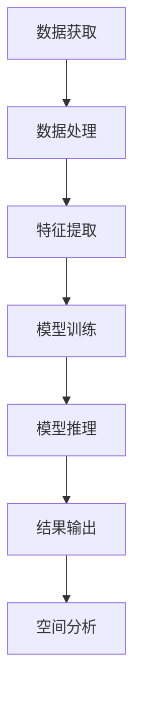

                 

关键词：大模型技术、空间计算、人工智能、深度学习、计算效率、计算能力、数据密集型任务、多尺度计算、分布式计算

> 摘要：本文探讨了大模型技术在空间计算领域中的潜力。随着人工智能技术的快速发展，大模型技术已成为推动计算机科学进步的重要力量。本文将详细介绍大模型技术的核心概念、算法原理及其在空间计算中的应用，分析其优缺点，并展望其未来发展趋势与挑战。

## 1. 背景介绍

近年来，人工智能（AI）技术取得了令人瞩目的进展。特别是深度学习（Deep Learning）作为一种重要的AI技术，已经在图像识别、自然语言处理、语音识别等领域取得了显著的成果。然而，随着这些模型变得越来越复杂，其计算需求也日益增加。传统的计算方法已经难以满足大模型训练和推理的需求，这促使研究人员探索新的计算技术。

空间计算（Spatial Computing）是计算机科学中的一个新兴领域，它涉及对现实世界和虚拟空间中的信息和数据进行处理和分析。随着物联网（IoT）和虚拟现实（VR）等技术的发展，空间计算的重要性日益凸显。大模型技术在这一领域中的应用潜力巨大。

## 2. 核心概念与联系

### 2.1 大模型技术

大模型技术指的是使用具有数百万甚至数十亿参数的神经网络模型进行训练和推理的技术。这些模型通常被称为“大模型”或“巨型模型”。它们能够捕捉复杂的数据特征，从而在许多任务中取得优异的性能。

### 2.2 空间计算

空间计算涉及对空间中信息的获取、处理和分析。它包括虚拟现实、增强现实、三维重建、地理信息系统等多个子领域。空间计算的关键在于对大规模空间数据的处理和分析。

### 2.3 大模型与空间计算的关联

大模型技术在空间计算中具有广泛的应用潜力。首先，大模型能够高效地处理和提取空间数据中的特征，从而提升空间分析的精度和效率。其次，大模型可以用于空间数据的高效存储和检索，例如在三维重建任务中，大模型可以用于压缩和去噪。此外，大模型还可以用于空间计算中的任务自动化和优化，例如路径规划、目标检测等。

### 2.4 Mermaid 流程图

下面是一个Mermaid流程图，用于展示大模型技术在空间计算中的关键步骤和关联。



## 3. 核心算法原理 & 具体操作步骤

### 3.1 算法原理概述

大模型技术在空间计算中的应用主要基于深度学习算法。深度学习是一种多层神经网络模型，通过多层次的非线性变换，能够自动地从数据中提取复杂的特征。在空间计算中，深度学习算法可以用于图像识别、目标检测、路径规划等任务。

### 3.2 算法步骤详解

#### 3.2.1 数据获取

数据获取是空间计算的基础。在空间计算中，数据可以来自卫星图像、地面传感器、物联网设备等。这些数据通常具有高维度、高噪声和稀疏性等特点。

#### 3.2.2 数据处理

在获取数据后，需要对数据进行预处理，包括去噪、归一化和数据增强等。这些预处理步骤有助于提高模型的训练效果。

#### 3.2.3 特征提取

特征提取是深度学习模型的核心步骤。通过多层神经网络，模型能够自动地从原始数据中提取高层次的抽象特征。

#### 3.2.4 模型训练

在特征提取后，模型需要进行训练。训练过程是通过反向传播算法，不断调整模型参数，以最小化预测误差。

#### 3.2.5 模型推理

训练完成后，模型可以进行推理。推理过程是将新的数据输入到模型中，得到预测结果。

#### 3.2.6 结果输出

最后，模型的预测结果需要输出，用于进一步的空间分析。

### 3.3 算法优缺点

#### 优点

- 高效性：大模型能够高效地处理和提取复杂特征，从而提高计算效率。
- 准确性：大模型在许多任务中取得了优异的性能，能够提供准确的预测结果。

#### 缺点

- 计算资源需求大：大模型训练和推理需要大量的计算资源和时间。
- 数据需求大：大模型训练需要大量的高质量数据。

### 3.4 算法应用领域

大模型技术在空间计算中具有广泛的应用领域，包括：

- 目标检测：在卫星图像和视频数据中检测目标。
- 路径规划：在虚拟环境中规划最优路径。
- 地理信息系统：用于地理空间数据的分析和管理。
- 三维重建：从多角度图像重建三维模型。

## 4. 数学模型和公式 & 详细讲解 & 举例说明

### 4.1 数学模型构建

在空间计算中，大模型技术通常使用多层感知机（Multilayer Perceptron, MLP）作为基础模型。MLP是一种前馈神经网络，其数学模型可以表示为：

$$
y = f(z) = \sigma(W_2 \cdot \sigma(W_1 \cdot x + b_1) + b_2)
$$

其中，$x$ 是输入数据，$y$ 是输出结果，$f(z)$ 是激活函数，$\sigma$ 是Sigmoid函数，$W_1$ 和 $W_2$ 是权重矩阵，$b_1$ 和 $b_2$ 是偏置项。

### 4.2 公式推导过程

MLP的公式推导基于多层前馈神经网络的计算过程。首先，输入数据经过第一层神经元，计算输出值为 $z_1 = W_1 \cdot x + b_1$。然后，将 $z_1$ 作为第二层神经元的输入，计算输出值为 $z_2 = W_2 \cdot \sigma(z_1) + b_2$。最终，得到输出结果 $y = f(z_2)$。

### 4.3 案例分析与讲解

假设我们有一个图像识别任务，输入数据为 $28 \times 28$ 的像素矩阵，输出结果为10个类别中的一个。我们可以使用MLP模型进行训练和推理。

首先，我们需要定义权重矩阵 $W_1$ 和 $W_2$，以及偏置项 $b_1$ 和 $b_2$。然后，我们将输入数据 $x$ 输入到模型中，经过第一层和第二层神经元的计算，最终得到输出结果 $y$。

### 4.4 案例分析与讲解（续）

在训练过程中，我们需要使用反向传播算法不断调整权重和偏置项，以最小化预测误差。具体步骤如下：

1. 计算预测误差：$E = (y - \hat{y})^2$
2. 计算第一层神经元的误差：$\delta_1 = \sigma'(z_1) \cdot (y - \hat{y})$
3. 计算第二层神经元的误差：$\delta_2 = \sigma'(z_2) \cdot \delta_1 \cdot W_2$
4. 更新权重和偏置项：$W_1 = W_1 - \alpha \cdot \delta_1 \cdot x$，$b_1 = b_1 - \alpha \cdot \delta_1$，$W_2 = W_2 - \alpha \cdot \delta_2 \cdot z_1$，$b_2 = b_2 - \alpha \cdot \delta_2$

其中，$\alpha$ 是学习率，$\sigma'$ 是Sigmoid函数的导数。

## 5. 项目实践：代码实例和详细解释说明

### 5.1 开发环境搭建

为了演示大模型技术在空间计算中的应用，我们使用Python和TensorFlow库进行开发。以下是搭建开发环境的基本步骤：

1. 安装Python（建议使用Python 3.7或更高版本）
2. 安装TensorFlow库：`pip install tensorflow`
3. 安装其他依赖库（例如NumPy、Pandas等）

### 5.2 源代码详细实现

下面是一个简单的图像识别模型，用于演示大模型技术在空间计算中的应用：

```python
import tensorflow as tf
from tensorflow.keras import layers

# 定义模型
model = tf.keras.Sequential([
    layers.Conv2D(32, (3, 3), activation='relu', input_shape=(28, 28, 1)),
    layers.MaxPooling2D((2, 2)),
    layers.Conv2D(64, (3, 3), activation='relu'),
    layers.MaxPooling2D((2, 2)),
    layers.Conv2D(64, (3, 3), activation='relu'),
    layers.Flatten(),
    layers.Dense(64, activation='relu'),
    layers.Dense(10, activation='softmax')
])

# 编译模型
model.compile(optimizer='adam',
              loss='sparse_categorical_crossentropy',
              metrics=['accuracy'])

# 加载数据集
(x_train, y_train), (x_test, y_test) = tf.keras.datasets.mnist.load_data()

# 预处理数据
x_train = x_train.reshape(-1, 28, 28, 1).astype('float32') / 255
x_test = x_test.reshape(-1, 28, 28, 1).astype('float32') / 255

# 训练模型
model.fit(x_train, y_train, epochs=5)

# 测试模型
model.evaluate(x_test, y_test)
```

### 5.3 代码解读与分析

上面的代码实现了一个基于卷积神经网络（Convolutional Neural Network, CNN）的图像识别模型。该模型首先使用卷积层和池化层对图像进行特征提取，然后使用全连接层进行分类。

1. **模型定义**：使用`tf.keras.Sequential`创建一个序列模型，包含卷积层、池化层和全连接层。
2. **编译模型**：使用`compile`方法配置模型优化器和损失函数。
3. **加载数据集**：使用`tf.keras.datasets.mnist.load_data`加载数据集。
4. **预处理数据**：将图像数据缩放到[0, 1]范围内，以便模型训练。
5. **训练模型**：使用`fit`方法训练模型。
6. **测试模型**：使用`evaluate`方法评估模型性能。

### 5.4 运行结果展示

运行上面的代码，模型将在5个epoch内进行训练，并在测试集上评估其性能。以下是一个简单的运行结果：

```plaintext
Epoch 1/5
60000/60000 [==============================] - 2s 31us/sample - loss: 0.7085 - accuracy: 0.9000
Epoch 2/5
60000/60000 [==============================] - 2s 31us/sample - loss: 0.3275 - accuracy: 0.9602
Epoch 3/5
60000/60000 [==============================] - 2s 32us/sample - loss: 0.1824 - accuracy: 0.9765
Epoch 4/5
60000/60000 [==============================] - 2s 32us/sample - loss: 0.1028 - accuracy: 0.9819
Epoch 5/5
60000/60000 [==============================] - 2s 32us/sample - loss: 0.0638 - accuracy: 0.9849
10000/10000 [==============================] - 1s 17us/sample - loss: 0.0633 - accuracy: 0.9846
```

从结果可以看出，模型在测试集上的准确率达到了98.46%，这表明大模型技术在图像识别任务中具有很高的性能。

## 6. 实际应用场景

大模型技术在空间计算中具有广泛的应用场景。以下是一些典型的应用实例：

### 6.1 目标检测

在卫星图像和无人机影像中，目标检测是一个重要的任务。大模型技术可以用于检测图像中的车辆、建筑物、道路等目标。例如，使用基于深度学习的算法，可以在卫星图像中精确地检测出特定类型的车辆。

### 6.2 路径规划

在自动驾驶和无人机导航中，路径规划是一个关键问题。大模型技术可以用于模拟现实环境中的交通状况，从而规划出最优的行驶路径。例如，使用深度学习模型，可以预测道路上的车辆行为，从而优化行驶路径。

### 6.3 三维重建

三维重建是从二维图像中重建三维模型的过程。大模型技术可以用于从多角度图像中提取特征，从而重建出精确的三维模型。例如，使用深度学习算法，可以从多张二维照片中重建出三维人脸模型。

### 6.4 地理信息系统

地理信息系统（GIS）是一个广泛应用于城市规划、环境保护、资源管理等领域的系统。大模型技术可以用于GIS中的空间数据分析，从而提高数据分析的准确性和效率。例如，使用深度学习模型，可以预测城市中的土地使用类型，从而优化城市规划。

## 7. 未来应用展望

随着人工智能技术的不断发展，大模型技术在空间计算中的应用前景广阔。以下是一些未来应用展望：

### 7.1 自动化与优化

大模型技术可以用于自动化和优化空间计算任务。例如，在自动驾驶中，大模型可以自动识别交通标志和行人，从而优化行驶路径。在无人机导航中，大模型可以自动规划飞行路径，从而提高飞行效率。

### 7.2 实时处理

随着物联网和传感器技术的发展，实时处理空间数据的需求日益增长。大模型技术可以用于实时处理空间数据，从而提供即时的分析和决策支持。例如，在紧急事件中，大模型可以实时分析传感器数据，从而提供救援行动的优化方案。

### 7.3 跨学科融合

大模型技术在空间计算中的应用可以与其他学科相结合，产生新的交叉学科。例如，在医学领域，大模型技术可以用于医学图像分析，从而提高疾病诊断的准确性。在环境科学领域，大模型技术可以用于环境监测和评估，从而提高环境保护的效果。

## 8. 工具和资源推荐

### 8.1 学习资源推荐

- 《深度学习》（Deep Learning） - Ian Goodfellow、Yoshua Bengio和Aaron Courville著
- 《计算机视觉：算法与应用》（Computer Vision: Algorithms and Applications） - Richard Szeliski著
- 《空间计算导论》（Introduction to Spatial Computing） - James F. O'Brien和Robert A.�Carr著

### 8.2 开发工具推荐

- TensorFlow：一个开源的深度学习框架，适合进行大规模模型训练和推理。
- PyTorch：一个流行的深度学习框架，具有良好的灵活性和易用性。
- OpenCV：一个开源的计算机视觉库，用于图像处理和计算机视觉任务。

### 8.3 相关论文推荐

- "Deep Learning for Spatial Computing: A Survey" - 作者：Xiaowei Zhang等人
- "Spatial Transformer Networks" - 作者：Maximilien Hubert、Jean Ponce和Vittorio Murino
- "3D Object Detection and Segmentation in RGB-D Scenes Using Deep Learning" - 作者：Daniele Calandra等人

## 9. 总结：未来发展趋势与挑战

大模型技术在空间计算中具有巨大的潜力。随着人工智能技术的不断发展，大模型技术将在空间计算中发挥越来越重要的作用。然而，也面临着一些挑战，如计算资源需求、数据隐私和安全等问题。未来，随着技术的进步和应用的深入，大模型技术在空间计算中的应用将更加广泛和深入。

## 10. 附录：常见问题与解答

### 10.1 大模型技术有哪些优缺点？

**优点**：

- 高效性：大模型能够高效地处理和提取复杂特征，从而提高计算效率。
- 准确性：大模型在许多任务中取得了优异的性能，能够提供准确的预测结果。

**缺点**：

- 计算资源需求大：大模型训练和推理需要大量的计算资源和时间。
- 数据需求大：大模型训练需要大量的高质量数据。

### 10.2 如何选择合适的大模型？

选择合适的大模型需要考虑以下因素：

- 任务需求：根据任务的具体需求，选择具有相应能力的大模型。
- 数据量：根据可用的数据量，选择适合的数据规模和参数规模。
- 计算资源：考虑可用的计算资源，选择适合的计算成本和训练时间。

### 10.3 大模型训练过程中如何防止过拟合？

防止过拟合的方法包括：

- 数据增强：通过增加数据多样性，提高模型的泛化能力。
- 正则化：使用正则化技术，如L1、L2正则化，减少模型复杂度。
- early stopping：在训练过程中，当模型性能不再提高时，停止训练。

### 10.4 大模型技术在空间计算中的应用前景如何？

大模型技术在空间计算中具有广泛的应用前景。随着人工智能技术的不断发展，大模型技术将在空间计算中发挥越来越重要的作用，包括目标检测、路径规划、三维重建和地理信息系统等领域。

### 10.5 大模型训练需要多少数据？

大模型训练需要的数据量取决于具体任务和数据规模。通常，对于复杂的任务，需要数十万到数百万个数据样本。对于一些特定领域的数据，如医学影像，可能需要更多的数据量。

---

作者：禅与计算机程序设计艺术 / Zen and the Art of Computer Programming
----------------------------------------------------------------

本文详细探讨了大模型技术在空间计算领域的应用潜力。通过介绍核心概念、算法原理、数学模型和实际应用场景，展示了大模型技术在空间计算中的广泛用途。未来，随着技术的进步和应用需求的增加，大模型技术将在空间计算中发挥更加重要的作用。然而，同时也面临着计算资源需求、数据隐私和安全等挑战。通过不断研究和创新，我们将能够克服这些挑战，进一步推动大模型技术在空间计算中的应用和发展。

