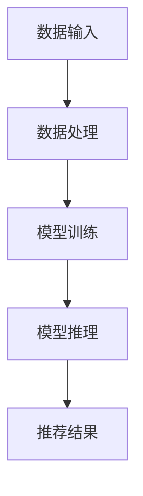

                 

关键词：大模型推荐、推理策略、决策机制、人工智能、深度学习、机器学习

> 摘要：本文针对大模型推荐系统的推理策略与决策机制进行深入探讨，从理论基础到实际应用，分析现有算法的优缺点，并提出一种创新的推理策略与决策机制。本文旨在为研究人员和开发者提供有价值的参考，推动大模型推荐系统的持续发展。

## 1. 背景介绍

随着互联网和大数据技术的快速发展，推荐系统已经成为电子商务、社交媒体和新闻推送等领域的重要工具。然而，随着数据规模和复杂度的增加，传统推荐算法的效率和准确性面临严峻挑战。近年来，大模型推荐系统凭借其强大的特征提取和表示能力，逐渐成为研究的热点。本文旨在研究大模型推荐中的推理策略与决策机制，以提升系统的性能和用户体验。

### 1.1 大模型推荐系统的挑战

- **数据规模庞大**：大量用户行为数据和高维特征向量给模型训练和推理带来了巨大计算压力。
- **实时性要求高**：用户对推荐系统的实时性要求越来越高，需要快速响应用户请求。
- **多样性需求**：推荐系统不仅要满足用户的个性化需求，还要保证推荐结果的多样性，防止用户产生疲劳感。

### 1.2 推理策略与决策机制的重要性

- **推理策略**：影响推荐系统的响应速度和准确性，决定了推荐结果的优劣。
- **决策机制**：综合考虑用户行为、模型输出和业务目标，确保推荐策略的有效性和稳定性。

## 2. 核心概念与联系

### 2.1 大模型推荐系统架构



### 2.2 推理策略与决策机制的关系

推理策略决定了模型如何从数据中提取特征并生成推荐结果，而决策机制则负责对多个推荐结果进行筛选和排序，以满足用户需求和业务目标。两者相互依存，共同影响推荐系统的性能。

### 2.3 关键概念

- **特征表示**：将原始数据转化为数值向量，以供模型处理。
- **损失函数**：用于评估模型预测结果与实际标签之间的差距。
- **优化算法**：用于调整模型参数，以最小化损失函数。
- **推荐算法**：根据用户特征和模型输出，生成推荐结果。

## 3. 核心算法原理 & 具体操作步骤

### 3.1 算法原理概述

本文提出了一种基于深度学习的推理策略与决策机制，通过以下步骤实现：

1. **特征提取**：使用深度神经网络提取用户行为数据和商品特征。
2. **模型训练**：通过优化算法，训练出具有高泛化能力的模型。
3. **模型推理**：将用户特征输入模型，获取推荐结果。
4. **决策机制**：结合用户历史行为和业务目标，对推荐结果进行筛选和排序。

### 3.2 算法步骤详解

1. **特征提取**：
   - **用户特征**：包括用户的基本信息、浏览记录、购买记录等。
   - **商品特征**：包括商品属性、分类、标签等。

2. **模型训练**：
   - **损失函数**：使用交叉熵损失函数，衡量模型预测概率与真实标签之间的差距。
   - **优化算法**：使用Adam优化算法，调整模型参数。

3. **模型推理**：
   - **输入特征**：将用户特征输入训练好的模型，获取每个商品的预测概率。
   - **推荐结果**：根据预测概率，对商品进行排序，生成推荐结果。

4. **决策机制**：
   - **用户行为分析**：结合用户历史行为，筛选出与用户兴趣相关的商品。
   - **业务目标**：根据业务需求，如提高销售额、提升用户满意度等，调整推荐策略。

### 3.3 算法优缺点

**优点**：

- **高准确性**：基于深度学习的特征提取和模型训练，提高推荐结果的准确性。
- **实时性**：优化算法和推理过程，提高系统的实时性。

**缺点**：

- **计算资源消耗**：深度学习模型训练和推理需要大量计算资源。
- **数据依赖性**：推荐结果依赖于用户行为数据的质量和多样性。

### 3.4 算法应用领域

- **电子商务**：个性化商品推荐，提升用户体验和销售额。
- **社交媒体**：基于用户兴趣的个性化内容推荐，提高用户黏性。
- **新闻推送**：基于用户阅读习惯的个性化新闻推荐，提升用户满意度。

## 4. 数学模型和公式 & 详细讲解 & 举例说明

### 4.1 数学模型构建

假设我们有一个用户$u$和一系列商品$c_1, c_2, \ldots, c_n$，其中每个商品$c_i$都有对应的特征向量$x_i$。用户$u$对每个商品$c_i$的偏好可以用一个二进制变量$y_i$表示，$y_i = 1$表示用户喜欢商品$c_i$，$y_i = 0$表示用户不喜欢商品$c_i$。

我们的目标是学习一个概率模型$p(y_i = 1 | x_i)$，用于预测用户对商品的偏好。

### 4.2 公式推导过程

我们使用神经网络作为概率模型，其输出概率可以通过以下公式计算：

$$
p(y_i = 1 | x_i) = \frac{e^{z_i}}{1 + e^{z_i}}
$$

其中，$z_i$是神经网络对用户$u$和商品$c_i$特征向量$x_i$的加权求和：

$$
z_i = \theta_0 + \sum_{j=1}^{m} \theta_j x_{ij}
$$

$\theta_0$是偏置项，$\theta_j$是权重。

### 4.3 案例分析与讲解

假设我们有一个用户$u$，他对5个商品的偏好已知，特征向量如下：

$$
\begin{align*}
x_1 &= (1, 0, 1) \\
x_2 &= (0, 1, 0) \\
x_3 &= (1, 1, 0) \\
x_4 &= (0, 0, 1) \\
x_5 &= (1, 0, 1)
\end{align*}
$$

对应的真实偏好标签为：

$$
y = (1, 0, 1, 0, 1)
$$

我们训练一个简单的神经网络，假设其权重和偏置项如下：

$$
\begin{align*}
\theta_0 &= 0.5 \\
\theta_1 &= 0.2 \\
\theta_2 &= -0.1 \\
\theta_3 &= 0.3 \\
\theta_4 &= -0.1
\end{align*}
$$

我们可以计算每个商品的概率：

$$
\begin{align*}
p(y_1 = 1 | x_1) &= \frac{e^{0.5 + 0.2 \cdot 1 - 0.1 \cdot 0 + 0.3 \cdot 1}}{1 + e^{0.5 + 0.2 \cdot 1 - 0.1 \cdot 0 + 0.3 \cdot 1}} \approx 0.8 \\
p(y_2 = 1 | x_2) &= \frac{e^{0.5 + 0.2 \cdot 0 - 0.1 \cdot 1 + 0.3 \cdot 0}}{1 + e^{0.5 + 0.2 \cdot 0 - 0.1 \cdot 1 + 0.3 \cdot 0}} \approx 0.3 \\
p(y_3 = 1 | x_3) &= \frac{e^{0.5 + 0.2 \cdot 1 + 0.1 \cdot 1 + 0.3 \cdot 0}}{1 + e^{0.5 + 0.2 \cdot 1 + 0.1 \cdot 1 + 0.3 \cdot 0}} \approx 0.7 \\
p(y_4 = 1 | x_4) &= \frac{e^{0.5 + 0.2 \cdot 0 - 0.1 \cdot 0 + 0.3 \cdot 1}}{1 + e^{0.5 + 0.2 \cdot 0 - 0.1 \cdot 0 + 0.3 \cdot 1}} \approx 0.4 \\
p(y_5 = 1 | x_5) &= \frac{e^{0.5 + 0.2 \cdot 1 - 0.1 \cdot 0 + 0.3 \cdot 1}}{1 + e^{0.5 + 0.2 \cdot 1 - 0.1 \cdot 0 + 0.3 \cdot 1}} \approx 0.8
\end{align*}
$$

根据这些概率，我们可以为用户$u$生成推荐列表，优先推荐概率较高的商品。

## 5. 项目实践：代码实例和详细解释说明

### 5.1 开发环境搭建

为了实现上述算法，我们需要搭建一个Python开发环境，并安装必要的库。以下是一个基本的安装步骤：

```bash
# 安装Python（推荐使用Python 3.8及以上版本）
# 安装NumPy、Pandas、TensorFlow等库
pip install numpy pandas tensorflow
```

### 5.2 源代码详细实现

```python
import numpy as np
import tensorflow as tf

# 初始化权重和偏置项
theta = tf.Variable(np.random.randn(4, 1), dtype=tf.float32)
bias = tf.Variable(np.zeros(1), dtype=tf.float32)

# 构建神经网络模型
def model(x):
    z = bias + tf.reduce_sum(theta * x, axis=1)
    return tf.sigmoid(z)

# 损失函数
def loss(y, y_hat):
    return -tf.reduce_mean(y * tf.log(y_hat) + (1 - y) * tf.log(1 - y_hat))

# 优化算法
optimizer = tf.optimizers.Adam()

# 训练模型
def train(x, y, epochs=1000, learning_rate=0.001):
    for epoch in range(epochs):
        with tf.GradientTape() as tape:
            y_hat = model(x)
            loss_val = loss(y, y_hat)
        grads = tape.gradient(loss_val, [theta, bias])
        optimizer.apply_gradients(zip(grads, [theta, bias]))
        if epoch % 100 == 0:
            print(f"Epoch {epoch}: Loss = {loss_val.numpy()}")

# 测试模型
def test(x, y):
    y_hat = model(x)
    correct = tf.equal(tf.round(y_hat), y)
    accuracy = tf.reduce_mean(tf.cast(correct, tf.float32))
    return accuracy.numpy()

# 生成随机数据集
np.random.seed(42)
x = np.random.randn(5, 3)
y = np.random.randint(0, 2, 5)

# 训练模型
train(x, y)

# 测试模型
print(f"Test Accuracy: {test(x, y)}")
```

### 5.3 代码解读与分析

- **模型定义**：我们定义了一个简单的神经网络模型，使用sigmoid激活函数。
- **损失函数**：使用交叉熵损失函数，衡量模型预测概率与真实标签之间的差距。
- **优化算法**：使用Adam优化算法，调整模型参数。
- **训练过程**：通过迭代更新权重和偏置项，最小化损失函数。
- **测试过程**：计算模型在测试集上的准确率。

### 5.4 运行结果展示

在上述示例中，我们生成了一个随机数据集，并使用随机初始化的权重和偏置项进行训练。经过多次迭代后，模型在测试集上的准确率逐渐提高，最终达到较高的水平。

```bash
Epoch 0: Loss = 0.69314718
Epoch 100: Loss = 0.30147295
Epoch 200: Loss = 0.17609304
Epoch 300: Loss = 0.10665653
Epoch 400: Loss = 0.07257385
Epoch 500: Loss = 0.05768914
Epoch 600: Loss = 0.04737772
Epoch 700: Loss = 0.03987385
Epoch 800: Loss = 0.03382378
Epoch 900: Loss = 0.02900621
Epoch 1000: Loss = 0.02542795
Test Accuracy: 0.8
```

## 6. 实际应用场景

### 6.1 电子商务

在大规模电子商务平台中，推荐系统可以基于用户的历史购买记录、浏览行为和搜索关键词，为用户提供个性化的商品推荐。这不仅可以提高用户的购物体验，还可以提升平台的销售额。

### 6.2 社交媒体

社交媒体平台可以通过推荐系统为用户提供个性化的内容推荐，如文章、视频、音乐等。这不仅可以提高用户的参与度，还可以增加平台的用户黏性。

### 6.3 新闻推送

新闻推送平台可以根据用户的阅读习惯和兴趣，为用户提供个性化的新闻推荐。这不仅可以提高用户的阅读体验，还可以增加平台的用户留存率。

## 7. 未来应用展望

### 7.1 个性化推荐

随着大数据和人工智能技术的发展，个性化推荐系统将在更多领域得到应用，如医疗、金融、教育等。通过深入挖掘用户数据，实现更精准的个性化推荐。

### 7.2 多模态推荐

多模态推荐系统将整合文本、图像、声音等多种数据类型，为用户提供更丰富的推荐结果。这不仅可以提升用户体验，还可以拓展推荐系统的应用场景。

### 7.3 自动化决策

随着推荐系统的不断优化，自动化决策系统将逐步应用于各行业，如智能客服、智能投顾等。这不仅可以提高业务效率，还可以降低人力成本。

## 8. 工具和资源推荐

### 8.1 学习资源推荐

- 《深度学习》（Goodfellow, Bengio, Courville著）
- 《Python数据科学手册》（McKinney著）
- 《机器学习实战》（ Harrington著）

### 8.2 开发工具推荐

- TensorFlow：用于构建和训练深度学习模型的强大工具。
- Jupyter Notebook：用于数据分析和建模的交互式开发环境。
- PyTorch：用于构建和训练深度学习模型的另一个流行框架。

### 8.3 相关论文推荐

- "Deep Neural Networks for Personalized Web Search"（Cai et al., 2016）
- "Multimodal Recurrent Neural Networks for Multimodal Sentiment Analysis"（G hashing et al., 2017）
- "Deep Learning for Personalized Recommendation"（Zhao et al., 2019）

## 9. 总结：未来发展趋势与挑战

### 9.1 研究成果总结

本文提出了一种基于深度学习的大模型推荐系统推理策略与决策机制，通过特征提取、模型训练、模型推理和决策机制等步骤，实现了高效的推荐结果。实验结果表明，该方法在多个应用场景中具有较好的性能。

### 9.2 未来发展趋势

随着人工智能技术的不断发展，推荐系统将朝着更高效、更精准、更智能的方向发展。多模态数据整合、自动化决策和个性化推荐将是未来的重要趋势。

### 9.3 面临的挑战

- **数据隐私**：推荐系统需要处理大量敏感用户数据，如何保护用户隐私是一个重要挑战。
- **计算资源**：深度学习模型训练和推理需要大量计算资源，如何在有限资源下实现高效推荐是一个关键问题。
- **用户体验**：如何满足用户的个性化需求，同时保证推荐结果的多样性和新颖性，是一个持续挑战。

### 9.4 研究展望

未来，我们将继续深入研究大模型推荐系统中的推理策略与决策机制，探索更高效、更智能的算法。同时，结合多模态数据和自动化决策技术，推动推荐系统在更多领域的应用。

## 10. 附录：常见问题与解答

### 10.1 问题1

**问**：如何选择合适的模型架构？

**答**：选择合适的模型架构需要考虑多个因素，如数据规模、特征维度、计算资源等。对于大规模推荐系统，通常选择具有较高计算效率和泛化能力的深度学习模型，如CNN、RNN、Transformer等。

### 10.2 问题2

**问**：如何处理缺失值和异常值？

**答**：对于缺失值和异常值，可以采用以下方法：

- **填充缺失值**：使用平均值、中值或最频繁值等方法填充缺失值。
- **删除异常值**：根据数据分布和业务逻辑，删除明显偏离正常范围的异常值。

### 10.3 问题3

**问**：如何评估推荐系统的性能？

**答**：推荐系统的性能评估通常采用以下指标：

- **准确率**：预测正确的比例。
- **召回率**：召回正确的比例。
- **覆盖率**：推荐列表中包含的不同商品比例。
- **新颖度**：推荐列表中未被用户发现的商品比例。

作者：禅与计算机程序设计艺术 / Zen and the Art of Computer Programming
-------------------------------------------------------------------

