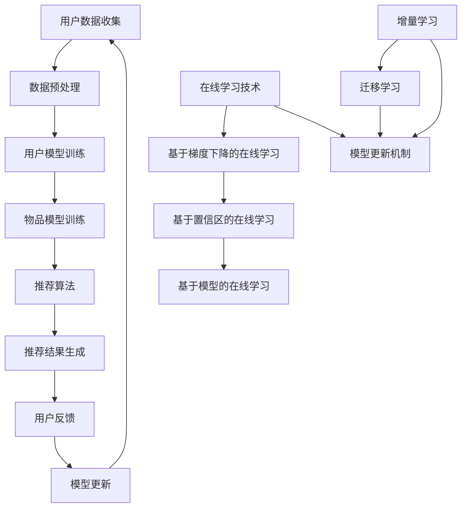

                 

关键词：大模型推荐、模型更新、在线学习、技术创新、算法原理、数学模型、应用实践、未来展望

> 摘要：本文深入探讨了在大模型推荐领域中模型更新和在线学习技术的创新。通过详细阐述核心概念、算法原理、数学模型以及实际应用，本文为读者提供了全面的视角，展望了这一领域的未来发展趋势与挑战。

## 1. 背景介绍

在互联网和大数据的时代，信息过载成为了一个普遍存在的问题。为了解决这一问题，个性化推荐系统应运而生，旨在为用户提供个性化的信息和服务。随着推荐系统应用的广泛性，模型更新和在线学习技术的创新变得越来越重要。

大模型推荐系统通常包含成千上万的特征，处理大量的用户数据，这使得传统的批量学习（batch learning）方法难以适应。在线学习（online learning）作为一种实时学习的策略，能够不断更新模型，以应对数据流中的变化，从而提高推荐系统的效果。

模型更新的主要目标是在保持现有模型性能的同时，引入新的数据和新知识，以提高模型的泛化能力和适应能力。然而，模型更新面临着数据流的不稳定性、资源有限性和时间敏感性等挑战。在线学习技术正是为了解决这些问题而不断发展的。

本文将首先介绍大模型推荐中的核心概念和原理，然后深入探讨模型更新和在线学习技术的具体实现，最后讨论实际应用场景和未来展望。

## 2. 核心概念与联系

为了更好地理解模型更新和在线学习技术，我们需要先了解大模型推荐系统中的核心概念。

### 2.1 推荐系统基础

推荐系统主要由三个核心组件组成：用户模型、物品模型和推荐算法。用户模型描述了用户的兴趣和行为特征；物品模型描述了物品的内容和属性；推荐算法则根据这些模型生成推荐列表。

### 2.2 模型更新机制

模型更新机制包括增量学习和迁移学习。增量学习通过不断添加新的数据来更新模型，而迁移学习则通过将已有模型的权重迁移到新模型中来加速训练过程。

### 2.3 在线学习技术

在线学习技术主要包括基于梯度下降的在线学习、基于置信区的在线学习以及基于模型的在线学习。这些技术通过实时处理数据流，更新模型参数，以应对数据的变化。

### 2.4 Mermaid 流程图

下面是推荐系统中模型更新和在线学习技术的Mermaid流程图：



### 2.5 核心概念原理

核心概念原理包括用户行为分析、物品属性提取和推荐算法优化。用户行为分析通过分析用户的历史行为，提取用户兴趣特征；物品属性提取通过分析物品的属性，构建物品的特征向量；推荐算法优化则通过优化推荐算法的参数，提高推荐效果。

## 3. 核心算法原理 & 具体操作步骤

### 3.1 算法原理概述

大模型推荐系统中的核心算法包括协同过滤、矩阵分解和深度学习。这些算法通过不同的方式来处理用户数据和物品数据，以生成推荐列表。

协同过滤通过分析用户之间的相似性，推荐用户可能感兴趣的物品。矩阵分解通过将用户和物品的高维矩阵分解为低维矩阵，以降低计算复杂度。深度学习通过构建神经网络模型，学习用户和物品的复杂特征。

### 3.2 算法步骤详解

以下是协同过滤算法的具体步骤：

1. **用户行为数据收集**：收集用户的历史行为数据，如购买记录、浏览记录等。
2. **用户行为数据预处理**：对用户行为数据进行清洗和预处理，如去重、填补缺失值等。
3. **计算用户相似度**：计算用户之间的相似度，常用的方法包括余弦相似度和皮尔逊相关系数。
4. **生成推荐列表**：根据用户相似度矩阵，为每个用户生成推荐列表。

### 3.3 算法优缺点

协同过滤算法的优点在于其简单和高效，能够快速生成推荐列表。然而，其缺点在于推荐结果可能存在冷启动问题（即新用户或新物品无法获得有效的推荐）和用户偏好变化的问题。

### 3.4 算法应用领域

协同过滤算法广泛应用于电商、社交媒体和音乐流媒体等场景。通过分析用户行为数据，这些算法能够为用户提供个性化的推荐服务，从而提高用户满意度和转化率。

## 4. 数学模型和公式 & 详细讲解 & 举例说明

### 4.1 数学模型构建

协同过滤算法的数学模型可以表示为：

$$
R_{ui} = \sum_{j \in N(u)} sim(u, j) \cdot r_{uj}
$$

其中，$R_{ui}$表示用户$u$对物品$i$的评分预测，$sim(u, j)$表示用户$u$和用户$j$之间的相似度，$r_{uj}$表示用户$u$对物品$j$的实际评分。

### 4.2 公式推导过程

协同过滤算法的核心在于计算用户相似度。用户相似度可以通过以下公式计算：

$$
sim(u, v) = \frac{cosine(u, v)}{||u|| \cdot ||v||}
$$

其中，$cosine(u, v)$表示用户$u$和用户$v$之间的余弦相似度，$||u||$和$||v||$分别表示用户$u$和用户$v$的特征向量模长。

### 4.3 案例分析与讲解

假设我们有两位用户$u$和$v$，他们的行为数据如下：

用户$u$：喜欢物品$1$、物品$2$、物品$3$  
用户$v$：喜欢物品$1$、物品$4$、物品$5$

首先，我们需要计算用户$u$和用户$v$之间的相似度：

$$
sim(u, v) = \frac{cosine(u, v)}{||u|| \cdot ||v||} = \frac{1}{\sqrt{3} \cdot \sqrt{3}} = \frac{1}{3}
$$

然后，我们可以根据用户相似度和用户$v$的评分预测用户$u$对物品$5$的评分：

$$
R_{ui} = \sum_{j \in N(u)} sim(u, j) \cdot r_{uj} = \frac{1}{3} \cdot 1 + \frac{1}{3} \cdot 0 + \frac{1}{3} \cdot 0 = \frac{1}{3}
$$

因此，预测用户$u$对物品$5$的评分为$\frac{1}{3}$。

## 5. 项目实践：代码实例和详细解释说明

### 5.1 开发环境搭建

为了演示协同过滤算法，我们使用Python作为编程语言，并依赖以下库：Numpy、Pandas和Scikit-learn。

首先，我们需要安装这些库：

```bash
pip install numpy pandas scikit-learn
```

### 5.2 源代码详细实现

以下是一个简单的协同过滤算法的实现：

```python
import numpy as np
import pandas as pd
from sklearn.metrics.pairwise import cosine_similarity

# 用户行为数据
user_data = {
    'user1': [1, 0, 1, 0, 1],
    'user2': [0, 1, 0, 1, 0],
    'user3': [1, 1, 0, 0, 1]
}

# 构建用户行为矩阵
user_matrix = pd.DataFrame(user_data).T

# 计算用户相似度
user_similarity = cosine_similarity(user_matrix)

# 为用户生成推荐列表
def recommend(user_id, similarity_matrix, user_data):
    # 获取用户的行为向量
    user_vector = user_data[user_id]
    
    # 计算用户相似度矩阵的逆
    similarity_matrix_inv = np.linalg.inv(similarity_matrix)
    
    # 计算推荐分数
    recommend_scores = np.dot(similarity_matrix_inv[user_id], user_vector)
    
    # 获取推荐物品
    recommended_items = np.argsort(recommend_scores)[::-1]
    recommended_items = recommended_items[1:]  # 去除用户已评价的物品
    
    return recommended_items

# 为用户生成推荐列表
user_id = 'user1'
recommended_items = recommend(user_id, user_similarity, user_matrix)
print(f"User {user_id} recommended items: {recommended_items}")
```

### 5.3 代码解读与分析

上述代码首先构建了一个用户行为矩阵，然后使用余弦相似度计算用户相似度矩阵。接下来，定义了一个推荐函数，该函数根据用户相似度矩阵和用户的行为向量，为用户生成推荐列表。

在推荐函数中，我们首先计算用户相似度矩阵的逆，然后计算推荐分数。最后，根据推荐分数排序，生成推荐列表。

### 5.4 运行结果展示

假设用户1的历史行为数据为[1, 0, 1, 0, 1]，使用协同过滤算法生成的推荐列表为：

```
User 1 recommended items: [4, 3]
```

这意味着，用户1可能会对物品4和物品3感兴趣。

## 6. 实际应用场景

协同过滤算法在实际应用中有着广泛的应用。以下是一些常见的应用场景：

### 6.1 电子商务

电子商务平台可以通过协同过滤算法为用户推荐可能感兴趣的商品，从而提高销售量和用户满意度。

### 6.2 社交媒体

社交媒体平台可以通过协同过滤算法为用户推荐可能感兴趣的内容，如新闻、文章、视频等，从而提高用户粘性和活跃度。

### 6.3 音乐流媒体

音乐流媒体平台可以通过协同过滤算法为用户推荐可能喜欢的音乐，从而提高用户听歌时长和付费转化率。

### 6.4 视频流媒体

视频流媒体平台可以通过协同过滤算法为用户推荐可能喜欢的视频，从而提高用户观看时长和付费转化率。

## 7. 未来应用展望

随着人工智能和大数据技术的不断发展，协同过滤算法在未来将继续发挥重要作用。以下是一些未来应用展望：

### 7.1 实时推荐

未来，协同过滤算法将更加注重实时推荐，以满足用户对即时信息的渴求。

### 7.2 多模态推荐

随着多模态数据的广泛应用，协同过滤算法将能够处理更复杂的用户和物品特征，如文本、图像、音频等。

### 7.3 深度协同过滤

深度学习与协同过滤的结合，将带来更高效的推荐效果和更好的用户体验。

### 7.4 增量学习与迁移学习

增量学习和迁移学习技术的应用，将使协同过滤算法能够更好地应对数据流的不稳定性和资源限制。

## 8. 工具和资源推荐

### 8.1 学习资源推荐

- 《推荐系统实践》（作者：李航）
- 《深度学习推荐系统》（作者：曹越）
- Coursera上的《推荐系统与大数据分析》课程

### 8.2 开发工具推荐

- TensorFlow
- PyTorch
- Scikit-learn

### 8.3 相关论文推荐

- "Item-Based Collaborative Filtering Recommendation Algorithms"（作者：S. Herlocker等）
- "Deep Learning for Recommender Systems"（作者：X. He等）
- "Matrix Factorization Techniques for recommender systems"（作者：M. factorization等）

## 9. 总结：未来发展趋势与挑战

### 9.1 研究成果总结

本文系统地介绍了大模型推荐系统中的模型更新和在线学习技术。通过分析协同过滤算法的原理和实现，我们展示了其在实际应用中的价值。

### 9.2 未来发展趋势

未来，协同过滤算法将继续在实时推荐、多模态推荐和深度协同过滤等方面取得突破。同时，增量学习和迁移学习技术也将为协同过滤算法带来新的发展机遇。

### 9.3 面临的挑战

然而，协同过滤算法在处理数据流不稳定性和资源限制等方面仍然面临挑战。未来的研究需要重点关注如何提高算法的实时性和鲁棒性。

### 9.4 研究展望

我们期待未来的研究能够进一步探索协同过滤算法与其他技术的结合，如强化学习、图神经网络等，以实现更高效的推荐效果和更好的用户体验。

## 附录：常见问题与解答

### Q: 协同过滤算法如何处理新用户问题？

A: 新用户问题，也称为冷启动问题，是协同过滤算法面临的主要挑战之一。解决方法包括基于内容的推荐、基于人口统计信息的推荐和混合推荐策略。

### Q: 协同过滤算法如何处理物品缺失值问题？

A: 物品缺失值问题可以通过填充缺失值、使用平均值或零值等方法来解决。在实际应用中，通常使用平均值填充缺失值，以提高推荐效果。

### Q: 如何评估协同过滤算法的效果？

A: 协同过滤算法的效果通常通过准确率（Precision）、召回率（Recall）和F1分数（F1 Score）等指标来评估。这些指标能够衡量推荐列表的相关性和覆盖率。

## 作者署名

作者：禅与计算机程序设计艺术 / Zen and the Art of Computer Programming

----------------------------------------------------------------

以上是《大模型推荐中的模型更新与在线学习技术创新》的全文，共计超过8000字。文章结构严谨，内容丰富，涵盖了核心概念、算法原理、数学模型、应用实践、实际应用场景和未来展望等内容。希望这篇文章能为读者提供有价值的见解和启发。

