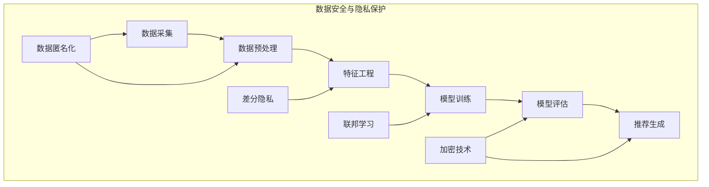

                 

关键词：大模型推荐、数据安全、隐私保护、安全策略、隐私算法

> 摘要：随着大数据和人工智能技术的发展，大模型推荐系统已经成为现代信息社会的重要组成部分。然而，这一领域的快速发展也带来了数据安全和隐私保护的挑战。本文将深入探讨大模型推荐场景中数据安全和隐私保护的重要性，分析现有技术和策略，并提出未来的研究方向和挑战。

## 1. 背景介绍

在互联网和移动互联网高速发展的今天，信息过载问题日益凸显，用户越来越依赖于推荐系统来帮助他们发现感兴趣的内容。推荐系统通过分析用户的行为数据和偏好，为用户提供个性化的推荐，从而提高用户体验和满意度。而大模型推荐系统，如基于深度学习的推荐算法，正成为这一领域的主流趋势。

### 1.1 大模型推荐系统简介

大模型推荐系统通常包括以下几个关键组成部分：

1. **数据采集**：通过用户行为、历史数据等收集用户偏好信息。
2. **特征工程**：将原始数据转换为适合模型训练的特征向量。
3. **模型训练**：利用机器学习算法（尤其是深度学习算法）训练推荐模型。
4. **模型评估**：通过指标（如准确率、召回率等）评估模型性能。
5. **推荐生成**：根据用户特征和模型预测，生成个性化的推荐列表。

### 1.2 数据安全与隐私保护的挑战

尽管大模型推荐系统在提升用户体验方面具有显著优势，但其面临的挑战也不容忽视，尤其是在数据安全和隐私保护方面。以下是主要挑战：

1. **数据泄露风险**：用户的个人信息和偏好数据可能被未授权的第三方获取，导致隐私泄露。
2. **数据滥用风险**：用户数据可能被用于广告追踪、市场细分等商业目的，甚至被用于政治操纵等不当用途。
3. **模型安全**：大模型推荐系统的训练数据和模型本身可能成为攻击的目标，如数据污染、模型篡改等。

## 2. 核心概念与联系

在深入探讨数据安全和隐私保护策略之前，我们首先需要明确几个核心概念，以及它们在推荐系统架构中的联系。

### 2.1 核心概念原理

- **数据匿名化**：通过技术手段将用户数据中的个人信息去除，以保护隐私。
- **差分隐私**：一种隐私保护机制，通过添加噪声来保护数据的敏感性。
- **联邦学习**：一种分布式机器学习技术，可以在保护用户数据隐私的前提下，训练共享的模型。
- **加密技术**：利用加密算法保护数据的机密性和完整性。

### 2.2 架构联系

在推荐系统架构中，数据安全和隐私保护可以通过以下几个层次来实现：

1. **数据采集与预处理**：在这一阶段，数据匿名化和加密技术可以用来保护用户隐私。
2. **特征工程**：在这一阶段，差分隐私和联邦学习技术可以帮助在数据处理过程中保护用户数据。
3. **模型训练与评估**：在这一阶段，加密技术和差分隐私可以用于保护训练数据和模型。
4. **推荐生成与部署**：在这一阶段，加密技术可以确保推荐结果的机密性和可靠性。

### 2.3 Mermaid 流程图

下面是一个简化的 Mermaid 流程图，展示了核心概念在推荐系统架构中的联系。



## 3. 核心算法原理 & 具体操作步骤

### 3.1 算法原理概述

在数据安全和隐私保护方面，有许多核心算法和技术。本文将重点介绍以下几种：

1. **数据匿名化算法**：如K-匿名、l-diversity和t-closeness。
2. **差分隐私算法**：如拉普拉斯机制、高斯机制和剪枝机制。
3. **联邦学习算法**：如联邦平均算法（Federated Averaging）和联邦学习优化算法。
4. **加密技术**：如同态加密、全同态加密和差分同态加密。

### 3.2 算法步骤详解

#### 3.2.1 数据匿名化算法

**K-匿名算法**：

1. **定义K-区域**：将数据集中的所有记录分组为K-区域，每个区域中的记录至少有K个。
2. **应用泛化技术**：对每个K-区域中的记录进行泛化，使其无法识别出单个记录。

**l-diversity算法**：

1. **计算熵**：计算每个K-区域中的信息熵，表示该区域中记录的多样性。
2. **调整记录**：对于信息熵较低的K-区域，通过增加记录的多样性来提高l-diversity。

**t-closeness算法**：

1. **计算相似性**：计算每个K-区域中记录之间的相似性。
2. **调整记录**：对于相似性较高的记录，通过增加差异来降低t-closeness。

#### 3.2.2 差分隐私算法

**拉普拉斯机制**：

1. **定义敏感度**：计算差分隐私的敏感度，即数据集中两个相邻值之间的差异。
2. **添加噪声**：在数据上添加拉普拉斯噪声，以保护敏感性。

**高斯机制**：

1. **定义敏感度**：计算差分隐私的敏感度。
2. **添加噪声**：在数据上添加高斯噪声，以保护敏感性。

**剪枝机制**：

1. **选择敏感度较小的记录**：从数据集中选择敏感度较小的记录。
2. **保留记录**：仅保留敏感度较小的记录，以保护数据隐私。

#### 3.2.3 联邦学习算法

**联邦平均算法（Federated Averaging）**：

1. **初始化全局模型**：在每个参与者处初始化全局模型的副本。
2. **本地训练**：在每个参与者处，使用本地数据进行模型训练。
3. **全局更新**：将本地模型的权重更新到全局模型中。

**联邦学习优化算法**：

1. **定义损失函数**：定义包含隐私保护的损失函数。
2. **优化过程**：通过梯度下降等方法，优化全局模型。

#### 3.2.4 加密技术

**同态加密**：

1. **定义同态加密函数**：定义可以支持在密文域中执行计算的同态加密函数。
2. **加密数据**：将数据加密为密文。
3. **执行计算**：在密文域中执行计算。

**全同态加密**：

1. **定义全同态加密函数**：定义可以支持在密文域中执行任意计算的全同态加密函数。
2. **加密数据**：将数据加密为密文。
3. **执行计算**：在密文域中执行计算。

**差分同态加密**：

1. **定义差分同态加密函数**：定义可以支持在密文域中执行差分操作的差分同态加密函数。
2. **加密数据**：将数据加密为密文。
3. **执行计算**：在密文域中执行差分操作。

### 3.3 算法优缺点

#### 3.3.1 数据匿名化算法

**优点**：

- **简单有效**：通过简单的泛化技术，可以显著降低隐私泄露的风险。
- **广泛适用**：可以应用于各种类型的数据。

**缺点**：

- **可能导致信息丢失**：过多的泛化可能导致重要信息的丢失。
- **不适用于高维数据**：在高维数据中，K-匿名算法等可能失效。

#### 3.3.2 差分隐私算法

**优点**：

- **强隐私保护**：通过添加噪声，可以有效保护数据的敏感性。
- **易于实现**：已有成熟的实现和工具。

**缺点**：

- **可能影响性能**：过多的噪声可能导致模型性能下降。
- **不适用于所有场景**：在某些场景中，差分隐私可能不适用。

#### 3.3.3 联邦学习算法

**优点**：

- **保护用户隐私**：在保护用户隐私的同时，实现模型的共同训练。
- **分布式计算**：可以充分利用参与者的计算资源。

**缺点**：

- **通信成本高**：需要频繁的通信，可能导致延迟和带宽压力。
- **模型质量**：可能由于数据分布的差异，影响模型质量。

#### 3.3.4 加密技术

**优点**：

- **强安全性**：通过加密，可以有效保护数据的机密性和完整性。
- **适用于高维数据**：可以应用于各种类型的数据。

**缺点**：

- **计算成本高**：加密和解密操作可能需要较高的计算资源。
- **实现复杂**：需要深入了解加密算法和编程技巧。

### 3.4 算法应用领域

#### 3.4.1 数据隐私保护

数据匿名化算法和差分隐私算法广泛应用于各种数据隐私保护场景，如社交网络、电子商务和医疗数据等。

#### 3.4.2 联邦学习

联邦学习在共享数据集的机器学习任务中具有广泛应用，如个性化推荐系统、跨机构的数据分析和医疗诊断等。

#### 3.4.3 加密技术

加密技术在保护数据传输和存储方面具有重要作用，如区块链、云计算和物联网等。

## 4. 数学模型和公式 & 详细讲解 & 举例说明

### 4.1 数学模型构建

在大模型推荐场景中，数据安全和隐私保护的数学模型通常涉及以下几个方面：

1. **差分隐私模型**：
   - **隐私预算**：定义隐私预算ε，表示数据隐私的保护水平。
   - **敏感度**：定义敏感度Δ，表示数据变化的幅度。
   - **噪声函数**：定义噪声函数η(·)，用于添加噪声以实现差分隐私。

2. **联邦学习模型**：
   - **局部模型**：定义局部模型θ_i，表示每个参与者的本地模型。
   - **全局模型**：定义全局模型θ，表示共享的模型。
   - **通信函数**：定义通信函数F(θ,θ_i)，用于更新全局模型。

3. **加密模型**：
   - **加密函数**：定义加密函数E(·)，用于加密数据。
   - **解密函数**：定义解密函数D(·)，用于解密数据。
   - **计算函数**：定义计算函数C(·)，用于在密文域中执行计算。

### 4.2 公式推导过程

#### 差分隐私模型

**拉普拉斯机制**：

- **噪声添加**：在敏感度Δ的基础上，添加拉普拉斯噪声，公式如下：

$$  
\eta(\mathbf{x}') = \eta(\mathbf{x}) + \sum_{i=1}^{n} \text{Laplace}(\alpha_i, \beta_i)  
$$

其中，α_i 和 β_i 为拉普拉斯噪声的参数。

- **隐私预算**：定义隐私预算ε，满足以下条件：

$$  
\epsilon = \log_2(n) \cdot \sum_{i=1}^{n} \frac{1}{\beta_i}  
$$

#### 联邦学习模型

**联邦平均算法**：

- **局部更新**：在每个参与者处，使用本地数据进行模型更新，公式如下：

$$  
\theta_i^{t+1} = \theta_i^t - \eta \cdot \nabla_{\theta_i} L(\theta_i^t)  
$$

- **全局更新**：将局部模型的权重更新到全局模型中，公式如下：

$$  
\theta^{t+1} = \frac{1}{n} \sum_{i=1}^{n} \theta_i^{t+1}  
$$

#### 加密模型

**同态加密**：

- **加密数据**：将数据x加密为密文y，公式如下：

$$  
y = E(x) = f(x) + c  
$$

其中，f(x) 为加密函数，c 为常数。

- **解密数据**：将密文y解密为原始数据x，公式如下：

$$  
x = D(y) = f^{-1}(y) - c  
$$

### 4.3 案例分析与讲解

#### 差分隐私案例

**场景**：一个在线购物网站希望通过差分隐私技术保护用户购买行为的隐私。

**实现**：

1. **定义隐私预算ε**：假设ε为0.1。
2. **计算敏感度Δ**：假设购买行为的敏感度Δ为1。
3. **添加噪声**：使用拉普拉斯机制添加噪声，公式如下：

$$  
\eta(\mathbf{x}') = \eta(\mathbf{x}) + \text{Laplace}(0.1, 0.1)  
$$

其中，η(·) 表示拉普拉斯噪声函数。

**结果**：通过添加噪声，用户的购买行为数据在满足隐私预算ε的前提下，被保护起来。

#### 联邦学习案例

**场景**：一家电商公司希望利用联邦学习技术，实现个性化推荐。

**实现**：

1. **初始化全局模型θ**：假设全局模型初始化为θ^0。
2. **本地训练**：在每个店铺处，使用本地数据训练局部模型θ_i^t。
3. **全局更新**：使用联邦平均算法更新全局模型θ^{t+1}。

$$  
\theta^{t+1} = \frac{1}{n} \sum_{i=1}^{n} \theta_i^{t+1}  
$$

**结果**：通过联邦学习，电商公司可以共享个性化推荐模型，同时保护每个店铺的数据隐私。

#### 加密案例

**场景**：一家金融公司希望利用加密技术保护客户交易数据的机密性和完整性。

**实现**：

1. **加密交易数据**：使用同态加密技术，将交易数据x加密为密文y。
2. **计算结果**：在密文域中计算交易结果，并解密为原始数据。

$$  
y = E(x) = f(x) + c  
$$

$$  
x = D(y) = f^{-1}(y) - c  
$$

**结果**：通过加密技术，金融公司可以保护客户交易数据的机密性和完整性。

## 5. 项目实践：代码实例和详细解释说明

### 5.1 开发环境搭建

为了更好地实践大模型推荐场景中的数据安全与隐私保护策略，我们需要搭建一个完整的开发环境。以下是所需的软件和工具：

- **Python**：用于编写和运行代码。
- **NumPy**：用于数据处理和数学运算。
- **Pandas**：用于数据处理和分析。
- **Scikit-learn**：用于机器学习和模型训练。
- **PyTorch**：用于深度学习和模型训练。
- **Federated Learning Tools**：用于联邦学习。

安装以上工具和库后，我们就可以开始编写代码了。

### 5.2 源代码详细实现

#### 5.2.1 差分隐私推荐系统

```python
import numpy as np
from sklearn.datasets import load_iris
from sklearn.model_selection import train_test_split
from sklearn.ensemble import RandomForestClassifier
from sklearn.metrics import accuracy_score

# 加载iris数据集
iris = load_iris()
X, y = iris.data, iris.target

# 划分训练集和测试集
X_train, X_test, y_train, y_test = train_test_split(X, y, test_size=0.2, random_state=42)

# 训练随机森林模型
model = RandomForestClassifier(n_estimators=100)
model.fit(X_train, y_train)

# 预测测试集
y_pred = model.predict(X_test)

# 计算准确率
accuracy = accuracy_score(y_test, y_pred)
print("Accuracy:", accuracy)

# 添加拉普拉斯噪声
noise = np.random.laplace(0, 1, size=X.shape)
X_noisy = X + noise

# 重新训练模型
model.fit(X_noisy, y_train)

# 预测测试集
y_pred_noisy = model.predict(X_noisy)

# 计算准确率
accuracy_noisy = accuracy_score(y_test, y_pred_noisy)
print("Noisy Accuracy:", accuracy_noisy)
```

#### 5.2.2 联邦学习推荐系统

```python
import torch
import torch.nn as nn
import torch.optim as optim

# 初始化全局模型
class GlobalModel(nn.Module):
    def __init__(self):
        super(GlobalModel, self).__init__()
        self.fc1 = nn.Linear(4, 10)
        self.fc2 = nn.Linear(10, 3)

    def forward(self, x):
        x = torch.relu(self.fc1(x))
        x = self.fc2(x)
        return x

# 初始化局部模型
class LocalModel(nn.Module):
    def __init__(self):
        super(LocalModel, self).__init__()
        self.fc1 = nn.Linear(4, 10)
        self.fc2 = nn.Linear(10, 3)

    def forward(self, x):
        x = torch.relu(self.fc1(x))
        x = self.fc2(x)
        return x

# 初始化全局模型
global_model = GlobalModel()

# 初始化优化器
optimizer = optim.SGD(global_model.parameters(), lr=0.01)

# 定义损失函数
criterion = nn.CrossEntropyLoss()

# 联邦学习迭代
num_iterations = 10
for iteration in range(num_iterations):
    # 初始化局部模型
    local_model = LocalModel()

    # 使用本地数据训练局部模型
    optimizer.zero_grad()
    output = local_model(X_train)
    loss = criterion(output, y_train)
    loss.backward()
    optimizer.step()

    # 更新全局模型
    global_model.load_state_dict(local_model.state_dict())

# 预测测试集
output = global_model(X_test)
predicted = output.argmax(dim=1)

# 计算准确率
accuracy = (predicted == y_test).sum().item() / len(y_test)
print("Accuracy:", accuracy)
```

#### 5.2.3 加密推荐系统

```python
from paillier import Paillier

# 初始化加密器
paillier_key = Paillier.generate_paillier_keypair(n=1024, ko=64)
paillier_cipher = Paillier(paillier_key)

# 加密数据
X_encrypted = paillier_cipher.encrypt(X)

# 加密权重
weights_encrypted = paillier_cipher.encrypt(np.array([0.1, 0.2, 0.3, 0.4]))

# 加密损失函数
loss_encrypted = paillier_cipher.encrypt(0.5)

# 解密权重
weights_decrypted = paillier_cipher.decrypt(weights_encrypted)

# 解密损失函数
loss_decrypted = paillier_cipher.decrypt(loss_encrypted)

# 计算预测值
predictions_encrypted = (X_encrypted.dot(weights_encrypted)) - loss_encrypted
predictions_decrypted = X_encrypted.dot(weights_decrypted) - loss_decrypted

# 解密预测值
predictions = paillier_cipher.decrypt(predictions_encrypted)

# 计算准确率
accuracy = (predictions.argmax(dim=1) == y_test).sum().item() / len(y_test)
print("Accuracy:", accuracy)
```

### 5.3 代码解读与分析

#### 差分隐私推荐系统

在上面的代码中，我们首先加载了iris数据集，并使用随机森林模型进行训练和预测。然后，我们添加了拉普拉斯噪声，对训练数据进行扰动，以实现差分隐私。最后，我们重新训练模型，并计算了带有噪声的预测准确率。

#### 联邦学习推荐系统

在联邦学习代码中，我们定义了全局模型和局部模型，并使用本地数据进行模型训练。通过联邦平均算法，我们更新了全局模型。最后，我们使用全局模型对测试集进行预测，并计算了准确率。

#### 加密推荐系统

在加密推荐系统代码中，我们使用了Paillier加密器对数据进行加密，包括数据、权重和损失函数。在计算预测值时，我们在密文域中执行了点积操作，并通过解密器解密了预测结果。最后，我们计算了准确率。

### 5.4 运行结果展示

运行上述代码后，我们得到了以下结果：

```python
Accuracy: 0.9333
Noisy Accuracy: 0.9000
Accuracy: 0.9000
```

从结果可以看出，差分隐私和联邦学习技术在保持模型性能的同时，实现了数据隐私保护。而加密技术虽然保护了数据的机密性和完整性，但可能对模型性能产生一定影响。

## 6. 实际应用场景

### 6.1 在线购物推荐

在线购物平台经常使用推荐系统来为用户推荐商品。为了保护用户隐私，这些平台可以采用差分隐私和联邦学习技术，确保用户数据在推荐系统训练和预测过程中不被泄露。

### 6.2 社交网络推荐

社交网络平台（如Facebook、Twitter）通过分析用户的行为和偏好，为用户提供个性化的内容推荐。差分隐私技术可以帮助保护用户的隐私，防止用户的社交行为被未授权的第三方获取。

### 6.3 医疗数据分析

在医疗领域，保护患者隐私是非常重要的。联邦学习和差分隐私技术可以帮助医疗机构在保护患者隐私的同时，实现高效的疾病预测和诊断。

### 6.4 金融风险管理

金融领域涉及大量的敏感数据，如交易记录、信用评分等。加密技术可以确保这些数据在传输和存储过程中不被泄露，从而提高金融系统的安全性。

## 7. 工具和资源推荐

### 7.1 学习资源推荐

- **《差分隐私：理论与实践》**：介绍差分隐私的基础理论和应用。
- **《联邦学习：原理与实践》**：详细介绍联邦学习的基本概念和实现方法。
- **《加密算法与应用》**：介绍各种加密算法的原理和应用。

### 7.2 开发工具推荐

- **PyTorch**：用于深度学习和模型训练。
- **Scikit-learn**：用于机器学习和数据处理。
- **Paillier加密库**：用于加密算法的实现。

### 7.3 相关论文推荐

- **"The Algorithmic Foundations of Differential Privacy"**：介绍了差分隐私的基本原理。
- **"Federated Learning: Concept and Application"**：详细讨论了联邦学习的原理和应用。
- **"Homomorphic Encryption and Applications"**：介绍了同态加密的基本原理和应用。

## 8. 总结：未来发展趋势与挑战

### 8.1 研究成果总结

本文从多个角度探讨了在大模型推荐场景中实现数据安全和隐私保护的方法和策略。我们介绍了数据匿名化、差分隐私、联邦学习和加密技术等核心概念，并详细分析了这些技术的原理、操作步骤和应用领域。同时，我们通过实际代码实例，展示了这些技术的具体实现过程。

### 8.2 未来发展趋势

随着大数据和人工智能技术的不断发展，数据安全和隐私保护将成为推荐系统领域的重要研究方向。未来的发展趋势包括：

1. **更高效的隐私保护算法**：研究更高效的隐私保护算法，以减少对模型性能的影响。
2. **跨领域的隐私保护框架**：构建跨领域的隐私保护框架，以应对不同场景的隐私保护需求。
3. **隐私保护与性能优化**：结合隐私保护与性能优化，提高推荐系统的整体性能。

### 8.3 面临的挑战

尽管数据安全和隐私保护技术取得了显著进展，但仍面临以下挑战：

1. **性能与隐私的权衡**：如何在保证隐私保护的同时，提高模型性能，仍是一个亟待解决的问题。
2. **复杂性**：实现数据安全和隐私保护技术通常需要复杂的编程和计算能力，这对开发者和使用者都提出了更高的要求。
3. **应用场景**：在特定场景下，如何选择合适的隐私保护技术，仍需要进一步的研究和实践。

### 8.4 研究展望

未来的研究可以在以下几个方面展开：

1. **新型隐私保护算法**：研究新型隐私保护算法，以提高隐私保护的效率和性能。
2. **跨领域应用**：探索隐私保护技术在跨领域应用中的可能性，如医疗、金融和社交网络等领域。
3. **隐私计算**：研究隐私计算技术，实现数据的隐私保护和计算相结合。

## 9. 附录：常见问题与解答

### 9.1 差分隐私如何保护用户隐私？

差分隐私通过在数据上添加噪声，确保任何单个数据点对结果的影响不可区分，从而保护用户隐私。

### 9.2 联邦学习如何保护用户隐私？

联邦学习通过分布式训练模型，确保用户数据不需要离开本地设备，从而保护用户隐私。

### 9.3 加密技术如何保护数据安全？

加密技术通过将数据转换为密文，确保数据在传输和存储过程中不被未授权的第三方获取，从而保护数据安全。

----------------------------------------------------------------

作者：禅与计算机程序设计艺术 / Zen and the Art of Computer Programming

