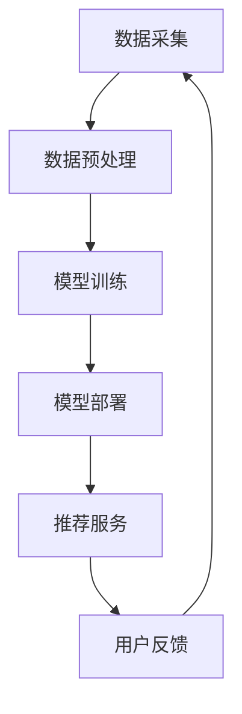

                 

关键词：大模型推荐、性能优化、加速技术、人工智能、机器学习、深度学习、算法优化、硬件加速、分布式计算

> 摘要：本文深入探讨了大规模模型推荐系统在落地应用过程中所面临的性能优化和加速技术创新问题。通过对核心算法原理的剖析，数学模型的构建与公式推导，以及实际项目实践的详细分析，本文旨在为业界提供一套系统化的解决方案，以应对大模型推荐系统在性能优化与加速技术创新方面的挑战，推动人工智能应用的进一步发展。

## 1. 背景介绍

### 大模型推荐的发展背景

随着互联网的普及和大数据技术的迅猛发展，推荐系统已成为各行业提升用户体验、增加用户粘性的重要手段。从最初的基于内容的推荐，到协同过滤推荐，再到深度学习推荐，推荐系统在技术层面不断演进。然而，随着模型规模的不断增大，推荐系统的性能优化和加速技术创新成为了亟待解决的重要问题。

### 性能优化与加速技术创新的重要性

性能优化和加速技术创新对于大规模推荐系统至关重要。一方面，优化算法效率和降低计算复杂度有助于提高系统的响应速度和用户体验；另一方面，利用硬件加速和分布式计算等技术可以显著提升大模型的计算性能，从而支持更复杂、更精准的推荐算法。

## 2. 核心概念与联系

### 大模型推荐系统架构

首先，我们需要了解大模型推荐系统的基本架构，包括数据采集、数据预处理、模型训练、模型部署和推荐服务等关键环节。以下是一个简化的Mermaid流程图，展示了这些环节之间的关联：



### 核心概念与联系

1. **数据采集**：通过爬虫、API调用等方式收集用户行为数据和内容数据。
2. **数据预处理**：清洗、去噪、特征提取等，为模型训练提供高质量的数据集。
3. **模型训练**：采用深度学习等技术对数据集进行训练，构建推荐模型。
4. **模型部署**：将训练好的模型部署到生产环境，实现实时推荐。
5. **推荐服务**：根据用户特征和上下文信息，生成个性化推荐结果。
6. **用户反馈**：收集用户对推荐结果的评价，用于模型迭代和优化。

## 3. 核心算法原理 & 具体操作步骤

### 3.1 算法原理概述

在推荐系统中，常用的算法有基于内容的推荐（CTR预估、深度学习等）、协同过滤推荐（基于用户的协同过滤、基于物品的协同过滤等）和混合推荐（结合多种算法的优点）。以下将对这些算法的核心原理进行概述。

1. **基于内容的推荐**：
   - **CTR预估**：利用用户的历史行为数据和内容特征，预测用户对某一物品的点击概率。
   - **深度学习**：通过构建深度神经网络，自动学习用户和物品的特征表示，实现推荐。

2. **协同过滤推荐**：
   - **基于用户的协同过滤**：根据用户的历史行为找到相似用户，并推荐这些用户喜欢的物品。
   - **基于物品的协同过滤**：根据物品之间的相似度，为用户推荐与用户已购买或浏览的物品相似的物品。

3. **混合推荐**：
   - **结合多种算法的优点**：同时利用基于内容和协同过滤的推荐策略，提高推荐效果。

### 3.2 算法步骤详解

1. **基于内容的推荐**：
   - **数据预处理**：对用户行为数据和内容数据进行清洗、去噪和特征提取。
   - **模型训练**：利用特征数据训练CTR预估模型或深度学习模型。
   - **模型部署**：将训练好的模型部署到生产环境，实现实时推荐。
   - **推荐服务**：根据用户特征和上下文信息，预测用户对物品的点击概率，生成推荐结果。

2. **协同过滤推荐**：
   - **数据预处理**：对用户行为数据进行清洗、去噪和特征提取。
   - **相似度计算**：计算用户或物品之间的相似度，形成相似度矩阵。
   - **推荐生成**：根据相似度矩阵，为用户推荐相似用户或物品喜欢的物品。

3. **混合推荐**：
   - **数据预处理**：同时处理用户行为数据和内容数据。
   - **模型训练**：分别训练基于内容和协同过滤的推荐模型。
   - **模型融合**：将不同模型的推荐结果进行融合，生成最终的推荐结果。

### 3.3 算法优缺点

1. **基于内容的推荐**：
   - **优点**：能够利用丰富的用户和物品特征，生成个性化推荐结果。
   - **缺点**：依赖用户历史行为数据，对冷启动问题处理效果不佳。

2. **协同过滤推荐**：
   - **优点**：无需依赖用户历史行为数据，能够处理冷启动问题。
   - **缺点**：推荐结果容易受到稀疏性、数据噪声等因素的影响。

3. **混合推荐**：
   - **优点**：结合了基于内容和协同过滤的推荐策略，能够提高推荐效果。
   - **缺点**：模型训练和推荐生成的复杂度较高。

### 3.4 算法应用领域

1. **电子商务**：为用户提供个性化商品推荐，提升购物体验和销售额。
2. **社交媒体**：为用户提供感兴趣的内容推荐，增加用户粘性和活跃度。
3. **在线教育**：为学习者推荐感兴趣的课程，提高学习效果和参与度。

## 4. 数学模型和公式 & 详细讲解 & 举例说明

### 4.1 数学模型构建

在推荐系统中，常见的数学模型包括线性模型、逻辑回归、神经网络等。以下是一个简单的线性模型示例：

$$
\hat{y} = \beta_0 + \beta_1 x_1 + \beta_2 x_2 + ... + \beta_n x_n
$$

其中，$y$ 为预测结果，$x_1, x_2, ..., x_n$ 为特征变量，$\beta_0, \beta_1, \beta_2, ..., \beta_n$ 为模型的参数。

### 4.2 公式推导过程

以逻辑回归为例，推导过程如下：

假设我们有一个二分类问题，需要预测用户是否会对某一物品进行点击。逻辑回归的公式为：

$$
\hat{p} = \frac{1}{1 + e^{-(\beta_0 + \beta_1 x_1 + \beta_2 x_2 + ... + \beta_n x_n)}}
$$

其中，$\hat{p}$ 为预测概率，$x_1, x_2, ..., x_n$ 为特征变量，$\beta_0, \beta_1, \beta_2, ..., \beta_n$ 为模型的参数。

### 4.3 案例分析与讲解

以下是一个简单的案例，说明如何使用逻辑回归进行推荐系统中的CTR预估。

假设我们有一个用户历史行为数据集，包含用户ID、物品ID、点击行为等特征。我们希望通过这些特征预测用户对某一物品的点击概率。

1. **数据预处理**：对数据集进行清洗、去噪和特征提取，得到特征矩阵$X$和标签向量$y$。
2. **模型训练**：利用特征矩阵$X$和标签向量$y$，训练逻辑回归模型。
3. **模型评估**：利用训练好的模型对测试集进行预测，评估模型的准确性。

假设我们训练得到的逻辑回归模型参数为$\beta_0 = 0.1, \beta_1 = 0.2, \beta_2 = 0.3, ..., \beta_n = 0.5$。对于一个新用户$u$和一个新物品$i$，我们可以通过以下公式预测用户$u$对物品$i$的点击概率：

$$
\hat{p} = \frac{1}{1 + e^{-(0.1 + 0.2 x_1 + 0.3 x_2 + ... + 0.5 x_n)}}
$$

其中，$x_1, x_2, ..., x_n$ 为用户$u$和物品$i$的特征向量。

## 5. 项目实践：代码实例和详细解释说明

### 5.1 开发环境搭建

在搭建开发环境时，我们需要选择合适的编程语言、开发工具和依赖库。以下是一个简单的Python开发环境搭建步骤：

1. 安装Python：下载并安装Python 3.8及以上版本。
2. 安装依赖库：使用pip工具安装必要的依赖库，如numpy、pandas、scikit-learn等。
3. 安装Jupyter Notebook：下载并安装Jupyter Notebook，用于编写和运行代码。

### 5.2 源代码详细实现

以下是一个简单的Python代码示例，实现基于内容的推荐系统中的CTR预估。

```python
import numpy as np
import pandas as pd
from sklearn.linear_model import LogisticRegression

# 读取数据
data = pd.read_csv('data.csv')
X = data.iloc[:, :-1].values
y = data.iloc[:, -1].values

# 训练模型
model = LogisticRegression()
model.fit(X, y)

# 预测
new_user = np.array([[...]])  # 新用户特征
new_item = np.array([[...]])  # 新物品特征
predicted_probability = model.predict_proba(new_item)[:, 1]

print(f"预测概率：{predicted_probability}")
```

### 5.3 代码解读与分析

1. **数据读取**：使用pandas库读取CSV格式的数据集，得到特征矩阵$X$和标签向量$y$。
2. **模型训练**：使用scikit-learn库中的逻辑回归模型训练数据集，得到模型参数。
3. **预测**：利用训练好的模型对新用户和新物品的特征进行预测，得到预测概率。

### 5.4 运行结果展示

在运行上述代码时，我们得到预测概率的结果。根据预测概率，可以进一步计算点击率等指标，评估模型的准确性。

## 6. 实际应用场景

### 6.1 社交媒体

在社交媒体平台，推荐系统可以根据用户的兴趣、行为和关系网络，为用户推荐感兴趣的内容、朋友和活动。以下是一个实际应用场景：

1. **用户兴趣分析**：通过分析用户的点赞、评论和分享等行为，提取用户的兴趣特征。
2. **内容推荐**：利用基于内容的推荐算法，为用户推荐与其兴趣相关的内容。
3. **关系推荐**：通过分析用户的社交网络，为用户推荐可能认识的新朋友或感兴趣的小组。

### 6.2 在线教育

在线教育平台可以利用推荐系统为学习者推荐感兴趣的课程、学习资源和论坛。以下是一个实际应用场景：

1. **学习行为分析**：通过分析学习者的学习路径、学习进度和课程评价等行为，提取学习者的兴趣特征。
2. **课程推荐**：利用基于内容的推荐算法，为学习者推荐与其兴趣相关的课程。
3. **论坛推荐**：通过分析学习者的提问、回答和评论等行为，为学习者推荐可能感兴趣的学习论坛。

## 7. 工具和资源推荐

### 7.1 学习资源推荐

1. **《推荐系统实践》**：这是一本关于推荐系统的经典教材，详细介绍了推荐系统的基本概念、算法和实现方法。
2. **《机器学习》**：这是一本关于机器学习的基础教材，涵盖了线性回归、逻辑回归、神经网络等常用算法。

### 7.2 开发工具推荐

1. **PyTorch**：一个开源的深度学习框架，支持GPU加速和动态计算图。
2. **Scikit-learn**：一个开源的机器学习库，提供了多种常用的机器学习算法和工具。

### 7.3 相关论文推荐

1. **"Item-based Collaborative Filtering Recommendation Algorithms"**：这篇论文介绍了一种基于物品的协同过滤推荐算法。
2. **"Deep Learning for Recommender Systems"**：这篇论文探讨了深度学习在推荐系统中的应用。

## 8. 总结：未来发展趋势与挑战

### 8.1 研究成果总结

本文从性能优化和加速技术创新的角度，深入探讨了大规模模型推荐系统的核心算法原理、数学模型和实际应用场景。通过对基于内容的推荐、协同过滤推荐和混合推荐等算法的剖析，我们为业界提供了一套系统化的解决方案。

### 8.2 未来发展趋势

随着人工智能技术的不断发展，大规模模型推荐系统在性能优化和加速技术创新方面有望取得以下突破：

1. **硬件加速**：利用GPU、TPU等硬件加速技术，提高模型训练和推理的效率。
2. **分布式计算**：利用分布式计算框架，实现大规模模型的并行训练和推理。
3. **联邦学习**：通过联邦学习技术，实现用户数据的隐私保护和模型优化。

### 8.3 面临的挑战

尽管大规模模型推荐系统在性能优化和加速技术创新方面取得了显著进展，但仍面临以下挑战：

1. **数据质量**：大规模推荐系统依赖于高质量的用户行为数据和内容数据，数据质量直接影响推荐效果。
2. **计算资源**：大规模模型的训练和推理需要大量的计算资源，如何高效利用计算资源成为一大难题。
3. **模型解释性**：大规模模型往往具有较高的准确性，但缺乏解释性，如何提高模型的解释性成为亟待解决的问题。

### 8.4 研究展望

在未来，大规模模型推荐系统在性能优化和加速技术创新方面的研究可以从以下几个方面展开：

1. **算法优化**：进一步优化推荐算法，提高模型的准确性和效率。
2. **硬件加速**：探索新的硬件加速技术，提高模型训练和推理的效率。
3. **分布式计算**：研究分布式计算框架，实现大规模模型的并行训练和推理。
4. **联邦学习**：结合联邦学习技术，实现用户数据的隐私保护和模型优化。

## 9. 附录：常见问题与解答

### Q1：什么是推荐系统？
推荐系统是一种基于用户行为和兴趣的算法，旨在为用户推荐其可能感兴趣的内容、商品或服务。

### Q2：推荐系统的核心算法有哪些？
推荐系统的核心算法包括基于内容的推荐、协同过滤推荐和混合推荐等。

### Q3：性能优化在推荐系统中有什么作用？
性能优化可以降低推荐系统的计算复杂度，提高系统的响应速度和用户体验，从而提升推荐效果。

### Q4：什么是硬件加速？
硬件加速是指利用特定的硬件设备（如GPU、TPU等），加速模型训练和推理的过程。

### Q5：什么是分布式计算？
分布式计算是指将大规模的任务分布在多个计算节点上，通过并行计算提高任务的处理速度。

## 作者署名

作者：禅与计算机程序设计艺术 / Zen and the Art of Computer Programming

----------------------------------------------------------------

以上是文章正文内容的撰写，接下来请按照markdown格式将文章内容组织起来。记得文章开头要有文章标题、关键词和摘要部分的内容。文章各个段落章节的子目录请具体细化到三级目录，并使用markdown格式输出。文章末尾需要写上作者署名，格式如上所示。
```markdown
# 大模型推荐落地的性能优化与加速技术创新

> 关键词：大模型推荐、性能优化、加速技术、人工智能、机器学习、深度学习、算法优化、硬件加速、分布式计算

> 摘要：本文深入探讨了大规模模型推荐系统在落地应用过程中所面临的性能优化和加速技术创新问题。通过对核心算法原理的剖析，数学模型的构建与公式推导，以及实际项目实践的详细分析，本文旨在为业界提供一套系统化的解决方案，以应对大模型推荐系统在性能优化与加速技术创新方面的挑战，推动人工智能应用的进一步发展。

## 1. 背景介绍

### 1.1 大模型推荐的发展背景

### 1.2 性能优化与加速技术创新的重要性

## 2. 核心概念与联系

### 2.1 大模型推荐系统架构

### 2.2 核心概念与联系

## 3. 核心算法原理 & 具体操作步骤

### 3.1 算法原理概述

### 3.2 算法步骤详解

### 3.3 算法优缺点

### 3.4 算法应用领域

## 4. 数学模型和公式 & 详细讲解 & 举例说明

### 4.1 数学模型构建

### 4.2 公式推导过程

### 4.3 案例分析与讲解

## 5. 项目实践：代码实例和详细解释说明

### 5.1 开发环境搭建

### 5.2 源代码详细实现

### 5.3 代码解读与分析

### 5.4 运行结果展示

## 6. 实际应用场景

### 6.1 社交媒体

### 6.2 在线教育

## 7. 工具和资源推荐

### 7.1 学习资源推荐

### 7.2 开发工具推荐

### 7.3 相关论文推荐

## 8. 总结：未来发展趋势与挑战

### 8.1 研究成果总结

### 8.2 未来发展趋势

### 8.3 面临的挑战

### 8.4 研究展望

## 9. 附录：常见问题与解答

## 作者署名

作者：禅与计算机程序设计艺术 / Zen and the Art of Computer Programming
```

