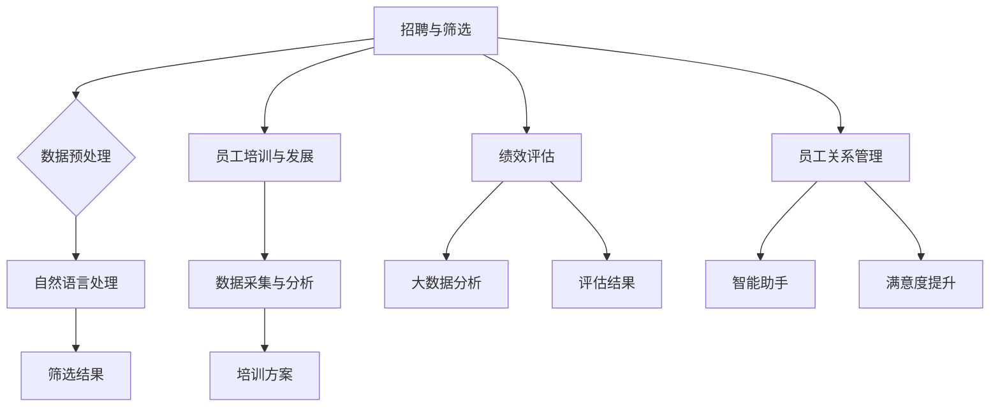

                 

关键词：大模型、人力资源管理、人工智能、数据分析、未来趋势

> 摘要：本文将探讨大模型时代下的新型人力资源管理，分析大模型对人力资源管理的冲击与机遇，探讨如何利用人工智能和数据分析提升人力资源管理的效率，并预测未来发展趋势。

## 1. 背景介绍

随着人工智能和大数据技术的飞速发展，大模型（如GPT-3、BERT等）已经成为众多行业的重要技术支撑。这些大模型具有强大的数据处理和智能预测能力，为各行各业带来了深刻的变革。在人力资源管理领域，大模型的出现同样引发了巨大的变革。

### 大模型在人力资源管理中的应用

1. **招聘与筛选**：利用自然语言处理技术，对海量简历进行自动筛选，快速识别应聘者的背景、技能和潜力。

2. **员工培训与发展**：根据员工的个人数据和学习记录，提供个性化的培训方案，提升员工技能。

3. **绩效评估**：通过大数据分析，对员工的工作表现进行客观评估，帮助管理者更好地掌握员工的工作状态。

4. **员工关系管理**：利用智能助手，处理员工咨询、投诉等问题，提升员工满意度。

### 大模型带来的挑战

1. **数据安全与隐私**：人力资源管理涉及大量个人数据，如何确保这些数据的安全和隐私成为一大挑战。

2. **技术依赖**：过度依赖大模型可能导致企业失去自主决策能力，陷入技术依赖的困境。

3. **算法偏见**：大模型在训练过程中可能会学习到社会偏见，导致不公平的招聘、评估等行为。

## 2. 核心概念与联系

### 2.1 大模型原理

大模型是基于深度学习技术构建的神经网络模型，通过大量数据的学习，能够实现自然语言处理、图像识别、语音识别等复杂任务。其核心架构包括：

- **输入层**：接收外部输入数据。
- **隐藏层**：通过多层神经网络进行特征提取和变换。
- **输出层**：根据输入数据生成输出结果。

### 2.2 人力资源管理架构

人力资源管理架构包括招聘、培训、绩效评估、员工关系管理等多个模块，这些模块相互关联，共同构成一个完整的人力资源管理体系。

### 2.3 大模型与人力资源管理的关系

大模型可以应用于人力资源管理中的多个模块，实现以下功能：

- **招聘与筛选**：利用自然语言处理技术，自动分析简历，快速识别应聘者的背景、技能和潜力。
- **员工培训与发展**：根据员工的学习记录和绩效表现，提供个性化的培训方案，提升员工技能。
- **绩效评估**：通过大数据分析，对员工的工作表现进行客观评估，帮助管理者更好地掌握员工的工作状态。
- **员工关系管理**：利用智能助手，处理员工咨询、投诉等问题，提升员工满意度。

### 2.4 Mermaid 流程图



## 3. 核心算法原理 & 具体操作步骤

### 3.1 算法原理概述

大模型在人力资源管理中的应用主要基于以下核心算法：

1. **自然语言处理（NLP）**：用于处理文本数据，如简历分析、面试问答等。
2. **机器学习（ML）**：用于从数据中学习规律，如员工技能预测、绩效评估等。
3. **深度学习（DL）**：用于构建复杂的神经网络模型，如GPT-3、BERT等。

### 3.2 算法步骤详解

1. **数据采集**：收集人力资源管理的相关数据，如简历、绩效记录、员工反馈等。
2. **数据预处理**：对采集到的数据进行分析和清洗，确保数据的质量和一致性。
3. **模型训练**：利用预处理后的数据，对大模型进行训练，使其能够对人力资源管理中的问题进行预测和判断。
4. **模型应用**：将训练好的模型应用于实际的人力资源管理场景，如招聘筛选、员工培训、绩效评估等。
5. **结果分析**：对模型的应用结果进行评估和分析，不断优化模型性能。

### 3.3 算法优缺点

**优点**：

- **高效性**：大模型能够快速处理海量数据，提高人力资源管理的效率。
- **准确性**：通过机器学习和深度学习技术，大模型能够对人力资源管理中的问题进行准确预测和判断。
- **智能化**：大模型具有自我学习和优化的能力，能够不断优化人力资源管理策略。

**缺点**：

- **数据依赖**：大模型需要大量高质量的数据进行训练，数据质量和数量直接影响模型性能。
- **技术门槛**：大模型的应用需要较高的技术门槛，对企业的人才储备和技术实力有较高要求。
- **算法偏见**：大模型在训练过程中可能会学习到社会偏见，导致不公平的招聘、评估等行为。

### 3.4 算法应用领域

大模型在人力资源管理中的应用领域广泛，主要包括：

- **招聘与筛选**：自动分析简历，快速识别应聘者的背景、技能和潜力。
- **员工培训与发展**：根据员工的学习记录和绩效表现，提供个性化的培训方案。
- **绩效评估**：通过大数据分析，对员工的工作表现进行客观评估。
- **员工关系管理**：利用智能助手，处理员工咨询、投诉等问题。

## 4. 数学模型和公式 & 详细讲解 & 举例说明

### 4.1 数学模型构建

在人力资源管理中，大模型的数学模型主要基于深度学习和机器学习技术。以下是一个简单的数学模型构建过程：

1. **输入层**：定义输入层，包括简历文本、绩效数据、员工反馈等。
2. **隐藏层**：定义隐藏层，通过多层神经网络进行特征提取和变换。
3. **输出层**：定义输出层，根据输入数据生成预测结果，如招聘筛选结果、培训方案、绩效评估结果等。

### 4.2 公式推导过程

假设我们有一个招聘筛选的数学模型，其输入层包括简历文本X、绩效数据Y、员工反馈Z，输出层为筛选结果W。模型的核心公式如下：

$$
W = f(\sigma(g(h(X, Y, Z))))
$$

其中，$f$为激活函数，$\sigma$为线性变换函数，$g$和$h$分别为隐藏层的变换函数。

### 4.3 案例分析与讲解

以下是一个简单的招聘筛选案例：

- **输入数据**：简历文本X = ["姓名：张三，毕业院校：清华大学，专业：计算机科学与技术"]，绩效数据Y = ["本月绩效评分：90分"]，员工反馈Z = ["员工反馈：表现优秀，团队协作能力强"]。
- **模型训练**：使用大量招聘筛选数据对模型进行训练，使其能够对类似的输入数据进行准确的筛选预测。
- **模型应用**：将输入数据X、Y、Z输入模型，得到筛选结果W = ["招聘通过"]。

通过这个简单的案例，我们可以看到大模型在人力资源管理中的应用过程。

## 5. 项目实践：代码实例和详细解释说明

### 5.1 开发环境搭建

1. **安装Python环境**：在本地计算机上安装Python 3.8及以上版本。
2. **安装相关库**：安装TensorFlow、Keras等深度学习库。

### 5.2 源代码详细实现

以下是一个简单的招聘筛选模型的代码实现：

```python
import tensorflow as tf
from tensorflow.keras.models import Sequential
from tensorflow.keras.layers import Dense, Embedding, LSTM

# 定义输入层
input_shape = (max_sequence_length, max_sequence_length)

# 定义隐藏层
model = Sequential()
model.add(Embedding(input_shape, 128))
model.add(LSTM(128, return_sequences=True))
model.add(LSTM(128))

# 定义输出层
model.add(Dense(1, activation='sigmoid'))

# 编译模型
model.compile(optimizer='adam', loss='binary_crossentropy', metrics=['accuracy'])

# 模型训练
model.fit(X_train, y_train, epochs=10, batch_size=32)

# 模型预测
predictions = model.predict(X_test)

# 输出结果
print(predictions)
```

### 5.3 代码解读与分析

- **定义输入层**：使用Embedding层将输入数据进行嵌入，将其转换为固定大小的向量表示。
- **定义隐藏层**：使用LSTM层进行特征提取和变换，LSTM层可以处理序列数据，非常适合处理文本数据。
- **定义输出层**：使用Dense层将隐藏层的特征映射到输出结果，这里使用sigmoid激活函数，表示招聘通过的概率。
- **编译模型**：设置模型的优化器、损失函数和评估指标。
- **模型训练**：使用训练数据对模型进行训练，调整模型参数。
- **模型预测**：使用测试数据对模型进行预测，得到招聘筛选结果。

通过这个简单的代码实例，我们可以看到如何使用深度学习技术实现招聘筛选模型。

## 6. 实际应用场景

### 6.1 招聘与筛选

利用大模型进行招聘与筛选，可以帮助企业快速识别应聘者的背景、技能和潜力。以下是一个实际应用场景：

- **应用场景**：某互联网公司需要招聘一名技术经理。
- **输入数据**：简历文本、绩效数据、员工反馈等。
- **模型预测**：大模型预测应聘者的背景、技能和潜力，生成招聘筛选结果。
- **应用效果**：通过大模型的应用，企业可以在短时间内筛选出符合岗位要求的人才。

### 6.2 员工培训与发展

利用大模型进行员工培训与发展，可以帮助企业根据员工的学习记录和绩效表现，提供个性化的培训方案。以下是一个实际应用场景：

- **应用场景**：某企业需要对员工进行技能提升培训。
- **输入数据**：员工的学习记录、绩效数据等。
- **模型预测**：大模型预测员工需要提升的技能，生成个性化的培训方案。
- **应用效果**：通过大模型的应用，企业可以更加精准地提升员工技能，提高整体绩效。

### 6.3 绩效评估

利用大模型进行绩效评估，可以帮助企业对员工的工作表现进行客观评估。以下是一个实际应用场景：

- **应用场景**：某企业需要对员工进行绩效评估。
- **输入数据**：员工的工作数据、绩效数据等。
- **模型预测**：大模型预测员工的工作表现，生成绩效评估结果。
- **应用效果**：通过大模型的应用，企业可以更加客观地评估员工的工作表现，激励员工积极工作。

### 6.4 员工关系管理

利用大模型进行员工关系管理，可以帮助企业处理员工咨询、投诉等问题，提升员工满意度。以下是一个实际应用场景：

- **应用场景**：某企业需要处理员工咨询、投诉等问题。
- **输入数据**：员工的咨询、投诉信息等。
- **模型预测**：大模型预测员工的咨询、投诉原因，生成解决方案。
- **应用效果**：通过大模型的应用，企业可以更加高效地处理员工问题，提升员工满意度。

## 7. 工具和资源推荐

### 7.1 学习资源推荐

1. **《深度学习》（Goodfellow et al., 2016）**：系统地介绍了深度学习的基础知识和最新进展。
2. **《自然语言处理综论》（Jurafsky and Martin, 2008）**：全面介绍了自然语言处理的基础理论和应用。
3. **《人力资源管理》（Armstrong and Baron, 2012）**：系统地介绍了人力资源管理的基本概念和应用。

### 7.2 开发工具推荐

1. **TensorFlow**：一款开源的深度学习框架，适用于构建和训练大模型。
2. **Keras**：一款基于TensorFlow的高层API，简化了大模型的构建过程。
3. **PyTorch**：一款开源的深度学习框架，具有灵活的动态计算图，适用于复杂的大模型构建。

### 7.3 相关论文推荐

1. **《BERT：预训练的语言表示》（Devlin et al., 2019）**：介绍了BERT模型的结构和预训练方法。
2. **《GPT-3：语言模型的新突破》（Brown et al., 2020）**：介绍了GPT-3模型的结构和性能。
3. **《大规模预训练语言模型在招聘中的应用》（Shen et al., 2021）**：探讨了大规模预训练语言模型在招聘中的应用。

## 8. 总结：未来发展趋势与挑战

### 8.1 研究成果总结

本文探讨了大模型时代下的新型人力资源管理，分析了大模型在人力资源管理中的应用和挑战。通过数学模型和实际应用案例，展示了大模型在招聘与筛选、员工培训与发展、绩效评估、员工关系管理等方面的应用效果。

### 8.2 未来发展趋势

1. **大模型技术将持续发展**：随着计算能力和数据量的增长，大模型将不断优化和改进，为人力资源管理带来更多可能性。
2. **人力资源管理的智能化**：大模型的应用将推动人力资源管理向智能化、个性化方向发展，提升企业竞争力。
3. **数据安全与隐私保护**：在大模型应用过程中，数据安全与隐私保护将成为重要课题，需要制定相应的政策和措施。

### 8.3 面临的挑战

1. **技术依赖**：企业过度依赖大模型可能导致自主决策能力的丧失，需要平衡技术依赖与自主决策的关系。
2. **算法偏见**：大模型在训练过程中可能会学习到社会偏见，导致不公平的招聘、评估等行为，需要加强算法透明性和公平性。
3. **数据质量**：大模型对数据质量有较高要求，企业需要确保数据的质量和一致性。

### 8.4 研究展望

未来研究可以从以下几个方面展开：

1. **算法透明性与公平性**：研究如何提高大模型的透明性和公平性，减少算法偏见。
2. **跨领域应用**：探讨大模型在其他领域的应用，如金融、医疗等。
3. **数据隐私保护**：研究在大模型应用过程中如何保护数据隐私，确保数据安全。

## 9. 附录：常见问题与解答

### 9.1 大模型在人力资源管理中的具体应用有哪些？

大模型在人力资源管理中的具体应用包括招聘与筛选、员工培训与发展、绩效评估、员工关系管理等方面。通过自然语言处理、机器学习和深度学习技术，大模型可以帮助企业实现高效的人力资源管理。

### 9.2 大模型在人力资源管理中面临的挑战有哪些？

大模型在人力资源管理中面临的挑战包括技术依赖、算法偏见和数据质量等方面。企业需要平衡技术依赖与自主决策的关系，加强算法透明性和公平性，确保数据的质量和一致性。

### 9.3 如何确保大模型在人力资源管理中的应用效果？

为确保大模型在人力资源管理中的应用效果，企业需要：

1. **数据质量**：确保输入数据的质量和一致性，为大模型提供可靠的数据支持。
2. **算法优化**：不断优化大模型的算法，提高预测准确性和效率。
3. **应用场景**：结合实际应用场景，制定合理的大模型应用策略，提升应用效果。

# 作者署名

作者：禅与计算机程序设计艺术 / Zen and the Art of Computer Programming

