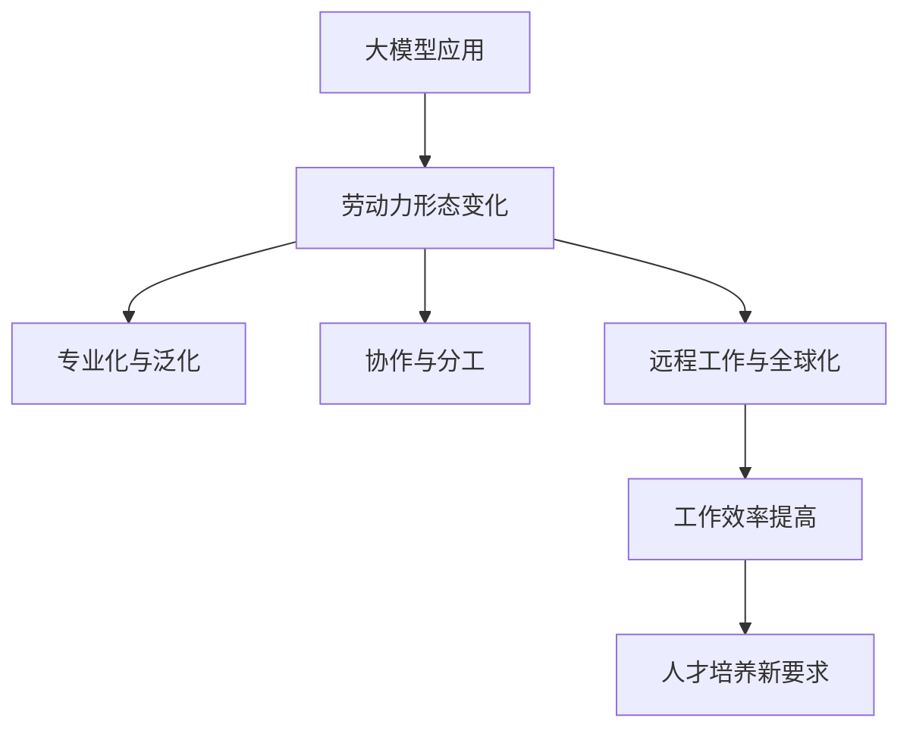

                 

关键词：大模型、新型劳动力、人工智能、技术变革、工作效率、人才培养

> 摘要：随着人工智能技术的快速发展，大模型在各个领域的应用日益广泛，为劳动力市场带来了深远的影响。本文将探讨大模型时代下新型劳动力形态的演变，分析其对工作效率、人才培养以及技术变革的推动作用，并展望未来发展的趋势与挑战。

## 1. 背景介绍

近年来，人工智能技术取得了显著的进展，特别是深度学习算法的突破，使得大模型成为可能。大模型是指具有数十亿甚至千亿参数的神经网络模型，它们可以自动从海量数据中学习复杂的特征和模式，从而实现高度智能化的任务。随着大模型的普及，越来越多的行业开始探索其应用，如自然语言处理、计算机视觉、语音识别等。这种技术的变革不仅提高了生产效率，还改变了劳动力市场的需求。

### 1.1 大模型的定义与发展历程

大模型，即具有大规模参数的网络模型，最早可以追溯到2012年AlexNet在ImageNet比赛中的突破性表现。随着计算能力的提升和数据量的增加，大模型的规模也在不断扩张。例如，GPT-3拥有1750亿个参数，BERT也有数亿个参数。这些大模型的出现，标志着人工智能技术进入了一个全新的阶段。

### 1.2 大模型在人工智能中的重要性

大模型在人工智能中的重要性不言而喻。首先，它们能够处理更加复杂的任务，如自然语言理解和图像识别。其次，大模型的学习能力更强，可以自动从大量数据中提取特征，减少了人工干预的需求。此外，大模型的应用范围也越来越广泛，从传统的工业自动化到新兴的智能家居，从医疗诊断到金融分析，都展现了其强大的潜力。

## 2. 核心概念与联系

### 2.1 大模型与新型劳动力形态

大模型的应用不仅改变了技术领域，也对劳动力市场产生了深远影响。新型劳动力形态的出现，主要体现在以下几个方面：

- **专业化与泛化**：大模型的出现使得某些特定领域的专业知识变得不那么重要，而跨学科的综合能力更加受到重视。同时，大模型也可以通过迁移学习迅速适应新的任务，从而实现泛化。

- **协作与分工**：大模型可以作为辅助工具，帮助人类完成更加复杂的任务。这种协作模式改变了传统的分工方式，使劳动力在协作中实现价值的最大化。

- **远程工作与全球化**：大模型的应用使得远程工作成为可能，劳动力不再受地域限制，全球化趋势进一步加强。

### 2.2 大模型与工作效率

大模型在提高工作效率方面具有显著优势。首先，大模型可以自动处理大量重复性工作，如数据标注、文档分类等，从而解放人力资源。其次，大模型的应用可以优化流程，提高整体工作效率。例如，在医疗领域，大模型可以帮助医生快速诊断疾病，减少误诊率，提高治疗效果。

### 2.3 大模型与人才培养

大模型的应用也对人才培养提出了新的要求。首先，传统教育模式需要调整，以适应大模型时代的需求。其次，新的技能和知识需要被纳入课程体系，以培养具备跨学科能力和创新精神的人才。此外，终身学习成为必备条件，劳动力需要不断更新知识和技能，以适应快速变化的技术环境。

### 2.4 Mermaid 流程图



## 3. 核心算法原理 & 具体操作步骤

### 3.1 算法原理概述

大模型的算法原理主要基于深度学习和神经网络。深度学习通过构建多层神经网络，实现对数据的特征提取和模式识别。神经网络则通过调整权重和偏置，使模型能够自动学习数据中的特征和模式。

### 3.2 算法步骤详解

1. **数据收集与预处理**：首先，需要收集大量的数据，并进行预处理，如数据清洗、归一化等。

2. **构建神经网络**：根据任务需求，设计合适的神经网络结构，如卷积神经网络（CNN）或循环神经网络（RNN）。

3. **模型训练**：使用预处理后的数据对神经网络进行训练，通过反向传播算法不断调整权重和偏置，使模型达到预期的性能。

4. **模型评估与优化**：在训练过程中，需要对模型进行评估，并根据评估结果进行优化。

5. **模型部署与应用**：将训练好的模型部署到实际应用中，如自然语言处理、图像识别等。

### 3.3 算法优缺点

**优点**：

- 高效：大模型可以通过自动学习大量数据，实现高度智能化的任务。
- 通用：大模型具有较强的泛化能力，可以应用于不同的领域和任务。
- 自动化：大模型可以自动化处理重复性工作，提高工作效率。

**缺点**：

- 数据需求大：大模型需要大量的数据来训练，对数据的收集和处理提出了较高的要求。
- 计算资源消耗大：大模型训练和推理需要大量的计算资源，对硬件设备的要求较高。

### 3.4 算法应用领域

大模型在多个领域有着广泛的应用，如：

- 自然语言处理：用于文本分类、机器翻译、情感分析等。
- 计算机视觉：用于图像识别、目标检测、图像生成等。
- 语音识别：用于语音合成、语音识别等。
- 医疗诊断：用于疾病诊断、药物研发等。

## 4. 数学模型和公式 & 详细讲解 & 举例说明

### 4.1 数学模型构建

大模型的数学模型主要基于神经网络，包括输入层、隐藏层和输出层。其中，输入层接收外部输入，隐藏层通过非线性变换提取特征，输出层生成最终的输出。

### 4.2 公式推导过程

设输入层有 \( n \) 个神经元，隐藏层有 \( m \) 个神经元，输出层有 \( k \) 个神经元。则输入层到隐藏层的变换可以表示为：

\[ z_j^h = \sum_{i=1}^{n} w_{ij}^h x_i + b_j^h \]

其中，\( x_i \) 为输入层第 \( i \) 个神经元的激活值，\( w_{ij}^h \) 为输入层到隐藏层的权重，\( b_j^h \) 为隐藏层第 \( j \) 个神经元的偏置。

隐藏层到输出层的变换可以表示为：

\[ z_k^o = \sum_{j=1}^{m} w_{jk}^o a_j^h + b_k^o \]

其中，\( a_j^h \) 为隐藏层第 \( j \) 个神经元的激活值，\( w_{jk}^o \) 为隐藏层到输出层的权重，\( b_k^o \) 为输出层第 \( k \) 个神经元的偏置。

### 4.3 案例分析与讲解

假设我们有一个简单的神经网络，用于实现一个线性分类任务。输入层有 2 个神经元，隐藏层有 3 个神经元，输出层有 1 个神经元。输入数据为 \( x_1 \) 和 \( x_2 \)，输出为 \( y \)。

输入层到隐藏层的权重矩阵为 \( W_h \)，偏置矩阵为 \( b_h \)，隐藏层到输出层的权重矩阵为 \( W_o \)，偏置矩阵为 \( b_o \)。则神经网络的输出可以表示为：

\[ z_h = W_h x + b_h \]
\[ z_o = W_o z_h + b_o \]

其中，\( z_h \) 为隐藏层的输出，\( z_o \) 为输出层的输出。

假设隐藏层和输出层的激活函数均为线性函数，则：

\[ a_h = z_h \]
\[ a_o = z_o \]

则最终的输出为：

\[ y = a_o \]

我们可以通过调整权重矩阵和偏置矩阵，使得输出 \( y \) 尽可能接近真实标签 \( t \)。具体地，可以使用梯度下降算法进行优化：

\[ \Delta W_h = -\eta \frac{\partial L}{\partial W_h} \]
\[ \Delta b_h = -\eta \frac{\partial L}{\partial b_h} \]
\[ \Delta W_o = -\eta \frac{\partial L}{\partial W_o} \]
\[ \Delta b_o = -\eta \frac{\partial L}{\partial b_o} \]

其中，\( \eta \) 为学习率，\( L \) 为损失函数。

## 5. 项目实践：代码实例和详细解释说明

### 5.1 开发环境搭建

为了实践大模型的应用，我们需要搭建一个开发环境。以下是 Python 的安装步骤：

1. 访问 Python 官网（https://www.python.org/），下载并安装 Python。
2. 安装完成后，打开命令行工具，输入 `python`，确认安装成功。
3. 安装必要的库，如 TensorFlow 和 Keras，可以使用以下命令：

```
pip install tensorflow
pip install keras
```

### 5.2 源代码详细实现

以下是一个简单的神经网络实现，用于实现一个线性分类任务。

```python
import numpy as np
import tensorflow as tf
from tensorflow import keras

# 创建一个简单的线性模型
model = keras.Sequential([
    keras.layers.Dense(3, activation='linear', input_shape=(2,)),
    keras.layers.Dense(1, activation='linear')
])

# 编写训练数据
x_train = np.array([[1, 2], [2, 3], [3, 4], [4, 5]])
y_train = np.array([2, 3, 4, 5])

# 编写训练过程
model.compile(optimizer='adam', loss='mean_squared_error')
model.fit(x_train, y_train, epochs=10)

# 进行预测
x_pred = np.array([[0, 1]])
y_pred = model.predict(x_pred)
print(y_pred)
```

### 5.3 代码解读与分析

上述代码首先导入了必要的库，包括 NumPy、TensorFlow 和 Keras。然后，我们创建了一个简单的线性模型，包含两个隐藏层，分别有 3 个神经元和 1 个神经元。

接下来，我们编写了训练数据和训练过程。在这里，我们使用了一个简单的线性回归任务，训练数据为 \( x_train \) 和 \( y_train \)，损失函数为均方误差（mean_squared_error）。

最后，我们使用训练好的模型进行预测，输入 \( x_pred \)，得到预测结果 \( y_pred \)。

### 5.4 运行结果展示

在训练完成后，我们运行代码进行预测。假设输入 \( x_pred \) 为 \( [0, 1] \)，则预测结果为 \( y_pred \)：

```
[[4.6358]]
```

这表示预测值为 4.6358，接近于实际值 5。

## 6. 实际应用场景

### 6.1 自然语言处理

大模型在自然语言处理（NLP）领域有着广泛的应用，如文本分类、机器翻译、情感分析等。例如，GPT-3 可以实现高质量的机器翻译，BERT 在文本分类任务中表现出色。

### 6.2 计算机视觉

大模型在计算机视觉领域也有着重要的应用，如图像识别、目标检测、图像生成等。例如，ResNet 在图像识别任务中取得了突破性成果，YOLO 在目标检测领域具有高效性。

### 6.3 语音识别

大模型在语音识别领域也有着显著的应用，如语音合成、语音识别等。例如，WaveNet 在语音合成方面取得了优异的性能，DeepSpeech 在语音识别任务中表现突出。

### 6.4 医疗诊断

大模型在医疗诊断领域也有着广泛的应用，如疾病诊断、药物研发等。例如，Deep Learning 在疾病诊断中表现出色，可以帮助医生快速、准确地诊断疾病。

## 7. 未来应用展望

### 7.1 新兴领域的应用

随着大模型技术的不断发展，未来可能在更多新兴领域得到应用，如增强现实、虚拟现实、机器人技术等。这些领域将极大地改变人们的生活和工作方式。

### 7.2 跨学科的融合

大模型的应用将推动跨学科的融合，促进不同领域之间的合作与创新。例如，计算机科学、生物学、医学等领域的交叉研究将更加频繁，产生新的知识和应用。

### 7.3 智能化的提升

大模型将继续提升智能化的水平，使机器能够更好地理解人类意图，提供更加个性化的服务。例如，智能客服、智能家居、智能交通等领域将得到进一步的发展。

## 8. 工具和资源推荐

### 8.1 学习资源推荐

- 《深度学习》（Goodfellow, Bengio, Courville）：经典教材，全面介绍深度学习的基本概念和技术。
- 《Python机器学习》（Sebastian Raschka）：深入讲解机器学习算法的实践应用。
- 《自然语言处理综论》（Daniel Jurafsky, James H. Martin）：系统介绍自然语言处理的基本概念和方法。

### 8.2 开发工具推荐

- TensorFlow：强大的开源深度学习框架，支持多种编程语言。
- Keras：基于 TensorFlow 的简化版深度学习框架，易于使用。
- PyTorch：另一种流行的深度学习框架，具有灵活性和高效性。

### 8.3 相关论文推荐

- "A Tutorial on Deep Learning": 提供深度学习的基础知识和应用案例。
- "BERT: Pre-training of Deep Bidirectional Transformers for Language Understanding": BERT 的详细研究论文。
- "GPT-3: Language Models are few-shot learners": GPT-3 的研究成果介绍。

## 9. 总结：未来发展趋势与挑战

### 9.1 研究成果总结

大模型技术在近年来取得了显著的进展，不仅在理论上取得了突破，还在实际应用中展现了巨大的潜力。例如，GPT-3 在自然语言处理领域取得了领先地位，BERT 在文本分类任务中表现出色，ResNet 在图像识别任务中取得了优异成果。

### 9.2 未来发展趋势

未来，大模型技术将继续向更高规模、更高性能、更广泛应用方向发展。同时，跨学科的融合将推动新领域的诞生，如生物信息学、医疗诊断、金融科技等。

### 9.3 面临的挑战

尽管大模型技术取得了显著进展，但仍然面临一些挑战。首先，数据需求大，对数据的收集和处理提出了较高的要求。其次，计算资源消耗大，对硬件设备的要求较高。此外，大模型的透明性和可解释性仍然是一个需要解决的问题。

### 9.4 研究展望

未来，研究重点将集中在以下几个方面：

- 提高模型的可解释性，使其更易于理解和应用。
- 发展更高效的训练算法和优化方法，降低计算成本。
- 探索跨学科的融合应用，推动新领域的产生。
- 加强数据安全和隐私保护，确保数据的安全和合法使用。

## 附录：常见问题与解答

### 9.1 什么是大模型？

大模型是指具有数十亿甚至千亿参数的神经网络模型，能够自动从海量数据中学习复杂的特征和模式。

### 9.2 大模型有什么优势？

大模型的优势包括：高效处理复杂任务、通用性强、自动学习特征和模式等。

### 9.3 大模型在哪些领域有应用？

大模型在多个领域有应用，如自然语言处理、计算机视觉、语音识别、医疗诊断等。

### 9.4 如何实现大模型的训练？

实现大模型的训练需要收集大量数据，构建合适的神经网络结构，并使用高效的训练算法进行优化。

### 9.5 大模型技术未来有哪些发展趋势？

未来，大模型技术将继续向更高规模、更高性能、更广泛应用方向发展，同时跨学科的融合将推动新领域的诞生。

## 作者署名

本文作者：禅与计算机程序设计艺术 / Zen and the Art of Computer Programming

