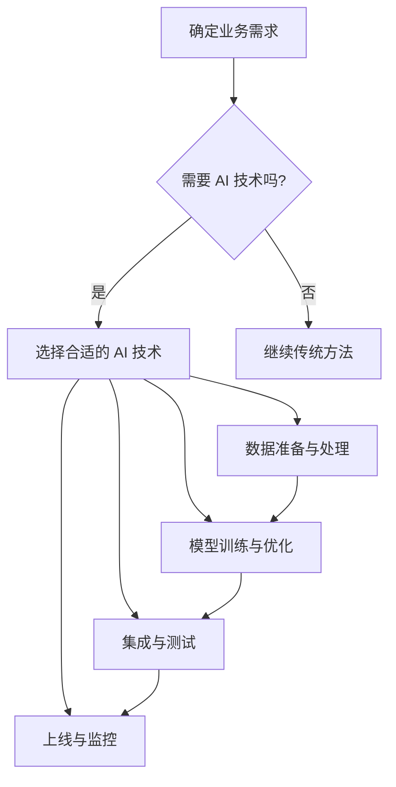

                 

关键词：大模型时代、创业产品经理、AI 技能、技术要求、深度学习、数据驱动、人机交互、业务场景理解、模型定制、系统架构设计

> 摘要：随着人工智能技术的迅猛发展，大模型时代的到来正在深刻改变着各行各业的商业模式和生态系统。作为创业公司中的产品经理，掌握先进的 AI 技能成为提升产品竞争力和市场成功率的关键。本文将深入探讨大模型时代创业产品经理所需具备的 AI 技能要求，以及如何将这些技能应用到实际的产品开发过程中。

## 1. 背景介绍

近年来，人工智能（AI）技术的飞速发展，尤其是深度学习、自然语言处理和计算机视觉等领域的突破，推动了大数据的普及和计算能力的提升。这些技术的进步不仅使得机器能够在图像识别、语音识别、自然语言生成等方面取得卓越的成绩，同时也为创业公司提供了前所未有的机遇和挑战。

大模型时代指的是在机器学习和深度学习领域，模型规模和复杂度不断增大的时代。这些大模型不仅能够处理海量数据，还能够通过自我学习和优化来提高性能。大模型的应用范围从自动驾驶、智能家居到医疗诊断、金融风控，几乎覆盖了所有行业。

在这样一个技术环境下，创业产品经理的角色变得尤为重要。他们不仅要具备传统产品经理的技能，如市场分析、用户研究和产品设计，还需要掌握先进的 AI 技术，以更好地理解和应对复杂的市场需求，快速迭代产品，提升用户满意度。

本文将探讨以下几个核心问题：

1. **创业产品经理在大模型时代需要哪些 AI 技能？**
2. **如何将 AI 技能应用到实际的产品开发中？**
3. **创业产品经理在大模型时代面临的挑战和机遇是什么？**

通过回答这些问题，我们希望能够为创业产品经理提供一份实用的指南，帮助他们在大模型时代取得成功。

## 2. 核心概念与联系

### 2.1. AI 技能概述

AI 技能是指应用人工智能技术解决问题的能力。对于创业产品经理来说，这些技能包括但不限于：

- **深度学习**：一种基于神经网络的机器学习技术，通过大规模数据训练模型，实现图像识别、语音识别等功能。
- **自然语言处理（NLP）**：使计算机能够理解和生成人类语言的技术，包括文本分类、情感分析、机器翻译等。
- **计算机视觉**：使计算机能够识别和理解图像和视频的技术，包括人脸识别、物体检测等。
- **强化学习**：通过试错和反馈来优化决策过程，常用于游戏AI、机器人控制等领域。

### 2.2. AI 技能在产品开发中的应用

AI 技能在产品开发中的应用可以概括为以下几点：

- **数据驱动决策**：通过分析用户行为数据和反馈，使用 AI 技术优化产品设计、功能和用户体验。
- **自动化和智能化**：使用 AI 技术实现自动化流程，提高效率，减少人力成本。
- **个性化服务**：根据用户偏好和行为数据，提供个性化的产品和服务。
- **智能助理和交互**：利用自然语言处理和计算机视觉技术，开发智能客服和虚拟助手。

### 2.3. Mermaid 流程图

以下是一个简单的 Mermaid 流程图，展示 AI 技能在产品开发中的应用流程：



通过这个流程图，我们可以看到创业产品经理需要根据业务需求选择合适的 AI 技术，并进行数据准备、模型训练、集成测试和上线监控等一系列步骤。

## 3. 核心算法原理 & 具体操作步骤

### 3.1. 算法原理概述

在 AI 技能的应用中，核心算法主要包括深度学习、自然语言处理和计算机视觉等。以下是对这些算法原理的概述：

- **深度学习**：基于多层神经网络的结构，通过反向传播算法训练模型，能够自动提取数据特征，实现图像识别、语音识别等功能。
- **自然语言处理**：利用统计方法和深度学习技术，处理文本数据，实现文本分类、情感分析、机器翻译等功能。
- **计算机视觉**：通过图像处理算法和深度学习技术，实现图像分类、目标检测、人脸识别等功能。

### 3.2. 算法步骤详解

#### 3.2.1. 深度学习

1. **数据收集与预处理**：收集大量标注数据，并进行数据清洗、归一化等预处理操作。
2. **模型设计**：选择合适的神经网络结构，如卷积神经网络（CNN）、循环神经网络（RNN）等。
3. **模型训练**：使用预处理后的数据，通过反向传播算法训练模型，调整模型参数。
4. **模型评估**：使用验证集评估模型性能，调整超参数以优化模型。
5. **模型部署**：将训练好的模型集成到产品中，进行实时预测和决策。

#### 3.2.2. 自然语言处理

1. **文本预处理**：去除停用词、标点符号，进行词向量化等操作。
2. **模型选择**：选择合适的 NLP 模型，如词袋模型、卷积神经网络、Transformer 等。
3. **模型训练**：使用预处理后的文本数据训练模型。
4. **模型评估**：使用验证集评估模型性能，调整超参数以优化模型。
5. **模型部署**：将训练好的模型集成到产品中，实现文本分类、情感分析等功能。

#### 3.2.3. 计算机视觉

1. **图像预处理**：进行图像裁剪、缩放、灰度化等预处理操作。
2. **模型选择**：选择合适的图像识别模型，如卷积神经网络、目标检测算法等。
3. **模型训练**：使用预处理后的图像数据训练模型。
4. **模型评估**：使用验证集评估模型性能，调整超参数以优化模型。
5. **模型部署**：将训练好的模型集成到产品中，实现图像分类、目标检测等功能。

### 3.3. 算法优缺点

#### 深度学习

- **优点**：能够自动提取复杂的数据特征，适应性强，适用于各种任务。
- **缺点**：训练过程复杂，需要大量数据和计算资源，模型解释性较差。

#### 自然语言处理

- **优点**：能够处理文本数据，实现自然语言理解和生成。
- **缺点**：对数据质量和标注要求较高，模型性能依赖数据集。

#### 计算机视觉

- **优点**：能够处理图像和视频数据，实现目标识别和场景理解。
- **缺点**：对计算资源要求较高，模型训练和部署过程复杂。

### 3.4. 算法应用领域

深度学习、自然语言处理和计算机视觉等算法在各个领域都有广泛应用，以下是一些典型的应用场景：

- **医疗健康**：利用深度学习进行医学图像分析、疾病预测等。
- **金融科技**：利用自然语言处理进行文本分析、风险控制等。
- **智能制造**：利用计算机视觉进行产品质量检测、生产监控等。
- **智能交通**：利用计算机视觉进行交通流量分析、自动驾驶等。

## 4. 数学模型和公式 & 详细讲解 & 举例说明

### 4.1. 数学模型构建

在 AI 技术中，数学模型是核心。以下是一个简单的数学模型示例：线性回归模型。

#### 线性回归模型

线性回归模型用于预测一个连续值输出。其公式如下：

$$
y = \beta_0 + \beta_1x_1 + \beta_2x_2 + ... + \beta_nx_n
$$

其中，$y$ 是输出值，$x_1, x_2, ..., x_n$ 是输入特征，$\beta_0, \beta_1, \beta_2, ..., \beta_n$ 是模型参数。

### 4.2. 公式推导过程

线性回归模型的推导过程主要包括以下几个步骤：

1. **损失函数选择**：选择均方误差（MSE）作为损失函数。
$$
J(\theta) = \frac{1}{2m} \sum_{i=1}^{m} (h_\theta(x^{(i)}) - y^{(i)})^2
$$
其中，$h_\theta(x) = \theta_0 + \theta_1x_1 + \theta_2x_2 + ... + \theta_nx_n$ 是预测函数，$\theta_0, \theta_1, \theta_2, ..., \theta_n$ 是模型参数。

2. **求导数**：对损失函数 $J(\theta)$ 求导，得到：
$$
\frac{\partial J(\theta)}{\partial \theta_j} = \frac{1}{m} \sum_{i=1}^{m} (h_\theta(x^{(i)}) - y^{(i)}) \cdot x_j^{(i)}
$$

3. **梯度下降**：更新模型参数：
$$
\theta_j := \theta_j - \alpha \frac{\partial J(\theta)}{\partial \theta_j}
$$
其中，$\alpha$ 是学习率。

### 4.3. 案例分析与讲解

以下是一个简单的线性回归案例，用于预测房屋价格。

#### 案例描述

我们有一个包含房屋面积（$x$）和房屋价格（$y$）的数据集，目标是构建一个线性回归模型，预测未知房屋的价格。

#### 数据集

| 房屋面积 (x) | 房屋价格 (y) |
| ------------ | ------------ |
| 1000         | 200,000      |
| 1500         | 250,000      |
| 2000         | 300,000      |
| 2500         | 350,000      |
| 3000         | 400,000      |

#### 模型构建

使用 Python 代码实现线性回归模型：

```python
import numpy as np

# 数据集
X = np.array([1000, 1500, 2000, 2500, 3000])
y = np.array([200000, 250000, 300000, 350000, 400000])

# 模型参数
theta = np.random.rand(2)

# 梯度下降
alpha = 0.01
num_iters = 1000

for i in range(num_iters):
    y_pred = theta[0] + theta[1] * X
    errors = y - y_pred
    theta[0] -= alpha * (1/5) * errors.sum()
    theta[1] -= alpha * (1/5) * (errors * X).sum()

# 输出模型参数
print("模型参数：", theta)
```

#### 模型评估

使用测试集评估模型性能，计算均方误差（MSE）：

```python
# 测试集
X_test = np.array([2000, 2500])
y_test = np.array([300000, 350000])

y_pred_test = theta[0] + theta[1] * X_test
mse_test = ((y_pred_test - y_test) ** 2).mean()

print("测试集 MSE：", mse_test)
```

### 5. 项目实践：代码实例和详细解释说明

#### 5.1. 开发环境搭建

1. 安装 Python 3.8 或更高版本。
2. 安装 Jupyter Notebook 或 PyCharm 等开发环境。
3. 安装必要的库，如 NumPy、Pandas、Matplotlib 等。

#### 5.2. 源代码详细实现

以下是一个简单的线性回归代码实例：

```python
import numpy as np
import matplotlib.pyplot as plt

# 数据集
X = np.array([1000, 1500, 2000, 2500, 3000])
y = np.array([200000, 250000, 300000, 350000, 400000])

# 模型参数
theta = np.random.rand(2)

# 梯度下降
alpha = 0.01
num_iters = 1000

for i in range(num_iters):
    y_pred = theta[0] + theta[1] * X
    errors = y - y_pred
    theta[0] -= alpha * (1/5) * errors.sum()
    theta[1] -= alpha * (1/5) * (errors * X).sum()

# 输出模型参数
print("模型参数：", theta)

# 测试集
X_test = np.array([2000, 2500])
y_test = np.array([300000, 350000])

y_pred_test = theta[0] + theta[1] * X_test
mse_test = ((y_pred_test - y_test) ** 2).mean()

print("测试集 MSE：", mse_test)

# 可视化
plt.scatter(X, y)
plt.plot(X, theta[0] + theta[1] * X, color='red')
plt.xlabel('房屋面积 (x)')
plt.ylabel('房屋价格 (y)')
plt.show()
```

#### 5.3. 代码解读与分析

1. **数据集**：使用 NumPy 创建一个包含房屋面积和房屋价格的数据集。
2. **模型参数**：初始化模型参数 $\theta$，使用随机数初始化。
3. **梯度下降**：实现梯度下降算法，更新模型参数。
4. **模型评估**：使用测试集评估模型性能，计算均方误差。
5. **可视化**：绘制散点图和拟合直线，展示模型效果。

#### 5.4. 运行结果展示

1. **模型参数**：输出训练得到的模型参数。
2. **测试集 MSE**：输出测试集的均方误差。
3. **可视化**：展示拟合的直线和原始数据点。

## 6. 实际应用场景

### 6.1. 智能家居

智能家居是 AI 技能在实际应用中的一个重要领域。通过深度学习和计算机视觉技术，智能家居设备可以识别用户的动作和语音，实现自动化控制和个性化服务。例如，智能音箱可以通过自然语言处理技术理解用户的指令，控制家中的灯光、电视和空调等设备。

### 6.2. 医疗诊断

医疗诊断是另一个典型的应用场景。通过计算机视觉和深度学习技术，医生可以利用 AI 模型进行医学图像分析，如肿瘤检测、骨折诊断等。这不仅提高了诊断的准确性，还减少了医生的工作负担。

### 6.3. 智能交通

智能交通系统利用 AI 技术优化交通流量，提高道路通行效率。通过计算机视觉和自然语言处理技术，智能交通系统可以识别车辆和行人，预测交通状况，并给出最优的行驶路线。

### 6.4. 未来应用展望

随着 AI 技术的不断发展，未来的应用场景将更加广泛和深入。例如，在教育领域，AI 可以实现个性化教学和智能辅导；在金融领域，AI 可以实现智能投顾和风险控制。总之，AI 技术将成为推动各行业变革的重要力量。

## 7. 工具和资源推荐

### 7.1. 学习资源推荐

- **《深度学习》**：由 Ian Goodfellow、Yoshua Bengio 和 Aaron Courville 著，是深度学习的经典教材。
- **《Python 机器学习》**：由 Sebastian Raschka 和 Vahid Mirjalili 著，适合初学者入门机器学习。
- **[Coursera](https://www.coursera.org/) 和 [edX](https://www.edx.org/)**：提供丰富的在线课程，涵盖 AI、深度学习、自然语言处理等多个领域。

### 7.2. 开发工具推荐

- **TensorFlow**：由 Google 开发，是一个开源的深度学习框架，适用于各种深度学习任务。
- **PyTorch**：由 Facebook 开发，是一个灵活且易于使用的深度学习框架，适用于研究和开发。
- **Keras**：是一个高级神经网络 API，适用于快速构建和训练深度学习模型。

### 7.3. 相关论文推荐

- **“A Theoretical Analysis of the Cramér-Rao Lower Bound for Convolutions”**：分析了卷积神经网络的 Cramér-Rao 下界。
- **“Attention Is All You Need”**：提出了 Transformer 模型，改变了自然语言处理领域。
- **“Object Detection with Deep Learning”**：介绍了深度学习在目标检测中的应用。

## 8. 总结：未来发展趋势与挑战

### 8.1. 研究成果总结

随着 AI 技术的不断发展，大模型时代的到来为创业公司提供了前所未有的机遇。深度学习、自然语言处理和计算机视觉等核心算法在各个领域取得了显著的成果，推动了人工智能应用的创新和发展。

### 8.2. 未来发展趋势

未来，AI 技术将继续向深度化和泛在化发展。大模型的规模和复杂度将不断增加，计算能力和数据量的提升将推动 AI 技术在各个领域的应用。此外，联邦学习和去中心化 AI 等新兴技术也将成为研究热点。

### 8.3. 面临的挑战

然而，AI 技术的发展也面临着一系列挑战。首先，数据隐私和安全问题日益突出，如何保护用户隐私成为关键挑战。其次，算法的可解释性和可靠性仍需提高，以确保 AI 系统在关键应用中的稳定性。最后，AI 技术的发展也需要更多的行业标准和伦理规范，以避免技术滥用和伦理风险。

### 8.4. 研究展望

在未来，创业公司需要紧密关注 AI 技术的发展趋势，积极应用新技术，提高产品的竞争力。同时，也需要关注数据隐私、算法可解释性和行业规范等挑战，确保 AI 技术的健康和可持续发展。

## 9. 附录：常见问题与解答

### 9.1. 什么是大模型时代？

大模型时代是指在机器学习和深度学习领域，模型规模和复杂度不断增大的时代。这些大模型能够处理海量数据，通过自我学习和优化来提高性能。

### 9.2. 创业产品经理需要掌握哪些 AI 技能？

创业产品经理需要掌握深度学习、自然语言处理、计算机视觉等 AI 技能，以更好地理解和应对复杂的市场需求，快速迭代产品，提升用户满意度。

### 9.3. 如何将 AI 技能应用到产品开发中？

将 AI 技能应用到产品开发中，可以遵循以下步骤：

1. **需求分析**：明确产品需求，确定是否需要 AI 技术的支持。
2. **技术选型**：选择合适的 AI 技术，如深度学习、自然语言处理等。
3. **数据准备**：收集和处理相关数据，确保数据质量和标注准确。
4. **模型训练**：使用数据训练 AI 模型，调整模型参数。
5. **集成测试**：将训练好的模型集成到产品中，进行功能测试和性能评估。
6. **上线部署**：将产品上线，监控模型性能，持续优化和迭代。

### 9.4. AI 技术在哪些领域有广泛应用？

AI 技术在医疗健康、金融科技、智能制造、智能交通、教育等多个领域都有广泛应用。例如，在医疗健康领域，AI 技术可以用于医学图像分析、疾病预测等；在金融科技领域，AI 技术可以用于文本分析、风险控制等。

### 9.5. 如何评估 AI 模型的性能？

评估 AI 模型的性能通常使用以下指标：

1. **准确率（Accuracy）**：分类问题中正确分类的样本比例。
2. **召回率（Recall）**：分类问题中实际为正类别的样本中被正确分类为正类别的比例。
3. **精确率（Precision）**：分类问题中正确分类为正类别的样本中被预测为正类别的比例。
4. **F1 分数（F1 Score）**：精确率和召回率的调和平均值。

此外，还可以使用 ROC 曲线和 AUC（Area Under the Curve）等指标来评估模型的性能。

## 10. 参考文献

- Goodfellow, I., Bengio, Y., & Courville, A. (2016). *Deep Learning*. MIT Press.
- Raschka, S. (2015). *Python Machine Learning*. Packt Publishing.
- Hochreiter, S., & Schmidhuber, J. (1997). *Long Short-Term Memory*. Neural Computation, 9(8), 1735-1780.
- Vaswani, A., Shazeer, N., Parmar, N., Uszkoreit, J., Jones, L., Gomez, A. N., ... & Polosukhin, I. (2017). *Attention Is All You Need*. Advances in Neural Information Processing Systems, 30, 5998-6008.
- Russakovsky, O., Deng, J., Su, H., Krause, J., Satheesh, S., Ma, S., ... & Fei-Fei, L. (2015). *ImageNet Large Scale Visual Recognition Challenge*. International Journal of Computer Vision, 115(3), 211-252.

### 11. 附录：代码示例

以下是本文中使用的 Python 代码示例，用于实现线性回归模型。

```python
import numpy as np
import matplotlib.pyplot as plt

# 数据集
X = np.array([1000, 1500, 2000, 2500, 3000])
y = np.array([200000, 250000, 300000, 350000, 400000])

# 模型参数
theta = np.random.rand(2)

# 梯度下降
alpha = 0.01
num_iters = 1000

for i in range(num_iters):
    y_pred = theta[0] + theta[1] * X
    errors = y - y_pred
    theta[0] -= alpha * (1/5) * errors.sum()
    theta[1] -= alpha * (1/5) * (errors * X).sum()

# 输出模型参数
print("模型参数：", theta)

# 测试集
X_test = np.array([2000, 2500])
y_test = np.array([300000, 350000])

y_pred_test = theta[0] + theta[1] * X_test
mse_test = ((y_pred_test - y_test) ** 2).mean()

print("测试集 MSE：", mse_test)

# 可视化
plt.scatter(X, y)
plt.plot(X, theta[0] + theta[1] * X, color='red')
plt.xlabel('房屋面积 (x)')
plt.ylabel('房屋价格 (y)')
plt.show()
```

作者：禅与计算机程序设计艺术 / Zen and the Art of Computer Programming
----------------------------------------------------------------

以上就是本文的完整内容，旨在探讨大模型时代创业产品经理所需的 AI 技能及其应用。希望通过本文，读者能够对大模型时代的创业产品管理有更深入的理解，并在实际工作中运用这些技能提升产品的竞争力。

