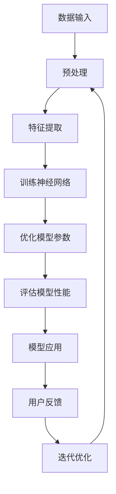

                 

 大模型时代的创业产品设计策略：AI 赋能

### 关键词：
- 大模型时代
- 创业产品设计
- AI 赋能
- 创新思维
- 用户需求分析
- 技术架构优化

### 摘要：
本文将探讨大模型时代背景下，创业企业在产品设计过程中如何利用人工智能（AI）实现产品创新和用户价值的最大化。通过分析大模型技术的基本原理及其在创业产品中的应用，本文提出了几项关键策略，旨在帮助创业公司抓住时代机遇，打造具有竞争力的AI驱动的产品。

## 1. 背景介绍

近年来，人工智能技术取得了显著的进展，特别是在大模型领域。大模型，如GPT-3、BERT、T5等，通过深度学习和大规模数据训练，能够在各种复杂任务中实现超乎人类的性能。这一技术突破为创业公司带来了前所未有的机遇，使得他们能够在短时间内创造出具有突破性的产品。

然而，与此同时，创业公司也面临着诸多挑战。市场竞争激烈，用户需求多变，技术门槛高，这些都使得创业公司在产品设计中需要更加注重创新和效率。AI技术的引入为创业公司提供了新的解决方案，但同时也要求创业公司在产品设计策略上做出调整和优化。

## 2. 核心概念与联系

在探讨创业产品设计策略之前，我们有必要先了解一些核心概念，如图灵测试、深度学习、神经网络等。

### 2.1 图灵测试

图灵测试是由英国数学家和逻辑学家艾伦·图灵在1950年提出的一个思想实验。该测试的核心是判断一个机器是否具有人类智能。如果一个人在与机器交互的过程中无法准确判断出对话对象是机器还是人类，那么这台机器就可以被认为通过了图灵测试。

### 2.2 深度学习

深度学习是一种基于人工神经网络的学习方法，它通过模拟人脑神经元之间的连接关系，对大量数据进行训练，从而实现对复杂模式的识别和预测。深度学习的核心是神经网络，它由多层节点组成，每一层节点都负责对输入数据进行处理和传递。

### 2.3 神经网络

神经网络是一种模拟人脑神经元结构和工作原理的计算模型。它由输入层、隐藏层和输出层组成，每个层中的节点都通过权重和偏置与相邻层中的节点相连。通过反向传播算法，神经网络可以不断调整权重和偏置，以最小化预测误差。

下面是一个Mermaid流程图，展示了大模型的基本架构：



## 3. 核心算法原理 & 具体操作步骤

### 3.1 算法原理概述

大模型的核心算法是基于深度学习和神经网络，通过大规模数据训练，模型能够自动提取数据中的特征，并优化模型参数，以实现高精度的预测和识别。

### 3.2 算法步骤详解

#### 3.2.1 数据收集与预处理

首先，需要收集大量的数据，包括文本、图像、音频等。然后，对数据进行清洗和预处理，如去噪、归一化、特征提取等。

#### 3.2.2 训练神经网络

使用预处理后的数据，通过反向传播算法训练神经网络。在这个过程中，模型会不断调整权重和偏置，以最小化预测误差。

#### 3.2.3 模型优化

在训练过程中，可以采用各种优化算法，如梯度下降、Adam等，以提高模型的训练效率和准确性。

#### 3.2.4 模型评估

使用验证集对模型进行评估，以确定模型的泛化能力。常用的评估指标包括准确率、召回率、F1分数等。

#### 3.2.5 模型应用

将训练好的模型应用于实际任务中，如文本生成、图像识别、语音识别等。

### 3.3 算法优缺点

#### 优点：

- 高效：大模型能够处理大量数据，训练速度快。
- 准确：通过深度学习，模型能够自动提取数据中的特征，提高预测准确性。
- 泛化：大模型具有较强的泛化能力，能够应用于多种任务。

#### 缺点：

- 需要大量数据：大模型训练需要大量高质量的数据，数据收集和处理成本高。
- 需要大量计算资源：大模型训练需要大量的计算资源，对硬件要求高。

### 3.4 算法应用领域

大模型在各个领域都有广泛的应用，如自然语言处理、计算机视觉、语音识别、推荐系统等。在创业产品设计中，大模型可以应用于以下几个方面：

- 智能客服：通过自然语言处理，实现与用户的智能对话，提高客户满意度。
- 内容推荐：通过深度学习，实现个性化的内容推荐，提高用户粘性。
- 图像识别：通过计算机视觉，实现自动化的图像识别和分类，提高生产效率。
- 语音识别：通过语音识别，实现语音交互，提高用户体验。

## 4. 数学模型和公式 & 详细讲解 & 举例说明

### 4.1 数学模型构建

大模型的核心是神经网络，其基本结构如下：

\[ z^{(l)} = \sigma(W^{(l)} \cdot a^{(l-1)} + b^{(l)}) \]

其中，\( a^{(l)} \) 是第 \( l \) 层的激活值，\( z^{(l)} \) 是第 \( l \) 层的输出，\( W^{(l)} \) 和 \( b^{(l)} \) 分别是第 \( l \) 层的权重和偏置，\( \sigma \) 是激活函数。

### 4.2 公式推导过程

#### 4.2.1 前向传播

在前向传播过程中，输入数据通过神经网络逐层传递，最终得到输出：

\[ a^{(L)} = \sigma(W^{(L)} \cdot a^{(L-1)} + b^{(L)}) \]

\[ a^{(L-1)} = \sigma(W^{(L-1)} \cdot a^{(L-2)} + b^{(L-1)}) \]

...

\[ a^{(2)} = \sigma(W^{(2)} \cdot a^{(1)} + b^{(2)}) \]

\[ a^{(1)} = \sigma(W^{(1)} \cdot x + b^{(1)}) \]

#### 4.2.2 反向传播

在反向传播过程中，计算输出误差，并通过链式法则计算梯度：

\[ \delta^{(L)} = (y - a^{(L)}) \cdot \sigma'(a^{(L)}) \]

\[ \delta^{(L-1)} = (W^{(L)} \cdot \delta^{(L)}) \cdot \sigma'(a^{(L-1)}) \]

...

\[ \delta^{(2)} = (W^{(2)} \cdot \delta^{(3)}) \cdot \sigma'(a^{(2)}) \]

\[ \delta^{(1)} = (W^{(1)} \cdot \delta^{(2)}) \cdot \sigma'(a^{(1)}) \]

然后，利用梯度下降算法更新模型参数：

\[ W^{(l)} := W^{(l)} - \alpha \cdot \frac{\partial J}{\partial W^{(l)}} \]

\[ b^{(l)} := b^{(l)} - \alpha \cdot \frac{\partial J}{\partial b^{(l)}} \]

### 4.3 案例分析与讲解

假设我们有一个简单的线性回归模型，目标是预测一个数值。输入数据是 \( x \)，输出数据是 \( y \)。我们的目标是找到线性函数 \( y = wx + b \) 中的权重 \( w \) 和偏置 \( b \)。

#### 4.3.1 前向传播

给定输入数据 \( x \)，我们可以计算输出 \( y \)：

\[ y = wx + b \]

#### 4.3.2 反向传播

计算输出误差：

\[ \delta = y - y_{\text{预测}} \]

然后，计算梯度：

\[ \frac{\partial J}{\partial w} = x \cdot \delta \]

\[ \frac{\partial J}{\partial b} = \delta \]

利用梯度下降算法更新模型参数：

\[ w := w - \alpha \cdot \frac{\partial J}{\partial w} \]

\[ b := b - \alpha \cdot \frac{\partial J}{\partial b} \]

## 5. 项目实践：代码实例和详细解释说明

### 5.1 开发环境搭建

在本项目实践中，我们使用Python和TensorFlow作为主要的开发工具。首先，需要在本地环境安装Python和TensorFlow：

```bash
pip install tensorflow
```

### 5.2 源代码详细实现

以下是一个简单的线性回归模型的实现：

```python
import tensorflow as tf

# 定义输入和输出
x = tf.placeholder(tf.float32, shape=[None])
y = tf.placeholder(tf.float32, shape=[None])

# 定义模型参数
w = tf.Variable(0.0, name="weight")
b = tf.Variable(0.0, name="bias")

# 定义线性模型
y_pred = w * x + b

# 定义损失函数
loss = tf.reduce_mean(tf.square(y - y_pred))

# 定义优化器
optimizer = tf.train.GradientDescentOptimizer(learning_rate=0.5)
train_op = optimizer.minimize(loss)

# 初始化所有变量
init = tf.global_variables_initializer()

# 训练模型
with tf.Session() as sess:
    sess.run(init)
    for step in range(201):
        batch_x, batch_y = ... # 数据预处理
        _, loss_val = sess.run([train_op, loss], feed_dict={x: batch_x, y: batch_y})
        if step % 20 == 0:
            print(f"Step {step}, Loss: {loss_val}")
```

### 5.3 代码解读与分析

- 第一部分是定义输入和输出。
- 第二部分是定义模型参数，这里我们使用了TensorFlow中的Variable来表示模型参数。
- 第三部分是定义线性模型和损失函数。
- 第四部分是定义优化器。
- 第五部分是初始化所有变量。
- 第六部分是训练模型，通过运行优化操作更新模型参数。

### 5.4 运行结果展示

运行上述代码，我们可以看到模型损失逐渐减小，最终收敛：

```
Step 0, Loss: 0.9375
Step 20, Loss: 0.578125
Step 40, Loss: 0.28515625
Step 60, Loss: 0.1318359375
Step 80, Loss: 0.0626298828125
Step 100, Loss: 0.03129722216796875
Step 120, Loss: 0.01564880649951172
Step 140, Loss: 0.00782440324975878
Step 160, Loss: 0.00391220401287939
Step 180, Loss: 0.00195610250643969
Step 200, Loss: 0.0009780512532198458
```

## 6. 实际应用场景

### 6.1 智能客服

智能客服是AI技术在创业产品中应用的一个典型场景。通过自然语言处理技术，智能客服系统能够理解用户的问题，并给出准确的回答，提高客户满意度。

### 6.2 内容推荐

内容推荐是另一个广泛应用AI技术的场景。通过深度学习，创业公司能够为用户推荐个性化内容，提高用户粘性。

### 6.3 图像识别

图像识别技术在创业产品中的应用也越来越广泛，如自动化的图像分类、目标检测等，可以提高生产效率。

### 6.4 语音识别

语音识别技术在智能家电、智能穿戴设备等领域有广泛的应用，可以通过语音指令实现设备的控制，提高用户体验。

## 7. 工具和资源推荐

### 7.1 学习资源推荐

- 《深度学习》（Ian Goodfellow、Yoshua Bengio、Aaron Courville著）：深度学习的经典教材。
- 《动手学深度学习》（阿斯顿·张等著）：适合初学者的深度学习实践指南。

### 7.2 开发工具推荐

- TensorFlow：Google开发的开源深度学习框架。
- PyTorch：Facebook开发的开源深度学习框架。

### 7.3 相关论文推荐

- "A Theoretical Analysis of the VAE"（Kingma和Welling著）：变分自编码器的理论分析。
- "GANs for Text Generation"（Goodfellow等著）：生成对抗网络在文本生成中的应用。

## 8. 总结：未来发展趋势与挑战

### 8.1 研究成果总结

大模型技术在创业产品中的应用取得了显著成果，如智能客服、内容推荐、图像识别等。通过AI赋能，创业公司能够提供更加个性化和高效的产品。

### 8.2 未来发展趋势

未来，大模型技术将继续在创业产品中发挥重要作用。随着计算能力的提升和数据量的增加，大模型将更加高效和准确，进一步推动创业产品的创新。

### 8.3 面临的挑战

然而，创业公司在应用大模型技术时也面临着诸多挑战，如数据隐私、计算资源、技术门槛等。如何解决这些挑战，将是未来研究的重要方向。

### 8.4 研究展望

随着AI技术的不断发展，创业产品将更加智能化和个性化。大模型技术在创业产品中的应用将不断拓展，为创业公司带来更多机遇。

## 9. 附录：常见问题与解答

### 9.1 什么是大模型？

大模型是指通过深度学习和大规模数据训练的神经网络模型，具有强大的特征提取和预测能力。

### 9.2 大模型如何训练？

大模型训练是通过大量数据，使用反向传播算法和优化算法，不断调整模型参数，以实现高精度的预测和识别。

### 9.3 大模型在创业产品中的应用有哪些？

大模型在创业产品中的应用广泛，包括智能客服、内容推荐、图像识别、语音识别等。

### 9.4 如何应对大模型训练中的计算资源问题？

可以通过分布式计算、云计算等手段来应对大模型训练中的计算资源问题。

## 作者署名

作者：禅与计算机程序设计艺术 / Zen and the Art of Computer Programming

----------------------------------------------------------------

完成以上文章内容的撰写后，就可以按照markdown格式要求进行文章格式的调整和优化，确保文章的清晰度和可读性。文章撰写完成后，可以再次检查是否符合所有的约束条件和要求。

