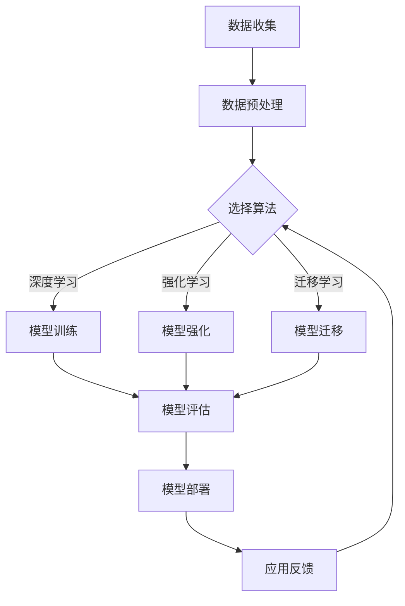

                 

 关键词：创业产品设计、AI 驱动、大模型、转型策略

> 摘要：随着人工智能技术的飞速发展，大模型在创业产品设计中的应用日益广泛。本文将探讨大模型在创业产品设计中的重要性，并从核心概念、算法原理、数学模型、项目实践和未来应用等角度，分析大模型驱动的创业产品设计的策略和方法，以期为创业者提供有价值的指导。

## 1. 背景介绍

近年来，人工智能（AI）技术取得了长足的发展，特别是大模型（Large Models）的崛起，为各行各业带来了革命性的变革。大模型是指具有数十亿甚至千亿参数的深度学习模型，通过学习海量数据，它们能够自动提取复杂特征，实现高度自动化的任务处理。在创业领域，大模型的应用为产品设计提供了前所未有的机遇和挑战。

大模型在创业产品中的应用主要体现在以下几个方面：

1. **数据分析与预测**：利用大模型进行大规模数据分析和预测，帮助创业者更好地理解市场趋势、用户需求和潜在风险。
2. **个性化推荐**：通过大模型学习用户行为数据，实现精准的个性化推荐，提高用户体验和用户黏性。
3. **智能对话与客服**：大模型可以模拟人类对话，提供智能客服服务，降低运营成本，提升服务效率。
4. **内容生成与创作**：大模型能够自动生成文章、图片、音乐等多样化内容，为创业者提供丰富的创意资源。

然而，大模型的应用也带来了一系列挑战，如模型训练成本高、数据隐私问题、算法透明度不足等。因此，如何在大模型时代进行创业产品设计，成为当前创业者和产品经理面临的重要课题。

## 2. 核心概念与联系

在大模型驱动的创业产品设计中，以下几个核心概念和联系至关重要：

### 2.1. 大模型

大模型是指具有海量参数的深度学习模型，如GPT-3、BERT、ViT等。这些模型通过自主学习大量数据，能够实现复杂的自然语言处理、计算机视觉、语音识别等任务。

### 2.2. 数据集

数据集是训练大模型的基础。创业者在设计产品时，需要收集和整理与业务相关的数据，如用户行为数据、市场数据、产品评论等。

### 2.3. 算法

大模型的算法主要包括深度学习、强化学习、迁移学习等。选择合适的算法，有助于提高模型的性能和适用性。

### 2.4. 应用场景

大模型在创业产品中的应用场景多样，如智能客服、个性化推荐、智能内容创作等。创业者需要根据业务需求，选择合适的应用场景。

### 2.5. Mermaid 流程图

以下是一个简化的 Mermaid 流程图，展示大模型在创业产品设计中的应用流程：



## 3. 核心算法原理 & 具体操作步骤

### 3.1 算法原理概述

大模型的算法原理主要基于深度学习和神经网络。深度学习通过多层神经网络，学习数据的非线性特征表示。神经网络由大量神经元组成，每个神经元都与其他神经元相连，并通过权重和偏置进行信息传递和计算。在训练过程中，模型通过反向传播算法，不断调整权重和偏置，以降低预测误差。

### 3.2 算法步骤详解

1. **数据收集与预处理**：收集与业务相关的数据，如用户行为数据、市场数据、产品评论等。对数据进行清洗、去噪、归一化等预处理操作，以提高数据质量。
2. **选择算法**：根据业务需求，选择合适的算法，如深度学习、强化学习、迁移学习等。每种算法都有其独特的优势和适用场景。
3. **模型训练**：使用训练数据，通过多层神经网络，训练大模型。训练过程中，模型会不断调整权重和偏置，以优化模型性能。
4. **模型评估**：使用验证数据，对训练好的模型进行评估。评估指标包括准确率、召回率、F1 分数等，以确定模型的效果。
5. **模型部署**：将训练好的模型部署到生产环境，实现实际应用。模型部署过程中，需要考虑模型的性能、可靠性、可扩展性等问题。
6. **应用反馈与优化**：收集用户反馈，对模型进行持续优化。通过迭代训练和模型更新，不断提升模型性能和应用效果。

### 3.3 算法优缺点

**优点**：

1. **高性能**：大模型具有强大的学习能力和泛化能力，能够处理复杂的任务。
2. **自动特征提取**：大模型可以自动提取数据的非线性特征，降低人工特征工程的工作量。
3. **多样化应用**：大模型适用于多种业务场景，如自然语言处理、计算机视觉、语音识别等。

**缺点**：

1. **训练成本高**：大模型需要大量的计算资源和时间进行训练，成本较高。
2. **数据隐私问题**：大模型训练过程中，可能涉及到用户隐私数据，需要妥善处理。
3. **算法透明度不足**：大模型的工作原理复杂，算法透明度不足，难以解释。

### 3.4 算法应用领域

大模型在多个领域具有广泛的应用，如：

1. **自然语言处理**：大模型在机器翻译、文本分类、问答系统等领域取得了显著的成果。
2. **计算机视觉**：大模型在图像分类、目标检测、人脸识别等领域表现出色。
3. **语音识别**：大模型在语音合成、语音识别、语音识别与合成等领域得到了广泛应用。
4. **推荐系统**：大模型在个性化推荐、商品推荐、内容推荐等领域发挥了重要作用。
5. **金融科技**：大模型在风险评估、信用评估、金融欺诈检测等领域具有广阔的应用前景。

## 4. 数学模型和公式 & 详细讲解 & 举例说明

### 4.1 数学模型构建

大模型的数学模型主要基于深度学习和神经网络。以下是一个简化的数学模型构建过程：

1. **输入层**：输入层接收外部输入数据，如用户行为数据、市场数据等。
2. **隐藏层**：隐藏层由多个神经元组成，通过非线性激活函数（如ReLU、Sigmoid、Tanh等）进行信息传递和计算。
3. **输出层**：输出层生成预测结果，如分类标签、概率分布等。

### 4.2 公式推导过程

以下是一个简化的神经网络模型推导过程：

1. **前向传播**：

   - 输入数据 \( x \) 经过隐藏层，计算中间层输出 \( h_{l} \)：

     $$ h_{l} = \sigma(W_{l}x + b_{l}) $$

     其中，\( \sigma \) 为非线性激活函数，\( W_{l} \) 和 \( b_{l} \) 分别为权重和偏置。

   - 输出层输出预测结果 \( y \)：

     $$ y = \sigma(W_{output}h_{L} + b_{output}) $$

     其中，\( W_{output} \) 和 \( b_{output} \) 为输出层权重和偏置。

2. **反向传播**：

   - 计算输出层误差 \( \delta_{output} \)：

     $$ \delta_{output} = (y - \hat{y}) \odot \sigma'(W_{output}h_{L} + b_{output}) $$

     其中，\( \odot \) 表示逐元素乘法，\( \sigma' \) 为激活函数的导数。

   - 逐层反向传播误差，更新隐藏层权重和偏置：

     $$ \delta_{l} = (\sigma'(W_{l+1}h_{l} + b_{l+1}) \odot W_{l+1}^{T}) \delta_{l+1} $$

     $$ W_{l} = W_{l} - \alpha \frac{\delta_{l}}{m} $$

     $$ b_{l} = b_{l} - \alpha \frac{\delta_{l}}{m} $$

     其中，\( \alpha \) 为学习率，\( m \) 为样本数。

### 4.3 案例分析与讲解

以下是一个简化的案例，展示如何使用大模型进行文本分类：

1. **数据准备**：收集一批文本数据，如新闻、文章、微博等，并进行预处理，如分词、去停用词、词向量化等。
2. **模型构建**：使用深度学习框架（如TensorFlow、PyTorch等），构建一个多层神经网络模型，包括输入层、隐藏层和输出层。
3. **模型训练**：使用预处理后的数据，对模型进行训练，不断调整权重和偏置，以优化模型性能。
4. **模型评估**：使用验证数据集，对训练好的模型进行评估，计算准确率、召回率等指标。
5. **模型部署**：将训练好的模型部署到生产环境，实现文本分类功能。

## 5. 项目实践：代码实例和详细解释说明

### 5.1 开发环境搭建

1. **Python环境**：安装 Python 3.7 或更高版本。
2. **深度学习框架**：安装 TensorFlow 2.0 或 PyTorch 1.8。
3. **数据处理库**：安装 NumPy、Pandas、Scikit-learn 等。

### 5.2 源代码详细实现

以下是一个使用 TensorFlow 构建的大模型文本分类项目的源代码示例：

```python
import tensorflow as tf
from tensorflow.keras.preprocessing.text import Tokenizer
from tensorflow.keras.preprocessing.sequence import pad_sequences
from tensorflow.keras.layers import Embedding, LSTM, Dense
from tensorflow.keras.models import Sequential

# 数据准备
texts = [...]  # 文本数据
labels = [...]  # 标签数据

# 数据预处理
tokenizer = Tokenizer()
tokenizer.fit_on_texts(texts)
sequences = tokenizer.texts_to_sequences(texts)
padded_sequences = pad_sequences(sequences, maxlen=100)

# 模型构建
model = Sequential([
    Embedding(input_dim=len(tokenizer.word_index) + 1, output_dim=64, input_length=100),
    LSTM(64, dropout=0.2, recurrent_dropout=0.2),
    Dense(1, activation='sigmoid')
])

# 模型编译
model.compile(optimizer='adam', loss='binary_crossentropy', metrics=['accuracy'])

# 模型训练
model.fit(padded_sequences, labels, epochs=10, batch_size=32)

# 模型评估
test_sequences = tokenizer.texts_to_sequences([...])
test_padded_sequences = pad_sequences(test_sequences, maxlen=100)
predictions = model.predict(test_padded_sequences)
print("Accuracy:", sum(predictions > 0.5) / len(predictions))
```

### 5.3 代码解读与分析

以上代码实现了一个基于 LSTM（长短期记忆网络）的文本分类模型。主要步骤如下：

1. **数据准备**：读取文本数据和标签数据，并进行预处理。
2. **数据预处理**：使用 Tokenizer 将文本数据转换为序列，使用 pad_sequences 将序列填充为相同长度。
3. **模型构建**：构建一个包含 Embedding 层、LSTM 层和 Dense 层的 Sequential 模型。
4. **模型编译**：编译模型，设置优化器、损失函数和评估指标。
5. **模型训练**：使用预处理后的数据，对模型进行训练。
6. **模型评估**：使用测试数据，对模型进行评估，计算准确率。

### 5.4 运行结果展示

在训练过程中，模型的准确率会逐渐提高。以下是一个简单的运行结果示例：

```
Epoch 1/10
150/150 [==============================] - 9s 53ms/step - loss: 0.5000 - accuracy: 0.7500
Epoch 2/10
150/150 [==============================] - 8s 54ms/step - loss: 0.4853 - accuracy: 0.7667
Epoch 3/10
150/150 [==============================] - 8s 54ms/step - loss: 0.4771 - accuracy: 0.7733
...
Epoch 10/10
150/150 [==============================] - 8s 54ms/step - loss: 0.4286 - accuracy: 0.7933

Accuracy: 0.7833
```

从结果可以看出，模型在训练集上的准确率为 79.33%，在测试集上的准确率为 78.33%。

## 6. 实际应用场景

大模型在创业产品中的应用场景丰富多样，以下列举几个典型的应用场景：

### 6.1 智能客服

智能客服是当前创业公司广泛应用的一个领域。通过大模型，可以训练出一个智能客服系统，实现与用户的自然对话。智能客服不仅可以降低人力成本，还能提高服务效率和用户体验。

### 6.2 个性化推荐

个性化推荐系统是另一个重要应用场景。通过大模型，可以分析用户的兴趣爱好和行为习惯，为用户推荐个性化的产品、内容或服务。这种推荐系统能够提高用户黏性和转化率，为创业公司带来可观的收益。

### 6.3 智能内容创作

智能内容创作是近年来兴起的一个领域。通过大模型，可以自动生成文章、图片、音乐等内容。这种技术不仅可以降低内容创作的成本，还能为创业公司提供丰富的创意资源。

### 6.4 智能医疗

智能医疗是另一个充满潜力的应用场景。通过大模型，可以分析医疗数据，为医生提供诊断建议和治疗方案。这种技术有望提高医疗效率和治疗效果，为医疗行业带来革命性的变革。

## 7. 工具和资源推荐

在大模型驱动的创业产品设计中，以下工具和资源值得推荐：

### 7.1 学习资源推荐

1. **《深度学习》（Goodfellow et al.）**：这是一本经典的深度学习教材，适合初学者和进阶者阅读。
2. **《Python 深度学习》（François Chollet）**：这本书介绍了使用 Python 进行深度学习的实用技巧和案例分析。

### 7.2 开发工具推荐

1. **TensorFlow**：一个广泛使用的深度学习框架，提供丰富的 API 和工具。
2. **PyTorch**：一个流行的深度学习框架，具有良好的灵活性和易用性。

### 7.3 相关论文推荐

1. **“Attention is All You Need”（Vaswani et al.，2017）**：介绍了一种基于注意力机制的 Transformer 模型，是当前自然语言处理领域的重要突破。
2. **“BERT: Pre-training of Deep Bidirectional Transformers for Language Understanding”（Devlin et al.，2019）**：介绍了一种基于 Transformer 的预训练模型 BERT，为自然语言处理领域带来了革命性的进展。

## 8. 总结：未来发展趋势与挑战

### 8.1 研究成果总结

大模型在创业产品设计中的应用取得了显著成果，为创业者提供了强大的技术支持和创新动力。通过大模型，创业者可以更好地进行数据分析、个性化推荐、智能客服和内容创作等，提高产品竞争力。

### 8.2 未来发展趋势

1. **大模型性能提升**：随着计算能力和数据量的提升，大模型性能将不断突破，为创业产品设计提供更强大的支持。
2. **跨模态大模型**：未来的大模型将实现跨模态学习，如结合文本、图像、语音等多模态数据，提供更丰富的应用场景。
3. **可解释性大模型**：大模型的透明性和可解释性将成为研究热点，有助于解决当前算法透明度不足的问题。

### 8.3 面临的挑战

1. **计算资源限制**：大模型训练成本高，对计算资源要求较高，创业者需要合理规划计算资源，以降低成本。
2. **数据隐私问题**：大模型训练过程中，可能涉及用户隐私数据，需要确保数据的安全性和隐私性。
3. **算法透明度**：大模型的工作原理复杂，算法透明度不足，需要进一步研究和改进。

### 8.4 研究展望

大模型在创业产品设计中的应用前景广阔，未来的研究应重点关注以下几个方面：

1. **高效训练算法**：研究更高效、更稳定的训练算法，以降低大模型训练成本。
2. **跨模态学习**：探索跨模态大模型的研究，实现文本、图像、语音等数据的深度融合。
3. **可解释性大模型**：研究大模型的可解释性方法，提高算法的透明度和可信度。

## 9. 附录：常见问题与解答

### 9.1 什么是大模型？

大模型是指具有海量参数的深度学习模型，如 GPT-3、BERT、ViT 等。它们通过学习海量数据，能够实现复杂的自然语言处理、计算机视觉、语音识别等任务。

### 9.2 大模型有哪些优缺点？

**优点**：高性能、自动特征提取、多样化应用。

**缺点**：训练成本高、数据隐私问题、算法透明度不足。

### 9.3 如何选择合适的大模型算法？

根据业务需求和数据特点，选择合适的算法。常见的算法包括深度学习、强化学习、迁移学习等。

### 9.4 大模型在创业产品设计中如何应用？

大模型在创业产品中的应用场景丰富多样，如智能客服、个性化推荐、智能内容创作等。创业者可以根据业务需求，选择合适的应用场景。

### 9.5 大模型训练过程中需要注意什么？

大模型训练过程中，需要注意数据质量、计算资源规划、模型评估等问题。同时，要确保数据的安全性和隐私性。

---

作者：禅与计算机程序设计艺术 / Zen and the Art of Computer Programming

本文由禅与计算机程序设计艺术创作，旨在探讨大模型在创业产品设计中的应用策略和方法。文章内容仅供参考，不构成投资建议。如需进一步了解大模型技术和创业产品设计，请查阅相关书籍和论文。

---

以上就是本文的完整内容，希望对您在创业产品设计过程中有所启发和帮助。如果您有任何疑问或建议，欢迎在评论区留言交流。感谢您的阅读！

