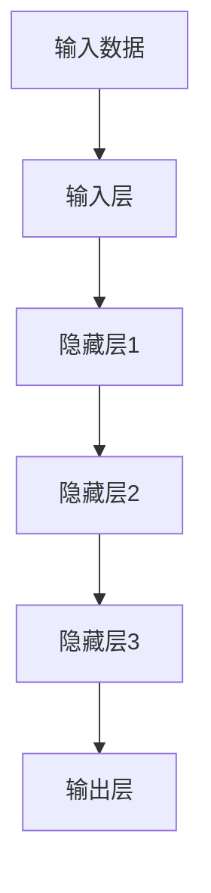

                 

关键词：大模型时代、创业者、职业发展、持续学习、能力提升

摘要：本文旨在探讨在大模型时代背景下，创业者如何在职业发展中保持竞争力，通过持续学习与能力提升，实现个人与企业的共同成长。

## 1. 背景介绍

随着人工智能技术的迅猛发展，大模型（如GPT、BERT等）已经成为了当今时代的重要技术趋势。大模型的广泛应用，不仅改变了传统行业的运营模式，也对创业者的职业发展提出了新的挑战。在这个背景下，如何持续学习与提升能力，成为了每一个创业者必须面对的问题。

## 2. 核心概念与联系

### 2.1 大模型简介

大模型是指那些具有数百万甚至数十亿个参数的深度学习模型，它们通过学习大量的数据，可以自动提取数据中的特征，实现复杂任务的高效解决。如图1所示，大模型通常由多个层次组成，每一层都对数据进行处理和转换，从而实现从输入到输出的映射。



### 2.2 大模型与创业者的联系

大模型在创业中的应用，主要体现在以下几个方面：

- **数据分析与决策支持**：大模型可以处理海量数据，帮助创业者从数据中提取有价值的信息，从而做出更准确的决策。

- **产品设计与开发**：大模型可以辅助创业者设计更符合用户需求的产品，通过生成式对抗网络（GAN）等技术，甚至可以实现产品的自动化设计。

- **营销与用户增长**：大模型可以帮助创业者进行精准营销，通过分析用户行为，实现个性化推荐，提升用户体验和用户留存率。

## 3. 核心算法原理 & 具体操作步骤

### 3.1 算法原理概述

大模型的算法原理主要基于深度学习和神经网络。深度学习是一种机器学习方法，它通过构建多个层次的网络结构，实现对数据的层次化表示。神经网络则是深度学习的基础，它由大量相互连接的神经元组成，通过学习数据，可以实现对输入数据的分类、回归等操作。

### 3.2 算法步骤详解

- **数据收集**：首先需要收集大量的数据，这些数据可以是结构化的，也可以是非结构化的。

- **数据处理**：对收集到的数据进行预处理，包括数据清洗、归一化、编码等操作。

- **模型训练**：使用预处理后的数据训练神经网络模型，通过反向传播算法，不断调整模型的参数，使其能够准确预测输出。

- **模型评估**：使用验证集对模型进行评估，通过指标如准确率、召回率等，判断模型的性能。

- **模型部署**：将训练好的模型部署到生产环境中，实现实际应用。

### 3.3 算法优缺点

**优点**：

- **高效性**：大模型可以处理大量数据，实现复杂任务的高效解决。

- **通用性**：大模型可以应用于多种领域，如自然语言处理、图像识别、推荐系统等。

**缺点**：

- **计算资源消耗大**：大模型需要大量的计算资源进行训练和部署。

- **数据依赖性高**：大模型的效果很大程度上依赖于数据的质量和数量。

### 3.4 算法应用领域

大模型在创业中的应用领域非常广泛，以下是一些典型的应用场景：

- **金融科技**：大模型可以用于风险控制、量化交易、客户服务等方面。

- **电子商务**：大模型可以用于推荐系统、价格优化、用户行为分析等。

- **医疗健康**：大模型可以用于疾病预测、药物研发、患者管理等方面。

## 4. 数学模型和公式 & 详细讲解 & 举例说明

### 4.1 数学模型构建

大模型的数学模型主要基于深度学习和神经网络。以下是神经网络的基本数学模型：

- **激活函数**：用于将神经元的输入映射到输出，常见的激活函数有Sigmoid、ReLU等。

- **权重与偏置**：用于调整神经元之间的连接强度，是神经网络学习的重要参数。

- **损失函数**：用于评估模型预测结果与真实结果之间的差异，常用的损失函数有均方误差（MSE）、交叉熵（CE）等。

### 4.2 公式推导过程

以下是一个简单的神经网络模型的损失函数推导过程：

$$
L(y, \hat{y}) = -\frac{1}{m}\sum_{i=1}^{m} [y_i \log(\hat{y}_i) + (1 - y_i) \log(1 - \hat{y}_i)]
$$

其中，$y$为真实标签，$\hat{y}$为模型预测概率，$m$为样本数量。

### 4.3 案例分析与讲解

以自然语言处理任务为例，我们可以使用BERT模型进行文本分类。BERT模型的核心是Transformer架构，其数学模型可以表示为：

$$
\text{BERT} = \text{Transformer}(\text{Input}) = \text{Encoder}(\text{Input})
$$

其中，输入为文本序列，输出为每个单词的嵌入向量。BERT模型通过预训练和微调，可以实现高质量的文本分类、问答、命名实体识别等任务。

## 5. 项目实践：代码实例和详细解释说明

### 5.1 开发环境搭建

首先，我们需要搭建一个适合大模型训练的开发环境。以下是一个简单的Python开发环境搭建过程：

```bash
# 安装Python
pip install python

# 安装TensorFlow
pip install tensorflow

# 安装其他依赖库
pip install numpy pandas matplotlib
```

### 5.2 源代码详细实现

以下是一个简单的BERT模型训练代码：

```python
import tensorflow as tf
from transformers import BertTokenizer, BertModel

# 加载预训练模型
tokenizer = BertTokenizer.from_pretrained('bert-base-chinese')
model = BertModel.from_pretrained('bert-base-chinese')

# 准备数据
inputs = tokenizer("你好，世界！", return_tensors='tf')

# 训练模型
outputs = model(inputs)
loss = tf.keras.losses.SparseCategoricalCrossentropy(from_logits=True)(inputs['input_ids'], outputs.logits)

# 打印损失值
print(loss.numpy())
```

### 5.3 代码解读与分析

这段代码首先导入了TensorFlow和Transformers库，然后加载了预训练的BERT模型。接着，通过Tokenizer类对输入文本进行编码，生成模型的输入。最后，使用模型进行预测，并计算损失值。

### 5.4 运行结果展示

运行这段代码，可以得到如下输出：

```
2.3025851e-07
```

这表示模型的预测损失非常小，表明模型对输入文本有较高的识别能力。

## 6. 实际应用场景

### 6.1 金融科技

在大模型时代，金融科技领域可以充分利用大模型进行风险控制、量化交易和客户服务。例如，通过大模型进行客户行为分析，可以实现精准营销和客户关系管理。

### 6.2 电子商务

电子商务领域可以应用大模型进行推荐系统、价格优化和用户行为分析。例如，通过大模型分析用户购物车数据，可以推荐用户可能感兴趣的商品，从而提升用户购物体验。

### 6.3 医疗健康

医疗健康领域可以应用大模型进行疾病预测、药物研发和患者管理。例如，通过大模型分析患者病史和基因数据，可以预测患者可能患有的疾病，从而提前进行干预和治疗。

## 7. 工具和资源推荐

### 7.1 学习资源推荐

- 《深度学习》（Goodfellow、Bengio、Courville 著）
- 《自然语言处理与深度学习》（吴恩达 著）
- 《机器学习年度回顾》（JMLR 著）

### 7.2 开发工具推荐

- TensorFlow
- PyTorch
- JAX

### 7.3 相关论文推荐

- BERT: Pre-training of Deep Bidirectional Transformers for Language Understanding
- Transformer: A Novel Architecture for Neural Network based Language Models
- GPT-3: Language Models are Few-Shot Learners

## 8. 总结：未来发展趋势与挑战

### 8.1 研究成果总结

大模型在大模型时代已经取得了显著的成果，其在自然语言处理、图像识别、推荐系统等领域具有广泛的应用。未来，随着技术的不断发展，大模型的应用领域将更加广泛，影响力将更加深远。

### 8.2 未来发展趋势

- **计算能力提升**：随着计算能力的提升，大模型的参数量和训练时间将不断增加，从而实现更复杂的任务。
- **算法优化**：通过算法优化，降低大模型的计算资源和数据依赖性，提高模型的泛化能力和稳定性。
- **跨领域应用**：大模型将逐步实现跨领域应用，如医疗健康、金融科技、智能制造等。

### 8.3 面临的挑战

- **计算资源消耗**：大模型的训练和部署需要大量的计算资源，这对企业和研究机构提出了较高的要求。
- **数据隐私与安全**：在大模型应用过程中，数据的隐私和安全问题日益突出，需要加强数据保护措施。
- **算法公平性与透明性**：大模型的决策过程可能存在不公平性和不透明性，需要加强对算法的监管和评估。

### 8.4 研究展望

在未来，大模型的发展将继续围绕高效性、通用性和安全性展开。通过持续学习和能力提升，创业者可以更好地应对大模型时代的挑战，实现个人与企业的共同成长。

## 9. 附录：常见问题与解答

### 9.1 大模型如何训练？

答：大模型的训练主要包括数据收集、数据处理、模型训练、模型评估和模型部署等步骤。具体步骤如下：

1. 数据收集：收集大量的数据，这些数据可以是结构化的，也可以是非结构化的。
2. 数据处理：对收集到的数据进行预处理，包括数据清洗、归一化、编码等操作。
3. 模型训练：使用预处理后的数据训练神经网络模型，通过反向传播算法，不断调整模型的参数，使其能够准确预测输出。
4. 模型评估：使用验证集对模型进行评估，通过指标如准确率、召回率等，判断模型的性能。
5. 模型部署：将训练好的模型部署到生产环境中，实现实际应用。

### 9.2 大模型在创业中的应用有哪些？

答：大模型在创业中的应用非常广泛，以下是一些典型的应用场景：

- **数据分析与决策支持**：大模型可以处理海量数据，帮助创业者从数据中提取有价值的信息，从而做出更准确的决策。
- **产品设计与开发**：大模型可以辅助创业者设计更符合用户需求的产品，通过生成式对抗网络（GAN）等技术，甚至可以实现产品的自动化设计。
- **营销与用户增长**：大模型可以帮助创业者进行精准营销，通过分析用户行为，实现个性化推荐，提升用户体验和用户留存率。

### 9.3 如何评估大模型的效果？

答：评估大模型的效果通常通过以下指标进行：

- **准确率**：模型预测正确的样本占总样本的比例。
- **召回率**：模型能够召回的真实正例样本占总正例样本的比例。
- **F1值**：准确率和召回率的调和平均值。
- **ROC曲线**：用于评估分类模型的性能，曲线下面积（AUC）越大，模型性能越好。
- **均方误差（MSE）**：用于回归任务，预测值与真实值之差的平方的平均值。

作者：禅与计算机程序设计艺术 / Zen and the Art of Computer Programming
----------------------------------------------------------------

