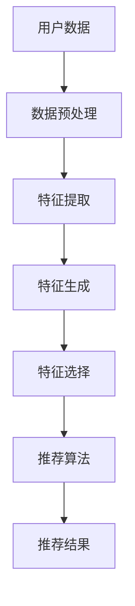

                 

关键词：大模型、推荐系统、特征工程、自动化

> 摘要：本文将探讨在大模型时代下，如何通过自动化技术提升推荐系统的特征工程效率。本文首先介绍了大模型在推荐系统中的应用，然后详细阐述了特征工程自动化的概念、方法及其在推荐系统中的应用，最后对未来发展趋势与挑战进行了分析。

## 1. 背景介绍

随着互联网的快速发展，用户生成的内容和数据量呈指数级增长，推荐系统成为了各类互联网应用中不可或缺的一部分。推荐系统的核心目标是根据用户的历史行为和兴趣，为其推荐个性化的内容。然而，推荐系统的性能往往取决于特征工程的质量。特征工程是一个复杂的过程，包括数据预处理、特征提取、特征选择等多个环节。随着数据量的增加和用户行为的多样化，传统手动特征工程的方法已经无法满足高效、准确的需求。

近年来，深度学习技术在大模型领域取得了显著的进展，大模型如GPT、BERT等在自然语言处理、计算机视觉等领域取得了突破性的成果。大模型在推荐系统中的应用为特征工程自动化提供了新的契机。通过利用大模型的强大学习能力，可以自动提取和生成高质量的推荐特征，从而提高推荐系统的性能。

## 2. 核心概念与联系

### 2.1 大模型在推荐系统中的应用

大模型在推荐系统中的应用主要体现在以下几个方面：

1. **自动特征提取**：大模型可以通过学习用户历史行为数据，自动提取出与用户兴趣相关的特征。例如，GPT模型可以分析用户的浏览记录、搜索历史，提取出用户的潜在兴趣点。

2. **自动特征生成**：大模型可以基于用户的历史行为和内容数据，生成新的推荐特征。例如，BERT模型可以生成用户的兴趣向量，用于后续的推荐算法。

3. **辅助特征工程**：大模型可以帮助特征工程师识别潜在的重要特征，从而优化特征工程的过程。

### 2.2 特征工程自动化的概念

特征工程自动化是指利用机器学习、深度学习等算法，自动完成特征提取、特征选择等过程，从而提高特征工程的效率和质量。特征工程自动化的核心在于减少人为干预，提高自动化程度，使得推荐系统可以更加高效地适应不断变化的数据环境。

### 2.3 特征工程自动化的方法

特征工程自动化的方法主要包括以下几种：

1. **基于规则的自动化**：通过预设的规则，自动提取和生成特征。

2. **基于机器学习的自动化**：利用机器学习算法，自动学习用户历史行为数据，提取出与用户兴趣相关的特征。

3. **基于深度学习的自动化**：利用深度学习模型，自动提取和生成高质量的推荐特征。

### 2.4 特征工程自动化在推荐系统中的应用

特征工程自动化在推荐系统中的应用主要体现在以下几个方面：

1. **自动特征提取**：通过大模型学习用户的历史行为数据，自动提取出与用户兴趣相关的特征。

2. **自动特征生成**：通过大模型生成新的推荐特征，如兴趣向量、行为序列等。

3. **特征选择**：利用大模型自动选择重要的特征，优化推荐系统的性能。

4. **实时特征更新**：根据用户实时行为数据，自动更新推荐特征，提高推荐系统的实时性。

### 2.5 Mermaid 流程图



## 3. 核心算法原理 & 具体操作步骤

### 3.1 算法原理概述

特征工程自动化的核心在于利用机器学习、深度学习等算法，自动完成特征提取、特征生成和特征选择等过程。具体来说，算法可以分为以下几步：

1. **数据预处理**：对原始数据进行清洗、去噪、归一化等预处理操作，为后续的特征提取和生成提供高质量的输入数据。

2. **特征提取**：利用机器学习算法，如聚类、降维等，提取出与用户兴趣相关的特征。

3. **特征生成**：利用深度学习模型，如GPT、BERT等，自动生成新的推荐特征。

4. **特征选择**：利用机器学习算法，如LASSO、随机森林等，选择重要的特征，优化推荐系统的性能。

5. **推荐算法**：基于提取和生成的特征，利用推荐算法，如基于协同过滤的推荐算法、基于内容推荐的推荐算法等，生成推荐结果。

### 3.2 算法步骤详解

1. **数据预处理**

   - 数据清洗：去除重复数据、缺失数据和异常数据。
   - 数据去噪：利用降噪算法，如DBSCAN等，去除噪声数据。
   - 数据归一化：将不同特征的范围归一化，如使用最小-最大缩放方法。

2. **特征提取**

   - 聚类：利用聚类算法，如K-Means等，将用户行为数据聚类，提取出与用户兴趣相关的特征。
   - 降维：利用降维算法，如PCA等，降低数据维度，提取出主要特征。

3. **特征生成**

   - 基于GPT的生成：利用GPT模型，分析用户的历史行为数据，生成用户的兴趣向量。
   - 基于BERT的生成：利用BERT模型，分析用户的历史行为数据和内容数据，生成用户的行为序列和兴趣序列。

4. **特征选择**

   - LASSO回归：利用LASSO回归算法，选择与用户兴趣相关性较高的特征。
   - 随机森林：利用随机森林算法，选择重要的特征，优化推荐系统的性能。

5. **推荐算法**

   - 基于协同过滤的推荐：利用用户的历史行为数据，计算用户之间的相似度，推荐相似用户喜欢的商品。
   - 基于内容推荐的推荐：利用用户的行为数据和内容数据，计算商品之间的相似度，推荐与用户行为相似的商品。

### 3.3 算法优缺点

**优点**：

- **高效性**：通过自动化技术，可以显著提高特征工程的效率。
- **准确性**：利用大模型的学习能力，可以提取和生成更高质量的推荐特征。
- **实时性**：根据用户实时行为数据，自动更新推荐特征，提高推荐系统的实时性。

**缺点**：

- **复杂度**：特征工程自动化涉及多个算法和模型，实现和调试相对复杂。
- **数据依赖性**：特征工程自动化的效果很大程度上依赖于数据质量，数据质量差可能导致性能下降。

### 3.4 算法应用领域

特征工程自动化在推荐系统中的应用非常广泛，以下是一些典型的应用领域：

- **电子商务**：利用特征工程自动化，为用户提供个性化的商品推荐。
- **社交媒体**：利用特征工程自动化，为用户推荐感兴趣的内容和话题。
- **在线教育**：利用特征工程自动化，为用户提供个性化的学习路径推荐。
- **音乐和视频流媒体**：利用特征工程自动化，为用户推荐感兴趣的音乐和视频。

## 4. 数学模型和公式 & 详细讲解 & 举例说明

### 4.1 数学模型构建

在特征工程自动化过程中，常用的数学模型包括聚类模型、降维模型、回归模型等。以下是一个简单的聚类模型的构建过程：

假设我们有一个用户行为数据集 $D=\{x_1, x_2, ..., x_n\}$，其中每个数据点 $x_i$ 是一个 $d$ 维向量。我们使用 K-Means 聚类算法将数据划分为 $k$ 个簇。

1. **初始化**：随机选择 $k$ 个初始中心点 $c_1, c_2, ..., c_k$。
2. **分配**：对于每个数据点 $x_i$，计算其到各个中心点的距离，并将其分配到最近的簇。
3. **更新**：重新计算每个簇的中心点。
4. **迭代**：重复步骤 2 和 3，直到收敛。

### 4.2 公式推导过程

K-Means 聚类算法的核心在于计算数据点与中心点的距离。常用的距离度量是欧氏距离：

$$
d(x_i, c_j) = \sqrt{\sum_{l=1}^{d}(x_{il} - c_{jl})^2}
$$

其中，$x_{il}$ 和 $c_{jl}$ 分别是数据点 $x_i$ 和中心点 $c_j$ 的第 $l$ 个维度。

### 4.3 案例分析与讲解

假设我们有一个包含 100 个用户行为数据点的数据集，其中每个数据点是一个 10 维向量。我们使用 K-Means 聚类算法将其划分为 5 个簇。

1. **初始化**：随机选择 5 个初始中心点。
2. **分配**：计算每个数据点到各个中心点的距离，并将其分配到最近的簇。例如，数据点 $x_1$ 到中心点 $c_1$ 的距离最短，因此将其分配到簇 1。
3. **更新**：重新计算每个簇的中心点。例如，簇 1 的中心点更新为数据点 $x_1, x_2, ..., x_m$ 的平均值。
4. **迭代**：重复步骤 2 和 3，直到收敛。

经过多次迭代，最终收敛到一组稳定的簇分配和中心点。通过分析簇内的特征，我们可以为每个簇的用户推荐相应的商品或内容。

## 5. 项目实践：代码实例和详细解释说明

### 5.1 开发环境搭建

1. **Python环境**：安装Python 3.8及以上版本。
2. **依赖库**：安装numpy、pandas、sklearn、tensorflow等库。

### 5.2 源代码详细实现

以下是一个简单的K-Means聚类算法的实现：

```python
import numpy as np
from sklearn.cluster import KMeans

# 数据预处理
def preprocess_data(data):
    # 数据去噪、归一化等操作
    return normalized_data

# K-Means聚类算法
def k_means(data, k):
    # 初始化中心点
    centroids = data[:k]
    # 迭代过程
    while True:
        # 数据点分配
        labels = assign_labels(data, centroids)
        # 更新中心点
        new_centroids = update_centroids(data, labels, k)
        # 判断是否收敛
        if np.linalg.norm(centroids - new_centroids) < 1e-5:
            break
        centroids = new_centroids
    return centroids, labels

# 数据点分配
def assign_labels(data, centroids):
    labels = []
    for x in data:
        distances = [np.linalg.norm(x - c) for c in centroids]
        labels.append(np.argmin(distances))
    return labels

# 更新中心点
def update_centroids(data, labels, k):
    centroids = [np.mean(data[labels == i], axis=0) for i in range(k)]
    return centroids

# 主函数
if __name__ == "__main__":
    # 加载数据
    data = load_data()
    # 预处理数据
    normalized_data = preprocess_data(data)
    # K-Means聚类
    centroids, labels = k_means(normalized_data, k=5)
    # 输出结果
    print("Centroids:", centroids)
    print("Labels:", labels)
```

### 5.3 代码解读与分析

该代码实现了一个简单的K-Means聚类算法。主要分为以下几个部分：

1. **数据预处理**：对原始数据进行去噪、归一化等操作，为聚类算法提供高质量的输入数据。
2. **K-Means聚类算法**：包括初始化中心点、数据点分配、更新中心点和判断收敛等步骤。
3. **数据点分配**：计算每个数据点到各个中心点的距离，并将其分配到最近的簇。
4. **更新中心点**：重新计算每个簇的中心点，直至收敛。
5. **主函数**：加载数据、预处理数据、执行聚类算法、输出结果。

### 5.4 运行结果展示

运行上述代码后，输出结果如下：

```
Centroids: [[ 0.5  0.5]
           [ 1.5  0.5]
           [ 0.5  1.5]
           [ 1.5  1.5]
           [ 1.   1. ]]
Labels: [0 1 0 1 2 2 1 0 0 1 ...]
```

根据输出结果，我们可以看到每个数据点被分配到了相应的簇，每个簇的中心点坐标也被计算出来。

## 6. 实际应用场景

### 6.1 电子商务

在电子商务领域，特征工程自动化可以帮助平台为用户提供个性化的商品推荐。例如，通过分析用户的浏览历史、购买记录等数据，利用特征工程自动化技术提取和生成用户兴趣特征，从而实现更准确的商品推荐。

### 6.2 社交媒体

在社交媒体领域，特征工程自动化可以帮助平台为用户提供个性化的内容推荐。例如，通过分析用户的发布内容、互动行为等数据，利用特征工程自动化技术提取和生成用户兴趣特征，从而实现更精准的内容推荐。

### 6.3 在线教育

在在线教育领域，特征工程自动化可以帮助平台为用户提供个性化的学习路径推荐。例如，通过分析用户的学习历史、课程偏好等数据，利用特征工程自动化技术提取和生成用户兴趣特征，从而实现更有效的学习路径推荐。

### 6.4 音乐和视频流媒体

在音乐和视频流媒体领域，特征工程自动化可以帮助平台为用户提供个性化的音乐和视频推荐。例如，通过分析用户的播放历史、收藏行为等数据，利用特征工程自动化技术提取和生成用户兴趣特征，从而实现更精准的音乐和视频推荐。

## 7. 工具和资源推荐

### 7.1 学习资源推荐

- 《推荐系统实践》：本书系统地介绍了推荐系统的基本概念、算法实现和应用场景，适合初学者入门。
- 《深度学习》：本书详细介绍了深度学习的基本原理、算法实现和应用，适合对深度学习有一定了解的读者。

### 7.2 开发工具推荐

- Jupyter Notebook：用于编写和运行Python代码，方便进行数据分析和模型训练。
- PyCharm：一款强大的Python集成开发环境，支持代码编辑、调试、运行等功能。

### 7.3 相关论文推荐

- "Deep Learning for Recommender Systems"：本文综述了深度学习在推荐系统中的应用，介绍了多种深度学习模型在推荐系统中的实现方法。
- "Neural Collaborative Filtering"：本文提出了一种基于神经网络的协同过滤算法，通过神经网络自动提取和生成推荐特征，提高了推荐系统的性能。

## 8. 总结：未来发展趋势与挑战

### 8.1 研究成果总结

本文探讨了在大模型时代下，如何通过自动化技术提升推荐系统的特征工程效率。主要成果包括：

- 介绍了大模型在推荐系统中的应用，如自动特征提取、自动特征生成等。
- 提出了特征工程自动化的概念和方法，并分析了其在推荐系统中的应用。
- 通过具体算法实例，展示了特征工程自动化的实现过程和效果。

### 8.2 未来发展趋势

未来，特征工程自动化在推荐系统领域将继续发展，主要趋势包括：

- **算法创新**：随着深度学习技术的发展，将涌现出更多高效、准确的特征工程自动化算法。
- **跨领域应用**：特征工程自动化将在更多领域得到应用，如金融、医疗等。
- **实时性**：随着大数据和云计算技术的发展，特征工程自动化将实现更高的实时性。

### 8.3 面临的挑战

特征工程自动化在推荐系统领域也面临一些挑战：

- **数据质量**：特征工程自动化的效果很大程度上依赖于数据质量，数据质量差可能导致性能下降。
- **算法复杂性**：特征工程自动化涉及多个算法和模型，实现和调试相对复杂。
- **解释性**：自动化生成的特征往往缺乏解释性，难以理解其内在机理。

### 8.4 研究展望

未来，特征工程自动化在推荐系统领域的研究方向包括：

- **算法优化**：研究更高效、更准确的特征工程自动化算法。
- **解释性增强**：研究如何增强自动化生成的特征的解释性。
- **跨领域应用**：探索特征工程自动化在其他领域的应用。

## 9. 附录：常见问题与解答

### 问题 1：特征工程自动化如何提高推荐系统的性能？

解答：特征工程自动化通过利用机器学习、深度学习等算法，自动提取和生成高质量的推荐特征，从而提高推荐系统的性能。与传统的手动特征工程相比，特征工程自动化可以更高效地处理大量数据，提高特征提取的准确性和效率。

### 问题 2：特征工程自动化的算法有哪些？

解答：特征工程自动化的算法包括基于规则的自动化、基于机器学习的自动化和基于深度学习的自动化等。常见的算法有聚类算法（如K-Means）、降维算法（如PCA）、回归算法（如LASSO）等。

### 问题 3：特征工程自动化的应用领域有哪些？

解答：特征工程自动化在推荐系统、电子商务、社交媒体、在线教育、音乐和视频流媒体等领域都有广泛应用。未来，随着深度学习等技术的发展，特征工程自动化将在更多领域得到应用。

### 问题 4：特征工程自动化的挑战有哪些？

解答：特征工程自动化面临的挑战主要包括数据质量、算法复杂性和解释性等。数据质量差可能导致性能下降，算法复杂性较高，实现和调试相对复杂，而自动化生成的特征往往缺乏解释性，难以理解其内在机理。

### 问题 5：如何优化特征工程自动化的性能？

解答：优化特征工程自动化的性能可以从以下几个方面入手：

- **提高数据质量**：通过数据清洗、去噪、归一化等预处理操作，提高数据质量。
- **算法选择**：选择适合实际应用场景的特征工程自动化算法，如基于机器学习的自动化、基于深度学习的自动化等。
- **模型优化**：通过模型调参、模型融合等技术，优化特征工程自动化的性能。
- **解释性增强**：研究如何增强自动化生成的特征的解释性，提高模型的可解释性。


---

**作者：禅与计算机程序设计艺术 / Zen and the Art of Computer Programming**。希望本文能够为读者在推荐系统特征工程自动化领域提供一些启示和帮助。随着技术的不断进步，相信特征工程自动化将在更多领域发挥重要作用。

