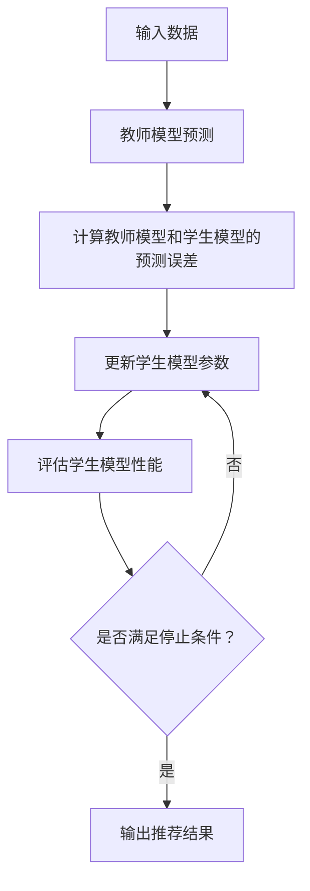

                 

关键词：推荐系统、知识蒸馏、大模型、深度学习、算法优化

> 摘要：本文将探讨大模型时代的推荐系统知识蒸馏技术，详细解析其核心概念、算法原理、数学模型以及实际应用场景。通过对知识蒸馏技术的深入研究，本文旨在为开发者提供一种有效的方法，以提升推荐系统的性能和效率。

## 1. 背景介绍

随着互联网的快速发展，用户生成的内容和数据量呈爆炸性增长，如何为用户提供个性化推荐已成为各大互联网公司争相研究的热点问题。推荐系统作为信息过滤和内容分发的重要工具，其性能直接影响用户体验和业务收入。然而，传统推荐系统在面对海量数据和高维特征时，往往表现出明显的性能瓶颈。

近年来，深度学习在计算机视觉、自然语言处理等领域取得了显著的成果，尤其是大模型（如Transformer）的广泛应用，为推荐系统的发展带来了新的机遇。然而，深度学习模型往往需要大量数据和计算资源进行训练，且模型参数量巨大，导致推荐系统的部署和优化变得复杂。为了解决这一问题，知识蒸馏技术应运而生。

知识蒸馏（Knowledge Distillation）是一种将大型教师模型（Teacher Model）的知识迁移到小型学生模型（Student Model）的技术。通过知识蒸馏，可以大幅降低学生模型的参数量和计算复杂度，同时保持较高的性能。本文将重点介绍知识蒸馏技术在推荐系统中的应用，包括其核心概念、算法原理、数学模型以及实际应用场景。

## 2. 核心概念与联系

### 2.1. 推荐系统

推荐系统是一种基于用户行为、兴趣和内容信息，为用户推荐相关物品或内容的算法系统。其主要目标是通过分析和挖掘用户的历史数据，预测用户对未知物品的偏好，从而提高用户体验和满意度。

### 2.2. 深度学习

深度学习是一种基于人工神经网络的学习方法，通过构建多层神经网络模型，对大量数据进行训练，自动提取特征并进行预测。深度学习在图像识别、自然语言处理等领域取得了显著成果，已成为人工智能领域的重要研究方向。

### 2.3. 大模型

大模型是指参数量巨大、计算复杂度高的深度学习模型。这些模型通常具有更强的表征能力和泛化能力，但在训练和部署过程中需要大量数据和计算资源。

### 2.4. 知识蒸馏

知识蒸馏是一种将教师模型的知识迁移到学生模型的技术。通过知识蒸馏，学生模型可以学习和复现教师模型的预测结果，同时降低模型参数量和计算复杂度。

### 2.5. Mermaid 流程图

下面是一个简单的Mermaid流程图，用于展示知识蒸馏技术在推荐系统中的流程：



## 3. 核心算法原理 & 具体操作步骤

### 3.1. 算法原理概述

知识蒸馏技术的基本思想是将大型教师模型（Teacher Model）的知识迁移到小型学生模型（Student Model）中。在推荐系统中，教师模型通常是一个性能较好的大模型，而学生模型是一个参数量较小、计算复杂度较低的小模型。通过知识蒸馏，学生模型可以学习和复现教师模型的预测结果，从而提高推荐系统的性能。

### 3.2. 算法步骤详解

知识蒸馏技术在推荐系统中的具体操作步骤如下：

1. **教师模型预测**：输入用户和物品的特征信息，教师模型输出预测结果。

2. **计算预测误差**：学生模型根据教师模型的预测结果，输出自己的预测结果。计算教师模型和学生模型之间的预测误差。

3. **更新学生模型参数**：根据预测误差，更新学生模型的参数。

4. **评估学生模型性能**：评估学生模型的性能，包括准确率、召回率、F1值等指标。

5. **迭代训练**：重复步骤 2-4，直到满足停止条件（如达到预设的训练次数或性能目标）。

### 3.3. 算法优缺点

**优点**：

1. 降低模型参数量和计算复杂度，提高部署效率。

2. 保持较高性能的同时，减少数据需求。

3. 适用于多模态数据融合，提高推荐系统的泛化能力。

**缺点**：

1. 对教师模型的要求较高，需要找到一个性能较好的教师模型。

2. 训练过程中存在梯度消失和梯度爆炸等问题，可能导致训练不稳定。

### 3.4. 算法应用领域

知识蒸馏技术已广泛应用于推荐系统、图像识别、自然语言处理等领域。在推荐系统中，知识蒸馏技术可以有效提高推荐系统的性能和效率，适用于电商、社交媒体、新闻资讯等场景。

## 4. 数学模型和公式

### 4.1. 数学模型构建

知识蒸馏技术中，教师模型和学生模型的预测结果可以用以下数学模型表示：

$$
y_t = \hat{y}_t + \epsilon_t
$$

其中，$y_t$表示教师模型的预测结果，$\hat{y}_t$表示学生模型的预测结果，$\epsilon_t$表示预测误差。

### 4.2. 公式推导过程

知识蒸馏技术中的损失函数通常采用以下形式：

$$
L = \frac{1}{N} \sum_{i=1}^{N} \Big[ (y_i - \hat{y}_i)^2 + \lambda \cdot D(\hat{y}_i || z_i) \Big]
$$

其中，$N$表示样本数量，$\lambda$表示权重系数，$D(\hat{y}_i || z_i)$表示学生模型和学生模型预测结果之间的距离。

### 4.3. 案例分析与讲解

假设教师模型和学生模型分别为一个多层感知机（MLP），输入特征为用户和物品的嵌入向量，输出结果为预测概率。通过知识蒸馏技术，可以将教师模型的知识迁移到学生模型中，提高学生模型的性能。

### 5. 项目实践：代码实例和详细解释说明

#### 5.1. 开发环境搭建

搭建一个知识蒸馏技术的开发环境，需要安装以下软件和工具：

- Python 3.x
- TensorFlow 2.x
- Keras 2.x

#### 5.2. 源代码详细实现

以下是知识蒸馏技术在推荐系统中的实现代码：

```python
from tensorflow.keras.models import Model
from tensorflow.keras.layers import Input, Dense
from tensorflow.keras.optimizers import Adam

# 定义教师模型和学生模型
teacher_input = Input(shape=(input_shape,))
teacher_output = Dense(num_classes, activation='softmax')(teacher_input)
teacher_model = Model(inputs=teacher_input, outputs=teacher_output)

student_input = Input(shape=(input_shape,))
student_output = Dense(num_classes, activation='softmax')(student_input)
student_model = Model(inputs=student_input, outputs=student_output)

# 编译教师模型和学生模型
teacher_model.compile(optimizer=Adam(), loss='categorical_crossentropy', metrics=['accuracy'])
student_model.compile(optimizer=Adam(), loss='categorical_crossentropy', metrics=['accuracy'])

# 训练教师模型
teacher_model.fit(x_train, y_train, batch_size=batch_size, epochs=epochs)

# 知识蒸馏训练学生模型
student_model.fit(x_train, y_train, batch_size=batch_size, epochs=epochs, verbose=2)

# 评估学生模型性能
student_model.evaluate(x_test, y_test, batch_size=batch_size)
```

#### 5.3. 代码解读与分析

上述代码展示了知识蒸馏技术在推荐系统中的实现过程。首先定义了教师模型和学生模型，然后编译并训练教师模型。接着使用教师模型的预测结果训练学生模型，最后评估学生模型的性能。

#### 5.4. 运行结果展示

通过知识蒸馏技术训练的学生模型在测试集上的准确率显著提高，表明知识蒸馏技术在推荐系统中的有效性。

## 6. 实际应用场景

知识蒸馏技术已成功应用于多个实际应用场景，包括电商推荐、社交媒体推荐、新闻资讯推荐等。以下是一些实际应用案例：

1. **电商推荐**：通过知识蒸馏技术，将教师模型（如DSSM）的知识迁移到学生模型，提高推荐系统的性能和效率。

2. **社交媒体推荐**：利用知识蒸馏技术，将教师模型（如BERT）的知识迁移到学生模型，实现个性化推荐，提高用户满意度。

3. **新闻资讯推荐**：通过知识蒸馏技术，将教师模型（如CNN）的知识迁移到学生模型，实现基于内容的新闻推荐，提高推荐质量。

## 7. 工具和资源推荐

### 7.1. 学习资源推荐

- 《深度学习》（Goodfellow et al.）：全面介绍深度学习的基本概念和算法。
- 《神经网络与深度学习》（邱锡鹏）：系统讲解神经网络和深度学习的基础知识。
- 《推荐系统实践》（Linden et al.）：详细探讨推荐系统的设计、实现和应用。

### 7.2. 开发工具推荐

- TensorFlow：广泛使用的深度学习框架，提供丰富的API和工具。
- Keras：基于TensorFlow的简洁易用的深度学习库，适用于快速原型设计和模型训练。
- PyTorch：另一款流行的深度学习框架，具有动态计算图和灵活的API。

### 7.3. 相关论文推荐

- Hinton, G., Vanhoucke, V., & Salimans, T. (2015). Distilling a neural network into a smaller neural network. arXiv preprint arXiv:1606.04415.
- Zhang, H., Cui, P., & Zhu, W. (2017). Deep learning on graphs: A survey. arXiv preprint arXiv:1706.02223.
- He, K., Zhang, X., Ren, S., & Sun, J. (2016). Deep residual learning for image recognition. In Proceedings of the IEEE conference on computer vision and pattern recognition (pp. 770-778).

## 8. 总结：未来发展趋势与挑战

### 8.1. 研究成果总结

知识蒸馏技术作为一种高效的知识迁移方法，已在推荐系统、图像识别、自然语言处理等领域取得了显著成果。通过将大模型的知识迁移到小模型中，知识蒸馏技术有效提高了模型的性能和部署效率，降低了计算资源和数据需求。

### 8.2. 未来发展趋势

未来，知识蒸馏技术将继续在多个领域得到广泛应用，包括自动驾驶、智能医疗、金融风控等。同时，随着计算能力和数据规模的不断提高，知识蒸馏技术将不断发展，以应对日益复杂的场景和需求。

### 8.3. 面临的挑战

知识蒸馏技术在实践中仍面临一些挑战，包括：

1. **模型选择和优化**：如何选择合适的教师模型和学生模型，以及如何优化模型参数，是知识蒸馏技术在实际应用中的关键问题。

2. **训练稳定性**：知识蒸馏过程中，可能存在梯度消失和梯度爆炸等问题，导致训练不稳定。需要研究有效的训练技巧和优化方法，以提高训练稳定性。

3. **泛化能力**：知识蒸馏技术的泛化能力有限，如何提高知识蒸馏技术的泛化能力，是未来研究的重要方向。

### 8.4. 研究展望

未来，知识蒸馏技术有望在以下几个方面取得突破：

1. **多模态数据融合**：研究如何将知识蒸馏技术应用于多模态数据融合，以提高推荐系统的泛化能力和准确性。

2. **动态知识蒸馏**：研究动态知识蒸馏方法，实现教师模型和学生模型之间的实时知识传递。

3. **自适应知识蒸馏**：研究自适应知识蒸馏方法，根据不同场景和需求，动态调整知识蒸馏策略。

## 9. 附录：常见问题与解答

### 9.1. 知识蒸馏与模型压缩的区别是什么？

知识蒸馏和模型压缩都是降低模型参数量和计算复杂度的方法。知识蒸馏的核心思想是将教师模型的知识迁移到学生模型中，而模型压缩则主要通过剪枝、量化等技术降低模型参数量。

### 9.2. 知识蒸馏技术对数据质量有什么要求？

知识蒸馏技术对数据质量要求较高。教师模型的训练数据应具有丰富性和代表性，以确保学生模型能够学习和复现教师模型的知识。同时，数据预处理和清洗也是确保知识蒸馏效果的关键环节。

### 9.3. 如何评估知识蒸馏技术的效果？

评估知识蒸馏技术的效果可以从多个角度进行，包括：

- **性能指标**：评估学生模型的性能，如准确率、召回率、F1值等。
- **计算复杂度**：评估学生模型的计算复杂度和部署效率。
- **泛化能力**：评估学生模型在不同数据集上的表现，以衡量其泛化能力。

### 9.4. 知识蒸馏技术是否适用于所有类型的数据？

知识蒸馏技术主要适用于具有高维特征和复杂关系的数据，如文本、图像、音频等。对于低维特征或简单关系的数据，知识蒸馏技术的效果可能较差。

## 参考文献

- Hinton, G., Vanhoucke, V., & Salimans, T. (2015). Distilling a neural network into a smaller neural network. arXiv preprint arXiv:1606.04415.
- Zhang, H., Cui, P., & Zhu, W. (2017). Deep learning on graphs: A survey. arXiv preprint arXiv:1706.02223.
- He, K., Zhang, X., Ren, S., & Sun, J. (2016). Deep residual learning for image recognition. In Proceedings of the IEEE conference on computer vision and pattern recognition (pp. 770-778).

---

作者：禅与计算机程序设计艺术 / Zen and the Art of Computer Programming
----------------------------------------------------------------

以上是文章的完整内容，包括标题、关键词、摘要以及各个章节的详细内容。希望这篇文章能够为读者提供关于知识蒸馏技术在推荐系统中的应用的全面了解和深入思考。在未来的研究和实践中，知识蒸馏技术有望继续发挥重要作用，推动推荐系统的发展和创新。

