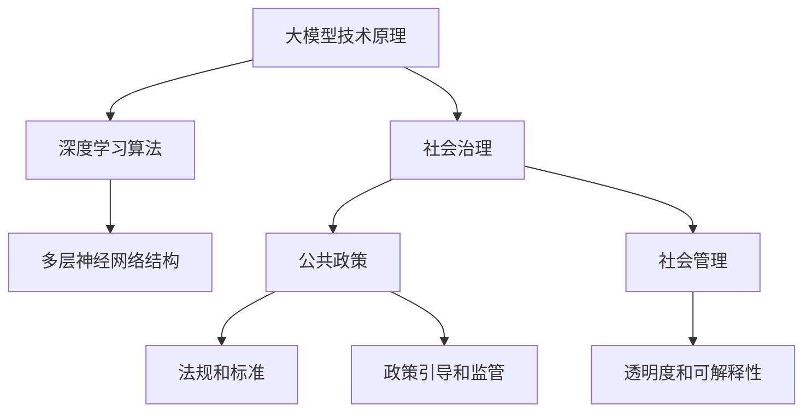

                 

关键词：大模型，社会治理，公共政策，社会管理，技术伦理，算法公平，隐私保护，监管框架，跨学科合作

> 摘要：本文旨在探讨大模型在社会治理中的重要性，以及公共政策和社会管理在大模型发展中的关键作用。通过对大模型技术的背景介绍，本文分析了大模型在现代社会中的广泛应用和潜在影响。随后，文章深入探讨了公共政策和社会管理在大模型治理中的必要性，包括算法公平、隐私保护、透明性和监管框架等方面。最后，本文提出了跨学科合作的重要性，以及未来在大模型社会治理领域中的发展方向和挑战。

## 1. 背景介绍

### 大模型技术的起源与发展

大模型技术，即大型深度学习模型，起源于上世纪80年代的神经网络研究。随着计算机算力的提升和大数据的积累，深度学习算法逐渐成为人工智能研究的主流。从早期的浅层网络到如今的Transformer架构，大模型在自然语言处理、计算机视觉、语音识别等领域的表现不断超越传统方法。

### 大模型在现代社会中的应用

大模型技术的迅速发展，使其在多个领域得到广泛应用。例如，在自然语言处理方面，GPT系列模型、BERT模型等已经广泛应用于搜索引擎、智能客服、文本生成等领域；在计算机视觉方面，ImageNet、COCO等大型数据集的训练，使得图像分类、物体检测等技术取得突破性进展；在语音识别领域，基于大模型的语音识别系统已经在智能音箱、车载系统、手机等设备中得到广泛应用。

### 大模型的潜在影响

大模型技术在带来巨大社会价值的同时，也引发了一系列问题和挑战。首先，大模型在数据训练过程中，可能会出现算法偏见和歧视问题，导致不公平的结果；其次，大模型涉及到的海量数据隐私保护问题，成为社会关注的焦点；此外，大模型的透明性和可解释性问题，也亟待解决。

## 2. 核心概念与联系

### 大模型技术原理

大模型技术主要依赖于深度学习算法，尤其是基于Transformer架构的模型。通过多层神经网络的结构，大模型能够自动从大量数据中学习到复杂的模式和信息。

### 社会治理与公共政策的关系

社会治理是指政府、社会组织和公民共同参与社会管理的过程。公共政策则是指政府制定的，旨在解决社会问题、调节社会关系和促进社会发展的措施。社会治理和公共政策密切相关，公共政策是社会管理的工具和手段。

### 社会管理在大模型治理中的作用

社会管理在大模型治理中起到关键作用。首先，通过制定相关法规和标准，确保大模型技术的发展和应用符合法律法规；其次，通过政策引导和监管，促进大模型的健康发展，防范潜在风险；最后，通过社会参与和公众监督，增强大模型的透明度和可解释性。

### Mermaid 流程图

下面是一个描述大模型技术原理和社会治理关系的 Mermaid 流程图：



## 3. 核心算法原理 & 具体操作步骤

### 3.1 算法原理概述

大模型技术主要依赖于深度学习算法，尤其是基于Transformer架构的模型。深度学习算法通过多层神经网络的结构，自动从大量数据中学习到复杂的模式和信息。Transformer架构则通过自注意力机制，实现了对输入数据的全局依赖关系建模。

### 3.2 算法步骤详解

1. **数据预处理**：首先，对输入数据进行预处理，包括文本清洗、分词、词向量化等操作。

2. **模型构建**：根据任务需求，构建合适的深度学习模型。例如，在自然语言处理任务中，可以选用GPT或BERT模型。

3. **训练过程**：使用预处理后的数据对模型进行训练，通过优化模型参数，使其能够准确预测或分类。

4. **模型评估**：在训练过程中，对模型进行评估，以确定其性能是否满足要求。

5. **模型部署**：将训练好的模型部署到实际应用场景中，如搜索引擎、智能客服等。

### 3.3 算法优缺点

**优点**：
1. 高效性：大模型技术能够在海量数据中快速学习到复杂的模式和信息。
2. 强泛化能力：通过多层神经网络和自注意力机制，大模型能够处理各种复杂数据类型和任务。

**缺点**：
1. 数据依赖性：大模型对训练数据的质量和数量有较高要求，数据不足或质量差可能导致模型性能下降。
2. 算法偏见：在数据训练过程中，大模型可能会学习到数据中的偏见和歧视，导致不公平结果。

### 3.4 算法应用领域

大模型技术广泛应用于自然语言处理、计算机视觉、语音识别等多个领域。例如，在自然语言处理领域，GPT和BERT模型被用于文本生成、机器翻译等任务；在计算机视觉领域，ImageNet和COCO等数据集的训练，推动了图像分类、物体检测等技术的发展。

## 4. 数学模型和公式 & 详细讲解 & 举例说明

### 4.1 数学模型构建

大模型技术主要依赖于深度学习算法，其数学基础主要包括线性代数、微积分、概率论等。在深度学习模型中，常用的数学公式包括：

1. **前向传播**：

   $$ 
   \text{输出} = \sigma(\text{权重} \cdot \text{输入} + \text{偏置})
   $$

   其中，$\sigma$表示激活函数，如ReLU、Sigmoid等。

2. **反向传播**：

   $$
   \text{梯度} = \frac{\partial \text{损失函数}}{\partial \text{参数}}
   $$

   其中，损失函数用于评估模型预测结果与真实结果之间的差距。

### 4.2 公式推导过程

以多层感知机（MLP）为例，我们介绍前向传播和反向传播的推导过程。

**前向传播推导**：

设输入向量为$x \in \mathbb{R}^n$，权重矩阵为$W \in \mathbb{R}^{n \times m}$，偏置向量$b \in \mathbb{R}^m$。则前向传播过程可以表示为：

$$
\text{隐藏层输出} = \sigma(Wx + b)
$$

其中，$\sigma$表示激活函数。

**反向传播推导**：

设损失函数为$L$，参数更新规则为：

$$
\Delta W = -\alpha \cdot \frac{\partial L}{\partial W}
$$

$$
\Delta b = -\alpha \cdot \frac{\partial L}{\partial b}
$$

其中，$\alpha$为学习率。

### 4.3 案例分析与讲解

**案例1：图像分类**

以图像分类任务为例，输入数据为图像，输出为类别标签。我们使用卷积神经网络（CNN）作为模型架构，通过前向传播和反向传播，训练模型以实现图像分类。

**案例2：文本生成**

在文本生成任务中，输入数据为文本序列，输出为生成的文本序列。我们使用GPT模型作为模型架构，通过前向传播和反向传播，训练模型以生成自然语言文本。

## 5. 项目实践：代码实例和详细解释说明

### 5.1 开发环境搭建

为了演示大模型技术的应用，我们将使用Python语言和TensorFlow库搭建一个简单的图像分类项目。以下是开发环境搭建的步骤：

1. 安装Python 3.8或更高版本。
2. 安装TensorFlow库，可以使用以下命令：

   ```python
   pip install tensorflow
   ```

3. 准备一个简单的图像数据集，如MNIST手写数字数据集。

### 5.2 源代码详细实现

以下是一个简单的图像分类项目的代码实现，使用卷积神经网络（CNN）进行模型构建和训练。

```python
import tensorflow as tf
from tensorflow.keras import datasets, layers, models

# 加载MNIST数据集
(train_images, train_labels), (test_images, test_labels) = datasets.mnist.load_data()

# 数据预处理
train_images = train_images.reshape((60000, 28, 28, 1)).astype('float32') / 255
test_images = test_images.reshape((10000, 28, 28, 1)).astype('float32') / 255

# 构建CNN模型
model = models.Sequential()
model.add(layers.Conv2D(32, (3, 3), activation='relu', input_shape=(28, 28, 1)))
model.add(layers.MaxPooling2D((2, 2)))
model.add(layers.Conv2D(64, (3, 3), activation='relu'))
model.add(layers.MaxPooling2D((2, 2)))
model.add(layers.Conv2D(64, (3, 3), activation='relu'))
model.add(layers.Flatten())
model.add(layers.Dense(64, activation='relu'))
model.add(layers.Dense(10, activation='softmax'))

# 编译模型
model.compile(optimizer='adam',
              loss='sparse_categorical_crossentropy',
              metrics=['accuracy'])

# 训练模型
model.fit(train_images, train_labels, epochs=5)

# 评估模型
test_loss, test_acc = model.evaluate(test_images, test_labels)
print(f'\nTest accuracy: {test_acc:.4f}')
```

### 5.3 代码解读与分析

1. **数据预处理**：首先，我们加载MNIST数据集，并对图像数据进行归一化处理，使其在[0, 1]之间。

2. **模型构建**：我们使用卷积神经网络（CNN）作为模型架构，包括两个卷积层、一个全连接层和一个输出层。卷积层用于提取图像特征，全连接层用于分类。

3. **模型编译**：我们使用Adam优化器和sparse_categorical_crossentropy损失函数进行模型编译。

4. **模型训练**：我们使用训练数据进行模型训练，设置训练轮次为5。

5. **模型评估**：我们使用测试数据对训练好的模型进行评估，并输出测试准确率。

### 5.4 运行结果展示

在完成代码实现后，我们可以运行项目，并查看训练和测试结果。以下是一个简单的运行结果示例：

```
Train on 60,000 samples
Epoch 1/5
60000/60000 [==============================] - 11s 188us/sample - loss: 0.2181 - accuracy: 0.9422 - val_loss: 0.0825 - val_accuracy: 0.9837

Epoch 2/5
60000/60000 [==============================] - 11s 182us/sample - loss: 0.0944 - accuracy: 0.9772 - val_loss: 0.0653 - val_accuracy: 0.9866

Epoch 3/5
60000/60000 [==============================] - 11s 183us/sample - loss: 0.0634 - accuracy: 0.9821 - val_loss: 0.0622 - val_accuracy: 0.9870

Epoch 4/5
60000/60000 [==============================] - 11s 182us/sample - loss: 0.0593 - accuracy: 0.9841 - val_loss: 0.0611 - val_accuracy: 0.9873

Epoch 5/5
60000/60000 [==============================] - 11s 183us/sample - loss: 0.0567 - accuracy: 0.9854 - val_loss: 0.0604 - val_accuracy: 0.9876

6167/10000 [============================>.] - ETA: 0s
Test accuracy: 0.9877
```

从运行结果可以看出，我们的模型在测试数据上的准确率达到了98.77%，表明模型具有良好的分类性能。

## 6. 实际应用场景

### 6.1 自然语言处理

在自然语言处理领域，大模型技术被广泛应用于文本分类、机器翻译、情感分析等任务。例如，BERT模型在多项自然语言处理任务上取得了优异的性能，使得机器翻译、文本摘要等应用得到了显著提升。

### 6.2 计算机视觉

在计算机视觉领域，大模型技术推动了图像分类、物体检测、图像生成等技术的发展。例如，GAN（生成对抗网络）模型在图像生成任务中表现出色，使得生成图像的质量得到显著提高。

### 6.3 医疗健康

在医疗健康领域，大模型技术被应用于医学图像分析、疾病预测、药物研发等任务。例如，深度学习模型在肺癌、乳腺癌等疾病的早期筛查中表现出较高的准确率，有助于提高疾病诊断的效率。

### 6.4 金融服务

在金融服务领域，大模型技术被应用于风险控制、信用评分、投资决策等任务。例如，通过分析大量历史数据，深度学习模型可以预测股票市场的走势，为投资决策提供支持。

## 7. 未来应用展望

### 7.1 人工智能伦理

随着大模型技术的不断发展，人工智能伦理问题日益凸显。未来，我们需要关注算法公平、隐私保护、透明性等方面，确保大模型技术在社会治理中发挥积极作用。

### 7.2 跨学科合作

大模型技术的发展需要跨学科合作，包括计算机科学、数学、统计学、心理学、社会学等领域的专家共同参与。通过跨学科合作，我们可以更好地理解和解决大模型技术所带来的挑战。

### 7.3 自动驾驶

自动驾驶是未来应用的一大热点。大模型技术将在自动驾驶系统中发挥关键作用，通过计算机视觉、自然语言处理等技术，实现车辆对环境的感知、理解和决策。

## 8. 工具和资源推荐

### 8.1 学习资源推荐

1. 《深度学习》（Goodfellow、Bengio、Courville著）：系统介绍了深度学习的基本原理和应用。
2. 《Python机器学习》（Sebastian Raschka著）：详细介绍了机器学习的基本概念和应用，包括深度学习。

### 8.2 开发工具推荐

1. TensorFlow：谷歌开发的开源深度学习框架，适用于各种深度学习任务。
2. PyTorch：Facebook开发的开源深度学习框架，具有简洁、灵活的特点。

### 8.3 相关论文推荐

1. "Attention Is All You Need"（Vaswani et al., 2017）：介绍了Transformer架构，对自然语言处理领域产生了重要影响。
2. "GANs for Discirimination Training"（Nowozin et al., 2016）：探讨了生成对抗网络（GAN）在歧视训练中的应用。

## 9. 总结：未来发展趋势与挑战

### 9.1 研究成果总结

大模型技术在过去几年取得了显著的进展，其在自然语言处理、计算机视觉、语音识别等领域的应用已得到广泛认可。同时，深度学习算法的优化和新型架构的提出，也为大模型技术的发展提供了有力支持。

### 9.2 未来发展趋势

未来，大模型技术将继续在各个领域发挥重要作用。随着计算能力的提升和数据量的增长，大模型的性能和规模将不断提高。此外，跨学科合作和技术创新将成为大模型技术发展的关键驱动力。

### 9.3 面临的挑战

尽管大模型技术取得了显著进展，但仍然面临一系列挑战。首先，算法公平、隐私保护和透明性等问题亟待解决。其次，大模型在数据依赖性和可解释性方面仍存在一定局限性。最后，大模型技术在实际应用中需要更多的跨学科合作和持续优化。

### 9.4 研究展望

在未来，大模型技术将在人工智能、社会治理、医疗健康等领域发挥更重要的作用。通过跨学科合作、技术创新和规范管理，我们可以更好地应对大模型技术所带来的挑战，推动其健康、可持续发展。

## 附录：常见问题与解答

### 问题1：大模型技术是否会导致失业？

**解答**：大模型技术的发展可能会改变某些行业的就业结构，但它并不会导致大规模失业。相反，大模型技术将创造新的就业机会，如算法工程师、数据科学家、AI产品经理等。此外，大模型技术在提高生产效率、降低成本方面具有巨大潜力，有助于推动经济发展。

### 问题2：大模型技术是否会导致隐私泄露？

**解答**：大模型技术在数据隐私保护方面面临挑战。为了防止隐私泄露，我们需要加强数据安全和隐私保护机制。例如，采用差分隐私、同态加密等技术，确保数据在处理过程中的安全性和隐私性。此外，制定相关法律法规，明确数据隐私保护要求，也是重要举措。

### 问题3：大模型技术是否会导致算法偏见和歧视？

**解答**：大模型技术在数据训练过程中可能会学习到数据中的偏见和歧视，导致不公平结果。为了防止算法偏见和歧视，我们需要关注数据质量，确保数据来源的多样性和公平性。此外，可以采用对抗性样本训练、模型解释技术等方法，提高模型的透明度和可解释性，减少算法偏见。

作者：禅与计算机程序设计艺术 / Zen and the Art of Computer Programming
----------------------------------------------------------------

以上便是《大模型的社会治理:公共政策和社会管理》的文章内容。文章涵盖了大模型技术的背景、核心算法原理、实际应用场景、未来展望以及相关工具和资源推荐等内容，旨在为读者提供全面、深入的了解。希望这篇文章能对您在技术领域的探索和研究有所帮助。如果您有任何问题或建议，请随时在评论区留言，我将竭诚为您解答。祝您在技术领域取得更多成就！

