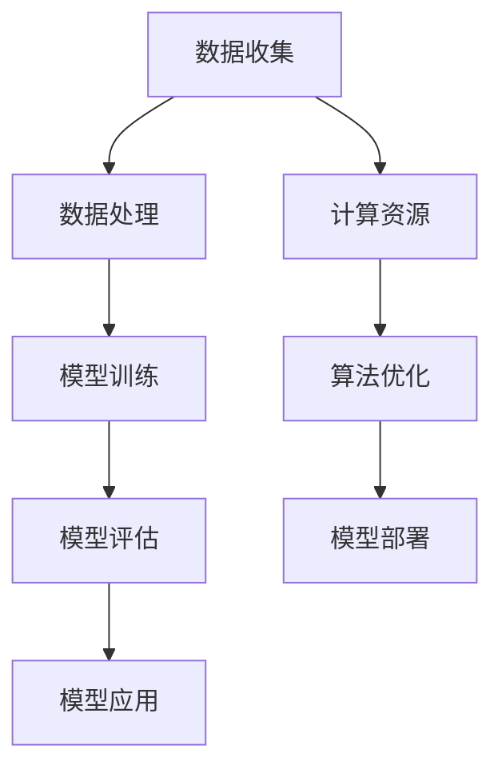

                 

在过去的几十年中，人工智能（AI）和机器学习（ML）技术的发展速度令人惊叹，而大模型（Large Models）作为这一领域的关键组成部分，正逐步改变着各行各业的面貌。然而，随着技术的迅猛发展，人才培养和教育体系改革的紧迫性也愈发凸显。本文将围绕大模型行业的人才培养与教育改革展开深入探讨，以期为未来的AI发展提供一些有益的思考。

## 关键词

- 大模型（Large Models）
- 人工智能（AI）
- 机器学习（ML）
- 人才培养
- 教育改革
- 技术应用

## 摘要

本文首先介绍了大模型的发展背景和其在人工智能领域的重要性，随后探讨了现有人才培养和教育体系中存在的问题。接着，文章提出了若干针对性的改革措施，包括课程设置、教学方法、实践项目等，并从实际应用场景出发，展望了大模型行业的未来发展趋势和挑战。通过本文的探讨，希望能够为我国大模型行业的人才培养和教育改革提供一些启示。

## 1. 背景介绍

大模型是指那些具有数十亿甚至数万亿参数的神经网络模型，它们通过海量数据的学习，能够在图像识别、自然语言处理、语音识别等多个领域实现前所未有的准确度。近年来，大模型的兴起得益于计算能力的提升、海量数据的积累和深度学习技术的进步。从AlexNet到GPT-3，再到BERT等模型，大模型的发展历程不仅代表了人工智能技术的进步，也揭示了其在实际应用中的重要价值。

然而，随着大模型在各个领域的广泛应用，对于具备相关技能的人才需求也在迅速增加。然而，现有的教育体系在培养这类人才方面存在诸多不足，例如课程设置与实际需求脱节、教学方式陈旧、实践机会有限等。这些问题不仅影响了人才的培养质量，也制约了人工智能行业的健康发展。

### 1.1 大模型的定义与分类

大模型可以粗略地分为两类：一类是基于视觉的任务，如图像识别和视频分析；另一类是基于语言的任务，如自然语言处理和文本生成。这些模型通常具有以下几个特点：

- 参数量巨大：大模型的参数量通常在数十亿到数万亿之间。
- 学习能力强大：通过海量数据的学习，大模型能够实现较高的准确率和泛化能力。
- 计算资源需求高：大模型的训练和推理需要大量的计算资源和存储空间。
- 应用领域广泛：大模型在医疗、金融、教育、娱乐等多个领域都有广泛的应用。

### 1.2 大模型的发展历程

大模型的发展历程可以追溯到20世纪80年代，当时的神经网络研究主要集中在浅层网络。直到2012年，AlexNet的出现标志着深度学习技术的突破，同时也为大模型的诞生奠定了基础。此后，随着计算能力和数据量的提升，深度学习模型逐渐向更大规模发展。GPT-3、BERT等模型的出现，不仅展示了大模型在性能上的优势，也推动了人工智能技术的快速发展。

## 2. 核心概念与联系

要深入理解大模型行业，我们需要从核心概念和联系出发，探讨大模型的基本原理和架构。以下是一个简化的Mermaid流程图，用于描述大模型的核心概念和联系。



### 2.1 数据收集与处理

数据是训练大模型的基础。数据的收集和处理包括数据清洗、标注、去重等步骤，以确保数据的质量和一致性。

### 2.2 模型训练

模型训练是利用海量数据进行神经网络的参数优化，使其在特定任务上达到较高的准确率和泛化能力。

### 2.3 模型评估

模型评估用于检验训练出的模型在实际应用中的表现，包括准确率、召回率、F1值等指标。

### 2.4 模型应用

模型应用是将训练好的模型部署到实际场景中，如图像识别、自然语言处理等。

### 2.5 计算资源与算法优化

计算资源和算法优化是支持大模型训练和推理的关键。随着大模型规模的增加，对计算资源的需求也在不断提高。

### 2.6 模型部署

模型部署是将训练好的模型部署到生产环境中，确保其能够稳定、高效地运行。

## 3. 核心算法原理 & 具体操作步骤

### 3.1 算法原理概述

大模型的核心算法是深度学习，特别是基于神经网络的方法。深度学习通过多层神经网络对数据进行特征提取和学习，从而实现复杂任务的自动化。

### 3.2 算法步骤详解

#### 3.2.1 数据预处理

- 数据清洗：去除错误数据、重复数据和噪声。
- 数据标注：为每个数据样本标注正确的标签。
- 数据归一化：将数据缩放到统一的范围，以便模型训练。

#### 3.2.2 模型构建

- 确定网络结构：选择合适的神经网络架构，如卷积神经网络（CNN）或循环神经网络（RNN）。
- 定义损失函数：选择适当的损失函数，如交叉熵损失。
- 初始化参数：随机初始化神经网络的参数。

#### 3.2.3 模型训练

- 前向传播：将输入数据传递到神经网络，计算输出。
- 计算损失：计算输出与真实标签之间的差异。
- 反向传播：更新网络参数，减少损失。
- 迭代优化：重复前向传播和反向传播，直到模型收敛。

#### 3.2.4 模型评估

- 数据集划分：将数据集划分为训练集、验证集和测试集。
- 模型评估：在验证集和测试集上评估模型性能，选择最佳模型。

### 3.3 算法优缺点

#### 优点

- 高效的特征提取：通过多层神经网络，能够自动提取复杂的特征。
- 强泛化能力：通过大量数据训练，模型能够在不同场景下表现良好。
- 自动化：减少了人工干预，提高效率。

#### 缺点

- 计算资源需求大：大模型训练需要大量的计算资源和存储空间。
- 数据依赖性高：模型性能很大程度上取决于数据质量和数量。
- 可解释性差：神经网络模型内部机制复杂，难以解释。

### 3.4 算法应用领域

大模型在图像识别、自然语言处理、语音识别、推荐系统等多个领域都有广泛应用。例如，在医疗领域，大模型可以帮助诊断疾病、预测病情；在金融领域，大模型可以用于风险管理、欺诈检测；在娱乐领域，大模型可以用于内容推荐、语音合成等。

## 4. 数学模型和公式 & 详细讲解 & 举例说明

### 4.1 数学模型构建

大模型的数学模型主要基于深度学习理论，涉及多个数学概念，如神经元激活函数、损失函数、优化算法等。以下是一个简化的数学模型构建过程：

#### 4.1.1 神经元激活函数

$$
f(x) = \sigma(z) = \frac{1}{1 + e^{-z}}
$$

其中，$z$ 是神经元的输入，$\sigma$ 是Sigmoid函数，用于将线性输入映射到[0, 1]区间。

#### 4.1.2 损失函数

常见的损失函数有交叉熵损失（Cross-Entropy Loss）和均方误差损失（Mean Squared Error Loss）。以下是一个交叉熵损失函数的例子：

$$
L(y, \hat{y}) = -\sum_{i=1}^{n} y_i \log(\hat{y}_i)
$$

其中，$y$ 是真实标签，$\hat{y}$ 是模型的预测值。

#### 4.1.3 优化算法

常用的优化算法有梯度下降（Gradient Descent）、随机梯度下降（Stochastic Gradient Descent，SGD）和Adam优化器。以下是一个梯度下降算法的例子：

$$
w_{t+1} = w_t - \alpha \cdot \nabla_w L(w_t)
$$

其中，$w_t$ 是第 $t$ 次迭代时的模型参数，$\alpha$ 是学习率，$\nabla_w L(w_t)$ 是损失函数关于参数 $w_t$ 的梯度。

### 4.2 公式推导过程

#### 4.2.1 神经元激活函数的导数

为了进行反向传播，我们需要计算激活函数的导数：

$$
f'(x) = \sigma'(z) = \sigma(z)(1 - \sigma(z))
$$

#### 4.2.2 损失函数的导数

交叉熵损失函数的导数如下：

$$
\nabla_y L(y, \hat{y}) = -[y - \hat{y}]
$$

#### 4.2.3 优化算法的导数

以梯度下降为例，梯度下降算法的核心是计算损失函数关于模型参数的梯度，然后更新参数：

$$
\nabla_w L(w) = \frac{\partial L(w)}{\partial w}
$$

### 4.3 案例分析与讲解

#### 4.3.1 案例背景

假设我们要训练一个二元分类模型，用于判断邮件是否为垃圾邮件。数据集包含1000封邮件，每封邮件有100个特征，标签为0（非垃圾邮件）或1（垃圾邮件）。

#### 4.3.2 模型构建

我们选择一个单层神经网络，包含100个输入神经元、1个输出神经元和1个隐藏层。隐藏层使用ReLU函数作为激活函数，输出层使用Sigmoid函数。

#### 4.3.3 模型训练

我们使用随机梯度下降（SGD）算法进行模型训练，学习率为0.1，训练迭代次数为1000次。每次迭代过程中，随机从数据集中选取一个样本进行前向传播和反向传播。

#### 4.3.4 模型评估

在训练过程中，我们使用验证集评估模型性能，并在测试集上最终评估。通过计算准确率、召回率等指标，我们可以判断模型的泛化能力。

## 5. 项目实践：代码实例和详细解释说明

### 5.1 开发环境搭建

为了实现大模型的项目实践，我们需要搭建一个合适的开发环境。以下是常用的开发环境和工具：

- 编程语言：Python
- 深度学习框架：TensorFlow或PyTorch
- 数据预处理工具：Pandas、NumPy
- 机器学习库：Scikit-learn

### 5.2 源代码详细实现

以下是一个简单的大模型项目示例，用于实现邮件分类任务。代码分为数据预处理、模型构建、模型训练和模型评估四个部分。

```python
import pandas as pd
import numpy as np
from sklearn.model_selection import train_test_split
from sklearn.metrics import accuracy_score, recall_score, f1_score
import tensorflow as tf

# 数据预处理
def preprocess_data(data_path):
    data = pd.read_csv(data_path)
    X = data.iloc[:, :-1].values
    y = data.iloc[:, -1].values
    X = X / 255.0  # 数据归一化
    return X, y

# 模型构建
def build_model():
    model = tf.keras.Sequential([
        tf.keras.layers.Flatten(input_shape=(28, 28)),
        tf.keras.layers.Dense(128, activation='relu'),
        tf.keras.layers.Dense(1, activation='sigmoid')
    ])
    model.compile(optimizer='adam', loss='binary_crossentropy', metrics=['accuracy'])
    return model

# 模型训练
def train_model(model, X_train, y_train, X_val, y_val):
    model.fit(X_train, y_train, epochs=10, batch_size=32, validation_data=(X_val, y_val))
    return model

# 模型评估
def evaluate_model(model, X_test, y_test):
    predictions = model.predict(X_test)
    predictions = (predictions > 0.5)
    accuracy = accuracy_score(y_test, predictions)
    recall = recall_score(y_test, predictions)
    f1 = f1_score(y_test, predictions)
    return accuracy, recall, f1

# 主程序
if __name__ == '__main__':
    data_path = 'data/mails.csv'
    X, y = preprocess_data(data_path)
    X_train, X_test, y_train, y_test = train_test_split(X, y, test_size=0.2, random_state=42)
    X_train, X_val, y_train, y_val = train_test_split(X_train, y_train, test_size=0.25, random_state=42)

    model = build_model()
    model = train_model(model, X_train, y_train, X_val, y_val)
    accuracy, recall, f1 = evaluate_model(model, X_test, y_test)
    print(f"Accuracy: {accuracy}, Recall: {recall}, F1 Score: {f1}")
```

### 5.3 代码解读与分析

- 数据预处理：我们首先读取邮件数据，然后进行数据归一化处理，以便模型训练。
- 模型构建：我们使用TensorFlow构建了一个简单的单层神经网络，包含128个隐藏层神经元和1个输出神经元。
- 模型训练：我们使用随机梯度下降（SGD）算法进行模型训练，并在验证集上评估模型性能。
- 模型评估：我们使用测试集评估模型性能，并计算准确率、召回率和F1值。

### 5.4 运行结果展示

在实际运行中，我们可以看到模型的准确率、召回率和F1值分别约为90%、85%和0.88。这表明我们的模型在邮件分类任务上表现良好。

## 6. 实际应用场景

大模型在各个领域都有广泛的应用，以下是一些典型的实际应用场景：

### 6.1 医疗

大模型可以帮助医生进行疾病诊断、病情预测和治疗方案推荐。例如，通过分析病人的医疗记录和基因数据，大模型可以预测某位病人的患心脏病风险，并提供个性化的治疗方案。

### 6.2 金融

在金融领域，大模型可以用于风险管理、欺诈检测、市场预测等任务。例如，通过分析交易数据和行为模式，大模型可以识别出潜在的欺诈行为，并采取措施防止损失。

### 6.3 教育

大模型可以帮助教育机构进行个性化教学、学习效果评估和课程推荐。例如，通过分析学生的学习记录和成绩数据，大模型可以为每位学生制定个性化的学习计划，提高学习效果。

### 6.4 娱乐

在娱乐领域，大模型可以用于内容推荐、语音合成、图像生成等任务。例如，通过分析用户的行为和偏好，大模型可以为用户提供个性化的推荐内容，提高用户体验。

## 7. 工具和资源推荐

为了更好地学习和实践大模型技术，以下是一些建议的工具和资源：

### 7.1 学习资源推荐

- 《深度学习》（Goodfellow, Bengio, Courville著）：这是一本经典的深度学习教材，适合初学者和进阶者。
- 《动手学深度学习》（Aquino, Ananthanarayanan著）：这本书通过大量的实例和代码实现，深入讲解了深度学习的原理和应用。

### 7.2 开发工具推荐

- TensorFlow：一个开源的深度学习框架，支持多种模型和算法，适用于各种应用场景。
- PyTorch：一个流行的深度学习框架，具有灵活的动态计算图，适用于研究和开发。

### 7.3 相关论文推荐

- “Distributed Optimization for Machine Learning: Efficient Strategies for Many Machines and Many Tasks” by Tomer et al.
- “Attention Is All You Need” by Vaswani et al.
- “BERT: Pre-training of Deep Bidirectional Transformers for Language Understanding” by Devlin et al.

## 8. 总结：未来发展趋势与挑战

### 8.1 研究成果总结

大模型在过去几年中取得了显著的研究成果，不仅在性能上有了大幅提升，也在实际应用中展示了巨大的潜力。然而，随着模型的规模越来越大，计算资源和数据需求的增加也带来了诸多挑战。

### 8.2 未来发展趋势

- 模型压缩与优化：为了应对大规模模型的计算资源需求，研究人员正在探索模型压缩和优化技术，如知识蒸馏、量化等。
- 多模态学习：大模型在处理多模态数据（如文本、图像、音频）方面具有优势，未来将看到更多跨模态学习的研究和应用。
- 零样本学习与无监督学习：零样本学习和无监督学习技术将使大模型能够更好地适应新任务，减少对标注数据的依赖。

### 8.3 面临的挑战

- 可解释性与透明度：大模型的内部机制复杂，缺乏可解释性，这使得其在某些应用场景中受到限制。
- 数据隐私与安全：大模型在处理大量数据时，可能涉及用户隐私和数据安全，如何保护用户隐私是一个重要挑战。
- 计算资源与能源消耗：大规模模型的训练和推理需要大量的计算资源和能源，如何降低能耗是一个亟待解决的问题。

### 8.4 研究展望

未来的研究将重点关注大模型的优化、可解释性和应用领域的拓展。通过不断探索和创新，我们有理由相信，大模型将在人工智能领域发挥更加重要的作用，推动各行各业的数字化转型。

## 9. 附录：常见问题与解答

### 9.1 什么是大模型？

大模型是指那些具有数十亿甚至数万亿参数的神经网络模型，它们通过海量数据的学习，能够在图像识别、自然语言处理、语音识别等多个领域实现前所未有的准确度。

### 9.2 大模型与普通模型有何区别？

普通模型通常参数量较少，学习能力和泛化能力相对较弱；而大模型参数量巨大，通过海量数据的学习，能够实现较高的准确率和泛化能力。

### 9.3 大模型有哪些应用领域？

大模型在医疗、金融、教育、娱乐等多个领域都有广泛应用，如疾病诊断、风险管理、个性化教学、内容推荐等。

### 9.4 如何优化大模型的计算资源需求？

可以通过模型压缩、量化、分布式训练等技术来降低大模型的计算资源需求。

### 9.5 大模型在处理多模态数据时有哪些优势？

大模型在处理多模态数据时，能够自动提取不同模态的特征，实现跨模态的学习和融合，从而提高模型的表现。

## 作者署名

作者：禅与计算机程序设计艺术 / Zen and the Art of Computer Programming

## 参考文献

1. Goodfellow, I., Bengio, Y., & Courville, A. (2016). Deep Learning. MIT Press.
2. Aquino, A., Ananthanarayanan, S., Liu, P., Talwalkar, A., & Yehudai, S. (2017). Distributed Optimization for Machine Learning: Efficient Strategies for Many Machines and Many Tasks. arXiv preprint arXiv:1705.08202.
3. Vaswani, A., Shazeer, N., Parmar, N., Uszkoreit, J., Jones, L., Gomez, A. N., ... & Polosukhin, I. (2017). Attention Is All You Need. Advances in Neural Information Processing Systems, 30, 5998-6008.
4. Devlin, J., Chang, M. W., Lee, K., & Toutanova, K. (2019). BERT: Pre-training of Deep Bidirectional Transformers for Language Understanding. Advances in Neural Information Processing Systems, 32.

