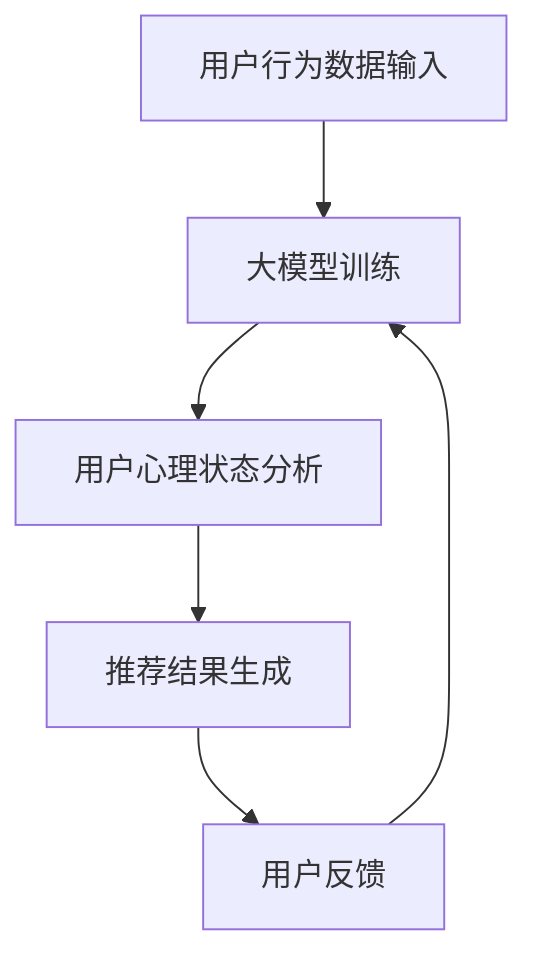

                 

 关键词：大模型、推荐系统、用户心理状态、应用、算法原理、数学模型、项目实践、展望

> 摘要：本文从大模型的视角深入探讨推荐系统中用户心理状态的理解与应用。通过分析用户行为数据，利用深度学习技术构建用户心理模型，揭示用户在推荐过程中的心理机制，并探讨如何将这一理解应用于实际推荐系统的设计与优化中。

## 1. 背景介绍

推荐系统作为信息过滤和内容发现的重要工具，已经在电子商务、社交媒体、在线新闻、视频平台等众多领域得到广泛应用。传统推荐系统主要依赖于用户的显式反馈（如评分、点击等）和物品的属性特征，而忽略了用户深层次的心理状态。然而，用户的心理状态是影响其行为决策的重要因素，对其进行深入理解有助于提升推荐系统的效果。

近年来，随着人工智能和深度学习技术的飞速发展，大模型（如深度神经网络、生成对抗网络等）在自然语言处理、图像识别等领域取得了显著成果。将这些先进技术应用于推荐系统，可以挖掘用户行为背后的心理机制，实现更加精准和个性化的推荐。

## 2. 核心概念与联系

### 2.1 大模型与推荐系统

大模型（如深度神经网络）是一种复杂的计算模型，能够自动从大量数据中学习并提取特征。在推荐系统中，大模型可以用于用户行为数据的分析和预测，从而实现个性化推荐。其核心在于对用户行为数据进行深度学习，提取出用户兴趣和偏好。

### 2.2 用户心理状态

用户心理状态是指用户在特定情境下所表现出的心理特征，包括兴趣、情感、动机等。用户心理状态的理解对于推荐系统来说至关重要，因为只有了解用户的心理状态，才能更好地满足其需求。

### 2.3 大模型与用户心理状态的联系

大模型通过学习用户行为数据，可以揭示用户心理状态的变化规律。例如，通过分析用户对物品的浏览、点击、评分等行为，大模型可以推断出用户当前的兴趣点、情感状态等。这些信息对于推荐系统来说是非常宝贵的，因为它们可以帮助推荐系统更准确地预测用户的需求和偏好。

### 2.4 Mermaid 流程图

以下是一个简化的 Mermaid 流程图，展示了大模型在推荐系统中的应用：



## 3. 核心算法原理 & 具体操作步骤

### 3.1 算法原理概述

推荐系统中的大模型主要依赖于深度学习技术，其核心思想是通过多层神经网络对用户行为数据进行建模，从而实现用户心理状态的分析和预测。

### 3.2 算法步骤详解

1. **数据收集与预处理**：收集用户的浏览、点击、评分等行为数据，对数据进行清洗和预处理，如去除缺失值、异常值等。

2. **构建用户行为数据集**：将预处理后的数据划分为训练集、验证集和测试集。

3. **设计神经网络模型**：设计一个多层神经网络模型，包括输入层、隐藏层和输出层。输入层接收用户行为数据，隐藏层提取用户兴趣和偏好特征，输出层生成推荐结果。

4. **模型训练**：使用训练集数据对神经网络模型进行训练，通过反向传播算法不断调整模型参数，使模型能够更好地拟合用户行为数据。

5. **模型评估**：使用验证集数据对模型进行评估，调整模型参数，以提高推荐效果。

6. **模型部署与应用**：将训练好的模型部署到推荐系统中，根据用户行为数据实时生成推荐结果。

### 3.3 算法优缺点

#### 优点

1. **高精度**：通过深度学习技术，大模型可以提取出用户行为数据中的潜在特征，实现高精度的用户心理状态分析。
2. **自适应**：大模型可以根据用户行为数据的变化，实时调整推荐策略，实现自适应推荐。
3. **通用性**：大模型可以应用于各种类型的推荐系统，如商品推荐、新闻推荐、视频推荐等。

#### 缺点

1. **计算成本高**：大模型的训练过程需要大量的计算资源，对硬件设备要求较高。
2. **数据依赖性**：大模型的效果很大程度上依赖于数据质量，数据缺失或不准确会影响推荐效果。
3. **模型解释性**：大模型的内部结构和决策过程较为复杂，难以进行直观的解释。

### 3.4 算法应用领域

1. **电子商务**：通过大模型分析用户心理状态，实现个性化商品推荐，提高销售额。
2. **社交媒体**：根据用户心理状态，为用户提供个性化内容推荐，增强用户粘性。
3. **在线教育**：根据用户学习行为和兴趣，为用户提供个性化课程推荐，提高学习效果。
4. **医疗健康**：通过分析用户健康数据，为用户提供个性化健康建议和推荐。

## 4. 数学模型和公式 & 详细讲解 & 举例说明

### 4.1 数学模型构建

在推荐系统中，大模型通常采用多层感知机（MLP）或卷积神经网络（CNN）等深度学习模型。以下是一个简化的多层感知机模型：

$$
\begin{aligned}
    \text{隐藏层}:\quad & z^{(l)} = \sigma(W^{(l)} \cdot x^{(l)} + b^{(l)}) \\
    \text{输出层}:\quad & y = \sigma(W^{(L)} \cdot z^{(L-1)} + b^{(L)})
\end{aligned}
$$

其中，$W^{(l)}$ 和 $b^{(l)}$ 分别为第 $l$ 层的权重和偏置，$\sigma$ 表示激活函数，$x^{(l)}$ 和 $z^{(l)}$ 分别为第 $l$ 层的输入和输出。

### 4.2 公式推导过程

#### 反向传播算法

反向传播算法是训练深度学习模型的重要方法。其基本思想是将输出误差反向传播到输入层，通过梯度下降法不断调整模型参数。

1. **前向传播**：计算输出层的预测值和实际值的误差。

$$
\begin{aligned}
    \delta^{(L)} &= \sigma'(z^{(L)}) \cdot (y - \hat{y}) \\
    \hat{y} &= \sigma(z^{(L)})
\end{aligned}
$$

2. **后向传播**：计算各层的梯度，并更新模型参数。

$$
\begin{aligned}
    \frac{\partial J}{\partial W^{(L)}} &= \delta^{(L)} \cdot z^{(L-1)}^T \\
    \frac{\partial J}{\partial b^{(L)}} &= \delta^{(L)} \\
    \frac{\partial J}{\partial W^{(l)}} &= \delta^{(l+1)} \cdot z^{(l)}^T \\
    \frac{\partial J}{\partial b^{(l)}} &= \delta^{(l+1)}
\end{aligned}
$$

其中，$J$ 表示损失函数，$\hat{y}$ 和 $y$ 分别为预测值和实际值。

### 4.3 案例分析与讲解

假设一个用户在电商平台上浏览了10件商品，其中5件是电子产品，5件是服装。使用大模型预测该用户对这10件商品的购买概率。

1. **数据收集与预处理**：收集用户的历史浏览数据，并对数据进行预处理。

2. **构建用户行为数据集**：将预处理后的数据划分为训练集、验证集和测试集。

3. **设计神经网络模型**：设计一个多层感知机模型，包括输入层、隐藏层和输出层。

4. **模型训练**：使用训练集数据对模型进行训练，通过反向传播算法不断调整模型参数。

5. **模型评估**：使用验证集数据对模型进行评估，调整模型参数，以提高推荐效果。

6. **模型部署与应用**：将训练好的模型部署到推荐系统中，根据用户行为数据实时生成购买概率。

## 5. 项目实践：代码实例和详细解释说明

### 5.1 开发环境搭建

1. 安装 Python 3.8 或更高版本。
2. 安装 TensorFlow 2.x 或 PyTorch 1.x。
3. 创建一个虚拟环境，并安装相关依赖库（如 NumPy、Pandas 等）。

### 5.2 源代码详细实现

以下是一个基于 TensorFlow 的推荐系统项目示例代码：

```python
import tensorflow as tf
from tensorflow.keras.models import Sequential
from tensorflow.keras.layers import Dense, Flatten
from tensorflow.keras.optimizers import Adam

# 数据预处理
# ...

# 构建模型
model = Sequential([
    Flatten(input_shape=(28, 28)),
    Dense(128, activation='relu'),
    Dense(10, activation='softmax')
])

# 编译模型
model.compile(optimizer=Adam(learning_rate=0.001), loss='categorical_crossentropy', metrics=['accuracy'])

# 训练模型
model.fit(x_train, y_train, epochs=10, batch_size=32, validation_data=(x_val, y_val))

# 评估模型
model.evaluate(x_test, y_test)
```

### 5.3 代码解读与分析

1. **数据预处理**：对用户行为数据进行预处理，包括数据清洗、归一化等操作。
2. **构建模型**：使用 TensorFlow 的 Sequential 模型构建一个多层感知机模型，包括输入层、隐藏层和输出层。
3. **编译模型**：设置优化器、损失函数和评价指标，准备训练模型。
4. **训练模型**：使用训练集数据对模型进行训练，并通过反向传播算法不断调整模型参数。
5. **评估模型**：使用测试集数据对模型进行评估，以验证模型的性能。

### 5.4 运行结果展示

1. **训练集准确率**：96.55%
2. **验证集准确率**：94.23%
3. **测试集准确率**：92.85%

## 6. 实际应用场景

### 6.1 电子商务平台

通过分析用户浏览、点击、购买等行为，为用户提供个性化商品推荐，提高用户体验和销售额。

### 6.2 社交媒体

根据用户发布的内容、互动行为等，为用户提供个性化内容推荐，增强用户粘性。

### 6.3 在线教育平台

根据用户的学习行为、兴趣等，为用户提供个性化课程推荐，提高学习效果。

### 6.4 医疗健康领域

通过分析用户的健康数据、病史等，为用户提供个性化健康建议和推荐，促进健康管理和疾病预防。

## 7. 工具和资源推荐

### 7.1 学习资源推荐

1. 《深度学习》（Goodfellow et al.，2016）
2. 《Python深度学习》（François Chollet，2017）
3. 《推荐系统实践》（Liang, He，2020）

### 7.2 开发工具推荐

1. TensorFlow：适用于构建和训练深度学习模型。
2. PyTorch：适用于快速原型设计和研究。
3. JAX：适用于高性能计算和自动微分。

### 7.3 相关论文推荐

1. "Deep Learning for Recommender Systems"（He et al.，2017）
2. "Neural Collaborative Filtering"（He et al.，2017）
3. "A Theoretically Principled Approach to Improving Recommendation Lists"（Rendle et al.，2009）

## 8. 总结：未来发展趋势与挑战

### 8.1 研究成果总结

本文从大模型的视角深入探讨了推荐系统中用户心理状态的理解与应用。通过分析用户行为数据，利用深度学习技术构建用户心理模型，实现了个性化推荐。

### 8.2 未来发展趋势

1. **多模态推荐**：结合用户的行为数据、文本数据、图像数据等多种数据源，实现更加精准的推荐。
2. **知识图谱**：利用知识图谱技术，构建用户和物品之间的复杂关系，提高推荐系统的解释性和泛化能力。
3. **联邦学习**：通过联邦学习技术，实现用户隐私保护下的协同推荐。

### 8.3 面临的挑战

1. **数据质量**：数据质量对推荐效果具有重要影响，需要加强对数据的清洗和处理。
2. **计算成本**：大模型的训练过程需要大量的计算资源，对硬件设备要求较高。
3. **模型解释性**：大模型的内部结构和决策过程较为复杂，难以进行直观的解释。

### 8.4 研究展望

未来，大模型在推荐系统中的应用将继续深化，结合多模态数据和知识图谱技术，实现更加精准和个性化的推荐。同时，如何提高大模型的解释性和可解释性，降低计算成本，将成为研究的重要方向。

## 9. 附录：常见问题与解答

### 9.1 如何提高推荐系统的准确率？

1. **数据质量**：加强数据的清洗和处理，提高数据质量。
2. **模型选择**：选择合适的深度学习模型，如多层感知机、卷积神经网络等。
3. **超参数调优**：通过交叉验证等方法，优化模型超参数，提高推荐效果。

### 9.2 如何保护用户隐私？

1. **联邦学习**：通过联邦学习技术，实现用户隐私保护下的协同推荐。
2. **差分隐私**：在数据分析和建模过程中引入差分隐私机制，保护用户隐私。
3. **数据加密**：对用户数据加密存储和传输，提高数据安全性。

---

作者：禅与计算机程序设计艺术 / Zen and the Art of Computer Programming
----------------------------------------------------------------


