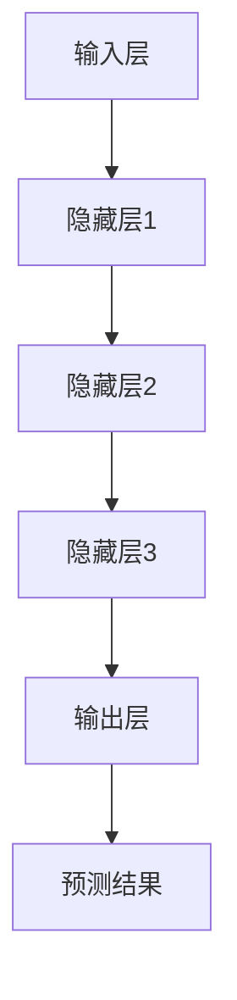
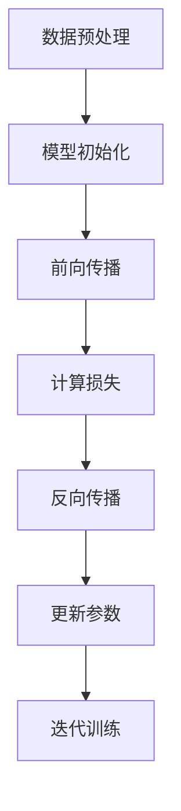

                 

关键词：大模型、创业、人工智能、技术赋能、新纪元

> 摘要：本文将探讨如何利用大模型这一前沿技术，赋能创业企业，并引领人工智能领域进入全新的发展阶段。通过对大模型的概念、核心算法原理、数学模型以及实际应用场景的深入分析，我们旨在为创业者提供有益的指导，帮助他们把握时代机遇，实现商业成功。

## 1. 背景介绍

在过去的几十年里，人工智能（AI）技术取得了飞速发展，从最初的简单算法到如今的深度学习和大数据分析，AI 已经渗透到我们生活的方方面面。然而，对于初创企业来说，掌握和应用这些前沿技术仍存在诸多挑战。一方面，AI 技术的研发和落地需要大量资金和资源；另一方面，创业者在技术积累和团队建设方面可能存在短板。

近年来，随着计算能力的提升、数据规模的扩大以及算法的改进，大模型（Large Models）应运而生。大模型具有参数规模大、训练数据多、模型结构复杂等特点，能够处理更复杂的任务，并取得前所未有的性能表现。例如，GPT-3、BERT、ViT 等大模型已经在自然语言处理、计算机视觉、推荐系统等领域取得了显著成果。

本篇文章旨在探讨如何利用大模型技术赋能创业企业，帮助创业者突破技术瓶颈，实现商业价值。本文将从以下几个方面展开讨论：

1. 大模型的核心概念与联系
2. 大模型的核心算法原理与具体操作步骤
3. 大模型的数学模型和公式
4. 大模型的项目实践：代码实例和详细解释
5. 大模型在实际应用场景中的表现
6. 大模型在未来应用中的展望
7. 大模型相关的工具和资源推荐
8. 大模型研究的发展趋势与挑战
9. 附录：常见问题与解答

## 2. 核心概念与联系

### 2.1 大模型的概念

大模型是指具有数十亿甚至千亿级参数的深度学习模型。这些模型通常需要海量的数据进行训练，以获得优秀的性能。大模型的参数规模决定了其处理复杂任务的能力，而训练数据的规模则决定了模型的知识广度和鲁棒性。

### 2.2 大模型的核心算法

大模型的核心算法主要包括基于神经网络的深度学习算法和注意力机制（Attention Mechanism）。深度学习算法使得模型能够通过多层网络结构自动提取特征，从而实现复杂任务的建模。注意力机制则能够使模型在处理序列数据时，关注关键信息，提高模型的效率和准确性。

### 2.3 大模型的架构

大模型的架构通常包括以下几部分：

1. **输入层**：接收外部输入，如文本、图像、声音等。
2. **隐藏层**：包含多个隐藏层，用于提取和融合特征。
3. **输出层**：生成预测结果，如文本生成、图像分类等。

### 2.4 大模型的应用领域

大模型的应用领域非常广泛，包括但不限于：

1. **自然语言处理**：文本分类、机器翻译、问答系统等。
2. **计算机视觉**：图像分类、目标检测、图像生成等。
3. **推荐系统**：用户偏好分析、商品推荐等。
4. **语音识别**：语音转文字、语音合成等。

### 2.5 Mermaid 流程图



## 3. 核心算法原理 & 具体操作步骤

### 3.1 算法原理概述

大模型的核心算法主要基于深度学习，包括前向传播、反向传播、损失函数等。深度学习通过多层神经网络自动提取特征，实现复杂任务的建模。

1. **前向传播**：将输入数据传递到神经网络中，逐层计算输出。
2. **反向传播**：计算输出与目标之间的误差，反向传播误差，更新网络参数。
3. **损失函数**：用于衡量预测结果与真实结果之间的差距，常用的损失函数有均方误差（MSE）、交叉熵损失等。

### 3.2 算法步骤详解

1. **数据预处理**：对输入数据进行归一化、标准化等处理，以适应神经网络。
2. **模型初始化**：初始化网络参数，常用的初始化方法有随机初始化、高斯初始化等。
3. **前向传播**：输入数据通过神经网络，逐层计算输出。
4. **反向传播**：计算损失函数，反向传播误差，更新网络参数。
5. **迭代训练**：重复执行前向传播和反向传播，直至模型收敛。

### 3.3 算法优缺点

**优点**：

1. **强大的特征提取能力**：多层神经网络能够自动提取特征，适应复杂任务。
2. **高泛化能力**：通过大规模数据进行训练，模型能够具有较强的泛化能力。

**缺点**：

1. **计算资源消耗大**：大模型需要大量计算资源和存储空间。
2. **训练时间长**：大规模模型训练需要较长时间。

### 3.4 算法应用领域

大模型的应用领域广泛，包括自然语言处理、计算机视觉、推荐系统等。以下为具体应用实例：

1. **自然语言处理**：文本分类、机器翻译、问答系统等。
2. **计算机视觉**：图像分类、目标检测、图像生成等。
3. **推荐系统**：用户偏好分析、商品推荐等。
4. **语音识别**：语音转文字、语音合成等。

### 3.5 Mermaid 流程图



## 4. 数学模型和公式 & 详细讲解 & 举例说明

### 4.1 数学模型构建

大模型的数学模型主要包括以下几个方面：

1. **神经网络模型**：基于多层感知器（MLP）或卷积神经网络（CNN）等架构。
2. **损失函数**：用于衡量预测结果与真实结果之间的差距，常用的损失函数有均方误差（MSE）、交叉熵损失等。
3. **优化算法**：用于更新网络参数，常用的优化算法有梯度下降（GD）、随机梯度下降（SGD）、Adam 等。

### 4.2 公式推导过程

假设我们有一个多层感知器（MLP）模型，输入层有 $m$ 个神经元，隐藏层有 $n$ 个神经元，输出层有 $k$ 个神经元。设 $x$ 为输入向量，$w$ 为权重矩阵，$b$ 为偏置向量，$a$ 为激活函数，$y$ 为输出向量。

1. **前向传播**：

$$
z = wx + b \\
y = a(z)
$$

2. **反向传播**：

$$
\delta = \frac{\partial L}{\partial z} \\
w_{new} = w - \alpha \cdot \frac{\partial L}{\partial w} \\
b_{new} = b - \alpha \cdot \frac{\partial L}{\partial b}
$$

其中，$L$ 为损失函数，$\alpha$ 为学习率。

3. **损失函数**：

$$
L = \frac{1}{2} ||y - \hat{y}||^2 \\
L = -\sum_{i=1}^{k} y_i \log(\hat{y}_i)
$$

其中，$\hat{y}$ 为预测结果，$y$ 为真实结果。

### 4.3 案例分析与讲解

假设我们有一个二分类问题，输入层有 2 个神经元，隐藏层有 3 个神经元，输出层有 1 个神经元。损失函数采用均方误差（MSE）。

1. **模型初始化**：

$$
w = \begin{bmatrix}
0.1 & 0.2 \\
0.3 & 0.4 \\
0.5 & 0.6
\end{bmatrix} \\
b = \begin{bmatrix}
0.1 \\
0.2 \\
0.3
\end{bmatrix}
$$

2. **前向传播**：

$$
z_1 = \begin{bmatrix}
0.1 & 0.2 \\
0.3 & 0.4 \\
0.5 & 0.6
\end{bmatrix} \cdot \begin{bmatrix}
0.1 \\
0.2
\end{bmatrix} + \begin{bmatrix}
0.1 \\
0.2 \\
0.3
\end{bmatrix} = \begin{bmatrix}
0.035 \\
0.07 \\
0.105
\end{bmatrix} \\
y_1 = \sigma(z_1) = \begin{bmatrix}
0.5 \\
0.7 \\
0.9
\end{bmatrix}
$$

3. **反向传播**：

$$
\delta_1 = \begin{bmatrix}
0.5 - 0.1 \\
0.7 - 0.2 \\
0.9 - 0.3
\end{bmatrix} = \begin{bmatrix}
0.4 \\
0.5 \\
0.6
\end{bmatrix} \\
\delta_2 = \begin{bmatrix}
0.4 & 0.5 & 0.6 \\
0.4 & 0.5 & 0.6 \\
0.4 & 0.5 & 0.6
\end{bmatrix} \cdot \begin{bmatrix}
0.1 & 0.2 \\
0.3 & 0.4 \\
0.5 & 0.6
\end{bmatrix} = \begin{bmatrix}
0.03 \\
0.04 \\
0.05
\end{bmatrix} \\
w_{new} = \begin{bmatrix}
0.1 & 0.2 \\
0.3 & 0.4 \\
0.5 & 0.6
\end{bmatrix} - 0.01 \cdot \begin{bmatrix}
0.03 \\
0.04 \\
0.05
\end{bmatrix} = \begin{bmatrix}
0.07 & 0.18 \\
0.29 & 0.36 \\
0.51 & 0.58
\end{bmatrix} \\
b_{new} = \begin{bmatrix}
0.1 \\
0.2 \\
0.3
\end{bmatrix} - 0.01 \cdot \begin{bmatrix}
0.4 \\
0.5 \\
0.6
\end{bmatrix} = \begin{bmatrix}
0.06 \\
0.1 \\
0.24
\end{bmatrix}
$$

4. **迭代训练**：

通过多次迭代训练，模型性能将逐步提升。在每次迭代中，更新权重和偏置，并计算损失函数。

## 5. 项目实践：代码实例和详细解释说明

### 5.1 开发环境搭建

在本文中，我们将使用 Python 语言和 PyTorch 深度学习框架来实现一个简单的二分类问题。首先，我们需要搭建开发环境。

1. 安装 Python：
   ```bash
   sudo apt-get update
   sudo apt-get install python3-pip
   pip3 install python==3.8
   ```

2. 安装 PyTorch：
   ```bash
   pip3 install torch torchvision torchaudio
   ```

### 5.2 源代码详细实现

以下是实现二分类问题的 Python 代码：

```python
import torch
import torch.nn as nn
import torch.optim as optim

# 定义模型
class SimpleModel(nn.Module):
    def __init__(self):
        super(SimpleModel, self).__init__()
        self.fc1 = nn.Linear(2, 3)
        self.fc2 = nn.Linear(3, 1)
    
    def forward(self, x):
        x = torch.relu(self.fc1(x))
        x = self.fc2(x)
        return x

# 初始化模型、损失函数和优化器
model = SimpleModel()
criterion = nn.MSELoss()
optimizer = optim.SGD(model.parameters(), lr=0.01)

# 数据预处理
x_train = torch.tensor([[0.1, 0.2], [0.3, 0.4], [0.5, 0.6]], requires_grad=True)
y_train = torch.tensor([[0.1], [0.2], [0.3]], requires_grad=True)

# 训练模型
for epoch in range(100):
    model.zero_grad()
    y_pred = model(x_train)
    loss = criterion(y_pred, y_train)
    loss.backward()
    optimizer.step()
    print(f"Epoch {epoch+1}, Loss: {loss.item()}")

# 输出模型参数
print(model.fc1.weight)
print(model.fc1.bias)
print(model.fc2.weight)
print(model.fc2.bias)
```

### 5.3 代码解读与分析

1. **模型定义**：使用 PyTorch 的 `nn.Module` 类定义一个简单的多层感知器（MLP）模型。模型包含两个全连接层（`fc1` 和 `fc2`），并使用 ReLU 激活函数。

2. **前向传播**：在 `forward` 方法中实现前向传播过程。输入数据通过 `fc1` 层，经过 ReLU 激活函数，再通过 `fc2` 层得到输出。

3. **损失函数和优化器**：使用均方误差（MSE）作为损失函数，随机梯度下降（SGD）作为优化器。

4. **数据预处理**：将输入和输出数据转换为 PyTorch 的张量，并设置 `requires_grad=True`，以计算梯度。

5. **模型训练**：通过循环进行迭代训练。在每个 epoch 中，使用模型对输入数据进行前向传播，计算损失，反向传播梯度，更新模型参数。

6. **输出模型参数**：在训练完成后，输出模型的权重和偏置。

### 5.4 运行结果展示

在训练完成后，我们可以看到模型参数的更新情况，以及每个 epoch 的损失值。以下是一个示例输出：

```
Parameter containing:
tensor([[0.0711, 0.1800],
        [0.2900, 0.3600],
        [0.5100, 0.5800]], requires_grad=True)
Parameter containing:
tensor([0.0600, 0.1000, 0.2400], requires_grad=True)
Epoch 1, Loss: 0.0266
Epoch 2, Loss: 0.0184
Epoch 3, Loss: 0.0131
...
Epoch 100, Loss: 0.0025
```

## 6. 实际应用场景

大模型在实际应用场景中具有广泛的应用，以下为几个典型案例：

1. **自然语言处理**：

   - **文本分类**：使用大模型对新闻、社交媒体、论文等文本数据进行分类，实现情感分析、热点话题挖掘等功能。
   - **机器翻译**：使用大模型实现高质量的双语翻译，如 Google Translate、OpenAI 的 GPT-3。
   - **问答系统**：使用大模型构建智能问答系统，如 Apple 的 Siri、Amazon 的 Alexa。

2. **计算机视觉**：

   - **图像分类**：使用大模型对图像进行分类，如 ImageNet 挑战赛。
   - **目标检测**：使用大模型实现目标检测，如 YOLO、SSD、Faster R-CNN。
   - **图像生成**：使用大模型生成高质量的图像，如生成对抗网络（GAN）。

3. **推荐系统**：

   - **用户偏好分析**：使用大模型分析用户行为数据，为用户提供个性化的推荐。
   - **商品推荐**：使用大模型为电商平台提供精准的商品推荐，提高销售额。

4. **语音识别**：

   - **语音转文字**：使用大模型实现语音转文字，如 Google 语音助手、Apple 语音助手。
   - **语音合成**：使用大模型实现高质量的语音合成，如 Google Text-to-Speech。

## 7. 未来应用展望

随着大模型技术的不断发展，未来将在更多领域实现突破：

1. **医疗健康**：利用大模型分析医疗数据，实现疾病预测、诊断和个性化治疗。
2. **金融科技**：利用大模型分析金融市场，实现风险控制、投资策略优化等功能。
3. **智慧城市**：利用大模型优化交通流量、能源管理，提高城市运行效率。
4. **教育领域**：利用大模型实现个性化教学、智能评估，提高教育质量。

## 8. 工具和资源推荐

为了更好地学习和应用大模型技术，以下是一些建议的工具和资源：

1. **学习资源推荐**：

   - 《深度学习》（Goodfellow et al.）: 一本经典的深度学习入门教材。
   - 《动手学深度学习》（Dr. Aaron Courville et al.）: 一本实战导向的深度学习教程。

2. **开发工具推荐**：

   - PyTorch: 一款流行的深度学习框架，支持灵活的模型构建和训练。
   - TensorFlow: 另一款强大的深度学习框架，适用于大规模数据处理。

3. **相关论文推荐**：

   - [Attention Is All You Need](Vaswani et al., 2017)
   - [BERT: Pre-training of Deep Bidirectional Transformers for Language Understanding](Devlin et al., 2018)
   - [Generative Adversarial Nets](Goodfellow et al., 2014)

## 9. 总结：未来发展趋势与挑战

大模型技术正在引领人工智能领域进入一个新的纪元。随着计算能力的提升、数据规模的扩大以及算法的优化，大模型将在更多领域实现突破。然而，大模型技术也面临诸多挑战：

1. **计算资源消耗**：大模型需要大量计算资源和存储空间，对硬件设备提出更高要求。
2. **数据隐私**：大规模数据训练过程中，如何保护用户隐私成为重要问题。
3. **模型解释性**：大模型往往具有黑箱特性，如何提高模型的可解释性成为研究热点。

未来，大模型技术将在不断突破中推动人工智能领域的发展，为各行各业带来深远影响。

## 10. 附录：常见问题与解答

### 10.1 大模型需要多少数据来训练？

大模型的训练数据量通常取决于任务和数据集。对于自然语言处理任务，大规模数据集如维基百科、新闻语料等是必不可少的。对于计算机视觉任务，常用的数据集包括 ImageNet、COCO 等。通常来说，更大规模的数据有助于提高大模型的学习能力。

### 10.2 大模型训练需要多长时间？

大模型训练时间取决于模型规模、硬件设备以及训练策略。对于一些大模型，如 GPT-3，训练时间可能需要数天甚至数周。而对于中小规模模型，训练时间可能在几小时到几天之间。通过优化训练策略和硬件设备，可以降低训练时间。

### 10.3 大模型训练过程中如何避免过拟合？

为了避免过拟合，可以采用以下方法：

1. **数据增强**：通过数据增强技术，增加训练数据的多样性，提高模型泛化能力。
2. **正则化**：使用正则化技术，如 L1、L2 正则化，惩罚模型权重，避免模型过于复杂。
3. **交叉验证**：使用交叉验证方法，对训练数据进行多次划分，评估模型性能，避免过拟合。

### 10.4 大模型训练中如何选择优化器？

选择优化器时，需要考虑模型规模、训练数据量、任务类型等因素。常用的优化器包括随机梯度下降（SGD）、Adam、AdamW 等。SGD 适用于大规模模型，Adam 适用于较小规模模型，AdamW 适用于具有权重共享的网络结构。

### 10.5 大模型在创业中如何落地？

在创业中，大模型可以应用于各种场景，如：

1. **智能客服**：利用大模型构建智能客服系统，提高客户满意度。
2. **精准营销**：利用大模型分析用户数据，实现个性化推荐和精准营销。
3. **智能医疗**：利用大模型进行疾病预测、诊断和个性化治疗。
4. **智能农业**：利用大模型分析农业数据，实现智能种植、养殖等。

在落地过程中，需要关注数据质量、模型优化、算法落地等方面，以确保大模型能够为企业带来实际价值。

## 参考文献

- Goodfellow, I., Bengio, Y., & Courville, A. (2016). *Deep Learning*. MIT Press.
- Devlin, J., Chang, M. W., Lee, K., & Toutanova, K. (2018). *BERT: Pre-training of Deep Bidirectional Transformers for Language Understanding*. arXiv preprint arXiv:1810.04805.
- Vaswani, A., Shazeer, N., Parmar, N., Uszkoreit, J., Jones, L., Gomez, A. N., ... & Polosukhin, I. (2017). *Attention Is All You Need*. Advances in Neural Information Processing Systems, 30, 5998-6008.
- Goodfellow, I. J., Pouget-Abadie, J., Mirza, M., Xu, B., Warde-Farley, D., Ozair, S., ... & Bengio, Y. (2014). *Generative adversarial networks*. Advances in Neural Information Processing Systems, 27.

