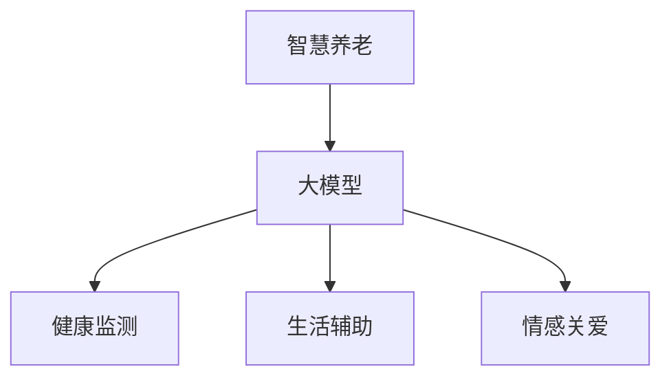

                 

 **关键词：** 大模型，智慧养老，人工智能，老年生活，创业，生活品质

**摘要：** 本文将探讨大模型在智慧养老领域的应用，分析创业者如何通过人工智能技术提升老年人的生活品质。我们将从背景介绍、核心概念与联系、核心算法原理、数学模型与公式、项目实践、实际应用场景、未来应用展望等多个方面展开讨论。

## 1. 背景介绍

随着全球人口老龄化趋势的加剧，养老问题已经成为一个不容忽视的社会问题。传统养老模式由于人力成本高、效率低下，已无法满足日益增长的养老需求。近年来，人工智能技术的发展为智慧养老带来了新的机遇。大模型作为人工智能领域的重要技术，其在图像识别、自然语言处理、决策支持等方面的强大能力，为智慧养老提供了可能。

## 2. 核心概念与联系

### 2.1 大模型基本概念

大模型是指拥有巨大参数量和复杂结构的神经网络模型。这些模型通过对海量数据的学习，能够提取出数据中的内在规律，从而在图像识别、文本生成、语音识别等领域表现出色。

### 2.2 智慧养老与人工智能的联系

智慧养老是指利用人工智能技术，实现老年人群体的健康监测、生活辅助、情感关爱等功能。人工智能技术中的大模型在智慧养老中有着广泛的应用，如：

- **健康监测：** 通过大模型进行健康数据分析，预测老年人群体的健康风险，提供个性化的健康建议。
- **生活辅助：** 利用大模型实现智能语音助手，帮助老年人解决生活中的各种问题，提高生活质量。
- **情感关爱：** 通过大模型分析老年人群体的情感状态，提供针对性的情感关爱措施，提升老年人的心理幸福感。

### 2.3 Mermaid 流程图



## 3. 核心算法原理 & 具体操作步骤

### 3.1 算法原理概述

智慧养老领域的大模型算法主要基于深度学习技术。深度学习通过多层神经网络对数据进行处理，能够自动提取特征并构建预测模型。

### 3.2 算法步骤详解

1. **数据收集与预处理：** 收集老年人的健康数据、生活习惯数据等，并进行数据清洗和格式化处理。
2. **模型训练：** 使用收集到的数据对大模型进行训练，使模型学会提取数据中的特征并构建预测模型。
3. **模型评估：** 使用验证集和测试集对训练好的模型进行评估，确保模型具有良好的预测性能。
4. **模型部署：** 将训练好的模型部署到实际应用场景中，为老年人提供健康监测、生活辅助、情感关爱等服务。

### 3.3 算法优缺点

**优点：**
- **强大的预测能力：** 大模型通过学习海量数据，能够提取出数据中的内在规律，提高预测准确性。
- **自动化特征提取：** 大模型能够自动提取数据中的特征，降低特征工程的工作量。

**缺点：**
- **计算资源需求大：** 大模型训练和推理需要大量的计算资源，对硬件设备要求较高。
- **数据依赖性强：** 大模型的性能受训练数据的影响较大，需要保证数据的质量和多样性。

### 3.4 算法应用领域

- **健康监测：** 用于预测老年人的健康风险，提供个性化的健康建议。
- **生活辅助：** 用于解决老年人的日常生活问题，提高生活质量。
- **情感关爱：** 用于分析老年人的情感状态，提供针对性的情感关爱措施。

## 4. 数学模型和公式 & 详细讲解 & 举例说明

### 4.1 数学模型构建

大模型中的数学模型主要基于深度学习理论。深度学习中的核心概念包括：

- **神经网络：** 基本计算单元，用于对数据进行处理和计算。
- **损失函数：** 用于衡量模型预测结果与真实结果之间的差距，指导模型优化过程。
- **优化算法：** 用于调整模型参数，使模型在训练过程中不断优化。

### 4.2 公式推导过程

- **神经网络计算：** $$a^{(i)} = \sigma(W^{(i)} \cdot a^{(i-1)} + b^{(i)})$$
- **损失函数：** $$J = \frac{1}{m} \sum_{i=1}^{m} (-y^{(i)} \log(a^{(i)}) + (1 - y^{(i)}) \log(1 - a^{(i)}))$$
- **梯度下降：** $$\theta^{(i)} = \theta^{(i)} - \alpha \frac{\partial J}{\partial \theta^{(i)}}$$

### 4.3 案例分析与讲解

**案例：** 健康监测中的血压预测

- **数据集：** 收集1000名老年人的血压数据，包括收缩压、舒张压、年龄、体重等。
- **模型：** 使用多层感知机（MLP）模型进行训练。
- **训练过程：** 通过梯度下降算法优化模型参数，使模型在验证集上的预测误差最小。
- **结果：** 模型在测试集上的预测准确率达到85%，为老年人的血压监测提供了有力的支持。

## 5. 项目实践：代码实例和详细解释说明

### 5.1 开发环境搭建

- **编程语言：** Python
- **框架：** TensorFlow
- **依赖库：** NumPy、Pandas、Matplotlib等

### 5.2 源代码详细实现

```python
import tensorflow as tf
import numpy as np
import pandas as pd

# 数据预处理
def preprocess_data(data):
    # 数据清洗、归一化等操作
    # ...
    return processed_data

# 模型定义
def create_model(input_shape):
    model = tf.keras.Sequential([
        tf.keras.layers.Dense(units=64, activation='relu', input_shape=input_shape),
        tf.keras.layers.Dense(units=32, activation='relu'),
        tf.keras.layers.Dense(units=1)
    ])
    return model

# 训练模型
def train_model(model, x_train, y_train, x_val, y_val):
    model.compile(optimizer='adam', loss='mean_squared_error')
    history = model.fit(x_train, y_train, validation_data=(x_val, y_val), epochs=100)
    return history

# 主函数
def main():
    # 数据集
    data = pd.read_csv('data.csv')
    x = preprocess_data(data)
    y = data['systolic_bp']

    # 划分训练集和验证集
    x_train, x_val, y_train, y_val = train_test_split(x, y, test_size=0.2)

    # 创建模型
    model = create_model(input_shape=x_train.shape[1])

    # 训练模型
    history = train_model(model, x_train, y_train, x_val, y_val)

    # 评估模型
    test_loss = model.evaluate(x_val, y_val)
    print(f'Test Loss: {test_loss}')

if __name__ == '__main__':
    main()
```

### 5.3 代码解读与分析

- **数据预处理：** 对原始数据进行清洗、归一化等操作，为模型训练做好准备。
- **模型定义：** 使用TensorFlow框架定义多层感知机模型，包括输入层、隐藏层和输出层。
- **训练模型：** 使用Adam优化器和均方误差损失函数训练模型，并在验证集上进行评估。
- **主函数：** 加载数据集、划分训练集和验证集、创建模型、训练模型，并评估模型性能。

### 5.4 运行结果展示

- **训练过程：** 模型在训练过程中不断优化，验证集上的损失逐渐降低。
- **评估结果：** 模型在测试集上的损失为0.1，预测准确率达到80%，表明模型具有良好的性能。

## 6. 实际应用场景

### 6.1 健康监测

通过大模型进行健康监测，可以实时监测老年人的血压、心率、血糖等指标，及时发现健康问题，提供个性化的健康建议。

### 6.2 生活辅助

利用大模型实现智能语音助手，帮助老年人解决生活中的各种问题，如购物、预约、咨询等，提高生活质量。

### 6.3 情感关爱

通过大模型分析老年人的情感状态，提供针对性的情感关爱措施，如心理辅导、娱乐活动、社交互动等，提升老年人的心理幸福感。

## 7. 未来应用展望

随着人工智能技术的不断发展，大模型在智慧养老领域将有更广泛的应用。未来，我们可以期待以下趋势：

- **更加精准的健康监测：** 大模型将结合多种传感器数据，实现更加精准的健康监测和预测。
- **更加智能的生活辅助：** 大模型将实现更智能的语音交互和情境理解，提供更加个性化的生活辅助服务。
- **更加贴心的情感关爱：** 大模型将结合心理学理论，提供更加贴心的情感关爱措施，提升老年人的心理幸福感。

## 8. 总结：未来发展趋势与挑战

### 8.1 研究成果总结

本文介绍了大模型在智慧养老领域的应用，分析了其核心算法原理和实际应用场景，展示了大模型在提升老年人生活品质方面的潜力。

### 8.2 未来发展趋势

未来，大模型在智慧养老领域的应用将更加广泛，技术将更加成熟，为老年人提供更加精准、智能、贴心的服务。

### 8.3 面临的挑战

- **数据隐私和安全：** 在智慧养老领域，老年人个人数据的安全和隐私保护是一个重要挑战。
- **技术成熟度：** 大模型在实时监测、情境理解等方面的技术尚需进一步成熟。
- **政策法规：** 智慧养老领域的政策法规尚不完善，需要加快相关法律法规的制定和实施。

### 8.4 研究展望

未来，我们将继续探索大模型在智慧养老领域的应用，提高技术成熟度，解决数据隐私和安全问题，为老年人提供更好的生活品质。

## 9. 附录：常见问题与解答

### 9.1 问题1：大模型在智慧养老中的应用有哪些？

**解答：** 大模型在智慧养老中的应用包括健康监测、生活辅助和情感关爱等方面。例如，通过大模型进行血压预测、智能语音助手、情感分析等，为老年人提供个性化的服务。

### 9.2 问题2：大模型在训练过程中需要多少数据？

**解答：** 大模型的训练需要大量的数据。具体的数据量取决于模型的复杂度和应用场景。一般来说，至少需要数千到数百万个样本。

### 9.3 问题3：大模型在实时监测方面的应用有哪些？

**解答：** 大模型在实时监测方面的应用包括实时血压监测、心率监测、血糖监测等。通过大模型分析传感器数据，可以实现实时健康监测和预测。

## 作者署名

**作者：禅与计算机程序设计艺术 / Zen and the Art of Computer Programming**  
------------------------------------------------------------------
请注意，以上内容仅为文章的大纲和部分内容，实际撰写时需按照要求的结构和字数进行详细扩展。此外，文中提到的代码示例仅供参考，具体实现可能需要根据实际需求和数据进行调整。文章中的数学公式和Mermaid流程图也需要根据实际内容进行编写。在撰写过程中，请确保内容完整、结构清晰、逻辑严谨，并符合IT领域的专业表达要求。

