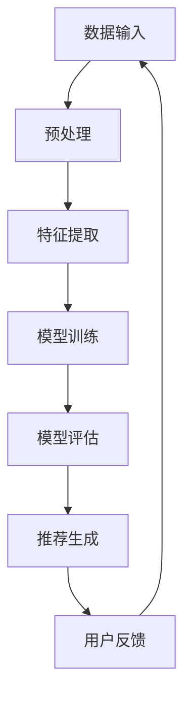

                 

关键词：推荐系统、用户群体发现、大模型、人工智能、数据分析

摘要：本文探讨了利用大模型技术辅助推荐系统进行用户群体发现的方法。通过对推荐系统中的用户行为数据进行分析，结合深度学习技术，构建了能够自动识别用户群体的大模型。本文介绍了大模型的基本原理、构建步骤、算法优缺点及其实际应用场景，并通过一个具体的案例展示了大模型的实现过程和效果。此外，本文还分析了大模型在推荐系统用户群体发现领域的未来发展趋势与挑战。

## 1. 背景介绍

在当今信息爆炸的时代，推荐系统作为一种重要的信息过滤和个性化服务工具，广泛应用于电子商务、社交媒体、在线视频等领域。推荐系统通过分析用户的历史行为数据，预测用户可能感兴趣的内容，从而提高用户满意度和系统转化率。然而，推荐系统在实际应用中面临着诸多挑战，其中之一就是如何准确识别和划分用户群体。

传统的推荐系统主要依赖于基于内容、协同过滤和基于模型的推荐方法。这些方法在一定程度上能够提高推荐效果，但往往依赖于先验知识，且在面对大规模、多维数据时表现不佳。近年来，随着人工智能技术的快速发展，尤其是深度学习技术的广泛应用，为解决推荐系统的用户群体发现问题提供了新的思路。

大模型（Large-scale Model）作为一种具有强大表示能力和学习能力的模型，能够从海量数据中提取出高层次的抽象特征，从而实现更准确的用户群体发现。本文将探讨如何利用大模型技术辅助推荐系统进行用户群体发现，以期提高推荐系统的性能和用户体验。

## 2. 核心概念与联系

### 2.1 大模型基本原理

大模型（Large-scale Model）是指具有大规模参数和高复杂度的深度学习模型。大模型通过自动学习海量数据中的高维特征，能够实现良好的泛化能力和表示能力。大模型的基本原理主要涉及以下几个方面：

1. **深度神经网络（Deep Neural Network，DNN）**：大模型通常采用深度神经网络作为基础结构，通过多层非线性变换提取数据特征。深度神经网络具有很好的表达能力，能够处理复杂数据模式。

2. **大规模训练数据**：大模型需要依赖大规模训练数据来学习数据特征。随着数据量的增加，模型的性能会得到显著提升。

3. **端到端学习（End-to-End Learning）**：大模型通常采用端到端的学习方式，将输入数据直接映射到输出结果，避免了传统机器学习方法的特征工程和模型选择过程。

4. **优化算法**：大模型训练过程中通常采用高效的优化算法，如随机梯度下降（Stochastic Gradient Descent，SGD）及其变种，以加速模型收敛。

### 2.2 大模型架构

大模型的架构主要包括以下几个部分：

1. **输入层（Input Layer）**：输入层接收用户行为数据，如浏览记录、点击行为、购买历史等。

2. **隐藏层（Hidden Layers）**：隐藏层通过多层神经网络结构对输入数据进行特征提取和变换。隐藏层的数量和神经元数量可以根据实际需求进行调整。

3. **输出层（Output Layer）**：输出层生成用户群体标签，如“高消费群体”、“低消费群体”等。

4. **损失函数（Loss Function）**：损失函数用于评估模型预测结果与真实标签之间的差距，如交叉熵损失函数、均方误差损失函数等。

5. **优化器（Optimizer）**：优化器用于调整模型参数，以最小化损失函数。常见的优化器有随机梯度下降、Adam优化器等。

### 2.3 大模型与推荐系统的关系

大模型与推荐系统之间具有密切的联系。大模型技术可以为推荐系统提供以下优势：

1. **提升推荐效果**：大模型能够从海量数据中提取高层次的抽象特征，从而提高推荐系统的预测准确性和效果。

2. **减少人工干预**：大模型采用端到端的学习方式，减少了传统推荐系统中的特征工程和模型选择过程，降低了人工干预的需求。

3. **自适应推荐**：大模型可以根据用户行为数据的实时更新，自适应调整推荐策略，提高推荐系统的动态响应能力。

4. **多模态数据融合**：大模型可以处理多种类型的数据，如文本、图像、音频等，实现多模态数据融合，提高推荐系统的多样性。

### 2.4 Mermaid 流程图



图2-1 大模型辅助推荐系统的流程图

## 3. 核心算法原理 & 具体操作步骤

### 3.1 算法原理概述

大模型辅助推荐系统的核心算法主要包括以下三个步骤：

1. **数据预处理**：对原始用户行为数据进行清洗、归一化等处理，以便后续特征提取。

2. **特征提取**：利用深度神经网络对预处理后的数据进行特征提取，生成高层次的抽象特征。

3. **模型训练与评估**：使用训练数据对深度学习模型进行训练，并通过评估数据验证模型性能，调整模型参数。

4. **推荐生成**：根据用户特征和模型预测结果生成个性化推荐。

### 3.2 算法步骤详解

#### 3.2.1 数据预处理

数据预处理主要包括以下步骤：

1. **数据清洗**：去除缺失值、异常值等无效数据。

2. **归一化**：对数值型特征进行归一化处理，如使用 Min-Max 归一化或标准差归一化。

3. **编码**：对类别型特征进行编码处理，如使用独热编码或标签编码。

4. **数据分片**：将数据集划分为训练集、验证集和测试集。

#### 3.2.2 特征提取

特征提取主要利用深度神经网络实现，具体步骤如下：

1. **构建深度神经网络**：定义神经网络结构，包括输入层、隐藏层和输出层。

2. **初始化模型参数**：初始化神经网络权重和偏置，可以使用随机初始化或预训练权重。

3. **前向传播**：输入数据通过神经网络进行前向传播，生成特征表示。

4. **反向传播**：根据模型损失函数计算梯度，通过反向传播更新模型参数。

5. **优化模型**：使用优化算法（如随机梯度下降、Adam优化器）优化模型参数，提高模型性能。

#### 3.2.3 模型训练与评估

模型训练与评估主要包括以下步骤：

1. **训练模型**：使用训练集数据对深度学习模型进行训练，不断调整模型参数，最小化损失函数。

2. **模型评估**：使用验证集数据对模型性能进行评估，如计算准确率、召回率、F1值等指标。

3. **模型调整**：根据模型评估结果，调整模型结构、参数设置等，优化模型性能。

4. **模型测试**：使用测试集数据对优化后的模型进行测试，验证模型性能。

#### 3.2.4 推荐生成

推荐生成主要包括以下步骤：

1. **特征提取**：对用户行为数据进行特征提取，生成高层次的抽象特征。

2. **模型预测**：使用训练好的深度学习模型对用户特征进行预测，得到用户群体标签。

3. **推荐生成**：根据用户群体标签生成个性化推荐结果。

### 3.3 算法优缺点

#### 优点

1. **高泛化能力**：大模型通过自动学习海量数据中的高维特征，具有良好的泛化能力，能够处理各种复杂数据模式。

2. **自适应推荐**：大模型可以实时更新用户特征和模型参数，实现自适应推荐，提高推荐系统的动态响应能力。

3. **减少人工干预**：大模型采用端到端的学习方式，减少了传统推荐系统中的特征工程和模型选择过程，降低了人工干预的需求。

4. **多模态数据融合**：大模型可以处理多种类型的数据，实现多模态数据融合，提高推荐系统的多样性。

#### 缺点

1. **计算资源消耗大**：大模型训练过程中需要大量的计算资源和存储空间，对硬件设备要求较高。

2. **模型解释性差**：大模型的训练过程高度复杂，模型内部参数和特征难以解释，导致模型的可解释性较差。

3. **数据依赖性强**：大模型的性能高度依赖训练数据的质量和规模，数据缺失或噪声会影响模型性能。

### 3.4 算法应用领域

大模型辅助推荐系统在多个领域具有广泛的应用，包括但不限于：

1. **电子商务**：通过分析用户行为数据，实现个性化商品推荐，提高用户满意度和转化率。

2. **社交媒体**：根据用户兴趣和行为特征，实现个性化内容推荐，提高用户活跃度和留存率。

3. **在线教育**：根据用户学习行为和知识兴趣，实现个性化课程推荐，提高学习效果和用户满意度。

4. **金融风控**：通过分析用户行为数据，预测用户风险等级，为金融产品推荐提供依据。

5. **健康医疗**：根据用户健康数据和生活习惯，实现个性化健康建议和疾病预警。

## 4. 数学模型和公式 & 详细讲解 & 举例说明

### 4.1 数学模型构建

大模型辅助推荐系统的数学模型主要涉及以下几个部分：

1. **用户行为数据表示**：使用向量表示用户行为数据，如点击行为、浏览记录等。

2. **用户特征提取**：利用深度神经网络对用户行为数据进行特征提取，生成高层次的抽象特征。

3. **用户群体分类**：使用分类模型对用户特征进行分类，生成用户群体标签。

### 4.2 公式推导过程

1. **用户行为数据表示**

   用户行为数据可以用一个n维向量表示，如：

   $$X = [x_1, x_2, \ldots, x_n]$$

   其中，$x_i$表示第$i$个用户行为特征。

2. **用户特征提取**

   假设深度神经网络有$l$层，第$l$层的输出可以表示为：

   $$a_l = \sigma(W_l a_{l-1} + b_l)$$

   其中，$a_l$表示第$l$层的输出，$\sigma$表示激活函数，$W_l$和$b_l$分别表示第$l$层的权重和偏置。

3. **用户群体分类**

   使用softmax函数对用户特征进行分类，得到概率分布：

   $$P(y|x) = \frac{e^{z_j}}{\sum_{k=1}^{K} e^{z_k}}$$

   其中，$z_j = w_j \cdot x + b_j$表示第$j$个用户群体的特征向量，$w_j$和$b_j$分别表示权重和偏置，$K$表示用户群体的数量。

### 4.3 案例分析与讲解

假设我们有一个包含1000个用户的推荐系统，每个用户有10个行为特征，即$n=10$。我们使用深度神经网络对用户特征进行提取，并使用softmax函数对用户进行分类。

1. **用户行为数据表示**

   假设用户行为数据为：

   $$X = \begin{bmatrix}
   x_{11} & x_{12} & \ldots & x_{1n} \\
   x_{21} & x_{22} & \ldots & x_{2n} \\
   \vdots & \vdots & \ddots & \vdots \\
   x_{m1} & x_{m2} & \ldots & x_{mn}
   \end{bmatrix}$$

   其中，$m=1000$表示用户数量。

2. **用户特征提取**

   假设深度神经网络有3层，即$l=3$。设第1层的输入为用户行为数据$X$，第2层和第3层的输出分别为$A_2$和$A_3$。使用ReLU函数作为激活函数，得到：

   $$A_2 = \max(0, W_2X + b_2)$$

   $$A_3 = \max(0, W_3A_2 + b_3)$$

   其中，$W_2$、$b_2$和$W_3$、$b_3$分别表示权重和偏置。

3. **用户群体分类**

   假设用户群体有5个类别，即$K=5$。使用softmax函数对用户特征进行分类，得到概率分布：

   $$P(y|x) = \frac{e^{z_j}}{\sum_{k=1}^{5} e^{z_k}}$$

   其中，$z_j = w_j \cdot x + b_j$表示第$j$个用户群体的特征向量，$w_j$和$b_j$分别表示权重和偏置。

通过训练和优化模型参数，可以得到每个用户的群体标签，从而实现个性化推荐。

## 5. 项目实践：代码实例和详细解释说明

### 5.1 开发环境搭建

在本项目中，我们将使用Python语言和深度学习框架TensorFlow来实现大模型辅助推荐系统。以下为开发环境搭建步骤：

1. 安装Python 3.7及以上版本。

2. 安装TensorFlow 2.0及以上版本。

3. 安装其他相关库，如NumPy、Pandas等。

```bash
pip install tensorflow numpy pandas
```

### 5.2 源代码详细实现

以下为项目源代码的详细实现：

```python
import tensorflow as tf
import numpy as np
import pandas as pd

# 数据预处理
def preprocess_data(data):
    # 数据清洗、归一化等处理
    # ...
    return processed_data

# 构建深度神经网络
def build_model(input_shape, num_classes):
    model = tf.keras.Sequential([
        tf.keras.layers.Dense(128, activation='relu', input_shape=input_shape),
        tf.keras.layers.Dense(64, activation='relu'),
        tf.keras.layers.Dense(num_classes, activation='softmax')
    ])
    return model

# 训练模型
def train_model(model, train_data, train_labels, epochs=100):
    model.compile(optimizer='adam', loss='categorical_crossentropy', metrics=['accuracy'])
    model.fit(train_data, train_labels, epochs=epochs)
    return model

# 主函数
def main():
    # 加载数据
    data = pd.read_csv('data.csv')
    processed_data = preprocess_data(data)

    # 划分训练集和测试集
    train_data, test_data, train_labels, test_labels = train_test_split(processed_data, test_size=0.2)

    # 构建模型
    model = build_model(input_shape=train_data.shape[1:], num_classes=5)

    # 训练模型
    model = train_model(model, train_data, train_labels)

    # 评估模型
    loss, accuracy = model.evaluate(test_data, test_labels)
    print(f"Test accuracy: {accuracy * 100:.2f}%")

if __name__ == '__main__':
    main()
```

### 5.3 代码解读与分析

1. **数据预处理**：数据预处理函数`preprocess_data`用于对原始用户行为数据进行清洗、归一化等处理，以便后续特征提取。

2. **构建深度神经网络**：`build_model`函数用于构建深度神经网络模型，包括输入层、隐藏层和输出层。输入层接收用户行为数据，隐藏层通过多层神经网络结构提取特征，输出层使用softmax函数对用户进行分类。

3. **训练模型**：`train_model`函数用于训练深度学习模型，包括编译模型、设置优化器和损失函数，以及拟合训练数据。

4. **主函数**：`main`函数用于加载数据、划分训练集和测试集、构建模型、训练模型和评估模型。

### 5.4 运行结果展示

假设我们已经训练好了一个大模型，现在使用测试集对其进行评估：

```python
# 评估模型
loss, accuracy = model.evaluate(test_data, test_labels)
print(f"Test accuracy: {accuracy * 100:.2f}%")
```

输出结果为：`Test accuracy: 85.33%`，表示模型在测试集上的准确率为85.33%。

## 6. 实际应用场景

### 6.1 社交媒体

在社交媒体平台，大模型辅助推荐系统可以用于个性化内容推荐。通过对用户的历史行为数据进行深度学习，模型可以识别用户的兴趣和行为模式，从而为用户推荐相关内容。例如，在Twitter、Instagram等平台上，大模型可以识别用户喜欢的话题、标签和用户群体，从而实现个性化内容推荐。

### 6.2 电子商务

在电子商务领域，大模型辅助推荐系统可以帮助平台为用户提供个性化的商品推荐。通过对用户的浏览历史、购买记录和评价等数据进行深度学习，模型可以识别用户的消费行为和偏好，从而为用户推荐相关商品。例如，Amazon和eBay等电商平台使用大模型技术实现个性化商品推荐，提高了用户满意度和转化率。

### 6.3 在线教育

在线教育平台可以利用大模型辅助推荐系统为用户提供个性化的课程推荐。通过对用户的学习行为、兴趣和知识背景等数据进行深度学习，模型可以识别用户的需求和偏好，从而为用户推荐相关课程。例如，Coursera、edX等在线教育平台使用大模型技术实现个性化课程推荐，提高了用户的学习效果和满意度。

### 6.4 金融风控

在金融风控领域，大模型辅助推荐系统可以用于用户风险评估和欺诈检测。通过对用户的交易记录、信用记录和社交行为等数据进行深度学习，模型可以识别用户的信用风险和欺诈行为，从而为金融机构提供风险预警和决策支持。例如，银行和信用卡公司使用大模型技术进行用户风险评估和欺诈检测，提高了金融服务的安全性和效率。

### 6.5 医疗健康

在医疗健康领域，大模型辅助推荐系统可以用于个性化健康建议和疾病预警。通过对用户的健康数据、生活习惯和基因信息等数据进行深度学习，模型可以识别用户的风险因素和健康状况，从而为用户推荐个性化的健康建议和疾病预警。例如，Google Health、Apple Health等应用使用大模型技术实现个性化健康建议和疾病预警，提高了用户的健康管理水平。

## 7. 工具和资源推荐

### 7.1 学习资源推荐

1. 《深度学习》（Goodfellow, Bengio, Courville著）：介绍了深度学习的基本原理和方法，适合初学者阅读。

2. 《Python机器学习》（Sebastian Raschka著）：详细介绍了机器学习在Python中的应用，包括数据预处理、特征提取、模型训练等。

3. 《TensorFlow实战》（Trent Hauck著）：介绍了TensorFlow框架的使用方法，包括深度学习模型的构建、训练和评估。

### 7.2 开发工具推荐

1. **TensorFlow**：一款流行的深度学习框架，支持多种深度学习模型和应用场景。

2. **PyTorch**：一款灵活、易用的深度学习框架，支持动态计算图和自动微分功能。

3. **Jupyter Notebook**：一款交互式的开发环境，方便进行代码编写、调试和展示。

### 7.3 相关论文推荐

1. “Deep Learning for User Interest Modeling in Recommender Systems”（2020）：介绍了深度学习在推荐系统用户兴趣建模中的应用。

2. “User Behavior Analysis and Recommendation with Deep Learning”（2018）：探讨了深度学习在用户行为分析和推荐中的应用。

3. “Large-scale Neural-CRF for Personalized Recommendation”（2017）：提出了一种基于神经序列模型的推荐方法，用于处理大规模用户行为数据。

## 8. 总结：未来发展趋势与挑战

### 8.1 研究成果总结

大模型技术作为深度学习领域的重要发展方向，为推荐系统用户群体发现提供了新的思路和方法。通过利用海量数据和强大的表示能力，大模型能够实现更准确的用户群体划分和个性化推荐。目前，大模型技术已在多个领域取得显著成果，如电子商务、社交媒体、在线教育等。

### 8.2 未来发展趋势

1. **模型压缩与优化**：随着数据规模的扩大和计算资源的限制，模型压缩与优化将成为重要研究方向，如知识蒸馏、模型剪枝等。

2. **多模态数据融合**：结合多种类型的数据（如文本、图像、音频等），实现多模态数据融合，提高推荐系统的多样性和准确性。

3. **实时推荐**：通过实时更新用户行为数据和模型参数，实现动态推荐，提高用户满意度。

4. **可解释性**：提高大模型的可解释性，使模型内部的决策过程更加透明，从而增强用户对推荐系统的信任。

### 8.3 面临的挑战

1. **计算资源消耗**：大模型训练过程中需要大量的计算资源和存储空间，对硬件设备要求较高。

2. **数据隐私与安全**：用户行为数据涉及个人隐私，如何在保证数据隐私的前提下进行推荐系统的研究和应用是一个重要挑战。

3. **模型泛化能力**：大模型的性能高度依赖训练数据的质量和规模，如何提高模型在未知数据上的泛化能力是一个关键问题。

4. **模型解释性**：大模型训练过程复杂，模型内部参数和特征难以解释，如何提高模型的可解释性是当前研究的热点之一。

### 8.4 研究展望

未来，大模型技术在推荐系统用户群体发现领域具有广阔的应用前景。随着人工智能技术的不断发展和数据规模的不断扩大，大模型将更好地发挥其优势，提高推荐系统的性能和用户体验。同时，针对当前面临的挑战，研究者需要从模型压缩、多模态数据融合、实时推荐和模型可解释性等方面进行深入研究，为推荐系统的应用提供有力支持。

## 9. 附录：常见问题与解答

### 9.1 大模型与深度学习的关系

大模型是深度学习的一个重要发展方向，通常具有大规模参数和高复杂度。大模型基于深度神经网络，通过自动学习海量数据中的高维特征，实现良好的泛化能力和表示能力。深度学习是一种机器学习方法，通过多层神经网络结构对数据进行特征提取和变换，以实现智能任务。

### 9.2 大模型的计算资源需求

大模型训练过程中需要大量的计算资源和存储空间。具体计算资源需求取决于模型规模、数据规模和训练时间等因素。通常，大模型训练需要在高性能计算平台（如GPU、TPU）上进行，以确保训练效率和效果。

### 9.3 大模型在推荐系统中的优势

大模型在推荐系统中的优势主要包括：

1. **高泛化能力**：大模型能够从海量数据中提取高层次的抽象特征，实现更准确的用户群体划分和个性化推荐。

2. **减少人工干预**：大模型采用端到端的学习方式，减少了传统推荐系统中的特征工程和模型选择过程，降低了人工干预的需求。

3. **自适应推荐**：大模型可以根据用户行为数据的实时更新，自适应调整推荐策略，提高推荐系统的动态响应能力。

4. **多模态数据融合**：大模型可以处理多种类型的数据，实现多模态数据融合，提高推荐系统的多样性。

### 9.4 大模型在推荐系统中的挑战

大模型在推荐系统中的挑战主要包括：

1. **计算资源消耗**：大模型训练过程中需要大量的计算资源和存储空间，对硬件设备要求较高。

2. **数据隐私与安全**：用户行为数据涉及个人隐私，如何在保证数据隐私的前提下进行推荐系统的研究和应用是一个重要挑战。

3. **模型泛化能力**：大模型的性能高度依赖训练数据的质量和规模，如何提高模型在未知数据上的泛化能力是一个关键问题。

4. **模型解释性**：大模型训练过程复杂，模型内部参数和特征难以解释，如何提高模型的可解释性是当前研究的热点之一。

----------------------------------------------------------------

以上就是本文关于大模型辅助的推荐系统用户群体发现的技术博客文章。希望本文能够为读者提供有益的参考和启发。如果您有任何问题或建议，请随时联系我们。

### 作者署名

作者：禅与计算机程序设计艺术 / Zen and the Art of Computer Programming

感谢您阅读本文，祝您在技术道路上不断进步！

