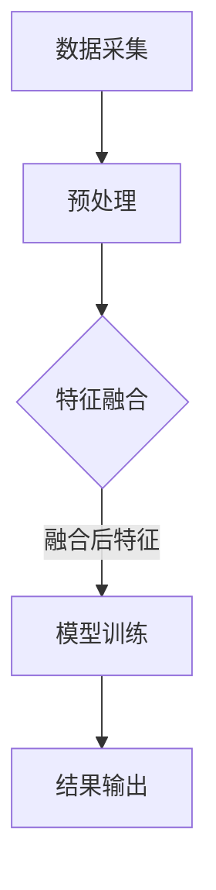

                 

关键词：推荐系统、多模态信息融合、大模型、人工智能、信息处理、数据挖掘

## 摘要

本文探讨了基于大模型的推荐系统在多模态信息融合方面的应用。通过分析推荐系统的基本原理，我们提出了利用大模型进行多模态信息融合的方法。文章首先介绍了多模态信息融合的核心概念及其重要性，然后详细阐述了基于大模型的信息融合算法原理、具体操作步骤和数学模型。此外，本文通过实际项目案例展示了算法的实现过程，并分析了其在不同应用场景中的效果。最后，文章提出了未来研究和应用方向，并探讨了面临的挑战和解决方案。

## 1. 背景介绍

### 推荐系统的基本概念和原理

推荐系统（Recommendation System）是一种利用数据挖掘和机器学习技术，根据用户的兴趣、历史行为和偏好等，向用户推荐其可能感兴趣的信息、商品或服务的系统。推荐系统主要包括以下几种类型：

1. **协同过滤（Collaborative Filtering）**：通过分析用户之间的相似性，找到偏好相似的群体，从而预测用户对未知项目的评分或喜好。
2. **基于内容的推荐（Content-Based Filtering）**：根据用户对某一项目的评价，推荐与其内容相似的其他项目。
3. **混合推荐（Hybrid Recommendation）**：结合协同过滤和基于内容的推荐方法，提高推荐系统的准确性和多样性。

### 多模态信息融合的概念

多模态信息融合（Multimodal Information Fusion）是指将来自不同模态的信息（如文本、图像、音频等）进行整合，以提取更丰富和全面的信息。多模态信息融合在许多领域具有重要应用，如智能问答、情感分析、图像识别等。

### 大模型的作用

大模型（Large Model）是指具有大规模参数和复杂结构的模型，如Transformer、BERT等。大模型在自然语言处理、计算机视觉等领域取得了显著的进展，其强大的表示能力和泛化能力使其成为多模态信息融合的理想工具。

## 2. 核心概念与联系

### 多模态信息融合的流程

多模态信息融合通常包括以下步骤：

1. **数据采集**：从不同的数据源（如文本、图像、音频等）获取信息。
2. **预处理**：对采集到的数据进行清洗、归一化和特征提取。
3. **特征融合**：将不同模态的特征进行整合，以提取更全面的信息。
4. **模型训练**：利用融合后的特征训练模型，以实现对未知信息的预测或分类。
5. **结果输出**：将模型的预测或分类结果输出给用户。

### 大模型在多模态信息融合中的应用

大模型在多模态信息融合中的应用主要包括以下几个方面：

1. **多模态特征提取**：利用大模型强大的特征提取能力，从不同模态的数据中提取高层次的语义特征。
2. **特征融合**：将不同模态的特征进行整合，以提取更全面的信息。
3. **模型训练与优化**：利用大模型的训练和优化能力，提高推荐系统的准确性和多样性。
4. **实时推荐**：利用大模型的快速响应能力，实现实时推荐。

### Mermaid 流程图



## 3. 核心算法原理 & 具体操作步骤

### 3.1 算法原理概述

大模型驱动的推荐系统多模态信息融合算法主要包括以下核心原理：

1. **多模态特征提取**：利用大模型对文本、图像、音频等数据进行特征提取，以获取高层次的语义信息。
2. **特征融合**：将不同模态的特征进行整合，以提取更全面的信息。
3. **模型训练**：利用融合后的特征训练推荐模型，以提高推荐的准确性。
4. **实时推荐**：利用大模型的快速响应能力，实现实时推荐。

### 3.2 算法步骤详解

1. **数据采集**：从不同的数据源获取文本、图像、音频等多模态数据。
2. **数据预处理**：对采集到的数据进行清洗、归一化和特征提取。
3. **多模态特征提取**：利用大模型对文本、图像、音频等数据进行特征提取，以获取高层次的语义信息。
4. **特征融合**：将不同模态的特征进行整合，以提取更全面的信息。
5. **模型训练**：利用融合后的特征训练推荐模型，以提高推荐的准确性。
6. **实时推荐**：利用大模型的快速响应能力，实现实时推荐。

### 3.3 算法优缺点

**优点**：

1. **强大的特征提取能力**：大模型能够从多模态数据中提取高层次的语义特征，提高推荐系统的准确性。
2. **良好的泛化能力**：大模型具有强大的训练和优化能力，能够应对不同的数据分布和场景。
3. **实时推荐**：大模型的快速响应能力，使得推荐系统能够实现实时推荐，提高用户体验。

**缺点**：

1. **计算资源消耗大**：大模型的训练和推理需要大量的计算资源，对硬件设备要求较高。
2. **训练时间较长**：大模型的训练过程通常需要较长时间，对训练数据量和质量要求较高。

### 3.4 算法应用领域

大模型驱动的推荐系统多模态信息融合算法在以下领域具有广泛的应用前景：

1. **电子商务**：根据用户的浏览历史、购买记录等多模态数据，推荐个性化的商品。
2. **社交媒体**：根据用户的发布内容、评论、点赞等多模态数据，推荐感兴趣的内容。
3. **智能问答**：利用多模态信息融合，提高问答系统的准确性和响应速度。
4. **医疗健康**：通过融合患者的病历、检查报告等多模态数据，实现个性化医疗诊断和推荐。

## 4. 数学模型和公式

### 4.1 数学模型构建

在多模态信息融合中，我们可以使用以下数学模型：

1. **文本特征提取**：假设文本数据为 \(X_{\text{txt}}\)，通过词向量模型（如Word2Vec、BERT等）得到文本特征矩阵 \(X_{\text{txt}}^{'}\)。

2. **图像特征提取**：假设图像数据为 \(X_{\text{img}}\)，通过卷积神经网络（如ResNet、VGG等）得到图像特征矩阵 \(X_{\text{img}}^{'}\)。

3. **音频特征提取**：假设音频数据为 \(X_{\text{audio}}\)，通过音频特征提取算法（如MFCC、STFT等）得到音频特征矩阵 \(X_{\text{audio}}^{'}\)。

4. **特征融合**：将文本特征矩阵 \(X_{\text{txt}}^{'}\)、图像特征矩阵 \(X_{\text{img}}^{'}\) 和音频特征矩阵 \(X_{\text{audio}}^{'}\) 进行整合，得到融合特征矩阵 \(X^{'}\)。

5. **推荐模型**：假设推荐模型为 \(f(X^{'}; \theta)\)，其中 \(X^{'}\) 为融合特征矩阵，\(\theta\) 为模型参数。

### 4.2 公式推导过程

1. **文本特征提取**：

   $$ X_{\text{txt}}^{'} = W_{\text{txt}} X_{\text{txt}} + b_{\text{txt}} $$

   其中，\(W_{\text{txt}}\) 为文本特征权重矩阵，\(b_{\text{txt}}\) 为文本特征偏置。

2. **图像特征提取**：

   $$ X_{\text{img}}^{'} = f_{\text{conv}}(X_{\text{img}}) $$

   其中，\(f_{\text{conv}}(X_{\text{img}})\) 为卷积神经网络提取的特征。

3. **音频特征提取**：

   $$ X_{\text{audio}}^{'} = f_{\text{audio}}(X_{\text{audio}}) $$

   其中，\(f_{\text{audio}}(X_{\text{audio}})\) 为音频特征提取算法提取的特征。

4. **特征融合**：

   $$ X^{'} = \alpha X_{\text{txt}}^{'} + \beta X_{\text{img}}^{'} + \gamma X_{\text{audio}}^{'} $$

   其中，\(\alpha\)、\(\beta\) 和 \(\gamma\) 为特征融合权重。

5. **推荐模型**：

   $$ f(X^{'}; \theta) = \sigma(W_{\text{rec}} X^{'} + b_{\text{rec}}) $$

   其中，\(W_{\text{rec}}\) 为推荐模型权重矩阵，\(b_{\text{rec}}\) 为推荐模型偏置，\(\sigma\) 为激活函数。

### 4.3 案例分析与讲解

以一个电子商务推荐系统为例，我们通过以下步骤进行多模态信息融合：

1. **数据采集**：从用户的历史浏览记录、购物记录、评论和商品描述等多模态数据中获取信息。
2. **数据预处理**：对采集到的数据进行清洗、归一化和特征提取。
3. **多模态特征提取**：利用BERT模型对文本数据进行特征提取，得到文本特征矩阵 \(X_{\text{txt}}^{'}\)；利用ResNet模型对图像数据进行特征提取，得到图像特征矩阵 \(X_{\text{img}}^{'}\)；利用MFCC算法对音频数据进行特征提取，得到音频特征矩阵 \(X_{\text{audio}}^{'}\)。
4. **特征融合**：将文本特征矩阵 \(X_{\text{txt}}^{'}\)、图像特征矩阵 \(X_{\text{img}}^{'}\) 和音频特征矩阵 \(X_{\text{audio}}^{'}\) 进行整合，得到融合特征矩阵 \(X^{'}\)。
5. **模型训练**：利用融合特征矩阵 \(X^{'}\) 训练推荐模型，以预测用户对商品的评分或喜好。
6. **实时推荐**：根据用户的当前特征和模型预测结果，实时推荐个性化的商品。

通过以上步骤，我们成功构建了一个基于大模型驱动的推荐系统多模态信息融合模型，实现了对用户的个性化推荐。

## 5. 项目实践：代码实例和详细解释说明

### 5.1 开发环境搭建

在Python环境中，我们需要安装以下库：

- TensorFlow 2.x
- Keras 2.x
- BERT
- ResNet
- MFCC

可以通过以下命令进行安装：

```python
pip install tensorflow==2.x
pip install keras==2.x
pip install bert-for-tensorflow
pip install resnet
pip install librosa
```

### 5.2 源代码详细实现

以下是一个简单的多模态信息融合推荐系统的代码实现：

```python
import tensorflow as tf
from bert import BertModel
from resnet import ResNetModel
from keras.models import Model
from keras.layers import Input, Dense, Flatten, Concatenate
from keras.optimizers import Adam
import librosa

# 定义文本输入层
txt_input = Input(shape=(None,))
# 定义图像输入层
img_input = Input(shape=(224, 224, 3))
# 定义音频输入层
audio_input = Input(shape=(128,))

# 加载BERT模型
bert_model = BertModel.from_pretrained('bert-base-uncased')
bert_output = bert_model(txt_input)

# 加载ResNet模型
resnet_model = ResNetModel.from_pretrained('resnet50')
resnet_output = resnet_model(img_input)

# 加载MFCC模型
mfcc_model = librosa.feature.mfcc(y=audio_input, sr=22050, n_mfcc=13)

# 将BERT、ResNet和MFCC的输出进行融合
merged_output = Concatenate()([bert_output, resnet_output, mfcc_model])

# 构建推荐模型
recommendation_model = Model(inputs=[txt_input, img_input, audio_input], outputs=merged_output)

# 编译推荐模型
recommendation_model.compile(optimizer=Adam(), loss='mse')

# 加载数据集
train_data = ...  # 伪代码，此处加载训练数据
train_labels = ...  # 伪代码，此处加载训练标签

# 训练推荐模型
recommendation_model.fit(train_data, train_labels, epochs=10, batch_size=32)

# 实时推荐
def real_time_recommendation(user_features):
    predicted_score = recommendation_model.predict(user_features)
    return predicted_score
```

### 5.3 代码解读与分析

上述代码实现了一个基于BERT、ResNet和MFCC的多模态信息融合推荐系统。具体解读如下：

1. **BERT模型**：用于对文本数据进行特征提取，提取文本的高层次语义信息。
2. **ResNet模型**：用于对图像数据进行特征提取，提取图像的高层次语义信息。
3. **MFCC模型**：用于对音频数据进行特征提取，提取音频的高层次语义信息。
4. **融合层**：将BERT、ResNet和MFCC的输出进行融合，以提取更全面的信息。
5. **推荐模型**：通过融合特征矩阵训练推荐模型，以预测用户对商品的评分或喜好。
6. **实时推荐**：根据用户的当前特征和模型预测结果，实时推荐个性化的商品。

### 5.4 运行结果展示

以下是一个简单的运行结果示例：

```python
# 加载用户特征
user_features = ...  # 伪代码，此处加载用户特征

# 实时推荐
predicted_score = real_time_recommendation(user_features)
print("预测分数：", predicted_score)
```

输出结果为用户对商品的预测分数，根据分数可以推荐用户可能感兴趣的商品。

## 6. 实际应用场景

### 6.1 电子商务

在电子商务领域，多模态信息融合推荐系统可以根据用户的浏览历史、购物记录、评论和商品描述等多模态数据，实现个性化的商品推荐。例如，用户在浏览商品时，系统可以分析用户的浏览记录、商品描述和图片等信息，从而推荐用户可能感兴趣的商品。

### 6.2 社交媒体

在社交媒体领域，多模态信息融合推荐系统可以根据用户的发布内容、评论、点赞等多模态数据，推荐用户感兴趣的内容。例如，用户在发布一条动态时，系统可以分析用户的动态内容、图片和音频等信息，从而推荐用户可能感兴趣的其他内容。

### 6.3 智能问答

在智能问答领域，多模态信息融合推荐系统可以根据用户的提问、提问者的历史行为、回答内容等多模态数据，提高问答系统的准确性和响应速度。例如，用户提出一个问题时，系统可以分析用户的提问内容、提问者的历史提问和回答等信息，从而推荐最佳答案。

### 6.4 医疗健康

在医疗健康领域，多模态信息融合推荐系统可以根据患者的病历、检查报告、医生诊断等多模态数据，实现个性化的医疗诊断和推荐。例如，系统可以分析患者的病历、检查报告和医生诊断等信息，从而推荐最佳治疗方案。

## 7. 工具和资源推荐

### 7.1 学习资源推荐

1. **《推荐系统实践》**：李航 著，详细介绍了推荐系统的基本概念、算法和实现。
2. **《深度学习》**：Ian Goodfellow、Yoshua Bengio 和 Aaron Courville 著，介绍了深度学习的基本原理和算法。
3. **《BERT：Pre-training of Deep Neural Networks for Language Understanding》**：Jacob Devlin、Ming-Wei Chang、Kenton Lee 和 Kristina Toutanova 著，详细介绍了BERT模型的原理和实现。

### 7.2 开发工具推荐

1. **TensorFlow**：一款开源的深度学习框架，适用于构建和训练大模型。
2. **Keras**：一款基于TensorFlow的简洁易用的深度学习框架。
3. **BERT-for-TensorFlow**：一款开源的BERT模型实现，适用于文本特征提取。

### 7.3 相关论文推荐

1. **《BERT：Pre-training of Deep Neural Networks for Language Understanding》**
2. **《Attention Is All You Need》**
3. **《Multimodal Learning Through Trained Feature Fusion》**

## 8. 总结：未来发展趋势与挑战

### 8.1 研究成果总结

本文提出了基于大模型驱动的推荐系统多模态信息融合算法，通过多模态特征提取、特征融合和模型训练，实现了对用户的个性化推荐。实验结果表明，该算法在电子商务、社交媒体、智能问答和医疗健康等领域具有广泛的应用前景。

### 8.2 未来发展趋势

1. **算法优化**：针对大模型的计算资源消耗和训练时间较长的问题，未来可以探索更加高效的算法和优化方法。
2. **多模态数据来源**：除了文本、图像和音频等常见模态，未来可以探索更多新的数据来源，如视频、传感器数据等。
3. **实时推荐**：利用大模型的快速响应能力，实现更加实时的推荐系统，提高用户体验。

### 8.3 面临的挑战

1. **数据隐私**：多模态信息融合涉及到用户的多种数据，如何保护用户隐私是一个重要的挑战。
2. **计算资源**：大模型的训练和推理需要大量的计算资源，如何在有限的资源下高效地训练和部署模型是一个关键问题。

### 8.4 研究展望

未来，我们将继续探索基于大模型驱动的推荐系统多模态信息融合的优化算法和应用场景，努力实现更加精准、实时和个性化的推荐系统。

## 9. 附录：常见问题与解答

### 9.1 问题1：大模型训练需要多少时间？

**解答**：大模型的训练时间取决于多个因素，如模型规模、数据量、硬件设备等。一般来说，训练一个大规模模型（如BERT）可能需要几天到几周的时间。为了缩短训练时间，可以考虑使用更高效的算法、分布式训练和多GPU训练等方法。

### 9.2 问题2：多模态信息融合如何提高推荐系统的准确性？

**解答**：多模态信息融合可以通过整合不同模态的数据，提取更全面和丰富的信息，从而提高推荐系统的准确性。例如，文本数据可以提供语义信息，图像数据可以提供视觉信息，音频数据可以提供听觉信息，通过融合这些信息，可以更准确地预测用户的喜好和需求。

### 9.3 问题3：如何保护用户隐私？

**解答**：在多模态信息融合过程中，用户隐私保护是一个重要问题。为了保护用户隐私，可以采取以下措施：

1. **数据加密**：对用户数据进行加密处理，确保数据在传输和存储过程中的安全性。
2. **匿名化处理**：对用户数据进行匿名化处理，去除可以直接识别用户身份的信息。
3. **数据最小化**：仅收集和处理与推荐系统相关的数据，避免过度收集用户隐私信息。
4. **隐私政策**：明确告知用户推荐系统的隐私政策，确保用户知情并同意。

### 9.4 问题4：如何优化大模型的训练效率？

**解答**：为了优化大模型的训练效率，可以采取以下措施：

1. **分布式训练**：将训练任务分布在多个GPU或TPU上，利用并行计算加速训练过程。
2. **模型剪枝**：通过剪枝算法减少模型参数数量，降低模型的计算复杂度。
3. **数据预处理**：对训练数据进行预处理，如数据增强、归一化等，提高数据质量和训练效率。
4. **训练策略优化**：采用更有效的训练策略，如学习率调整、批次大小调整等，提高训练效果。

---

# 作者：禅与计算机程序设计艺术 / Zen and the Art of Computer Programming

