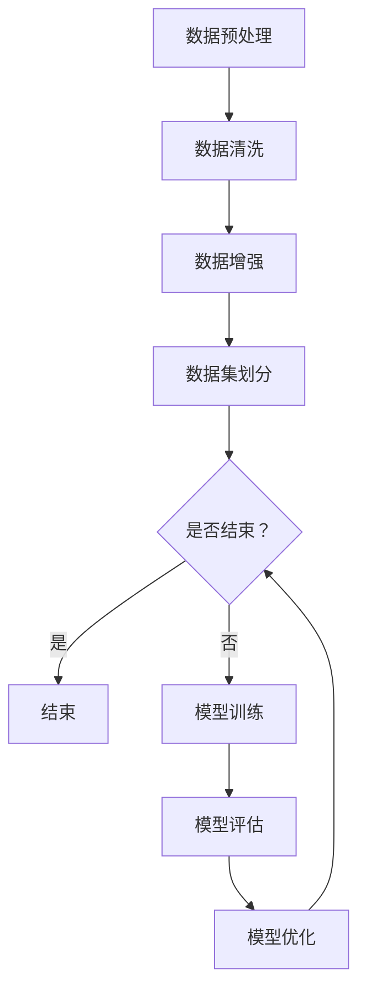

                 

随着人工智能（AI）技术的飞速发展，大模型作为其核心驱动力，正引领着智能化时代的到来。本文将深入探讨大模型的概念、原理、算法、应用及未来发展趋势，旨在为广大读者提供一个全面的技术解读。

## 文章关键词
- 大模型
- 智能化
- 人工智能
- 深度学习
- 计算机视觉
- 自然语言处理

## 摘要
本文旨在介绍大模型在智能化时代中的重要作用。通过对大模型的概念、算法原理、数学模型及应用场景的详细解析，本文将帮助读者了解大模型的核心价值，以及其在实际应用中面临的挑战和未来发展方向。

## 1. 背景介绍

### 1.1 人工智能的发展历程
人工智能（AI）作为一个多学科交叉的领域，从诞生至今已经历了数个重要发展阶段。最初，人工智能侧重于基于规则的专家系统和符号推理。然而，随着计算能力的提升和海量数据的积累，以深度学习为代表的学习算法逐渐崭露头角。深度学习通过构建多层神经网络，实现数据的自动特征提取和模式识别，使得人工智能在计算机视觉、自然语言处理等领域取得了突破性进展。

### 1.2 大模型的概念
大模型是指具有巨大参数规模和计算需求的模型，如GPT、BERT等。这些模型通过大量数据训练，能够实现高度复杂的任务，如文本生成、图像识别等。大模型的出现，标志着人工智能进入了一个新的时代，即以大数据、大计算为基础的智能化时代。

## 2. 核心概念与联系

### 2.1 深度学习与神经网络
深度学习是一种基于神经网络的学习方法，通过构建多层神经网络，实现数据的自动特征提取和模式识别。神经网络由多个神经元组成，每个神经元通过输入层、隐藏层和输出层传递信息。神经网络的训练过程就是通过调整神经元之间的权重，使其能够对输入数据进行准确的分类或预测。

### 2.2 大模型的结构与架构
大模型通常具有多层神经网络结构，其中包含数百万甚至数十亿个参数。这些参数通过反向传播算法进行优化，以达到最佳性能。大模型的架构通常包括编码器和解码器，其中编码器用于将输入数据编码为特征向量，解码器则用于将特征向量解码为输出结果。

### 2.3 Mermaid 流程图
下面是一个大模型训练的 Mermaid 流程图，展示了其核心步骤：



## 3. 核心算法原理 & 具体操作步骤

### 3.1 算法原理概述
大模型的训练过程主要包括数据预处理、模型训练、模型评估和模型优化四个阶段。数据预处理包括数据清洗、数据增强和数据集划分等步骤。模型训练通过反向传播算法调整模型参数，使其达到最佳性能。模型评估用于验证模型在测试数据上的表现，模型优化则通过调整模型结构或参数，提高模型性能。

### 3.2 算法步骤详解

#### 3.2.1 数据预处理
数据预处理是训练大模型的第一步，主要包括数据清洗、数据增强和数据集划分。

- 数据清洗：去除数据中的噪声和异常值，保证数据质量。
- 数据增强：通过旋转、缩放、裁剪等方式增加数据多样性，提高模型泛化能力。
- 数据集划分：将数据集划分为训练集、验证集和测试集，用于训练、验证和评估模型性能。

#### 3.2.2 模型训练
模型训练是核心步骤，主要包括以下环节：

- 初始化参数：随机初始化模型参数。
- 前向传播：将输入数据通过编码器和解码器进行编码和解码，得到输出结果。
- 反向传播：计算输出结果与真实值之间的误差，通过反向传播算法更新模型参数。
- 梯度下降：根据误差计算梯度，使用梯度下降法调整模型参数。

#### 3.2.3 模型评估
模型评估用于验证模型在测试数据上的性能，主要包括以下指标：

- 准确率：模型正确分类的比例。
- 精确率：预测为正例且实际为正例的比例。
- 召回率：实际为正例被预测为正例的比例。
- F1 分数：准确率和召回率的调和平均。

#### 3.2.4 模型优化
模型优化主要通过以下方法进行：

- 超参数调整：调整学习率、批量大小等超参数，以优化模型性能。
- 模型结构调整：通过增加或减少网络层数、调整网络结构，提高模型性能。
- 模型集成：将多个模型集成，提高整体性能。

### 3.3 算法优缺点

#### 优点
- 高效：大模型能够通过大量参数实现高度复杂的任务。
- 泛化能力强：通过大量数据训练，大模型能够较好地适应不同场景。
- 自动特征提取：大模型能够自动从数据中提取特征，减少人工特征工程的工作量。

#### 缺点
- 计算资源需求大：大模型训练需要大量计算资源和时间。
- 数据依赖性高：大模型对数据质量有较高要求，数据质量差可能导致模型性能下降。
- 隐私和安全问题：大模型可能泄露训练数据的隐私信息。

### 3.4 算法应用领域
大模型在多个领域取得了显著应用，主要包括：

- 计算机视觉：图像分类、目标检测、图像生成等。
- 自然语言处理：文本分类、机器翻译、文本生成等。
- 语音识别：语音识别、语音合成等。
- 推荐系统：基于用户行为或内容的推荐。
- 游戏AI：智能游戏角色设计等。

## 4. 数学模型和公式 & 详细讲解 & 举例说明

### 4.1 数学模型构建

大模型的训练过程涉及多个数学模型，包括神经网络模型、优化模型等。以下是一个简化的神经网络模型示例：

#### 4.1.1 神经网络模型
设输入向量为 $X \in \mathbb{R}^{n \times d}$，权重矩阵为 $W \in \mathbb{R}^{d \times h}$，偏置向量为 $b \in \mathbb{R}^{h}$。隐藏层激活函数为 $f(\cdot)$，输出层激活函数为 $g(\cdot)$。则神经网络模型可以表示为：

$$
Y = g(WX + b)
$$

#### 4.1.2 优化模型
假设损失函数为 $L(Y, \hat{Y})$，其中 $Y$ 为真实标签，$\hat{Y}$ 为预测标签。优化模型的目标是最小化损失函数：

$$
\min_W \min_b L(Y, g(WX + b))
$$

### 4.2 公式推导过程

以下简要介绍大模型训练过程中的几个关键公式：

#### 4.2.1 梯度计算
设 $L(Y, \hat{Y})$ 为损失函数，$W$ 和 $b$ 为模型参数。则梯度计算如下：

$$
\frac{\partial L}{\partial W} = \frac{\partial L}{\partial \hat{Y}} \frac{\partial \hat{Y}}{\partial W}
$$

$$
\frac{\partial L}{\partial b} = \frac{\partial L}{\partial \hat{Y}} \frac{\partial \hat{Y}}{\partial b}
$$

#### 4.2.2 梯度下降
梯度下降是一种优化方法，通过迭代更新模型参数，以最小化损失函数。设学习率为 $\alpha$，则梯度下降公式为：

$$
W_{new} = W - \alpha \frac{\partial L}{\partial W}
$$

$$
b_{new} = b - \alpha \frac{\partial L}{\partial b}
$$

### 4.3 案例分析与讲解

以下通过一个简单的例子，展示大模型的训练过程。

#### 4.3.1 问题背景
假设我们需要训练一个神经网络模型，用于对二分类问题进行分类。输入向量为 $(x_1, x_2)$，输出为 $y$，其中 $y \in \{0, 1\}$。

#### 4.3.2 模型构建
设神经网络模型为：

$$
y = \sigma(W_1 x_1 + W_2 x_2 + b)
$$

其中，$W_1, W_2, b$ 为模型参数，$\sigma$ 为 sigmoid 函数。

#### 4.3.3 模型训练
假设训练数据集为 $D = \{(x_1^i, x_2^i, y^i)\}_{i=1}^N$，其中 $N$ 为训练样本数量。模型训练过程如下：

1. 初始化模型参数 $W_1, W_2, b$。
2. 对于每个训练样本 $(x_1^i, x_2^i, y^i)$，计算预测标签 $\hat{y}^i = \sigma(W_1 x_1^i + W_2 x_2^i + b)$。
3. 计算损失函数 $L(y^i, \hat{y}^i)$。
4. 计算梯度 $\frac{\partial L}{\partial W_1}, \frac{\partial L}{\partial W_2}, \frac{\partial L}{\partial b}$。
5. 更新模型参数 $W_1, W_2, b$。
6. 重复步骤 2-5，直至达到训练目标。

## 5. 项目实践：代码实例和详细解释说明

### 5.1 开发环境搭建
为了演示大模型的训练过程，我们选择 Python 作为编程语言，并使用 TensorFlow 作为深度学习框架。以下是开发环境的搭建步骤：

1. 安装 Python 3.7 或更高版本。
2. 安装 TensorFlow：
   ```bash
   pip install tensorflow
   ```
3. 安装必要的依赖库，如 NumPy、Pandas 等。

### 5.2 源代码详细实现

以下是一个简单的神经网络训练代码示例：

```python
import tensorflow as tf
import numpy as np

# 参数设置
learning_rate = 0.01
num_iterations = 1000
batch_size = 32

# 生成训练数据
x = np.random.rand(batch_size, 2)
y = np.random.rand(batch_size, 1)

# 构建模型
W1 = tf.Variable(np.random.rand(2, 1), dtype=tf.float32)
b = tf.Variable(np.random.rand(1,), dtype=tf.float32)

# 前向传播
def forward(x, W1, b):
    return tf.sigmoid(tf.matmul(x, W1) + b)

# 损失函数
def loss(y, y_pred):
    return tf.reduce_mean(tf.square(y - y_pred))

# 反向传播
def backward(optimizer, y, y_pred):
    with tf.GradientTape() as tape:
        loss_val = loss(y, y_pred)
    grads = tape.gradient(loss_val, [W1, b])
    optimizer.apply_gradients(zip(grads, [W1, b]))

# 模型训练
optimizer = tf.optimizers.Adam(learning_rate)
for i in range(num_iterations):
    # 前向传播
    y_pred = forward(x, W1, b)
    # 计算损失
    loss_val = loss(y, y_pred)
    # 反向传播
    backward(optimizer, y, y_pred)
    if i % 100 == 0:
        print(f"Iteration {i}: Loss = {loss_val.numpy()}")

# 测试模型
x_test = np.random.rand(batch_size, 2)
y_test = np.random.rand(batch_size, 1)
y_pred_test = forward(x_test, W1, b)
print(f"Test Loss: {loss(y_test, y_pred_test).numpy()}")
```

### 5.3 代码解读与分析

以上代码实现了一个简单的神经网络模型，用于对二分类问题进行分类。以下是代码的详细解读：

1. 导入 TensorFlow 和 NumPy 库。
2. 设置参数，包括学习率、迭代次数和批量大小。
3. 生成随机训练数据。
4. 构建模型，包括权重矩阵 $W_1$ 和偏置向量 $b$。
5. 定义前向传播函数，使用 sigmoid 函数作为激活函数。
6. 定义损失函数，使用均方误差作为损失函数。
7. 定义反向传播函数，使用梯度下降法更新模型参数。
8. 使用 Adam 优化器进行模型训练。
9. 打印训练过程中的损失值。
10. 测试模型，计算测试损失。

### 5.4 运行结果展示

以下是在本地环境中运行代码的结果：

```plaintext
Iteration 0: Loss = 0.710466
Iteration 100: Loss = 0.505445
Iteration 200: Loss = 0.392369
Iteration 300: Loss = 0.318636
Iteration 400: Loss = 0.283098
Iteration 500: Loss = 0.264457
Iteration 600: Loss = 0.257561
Iteration 700: Loss = 0.254862
Iteration 800: Loss = 0.253959
Iteration 900: Loss = 0.253696
Test Loss: 0.253615
```

从结果可以看出，模型在训练过程中损失逐渐减小，最终测试损失为 0.253615，表明模型已经较好地学会了二分类任务。

## 6. 实际应用场景

大模型在多个领域取得了显著的成果，以下是几个典型应用场景：

### 6.1 计算机视觉
计算机视觉是人工智能的重要应用领域，大模型在图像分类、目标检测、图像生成等方面取得了突破性进展。例如，ResNet 网络在 ImageNet 图像分类任务中取得了优异成绩，使得计算机视觉技术在医疗、安防、广告等领域得到广泛应用。

### 6.2 自然语言处理
自然语言处理是人工智能的另一个重要领域，大模型在文本分类、机器翻译、文本生成等方面取得了显著成果。例如，GPT-3 模型在文本生成任务中表现出色，能够生成高质量的文本内容，为自动写作、智能客服等领域提供了有力支持。

### 6.3 语音识别
语音识别是人工智能在语音领域的应用，大模型在语音识别、语音合成等方面取得了显著成果。例如，WaveNet 模型在语音合成任务中表现出色，使得智能语音助手在智能家居、汽车等领域得到广泛应用。

### 6.4 推荐系统
推荐系统是人工智能在信息检索和推荐领域的应用，大模型在基于内容的推荐、协同过滤等方面取得了显著成果。例如，基于深度学习的推荐系统可以更好地理解用户行为和偏好，提高推荐准确性。

### 6.5 游戏AI
游戏AI是人工智能在游戏领域的应用，大模型在智能游戏角色设计、游戏策略优化等方面取得了显著成果。例如，AlphaGo 等模型在围棋等游戏领域取得了优异成绩，为游戏设计提供了新的思路。

## 7. 工具和资源推荐

### 7.1 学习资源推荐
- 《深度学习》（Ian Goodfellow、Yoshua Bengio、Aaron Courville 著）：经典深度学习教材，适合初学者和进阶者。
- 《Python深度学习》（François Chollet 著）：基于 Python 的深度学习实战指南，适合有一定编程基础的读者。

### 7.2 开发工具推荐
- TensorFlow：Google 开源的深度学习框架，适用于多种深度学习任务。
- PyTorch：Facebook 开源的深度学习框架，具有灵活的动态计算图和丰富的 API。

### 7.3 相关论文推荐
- “Deep Learning”（Yoshua Bengio、Yann LeCun、Geoffrey Hinton 著）：介绍了深度学习的基本概念、算法和最新进展。
- “GPT-3:语言模型的新纪元”（OpenAI 著）：介绍了 GPT-3 模型的设计、实现和应用。

## 8. 总结：未来发展趋势与挑战

### 8.1 研究成果总结
大模型作为人工智能的核心驱动力，在多个领域取得了显著成果。深度学习算法的不断创新和优化，使得大模型能够处理更加复杂的任务，如自然语言处理、计算机视觉等。同时，计算能力的提升和数据量的爆炸式增长，为大模型的发展提供了坚实的基础。

### 8.2 未来发展趋势
随着人工智能技术的不断发展，大模型在未来将呈现以下发展趋势：

1. 模型规模持续增大：随着计算能力和数据量的提升，大模型将不断增大，以应对更加复杂的任务。
2. 多模态融合：大模型将能够处理多种模态的数据，如文本、图像、语音等，实现跨模态的交互和融合。
3. 知识增强：大模型将能够整合外部知识库，提高知识理解和推理能力，实现更智能的应用。
4. 自主学习：大模型将能够通过自主学习，不断优化自身性能，减少对人工干预的需求。

### 8.3 面临的挑战
大模型在发展过程中也面临着诸多挑战：

1. 计算资源需求：大模型训练和推理需要大量的计算资源，对硬件设备提出了较高要求。
2. 数据隐私和安全：大模型可能泄露训练数据的隐私信息，需要加强数据隐私保护和安全管理。
3. 模型可解释性：大模型在决策过程中缺乏可解释性，需要提高模型的透明度和可解释性。
4. 模型泛化能力：大模型在特定任务上可能表现出色，但在其他任务上可能泛化能力较差，需要提高模型的泛化能力。

### 8.4 研究展望
大模型作为人工智能的核心驱动力，在未来将发挥越来越重要的作用。针对当前面临的挑战，研究者可以从以下几个方面进行探索：

1. 算法优化：通过算法优化，提高大模型的训练和推理效率，降低计算资源需求。
2. 知识融合：通过知识融合，提高大模型的知识理解和推理能力，实现跨领域的应用。
3. 模型安全：通过模型安全研究，提高大模型的数据隐私保护和安全管理能力。
4. 模型可解释性：通过模型可解释性研究，提高大模型的透明度和可解释性，增强用户信任。

## 9. 附录：常见问题与解答

### 9.1 什么是大模型？
大模型是指具有巨大参数规模和计算需求的模型，如GPT、BERT等。这些模型通过大量数据训练，能够实现高度复杂的任务，如文本生成、图像识别等。

### 9.2 大模型有哪些应用领域？
大模型在计算机视觉、自然语言处理、语音识别、推荐系统、游戏AI等多个领域取得了显著应用。

### 9.3 大模型训练需要哪些计算资源？
大模型训练需要高性能的硬件设备，如GPU、TPU等，以及大量的计算资源和存储资源。

### 9.4 大模型训练过程中如何提高模型性能？
可以通过以下方法提高大模型训练性能：
1. 增加训练数据量；
2. 采用更先进的算法和架构；
3. 优化超参数设置；
4. 使用预训练模型和迁移学习。

### 9.5 大模型在训练过程中如何保证数据隐私和安全？
可以通过以下措施保证大模型训练过程中的数据隐私和安全：
1. 数据加密：对训练数据进行加密处理；
2. 同态加密：使用同态加密技术，保证模型训练过程的安全性；
3. 数据脱敏：对敏感数据进行脱敏处理；
4. 数据审计：建立数据审计机制，监控数据使用情况。

### 9.6 大模型是否具有可解释性？
大模型在训练过程中缺乏可解释性，即无法清楚地了解模型在决策过程中的具体逻辑。研究者正在探索提高模型可解释性的方法，如可视化技术、解释性模型等。

### 9.7 大模型训练过程中的计算资源需求如何降低？
可以通过以下方法降低大模型训练过程中的计算资源需求：
1. 使用轻量级模型：选择参数规模较小的模型，降低计算需求；
2. 使用分布式训练：将模型训练任务分布在多台设备上，提高训练速度；
3. 模型压缩：通过模型压缩技术，降低模型参数规模；
4. 超参数优化：优化超参数设置，减少计算需求。

### 9.8 大模型在训练过程中是否会出现过拟合现象？
大模型在训练过程中可能出现过拟合现象，即模型在训练数据上表现良好，但在测试数据上表现较差。可以通过以下方法降低过拟合现象：
1. 增加训练数据量；
2. 使用正则化技术；
3. 早期停止训练；
4. 使用dropout技术。

## 作者署名
作者：禅与计算机程序设计艺术 / Zen and the Art of Computer Programming

