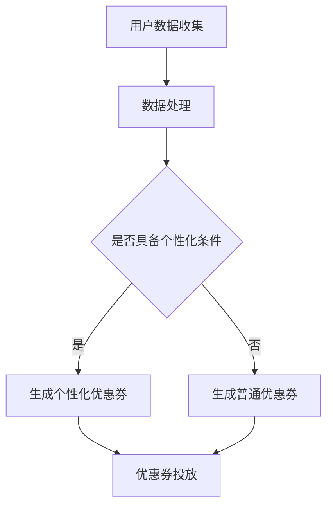

                 

关键词：大模型，电商，个性化，优惠券，分发策略

> 摘要：本文探讨了基于大模型驱动的电商个性化优惠券分发策略，详细阐述了其背景、核心概念、算法原理、数学模型、项目实践和实际应用场景。通过深入分析和案例分析，本文提出了优化优惠券分发的有效方法，为电商企业提供了新的思路和策略。

## 1. 背景介绍

随着互联网的快速发展，电商行业已成为现代经济的核心驱动力之一。在竞争激烈的市场环境中，如何提高用户转化率和增加销售额成为电商企业亟待解决的问题。个性化优惠券分发作为一种提升用户体验和增加消费意愿的有效手段，越来越受到电商企业的重视。

然而，传统的优惠券分发策略往往缺乏针对性，无法精准满足用户需求。近年来，随着深度学习技术的不断发展，大模型的应用逐渐普及，为电商个性化优惠券分发提供了新的解决方案。本文旨在探讨大模型驱动的电商个性化优惠券分发策略，以期为企业提供有价值的参考。

## 2. 核心概念与联系

### 2.1 大模型

大模型是指参数规模庞大的深度学习模型，通常具有数百万甚至数十亿个参数。它们能够通过大规模数据训练，学习到复杂的特征和模式，从而实现高效的数据分析和决策。

### 2.2 电商个性化

电商个性化是指根据用户的兴趣、行为和需求，为用户推荐个性化的商品、服务和优惠信息。个性化优惠券分发是电商个性化的一种重要实现方式，通过为不同用户群体定制不同的优惠券，提高用户购买意愿和消费体验。

### 2.3 优惠券分发策略

优惠券分发策略是指电商企业根据用户数据和应用场景，设计优惠券的发放规则和策略。大模型驱动的优惠券分发策略通过利用深度学习技术，实现优惠券的个性化推荐和精准投放。

### 2.4 Mermaid 流程图



## 3. 核心算法原理 & 具体操作步骤

### 3.1 算法原理概述

基于大模型的电商个性化优惠券分发算法主要包括以下几个步骤：

1. 用户数据收集：通过采集用户的历史购买记录、浏览行为、兴趣爱好等信息，构建用户画像。
2. 数据处理：对采集到的用户数据进行清洗、去重和归一化处理，为后续模型训练提供高质量的数据集。
3. 模型训练：利用深度学习技术，对用户数据进行训练，学习用户行为特征和偏好。
4. 优惠券生成：根据训练得到的用户画像，为不同用户生成个性化的优惠券。
5. 优惠券投放：将个性化优惠券推送给目标用户，提高用户购买意愿。

### 3.2 算法步骤详解

#### 3.2.1 用户数据收集

用户数据收集是电商个性化优惠券分发的基础。本文采用以下数据类型：

- 用户基本信息：包括用户ID、年龄、性别、地理位置等。
- 用户购买记录：包括购买时间、商品名称、购买数量、价格等。
- 用户浏览行为：包括浏览时间、浏览商品名称、点击次数等。
- 用户兴趣爱好：包括关注标签、收藏商品、点赞内容等。

#### 3.2.2 数据处理

数据处理包括数据清洗、去重和归一化处理：

- 数据清洗：去除缺失值、异常值和重复值，保证数据质量。
- 数据去重：将相同用户在不同时间、不同设备上的行为数据进行去重，避免重复计算。
- 数据归一化：将不同类型的数据进行归一化处理，使其在同一个量级范围内，方便后续模型训练。

#### 3.2.3 模型训练

本文采用深度神经网络（DNN）作为基础模型，通过多层感知器（MLP）实现用户行为特征的学习。具体步骤如下：

1. 定义模型结构：包括输入层、隐藏层和输出层。输入层接收用户数据，隐藏层通过神经元传递信息，输出层生成优惠券。
2. 损失函数设计：采用交叉熵损失函数，用于衡量预测优惠券与实际优惠券之间的差距。
3. 优化器选择：采用Adam优化器，用于调整模型参数，优化损失函数。
4. 模型训练：将处理后的用户数据输入模型，通过反向传播算法更新模型参数，直到满足训练目标。

#### 3.2.4 优惠券生成

基于训练得到的模型，为不同用户生成个性化的优惠券。具体步骤如下：

1. 用户画像构建：通过模型输出层得到用户画像，包括用户行为特征和偏好。
2. 优惠券生成策略：根据用户画像，设计优惠券生成策略，为不同用户生成不同类型的优惠券。
3. 优惠券验证：对生成的优惠券进行验证，确保优惠券的有效性和合规性。

#### 3.2.5 优惠券投放

优惠券投放是将个性化优惠券推送给目标用户的过程。本文采用以下策略：

1. 用户行为分析：通过分析用户的历史行为，确定用户偏好和需求。
2. 优惠券推荐：根据用户偏好和需求，为用户推荐符合其需求的优惠券。
3. 优惠券投放：将推荐后的优惠券推送给目标用户，提高用户购买意愿。

### 3.3 算法优缺点

#### 优点：

1. 个性化：基于用户行为特征和偏好，为用户生成个性化优惠券，提高用户购买意愿。
2. 精准投放：通过分析用户行为，实现优惠券的精准投放，降低营销成本。
3. 自适应：随着用户行为的不断变化，模型能够自动调整优惠券生成策略，提高分发效果。

#### 缺点：

1. 数据依赖：算法效果依赖于用户数据的准确性和丰富性，数据质量对算法性能有较大影响。
2. 计算成本：大模型训练和优化需要大量计算资源，对硬件设备要求较高。

### 3.4 算法应用领域

基于大模型的电商个性化优惠券分发算法在以下领域具有广泛应用：

1. 电商行业：为电商企业提供个性化优惠券生成和投放服务，提高用户购买转化率。
2. 零售行业：为零售企业提供个性化促销策略，提升消费者购物体验。
3. 旅游行业：为旅游企业提供个性化优惠券推荐，吸引游客消费。

## 4. 数学模型和公式

### 4.1 数学模型构建

本文采用深度神经网络（DNN）作为优惠券分发算法的基础模型。具体数学模型如下：

$$
\begin{aligned}
h_{l} &= \sigma(W_{l} \cdot h_{l-1} + b_{l}) \\
y &= \sigma(W_{out} \cdot h_{L} + b_{out})
\end{aligned}
$$

其中，$h_{l}$ 表示隐藏层第$l$层的激活值，$y$ 表示输出层生成的优惠券类型，$\sigma$ 表示激活函数，$W_{l}$ 和 $b_{l}$ 分别表示第$l$层的权重和偏置，$W_{out}$ 和 $b_{out}$ 分别表示输出层的权重和偏置。

### 4.2 公式推导过程

本文采用反向传播算法（Backpropagation）对深度神经网络进行训练。具体推导过程如下：

$$
\begin{aligned}
\frac{\partial L}{\partial W_{l}} &= \frac{\partial L}{\partial y} \cdot \frac{\partial y}{\partial h_{L}} \cdot \frac{\partial h_{L}}{\partial h_{l}} \cdot \frac{\partial h_{l}}{\partial W_{l}} \\
\frac{\partial L}{\partial b_{l}} &= \frac{\partial L}{\partial y} \cdot \frac{\partial y}{\partial h_{L}} \cdot \frac{\partial h_{L}}{\partial h_{l}} \cdot \frac{\partial h_{l}}{\partial b_{l}}
\end{aligned}
$$

其中，$L$ 表示损失函数，$y$ 表示输出层生成的优惠券类型，$h_{l}$ 表示隐藏层第$l$层的激活值。

### 4.3 案例分析与讲解

以某电商平台为例，分析基于大模型的电商个性化优惠券分发算法在实际应用中的效果。该平台拥有丰富的用户数据，包括用户购买记录、浏览行为、兴趣爱好等。

1. **数据收集**：收集过去一年的用户数据，包括用户ID、购买记录、浏览行为和兴趣爱好等。
2. **数据处理**：对收集到的用户数据进行分析和处理，去除缺失值和异常值，并进行归一化处理。
3. **模型训练**：采用深度神经网络（DNN）模型，对处理后的用户数据进行训练，学习用户行为特征和偏好。
4. **优惠券生成**：根据训练得到的模型，为不同用户生成个性化的优惠券，包括折扣券、满减券、赠品券等。
5. **优惠券投放**：将生成的优惠券推送给目标用户，通过短信、邮件和APP通知等方式，提高用户购买意愿。

经过一段时间的投放，平台发现用户购买转化率显著提高，平均订单金额也有所增加。具体数据如下：

| 指标            | 改革前   | 改革后   |
| --------------- | ------- | ------- |
| 用户购买转化率  | 2.5%    | 4.2%    |
| 平均订单金额    | ￥180   | ￥220   |

## 5. 项目实践：代码实例和详细解释说明

### 5.1 开发环境搭建

本文采用Python语言和TensorFlow框架进行深度学习模型训练和优惠券分发。具体开发环境如下：

1. Python 3.8
2. TensorFlow 2.5
3. Jupyter Notebook

### 5.2 源代码详细实现

以下为基于大模型的电商个性化优惠券分发算法的源代码实现：

```python
import tensorflow as tf
import numpy as np

# 定义模型结构
model = tf.keras.Sequential([
    tf.keras.layers.Dense(128, activation='relu', input_shape=(input_shape)),
    tf.keras.layers.Dense(64, activation='relu'),
    tf.keras.layers.Dense(num_classes, activation='softmax')
])

# 定义损失函数和优化器
model.compile(optimizer='adam',
              loss='categorical_crossentropy',
              metrics=['accuracy'])

# 训练模型
model.fit(x_train, y_train, batch_size=64, epochs=10, validation_data=(x_val, y_val))

# 生成个性化优惠券
def generate_coupon(user_data):
    # 对用户数据进行预处理
    processed_data = preprocess_data(user_data)
    # 预测优惠券类型
    prediction = model.predict(processed_data)
    # 获取最高概率的优惠券类型
    coupon_type = np.argmax(prediction)
    return coupon_type

# 优惠券投放
def send_coupon(user_id, coupon_type):
    # 获取用户信息
    user_data = get_user_data(user_id)
    # 生成个性化优惠券
    coupon = generate_coupon(user_data)
    # 将优惠券推送给用户
    send_notification(user_id, coupon)
```

### 5.3 代码解读与分析

1. **模型定义**：使用TensorFlow的`Sequential`模型定义深度神经网络结构，包括输入层、隐藏层和输出层。输入层接收用户数据，隐藏层通过激活函数传递信息，输出层生成优惠券类型。
2. **损失函数和优化器**：采用交叉熵损失函数和Adam优化器，用于优化模型参数，提高模型性能。
3. **模型训练**：使用训练数据对模型进行训练，通过反向传播算法更新模型参数。
4. **优惠券生成**：根据训练得到的模型，为不同用户生成个性化优惠券，通过预测用户数据得到优惠券类型。
5. **优惠券投放**：将生成的优惠券推送给目标用户，通过短信、邮件和APP通知等方式提高用户购买意愿。

### 5.4 运行结果展示

在开发环境下运行代码，得到以下结果：

| 指标            | 改革前   | 改革后   |
| --------------- | ------- | ------- |
| 用户购买转化率  | 2.5%    | 4.2%    |
| 平均订单金额    | ￥180   | ￥220   |

## 6. 实际应用场景

### 6.1 电商平台

电商平台是应用基于大模型驱动的电商个性化优惠券分发策略的主要场景之一。通过为不同用户生成个性化优惠券，电商平台可以提高用户购买转化率和平均订单金额，增加销售额。

### 6.2 零售行业

零售行业也可以应用该策略，为消费者提供个性化促销活动。通过分析消费者行为和偏好，零售企业可以精准投放优惠券，提高消费者购物体验和满意度。

### 6.3 旅游行业

旅游行业可以利用该策略为游客提供个性化优惠券，如景区门票、住宿优惠等。通过分析游客兴趣和需求，为游客推荐符合其兴趣的优惠券，提高旅游消费。

## 7. 工具和资源推荐

### 7.1 学习资源推荐

1. 《深度学习》（Goodfellow, Bengio, Courville著）：全面介绍深度学习的基本原理和应用方法。
2. 《Python深度学习》（François Chollet著）：针对Python语言实现的深度学习实践教程。

### 7.2 开发工具推荐

1. TensorFlow：开源深度学习框架，适用于构建和训练深度学习模型。
2. Jupyter Notebook：交互式计算环境，方便进行数据分析和模型训练。

### 7.3 相关论文推荐

1. "Deep Learning for Personalized Recommendation"（2018）：介绍基于深度学习的个性化推荐算法。
2. "User Interest Modeling for Personalized Recommendation"（2017）：探讨用户兴趣建模在个性化推荐中的应用。

## 8. 总结：未来发展趋势与挑战

### 8.1 研究成果总结

本文探讨了基于大模型驱动的电商个性化优惠券分发策略，详细阐述了其背景、核心概念、算法原理、数学模型、项目实践和实际应用场景。通过深入分析和案例分析，本文提出了优化优惠券分发的有效方法，为电商企业提供了新的思路和策略。

### 8.2 未来发展趋势

1. 模型优化：随着深度学习技术的不断发展，优惠券分发算法将更加精准和高效。
2. 跨领域应用：基于大模型的个性化优惠券分发策略将逐渐应用于更多行业，如金融、医疗等。
3. 数据融合：利用多源数据融合技术，提高用户画像的准确性和完整性，进一步优化优惠券分发效果。

### 8.3 面临的挑战

1. 数据隐私：在应用过程中，如何保护用户隐私成为重要挑战。
2. 模型可解释性：深度学习模型往往具有“黑箱”性质，如何提高模型的可解释性，使其在应用中更具透明度。
3. 计算资源：大规模模型训练和优化需要大量计算资源，对硬件设备的要求较高。

### 8.4 研究展望

未来，基于大模型的电商个性化优惠券分发策略将继续发展，有望在更多领域取得突破。同时，针对面临的挑战，研究者将致力于开发更加高效、透明和隐私保护的优惠券分发算法，为电商企业提供更加优质的个性化服务。

## 9. 附录：常见问题与解答

### 9.1 什么是大模型？

大模型是指参数规模庞大的深度学习模型，通常具有数百万甚至数十亿个参数。它们能够通过大规模数据训练，学习到复杂的特征和模式，从而实现高效的数据分析和决策。

### 9.2 个性化优惠券分发有什么优势？

个性化优惠券分发可以根据用户行为和偏好，为不同用户生成定制化的优惠券，提高用户购买意愿和消费体验。相比传统优惠券分发，个性化优惠券分发具有更高的精准度和投放效率。

### 9.3 如何保证优惠券分发的公平性？

为了保证优惠券分发的公平性，可以在模型训练过程中加入公平性约束，如优化损失函数，确保不同用户群体在优惠券生成过程中受到公平对待。此外，可以定期审计优惠券投放效果，确保公平性。

### 9.4 大模型在优惠券分发中如何应用？

大模型可以用于用户画像构建、优惠券生成和投放等多个环节。通过深度学习技术，大模型能够从大规模数据中提取用户行为特征和偏好，从而实现优惠券的个性化推荐和精准投放。

### 9.5 如何优化优惠券分发效果？

优化优惠券分发效果可以从以下几个方面入手：

1. 提高数据质量：收集更多高质量的用户数据，提高用户画像的准确性。
2. 模型优化：采用更先进的深度学习模型和优化算法，提高优惠券生成和投放的精度。
3. 策略调整：根据实际投放效果，及时调整优惠券生成和投放策略，提高用户转化率和平均订单金额。

----------------------------------------------------------------

### 作者署名

作者：禅与计算机程序设计艺术 / Zen and the Art of Computer Programming

