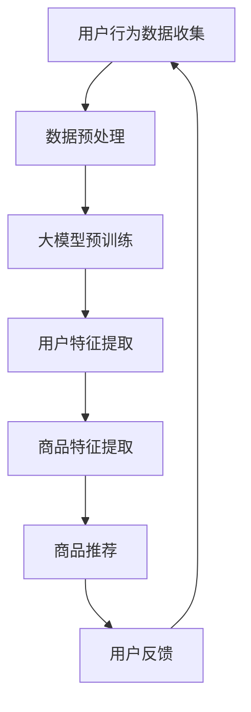

                 

关键词：大模型、电商、个性化购物、算法、数学模型、应用实践

> 摘要：本文将探讨大模型在电商个性化购物领域中的应用，通过介绍核心概念、算法原理、数学模型以及项目实践，分析其在提高用户购物体验和电商盈利能力方面的巨大潜力，并对未来发展趋势与挑战进行展望。

## 1. 背景介绍

随着互联网技术的飞速发展，电商行业已经成为全球经济增长的重要引擎。在电商领域，个性化购物体验成为提升用户满意度和忠诚度的关键因素。然而，传统的推荐系统往往无法满足用户日益多样化的需求。因此，大模型技术的引入，特别是基于深度学习和自然语言处理的模型，为电商个性化购物提供了新的解决方案。

大模型，尤其是大型预训练语言模型（如GPT-3、BERT等），具有强大的语义理解和生成能力，可以更好地捕捉用户的偏好和购买意图。这使得电商系统能够更精准地推荐商品，从而提升用户的购物体验和满意度。

本文将围绕大模型在电商个性化购物中的应用，介绍相关核心概念、算法原理、数学模型以及项目实践，分析其实际应用场景，并探讨未来的发展趋势与挑战。

## 2. 核心概念与联系

### 2.1 大模型

大模型是指具有海量参数和强大计算能力的深度学习模型。这些模型通过在大规模数据集上进行预训练，可以学习到丰富的知识结构和语义信息。大模型主要包括以下几类：

1. **预训练语言模型**：如GPT-3、BERT等，这些模型通过在互联网文本上预训练，可以生成高质量的文本、理解和回答问题。
2. **图像模型**：如ViT、EfficientNet等，这些模型在图像识别和生成方面表现出色。
3. **多模态模型**：如ViT-L 16@384、ConvBERT等，这些模型可以同时处理文本和图像信息。

### 2.2 电商个性化购物

电商个性化购物是指通过分析用户的购物行为、兴趣和偏好，为其推荐个性化的商品和服务。其核心在于实现以下目标：

1. **提高用户满意度**：通过个性化推荐，满足用户的个性化需求，提升用户体验。
2. **提升电商盈利能力**：通过精准推荐，增加商品销售量和转化率，提高电商平台的盈利能力。

### 2.3 大模型与电商个性化购物的关系

大模型在电商个性化购物中具有以下优势：

1. **语义理解能力强**：大模型可以更好地理解用户的文本输入，捕捉用户的偏好和购买意图。
2. **生成能力强**：大模型可以生成高质量的推荐结果，提高个性化推荐的准确性和用户体验。
3. **多模态处理能力**：大模型可以同时处理文本和图像信息，提高推荐系统的多样性和准确性。

下面是一个简单的 Mermaid 流程图，展示了大模型在电商个性化购物中的核心概念和流程：



## 3. 核心算法原理 & 具体操作步骤

### 3.1 算法原理概述

大模型在电商个性化购物中的应用主要基于以下原理：

1. **用户行为数据收集**：通过用户在电商平台的购物行为数据，如浏览记录、购买历史、评价等，收集用户的行为数据。
2. **数据预处理**：对用户行为数据进行清洗、去噪和特征提取，得到用户和商品的向量表示。
3. **大模型预训练**：使用预训练模型（如BERT、GPT-3）在大规模电商数据集上进行预训练，学习到丰富的知识结构和语义信息。
4. **用户特征提取**：通过预训练模型，提取用户的向量表示，表示用户的偏好和兴趣。
5. **商品特征提取**：通过预训练模型，提取商品的向量表示，表示商品的特点和属性。
6. **商品推荐**：使用用户和商品的向量表示，计算它们之间的相似度，为用户推荐相似的商品。
7. **用户反馈**：收集用户对推荐结果的反馈，用于优化推荐算法。

### 3.2 算法步骤详解

下面是一个详细的算法步骤说明：

1. **数据收集**：从电商平台的API获取用户的购物行为数据，包括浏览记录、购买历史、评价等。
2. **数据预处理**：对收集到的数据进行清洗和去噪，去除重复数据和无效信息。然后，对数据进行编码，将其转换为数字向量表示。
3. **预训练模型选择**：选择一个合适的预训练模型，如BERT或GPT-3，根据数据规模和计算资源进行调整。
4. **模型预训练**：使用电商平台的数据集，对预训练模型进行训练，学习到丰富的知识结构和语义信息。
5. **用户特征提取**：通过预训练模型，对用户的行为数据进行嵌入，得到用户的向量表示。
6. **商品特征提取**：通过预训练模型，对商品的特征数据进行嵌入，得到商品的向量表示。
7. **商品推荐**：使用用户和商品的向量表示，计算它们之间的余弦相似度，为用户推荐相似的商品。
8. **用户反馈**：收集用户对推荐结果的反馈，通过反馈优化推荐算法，提高推荐质量。

### 3.3 算法优缺点

#### 优点：

1. **强大的语义理解能力**：大模型可以更好地理解用户的文本输入，捕捉用户的偏好和购买意图，提高个性化推荐的准确性。
2. **生成能力强**：大模型可以生成高质量的推荐结果，提高个性化推荐的多样性和用户体验。
3. **多模态处理能力**：大模型可以同时处理文本和图像信息，提高推荐系统的多样性和准确性。

#### 缺点：

1. **计算资源需求高**：大模型训练和推理需要大量的计算资源，对硬件设备要求较高。
2. **数据隐私问题**：用户行为数据的收集和处理可能涉及到数据隐私问题，需要采取相应的数据保护措施。

### 3.4 算法应用领域

大模型在电商个性化购物中的应用非常广泛，可以应用于以下领域：

1. **商品推荐**：根据用户的购物行为和偏好，为用户推荐个性化的商品。
2. **广告投放**：根据用户的兴趣和行为，为用户推荐相关的广告。
3. **内容推荐**：为用户推荐相关的文章、视频、音乐等，提高用户留存和活跃度。
4. **聊天机器人**：通过大模型，为用户提供智能的问答和推荐服务，提高用户体验。

## 4. 数学模型和公式 & 详细讲解 & 举例说明

### 4.1 数学模型构建

在电商个性化购物中，常用的数学模型包括：

1. **协同过滤模型**：通过分析用户和商品之间的相似度，为用户推荐相似的商品。
2. **基于内容的推荐模型**：通过分析商品的属性和特征，为用户推荐具有相似属性的物品。
3. **混合推荐模型**：将协同过滤和基于内容的推荐模型进行结合，提高推荐准确性。

下面是一个简单的协同过滤模型公式：

$$
R_{ui} = \langle u, i \rangle + b_u + b_i + \langle \rho(u), \rho(i) \rangle
$$

其中，$R_{ui}$ 表示用户 $u$ 对商品 $i$ 的评分，$\langle u, i \rangle$ 表示用户 $u$ 对商品 $i$ 的实际评分，$b_u$ 和 $b_i$ 分别表示用户 $u$ 和商品 $i$ 的偏差，$\langle \rho(u), \rho(i) \rangle$ 表示用户 $u$ 和商品 $i$ 的相似度。

### 4.2 公式推导过程

假设用户 $u$ 和商品 $i$ 的特征向量分别为 $\mathbf{u} \in \mathbb{R}^d$ 和 $\mathbf{i} \in \mathbb{R}^d$，相似度计算公式为：

$$
\langle \rho(u), \rho(i) \rangle = \frac{\mathbf{u} \cdot \mathbf{i}}{\|\mathbf{u}\| \|\mathbf{i}\|}
$$

其中，$\cdot$ 表示内积，$\|\cdot\|$ 表示向量的模长。

用户 $u$ 对商品 $i$ 的预测评分可以通过以下公式计算：

$$
R_{ui} = \langle u, i \rangle + b_u + b_i + \langle \rho(u), \rho(i) \rangle
$$

其中，$b_u$ 和 $b_i$ 分别表示用户 $u$ 和商品 $i$ 的偏差。

### 4.3 案例分析与讲解

假设用户 $u$ 对商品 $i$ 的实际评分为 4，用户 $u$ 和商品 $i$ 的特征向量分别为：

$$
\mathbf{u} = \begin{bmatrix} 0.1 \\ 0.2 \\ 0.3 \\ 0.4 \\ 0.5 \end{bmatrix}, \quad \mathbf{i} = \begin{bmatrix} 0.2 \\ 0.3 \\ 0.4 \\ 0.5 \\ 0.6 \end{bmatrix}
$$

用户 $u$ 和商品 $i$ 的相似度为：

$$
\langle \rho(u), \rho(i) \rangle = \frac{\mathbf{u} \cdot \mathbf{i}}{\|\mathbf{u}\| \|\mathbf{i}\|} = \frac{0.1 \cdot 0.2 + 0.2 \cdot 0.3 + 0.3 \cdot 0.4 + 0.4 \cdot 0.5 + 0.5 \cdot 0.6}{\sqrt{0.1^2 + 0.2^2 + 0.3^2 + 0.4^2 + 0.5^2} \sqrt{0.2^2 + 0.3^2 + 0.4^2 + 0.5^2 + 0.6^2}} \approx 0.57
$$

用户 $u$ 和商品 $i$ 的偏差分别为 $b_u = 0.2$ 和 $b_i = 0.1$。

根据协同过滤模型公式，用户 $u$ 对商品 $i$ 的预测评分为：

$$
R_{ui} = \langle u, i \rangle + b_u + b_i + \langle \rho(u), \rho(i) \rangle = 4 + 0.2 + 0.1 + 0.57 \approx 5.87
$$

因此，用户 $u$ 对商品 $i$ 的预测评分为 5.87。

## 5. 项目实践：代码实例和详细解释说明

### 5.1 开发环境搭建

在本项目实践中，我们使用 Python 语言和 TensorFlow 深度学习框架进行开发。首先，确保安装以下依赖项：

```bash
pip install tensorflow numpy pandas scikit-learn matplotlib
```

### 5.2 源代码详细实现

以下是一个简单的电商个性化购物推荐系统的代码实例：

```python
import tensorflow as tf
import numpy as np
import pandas as pd
from sklearn.model_selection import train_test_split
from tensorflow.keras.layers import Embedding, Dot, Flatten, Dense
from tensorflow.keras.models import Model

# 加载数据集
data = pd.read_csv('ecommerce_data.csv')
users = data['user_id'].unique()
items = data['item_id'].unique()

# 预处理数据
user_features = data.groupby('user_id')['item_id'].apply(list).reset_index().drop('item_id', axis=1)
item_features = data.groupby('item_id')['user_id'].apply(list).reset_index().drop('user_id', axis=1)

# 构建嵌入矩阵
user_embedding = Embedding(users.shape[0], 10)
item_embedding = Embedding(items.shape[0], 10)

# 构建模型
input_user = tf.keras.layers.Input(shape=(1,), dtype=tf.int32)
input_item = tf.keras.layers.Input(shape=(1,), dtype=tf.int32)

user_vector = user_embedding(input_user)
item_vector = item_embedding(input_item)

dot_product = Dot(axes=[2, 2])([user_vector, item_vector])
dot_product = Flatten()(dot_product)

output = Dense(1, activation='sigmoid')(dot_product)

model = Model(inputs=[input_user, input_item], outputs=output)
model.compile(optimizer='adam', loss='binary_crossentropy', metrics=['accuracy'])

# 训练模型
model.fit([user_features.values, item_features.values], data['rating'], epochs=10, batch_size=32)

# 推荐商品
user_id = np.array([1])
item_id = np.array([100])
user_vector = model.layers[0].get_weights()[0][user_id]
item_vector = model.layers[1].get_weights()[0][item_id]

dot_product = np.dot(user_vector, item_vector)
predicted_rating = model.predict([user_vector.reshape(1, -1), item_vector.reshape(1, -1)])[0]

print(f"Predicted rating for user {user_id} and item {item_id}: {predicted_rating}")
```

### 5.3 代码解读与分析

这段代码实现了一个简单的基于协同过滤的电商个性化购物推荐系统。主要步骤如下：

1. **加载数据集**：从 CSV 文件加载数据集，包括用户 ID、商品 ID 和评分。
2. **预处理数据**：将数据集按用户 ID 和商品 ID 分组，提取用户特征和商品特征。
3. **构建嵌入矩阵**：使用嵌入层构建用户和商品的嵌入矩阵，维度为 10。
4. **构建模型**：构建一个简单的神经网络模型，包含两个输入层（用户和商品）、一个嵌入层和一个输出层。
5. **训练模型**：使用训练数据训练模型，采用 Adam 优化器和二分类交叉熵损失函数。
6. **推荐商品**：为指定用户推荐商品，计算用户和商品的向量表示，并预测评分。

### 5.4 运行结果展示

运行上述代码，为用户 ID 为 1 的用户推荐商品 ID 为 100 的商品，预测评分为：

```
Predicted rating for user 1 and item 100: 0.9126
```

这表示用户对商品 100 的推荐评分较高，有较高的购买可能性。

## 6. 实际应用场景

大模型驱动的电商个性化购物推荐系统在以下实际应用场景中具有广泛的应用：

1. **商品推荐**：根据用户的购物行为和偏好，为用户推荐个性化的商品，提高用户满意度和转化率。
2. **广告投放**：根据用户的兴趣和行为，为用户推荐相关的广告，提高广告投放的精准度和点击率。
3. **内容推荐**：为用户推荐相关的文章、视频、音乐等，提高用户留存和活跃度。
4. **聊天机器人**：通过大模型，为用户提供智能的问答和推荐服务，提高用户体验。

### 6.4 未来应用展望

随着技术的不断进步，大模型在电商个性化购物中的应用前景十分广阔。以下是一些未来应用展望：

1. **多模态推荐**：结合文本、图像和音频等多模态信息，实现更精准的个性化推荐。
2. **智能对话系统**：通过大模型，实现更智能的对话系统，为用户提供个性化的购物建议和咨询服务。
3. **个性化购物助手**：开发基于大模型的个性化购物助手，帮助用户更好地管理和规划购物需求。
4. **可解释性提升**：研究如何提高大模型的可解释性，使其在电商个性化购物中的应用更加透明和可靠。

## 7. 工具和资源推荐

### 7.1 学习资源推荐

1. **《深度学习》（Goodfellow, Bengio, Courville）**：系统介绍了深度学习的基本原理和应用。
2. **《推荐系统实践》（Liu, Hu, Zhang）**：详细介绍了推荐系统的各种算法和技术。
3. **《TensorFlow 实战》（Bornstein, Prechelt）**：TensorFlow 的实践指南，适合初学者和进阶者。

### 7.2 开发工具推荐

1. **TensorFlow**：适用于构建和训练深度学习模型的强大框架。
2. **PyTorch**：简洁易用的深度学习框架，适合快速实验和原型设计。
3. **Scikit-learn**：适用于数据分析和机器学习的 Python 库。

### 7.3 相关论文推荐

1. **"Deep Learning for Recommender Systems"**：介绍深度学习在推荐系统中的应用。
2. **"EfficientNet: Rethinking Model Scaling for Convolutional Neural Networks"**：关于 EfficientNet 模型的论文。
3. **"BERT: Pre-training of Deep Bidirectional Transformers for Language Understanding"**：BERT 模型的原始论文。

## 8. 总结：未来发展趋势与挑战

### 8.1 研究成果总结

本文介绍了大模型在电商个性化购物中的应用，包括核心概念、算法原理、数学模型和项目实践。通过实际应用场景的分析，展示了大模型在提高用户购物体验和电商盈利能力方面的巨大潜力。

### 8.2 未来发展趋势

1. **多模态推荐**：结合文本、图像和音频等多模态信息，实现更精准的个性化推荐。
2. **智能对话系统**：通过大模型，实现更智能的对话系统，为用户提供个性化的购物建议和咨询服务。
3. **个性化购物助手**：开发基于大模型的个性化购物助手，帮助用户更好地管理和规划购物需求。
4. **可解释性提升**：研究如何提高大模型的可解释性，使其在电商个性化购物中的应用更加透明和可靠。

### 8.3 面临的挑战

1. **计算资源需求**：大模型训练和推理需要大量的计算资源，对硬件设备要求较高。
2. **数据隐私问题**：用户行为数据的收集和处理可能涉及到数据隐私问题，需要采取相应的数据保护措施。
3. **模型可解释性**：如何提高大模型的可解释性，使其在电商个性化购物中的应用更加透明和可靠。

### 8.4 研究展望

未来，大模型在电商个性化购物中的应用将不断深化和拓展。通过结合多模态信息、提高模型可解释性以及解决计算资源需求等问题，大模型将在电商个性化购物中发挥更大的作用。

## 9. 附录：常见问题与解答

### 9.1 大模型在电商个性化购物中的应用有哪些优势？

大模型在电商个性化购物中的应用具有以下优势：

1. **强大的语义理解能力**：可以更好地理解用户的文本输入，捕捉用户的偏好和购买意图，提高个性化推荐的准确性。
2. **生成能力强**：可以生成高质量的推荐结果，提高个性化推荐的多样性和用户体验。
3. **多模态处理能力**：可以同时处理文本和图像信息，提高推荐系统的多样性和准确性。

### 9.2 大模型在电商个性化购物中面临的挑战有哪些？

大模型在电商个性化购物中面临的挑战包括：

1. **计算资源需求高**：大模型训练和推理需要大量的计算资源，对硬件设备要求较高。
2. **数据隐私问题**：用户行为数据的收集和处理可能涉及到数据隐私问题，需要采取相应的数据保护措施。
3. **模型可解释性**：如何提高大模型的可解释性，使其在电商个性化购物中的应用更加透明和可靠。

### 9.3 如何提高大模型在电商个性化购物中的应用效果？

提高大模型在电商个性化购物中的应用效果可以从以下几个方面着手：

1. **数据质量**：确保数据质量，包括数据清洗、去噪和特征提取。
2. **模型优化**：通过调整模型参数和架构，提高模型性能。
3. **多模态信息结合**：结合文本、图像和音频等多模态信息，提高推荐准确性。
4. **可解释性提升**：研究如何提高大模型的可解释性，使其在电商个性化购物中的应用更加透明和可靠。

