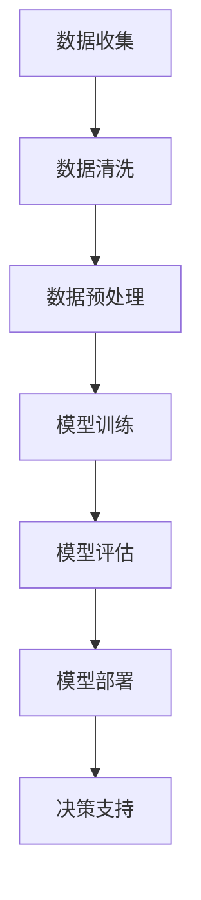

                 

关键词：大模型、商业智能、人工智能、机器学习、深度学习、云计算

> 摘要：本文将深入探讨大模型在商业智能领域中的应用和影响力。大模型，作为一种强大的机器学习技术，能够处理海量数据，提取有价值的信息，为商业决策提供科学依据。本文将从背景介绍、核心概念与联系、核心算法原理、数学模型和公式、项目实践、实际应用场景、未来应用展望等多个方面展开讨论，旨在为读者提供全面的大模型与商业智能知识。

## 1. 背景介绍

商业智能（Business Intelligence，BI）是一种通过技术手段，对企业的数据进行收集、存储、分析和展示，以支持企业决策的过程。随着大数据和云计算的普及，商业智能在各个行业得到了广泛应用。然而，传统的商业智能技术难以应对海量数据的处理和分析，这就需要更加先进的技术来支撑。

大模型（Large Model），也被称为巨量级模型，是一种能够处理大规模数据、进行复杂计算的人工智能技术。大模型通常基于深度学习和神经网络，具有高度并行化和自动化的特点。近年来，随着计算能力的提升和算法的优化，大模型在自然语言处理、计算机视觉、语音识别等领域取得了显著的成果。

本文旨在探讨大模型在商业智能领域的应用，分析大模型如何改变商业智能的技术架构、数据分析和决策过程，以及未来可能的发展趋势。

## 2. 核心概念与联系

### 2.1 大模型

大模型是指参数数量庞大、能够处理海量数据的机器学习模型。这些模型通常基于深度学习技术，包括但不限于神经网络、循环神经网络（RNN）、长短时记忆网络（LSTM）等。大模型具有以下特点：

- **高参数数量**：大模型的参数数量可以达到亿级别，能够捕捉数据中的细微特征。
- **强大的泛化能力**：大模型通过大量的训练数据，能够泛化到未见过的数据上，提高模型的鲁棒性。
- **高效的计算能力**：大模型利用现代硬件技术，如GPU、TPU等，实现高效计算。

### 2.2 商业智能

商业智能是指通过数据挖掘、数据分析、数据可视化等技术，帮助企业从海量数据中提取有价值的信息，辅助决策。商业智能的核心包括：

- **数据集成**：将来自不同数据源的数据进行整合。
- **数据分析**：利用统计、数据挖掘等技术对数据进行处理和分析。
- **数据可视化**：通过图表、仪表盘等形式，直观地展示数据。

### 2.3 大模型与商业智能的联系

大模型与商业智能有着紧密的联系：

- **数据处理**：大模型能够高效处理海量数据，为商业智能提供数据支撑。
- **分析预测**：大模型具有强大的分析预测能力，能够为企业提供精准的决策支持。
- **自动化决策**：大模型能够实现自动化决策，降低人力成本，提高决策效率。

### 2.4 Mermaid 流程图

以下是大模型在商业智能中的应用流程图：



## 3. 核心算法原理 & 具体操作步骤

### 3.1 算法原理概述

大模型的算法原理主要基于深度学习，特别是神经网络。深度学习是一种通过多层神经网络来模拟人脑神经网络进行信息处理的技术。以下是深度学习的基本原理：

- **神经网络**：神经网络由多个神经元（节点）组成，每个神经元都与相邻的神经元相连。连接的权重决定了信息传递的程度。
- **前向传播**：信息从前一层传递到下一层，通过加权求和并应用激活函数，得到输出值。
- **反向传播**：根据输出误差，反向调整权重，优化模型参数。
- **优化算法**：如梯度下降、Adam等，用于调整权重，优化模型。

### 3.2 算法步骤详解

大模型的具体操作步骤如下：

#### 步骤1：数据收集

收集来自不同来源的数据，包括结构化数据、非结构化数据和半结构化数据。

#### 步骤2：数据清洗

对收集到的数据进行清洗，去除噪声和异常值，确保数据质量。

#### 步骤3：数据预处理

将数据转换为适合模型训练的格式，如归一化、标准化等。

#### 步骤4：模型训练

利用训练数据，通过前向传播和反向传播，调整模型参数，训练出大模型。

#### 步骤5：模型评估

利用测试数据，对训练好的模型进行评估，确保模型的泛化能力和准确性。

#### 步骤6：模型部署

将训练好的模型部署到生产环境中，为实际业务提供决策支持。

### 3.3 算法优缺点

#### 优点

- **高效处理大量数据**：大模型能够高效处理海量数据，提高数据分析的效率。
- **强大的预测能力**：大模型具有强大的预测能力，能够为企业提供精准的决策支持。
- **自动化的决策过程**：大模型能够实现自动化决策，降低人力成本。

#### 缺点

- **训练成本高**：大模型的训练需要大量的计算资源和时间。
- **对数据质量要求高**：大模型对数据质量要求较高，数据清洗和预处理过程复杂。
- **可解释性差**：大模型的决策过程较为复杂，难以解释。

### 3.4 算法应用领域

大模型在商业智能领域具有广泛的应用，如：

- **客户行为分析**：通过分析客户行为数据，预测客户需求，优化营销策略。
- **风险控制**：通过分析历史数据，预测潜在风险，为金融企业提供风险控制建议。
- **供应链管理**：通过优化供应链数据，提高供应链效率，降低成本。

## 4. 数学模型和公式 & 详细讲解 & 举例说明

### 4.1 数学模型构建

大模型的数学模型主要基于深度学习和神经网络。以下是一个简化的神经网络模型：

#### 输入层（Input Layer）

$$
x_1, x_2, ..., x_n
$$

#### 隐藏层（Hidden Layer）

$$
h_1 = \sigma(W_1 \cdot x + b_1)
$$
$$
h_2 = \sigma(W_2 \cdot h_1 + b_2)
$$

其中，$W_1, W_2$ 为权重矩阵，$b_1, b_2$ 为偏置项，$\sigma$ 为激活函数。

#### 输出层（Output Layer）

$$
y = \sigma(W_3 \cdot h_2 + b_3)
$$

其中，$W_3$ 为权重矩阵，$b_3$ 为偏置项，$\sigma$ 为激活函数。

### 4.2 公式推导过程

以下是一个简化的反向传播算法推导过程：

#### 步骤1：前向传播

$$
z_1 = W_1 \cdot x + b_1
$$
$$
a_1 = \sigma(z_1)
$$
$$
z_2 = W_2 \cdot a_1 + b_2
$$
$$
a_2 = \sigma(z_2)
$$
$$
z_3 = W_3 \cdot a_2 + b_3
$$
$$
y = \sigma(z_3)
$$

#### 步骤2：计算损失函数

$$
L = (y - \hat{y})^2
$$

#### 步骤3：反向传播

$$
\delta_3 = (y - \hat{y}) \cdot \sigma'(z_3)
$$
$$
\delta_2 = (W_3 \cdot \delta_3) \cdot \sigma'(z_2)
$$
$$
\delta_1 = (W_2 \cdot \delta_2) \cdot \sigma'(z_1)
$$

#### 步骤4：更新权重和偏置项

$$
W_3 = W_3 - \alpha \cdot (W_3 \cdot \delta_3)
$$
$$
b_3 = b_3 - \alpha \cdot \delta_3
$$
$$
W_2 = W_2 - \alpha \cdot (W_2 \cdot \delta_2)
$$
$$
b_2 = b_2 - \alpha \cdot \delta_2
$$
$$
W_1 = W_1 - \alpha \cdot (W_1 \cdot \delta_1)
$$
$$
b_1 = b_1 - \alpha \cdot \delta_1
$$

### 4.3 案例分析与讲解

#### 案例背景

某电商公司希望通过分析用户行为数据，预测用户购买商品的概率，从而优化营销策略。

#### 数据准备

收集用户的浏览历史、购物车记录、购买历史等数据，并进行清洗和预处理。

#### 模型构建

构建一个简单的多层感知机（MLP）模型，输入层为用户行为数据，输出层为购买概率。

#### 模型训练

利用训练数据，通过前向传播和反向传播，训练模型。

#### 模型评估

利用测试数据，评估模型的准确性和泛化能力。

#### 模型部署

将训练好的模型部署到生产环境中，为实际业务提供购买概率预测。

## 5. 项目实践：代码实例和详细解释说明

### 5.1 开发环境搭建

- Python 3.8+
- TensorFlow 2.3+
- Keras 2.4+

### 5.2 源代码详细实现

```python
import numpy as np
import tensorflow as tf
from tensorflow.keras.models import Sequential
from tensorflow.keras.layers import Dense

# 数据准备
# 这里假设已经收集并预处理好了用户行为数据，存放在data.npy中
data = np.load('data.npy')

# 数据划分
train_data, test_data = data[:8000], data[8000:]

# 构建模型
model = Sequential()
model.add(Dense(64, activation='relu', input_shape=(train_data.shape[1],)))
model.add(Dense(32, activation='relu'))
model.add(Dense(1, activation='sigmoid'))

# 编译模型
model.compile(optimizer='adam', loss='binary_crossentropy', metrics=['accuracy'])

# 训练模型
model.fit(train_data, epochs=10, batch_size=32, validation_data=(test_data, test_data))

# 评估模型
loss, accuracy = model.evaluate(test_data, test_data)
print(f'测试集准确率：{accuracy:.2f}')

# 部署模型
# 这里假设已经将模型保存到了model.h5中
model.save('model.h5')
```

### 5.3 代码解读与分析

- **数据准备**：首先，我们需要准备好用户行为数据，并将其划分为训练集和测试集。
- **模型构建**：我们使用Keras构建了一个简单的多层感知机（MLP）模型，包含一个输入层、一个隐藏层和一个输出层。
- **编译模型**：我们使用adam优化器和binary_crossentropy损失函数来编译模型，同时关注模型的准确率。
- **训练模型**：我们使用fit方法来训练模型，设置训练轮数为10，批量大小为32，并使用validation_data参数来评估模型的泛化能力。
- **评估模型**：使用evaluate方法评估模型在测试集上的性能，输出准确率。
- **部署模型**：将训练好的模型保存到文件中，以便在实际业务中使用。

## 6. 实际应用场景

大模型在商业智能领域具有广泛的应用场景：

### 6.1 客户行为分析

通过分析客户的浏览、购买、评论等行为数据，预测客户需求，优化营销策略。

### 6.2 风险控制

利用历史数据，预测潜在风险，为金融企业提供风险控制建议。

### 6.3 供应链管理

优化供应链数据，提高供应链效率，降低成本。

### 6.4 智能客服

通过自然语言处理技术，实现智能客服，提高客户满意度。

### 6.5 营销自动化

利用大模型，实现自动化营销，降低人力成本，提高营销效果。

## 7. 未来应用展望

未来，大模型在商业智能领域将有更广泛的应用：

### 7.1 数据挖掘与预测

大模型将更加深入地挖掘数据价值，实现更精准的预测。

### 7.2 自主决策

大模型将实现自主决策，减少人工干预，提高决策效率。

### 7.3 智能化服务

大模型将推动智能化服务的发展，提高用户体验。

### 7.4 产业链协同

大模型将实现产业链的协同，提高整体效率。

## 8. 工具和资源推荐

### 8.1 学习资源推荐

- 《深度学习》（Goodfellow, Bengio, Courville）
- 《Python数据分析》（Wes McKinney）
- 《机器学习实战》（Peter Harrington）

### 8.2 开发工具推荐

- TensorFlow
- Keras
- PyTorch

### 8.3 相关论文推荐

- "Distributed Representations of Words and Phrases and their Compositionality"
- "Deep Learning for Text Classification"
- "EfficientNet: Rethinking Model Scaling for Convolutional Neural Networks"

## 9. 总结：未来发展趋势与挑战

大模型在商业智能领域具有巨大的潜力，但同时也面临着以下挑战：

### 9.1 数据隐私与安全

如何保护用户数据隐私和安全，成为大模型应用的重要问题。

### 9.2 模型可解释性

大模型的决策过程较为复杂，如何提高模型的可解释性，是未来研究的重要方向。

### 9.3 模型可靠性

如何确保大模型的可靠性，避免因模型错误导致的决策失误，是未来研究的重点。

### 9.4 计算资源消耗

大模型的训练和部署需要大量的计算资源，如何优化计算资源消耗，是未来研究的课题。

## 附录：常见问题与解答

### 问题1：大模型如何处理海量数据？

解答：大模型通常采用分布式计算技术，如GPU、TPU等，实现高效计算，从而处理海量数据。

### 问题2：大模型如何保证预测准确性？

解答：大模型通过大量的训练数据和先进的算法，提高预测准确性。同时，通过交叉验证和模型评估等方法，确保模型的泛化能力。

### 问题3：大模型对数据质量要求高吗？

解答：是的，大模型对数据质量要求较高。数据清洗和预处理是保证模型性能的重要步骤。

### 问题4：大模型能否替代人类决策？

解答：大模型可以辅助人类决策，但无法完全替代。人类决策具有灵活性、创造性等特点，是当前大模型所不能替代的。

作者：禅与计算机程序设计艺术 / Zen and the Art of Computer Programming
----------------------------------------------------------------

这篇文章详细探讨了大模型在商业智能领域的应用，从背景介绍、核心概念、算法原理、数学模型、项目实践、实际应用场景、未来应用展望等多个方面进行了全面阐述。希望这篇文章能为读者提供对大模型和商业智能的深入理解。随着技术的不断发展，大模型在商业智能领域的应用将更加广泛，为企业和行业带来更多创新和变革。让我们期待未来，共同见证大模型推动商业智能的新动力。

