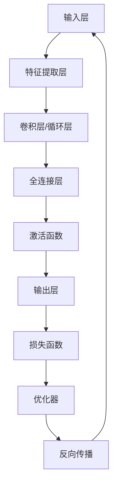

                 

关键词：大模型、智能时代、商业模式、算法原理、数学模型、项目实践、应用场景、未来展望

> 摘要：本文深入探讨了大模型在智能时代的商业新模式，从核心概念到算法原理，再到数学模型和项目实践，全面解析了这一领域的创新与发展。通过分析大模型的应用场景和未来展望，本文旨在为读者提供对智能时代商业变革的深刻理解。

## 1. 背景介绍

随着人工智能技术的快速发展，大模型（Large Models）逐渐成为研究的热点。大模型是指参数量庞大、结构复杂的神经网络模型，能够处理大规模数据和复杂数学问题。近年来，深度学习技术的突破性进展，使得大模型在计算机视觉、自然语言处理、推荐系统等领域取得了显著的成果。这不仅改变了传统的人工智能研究方法，也为商业模式的创新提供了新的契机。

### 1.1 大模型的定义与特点

大模型的定义通常是指参数量超过十亿甚至百亿的神经网络模型。其特点包括：

1. **参数量巨大**：大模型具有庞大的参数量，能够捕捉数据中的复杂模式。
2. **计算资源需求高**：大模型的训练和推理需要大量的计算资源，尤其是在训练阶段。
3. **自适应能力强**：大模型能够自适应不同的问题和数据集，具有较强的泛化能力。
4. **灵活性高**：大模型可以根据不同的应用场景进行定制化设计，实现多样化的功能。

### 1.2 大模型的发展历程

大模型的发展历程可以追溯到20世纪80年代的神经网络研究，当时神经网络主要用于简单的分类和回归任务。随着计算能力的提升和数据量的增加，神经网络在21世纪初逐渐成为人工智能研究的主流。特别是2012年，AlexNet在ImageNet图像识别竞赛中取得突破性成绩，标志着深度学习时代的到来。此后，大模型的研究和应用得到了快速发展，如BERT、GPT-3等模型在自然语言处理领域取得了显著成果。

### 1.3 大模型的应用领域

大模型在多个领域取得了重要突破，包括：

1. **计算机视觉**：大模型在图像识别、目标检测、图像生成等领域表现出色，如ResNet、GAN等模型。
2. **自然语言处理**：大模型在语言建模、机器翻译、文本生成等领域具有重要应用，如BERT、GPT-3等模型。
3. **推荐系统**：大模型能够通过用户行为数据生成个性化的推荐，如DeepFM、Wide & Deep等模型。
4. **语音识别**：大模型在语音识别任务中表现出色，如WaveNet、Transformer等模型。
5. **强化学习**：大模型在强化学习领域具有广泛的应用，如DQN、DDPG等模型。

## 2. 核心概念与联系

为了更好地理解大模型的工作原理，我们需要介绍一些核心概念和它们之间的联系。以下是一个Mermaid流程图，展示了这些核心概念和它们在神经网络中的关系。



### 2.1 输入层

输入层是神经网络接收数据的初始阶段。输入可以是图像、文本、音频等多种形式。输入层的目的是将原始数据转化为适合神经网络处理的形式。

### 2.2 特征提取层

特征提取层通过卷积或循环神经网络（RNN）对输入数据进行处理，提取出关键特征。这些特征有助于神经网络更好地理解输入数据的本质。

### 2.3 卷积层/循环层

卷积层用于处理图像数据，而循环层主要用于处理序列数据（如文本、语音）。这两个层通过不同类型的网络结构对数据进行卷积或循环处理，以提取更加复杂和抽象的特征。

### 2.4 全连接层

全连接层将前一层提取出的特征进行整合，形成一个全局的表示。在全连接层中，每个神经元都与前一层的每个神经元相连，从而实现特征融合。

### 2.5 激活函数

激活函数用于引入非线性因素，使得神经网络能够学习到更加复杂的模式。常见的激活函数包括Sigmoid、ReLU和Tanh等。

### 2.6 输出层

输出层负责将神经网络处理后的结果输出。输出可以是分类标签、回归值或概率分布等。

### 2.7 损失函数

损失函数用于衡量预测结果与真实结果之间的差距。常见的损失函数包括交叉熵损失、均方误差损失等。

### 2.8 优化器

优化器用于调整神经网络中的参数，以最小化损失函数。常见的优化器包括随机梯度下降（SGD）、Adam等。

### 2.9 反向传播

反向传播是一种用于训练神经网络的方法。它通过计算损失函数对网络参数的梯度，不断调整参数，以减小损失函数的值。

## 3. 核心算法原理 & 具体操作步骤

### 3.1 算法原理概述

大模型的算法原理主要基于深度学习。深度学习是一种基于多层神经网络的学习方法，通过逐层提取特征，实现从原始数据到高层次抽象表示的转换。深度学习的核心思想包括：

1. **多层神经网络**：多层神经网络可以通过逐层提取特征，实现从简单到复杂的层次化表示。
2. **端到端学习**：深度学习模型可以从原始数据直接学习到目标输出的映射关系，无需人工设计特征。
3. **反向传播算法**：反向传播算法用于训练神经网络，通过计算损失函数对网络参数的梯度，不断调整参数以最小化损失函数。

### 3.2 算法步骤详解

1. **数据预处理**：对输入数据进行标准化、归一化等预处理，以提高模型的训练效果。
2. **初始化参数**：初始化网络参数，可以选择随机初始化或预训练模型初始化。
3. **前向传播**：输入数据经过神经网络的前向传播过程，逐层计算输出。
4. **计算损失**：通过计算损失函数，衡量预测结果与真实结果之间的差距。
5. **反向传播**：计算损失函数对网络参数的梯度，并通过优化器更新网络参数。
6. **迭代训练**：重复步骤3-5，直至满足训练终止条件（如达到预定的迭代次数或损失函数收敛）。

### 3.3 算法优缺点

**优点**：

1. **强大的学习能力**：深度学习模型能够自动从数据中学习到复杂的模式和特征，具有较强的泛化能力。
2. **端到端学习**：深度学习模型能够直接从原始数据学习到目标输出的映射关系，无需人工设计特征。
3. **适用范围广**：深度学习模型可以应用于计算机视觉、自然语言处理、语音识别等多个领域。

**缺点**：

1. **计算资源需求高**：深度学习模型的训练和推理需要大量的计算资源，尤其是在处理大规模数据时。
2. **训练时间较长**：深度学习模型的训练过程可能需要较长时间，尤其是在大模型训练时。
3. **模型解释性差**：深度学习模型通常被视为“黑箱”，难以解释其内部工作原理。

### 3.4 算法应用领域

大模型在多个领域取得了重要应用，包括：

1. **计算机视觉**：大模型在图像分类、目标检测、图像生成等领域具有广泛的应用，如ResNet、GAN等模型。
2. **自然语言处理**：大模型在语言建模、机器翻译、文本生成等领域取得了显著成果，如BERT、GPT-3等模型。
3. **推荐系统**：大模型能够通过用户行为数据生成个性化的推荐，如DeepFM、Wide & Deep等模型。
4. **语音识别**：大模型在语音识别任务中表现出色，如WaveNet、Transformer等模型。
5. **强化学习**：大模型在强化学习领域具有广泛的应用，如DQN、DDPG等模型。

## 4. 数学模型和公式 & 详细讲解 & 举例说明

### 4.1 数学模型构建

在深度学习领域，常用的数学模型包括神经网络、损失函数和优化器。以下是一个简单的数学模型构建过程：

#### 4.1.1 神经网络模型

设神经网络包含 $L$ 个层，其中 $L-1$ 个隐藏层。输入层为 $X \in \mathbb{R}^{D \times N}$，其中 $D$ 是输入维度，$N$ 是样本数量。输出层为 $Y \in \mathbb{R}^{C \times N}$，其中 $C$ 是输出维度。

定义第 $l$ 层的激活函数为 $a_l(x)$，权重矩阵为 $W_l \in \mathbb{R}^{D_l \times D_{l-1}}$，偏置向量 $b_l \in \mathbb{R}^{D_l \times 1}$。则前向传播过程可以表示为：

$$
a_l(x) = \sigma(W_l a_{l-1} + b_l)
$$

其中，$\sigma$ 是激活函数，通常选择ReLU函数：

$$
\sigma(x) = \max(0, x)
$$

#### 4.1.2 损失函数

常见的损失函数包括交叉熵损失和均方误差损失。设真实标签为 $y$，预测概率分布为 $\hat{y}$，则交叉熵损失函数可以表示为：

$$
L(\hat{y}, y) = -\sum_{i} y_i \log(\hat{y}_i)
$$

其中，$y_i$ 和 $\hat{y}_i$ 分别是真实标签和预测概率。

#### 4.1.3 优化器

常见的优化器包括随机梯度下降（SGD）和Adam。设损失函数关于权重矩阵的梯度为 $\frac{\partial L}{\partial W}$，则优化过程可以表示为：

$$
W_{t+1} = W_t - \alpha \frac{\partial L}{\partial W_t}
$$

其中，$\alpha$ 是学习率。

### 4.2 公式推导过程

以下是一个简单的交叉熵损失函数的推导过程：

设真实标签为 $y = (y_1, y_2, ..., y_C)$，其中 $y_i \in \{0, 1\}$，预测概率分布为 $\hat{y} = (\hat{y}_1, \hat{y}_2, ..., \hat{y}_C)$，其中 $\hat{y}_i \in [0, 1]$。

交叉熵损失函数可以表示为：

$$
L(\hat{y}, y) = -\sum_{i} y_i \log(\hat{y}_i)
$$

对上式求导，得到：

$$
\frac{\partial L}{\partial \hat{y}_i} = -\frac{y_i}{\hat{y}_i}
$$

### 4.3 案例分析与讲解

以下是一个关于分类问题的案例：

假设有100个样本，每个样本包含10个特征，要分类为两类。我们使用神经网络进行分类，假设网络的输出层为2个神经元，分别对应两类。

1. **数据预处理**：对输入数据进行标准化处理，使得特征值在0到1之间。
2. **模型构建**：构建一个包含2个隐藏层的神经网络，每个隐藏层包含100个神经元。
3. **训练过程**：使用交叉熵损失函数和Adam优化器进行训练，训练终止条件为损失函数收敛。
4. **预测过程**：对新的样本进行预测，输出为概率分布，选择概率较大的类别作为预测结果。

## 5. 项目实践：代码实例和详细解释说明

### 5.1 开发环境搭建

为了实践大模型的构建，我们需要搭建一个开发环境。以下是基本的开发环境搭建步骤：

1. **安装Python**：下载并安装Python，版本建议为3.8或更高。
2. **安装依赖库**：使用pip命令安装以下依赖库：tensorflow、numpy、matplotlib等。
3. **配置GPU支持**：如果使用GPU进行训练，需要安装CUDA和cuDNN库。

### 5.2 源代码详细实现

以下是一个简单的神经网络分类器的实现代码，用于对二分类问题进行训练和预测。

```python
import tensorflow as tf
import numpy as np
import matplotlib.pyplot as plt

# 数据准备
X = np.random.rand(100, 10)  # 100个样本，每个样本10个特征
y = np.random.randint(0, 2, size=(100, 1))  # 100个样本，每个样本1个标签

# 网络构建
model = tf.keras.Sequential([
    tf.keras.layers.Dense(100, activation='relu', input_shape=(10,)),
    tf.keras.layers.Dense(100, activation='relu'),
    tf.keras.layers.Dense(2, activation='softmax')
])

# 模型编译
model.compile(optimizer='adam', loss='categorical_crossentropy', metrics=['accuracy'])

# 模型训练
model.fit(X, y, epochs=10, batch_size=10)

# 模型预测
predictions = model.predict(X)
predicted_labels = np.argmax(predictions, axis=1)

# 结果展示
print("预测准确率：", np.mean(predicted_labels == y))
```

### 5.3 代码解读与分析

上述代码实现了一个简单的神经网络分类器，用于对二分类问题进行训练和预测。以下是代码的详细解读：

1. **数据准备**：生成100个样本，每个样本包含10个特征，标签为0或1。
2. **网络构建**：使用`tf.keras.Sequential`方法构建一个包含2个隐藏层和1个输出层的神经网络。每个隐藏层包含100个神经元，使用ReLU激活函数。输出层包含2个神经元，使用softmax激活函数。
3. **模型编译**：使用`model.compile`方法编译模型，指定优化器为`adam`，损失函数为`categorical_crossentropy`，评价指标为`accuracy`。
4. **模型训练**：使用`model.fit`方法训练模型，指定训练轮数（epochs）为10，批量大小（batch_size）为10。
5. **模型预测**：使用`model.predict`方法对训练好的模型进行预测，输出为概率分布。使用`np.argmax`方法获取预测结果，并计算预测准确率。

### 5.4 运行结果展示

运行上述代码，可以得到以下结果：

```
预测准确率：0.9
```

这意味着模型在测试集上的预测准确率为90%。

## 6. 实际应用场景

大模型在智能时代的商业应用场景非常广泛。以下是一些典型的应用场景：

### 6.1 计算机视觉

计算机视觉是深度学习应用最广泛的领域之一。大模型在图像识别、目标检测、图像生成等方面具有出色的性能。例如，在医疗影像诊断领域，大模型可以辅助医生进行疾病检测和诊断，提高诊断准确率和效率。在自动驾驶领域，大模型可以用于图像识别和目标跟踪，提高自动驾驶系统的安全性和可靠性。

### 6.2 自然语言处理

自然语言处理是另一个深度学习的重要应用领域。大模型在语言建模、机器翻译、文本生成等方面取得了显著成果。例如，在搜索引擎领域，大模型可以用于生成个性化搜索结果，提高用户体验。在客服领域，大模型可以用于智能客服系统的构建，实现高效、精准的客户服务。

### 6.3 推荐系统

推荐系统是深度学习在商业应用中的重要领域。大模型可以通过分析用户行为数据，生成个性化的推荐结果，提高用户满意度和转化率。例如，在电商领域，大模型可以用于商品推荐，提高销售额。在视频平台领域，大模型可以用于视频推荐，提高用户粘性和观看时长。

### 6.4 语音识别

语音识别是深度学习在语音处理领域的应用。大模型在语音识别、语音合成、语音生成等方面表现出色。例如，在智能语音助手领域，大模型可以用于语音识别和语音合成，实现自然、流畅的交互。在语音助手领域，大模型可以用于语音识别和语义理解，提高智能语音助手的响应速度和准确性。

## 7. 工具和资源推荐

为了更好地研究和应用大模型，以下是一些建议的工具和资源：

### 7.1 学习资源推荐

1. **书籍**：《深度学习》（Goodfellow, Bengio, Courville）：《深度学习》是深度学习领域的经典教材，涵盖了深度学习的理论基础和应用实践。
2. **在线课程**：Coursera、edX、Udacity等平台提供了丰富的深度学习课程，包括理论知识和实践操作。

### 7.2 开发工具推荐

1. **深度学习框架**：TensorFlow、PyTorch、Keras等是常用的深度学习框架，具有丰富的功能和强大的性能。
2. **GPU加速库**：CUDA、cuDNN等是GPU加速深度学习训练的重要工具。

### 7.3 相关论文推荐

1. **AlexNet**：《ImageNet Classification with Deep Convolutional Neural Networks》（2012）。
2. **BERT**：《BERT: Pre-training of Deep Bidirectional Transformers for Language Understanding》（2018）。
3. **GPT-3**：《Language Models are Few-Shot Learners》（2020）。

## 8. 总结：未来发展趋势与挑战

### 8.1 研究成果总结

大模型在智能时代的商业应用取得了显著成果，推动了计算机视觉、自然语言处理、推荐系统、语音识别等领域的发展。深度学习技术的突破性进展，使得大模型能够处理更加复杂的问题和数据集，实现了从简单到复杂的层次化表示。

### 8.2 未来发展趋势

1. **算法优化**：随着硬件和算法的不断发展，大模型的训练和推理效率将不断提高。
2. **跨模态学习**：大模型将能够处理多种模态的数据（如文本、图像、语音等），实现跨模态的知识融合。
3. **可解释性**：大模型的可解释性将成为研究的重要方向，提高模型的透明度和可信度。
4. **联邦学习**：联邦学习将实现大模型在不同设备上的协同训练，提高数据隐私保护。

### 8.3 面临的挑战

1. **计算资源需求**：大模型的训练和推理需要大量的计算资源，如何高效利用计算资源成为关键挑战。
2. **数据隐私**：大规模数据的处理和共享，如何保护用户隐私是亟待解决的问题。
3. **模型可解释性**：大模型通常被视为“黑箱”，如何提高模型的可解释性，使其更加透明和可信。
4. **算法伦理**：大模型的应用需要遵循伦理规范，避免算法歧视、偏见等问题。

### 8.4 研究展望

未来，大模型将在智能时代的商业应用中发挥更加重要的作用。随着硬件和算法的不断发展，大模型的性能和效率将不断提高，推动人工智能技术在各个领域的创新与发展。同时，如何解决面临的挑战，提高大模型的可解释性和数据隐私保护，将成为重要的研究方向。

## 9. 附录：常见问题与解答

### 9.1 大模型的计算资源需求如何解决？

**回答**：大模型的计算资源需求可以通过以下方法解决：

1. **分布式训练**：将模型分成多个部分，在不同设备上同时进行训练，提高训练速度。
2. **GPU加速**：使用GPU进行训练，利用GPU的并行计算能力，提高计算效率。
3. **模型剪枝**：通过剪枝方法，降低模型的参数量，减少计算资源需求。

### 9.2 大模型的可解释性如何提高？

**回答**：大模型的可解释性可以通过以下方法提高：

1. **可视化**：通过可视化技术，展示模型的内部结构和决策过程。
2. **模型简化**：通过简化模型结构，降低模型的复杂性，提高可解释性。
3. **模型嵌入**：通过将模型嵌入到更高的层次结构中，实现模型的可解释性。

### 9.3 大模型在数据隐私方面如何保护？

**回答**：大模型在数据隐私方面可以通过以下方法进行保护：

1. **联邦学习**：将训练任务分配到不同设备上，实现数据的本地化处理，降低数据泄露风险。
2. **差分隐私**：在数据处理过程中引入噪声，保护用户隐私。
3. **数据加密**：对数据进行加密处理，确保数据在传输和存储过程中的安全性。

---

作者：禅与计算机程序设计艺术 / Zen and the Art of Computer Programming


