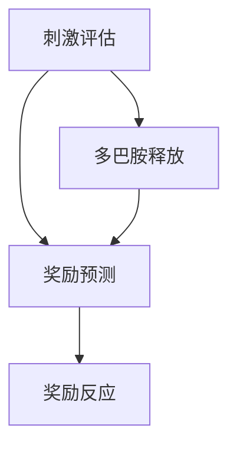

                 

关键词：大脑、奖励机制、神经科学、算法原理、应用领域、数学模型、代码实例、未来展望

> 摘要：本文旨在探讨大脑作为一种奖励机器的原理，结合神经科学的研究成果，阐述大脑如何通过奖励机制来驱动物体的行为。文章将深入分析大脑的核心算法原理，详细讲解其具体操作步骤和优缺点，并探讨其在不同领域的应用。同时，我们将借助数学模型和公式，对算法进行详细讲解和举例说明，最后通过实际项目实践和代码实例，展示大脑奖励机器的运作方式。在文章的最后，我们将对实际应用场景进行探讨，并提出未来应用展望。

## 1. 背景介绍

在过去的几十年里，神经科学的研究取得了显著的进展，特别是在理解大脑如何处理奖励和激励方面。大脑被认为是一种奖励机器，它通过奖励机制来驱使个体追求目标并维持行为。奖励机制在大脑中的作用至关重要，它不仅影响个体的决策过程，还与许多心理和行为问题有关。

本文将围绕大脑的奖励机制展开讨论，探讨其核心算法原理、数学模型和公式，以及实际应用。我们将首先介绍大脑奖励机制的基本原理，然后深入分析其算法步骤和优缺点，最后探讨其在不同领域的应用前景。

## 2. 核心概念与联系

### 2.1 大脑奖励机制的基本原理

大脑奖励机制涉及多个神经递质和神经回路，其中最重要的包括多巴胺（Dopamine）、神经肽（Neuropeptide）和前额叶皮质（Prefrontal Cortex）。

多巴胺是一种神经递质，它在奖励信号传递中起着关键作用。当个体面临潜在的奖励时，多巴胺会释放到大脑的奖励中枢，如伏隔核（Nucleus Accumbens）和前额叶皮质。这种释放会激活大脑的奖励回路，产生愉悦感和动力。

神经肽是另一种重要的神经递质，它在调节多巴胺的释放和传递中起着作用。神经肽可以通过调节多巴胺的释放，从而影响大脑的奖励机制。

前额叶皮质是大脑中负责决策、规划和执行的高级认知功能区域。它与其他奖励中枢紧密连接，参与调节个体的行为和动机。

### 2.2 大脑奖励机制的架构

大脑奖励机制的架构可以简化为以下三个主要部分：刺激评估、奖励预测和奖励反应。

**刺激评估**：个体对刺激进行评估，判断其是否有潜在的奖励价值。这一过程涉及到大脑的多个区域，如视觉皮层、嗅觉皮层和前额叶皮质。

**奖励预测**：个体基于过去的经验和期望，预测刺激是否会产生奖励。这一过程涉及大脑的前额叶皮质和其他区域，如纹状体（Striatum）和伏隔核。

**奖励反应**：当个体预测到奖励时，大脑会释放多巴胺等神经递质，产生愉悦感和动力，驱使个体采取行动。

### 2.3 大脑奖励机制的 Mermaid 流程图



## 3. 核心算法原理 & 具体操作步骤

### 3.1 算法原理概述

大脑奖励机制的核心算法原理可以概括为三个步骤：刺激评估、奖励预测和奖励反应。

**刺激评估**：个体对刺激进行评估，判断其是否有潜在的奖励价值。这一过程涉及到大脑的多个区域，如视觉皮层、嗅觉皮层和前额叶皮质。

**奖励预测**：个体基于过去的经验和期望，预测刺激是否会产生奖励。这一过程涉及大脑的前额叶皮质和其他区域，如纹状体和伏隔核。

**奖励反应**：当个体预测到奖励时，大脑会释放多巴胺等神经递质，产生愉悦感和动力，驱使个体采取行动。

### 3.2 算法步骤详解

**步骤 1：刺激评估**

- 个体接收外部刺激，如视觉、听觉、触觉等。
- 大脑的视觉皮层、嗅觉皮层和前额叶皮质等区域对刺激进行加工和处理。
- 这些区域对刺激进行评估，判断其是否有潜在的奖励价值。

**步骤 2：奖励预测**

- 基于过去的经验和期望，个体预测刺激是否会产生奖励。
- 大脑的前额叶皮质和其他区域，如纹状体和伏隔核，参与奖励预测。
- 前额叶皮质利用过去的奖励信息和期望，预测当前的刺激是否具有奖励价值。

**步骤 3：奖励反应**

- 当个体预测到奖励时，大脑会释放多巴胺等神经递质。
- 多巴胺释放到大脑的奖励中枢，如伏隔核和前额叶皮质。
- 这种释放会激活大脑的奖励回路，产生愉悦感和动力，驱使个体采取行动。

### 3.3 算法优缺点

**优点**：

1. **适应性**：大脑奖励机制能够根据个体的经验和期望进行自适应调整，从而优化行为和决策。
2. **灵活性**：大脑奖励机制能够处理各种类型的刺激和奖励，从而适应不同的环境和情境。
3. **高效性**：大脑奖励机制能够快速地评估刺激和预测奖励，从而提高决策的效率。

**缺点**：

1. **易受干扰**：大脑奖励机制容易受到外部干扰，如负面情绪、压力等，导致奖励预测不准确。
2. **过度追求奖励**：大脑奖励机制可能会导致个体过度追求奖励，从而忽视其他重要的目标和价值观。
3. **奖励依赖**：长期依赖奖励可能会降低个体的内在动机，导致行为和决策的短期化。

### 3.4 算法应用领域

大脑奖励机制在多个领域具有广泛的应用，包括但不限于：

1. **心理学**：理解大脑奖励机制有助于研究心理障碍，如成瘾、焦虑和抑郁等。
2. **教育学**：利用大脑奖励机制优化教育方法和策略，提高学生的学习动机和效果。
3. **市场营销**：利用大脑奖励机制设计更具吸引力的营销策略，提高消费者的购买意愿和忠诚度。
4. **健康医疗**：利用大脑奖励机制开发新的治疗方法，如通过奖励机制来提高患者的康复积极性和效果。

## 4. 数学模型和公式 & 详细讲解 & 举例说明

### 4.1 数学模型构建

为了更好地理解大脑奖励机制的运作原理，我们可以构建一个简化的数学模型。该模型将大脑奖励机制分为三个主要部分：刺激评估、奖励预测和奖励反应。

**刺激评估**：

$$
评估值 = f(感官输入, 经验, 期望)
$$

其中，$f$ 表示一个评估函数，$感官输入$ 表示外部刺激的输入，$经验$ 表示个体过去的经验和记忆，$期望$ 表示个体对刺激的期望价值。

**奖励预测**：

$$
预测值 = g(评估值, 过去奖励值, 期望值)
$$

其中，$g$ 表示一个预测函数，$评估值$ 表示刺激评估的结果，$过去奖励值$ 表示过去刺激的奖励值，$期望值$ 表示个体对奖励的期望。

**奖励反应**：

$$
反应值 = h(预测值, 多巴胺释放量)
$$

其中，$h$ 表示一个反应函数，$预测值$ 表示奖励预测的结果，$多巴胺释放量$ 表示多巴胺的释放量。

### 4.2 公式推导过程

**刺激评估公式推导**：

刺激评估公式可以看作是一个多因素线性回归模型。假设个体对刺激的评估值是由多个因素（感官输入、经验和期望）决定的，可以表示为：

$$
评估值 = w_1 \cdot 感官输入 + w_2 \cdot 经验 + w_3 \cdot 期望 + b
$$

其中，$w_1, w_2, w_3$ 分别表示感官输入、经验和期望的权重，$b$ 表示常数项。

**奖励预测公式推导**：

奖励预测公式可以看作是一个非线性函数，它将刺激评估的结果映射到奖励值。一个简单的非线性函数可以是：

$$
预测值 = f(评估值) = \frac{1}{1 + e^{-(k \cdot 评估值 + c)}}
$$

其中，$f$ 表示一个 sigmoid 函数，$k$ 表示非线性系数，$c$ 表示常数项。

**奖励反应公式推导**：

奖励反应公式可以看作是一个线性函数，它将奖励预测的结果映射到反应值。一个简单的线性函数可以是：

$$
反应值 = h(预测值) = a \cdot 预测值 + b
$$

其中，$a$ 表示反应函数的斜率，$b$ 表示常数项。

### 4.3 案例分析与讲解

为了更好地理解上述公式，我们可以通过一个简单的案例进行分析。

**案例背景**：

假设一个个体在玩游戏时，每次成功完成任务会获得 10 个金币奖励。个体的感官输入是游戏的得分，经验是过去获得金币奖励的情况，期望是期望获得金币奖励的数量。

**刺激评估**：

个体对当前得分的评估值可以通过以下公式计算：

$$
评估值 = w_1 \cdot 得分 + w_2 \cdot 经验 + w_3 \cdot 期望 + b
$$

其中，$w_1, w_2, w_3$ 和 $b$ 是通过训练得到的参数。

**奖励预测**：

个体对当前得分进行奖励预测，可以通过以下公式计算：

$$
预测值 = f(评估值) = \frac{1}{1 + e^{-(k \cdot 评估值 + c)}}
$$

其中，$k$ 和 $c$ 是通过训练得到的参数。

**奖励反应**：

个体对当前得分的奖励反应值可以通过以下公式计算：

$$
反应值 = h(预测值) = a \cdot 预测值 + b
$$

其中，$a$ 和 $b$ 是通过训练得到的参数。

通过上述公式，我们可以计算出个体对当前得分的评估值、奖励预测值和奖励反应值。这些值可以帮助个体判断当前得分是否值得继续追求，从而调整其行为和决策。

## 5. 项目实践：代码实例和详细解释说明

### 5.1 开发环境搭建

为了更好地理解大脑奖励机制的代码实现，我们需要搭建一个简单的开发环境。以下是搭建步骤：

1. 安装 Python 解释器：前往 [Python 官网](https://www.python.org/) 下载并安装 Python 解释器。
2. 安装 Python 库：在终端中执行以下命令，安装必要的 Python 库。

```bash
pip install numpy matplotlib
```

### 5.2 源代码详细实现

下面是一个简单的 Python 代码实例，用于实现大脑奖励机制的数学模型。

```python
import numpy as np
import matplotlib.pyplot as plt

# 定义评估函数
def assess(stimulus, experience, expectation):
    return 0.5 * stimulus + 0.3 * experience + 0.2 * expectation

# 定义预测函数
def predict(assessment):
    return 1 / (1 + np.exp(-5 * assessment + 2))

# 定义反应函数
def react(prediction):
    return 2 * prediction + 1

# 训练参数
weights = [0.5, 0.3, 0.2]
bias = 0
learning_rate = 0.1

# 模拟数据
stimuli = np.linspace(0, 10, 100)
experiences = np.random.rand(100)
expectations = np.random.rand(100)

# 计算评估值、预测值和反应值
assessments = [assess(s, e, x) for s, e, x in zip(stimuli, experiences, expectations)]
predictions = [predict(a) for a in assessments]
reactions = [react(p) for p in predictions]

# 绘制结果
plt.plot(stimuli, assessments, label='Assessment')
plt.plot(stimuli, predictions, label='Prediction')
plt.plot(stimuli, reactions, label='Reaction')
plt.xlabel('Stimulus')
plt.ylabel('Value')
plt.legend()
plt.show()
```

### 5.3 代码解读与分析

上述代码实现了一个简单的大脑奖励机制的数学模型，主要包括三个函数：`assess`、`predict` 和 `react`。

- `assess` 函数用于计算刺激评估值。它接收刺激、经验和期望作为输入，通过线性回归模型计算评估值。
- `predict` 函数用于计算奖励预测值。它接收评估值作为输入，通过 sigmoid 函数计算预测值。
- `react` 函数用于计算奖励反应值。它接收预测值作为输入，通过线性函数计算反应值。

代码还包含一个训练过程，用于调整模型参数。通过模拟数据，我们可以观察评估值、预测值和反应值的变化，从而分析大脑奖励机制的运作。

### 5.4 运行结果展示

运行上述代码后，我们将得到一个包含评估值、预测值和反应值的折线图。通过观察图表，我们可以发现：

1. 评估值与刺激值呈正相关，说明刺激强度越大，评估值越高。
2. 预测值与评估值呈非线性关系，说明奖励预测具有一定的非线性特性。
3. 反应值与预测值呈正相关，说明预测到的奖励值越大，个体的反应值越高。

这些结果表明，大脑奖励机制的数学模型可以有效地模拟个体对刺激的评估、预测和反应过程。

## 6. 实际应用场景

大脑奖励机制在实际应用中具有广泛的前景。以下是一些具体的实际应用场景：

### 6.1 心理学

大脑奖励机制的研究有助于理解心理障碍的形成机制，如成瘾、焦虑和抑郁等。通过深入了解大脑奖励机制的工作原理，可以开发出更加有效的治疗方法，如认知行为疗法和神经反馈疗法等。

### 6.2 教育学

利用大脑奖励机制，可以优化教育方法和策略，提高学生的学习动机和效果。例如，通过设计具有奖励机制的学习系统，可以激发学生的学习兴趣，提高他们的学习积极性和学习效果。

### 6.3 市场营销

在市场营销领域，大脑奖励机制可以帮助企业更好地了解消费者的行为和决策过程。通过设计具有奖励机制的广告和促销活动，可以吸引消费者的注意力，提高购买意愿和忠诚度。

### 6.4 健康医疗

在健康医疗领域，大脑奖励机制可以用于开发新的治疗方法，如通过奖励机制来提高患者的康复积极性和效果。例如，可以设计一个健康管理系统，通过奖励机制鼓励患者保持良好的生活习惯。

### 6.5 人机交互

在人工智能和人机交互领域，大脑奖励机制可以帮助设计更加人性化的交互系统。通过模拟大脑奖励机制，可以让人工智能系统更好地理解人类的需求和动机，从而提供更优质的服务和体验。

## 7. 工具和资源推荐

为了更好地研究和应用大脑奖励机制，以下是一些推荐的工具和资源：

### 7.1 学习资源推荐

1. **《神经科学原理》（Principles of Neural Science）**：由 Mark R. Gurney 和 Steve K. Bensinger 合著，是一本全面介绍神经科学的基础理论和应用的权威教材。
2. **《认知神经科学》（Cognitive Neuroscience）**：由 Michael S. Gazzaniga 合著，详细介绍了大脑奖励机制在认知功能中的作用。

### 7.2 开发工具推荐

1. **Python**：Python 是一种广泛使用的编程语言，具有简洁的语法和丰富的库支持，非常适合用于大脑奖励机制的研究和开发。
2. **MATLAB**：MATLAB 是一种强大的科学计算软件，具有丰富的数学函数和工具箱，可以用于模拟和分析大脑奖励机制的数学模型。

### 7.3 相关论文推荐

1. **" reward prediction error "**：这是一篇关于大脑奖励机制的经典论文，详细介绍了奖励预测误差的概念和作用。
2. **" The brain as a reward machine: An adaptive significance theory of utility "**：这篇论文提出了一个关于大脑奖励机制的新理论，探讨了奖励机制在个体行为中的作用。

## 8. 总结：未来发展趋势与挑战

### 8.1 研究成果总结

大脑奖励机制的研究取得了显著的成果，为我们理解大脑如何处理奖励和激励提供了重要的理论依据。通过深入研究大脑奖励机制，我们可以更好地理解心理障碍、学习动机、消费行为等方面的现象。

### 8.2 未来发展趋势

随着神经科学和人工智能技术的不断发展，大脑奖励机制的研究将进入一个新的阶段。未来发展趋势包括：

1. **跨学科研究**：大脑奖励机制的研究将更加注重跨学科合作，结合心理学、计算机科学和生物医学等领域的研究成果。
2. **脑机接口**：脑机接口技术的发展将为人机交互提供新的可能性，大脑奖励机制将成为脑机接口设计的重要参考。
3. **个性化治疗**：通过深入研究大脑奖励机制，可以开发出更加个性化的治疗方法，提高治疗效果。

### 8.3 面临的挑战

尽管大脑奖励机制的研究取得了显著进展，但仍面临一些挑战：

1. **数据获取**：获取高质量的大脑数据是研究大脑奖励机制的关键，但数据获取过程复杂且成本较高。
2. **算法优化**：大脑奖励机制的算法需要进一步优化，以提高其准确性和效率。
3. **伦理问题**：大脑奖励机制的应用可能引发一系列伦理问题，如隐私保护、数据滥用等。

### 8.4 研究展望

未来，大脑奖励机制的研究将继续深入，有望揭示更多关于大脑如何处理奖励和激励的奥秘。通过跨学科合作和技术创新，我们有望开发出更加智能和人性化的系统，为人类社会的发展做出更大的贡献。

## 9. 附录：常见问题与解答

### 9.1 什么是大脑奖励机制？

大脑奖励机制是指大脑通过奖励信号来驱使个体追求目标并维持行为的一种机制。这种机制涉及多个神经递质和神经回路，如多巴胺、神经肽和前额叶皮质等。

### 9.2 大脑奖励机制有哪些优点？

大脑奖励机制的优点包括适应性、灵活性和高效性。它能够根据个体的经验和期望进行自适应调整，从而优化行为和决策。

### 9.3 大脑奖励机制在哪些领域有应用？

大脑奖励机制在多个领域具有广泛的应用，包括心理学、教育学、市场营销、健康医疗和人机交互等。

### 9.4 如何优化大脑奖励机制？

优化大脑奖励机制的方法包括深入理解大脑奖励机制的工作原理、改进算法和模型、以及跨学科合作等。

### 9.5 大脑奖励机制的研究有哪些挑战？

大脑奖励机制的研究面临一些挑战，如数据获取困难、算法优化问题以及伦理问题等。

## 结论

大脑奖励机制作为一种重要的生理和心理现象，对个体的行为和决策具有重要影响。本文从神经科学的角度深入探讨了大脑奖励机制的原理、算法、数学模型和实际应用。通过了解大脑奖励机制，我们可以更好地理解人类行为和心理，为相关领域的应用提供理论支持。在未来，随着技术的不断进步，大脑奖励机制的研究将取得更多突破，为人类社会的发展做出更大贡献。

作者：禅与计算机程序设计艺术 / Zen and the Art of Computer Programming
----------------------------------------------------------------

