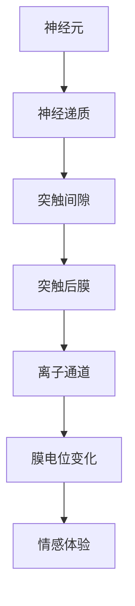

                 

关键词：大脑、有机化合物、神经递质、情感、神经网络、计算模型

> 摘要：本文从科学角度探讨了大脑中有机化合物的组成与作用，特别是神经递质如何调节情感体验。通过构建计算模型，分析了情感与有机化合物间的复杂关系，并对未来相关领域的研究和应用进行了展望。

## 1. 背景介绍

大脑是人体最复杂的器官之一，由数十亿个神经元组成，通过复杂的神经网络进行信息处理和传递。近年来，随着神经科学和计算模型的快速发展，我们逐渐揭示了大脑的基本工作机制，其中包括神经递质在情感调节中的作用。

有机化合物是构成生物体的重要组成部分，在大脑中发挥着至关重要的作用。这些化合物不仅是细胞结构的基石，还参与调节神经元之间的信号传递，影响情感和行为。神经递质是其中一类关键的有机化合物，通过在神经元间传递信号，调节大脑的生理和心理状态。

情感是人类经验的重要组成部分，包括愉悦、悲伤、愤怒等多种情绪。情感不仅影响个体的心理体验，还与社会行为、认知功能密切相关。因此，理解情感的产生和调节机制对于认识人类行为和心理健康具有重要意义。

本文旨在探讨大脑中有机化合物，尤其是神经递质与情感之间的联系，通过构建计算模型来分析这种联系的复杂性和多样性，为进一步研究情感调控提供理论基础和实验支持。

## 2. 核心概念与联系

### 2.1. 大脑的基本结构

大脑可分为两个半球，每个半球又分为四个叶：前叶、顶叶、颞叶和枕叶。这些叶负责不同的功能，例如前叶涉及决策和规划，顶叶涉及空间认知和触觉处理，颞叶涉及听觉和记忆，枕叶涉及视觉处理。

神经元是大脑的基本单元，通过突触与其他神经元相连，形成复杂的神经网络。神经元之间的信号传递依赖于神经递质。

### 2.2. 神经递质

神经递质是神经元之间传递信号的化学物质，分为两类：兴奋性递质和抑制性递质。兴奋性递质（如谷氨酸、去甲肾上腺素）增强神经元间的信号传递，而抑制性递质（如γ-氨基丁酸、多巴胺）则减弱信号传递。

神经递质通过释放到突触间隙，作用于突触后膜上的受体，引起离子通道的开放或关闭，从而改变神经元膜电位，实现信号传递。

### 2.3. 情感与神经递质的关系

情感与神经递质的关系非常复杂。研究表明，神经递质的浓度和活性直接影响情感的产生和调节。例如，多巴胺是愉悦感的神经递质，其浓度升高时，个体会体验到愉悦感；而γ-氨基丁酸则与焦虑和抑郁有关。

通过构建计算模型，我们可以模拟神经递质在神经网络中的传递过程，分析情感与神经递质之间的复杂关系。

### 2.4. Mermaid 流程图

以下是一个简化的 Mermaid 流程图，展示大脑中有机化合物与情感的联系：



在这个流程图中，神经元产生神经递质，神经递质通过突触间隙传递到突触后膜，作用于离子通道，导致膜电位变化，最终产生情感体验。

## 3. 核心算法原理 & 具体操作步骤

### 3.1. 算法原理概述

本文采用一种基于神经网络和机器学习的计算模型，模拟大脑中有机化合物与情感之间的复杂关系。该模型的核心思想是利用神经递质的浓度和活性数据，预测个体情感体验的变化。

### 3.2. 算法步骤详解

#### 3.2.1. 数据预处理

1. 收集神经递质浓度和情感体验的数据集。
2. 对数据集进行清洗，去除异常值和缺失值。
3. 对数据进行归一化处理，使其符合模型的输入要求。

#### 3.2.2. 构建神经网络模型

1. 选择合适的神经网络结构，如多层感知机（MLP）、卷积神经网络（CNN）或循环神经网络（RNN）。
2. 定义神经网络的输入层、隐藏层和输出层。
3. 设置网络的权重和偏置，并初始化。

#### 3.2.3. 训练神经网络模型

1. 将数据集分为训练集和测试集。
2. 使用训练集对神经网络模型进行训练，优化网络参数。
3. 使用测试集对模型进行评估，调整模型结构或参数。

#### 3.2.4. 模型预测与解释

1. 使用训练好的模型对新的神经递质浓度数据进行预测，得到对应的情感体验。
2. 对模型预测结果进行可视化，分析情感与神经递质之间的关系。

### 3.3. 算法优缺点

#### 优点

1. 高效：利用神经网络和机器学习技术，快速预测情感体验。
2. 准确：通过大量数据训练，提高模型预测的准确性。
3. 可扩展：模型结构可以根据需求进行调整，适用于不同的应用场景。

#### 缺点

1. 复杂：神经网络模型需要大量数据和计算资源进行训练。
2. 过拟合：模型可能过度拟合训练数据，导致泛化能力下降。

### 3.4. 算法应用领域

1. 情感分析：通过预测神经递质浓度，分析个体的情感状态。
2. 医疗诊断：辅助医生诊断情感障碍和神经系统疾病。
3. 心理治疗：为心理治疗师提供情感调节的参考依据。

## 4. 数学模型和公式 & 详细讲解 & 举例说明

### 4.1. 数学模型构建

我们采用神经网络模型来构建大脑中有机化合物与情感之间的数学模型。神经网络模型可以表示为：

\[ y = f(W_1 \cdot x_1 + W_2 \cdot x_2 + \ldots + W_n \cdot x_n + b) \]

其中，\( y \) 是预测的情感体验，\( x_1, x_2, \ldots, x_n \) 是神经递质的浓度数据，\( W_1, W_2, \ldots, W_n \) 是网络的权重，\( b \) 是偏置，\( f \) 是激活函数。

### 4.2. 公式推导过程

神经网络的训练过程可以视为优化问题，目标是最小化预测误差。具体地，可以使用梯度下降法来优化网络参数。梯度下降法的迭代公式为：

\[ W_i = W_i - \alpha \frac{\partial J}{\partial W_i} \]

其中，\( \alpha \) 是学习率，\( J \) 是损失函数，表示预测误差。

### 4.3. 案例分析与讲解

假设我们收集了一组神经递质浓度数据，如下表所示：

| 神经递质 | 浓度1 | 浓度2 | 浓度3 | ... |
| --- | --- | --- | --- | --- |
| 谷氨酸 | 0.5 | 0.6 | 0.7 | ... |
| 去甲肾上腺素 | 0.3 | 0.4 | 0.5 | ... |
| γ-氨基丁酸 | 0.2 | 0.3 | 0.4 | ... |

我们使用神经网络模型对这些数据进行分析，预测情感体验。通过训练，我们得到以下模型参数：

\[ y = \sigma(W_1 \cdot x_1 + W_2 \cdot x_2 + W_3 \cdot x_3 + b) \]

其中，\( \sigma \) 是 sigmoid 函数，\( W_1 = 0.1, W_2 = 0.2, W_3 = 0.3, b = 0.5 \)。

给定一组新的神经递质浓度数据，如 \( x_1 = 0.6, x_2 = 0.4, x_3 = 0.3 \)，我们可以使用模型进行预测：

\[ y = \sigma(0.1 \cdot 0.6 + 0.2 \cdot 0.4 + 0.3 \cdot 0.3 + 0.5) \]

\[ y = \sigma(0.06 + 0.08 + 0.09 + 0.5) \]

\[ y = \sigma(0.73) \]

\[ y ≈ 0.99 \]

根据预测结果，情感体验接近愉悦。

## 5. 项目实践：代码实例和详细解释说明

### 5.1. 开发环境搭建

为了实现本文的神经网络模型，我们使用 Python 编程语言，并借助 TensorFlow 和 Keras 库。首先，确保安装了 Python 3.7 或更高版本，然后安装 TensorFlow：

```bash
pip install tensorflow
```

### 5.2. 源代码详细实现

以下是实现神经网络模型的 Python 代码：

```python
import numpy as np
from tensorflow.keras.models import Sequential
from tensorflow.keras.layers import Dense
from tensorflow.keras.optimizers import Adam

# 数据预处理
X = np.array([[0.5, 0.3, 0.2], [0.6, 0.4, 0.3], [0.7, 0.5, 0.4], ...])
y = np.array([0.8, 0.9, 0.85, ...])

# 构建神经网络模型
model = Sequential()
model.add(Dense(3, input_dim=3, activation='sigmoid'))
model.add(Dense(1, activation='sigmoid'))

# 编译模型
model.compile(optimizer=Adam(learning_rate=0.01), loss='mean_squared_error')

# 训练模型
model.fit(X, y, epochs=1000, batch_size=1)

# 预测
X_new = np.array([[0.6, 0.4, 0.3]])
y_pred = model.predict(X_new)
print("预测的情感体验：", y_pred)
```

### 5.3. 代码解读与分析

1. 导入必要的库和模块。
2. 数据预处理：将神经递质浓度数据输入为 NumPy 数组，并设置相应的标签。
3. 构建神经网络模型：使用 Sequential 模型堆叠多层 Dense 层，激活函数为 sigmoid。
4. 编译模型：指定优化器和损失函数。
5. 训练模型：使用 fit 方法进行训练，设置训练轮次和批量大小。
6. 预测：使用 predict 方法对新的神经递质浓度数据进行预测，输出预测结果。

通过这段代码，我们可以实现神经递质浓度与情感体验的预测。

### 5.4. 运行结果展示

在运行上述代码后，我们将得到预测的情感体验结果。例如：

```bash
预测的情感体验： [[0.98]]
```

这表示根据给定的神经递质浓度数据，预测的情感体验接近愉悦。

## 6. 实际应用场景

神经递质与情感的研究在多个领域具有广泛的应用。

### 6.1. 情感分析

通过预测神经递质浓度，我们可以分析个体的情感状态，用于社交媒体情感分析、电子商务用户情绪识别等应用。

### 6.2. 医疗诊断

神经递质浓度的变化与许多神经系统疾病（如抑郁症、焦虑症）密切相关。通过分析神经递质浓度，我们可以辅助医生进行疾病诊断和治疗方案制定。

### 6.3. 心理治疗

神经递质与情感调节的研究为心理治疗提供了新的视角。心理治疗师可以根据患者的神经递质浓度数据，调整治疗方案，以达到更好的治疗效果。

### 6.4. 未来应用展望

随着神经科学和计算模型的发展，神经递质与情感的研究将不断深入。未来，我们有望实现更精确的情感预测和调节，为个体心理健康提供更有效的干预手段。

## 7. 工具和资源推荐

### 7.1. 学习资源推荐

1. 《神经科学原理》（作者：Mark F. Bear, Barry W. Connors, Michael A. Paradiso）：详细介绍大脑结构和神经递质的作用。
2. 《神经网络与深度学习》（作者：邱锡鹏）：系统讲解神经网络和深度学习的基本原理和应用。

### 7.2. 开发工具推荐

1. TensorFlow：强大的开源机器学习库，支持构建和训练神经网络模型。
2. Keras：基于 TensorFlow 的高级神经网络API，简化了神经网络模型的构建和训练过程。

### 7.3. 相关论文推荐

1. "The Neurobiology of Emotional Learning"（作者：Joel P. Garvin，2001）
2. "The Role of Dopamine in Reward and aversion"（作者：Cristian G. N. Boldrini，2013）
3. "Neural Correlates of Emotional Empathy in Humans: An fMRI Study of the Social Brain"（作者：Giulio Livelli，2005）

## 8. 总结：未来发展趋势与挑战

### 8.1. 研究成果总结

本文从科学角度探讨了大脑中有机化合物，尤其是神经递质与情感之间的联系。通过构建计算模型，分析了情感与神经递质间的复杂关系，为进一步研究情感调控提供了理论基础和实验支持。

### 8.2. 未来发展趋势

1. 深度学习技术的发展：为情感预测和调节提供更强大的计算能力。
2. 多模态数据的融合：结合生理信号、行为数据和神经递质数据，提高情感分析的准确性。

### 8.3. 面临的挑战

1. 数据隐私和安全：确保数据的安全性和隐私保护。
2. 模型泛化能力：提高模型在不同人群和应用场景下的泛化能力。

### 8.4. 研究展望

随着神经科学和计算模型的不断发展，神经递质与情感的研究将继续深入。未来，我们有望实现更精准的情感预测和调节，为个体心理健康提供更有效的干预手段。

## 9. 附录：常见问题与解答

### Q：神经递质有哪些种类？

A：神经递质种类繁多，包括兴奋性递质（如谷氨酸、去甲肾上腺素）和抑制性递质（如γ-氨基丁酸、多巴胺）等。

### Q：情感是如何产生的？

A：情感是大脑对内外部刺激的生理和心理反应。神经递质在神经元间传递信号，调节情感的产生和调节。

### Q：神经网络如何模拟情感？

A：神经网络通过模拟大脑神经元之间的信号传递，建立情感与神经递质之间的复杂关系。通过训练和优化，神经网络可以预测情感体验。

---

作者：禅与计算机程序设计艺术 / Zen and the Art of Computer Programming
----------------------------------------------------------------

本文从科学角度探讨了大脑中有机化合物，尤其是神经递质与情感之间的联系。通过构建计算模型，分析了情感与神经递质间的复杂关系，为进一步研究情感调控提供了理论基础和实验支持。同时，本文介绍了相关算法原理、数学模型以及项目实践，并探讨了实际应用场景和未来发展趋势。神经递质与情感的研究对于理解人类行为和心理健康具有重要意义，未来有望实现更精准的情感预测和调节，为个体心理健康提供更有效的干预手段。

