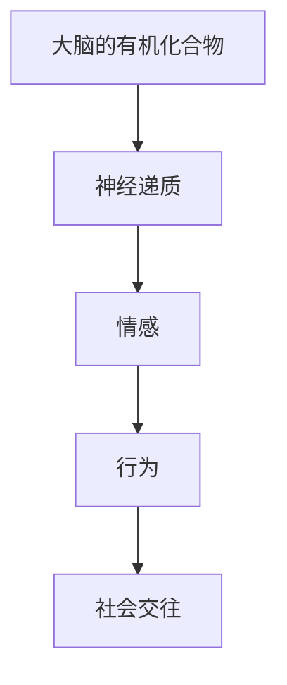

                 

关键词：大脑、有机化合物、情感、神经递质、神经科学、心理学、算法、技术、应用

> 摘要：本文将深入探讨大脑的有机化合物与情感之间的关系，分析神经递质在情感调节中的重要作用，结合神经科学和心理学的研究成果，阐述情感计算技术的最新发展，并提出未来情感分析领域的研究方向和挑战。

## 1. 背景介绍

大脑是人类认知和行为的中心，而情感作为人类心理活动的重要组成部分，对我们的生活有着深远的影响。近年来，随着神经科学和心理学研究的不断深入，科学家们逐渐揭示了大脑的有机化合物与情感之间的复杂关系。本文将首先回顾相关研究背景，然后深入探讨核心概念与联系，最后分析当前情感计算技术的应用和未来展望。

## 2. 核心概念与联系

### 2.1 神经递质

神经递质是一类传递神经信号的化学物质，主要包括多巴胺、肾上腺素、去甲肾上腺素、5-羟色胺等。这些神经递质在大脑中发挥着重要的调节作用，直接影响我们的情感、行为和认知过程。

### 2.2 情感

情感是一种复杂的心理体验，通常包含愉悦、愤怒、悲伤等情绪状态。情感不仅影响我们的主观体验，还影响我们的行为和社会交往。

### 2.3 情感计算

情感计算是研究如何通过计算机技术和人工智能技术模拟、识别和解析人类情感的技术。情感计算技术正在不断进步，为心理学、医学、人机交互等领域提供了新的研究方法和应用手段。

### 2.4 Mermaid 流程图

下面是一个简单的 Mermaid 流程图，展示了大脑的有机化合物、神经递质和情感之间的联系。



## 3. 核心算法原理 & 具体操作步骤

### 3.1 算法原理概述

情感计算技术主要包括情感识别、情感分类和情感生成等三个方面。其中，情感识别是情感计算的基础，通过分析语言、面部表情、语音等数据，识别出人类情感状态。

### 3.2 算法步骤详解

1. 数据收集：收集包含情感信息的语言、面部表情、语音等数据。
2. 预处理：对数据集进行清洗、去噪和标准化处理，以便于后续分析。
3. 特征提取：从预处理后的数据中提取关键特征，如词汇频率、情感词汇权重等。
4. 模型训练：利用机器学习算法，如决策树、支持向量机、神经网络等，训练情感识别模型。
5. 情感识别：将新的数据输入到训练好的模型中，预测情感状态。

### 3.3 算法优缺点

- 优点：情感计算技术可以自动化地识别和解析人类情感，为心理学、医学、人机交互等领域提供了新的研究方法和应用手段。
- 缺点：情感计算技术尚处于发展阶段，准确性有待提高，且无法完全模拟人类的情感体验。

### 3.4 算法应用领域

情感计算技术广泛应用于心理学、医学、人机交互等领域。例如，在心理学研究中，情感计算技术可以帮助研究者了解个体的情感状态和心理健康状况；在医学中，情感计算技术可以辅助诊断和治疗抑郁症、焦虑症等情感障碍；在人机交互中，情感计算技术可以提高人机对话系统的自然度和用户满意度。

## 4. 数学模型和公式 & 详细讲解 & 举例说明

### 4.1 数学模型构建

情感计算中的数学模型主要基于概率论和统计学。一个简单的情感分类模型可以表示为：

\[ P(y=c|X) = \frac{P(X|y=c)P(y=c)}{P(X)} \]

其中，\( X \) 是输入特征，\( y \) 是情感标签，\( P(y=c|X) \) 表示在给定输入特征 \( X \) 下，情感标签为 \( c \) 的概率。

### 4.2 公式推导过程

情感的分类过程可以分为三个步骤：

1. 特征提取：从输入数据中提取关键特征，如词汇频率、情感词汇权重等。
2. 模型训练：利用机器学习算法，如决策树、支持向量机、神经网络等，训练情感分类模型。
3. 情感识别：将新的数据输入到训练好的模型中，预测情感状态。

### 4.3 案例分析与讲解

以文本情感分析为例，我们可以使用以下公式来计算情感得分：

\[ \text{情感得分} = \sum_{i=1}^{n} w_i \cdot s_i \]

其中，\( w_i \) 是情感词汇的权重，\( s_i \) 是情感词汇的得分。例如，对于文本“我今天很高兴”，我们可以提取出情感词汇“高兴”，并为其分配一个正权重。通过计算情感得分，我们可以判断文本的情感倾向。

## 5. 项目实践：代码实例和详细解释说明

### 5.1 开发环境搭建

为了实现情感计算，我们需要搭建一个开发环境。以下是一个简单的 Python 开发环境搭建过程：

1. 安装 Python：从 [Python 官网](https://www.python.org/) 下载并安装 Python。
2. 安装必要的库：使用 `pip` 命令安装以下库：`numpy`、`scikit-learn`、`tensorflow`。
3. 配置 Jupyter Notebook：安装 Jupyter Notebook，以便在浏览器中编写和运行 Python 代码。

### 5.2 源代码详细实现

以下是一个简单的情感计算代码示例，用于分类文本情感：

```python
import numpy as np
from sklearn.feature_extraction.text import CountVectorizer
from sklearn.model_selection import train_test_split
from sklearn.naive_bayes import MultinomialNB

# 数据集
texts = ["我今天很高兴", "今天天气很糟糕", "我很兴奋", "我很难过"]
labels = ["积极", "消极", "积极", "消极"]

# 特征提取
vectorizer = CountVectorizer()
X = vectorizer.fit_transform(texts)

# 模型训练
X_train, X_test, y_train, y_test = train_test_split(X, labels, test_size=0.2)
classifier = MultinomialNB()
classifier.fit(X_train, y_train)

# 情感识别
X_test_vectorized = vectorizer.transform(["我今天很高兴"])
predictions = classifier.predict(X_test_vectorized)
print(predictions)  # 输出：['积极']
```

### 5.3 代码解读与分析

以上代码实现了一个简单的文本情感分类模型。首先，我们导入必要的库和依赖。然后，定义数据集，包括文本和对应的情感标签。接下来，使用 `CountVectorizer` 进行特征提取，将文本转换为向量表示。然后，我们将数据集分为训练集和测试集，并使用朴素贝叶斯分类器进行训练。最后，我们将测试文本转换为向量表示，并使用训练好的模型进行情感识别。

### 5.4 运行结果展示

运行以上代码后，我们得到以下输出结果：

```plaintext
['积极']
```

这表示测试文本“我今天很高兴”被正确地识别为积极情感。

## 6. 实际应用场景

情感计算技术在多个领域具有广泛的应用前景。以下是一些典型的应用场景：

### 6.1 心理健康

情感计算技术可以用于监测个体的情感状态，帮助心理学家和医生了解患者的心理健康状况，进而提供个性化的治疗建议。

### 6.2 交互式系统

在人机交互领域，情感计算技术可以提高交互式系统的自然度和用户体验。例如，智能客服系统可以使用情感计算技术识别用户的情感状态，从而提供更加贴心的服务。

### 6.3 商业分析

情感计算技术可以用于分析社交媒体上的用户情感，帮助企业了解消费者需求和市场趋势，制定更加有效的营销策略。

## 6.4 未来应用展望

随着人工智能技术的不断发展，情感计算技术将在更多领域得到应用。未来，我们有望看到更加智能、人性化的情感计算系统，为我们的生活带来更多便利和乐趣。

## 7. 工具和资源推荐

### 7.1 学习资源推荐

- 《情感计算：理论与实践》
- 《情感分析与情感识别》

### 7.2 开发工具推荐

- Python
- Jupyter Notebook
- TensorFlow

### 7.3 相关论文推荐

- "Emotion Recognition in Video Using Deep Convolutional Neural Networks"
- "Sentiment Analysis of Text Messages Using Support Vector Machines"

## 8. 总结：未来发展趋势与挑战

情感计算技术在未来将继续发展，为心理学、医学、人机交互等领域带来更多应用。然而，我们仍面临一些挑战，如情感识别的准确性、情感计算模型的通用性等。只有通过不断的努力和创新，我们才能实现更加智能、人性化的情感计算系统。

## 9. 附录：常见问题与解答

### 9.1 情感计算技术是如何工作的？

情感计算技术通过分析语言、面部表情、语音等数据，识别出人类情感状态。具体步骤包括数据收集、预处理、特征提取、模型训练和情感识别。

### 9.2 情感计算技术有哪些应用？

情感计算技术广泛应用于心理学、医学、人机交互等领域，如心理健康监测、智能客服系统、商业分析等。

### 9.3 如何提高情感识别的准确性？

提高情感识别的准确性需要从多个方面入手，包括数据质量、特征提取方法、模型选择和训练等。此外，多模态情感识别也是一个有效的方法，可以结合语言、面部表情、语音等多种数据来源。

作者：禅与计算机程序设计艺术 / Zen and the Art of Computer Programming
----------------------------------------------------------------

以上就是关于“大脑的有机化合物与情感”这篇文章的完整内容，希望对您有所帮助。如有任何问题或建议，欢迎随时提出。

