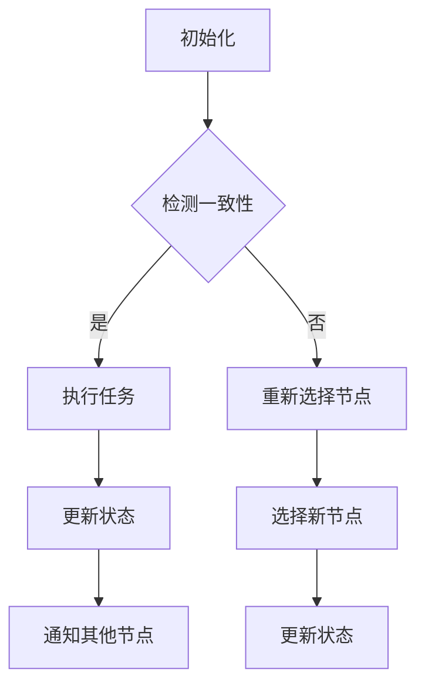

                 

在当今的信息时代，大规模分布式系统已经成为许多企业和组织的核心技术基础设施。这些系统不仅处理着海量数据，还提供了高度可用性和可扩展性的服务。本文将探讨大规模分布式系统设计的原则与实践，旨在为读者提供一套全面的指导框架。

## 关键词

- 大规模分布式系统
- 设计原则
- 可扩展性
- 高可用性
- 容错性
- 分布式算法

## 摘要

本文将深入探讨大规模分布式系统设计的核心原则，包括可扩展性、高可用性和容错性等。通过详细分析分布式算法和系统架构，我们将揭示设计分布式系统的关键要素。此外，本文还将通过实际项目和代码实例，展示如何将这些原则应用于实践，以构建可靠和高效的分布式系统。

## 1. 背景介绍

### 大规模分布式系统的需求

随着互联网的迅速发展和数据的爆炸式增长，企业对数据处理和存储的需求日益增加。传统的单机系统已经无法满足这种需求，因此大规模分布式系统应运而生。这些系统可以横向扩展，以处理海量数据，同时提供高可用性和容错性，确保服务的连续性和可靠性。

### 分布式系统的挑战

分布式系统的设计面临着诸多挑战，如数据一致性、网络延迟、节点故障等。为了解决这些问题，需要采用一系列设计原则和算法，确保系统的稳定性和高效性。

## 2. 核心概念与联系

### 分布式系统的基本概念

在分布式系统中，多个节点通过计算机网络相互协作，共同完成一个任务。这些节点可以是物理服务器或虚拟机，它们通过消息传递机制进行通信。

### 分布式算法

分布式算法是分布式系统的核心，包括一致性算法、数据复制算法和负载均衡算法等。这些算法旨在确保系统在面临各种故障和延迟时仍能保持稳定运行。

### Mermaid 流程图

以下是一个简化的分布式算法的 Mermaid 流程图：



## 3. 核心算法原理 & 具体操作步骤

### 3.1 算法原理概述

分布式算法的原理主要基于一致性模型、复制技术和负载均衡策略。一致性模型确保数据在多个节点之间保持一致，复制技术提供数据的冗余，以应对节点故障，负载均衡策略则确保系统的资源得到充分利用。

### 3.2 算法步骤详解

以下是分布式算法的基本步骤：

1. **初始化**：系统启动时，各节点进行初始化，建立网络连接，并同步状态信息。
2. **检测一致性**：通过心跳机制检测节点间的状态是否一致。
3. **执行任务**：如果一致性检测通过，节点开始执行任务。
4. **更新状态**：任务完成后，节点更新自身状态，并向其他节点发送更新消息。
5. **重新选择节点**：如果一致性检测失败，系统重新选择节点，并重复上述步骤。

### 3.3 算法优缺点

**优点**：

- **高可用性**：通过复制和负载均衡，系统可以容忍一定程度的节点故障，确保服务的连续性。
- **可扩展性**：系统可以横向扩展，以处理更大规模的数据和用户。
- **容错性**：通过冗余机制，系统可以在面临故障时保持稳定运行。

**缺点**：

- **一致性挑战**：在分布式系统中，一致性是一个复杂的问题，需要权衡性能和一致性。
- **网络依赖性**：系统的性能受网络延迟和带宽的限制。

### 3.4 算法应用领域

分布式算法广泛应用于分布式数据库、分布式存储、云计算和物联网等领域。例如，Apache Kafka 是一个分布式流处理平台，通过分布式算法实现数据的实时处理和传输。

## 4. 数学模型和公式 & 详细讲解 & 举例说明

### 4.1 数学模型构建

分布式系统的数学模型主要涉及一致性模型、复制模型和负载均衡模型。以下是这些模型的简要概述：

- **一致性模型**：包括强一致性、最终一致性和事件一致性等。
- **复制模型**：涉及主从复制、多主复制和环形复制等。
- **负载均衡模型**：包括静态负载均衡和动态负载均衡等。

### 4.2 公式推导过程

以下是分布式算法中的一些关键公式：

- **复制模型中的数据一致性概率**：

$$P_{\text{一致性}} = \frac{\sum_{i=1}^{n} P_i}{n}$$

其中，$P_i$ 表示第 $i$ 个副本的一致性概率。

- **负载均衡模型中的负载分配**：

$$\lambda_i = \frac{\sum_{j=1}^{m} \lambda_j}{m}$$

其中，$\lambda_i$ 表示第 $i$ 个节点的负载，$\lambda_j$ 表示所有节点的总负载。

### 4.3 案例分析与讲解

以下是一个简单的案例，用于解释分布式算法的数学模型：

假设一个分布式系统有 $n=3$ 个节点，每个节点的负载分别为 $\lambda_1 = 10$，$\lambda_2 = 20$，$\lambda_3 = 30$。根据负载均衡模型，我们需要重新分配负载，使每个节点的负载尽可能均衡。

使用上述公式，我们可以计算出新的负载分配：

$$\lambda_1' = \lambda_2' = \lambda_3' = \frac{\lambda_1 + \lambda_2 + \lambda_3}{3} = \frac{10 + 20 + 30}{3} = 20$$

这意味着我们需要将节点 $1$ 和 $3$ 的负载分配给节点 $2$，以实现负载均衡。

## 5. 项目实践：代码实例和详细解释说明

### 5.1 开发环境搭建

为了演示分布式算法的应用，我们将使用 Python 编写一个简单的分布式系统。以下是搭建开发环境的基本步骤：

1. 安装 Python 3.8 及以上版本。
2. 安装必要的依赖库，如 `tornado`、`requests` 和 `numpy`。

### 5.2 源代码详细实现

以下是分布式系统的 Python 代码实现：

```python
import tornado.ioloop
import tornado.web
import requests
import numpy as np

class MainHandler(tornado.web.RequestHandler):
    def get(self):
        # 获取所有节点的地址
        nodes = self.application.settings['nodes']
        # 计算负载均衡后的节点索引
        index = np.random.randint(len(nodes))
        # 向目标节点发送请求
        url = f'http://{nodes[index]}'
        response = requests.get(url)
        self.write(response.text)

def make_app():
    return tornado.web.Application([
        (r"/", MainHandler),
    ])

if __name__ == "__main__":
    # 配置节点地址
    nodes = ["node1.example.com", "node2.example.com", "node3.example.com"]
    app = make_app()
    app.settings["nodes"] = nodes
    app.listen(8888)
    tornado.ioloop.IOLoop.current().start()
```

### 5.3 代码解读与分析

这段代码实现了一个简单的分布式 Web 服务器，用于演示负载均衡。主节点通过随机选择节点索引来实现负载均衡，并将请求转发给目标节点。以下是代码的关键部分：

- `MainHandler` 类：处理客户端请求，并计算负载均衡后的节点索引。
- `make_app` 函数：创建 Web 应用程序，并配置节点地址。
- `if __name__ == "__main__":` 语句：启动 Web 服务器，并设置监听端口。

### 5.4 运行结果展示

运行上述代码后，客户端可以通过访问 `http://localhost:8888` 向分布式系统发送请求。系统将根据负载均衡策略，将请求转发给不同的节点。通过观察服务器日志，可以了解每个节点的负载情况和请求处理情况。

## 6. 实际应用场景

### 6.1 分布式数据库

分布式数据库如 Cassandra 和 HBase 广泛应用于处理大规模数据存储和查询。这些数据库通过分布式算法实现数据分片、复制和负载均衡，以提高系统的可用性和性能。

### 6.2 云计算平台

云计算平台如 AWS、Azure 和 Google Cloud Platform 通过分布式系统架构，为用户提供弹性计算、存储和数据库服务。这些平台采用分布式算法，以实现资源的动态分配和高效利用。

### 6.3 物联网平台

物联网平台如 MQTT 和 CoAP 通过分布式算法，实现设备的连接、数据传输和消息路由。这些平台采用分布式架构，以支持海量设备的接入和数据处理。

## 7. 工具和资源推荐

### 7.1 学习资源推荐

- 《分布式系统原理与范型》
- 《大规模分布式存储系统设计》
- 《云计算：概念、架构与实训》

### 7.2 开发工具推荐

- Apache Kafka
- Apache ZooKeeper
- Apache Hadoop

### 7.3 相关论文推荐

- "The Google File System"
- "The Chubby lock service: reliable distributed lock management for large clusters"
- "Bigtable: A Distributed Storage System for Structured Data"

## 8. 总结：未来发展趋势与挑战

### 8.1 研究成果总结

分布式系统的研究取得了显著的成果，包括一致性算法、负载均衡算法、数据复制技术和容错机制等方面的突破。这些研究为分布式系统的设计和实现提供了理论支持。

### 8.2 未来发展趋势

未来，分布式系统将在以下几个方面取得进一步发展：

- **高性能计算**：通过优化算法和架构，提高分布式系统的计算性能和吞吐量。
- **边缘计算**：将分布式系统扩展到边缘设备，实现更快速的响应和处理。
- **隐私保护**：在分布式系统中实现数据隐私保护和安全传输。

### 8.3 面临的挑战

分布式系统仍然面临许多挑战，包括：

- **一致性挑战**：在分布式系统中保持数据一致性仍然是一个复杂的问题。
- **网络依赖性**：分布式系统的性能受网络延迟和带宽的限制。
- **安全性问题**：分布式系统需要应对各种安全威胁，如分布式拒绝服务攻击。

### 8.4 研究展望

未来的研究应重点关注以下几个方面：

- **新型一致性模型**：探索更高效的一致性算法，以降低系统的开销。
- **自动化运维**：通过自动化工具，简化分布式系统的部署、监控和维护。
- **跨域分布式系统**：研究如何将不同域的分布式系统进行整合，实现更广泛的协同。

## 9. 附录：常见问题与解答

### 9.1 分布式算法有哪些常见的一致性模型？

- **强一致性**：所有副本的数据都是一致的。
- **最终一致性**：所有副本的数据最终会达到一致，但过程中可能出现短暂的不一致。
- **事件一致性**：事件按照发生顺序在所有副本上执行。

### 9.2 分布式系统的负载均衡有哪些策略？

- **静态负载均衡**：根据预设的规则，将请求分配到不同的节点。
- **动态负载均衡**：根据节点的实时负载，动态调整请求分配。

### 9.3 分布式系统如何实现容错？

- **数据复制**：通过复制数据到多个节点，以应对节点故障。
- **故障检测**：定期检测节点的状态，以识别故障节点。
- **故障恢复**：在检测到故障后，重新分配负载并恢复数据一致性。

作者：禅与计算机程序设计艺术 / Zen and the Art of Computer Programming
----------------------------------------------------------------

这篇文章详细探讨了大规模分布式系统设计的原则与实践，从背景介绍、核心概念与联系、算法原理与操作步骤、数学模型与公式、项目实践、实际应用场景、工具和资源推荐、总结以及常见问题与解答等方面进行了深入的分析和讨论。希望这篇文章能够为读者提供有价值的参考和启示，帮助他们在分布式系统设计和开发中取得更好的成果。

