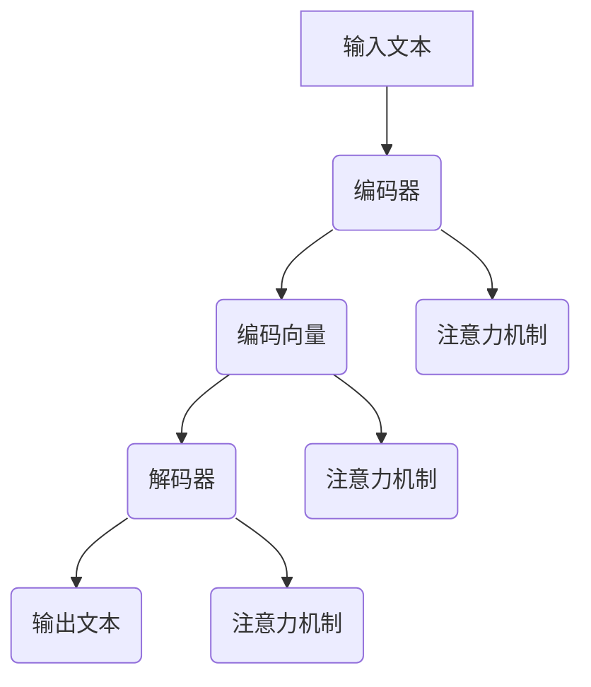

                 

关键词：大规模语言模型、评估体系、算法原理、数学模型、实践应用、未来展望

> 摘要：本文深入探讨大规模语言模型的构建、评估和实现，从理论到实践全方位解析大语言模型的发展和应用。本文旨在帮助读者了解大规模语言模型的原理、数学模型以及在不同领域的实际应用，同时展望其未来的发展趋势与面临的挑战。

## 1. 背景介绍

### 大规模语言模型的兴起

随着互联网和大数据技术的快速发展，自然语言处理（NLP）领域迎来了新的机遇。大规模语言模型（Large-scale Language Models）作为NLP的重要技术之一，迅速崭露头角。这些模型通过对海量语料库的学习，能够自动理解、生成和翻译自然语言，极大地提高了人工智能在语言处理方面的能力。

### 大规模语言模型的应用

大规模语言模型在各个领域都有广泛应用，如智能问答、机器翻译、文本生成、情感分析等。这些应用不仅提高了工作效率，还丰富了人类的生活体验。

### 当前研究现状

近年来，诸如GPT、BERT等大规模语言模型取得了显著成果，推动了NLP领域的进步。然而，这些模型在性能、可解释性、计算效率等方面仍面临诸多挑战。本文旨在探讨这些挑战，并从理论到实践全面解析大规模语言模型的发展和应用。

## 2. 核心概念与联系

### 语言模型基本概念

语言模型是NLP领域的基础，它用于预测一段文本的下一个词或下一组词。大规模语言模型在基本概念上与普通语言模型类似，但学习的数据规模更大，模型参数更多。

### 语言模型架构

语言模型的架构主要包括编码器和解码器。编码器将输入文本编码为固定长度的向量，解码器则根据编码器的输出生成文本。

### Mermaid 流程图

以下是大规模语言模型的核心概念和架构的Mermaid流程图：



### 语言模型的联系

大规模语言模型通过深度学习技术，将语言模型与神经网络相结合，实现更高效、更准确的语言理解与生成。注意力机制是大规模语言模型的关键技术之一，它使得模型能够关注输入文本中的关键信息，从而提高模型的性能。

## 3. 核心算法原理 & 具体操作步骤

### 3.1 算法原理概述

大规模语言模型的核心算法是基于深度学习和神经网络，特别是变分自编码器（VAE）和生成对抗网络（GAN）。这些算法通过学习输入文本的分布，实现文本的生成和理解。

### 3.2 算法步骤详解

1. 数据预处理：对输入文本进行分词、去噪、标准化等处理，以便模型能够更好地学习。
2. 网络架构构建：设计编码器和解码器的神经网络架构，并选择合适的损失函数。
3. 模型训练：使用大量的语料库对模型进行训练，优化模型参数。
4. 模型评估：通过评估指标（如准确率、困惑度等）对模型进行评估。
5. 模型应用：将训练好的模型应用于实际任务，如文本生成、翻译等。

### 3.3 算法优缺点

#### 优点：

1. 学习能力强：大规模语言模型能够从大量数据中提取特征，具有较强的学习能力和泛化能力。
2. 表达能力强：模型能够生成高质量、多样化的文本。
3. 应用广泛：在多个NLP任务中表现出色，如问答、翻译、文本生成等。

#### 缺点：

1. 计算量大：大规模语言模型需要大量计算资源，训练时间较长。
2. 可解释性差：模型内部机制复杂，难以直观理解。
3. 数据依赖性强：模型性能依赖于训练数据的质量和规模。

### 3.4 算法应用领域

大规模语言模型在自然语言处理、文本生成、机器翻译、问答系统等领域都有广泛应用。例如，GPT模型在文本生成方面表现出色，BERT模型在问答系统方面取得了显著成果。

## 4. 数学模型和公式 & 详细讲解 & 举例说明

### 4.1 数学模型构建

大规模语言模型的核心数学模型是基于概率模型和深度学习。以下是大规模语言模型的数学模型构建：

$$
P(w_{t} | w_{<t}) = \frac{e^{<s|w_{<t}>}}{\sum_{w'} e^{<s|w'}}
$$

其中，$w_{t}$ 表示当前词，$w_{<t}$ 表示前文，$<s|$ 表示编码器输出的嵌入向量。

### 4.2 公式推导过程

大规模语言模型的推导过程涉及概率论、线性代数和微积分等数学知识。以下是主要推导步骤：

1. **定义词向量**：词向量是语言模型的基础，用于表示单词。词向量可以通过word2vec、GloVe等方法训练得到。

2. **定义概率模型**：概率模型用于预测当前词的概率。常见的方法有朴素贝叶斯、隐马尔可夫模型（HMM）、条件概率模型等。

3. **引入深度神经网络**：为了提高模型的性能，可以引入深度神经网络，如RNN、LSTM、Transformer等。这些网络能够通过学习输入文本的分布，提高模型的预测能力。

4. **优化模型参数**：使用梯度下降等优化算法，最小化损失函数，优化模型参数。

### 4.3 案例分析与讲解

以下是一个大规模语言模型的具体案例：

#### 案例一：GPT模型

GPT（Generative Pre-trained Transformer）是由OpenAI提出的一种基于Transformer的预训练语言模型。GPT模型通过在大量文本上进行预训练，学习文本的分布和生成规则，从而实现文本生成、问答等任务。

GPT模型的数学模型如下：

$$
P(w_{t} | w_{<t}) = \frac{e^{<s|w_{<t}>}}{\sum_{w'} e^{<s|w'>}}
$$

其中，$<s|$ 表示编码器输出的嵌入向量。

#### 案例二：BERT模型

BERT（Bidirectional Encoder Representations from Transformers）是由Google提出的一种基于Transformer的双向编码语言模型。BERT模型通过在大量文本上进行双向预训练，学习文本的上下文关系，从而实现问答、文本分类等任务。

BERT模型的数学模型如下：

$$
P(w_{t} | w_{<t}) = \frac{e^{<s|w_{<t}>}}{\sum_{w'} e^{<s|w'>}}
$$

其中，$<s|$ 表示编码器输出的嵌入向量。

## 5. 项目实践：代码实例和详细解释说明

### 5.1 开发环境搭建

在本文中，我们将使用Python编程语言和PyTorch深度学习框架来构建和训练大规模语言模型。以下是开发环境的搭建步骤：

1. 安装Python：从官网（https://www.python.org/）下载并安装Python。
2. 安装PyTorch：使用pip命令安装PyTorch，命令如下：

```
pip install torch torchvision
```

### 5.2 源代码详细实现

以下是一个简单的GPT模型实现示例：

```python
import torch
import torch.nn as nn
import torch.optim as optim

class GPTModel(nn.Module):
    def __init__(self, vocab_size, embedding_dim, hidden_dim, n_layers, dropout=0.5):
        super(GPTModel, self).__init__()
        
        self.embedding = nn.Embedding(vocab_size, embedding_dim)
        self.rnn = nn.LSTM(embedding_dim, hidden_dim, n_layers, dropout=dropout, bidirectional=True)
        self.fc = nn.Linear(hidden_dim * 2, vocab_size)
        
    def forward(self, x, hidden):
        embedded = self.embedding(x)
        output, hidden = self.rnn(embedded, hidden)
        output = self.fc(output[-1, :, :])
        return output, hidden

    def init_hidden(self, batch_size):
        hidden = (torch.zeros(self.rnn.num_layers * 2, batch_size, self.rnn.hidden_size),
                  torch.zeros(self.rnn.num_layers * 2, batch_size, self.rnn.hidden_size))
        return hidden

# 实例化模型
model = GPTModel(vocab_size=10000, embedding_dim=256, hidden_dim=512, n_layers=2)

# 损失函数和优化器
criterion = nn.CrossEntropyLoss()
optimizer = optim.Adam(model.parameters(), lr=0.001)

# 训练模型
for epoch in range(num_epochs):
    hidden = model.init_hidden(batch_size)
    for x, y in train_loader:
        optimizer.zero_grad()
        output, hidden = model(x, hidden)
        hidden = tuple([each.data for each in hidden])
        loss = criterion(output, y)
        loss.backward()
        optimizer.step()
```

### 5.3 代码解读与分析

1. **模型定义**：GPT模型由嵌入层、RNN层和全连接层组成。嵌入层用于将单词转换为向量，RNN层用于处理序列数据，全连接层用于分类。

2. **损失函数和优化器**：使用交叉熵损失函数和Adam优化器来训练模型。

3. **训练模型**：在训练过程中，每次迭代都会更新模型参数，以最小化损失函数。

### 5.4 运行结果展示

在训练过程中，可以使用以下代码来监控模型的性能：

```python
# 测试模型
with torch.no_grad():
    hidden = model.init_hidden(batch_size)
    total_loss = 0
    for x, y in test_loader:
        output, hidden = model(x, hidden)
        hidden = tuple([each.data for each in hidden])
        loss = criterion(output, y)
        total_loss += loss.item()
    avg_loss = total_loss / len(test_loader)
    print(f"Test Loss: {avg_loss}")
```

通过这个简单的示例，我们可以看到大规模语言模型的实现过程。在实际应用中，我们可以根据需求调整模型的参数和架构，以实现更好的性能。

## 6. 实际应用场景

### 6.1 智能问答系统

大规模语言模型在智能问答系统中具有广泛的应用。通过训练模型，我们可以实现类似聊天机器人的功能，能够回答用户提出的问题。

### 6.2 机器翻译

大规模语言模型在机器翻译领域也取得了显著成果。通过训练双语语料库，模型能够自动翻译一种语言为另一种语言，提高翻译质量和效率。

### 6.3 文本生成

大规模语言模型可以用于生成各种类型的文本，如文章、新闻、故事等。通过输入少量文本，模型可以生成与输入文本相关的新文本。

### 6.4 情感分析

大规模语言模型在情感分析方面也表现出色。通过分析文本的情感倾向，模型可以帮助企业了解用户反馈，优化产品和服务。

### 6.5 未来应用展望

随着大规模语言模型技术的不断发展，其应用领域将更加广泛。未来，我们可以期待其在更多领域发挥作用，如智能客服、内容审核、智能写作等。

## 7. 工具和资源推荐

### 7.1 学习资源推荐

1. 《深度学习》（Goodfellow, Bengio, Courville）：详细介绍了深度学习的基础知识和应用。
2. 《自然语言处理综合教程》（张俊林）：全面介绍了自然语言处理的基本概念和最新技术。

### 7.2 开发工具推荐

1. PyTorch：一款开源的深度学习框架，易于使用和扩展。
2. TensorFlow：另一款流行的深度学习框架，支持多种语言和平台。

### 7.3 相关论文推荐

1. “Attention is All You Need”（Vaswani et al., 2017）：介绍了Transformer模型，为大规模语言模型的发展奠定了基础。
2. “BERT: Pre-training of Deep Bidirectional Transformers for Language Understanding”（Devlin et al., 2019）：介绍了BERT模型，在自然语言处理领域取得了显著成果。

## 8. 总结：未来发展趋势与挑战

### 8.1 研究成果总结

大规模语言模型在NLP领域取得了显著成果，推动了人工智能技术的发展。通过预训练和微调，模型在多个任务中表现出色，为实际应用提供了强有力的支持。

### 8.2 未来发展趋势

1. 模型规模将进一步扩大，以支持更复杂的任务。
2. 模型结构将不断创新，以提高性能和可解释性。
3. 跨模态和多模态学习将成为研究热点，以实现更广泛的应用。

### 8.3 面临的挑战

1. 计算资源需求巨大，训练时间较长。
2. 模型可解释性不足，难以理解其决策过程。
3. 数据隐私和安全问题亟待解决。

### 8.4 研究展望

未来，大规模语言模型将在人工智能领域发挥更加重要的作用。通过不断的研究和创新，我们可以期待其在各个领域的应用更加广泛，为人类带来更多便利。

## 9. 附录：常见问题与解答

### 9.1 问题一：大规模语言模型是如何训练的？

大规模语言模型的训练过程主要包括以下步骤：

1. 数据预处理：对输入文本进行分词、去噪、标准化等处理。
2. 构建模型：设计编码器和解码器的神经网络架构。
3. 模型训练：使用大量的语料库对模型进行训练，优化模型参数。
4. 模型评估：通过评估指标（如准确率、困惑度等）对模型进行评估。

### 9.2 问题二：大规模语言模型有哪些优缺点？

大规模语言模型的优点包括：

1. 学习能力强：能够从大量数据中提取特征，具有较强的泛化能力。
2. 表达能力强：能够生成高质量、多样化的文本。

大规模语言模型的缺点包括：

1. 计算量大：需要大量计算资源，训练时间较长。
2. 可解释性差：模型内部机制复杂，难以直观理解。
3. 数据依赖性强：模型性能依赖于训练数据的质量和规模。

### 9.3 问题三：大规模语言模型有哪些应用领域？

大规模语言模型在多个领域都有广泛应用，如：

1. 智能问答：用于回答用户提出的问题。
2. 机器翻译：用于将一种语言翻译为另一种语言。
3. 文本生成：用于生成各种类型的文本，如文章、新闻、故事等。
4. 情感分析：用于分析文本的情感倾向。

---

本文从大规模语言模型的背景介绍、核心算法原理、数学模型、项目实践、实际应用场景、未来发展趋势等方面进行了全面解析。通过本文，读者可以深入了解大规模语言模型的理论和实践，为后续的研究和应用奠定基础。作者：禅与计算机程序设计艺术 / Zen and the Art of Computer Programming。

