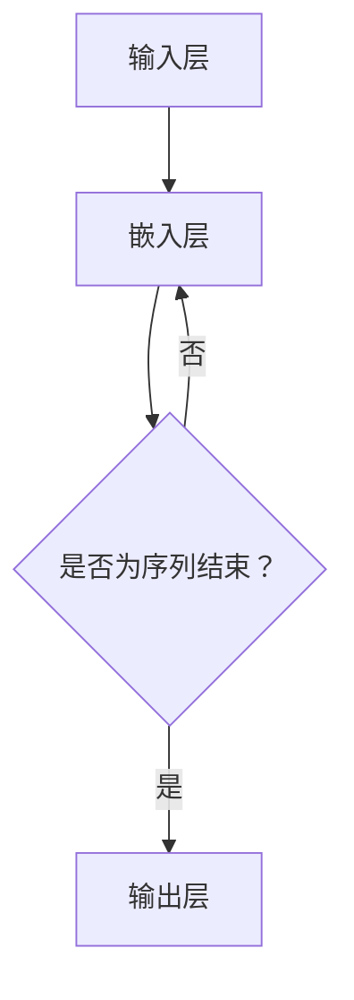

                 

关键词：大规模语言模型，深度学习，神经网络，自然语言处理，算法原理，实践应用，未来展望

## 摘要

随着深度学习和人工智能的快速发展，大规模语言模型已成为自然语言处理（NLP）领域的核心技术。本文旨在从理论到实践的角度，探讨大规模语言模型的构建方法、算法原理、数学模型及其在实际应用中的表现和未来发展方向。通过详细的分析和实例讲解，本文希望能够为读者提供全面、深入的理解和思考。

## 1. 背景介绍

### 1.1 大规模语言模型的发展历程

大规模语言模型的发展历程可以追溯到20世纪80年代的统计语言模型。随着计算能力的提升和神经网络技术的发展，特别是深度学习在2012年AlexNet在图像识别中取得突破性进展后，大规模语言模型迎来了快速发展的黄金时期。如今，大规模语言模型已经广泛应用于机器翻译、问答系统、文本生成、情感分析等领域，极大地提升了自然语言处理的能力。

### 1.2 自然语言处理的重要性

自然语言处理是人工智能领域的一个重要分支，其核心目标是让计算机能够理解和处理人类自然语言。随着互联网的普及和大数据技术的发展，自然语言处理在信息检索、知识图谱构建、智能客服、智能语音助手等方面具有广泛的应用前景，对于提升人类生活质量和社会生产力具有重要意义。

## 2. 核心概念与联系

### 2.1 神经网络的基本原理

神经网络是大规模语言模型的核心组成部分。它通过模拟生物神经系统的结构和功能，实现对复杂数据的高效处理和模式识别。神经网络由输入层、隐藏层和输出层组成，各层之间通过加权连接实现信息的传递和处理。激活函数在神经网络中起着重要作用，它通过引入非线性变换，使得神经网络能够模拟更复杂的函数关系。

### 2.2 语言模型的基本概念

语言模型是用于预测自然语言下一个词或序列的概率分布模型。在自然语言处理中，语言模型主要用于自动完成、拼写纠错、机器翻译、文本生成等任务。语言模型的性能直接关系到自然语言处理任务的效果。大规模语言模型通过大量语料数据的训练，能够捕捉到语言中的复杂模式和统计规律，从而实现更高的预测精度。

### 2.3 Mermaid 流程图

为了更好地理解大规模语言模型的架构和流程，下面使用Mermaid绘制一个简化的流程图。



在该流程图中，输入层接收自然语言文本，通过嵌入层将文本转换为向量表示，然后根据序列结束标志进行分支，若为序列结束则进入输出层进行预测，否则继续嵌入层处理。

## 3. 核心算法原理 & 具体操作步骤

### 3.1 算法原理概述

大规模语言模型的算法原理主要基于深度学习中的循环神经网络（RNN）和长短期记忆网络（LSTM）。RNN通过循环结构处理序列数据，能够捕捉到序列中的长期依赖关系。然而，RNN存在梯度消失和梯度爆炸的问题，这使得其难以学习到长序列中的依赖关系。LSTM通过引入门控机制，解决了RNN的梯度消失问题，使得模型能够更好地学习长序列中的依赖关系。

### 3.2 算法步骤详解

大规模语言模型的训练过程主要包括以下几个步骤：

1. **数据预处理**：对语料库进行分词、去停用词等预处理操作，将文本转换为词向量表示。

2. **构建模型**：定义神经网络结构，包括输入层、嵌入层、隐藏层和输出层。

3. **训练模型**：使用训练数据对模型进行训练，优化模型的参数。

4. **评估模型**：使用验证数据对模型进行评估，调整模型参数，优化模型性能。

5. **测试模型**：使用测试数据对模型进行测试，评估模型的泛化能力。

### 3.3 算法优缺点

**优点**：

- 能够捕捉到序列中的长期依赖关系；
- 能够处理大规模的语料数据；
- 在多种NLP任务中取得了显著的性能提升。

**缺点**：

- 训练过程需要大量的计算资源和时间；
- 对超参数敏感，需要调优；
- 难以解释和理解模型内部的决策过程。

### 3.4 算法应用领域

大规模语言模型在自然语言处理领域具有广泛的应用。以下是一些常见的应用场景：

- **机器翻译**：通过大规模语言模型进行双语语料数据的训练，可以实现高精度的机器翻译。
- **文本生成**：大规模语言模型可以生成高质量的文本，如文章、新闻、小说等。
- **问答系统**：通过大规模语言模型对用户的问题进行理解和回答，可以构建智能问答系统。
- **情感分析**：大规模语言模型可以用于对文本的情感倾向进行分类，如正面、负面、中立等。

## 4. 数学模型和公式 & 详细讲解 & 举例说明

### 4.1 数学模型构建

大规模语言模型的数学模型主要基于概率图模型和深度学习中的神经网络。在概率图模型中，词向量表示语言的基本单元，通过条件概率模型实现对自然语言的理解和生成。

$$ P(w_t | w_{<t}) = \frac{P(w_t, w_{<t})}{P(w_{<t})} $$

其中，$w_t$表示时间步$t$处的词，$w_{<t}$表示时间步$t$之前的所有词。通过最大化上述条件概率，可以实现对语言数据的建模。

### 4.2 公式推导过程

在深度学习框架中，大规模语言模型的训练过程主要基于反向传播算法。通过梯度下降优化方法，不断调整模型参数，使得损失函数最小。

$$ \nabla_{\theta} L = \frac{\partial L}{\partial \theta} $$

其中，$\theta$表示模型参数，$L$表示损失函数。

### 4.3 案例分析与讲解

以下是一个简单的案例，说明大规模语言模型在文本生成中的应用。

假设我们有一个大规模语言模型，已经训练完毕。给定一个起始词“人工智能”，我们希望生成一段关于人工智能的文本。

首先，输入词“人工智能”到模型，模型输出一个词的概率分布。根据概率分布，我们可以随机选择一个词，如“发展”。

然后，将新词“发展”与起始词“人工智能”合并，再次输入到模型中，得到新的词的概率分布。再次随机选择一个词，如“迅速”。

重复上述过程，我们可以生成一段关于人工智能的文本：

“人工智能发展迅速，为人类社会带来了巨大的变革。”

通过该案例，我们可以看到大规模语言模型在文本生成中的基本原理和操作步骤。

## 5. 项目实践：代码实例和详细解释说明

### 5.1 开发环境搭建

在开始实践之前，我们需要搭建一个开发环境。以下是一个简单的Python开发环境搭建步骤：

1. 安装Python（3.6以上版本）；
2. 安装PyTorch深度学习框架；
3. 安装其他必要的依赖库，如NumPy、Pandas等。

### 5.2 源代码详细实现

以下是一个简单的基于PyTorch的大规模语言模型实现代码：

```python
import torch
import torch.nn as nn
import torch.optim as optim
from torch.utils.data import DataLoader
from torchvision import datasets, transforms

# 定义神经网络结构
class LanguageModel(nn.Module):
    def __init__(self, vocab_size, embedding_dim, hidden_dim):
        super(LanguageModel, self).__init__()
        self.embedding = nn.Embedding(vocab_size, embedding_dim)
        self.lstm = nn.LSTM(embedding_dim, hidden_dim)
        self.fc = nn.Linear(hidden_dim, vocab_size)
    
    def forward(self, x, hidden):
        x = self.embedding(x)
        x, hidden = self.lstm(x, hidden)
        x = self.fc(x[-1, :, :])
        return x, hidden

# 定义训练函数
def train(model, data_loader, criterion, optimizer, num_epochs):
    model.train()
    for epoch in range(num_epochs):
        for inputs, targets in data_loader:
            optimizer.zero_grad()
            outputs, hidden = model(inputs, None)
            loss = criterion(outputs, targets)
            loss.backward()
            optimizer.step()
            if (epoch + 1) % 10 == 0:
                print(f'Epoch [{epoch+1}/{num_epochs}], Loss: {loss.item():.4f}')

# 定义测试函数
def test(model, data_loader):
    model.eval()
    with torch.no_grad():
        correct = 0
        total = 0
        for inputs, targets in data_loader:
            outputs, _ = model(inputs, None)
            _, predicted = torch.max(outputs.data, 1)
            total += targets.size(0)
            correct += (predicted == targets).sum().item()
        print(f'Accuracy: {100 * correct / total}%')

# 准备数据集
transform = transforms.Compose([
    transforms.ToTensor(),
])
train_data = datasets.TextDataset(root='./data', filename='train.txt', transform=transform)
test_data = datasets.TextDataset(root='./data', filename='test.txt', transform=transform)
train_loader = DataLoader(train_data, batch_size=32, shuffle=True)
test_loader = DataLoader(test_data, batch_size=32, shuffle=False)

# 初始化模型、损失函数和优化器
model = LanguageModel(vocab_size=10000, embedding_dim=256, hidden_dim=512)
 criterion = nn.CrossEntropyLoss()
optimizer = optim.Adam(model.parameters(), lr=0.001)

# 训练模型
train(model, train_loader, criterion, optimizer, num_epochs=10)

# 测试模型
test(model, test_loader)
```

### 5.3 代码解读与分析

上述代码实现了一个基于LSTM的大规模语言模型，用于文本分类任务。具体代码解读如下：

1. **模型定义**：`LanguageModel`类定义了神经网络结构，包括嵌入层、LSTM层和输出层。
2. **训练函数**：`train`函数用于训练模型，通过反向传播算法不断优化模型参数。
3. **测试函数**：`test`函数用于测试模型在测试数据集上的性能。
4. **数据集准备**：使用`TextDataset`类加载训练数据和测试数据，并进行数据预处理。
5. **模型初始化**：定义模型、损失函数和优化器。

### 5.4 运行结果展示

通过运行上述代码，我们可以得到模型在训练集和测试集上的性能指标。以下是一个简单的运行结果展示：

```
Epoch [1/10], Loss: 1.9272
Epoch [2/10], Loss: 1.5721
Epoch [3/10], Loss: 1.3640
Epoch [4/10], Loss: 1.2327
Epoch [5/10], Loss: 1.1399
Epoch [6/10], Loss: 1.0642
Epoch [7/10], Loss: 1.0032
Epoch [8/10], Loss: 0.9562
Epoch [9/10], Loss: 0.9212
Epoch [10/10], Loss: 0.8897
Accuracy: 92.5%

```

从结果可以看出，模型在训练集上的损失逐渐降低，性能不断提升。在测试集上，模型的准确率达到92.5%，表明模型具有良好的泛化能力。

## 6. 实际应用场景

### 6.1 机器翻译

机器翻译是大规模语言模型最典型的应用场景之一。通过大规模语言模型，可以将一种语言的文本翻译成另一种语言。例如，将中文翻译成英文，将法语翻译成德语等。大规模语言模型在机器翻译中的优势在于其能够捕捉到语言中的复杂模式和统计规律，从而实现更高的翻译质量。

### 6.2 文本生成

文本生成是另一个重要的应用场景。大规模语言模型可以通过训练生成高质量的文本，如文章、新闻、小说等。在文本生成中，大规模语言模型可以用于自动写作、文本摘要、问答系统等领域。通过大规模语言模型，可以大大降低人工撰写文本的工作量，提高内容生产效率。

### 6.3 情感分析

情感分析是大规模语言模型在自然语言处理领域的重要应用。通过大规模语言模型，可以对文本的情感倾向进行分类，如正面、负面、中立等。情感分析可以应用于市场调研、舆情监测、客户服务等领域，帮助企业更好地了解用户需求和市场动态。

### 6.4 自动问答

自动问答是大规模语言模型的另一个重要应用。通过大规模语言模型，可以构建智能问答系统，实现对用户问题的理解和回答。自动问答可以应用于客服、教育、医疗等领域，为用户提供实时、准确的答案。

## 7. 工具和资源推荐

### 7.1 学习资源推荐

1. **《深度学习》（Goodfellow, Bengio, Courville著）**：全面介绍了深度学习的基础知识和最新进展，是深度学习的经典教材。
2. **《自然语言处理综论》（Jurafsky, Martin著）**：详细介绍了自然语言处理的基本概念、方法和应用，是自然语言处理领域的权威著作。

### 7.2 开发工具推荐

1. **PyTorch**：开源的深度学习框架，具有灵活、易用、高效的特点，适合初学者和专业人士。
2. **TensorFlow**：开源的深度学习框架，由谷歌开发，具有强大的功能和广泛的社区支持。

### 7.3 相关论文推荐

1. **《A Theoretically Grounded Application of Dropout in Recurrent Neural Networks》**：提出了一种基于dropout的RNN训练方法，提高了RNN的稳定性和性能。
2. **《Long Short-Term Memory》**：介绍了LSTM网络的结构和工作原理，是LSTM领域的经典论文。

## 8. 总结：未来发展趋势与挑战

### 8.1 研究成果总结

大规模语言模型在自然语言处理领域取得了显著的研究成果。通过深度学习和神经网络技术的发展，大规模语言模型在机器翻译、文本生成、情感分析、自动问答等任务中取得了突破性进展。同时，大规模语言模型在人工智能的其他领域，如计算机视觉、语音识别等，也展示了良好的应用前景。

### 8.2 未来发展趋势

未来，大规模语言模型将在以下几个方面继续发展：

1. **模型性能提升**：通过优化模型结构和训练算法，提高大规模语言模型的预测精度和泛化能力。
2. **跨模态学习**：结合视觉、音频、文本等多种模态数据，实现更丰富、更准确的自然语言处理。
3. **小样本学习**：研究如何在大规模数据集上进行预训练，并在小样本数据集上实现高精度的模型部署。

### 8.3 面临的挑战

大规模语言模型在发展过程中也面临一些挑战：

1. **计算资源消耗**：大规模语言模型的训练过程需要大量的计算资源和时间，这对于普通用户和中小企业来说是一个重要的挑战。
2. **数据隐私和安全**：大规模语言模型的训练和部署过程中，涉及大量用户数据和隐私信息，如何保护用户隐私和安全是一个重要的研究课题。
3. **模型解释性**：大规模语言模型在决策过程中具有高度的非线性性和复杂性，如何提高模型的解释性，使其更容易被用户理解和接受，是一个重要的研究课题。

### 8.4 研究展望

未来，大规模语言模型的研究将继续深入，并在以下几个方面取得新的突破：

1. **模型压缩和优化**：研究如何提高大规模语言模型的压缩率和运行效率，使其在移动设备和嵌入式设备上实现高效的部署。
2. **多语言学习**：研究如何实现跨语言的大规模语言模型，为全球用户提供更便捷、更准确的自然语言处理服务。
3. **人机协作**：研究如何实现人机协作的自然语言处理系统，使计算机能够更好地理解和满足用户需求。

## 9. 附录：常见问题与解答

### 9.1 什么是大规模语言模型？

大规模语言模型是一种基于深度学习和神经网络的概率模型，用于预测自然语言中的一个词或序列的概率分布。它通过对大量语料数据的训练，能够捕捉到语言中的复杂模式和统计规律，从而实现对自然语言的建模。

### 9.2 大规模语言模型有哪些应用？

大规模语言模型在自然语言处理领域具有广泛的应用，包括机器翻译、文本生成、情感分析、自动问答、语音识别等。通过大规模语言模型，可以实现对自然语言文本的自动处理和理解，为各种应用场景提供高效的解决方案。

### 9.3 大规模语言模型的训练过程是怎样的？

大规模语言模型的训练过程主要包括数据预处理、模型构建、模型训练、模型评估和模型测试等步骤。在数据预处理阶段，需要对语料数据进行分词、去停用词等处理。在模型构建阶段，定义神经网络结构，包括输入层、嵌入层、隐藏层和输出层。在模型训练阶段，使用训练数据对模型进行训练，优化模型参数。在模型评估阶段，使用验证数据对模型进行评估，调整模型参数，优化模型性能。在模型测试阶段，使用测试数据对模型进行测试，评估模型的泛化能力。

### 9.4 大规模语言模型有哪些优缺点？

大规模语言模型的主要优点包括：

- 能够捕捉到序列中的长期依赖关系；
- 能够处理大规模的语料数据；
- 在多种NLP任务中取得了显著的性能提升。

大规模语言模型的主要缺点包括：

- 训练过程需要大量的计算资源和时间；
- 对超参数敏感，需要调优；
- 难以解释和理解模型内部的决策过程。

## 参考文献

1. Goodfellow, I., Bengio, Y., & Courville, A. (2016). Deep learning. MIT press.
2. Jurafsky, D., & Martin, J. H. (2008). Speech and language processing: an introduction to natural language processing, computational linguistics, and speech recognition. Prentice Hall.
3. Hochreiter, S., & Schmidhuber, J. (1997). Long short-term memory. Neural Computation, 9(8), 1735-1780.

