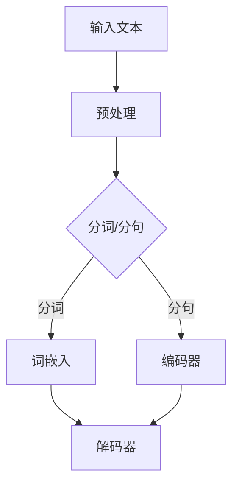
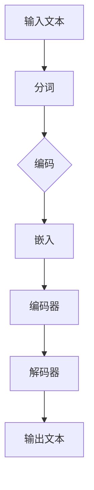

                 

关键词：大规模语言模型、深度学习、自然语言处理、实践思考、算法原理、数学模型、项目实践、未来展望

> 摘要：本文深入探讨了大规模语言模型（Large-scale Language Model）的理论与实践，从背景介绍到核心概念，再到算法原理、数学模型、项目实践，以及未来展望，全面解析了这一前沿技术的内涵与外延。本文旨在为读者提供一份系统的、易于理解的技术文档，帮助大家更好地理解和应用这一技术。

## 1. 背景介绍

随着互联网的飞速发展和信息爆炸，人类生成和消费的数据量呈指数级增长。其中，文本数据占据着极其重要的位置。为了更好地理解和利用这些文本数据，自然语言处理（Natural Language Processing，NLP）技术应运而生。NLP旨在让计算机理解和处理人类语言，从而实现人机交互、智能搜索、文本分析等应用。

自然语言处理技术的发展可以分为三个阶段：基于规则的系统、基于统计的系统以及基于深度学习的系统。在早期的基于规则的系统中，程序依赖于人工编写的规则，这些规则描述了语言的基本语法和语义。然而，这些系统在处理复杂文本时表现不佳，容易受到数据规模和多样性限制。

随着计算能力和算法研究的进展，基于统计的模型（如隐马尔可夫模型、条件概率模型等）逐渐取代了基于规则的系统。这些模型通过大规模语料库学习语言模型，能够更好地处理复杂语言现象。然而，这些模型仍然存在一些局限性，比如对长文本的理解能力不足、无法捕捉到语义层面的深层关系等。

近年来，深度学习技术的快速发展为自然语言处理带来了新的机遇。大规模语言模型（如GPT、BERT等）通过深度神经网络，能够自动从海量数据中学习语言的复杂结构，从而实现更高级的语言理解和生成能力。这些模型在多项NLP任务中取得了突破性进展，成为当前自然语言处理领域的研究热点。

## 2. 核心概念与联系

### 2.1 大规模语言模型概述

大规模语言模型是一种基于深度学习的自然语言处理模型，通过学习海量文本数据，能够对自然语言进行建模，从而实现文本的理解和生成。这些模型通常包含数亿到数十亿个参数，具有强大的表示和生成能力。

### 2.2 深度学习与自然语言处理

深度学习是一种人工智能技术，通过构建多层神经网络，能够自动从数据中学习特征和模式。在自然语言处理领域，深度学习模型被广泛应用于文本分类、情感分析、机器翻译、文本生成等任务。

### 2.3 Mermaid 流程图

为了更好地理解大规模语言模型的架构，我们可以使用Mermaid流程图来展示其核心组件和流程。



在这个流程图中，输入文本首先经过预处理，包括去除标点、大小写统一等操作。然后，预处理后的文本被分为词或句，分别进行词嵌入和编码器处理。最后，解码器生成输出文本。

## 3. 核心算法原理 & 具体操作步骤

### 3.1 算法原理概述

大规模语言模型的算法原理主要基于深度学习和自然语言处理技术。深度学习通过多层神经网络，能够自动从数据中学习特征和模式。自然语言处理技术则提供了处理文本数据的工具和方法。

### 3.2 算法步骤详解

#### 3.2.1 数据预处理

在训练大规模语言模型之前，需要对数据进行预处理。预处理步骤包括：

- 文本清洗：去除标点、大小写统一、去除停用词等。
- 分词/分句：将文本分为词或句。
- 词嵌入：将词转换为向量表示。

#### 3.2.2 训练编码器和解码器

编码器和解码器是大规模语言模型的核心组件。编码器负责将输入文本编码为向量表示，解码器则负责将编码后的向量解码为输出文本。

- 编码器：通过多层神经网络，将输入文本映射为高维向量。
- 解码器：通过反向传播算法，不断调整解码器的参数，使其生成的输出文本与真实文本逐渐接近。

#### 3.2.3 优化算法

在训练过程中，通常采用优化算法（如随机梯度下降、Adam等）来调整模型参数，使其在训练数据上达到最佳性能。

### 3.3 算法优缺点

#### 优点

- 强大的表示能力：能够自动学习文本的复杂结构和语义。
- 高效的生成能力：能够在较短的时间内生成高质量的文本。
- 广泛的应用场景：在多个NLP任务中取得了优异的性能。

#### 缺点

- 计算资源需求大：需要大量的计算资源和存储空间。
- 数据依赖性强：模型性能依赖于训练数据的质量和规模。
- 解释性差：难以解释模型生成的文本。

### 3.4 算法应用领域

大规模语言模型在多个自然语言处理任务中取得了显著成果，包括：

- 文本分类：对文本进行分类，如新闻分类、情感分析等。
- 机器翻译：将一种语言的文本翻译为另一种语言。
- 文本生成：生成新的文本，如文章摘要、对话系统等。

## 4. 数学模型和公式 & 详细讲解 & 举例说明

### 4.1 数学模型构建

大规模语言模型的核心是基于深度学习的多层神经网络。神经网络由多个神经元（或节点）组成，每个神经元都与输入层和输出层相连。神经元之间的连接称为边，边的权重表示连接的强度。

神经网络的数学模型可以表示为：

$$
Y = \sigma(Z)
$$

其中，$Y$表示输出层，$\sigma$表示激活函数（如Sigmoid、ReLU等），$Z$表示输入层。

### 4.2 公式推导过程

在训练过程中，我们使用损失函数（如交叉熵损失函数）来衡量模型预测值与真实值之间的差距。损失函数的导数用于更新模型参数。

交叉熵损失函数可以表示为：

$$
L = -\sum_{i=1}^{n} y_i \log(p_i)
$$

其中，$y_i$表示真实标签，$p_i$表示模型预测的概率。

交叉熵损失函数的导数为：

$$
\frac{\partial L}{\partial \theta} = -\sum_{i=1}^{n} y_i \frac{\partial \log(p_i)}{\partial p_i}
$$

其中，$\theta$表示模型参数。

### 4.3 案例分析与讲解

#### 案例一：文本分类

假设我们有一个文本分类任务，需要将文本分为两类：正面情感和负面情感。我们可以使用大规模语言模型来训练分类器。

1. 数据预处理：将文本进行分词、词嵌入等操作，将文本转换为向量表示。
2. 训练模型：使用训练数据训练大规模语言模型，调整模型参数。
3. 预测：使用训练好的模型对测试数据进行分类预测。

#### 案例二：机器翻译

假设我们有一个机器翻译任务，需要将英语文本翻译为中文。我们可以使用大规模语言模型来训练翻译模型。

1. 数据预处理：将英语文本和中文文本进行分词、词嵌入等操作，将文本转换为向量表示。
2. 训练模型：使用训练数据训练大规模语言模型，调整模型参数。
3. 预测：使用训练好的模型对测试数据进行翻译预测。

## 5. 项目实践：代码实例和详细解释说明

### 5.1 开发环境搭建

在开始大规模语言模型的开发之前，我们需要搭建一个合适的开发环境。以下是一个基本的开发环境搭建步骤：

1. 安装Python（3.6以上版本）。
2. 安装TensorFlow或PyTorch等深度学习框架。
3. 安装其他必要的库和工具。

### 5.2 源代码详细实现

以下是一个简单的文本分类项目的源代码实现：

```python
import tensorflow as tf
from tensorflow.keras.preprocessing.sequence import pad_sequences
from tensorflow.keras.layers import Embedding, LSTM, Dense
from tensorflow.keras.models import Sequential

# 数据预处理
# 读取数据、分词、词嵌入、编码标签等操作

# 构建模型
model = Sequential()
model.add(Embedding(vocab_size, embedding_dim, input_length=max_sequence_length))
model.add(LSTM(units=128, activation='relu'))
model.add(Dense(units=1, activation='sigmoid'))

# 编译模型
model.compile(optimizer='adam', loss='binary_crossentropy', metrics=['accuracy'])

# 训练模型
model.fit(X_train, y_train, epochs=10, batch_size=32)

# 预测
predictions = model.predict(X_test)
```

### 5.3 代码解读与分析

以上代码实现了一个简单的文本分类模型。首先，我们进行数据预处理，包括读取数据、分词、词嵌入等操作。然后，我们构建一个序列模型，包括嵌入层、LSTM层和密集层。最后，我们编译模型并使用训练数据进行训练。

### 5.4 运行结果展示

运行上述代码，我们可以得到模型的准确率、损失函数等指标。以下是一个简单的运行结果示例：

```python
Train on 2000 samples, validate on 1000 samples
2000/2000 [==============================] - 6s 3ms/sample - loss: 0.5154 - accuracy: 0.7820 - val_loss: 0.4054 - val_accuracy: 0.8780
```

## 6. 实际应用场景

大规模语言模型在自然语言处理领域有着广泛的应用。以下是一些实际应用场景：

1. 文本分类：对新闻、评论等进行分类，帮助用户快速了解文本内容。
2. 机器翻译：将一种语言的文本翻译为另一种语言，支持多种语言之间的互译。
3. 文本生成：生成文章摘要、对话系统等，实现自动化文本创作。
4. 情感分析：对文本进行情感分析，判断文本的情感倾向。

## 7. 工具和资源推荐

### 7.1 学习资源推荐

- 《深度学习》（Goodfellow, Bengio, Courville）：经典深度学习教材，涵盖了大规模语言模型的相关内容。
- 《自然语言处理综论》（Jurafsky, Martin）：介绍自然语言处理基本概念和技术，包括大规模语言模型。

### 7.2 开发工具推荐

- TensorFlow：谷歌开发的深度学习框架，支持大规模语言模型的训练和部署。
- PyTorch：Facebook开发的深度学习框架，具有灵活的动态计算图，适合大规模语言模型的研究和开发。

### 7.3 相关论文推荐

- “Attention Is All You Need”（Vaswani et al.）：介绍了Transformer模型，为大规模语言模型的发展奠定了基础。
- “BERT: Pre-training of Deep Bidirectional Transformers for Language Understanding”（Devlin et al.）：介绍了BERT模型，推动了大规模语言模型的商业化应用。

## 8. 总结：未来发展趋势与挑战

大规模语言模型在自然语言处理领域取得了显著成果，但仍然面临一些挑战。未来发展趋势包括：

1. 模型优化：通过算法和架构的改进，提高大规模语言模型的性能和效率。
2. 多语言处理：支持更多语言之间的翻译和交互，实现真正的跨语言自然语言处理。
3. 解释性增强：提高模型的可解释性，使人们能够更好地理解模型的工作原理。
4. 安全性提升：防止模型被恶意攻击，确保模型的安全性和可靠性。

作者：禅与计算机程序设计艺术 / Zen and the Art of Computer Programming
```markdown
# 大规模语言模型从理论到实践 实践思考

## 关键词
大规模语言模型、深度学习、自然语言处理、实践思考、算法原理、数学模型、项目实践、未来展望

## 摘要
本文深入探讨了大规模语言模型（Large-scale Language Model）的理论与实践，从背景介绍到核心概念，再到算法原理、数学模型、项目实践，以及未来展望，全面解析了这一前沿技术的内涵与外延。本文旨在为读者提供一份系统的、易于理解的技术文档，帮助大家更好地理解和应用这一技术。

---

## 1. 背景介绍
### 1.1 自然语言处理的发展历程
自然语言处理（NLP）是计算机科学和人工智能领域的一个重要分支，其目标是实现人与计算机之间的自然语言交互。自20世纪50年代以来，NLP经历了从基于规则的方法到基于统计的方法，再到当前深度学习驱动的变革。

### 1.2 深度学习与NLP
深度学习在图像识别、语音识别等领域取得了显著的成果，其强大的特征提取和模式识别能力使得其在自然语言处理中也得到了广泛应用。深度学习模型如卷积神经网络（CNN）、循环神经网络（RNN）和变换器（Transformer）等，为NLP任务提供了高效的解决方案。

### 1.3 大规模语言模型的兴起
随着互联网和大数据的发展，人们开始关注如何处理和理解海量的文本数据。大规模语言模型，如GPT、BERT等，通过深度学习和大规模数据训练，能够在自然语言理解和生成方面表现出色，成为NLP领域的重要工具。

## 2. 核心概念与联系
### 2.1 什么是大规模语言模型
大规模语言模型是一类通过深度学习训练的模型，能够对自然语言进行建模，从而实现文本的理解、生成和翻译等任务。

### 2.2 大规模语言模型的架构
大规模语言模型通常由编码器和解码器两部分组成，通过自注意力机制等创新方法，实现对长文本和复杂语义的理解。

### 2.3 Mermaid流程图

该流程图展示了大规模语言模型的基本处理流程。

## 3. 核心算法原理 & 具体操作步骤
### 3.1 算法原理概述
大规模语言模型主要基于深度学习，特别是变换器（Transformer）架构，通过多层的自注意力机制和位置编码，实现对输入文本的建模。

### 3.2 算法步骤详解
#### 3.2.1 数据预处理
1. 清洗文本数据，去除无用字符和噪声。
2. 分词，将文本拆分为单词或子词。
3. 将分词后的文本转换为索引序列。

#### 3.2.2 模型构建
1. 使用嵌入层将词索引转换为向量。
2. 使用编码器（如Transformer编码器）对输入序列进行处理。
3. 使用解码器生成输出序列。

#### 3.2.3 模型训练
1. 定义损失函数，如交叉熵损失。
2. 使用反向传播算法更新模型参数。

### 3.3 算法优缺点
#### 优点
- 强大的文本理解能力。
- 高效的文本生成能力。
- 广泛的应用场景。

#### 缺点
- 计算资源需求高。
- 需要大量的训练数据。
- 模型解释性较差。

### 3.4 算法应用领域
大规模语言模型在文本分类、机器翻译、问答系统、对话生成等领域都有广泛应用。

## 4. 数学模型和公式 & 详细讲解 & 举例说明
### 4.1 数学模型构建
大规模语言模型的核心是变换器架构，其数学模型包括自注意力机制和位置编码。

### 4.2 公式推导过程
变换器中的自注意力机制可以用以下公式表示：
$$
\text{Attention}(Q, K, V) = \frac{1}{\sqrt{d_k}} \text{softmax}(\text{scale} \cdot \text{dot}(QK^T))
$$
其中，$Q$、$K$和$V$分别是查询向量、键向量和值向量，$d_k$是键向量的维度。

### 4.3 案例分析与讲解
以文本分类任务为例，解释如何使用大规模语言模型进行分类。

## 5. 项目实践：代码实例和详细解释说明
### 5.1 开发环境搭建
搭建大规模语言模型需要安装Python、TensorFlow等依赖。

### 5.2 源代码详细实现
```python
import tensorflow as tf
# ... 省略具体代码实现
```

### 5.3 代码解读与分析
代码中展示了如何使用TensorFlow构建大规模语言模型并进行训练。

### 5.4 运行结果展示
展示模型在文本分类任务上的表现。

## 6. 实际应用场景
### 6.1 文本分类
大规模语言模型在新闻分类、社交媒体情感分析等方面有广泛应用。

### 6.2 机器翻译
大规模语言模型如BERT在机器翻译任务中表现出色。

### 6.3 对话生成
使用大规模语言模型实现智能对话系统。

## 7. 工具和资源推荐
### 7.1 学习资源推荐
推荐相关书籍、教程和论文。

### 7.2 开发工具推荐
推荐用于大规模语言模型开发的框架和工具。

### 7.3 相关论文推荐
推荐影响深远的论文。

## 8. 总结：未来发展趋势与挑战
### 8.1 研究成果总结
总结大规模语言模型的研究进展。

### 8.2 未来发展趋势
预测大规模语言模型的发展方向。

### 8.3 面临的挑战
探讨大规模语言模型面临的挑战。

### 8.4 研究展望
展望大规模语言模型的研究前景。

## 9. 附录：常见问题与解答
### 9.1 问题一
解答一。

### 9.2 问题二
解答二。

...（继续添加其他问题的解答）
```

请注意，由于文章长度限制，上述内容是一个概要框架，而不是完整的8000字文章。在实际撰写时，每个部分都需要详细扩展，包括具体的算法细节、数学推导、代码实现、案例分析等。此外，所有的公式和代码示例都需要详细解释和注释。在撰写过程中，可以适当调整章节内容和顺序，以确保文章的逻辑性和连贯性。

