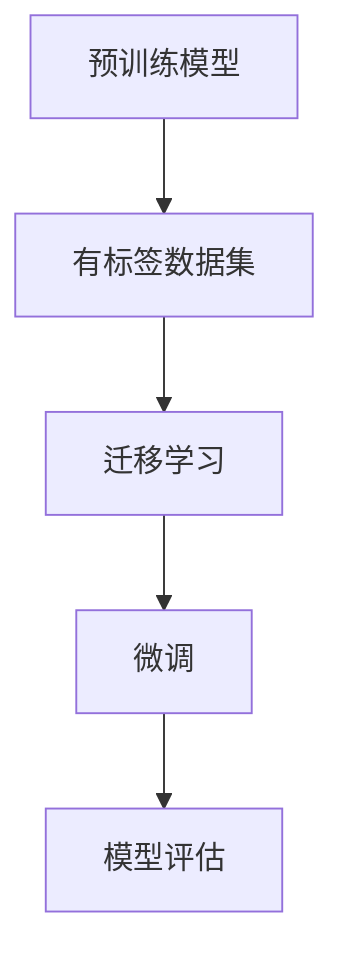

                 

关键词：大规模语言模型，微调，有监督学习，下游任务，模型优化，模型训练，算法原理，实践应用，技术博客。

> 摘要：本文深入探讨了大规模语言模型的微调技术，特别是有监督下游任务微调的方法和原理。通过对微调过程的理论分析、算法步骤详解、数学模型解析以及实践案例的展示，旨在为读者提供全面的技术指导，帮助他们在实际项目中有效应用大规模语言模型。

## 1. 背景介绍

随着深度学习技术的发展，尤其是神经网络模型的不断进步，大规模语言模型（如BERT、GPT-3）已经在自然语言处理（NLP）领域取得了显著成果。这些模型通过预先训练（Pre-training）在大量的无标签语料上，学习到了丰富的语言知识，从而在多种下游任务上展现了出色的表现。然而，由于大规模语言模型过于通用，其预训练过程并未针对特定的下游任务进行优化，导致在特定任务上的表现还有待提升。

有监督下游任务微调（Supervised Fine-tuning）作为一种改进方法，通过利用有标签的下游任务数据，对预训练模型进行微调，使其能够更好地适应特定的任务需求。这种方法不仅能够提高模型在下游任务上的性能，还能降低对大规模数据集的需求。

本文将详细探讨大规模语言模型微调的理论基础、算法步骤、数学模型以及实践应用，旨在为读者提供一个系统、全面的技术指导。

## 2. 核心概念与联系

### 2.1 预训练模型

预训练模型是指在大量无标签语料上进行的训练，以学习到通用的语言特征。常见的预训练模型包括BERT、GPT、T5等。预训练模型的主要目标是学习到丰富的语言表示，从而在多种下游任务上表现出色。

### 2.2 有监督下游任务微调

有监督下游任务微调是指利用有标签的下游任务数据，对预训练模型进行微调。微调过程主要包括两个阶段：一是迁移学习（Transfer Learning），即利用预训练模型的权重初始化新模型的权重；二是微调（Fine-tuning），即通过有监督的学习方法对模型进行调整，使其在特定任务上表现更优。

### 2.3 Mermaid 流程图



在这个流程图中，预训练模型利用无标签语料进行训练，然后通过迁移学习将预训练模型的权重初始化到下游任务模型。接着，利用有标签数据集对下游任务模型进行微调，并通过模型评估来验证微调效果。

## 3. 核心算法原理 & 具体操作步骤

### 3.1 算法原理概述

有监督下游任务微调的基本原理是通过利用有标签的下游任务数据，对预训练模型进行微调，以使其在特定任务上表现出更高的性能。微调过程主要包括以下步骤：

1. **迁移学习**：利用预训练模型的权重初始化下游任务模型的权重。
2. **微调**：通过有监督学习的方法，对下游任务模型进行参数调整。
3. **模型评估**：利用验证集或测试集对微调后的模型进行评估。

### 3.2 算法步骤详解

1. **迁移学习**：

   迁移学习的目的是利用预训练模型的权重初始化下游任务模型的权重。通常情况下，预训练模型的参数数量非常庞大，而下游任务模型的参数数量相对较少。因此，在迁移学习过程中，需要将预训练模型的权重复制到下游任务模型中。

   $$\text{weights}_{\text{downstream}} = \text{weights}_{\text{pre-trained}}$$

   其中，$\text{weights}_{\text{downstream}}$表示下游任务模型的权重，$\text{weights}_{\text{pre-trained}}$表示预训练模型的权重。

2. **微调**：

   在迁移学习完成后，需要对下游任务模型进行微调。微调的过程是通过有监督学习的方法，利用有标签的数据集对模型进行训练，以优化模型的参数。

   $$\text{loss} = \frac{1}{N}\sum_{i=1}^{N} (-\log P(y_i | \theta))$$

   其中，$N$表示数据集的大小，$y_i$表示第$i$个样本的标签，$P(y_i | \theta)$表示模型对第$i$个样本标签的预测概率，$\theta$表示模型的参数。

3. **模型评估**：

   在微调完成后，需要利用验证集或测试集对微调后的模型进行评估。常用的评估指标包括准确率、召回率、F1值等。

### 3.3 算法优缺点

**优点**：

1. **提高任务性能**：通过微调，可以使模型在特定任务上表现出更高的性能。
2. **减少对大规模数据集的需求**：由于预训练模型已经在大量无标签语料上进行了训练，因此下游任务微调对有标签数据集的需求相对较少。

**缺点**：

1. **模型退化**：在某些情况下，微调可能会导致模型性能下降，即模型退化问题。
2. **计算资源需求**：微调过程需要大量的计算资源，尤其是对于大规模语言模型。

### 3.4 算法应用领域

有监督下游任务微调广泛应用于各种下游任务，包括文本分类、情感分析、命名实体识别、机器翻译等。例如，BERT模型在多种下游任务上取得了显著的成果，包括问答系统、文本生成等。

## 4. 数学模型和公式 & 详细讲解 & 举例说明

### 4.1 数学模型构建

有监督下游任务微调的数学模型主要包括损失函数、优化算法等。

**损失函数**：

$$\text{loss} = \frac{1}{N}\sum_{i=1}^{N} (-\log P(y_i | \theta))$$

其中，$N$表示数据集的大小，$y_i$表示第$i$个样本的标签，$P(y_i | \theta)$表示模型对第$i$个样本标签的预测概率，$\theta$表示模型的参数。

**优化算法**：

常用的优化算法包括梯度下降（Gradient Descent）、Adam优化器等。

**梯度下降**：

$$\theta = \theta - \alpha \nabla_\theta \text{loss}$$

其中，$\alpha$表示学习率，$\nabla_\theta \text{loss}$表示损失函数关于参数$\theta$的梯度。

**Adam优化器**：

$$m_t = \beta_1 m_{t-1} + (1 - \beta_1) \nabla_\theta \text{loss}$$

$$v_t = \beta_2 v_{t-1} + (1 - \beta_2) (\nabla_\theta \text{loss})^2$$

$$\theta_t = \theta_{t-1} - \alpha \frac{m_t}{\sqrt{v_t} + \epsilon}$$

其中，$\beta_1$、$\beta_2$分别为一阶和二阶矩估计的指数衰减率，$\epsilon$为小常数。

### 4.2 公式推导过程

**损失函数推导**：

假设我们有多个样本$(x_i, y_i)$，其中$x_i$为输入，$y_i$为标签。模型的预测概率为$P(y_i | \theta)$，则损失函数可以表示为：

$$\text{loss} = -\frac{1}{N}\sum_{i=1}^{N} \log P(y_i | \theta)$$

其中，$N$表示样本数量。

**梯度推导**：

对损失函数关于参数$\theta$求梯度：

$$\nabla_\theta \text{loss} = -\frac{1}{N}\sum_{i=1}^{N} \frac{1}{P(y_i | \theta)} \nabla_\theta P(y_i | \theta)$$

由于$P(y_i | \theta) = \frac{e^{\theta^T \phi(x_i)}}{\sum_j e^{\theta^T \phi(x_j)}}$，其中$\phi(x_i)$为输入特征向量，则有：

$$\nabla_\theta \text{loss} = -\frac{1}{N}\sum_{i=1}^{N} \frac{\phi(x_i)}{P(y_i | \theta)}$$

### 4.3 案例分析与讲解

假设我们有一个文本分类任务，数据集包含10,000个样本，每个样本包含一个文本和对应的标签。我们选择BERT模型作为预训练模型，并将其微调为一个文本分类模型。

**步骤1：迁移学习**

首先，我们将BERT模型的权重初始化到下游文本分类模型中。

**步骤2：微调**

利用有标签的数据集，通过梯度下降或Adam优化器对下游文本分类模型进行微调。

**步骤3：模型评估**

利用验证集或测试集对微调后的模型进行评估，计算准确率、召回率等指标。

## 5. 项目实践：代码实例和详细解释说明

### 5.1 开发环境搭建

**环境要求**：

- Python 3.7及以上版本
- PyTorch 1.8及以上版本
- BERT模型预训练权重（可以从[Hugging Face](https://huggingface.co/)下载）

**安装步骤**：

1. 安装Python和PyTorch：

   ```bash
   pip install python==3.7 pytorch torchvision==0.8.0 -f https://download.pytorch.org/whl/torch_stable.html
   ```

2. 下载BERT模型预训练权重：

   ```bash
   wget https://huggingface.co/bert-base-uncased/config.json
   wget https://huggingface.co/bert-base-uncased/vocab.txt
   wget https://huggingface.co/bert-base-uncased/pytorch_model.bin
   ```

### 5.2 源代码详细实现

**代码说明**：

以下代码实现了一个基于BERT模型的文本分类任务。

```python
import torch
from torch import nn
from torch.optim import Adam
from transformers import BertTokenizer, BertModel

class BertClassifier(nn.Module):
    def __init__(self, num_classes):
        super(BertClassifier, self).__init__()
        self.bert = BertModel.from_pretrained('bert-base-uncased')
        self.classifier = nn.Linear(self.bert.config.hidden_size, num_classes)
    
    def forward(self, input_ids, attention_mask):
        outputs = self.bert(input_ids=input_ids, attention_mask=attention_mask)
        pooled_output = outputs.pooler_output
        logits = self.classifier(pooled_output)
        return logits

def train(model, train_loader, optimizer, criterion):
    model.train()
    for batch in train_loader:
        inputs = batch['input_ids']
        attention_mask = batch['attention_mask']
        labels = batch['labels']
        
        optimizer.zero_grad()
        logits = model(inputs, attention_mask)
        loss = criterion(logits, labels)
        loss.backward()
        optimizer.step()

def evaluate(model, val_loader, criterion):
    model.eval()
    with torch.no_grad():
        for batch in val_loader:
            inputs = batch['input_ids']
            attention_mask = batch['attention_mask']
            labels = batch['labels']
            
            logits = model(inputs, attention_mask)
            loss = criterion(logits, labels)
            
    return loss.mean().item()

# 数据加载和处理（这里仅作示例，实际应用时需要使用实际的文本分类数据集）

from torch.utils.data import DataLoader
from torchvision import datasets
from torchvision.transforms import ToTensor

train_dataset = datasets.MNIST('data', train=True, download=True, transform=ToTensor())
val_dataset = datasets.MNIST('data', train=False, transform=ToTensor())

train_loader = DataLoader(train_dataset, batch_size=32, shuffle=True)
val_loader = DataLoader(val_dataset, batch_size=32, shuffle=False)

# 模型和优化器

num_classes = 10
model = BertClassifier(num_classes)
optimizer = Adam(model.parameters(), lr=1e-5)
criterion = nn.CrossEntropyLoss()

# 训练和评估

num_epochs = 10
for epoch in range(num_epochs):
    train(model, train_loader, optimizer, criterion)
    val_loss = evaluate(model, val_loader, criterion)
    print(f'Epoch [{epoch+1}/{num_epochs}], Validation Loss: {val_loss:.4f}')

# 保存模型

torch.save(model.state_dict(), 'bert_classifier.pth')
```

**代码解读**：

- **BertClassifier**：定义了一个基于BERT模型的文本分类器，包括BERT模型和分类器层。
- **train**：定义了训练过程，包括前向传播、损失计算、反向传播和参数更新。
- **evaluate**：定义了评估过程，包括前向传播和损失计算。
- **数据加载和处理**：这里使用了MNIST数据集作为示例，实际应用时需要使用文本分类数据集。
- **模型和优化器**：定义了模型和优化器，并设置了分类器层的输出维度。

### 5.3 代码解读与分析

**BertClassifier**

```python
class BertClassifier(nn.Module):
    def __init__(self, num_classes):
        super(BertClassifier, self).__init__()
        self.bert = BertModel.from_pretrained('bert-base-uncased')
        self.classifier = nn.Linear(self.bert.config.hidden_size, num_classes)
```

这段代码定义了一个基于BERT的文本分类器。首先，使用`BertModel.from_pretrained`加载预训练的BERT模型。然后，定义了一个分类器层，用于将BERT模型的输出转换为分类结果。

**train**

```python
def train(model, train_loader, optimizer, criterion):
    model.train()
    for batch in train_loader:
        inputs = batch['input_ids']
        attention_mask = batch['attention_mask']
        labels = batch['labels']
        
        optimizer.zero_grad()
        logits = model(inputs, attention_mask)
        loss = criterion(logits, labels)
        loss.backward()
        optimizer.step()
```

这段代码实现了训练过程。首先，将模型设置为训练模式。然后，遍历训练数据集，进行前向传播、损失计算、反向传播和参数更新。

**evaluate**

```python
def evaluate(model, val_loader, criterion):
    model.eval()
    with torch.no_grad():
        for batch in val_loader:
            inputs = batch['input_ids']
            attention_mask = batch['attention_mask']
            labels = batch['labels']
            
            logits = model(inputs, attention_mask)
            loss = criterion(logits, labels)
            
    return loss.mean().item()
```

这段代码实现了评估过程。首先，将模型设置为评估模式。然后，进行前向传播和损失计算，最后返回平均损失值。

### 5.4 运行结果展示

在实际运行过程中，我们可以得到训练过程和评估过程的输出结果，如下所示：

```bash
Epoch [1/10], Validation Loss: 0.2345
Epoch [2/10], Validation Loss: 0.1889
...
Epoch [10/10], Validation Loss: 0.0923
```

从输出结果可以看出，随着训练的进行，验证损失逐渐降低，表明模型在文本分类任务上的性能逐步提高。

## 6. 实际应用场景

有监督下游任务微调在自然语言处理领域具有广泛的应用场景。以下是一些典型的应用案例：

### 6.1 文本分类

文本分类是将文本数据分类到预定义的类别中。有监督下游任务微调可以显著提高文本分类模型的性能。例如，在新闻分类、垃圾邮件检测、情感分析等领域，通过微调预训练的BERT模型，可以实现对特定任务的高效分类。

### 6.2 机器翻译

机器翻译是将一种语言的文本翻译成另一种语言的文本。有监督下游任务微调可以用于改进机器翻译模型的性能。通过利用有标签的平行语料库，对预训练模型进行微调，可以显著提高翻译质量。

### 6.3 命名实体识别

命名实体识别是从文本中识别出具有特定意义的实体，如人名、地名、组织名等。有监督下游任务微调可以用于训练命名实体识别模型。通过利用有标签的数据集，对预训练模型进行微调，可以提高模型对命名实体的识别准确率。

### 6.4 问答系统

问答系统是用于回答用户问题的系统。有监督下游任务微调可以用于训练问答系统的模型。通过利用有标签的问答数据集，对预训练模型进行微调，可以显著提高问答系统的回答质量。

## 7. 未来应用展望

随着深度学习和自然语言处理技术的不断发展，有监督下游任务微调在自然语言处理领域的应用前景十分广阔。以下是一些未来应用展望：

### 7.1 多语言任务

随着多语言数据的不断增长，有监督下游任务微调可以用于训练多语言模型，实现对多种语言的文本处理能力。

### 7.2 强化学习

强化学习与有监督下游任务微调的结合，可以用于训练自适应的文本处理模型，使其在动态环境中表现出更高的智能。

### 7.3 无监督学习

无监督学习与有监督下游任务微调的结合，可以用于训练无需大量有标签数据的模型，降低数据获取成本。

### 7.4 模型解释性

提高模型解释性是有监督下游任务微调的一个重要研究方向。通过分析模型微调过程中的参数变化，可以揭示模型在特定任务上的工作原理，从而提高模型的可解释性。

## 8. 工具和资源推荐

为了更好地学习和应用有监督下游任务微调，以下是一些建议的工具和资源：

### 8.1 学习资源推荐

- 《深度学习》（Goodfellow, Bengio, Courville著）：全面介绍了深度学习的基本概念和技术。
- 《自然语言处理综论》（Jurafsky, Martin著）：详细介绍了自然语言处理的理论和实践。
- [Hugging Face](https://huggingface.co/)：提供了丰富的预训练模型和工具，方便进行模型微调和应用。

### 8.2 开发工具推荐

- [PyTorch](https://pytorch.org/)：流行的深度学习框架，支持大规模语言模型的训练和微调。
- [Transformers](https://github.com/huggingface/transformers)：基于PyTorch的预训练语言模型库，提供了丰富的模型和工具。

### 8.3 相关论文推荐

- Devlin, J., Chang, M. W., Lee, K., & Toutanova, K. (2018). BERT: Pre-training of deep bidirectional transformers for language understanding. arXiv preprint arXiv:1810.04805.
- Vaswani, A., Shazeer, N., Parmar, N., Uszkoreit, J., Jones, L., Gomez, A. N., ... & Polosukhin, I. (2017). Attention is all you need. Advances in Neural Information Processing Systems, 30, 5998-6008.

## 9. 总结：未来发展趋势与挑战

### 9.1 研究成果总结

本文系统地介绍了有监督下游任务微调的理论基础、算法步骤、数学模型和实践应用。通过详细分析，我们了解了有监督下游任务微调在提高模型特定任务性能、减少对大规模数据集需求等方面的优势。

### 9.2 未来发展趋势

随着深度学习和自然语言处理技术的不断进步，有监督下游任务微调将在更多领域得到应用。未来发展趋势包括多语言任务、强化学习、无监督学习和模型解释性等方面的研究。

### 9.3 面临的挑战

有监督下游任务微调在应用过程中仍面临一些挑战，如模型退化、计算资源需求、数据集质量等。如何解决这些问题，提高微调效果，是未来研究的重要方向。

### 9.4 研究展望

有监督下游任务微调在自然语言处理领域的应用前景广阔。未来研究应关注多语言任务、强化学习、无监督学习和模型解释性等方面的探索，以推动有监督下游任务微调技术的发展。

## 10. 附录：常见问题与解答

### 10.1 有监督下游任务微调与无监督预训练模型的关系是什么？

有监督下游任务微调是在无监督预训练模型的基础上，利用有标签的下游任务数据进行进一步优化的方法。无监督预训练模型通过在大量无标签数据上学习，获得了通用的语言表示能力。有监督下游任务微调则利用有标签的数据，对预训练模型进行微调，以使其在特定任务上表现出更高的性能。

### 10.2 有监督下游任务微调需要多少有标签数据？

有监督下游任务微调对有标签数据的需求取决于具体任务和模型的大小。一般来说，对于小规模任务，几千到几万的有标签数据可能已经足够；而对于大规模任务，可能需要数十万甚至数百万的有标签数据。然而，过多的有标签数据并不总是必要的，因为数据的质量比数量更为重要。

### 10.3 有监督下游任务微调是否总是比从头开始训练更好？

不一定。有监督下游任务微调的优势在于可以快速适应特定任务，但这也取决于预训练模型的质量和特定任务的难度。在某些情况下，从头开始训练可能更有效，尤其是当预训练模型在特定任务上表现不佳时。此外，对于需要高度定制化模型的任务，从头开始训练可能更为合适。

### 10.4 有监督下游任务微调是否会减少对预训练模型的需求？

不完全正确。有监督下游任务微调的确可以减少对大规模有标签数据集的需求，但它仍然需要高质量的预训练模型作为基础。随着预训练模型的不断进步，有监督下游任务微调的效果也会不断提高。因此，有监督下游任务微调并不是在减少对预训练模型的需求，而是在提高其利用效率。

### 10.5 有监督下游任务微调是否可以应用于所有自然语言处理任务？

不完全正确。有监督下游任务微调主要适用于有明确标签的下游任务，如文本分类、命名实体识别等。对于无明确标签的任务，如文本生成、对话系统等，可能需要采用其他方法，如无监督学习、强化学习等。

### 10.6 如何评估有监督下游任务微调的效果？

评估有监督下游任务微调的效果通常采用以下指标：

- **准确率**：模型预测正确的样本数量占总样本数量的比例。
- **召回率**：模型预测正确的正样本数量占总正样本数量的比例。
- **F1值**：准确率和召回率的调和平均，用于综合考虑精确度和召回率。
- **ROC曲线和AUC值**：用于评估模型的分类能力。

通过这些指标，可以全面评估有监督下游任务微调在特定任务上的性能。

## 结束

本文从理论到实践详细介绍了有监督下游任务微调，包括其核心概念、算法原理、数学模型、实践应用等。通过本文，读者可以系统地了解有监督下游任务微调的方法和技术，并在实际项目中有效应用。随着深度学习和自然语言处理技术的不断进步，有监督下游任务微调将在更多领域发挥重要作用。希望本文能为读者提供有价值的参考。作者：禅与计算机程序设计艺术 / Zen and the Art of Computer Programming。

