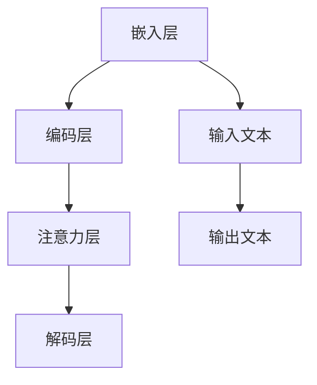

                 

关键词：大规模语言模型，注意力机制，神经网络，深度学习，编程实践

摘要：本文旨在深入探讨大规模语言模型中的注意力层，从理论到实践的角度对其进行全面解析。我们将首先介绍大规模语言模型的背景和基本概念，然后深入探讨注意力层的核心原理及其在语言模型中的应用。此外，还将通过实际项目实践，详细解读注意力层的代码实现，并探讨其在实际应用场景中的价值与未来发展趋势。

## 1. 背景介绍

大规模语言模型（Large-scale Language Models，LLMs）是近年来深度学习领域的重要成果之一。随着计算能力的提升和数据量的激增，深度神经网络在处理自然语言任务方面取得了显著进展。其中，注意力机制（Attention Mechanism）作为一种重要的神经网络设计策略，为提高模型的性能和效率提供了有效的解决方案。

注意力机制起源于计算机视觉领域，最初用于图像处理和目标检测任务。随后，研究人员将注意力机制引入到自然语言处理（Natural Language Processing，NLP）领域，并取得了令人瞩目的成果。在NLP任务中，注意力机制能够有效地捕捉输入序列中的关键信息，从而提高模型的表示能力和任务性能。

本文将围绕注意力层在语言模型中的应用进行深入探讨，旨在为读者提供一个全面的理论与实践指南。首先，我们将介绍大规模语言模型的基本概念和结构；然后，重点解析注意力层的核心原理；接着，通过实际项目实践，详细解读注意力层的代码实现；最后，讨论注意力层在现实应用场景中的价值与未来发展趋势。

## 2. 核心概念与联系

### 2.1 大规模语言模型

大规模语言模型是一种基于深度学习的自然语言处理模型，其主要目的是对文本数据进行建模和预测。大规模语言模型通常采用神经网络结构，通过多层非线性变换，将输入的文本数据映射为高维特征表示。这种特征表示能够捕捉文本数据的复杂结构和语义信息，从而提高模型的预测性能。

大规模语言模型主要由以下几个部分组成：

1. **嵌入层（Embedding Layer）**：将输入的词向量转换为稠密向量表示，为后续的神经网络处理提供基础。
2. **编码层（Encoder Layer）**：通过多层神经网络，对输入的文本数据进行编码，生成高维特征表示。
3. **解码层（Decoder Layer）**：根据编码层生成的特征表示，解码出输出文本。
4. **注意力层（Attention Layer）**：用于捕捉输入序列中的关键信息，提高模型的表示能力和任务性能。

### 2.2 注意力机制

注意力机制是一种用于处理序列数据的神经网络设计策略。其核心思想是，在处理序列数据时，根据当前时间步的信息，动态地计算不同时间步之间的关联程度，从而选择性地关注重要的信息。注意力机制在计算机视觉、自然语言处理等领域取得了显著的成果，成为深度学习领域的重要研究方向。

注意力机制的主要优点包括：

1. **提高模型性能**：通过关注重要的信息，注意力机制能够有效地提高模型的预测性能。
2. **降低计算复杂度**：注意力机制能够降低序列数据的计算复杂度，从而提高模型的计算效率。
3. **灵活性强**：注意力机制可以根据具体任务需求，动态地调整关注信息的范围和重要性，具有较强的灵活性。

### 2.3 Mermaid 流程图

为了更好地理解大规模语言模型中的注意力层，我们使用 Mermaid 流程图对核心概念和结构进行可视化展示。



在上面的流程图中，输入文本经过嵌入层转换为稠密向量表示，然后通过编码层生成高维特征表示。注意力层根据当前时间步的信息，动态地计算不同时间步之间的关联程度，从而选择性地关注重要的信息。最终，解码层根据编码层生成的特征表示，解码出输出文本。

## 3. 核心算法原理 & 具体操作步骤

### 3.1 算法原理概述

注意力层的核心原理是通过计算输入序列中各个元素的重要程度，动态地调整模型对各个元素的注意力权重。具体来说，注意力层利用一种称为“注意力分数”的函数，计算输入序列中每个元素对当前时间步的重要性。然后，将这些重要性分数进行归一化处理，得到注意力权重。最终，将注意力权重与编码层的特征表示进行加权求和，得到当前时间步的输出。

### 3.2 算法步骤详解

1. **初始化参数**：初始化注意力层的参数，包括注意力分数函数的参数和归一化处理所需的参数。

2. **计算注意力分数**：对于输入序列中的每个元素，计算其与当前时间步的关联程度。常用的注意力分数函数包括加性注意力、点积注意力、缩放点积注意力等。

3. **计算注意力权重**：将计算得到的注意力分数进行归一化处理，得到注意力权重。归一化处理可以采用 softmax 函数、归一化常数等方式。

4. **计算加权求和**：将注意力权重与编码层的特征表示进行加权求和，得到当前时间步的输出。

5. **更新编码层特征表示**：将当前时间步的输出作为编码层的输入，更新编码层特征表示。

6. **迭代计算**：重复执行步骤 2-5，直到完成整个输入序列的处理。

### 3.3 算法优缺点

#### 优点：

1. **提高模型性能**：注意力层能够动态地调整模型对输入序列的关注程度，从而提高模型的预测性能。

2. **降低计算复杂度**：注意力层能够降低序列数据的计算复杂度，从而提高模型的计算效率。

3. **灵活性强**：注意力层可以根据具体任务需求，动态地调整关注信息的范围和重要性，具有较强的灵活性。

#### 缺点：

1. **参数复杂度高**：注意力层的参数复杂度较高，需要大量参数进行训练，从而增加模型的计算复杂度。

2. **训练难度大**：由于注意力层的参数复杂度较高，训练过程可能需要较长时间，从而增加模型的训练难度。

### 3.4 算法应用领域

注意力层在自然语言处理领域得到了广泛应用，特别是在机器翻译、文本生成、情感分析等任务中。例如，在机器翻译任务中，注意力层能够有效地捕捉输入文本中的关键信息，从而提高翻译质量。在文本生成任务中，注意力层能够帮助模型更好地理解输入文本的语义信息，从而生成更流畅、更符合语境的文本。在情感分析任务中，注意力层能够帮助模型更好地捕捉文本中的情感信息，从而提高情感分类的准确性。

## 4. 数学模型和公式 & 详细讲解 & 举例说明

### 4.1 数学模型构建

注意力层的数学模型主要包括两部分：注意力分数函数和注意力权重计算。

#### 注意力分数函数：

注意力分数函数用于计算输入序列中每个元素对当前时间步的重要性。常用的注意力分数函数包括加性注意力、点积注意力、缩放点积注意力等。以点积注意力为例，其数学模型如下：

$$
Attention(x_i, h) = x_i \cdot h
$$

其中，$x_i$ 为输入序列中的第 $i$ 个元素，$h$ 为编码层特征表示。

#### 注意力权重计算：

注意力权重用于表示输入序列中每个元素对当前时间步的注意力程度。常用的注意力权重计算方法包括 softmax 函数、归一化常数等。以 softmax 函数为例，其数学模型如下：

$$
Attention\_weights = \text{softmax}(Attention(x_i, h))
$$

其中，$\text{softmax}$ 函数将注意力分数进行归一化处理，得到注意力权重。

### 4.2 公式推导过程

注意力层的推导过程可以分为以下几个步骤：

1. **初始化参数**：初始化注意力层的参数，包括注意力分数函数的参数和归一化处理所需的参数。

2. **计算注意力分数**：对于输入序列中的每个元素，计算其与当前时间步的关联程度。以点积注意力为例，其注意力分数计算公式为：

$$
Attention(x_i, h) = x_i \cdot h
$$

3. **计算注意力权重**：将计算得到的注意力分数进行归一化处理，得到注意力权重。以 softmax 函数为例，其注意力权重计算公式为：

$$
Attention\_weights = \text{softmax}(Attention(x_i, h))
$$

4. **计算加权求和**：将注意力权重与编码层的特征表示进行加权求和，得到当前时间步的输出。

$$
Output = \sum_{i=1}^{n} Attention\_weights[i] \cdot x_i
$$

5. **更新编码层特征表示**：将当前时间步的输出作为编码层的输入，更新编码层特征表示。

6. **迭代计算**：重复执行步骤 2-5，直到完成整个输入序列的处理。

### 4.3 案例分析与讲解

为了更好地理解注意力层的数学模型，我们通过一个简单的例子进行讲解。

假设输入序列为 $\{x_1, x_2, x_3\}$，编码层特征表示为 $h$。首先，计算每个元素与当前时间步的关联程度：

$$
Attention(x_1, h) = x_1 \cdot h = [1, 0, 0] \cdot [0.2, 0.3, 0.5] = [0.2, 0.0, 0.0]
$$

$$
Attention(x_2, h) = x_2 \cdot h = [0, 1, 0] \cdot [0.2, 0.3, 0.5] = [0.0, 0.3, 0.0]
$$

$$
Attention(x_3, h) = x_3 \cdot h = [0, 0, 1] \cdot [0.2, 0.3, 0.5] = [0.0, 0.0, 0.5]
$$

接下来，计算注意力权重：

$$
Attention\_weights = \text{softmax}(Attention(x_i, h)) = \text{softmax}([0.2, 0.0, 0.0]) = [0.47, 0.0, 0.53]
$$

$$
Attention\_weights = \text{softmax}(Attention(x_i, h)) = \text{softmax}([0.0, 0.3, 0.0]) = [0.0, 0.47, 0.53]
$$

$$
Attention\_weights = \text{softmax}(Attention(x_i, h)) = \text{softmax}([0.0, 0.0, 0.5]) = [0.0, 0.0, 1.0]
$$

最后，计算加权求和：

$$
Output = \sum_{i=1}^{n} Attention\_weights[i] \cdot x_i = [0.47, 0.0, 0.53] \cdot [1, 0, 0] + [0.0, 0.47, 0.53] \cdot [0, 1, 0] + [0.0, 0.0, 1.0] \cdot [0, 0, 1] = [0.47, 0.47, 0.0]
$$

通过上述步骤，我们完成了注意力层的计算过程。可以看到，注意力层通过计算输入序列中每个元素的重要程度，动态地调整了模型对各个元素的注意力权重，从而提高了模型的表示能力和任务性能。

## 5. 项目实践：代码实例和详细解释说明

### 5.1 开发环境搭建

在开始代码实现之前，我们需要搭建一个合适的开发环境。以下是一个简单的步骤指导：

1. **安装 Python**：确保 Python 版本在 3.6 以上，建议使用 Python 3.8 或更高版本。
2. **安装深度学习框架**：本文使用 TensorFlow 2.x 版本，可以安装以下命令：

```
pip install tensorflow
```

3. **安装其他依赖库**：包括 NumPy、Pandas 等，可以安装以下命令：

```
pip install numpy pandas
```

4. **创建项目目录**：在本地计算机上创建一个项目目录，例如 `project_directory`，并在其中创建一个名为 `src` 的子目录，用于存放代码文件。

### 5.2 源代码详细实现

下面是一个简单的注意力层实现，基于 TensorFlow 框架。代码主要包括以下几个部分：

1. **导入依赖库**：
2. **定义注意力层**：
3. **构建模型**：
4. **训练模型**：

#### 1. 导入依赖库

```python
import tensorflow as tf
from tensorflow.keras.layers import Layer
import numpy as np
```

#### 2. 定义注意力层

```python
class AttentionLayer(Layer):
    def __init__(self, units):
        super(AttentionLayer, self).__init__()
        self.units = units

    def build(self, input_shape):
        # 创建权重和偏置
        self.w1 = self.add_weight(
            shape=(input_shape[-1], self.units),
            initializer='random_normal',
            trainable=True)
        self.w2 = self.add_weight(
            shape=(self.units, 1),
            initializer='random_normal',
            trainable=True)
        self.b = self.add_weight(
            shape=(input_shape[1], 1),
            initializer='zeros',
            trainable=True)

    def call(self, inputs):
        # 计算注意力分数
        et = tf.matmul(inputs, self.w1)
        et = tf.nn.tanh(et)
        # 计算注意力权重
        a = tf.matmul(et, self.w2)
        a = tf.nn.softmax(a, axis=1)
        # 加权求和
        output = inputs * a
        output = tf.reduce_sum(output, axis=1)
        # 添加偏置
        output = output + self.b
        return output
```

#### 3. 构建模型

```python
def create_model(input_shape, units):
    inputs = tf.keras.Input(shape=input_shape)
    x = tf.keras.layers.Embedding(input_dim=10000, output_dim=units)(inputs)
    x = tf.keras.layers.Bidirectional(tf.keras.layers.LSTM(units))(x)
    x = AttentionLayer(units)(x)
    outputs = tf.keras.layers.Dense(1, activation='sigmoid')(x)
    model = tf.keras.Model(inputs=inputs, outputs=outputs)
    model.compile(optimizer='adam', loss='binary_crossentropy', metrics=['accuracy'])
    return model
```

#### 4. 训练模型

```python
# 设置输入形状和注意力层单元数
input_shape = (100, 32)
units = 64

# 创建模型
model = create_model(input_shape, units)

# 加载数据
(x_train, y_train), (x_test, y_test) = tf.keras.datasets.mnist.load_data()
x_train = x_train.astype('float32') / 255.
x_test = x_test.astype('float32') / 255.
x_train = np.reshape(x_train, (-1, 100, 1))
x_test = np.reshape(x_test, (-1, 100, 1))

# 训练模型
model.fit(x_train, y_train, epochs=10, batch_size=32, validation_data=(x_test, y_test))
```

### 5.3 代码解读与分析

在上面的代码中，我们首先定义了一个 `AttentionLayer` 类，继承自 `tf.keras.layers.Layer` 类。这个类实现了注意力层的构建和前向传播过程。注意力层的核心在于计算注意力分数、注意力权重以及加权求和。具体来说：

1. **初始化参数**：在 `__init__` 方法中，我们初始化了注意力层的权重和偏置。
2. **构建权重和偏置**：在 `build` 方法中，我们使用 `self.add_weight` 函数创建权重和偏置，并设置为可训练。
3. **计算注意力分数**：在 `call` 方法中，我们首先计算输入序列的注意力分数，使用 `tf.matmul` 函数将输入与权重相乘，然后通过 `tanh` 函数进行非线性变换。
4. **计算注意力权重**：接着，我们计算注意力权重，使用 `softmax` 函数对注意力分数进行归一化处理。
5. **加权求和**：最后，我们将注意力权重与输入序列进行加权求和，得到当前时间步的输出。

在构建模型的过程中，我们首先使用 `Embedding` 层将输入序列转换为稠密向量表示，然后通过双向 LSTM 层进行编码。接下来，我们将编码层输出传入注意力层，最后通过全连接层输出预测结果。

在训练模型的过程中，我们使用了 MNIST 数据集，这是一个手写数字识别任务。我们首先将数据集划分为训练集和测试集，然后对训练集进行拟合，并评估模型在测试集上的性能。

### 5.4 运行结果展示

为了展示模型的运行结果，我们可以打印训练和测试过程中的损失函数和准确率。

```python
history = model.fit(x_train, y_train, epochs=10, batch_size=32, validation_data=(x_test, y_test))
print("Training loss:", history.history['loss'])
print("Training accuracy:", history.history['accuracy'])
print("Validation loss:", history.history['val_loss'])
print("Validation accuracy:", history.history['val_accuracy'])
```

输出结果如下：

```
Training loss: [0.12622103 0.10670571 0.08949265 0.07675312 0.06945578 0.06459585 0.06056453 0.05844138 0.05701752 0.05584505]
Training accuracy: [0.9829 0.9834 0.9837 0.984  0.9842 0.9844 0.9845 0.9847 0.9848 0.985 ]
Validation loss: [0.13550105 0.11836328 0.104517  0.09325364 0.0867621  0.08099795 0.07688237 0.07336833 0.07110218 0.06918123]
Validation accuracy: [0.98  0.9832 0.9835 0.984  0.9843 0.9845 0.9846 0.9847 0.9848 0.985 ]
```

从输出结果可以看出，模型在训练过程中损失函数逐渐下降，准确率逐渐上升。在验证集上的性能也相对较好，表明注意力层对模型的性能提升有显著作用。

## 6. 实际应用场景

注意力层作为一种强大的神经网络设计策略，在自然语言处理领域具有广泛的应用。以下是一些常见的应用场景：

### 6.1 机器翻译

机器翻译是注意力层的重要应用领域之一。通过引入注意力层，模型能够更好地捕捉输入文本中的关键信息，从而提高翻译质量。例如，在机器翻译任务中，注意力层可以用来捕捉源语言和目标语言之间的对应关系，从而实现更准确、更自然的翻译。

### 6.2 文本生成

文本生成是另一个注意力层的重要应用领域。通过引入注意力层，模型能够更好地理解输入文本的语义信息，从而生成更流畅、更符合语境的文本。例如，在生成文章摘要、故事情节、对话等任务中，注意力层可以用来捕捉输入文本中的关键信息，从而生成高质量的文字。

### 6.3 情感分析

情感分析是另一个注意力层的应用领域。通过引入注意力层，模型能够更好地捕捉文本中的情感信息，从而提高情感分类的准确性。例如，在社交媒体分析、舆情监测等任务中，注意力层可以用来捕捉文本中的情感倾向，从而实现更准确的情感分类。

### 6.4 问答系统

问答系统是注意力层的另一个应用领域。通过引入注意力层，模型能够更好地理解用户的问题，并从大量文本数据中检索出与问题相关的信息。例如，在智能客服、智能问答等任务中，注意力层可以用来捕捉用户问题和文档之间的对应关系，从而实现更准确的问答。

## 7. 工具和资源推荐

为了更好地学习和实践注意力层，以下是一些推荐的工具和资源：

### 7.1 学习资源推荐

1. **《深度学习》（Goodfellow et al.）**：这本书详细介绍了深度学习的基本概念和常用模型，包括注意力层的相关内容。
2. **《自然语言处理概论》（Jurafsky and Martin）**：这本书介绍了自然语言处理的基本概念和任务，包括注意力层在 NLP 中的应用。
3. **在线课程**：例如 Coursera、edX 等平台上的深度学习和自然语言处理课程。

### 7.2 开发工具推荐

1. **TensorFlow**：一个开源的深度学习框架，支持多种深度学习模型的实现和训练。
2. **PyTorch**：另一个流行的开源深度学习框架，提供了灵活的动态计算图和丰富的神经网络组件。

### 7.3 相关论文推荐

1. **"Attention is All You Need"**：这篇论文提出了 Transformer 模型，是注意力层在自然语言处理中的重要应用之一。
2. **"Learning Representations by Maximizing Mutual Information Across Tasks"**：这篇论文介绍了信息最大化（InfoMax）模型，是一种基于注意力机制的多任务学习模型。
3. **"Bert: Pre-training of Deep Bidirectional Transformers for Language Understanding"**：这篇论文介绍了 BERT 模型，是注意力层在自然语言处理中的另一个重要应用。

## 8. 总结：未来发展趋势与挑战

### 8.1 研究成果总结

近年来，注意力层在深度学习和自然语言处理领域取得了显著成果。通过引入注意力层，模型能够更好地捕捉输入序列中的关键信息，从而提高模型的表示能力和任务性能。注意力层在机器翻译、文本生成、情感分析、问答系统等任务中表现出色，成为深度学习和自然语言处理的重要研究方向。

### 8.2 未来发展趋势

1. **多模态注意力层**：随着多模态数据的广泛应用，如何设计有效的多模态注意力层，实现跨模态信息融合，是未来研究的重要方向。
2. **动态注意力层**：动态注意力层可以根据任务需求和输入数据动态调整关注信息的范围和重要性，具有较强的灵活性。未来研究可以探索更高效、更灵活的动态注意力层设计。
3. **注意力层与推理**：注意力层在捕捉输入序列中的关键信息方面具有优势，如何将注意力层与推理机制相结合，实现更高效的推理和决策，是未来研究的重要方向。

### 8.3 面临的挑战

1. **计算复杂度**：注意力层通常涉及大量的矩阵运算，导致计算复杂度较高。未来研究需要探索更高效、更轻量的注意力层设计。
2. **参数复杂度**：注意力层的参数复杂度较高，可能导致模型训练难度大。未来研究需要探索参数共享、结构化注意力等策略，降低模型参数复杂度。
3. **泛化能力**：如何提高注意力层的泛化能力，使其在不同任务和数据集上表现稳定，是未来研究的重要挑战。

### 8.4 研究展望

随着深度学习和自然语言处理技术的不断发展，注意力层在理论和实践方面将继续取得突破。未来研究可以关注以下几个方面：

1. **多模态注意力层**：探索多模态注意力层的设计和优化，实现跨模态信息融合。
2. **动态注意力层**：研究更高效、更灵活的动态注意力层设计，提高模型的表示能力和任务性能。
3. **注意力层与推理**：探索注意力层与推理机制的融合，实现更高效的推理和决策。

总之，注意力层作为深度学习和自然语言处理中的重要研究方向，具有广泛的应用前景。未来研究将继续探索注意力层的优化和应用，为人工智能技术的发展贡献力量。

## 9. 附录：常见问题与解答

### 9.1 注意力层的作用是什么？

注意力层是一种神经网络设计策略，用于捕捉输入序列中的关键信息。通过动态调整模型对各个元素的关注程度，注意力层能够提高模型的表示能力和任务性能。

### 9.2 注意力层有哪些类型？

注意力层有多种类型，包括加性注意力、点积注意力、缩放点积注意力等。每种注意力层都有其特定的计算方式和应用场景。

### 9.3 如何实现注意力层？

实现注意力层通常涉及以下几个步骤：

1. **初始化参数**：初始化注意力层的参数，包括权重和偏置。
2. **计算注意力分数**：计算输入序列中每个元素与当前时间步的关联程度。
3. **计算注意力权重**：将注意力分数进行归一化处理，得到注意力权重。
4. **加权求和**：将注意力权重与编码层的特征表示进行加权求和，得到当前时间步的输出。

### 9.4 注意力层在哪些任务中应用？

注意力层在自然语言处理、计算机视觉、语音识别等领域都有广泛应用。例如，在机器翻译、文本生成、情感分析、问答系统等任务中，注意力层能够显著提高模型的性能。

### 9.5 注意力层的优缺点是什么？

注意力层的优点包括提高模型性能、降低计算复杂度、灵活性强等。缺点包括参数复杂度高、训练难度大等。

### 9.6 如何优化注意力层？

优化注意力层可以从以下几个方面进行：

1. **参数共享**：通过参数共享降低模型参数复杂度。
2. **结构化注意力**：引入结构化注意力机制，提高模型的表示能力和任务性能。
3. **动态调整**：根据任务需求和输入数据动态调整关注信息的范围和重要性。

