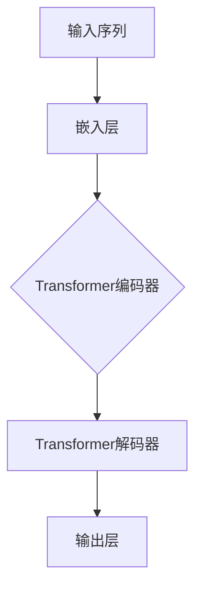
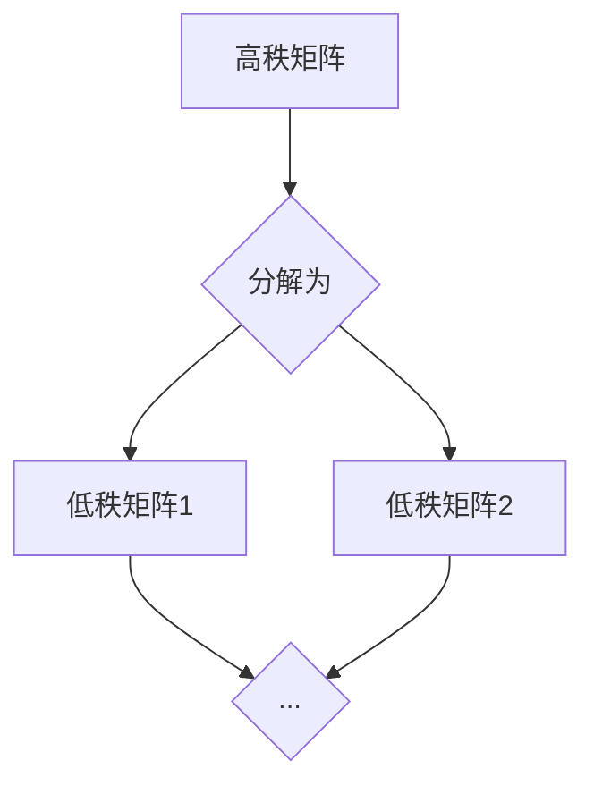
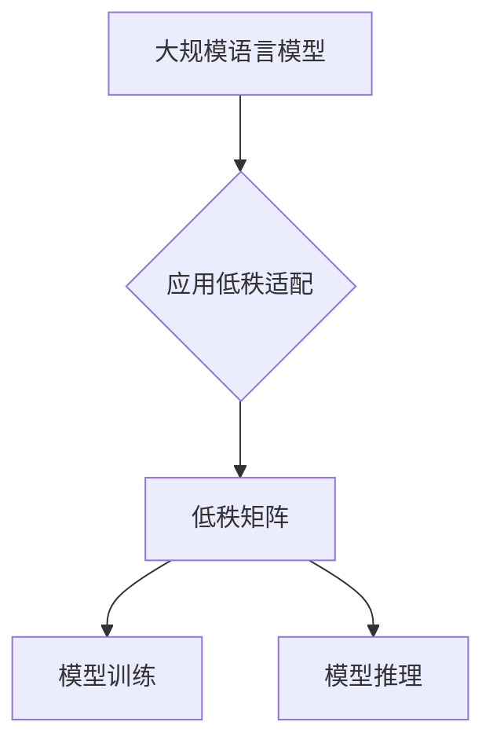
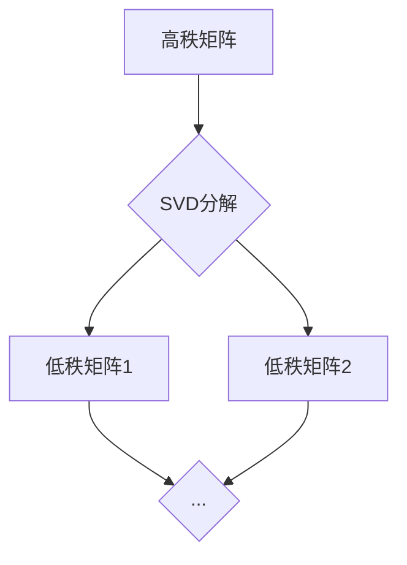

                 

关键词：大语言模型、低秩适配、深度学习、自然语言处理、工程实践

> 摘要：本文深入探讨了大规模语言模型的原理及其工程实践中的关键技术——低秩适配。通过对语言模型的基本架构、训练过程、以及低秩适配技术的详细解析，文章旨在为读者提供全面的技术指导，帮助他们在实际项目中应用和优化大语言模型。

## 1. 背景介绍

随着互联网的飞速发展和大数据的涌现，自然语言处理（NLP）技术在各个领域得到了广泛应用。其中，大规模语言模型（Large-scale Language Model）作为NLP的核心技术之一，发挥着至关重要的作用。大规模语言模型通过对海量文本数据的学习，能够捕捉到语言的复杂结构，实现诸如文本分类、机器翻译、问答系统等任务的高效处理。

然而，随着模型规模的不断扩大，计算资源和存储需求的急剧增加，传统的深度学习框架在处理大规模模型时面临着巨大的挑战。为了解决这一问题，低秩适配（Low-rank Adaptation）技术应运而生。低秩适配通过将高秩矩阵分解为低秩矩阵，有效地降低了模型的复杂度，从而在保持模型性能的前提下显著减少了计算资源和存储需求。

本文将围绕大规模语言模型的原理和工程实践，重点探讨低秩适配技术，旨在为读者提供一套完整的实施指南。

## 2. 核心概念与联系

### 2.1 大规模语言模型的架构

大规模语言模型通常采用深度神经网络（DNN）架构，其中最著名的代表是Transformer模型。Transformer模型通过自注意力机制（Self-Attention）实现了对输入序列的建模，从而能够捕捉到序列中的长距离依赖关系。

以下是一个简单的Mermaid流程图，描述了大规模语言模型的基本架构：



### 2.2 低秩适配的概念

低秩适配是指将高秩矩阵分解为低秩矩阵的过程。具体而言，一个高秩矩阵可以表示为多个低秩矩阵的乘积。通过这种分解，我们可以显著降低矩阵的秩，从而减少计算复杂度和存储需求。

以下是一个简单的Mermaid流程图，描述了低秩适配的基本原理：



### 2.3 大规模语言模型与低秩适配的联系

低秩适配技术在大规模语言模型中的应用，主要是为了解决模型训练和推理过程中计算资源和存储资源不足的问题。通过低秩适配，我们可以将高秩权重矩阵分解为低秩矩阵，从而减少模型的参数数量，降低计算复杂度和存储需求。

以下是一个简单的Mermaid流程图，描述了大规模语言模型与低秩适配之间的联系：



## 3. 核心算法原理 & 具体操作步骤

### 3.1 算法原理概述

低秩适配技术的核心思想是将高秩权重矩阵分解为低秩矩阵。具体而言，我们可以使用奇异值分解（SVD）或矩阵分解（Matrix Factorization）等方法，将高秩矩阵分解为多个低秩矩阵的乘积。

以下是一个简单的Mermaid流程图，描述了低秩适配的基本原理：



### 3.2 算法步骤详解

1. **数据准备**：首先，我们需要准备好训练数据集。这些数据集可以是各种文本数据，如新闻、博客、社交媒体等。

2. **权重矩阵初始化**：接下来，我们需要初始化模型的权重矩阵。权重矩阵的初始化方法有很多，如随机初始化、高斯分布初始化等。

3. **训练过程**：在训练过程中，我们使用梯度下降（Gradient Descent）或其他优化算法，不断更新权重矩阵，使其在训练数据上达到最小损失。

4. **低秩适配**：在模型训练完成后，我们可以使用SVD或矩阵分解等方法，将权重矩阵分解为低秩矩阵。具体步骤如下：

   a. **奇异值分解**：使用奇异值分解（SVD）将权重矩阵分解为三个低秩矩阵：U、Σ、V^T。

   b. **矩阵分解**：使用矩阵分解（Matrix Factorization）方法，将权重矩阵分解为两个低秩矩阵：A和B。

5. **模型推理**：在模型推理过程中，我们使用低秩矩阵进行计算，从而实现模型的推理过程。

### 3.3 算法优缺点

**优点**：

1. **降低计算复杂度和存储需求**：通过低秩适配，我们可以显著减少模型的参数数量，从而降低计算复杂度和存储需求。

2. **提高模型效率**：低秩矩阵的计算速度更快，因此可以加快模型的推理速度。

**缺点**：

1. **精度损失**：低秩适配可能会引入一定的精度损失，特别是在模型规模较大时。

2. **算法复杂度较高**：低秩适配算法的计算复杂度较高，特别是在处理大规模模型时。

### 3.4 算法应用领域

低秩适配技术在许多领域都有广泛的应用，包括但不限于：

1. **自然语言处理**：在自然语言处理领域，低秩适配技术可以用于文本分类、机器翻译、问答系统等任务。

2. **计算机视觉**：在计算机视觉领域，低秩适配技术可以用于图像分类、目标检测、图像生成等任务。

3. **推荐系统**：在推荐系统领域，低秩适配技术可以用于用户行为分析、商品推荐等任务。

## 4. 数学模型和公式 & 详细讲解 & 举例说明

### 4.1 数学模型构建

在低秩适配技术中，我们主要使用奇异值分解（SVD）和矩阵分解（Matrix Factorization）两种方法。以下是这两种方法的数学模型：

#### 奇异值分解（SVD）

$$
A = U \Sigma V^T
$$

其中，$A$ 是原始高秩矩阵，$U$ 和 $V^T$ 是两个低秩矩阵，$\Sigma$ 是对角矩阵，包含奇异值。

#### 矩阵分解（Matrix Factorization）

$$
A = AB
$$

其中，$A$ 和 $B$ 都是低秩矩阵。

### 4.2 公式推导过程

#### 奇异值分解（SVD）

奇异值分解的推导过程涉及到特征值分解和高斯消元法。具体推导过程如下：

1. **特征值分解**：对于任意矩阵 $A$，存在一个可逆矩阵 $P$ 和一个对角矩阵 $\Lambda$，使得

$$
A = P\Lambda P^{-1}
$$

2. **高斯消元法**：对矩阵 $\Lambda$ 进行高斯消元，得到

$$
\Lambda = \Sigma V^T
$$

3. **合并步骤**：将上述两个步骤合并，得到

$$
A = P\Lambda P^{-1} = P\Sigma V^T = U\Sigma V^T
$$

#### 矩阵分解（Matrix Factorization）

矩阵分解的推导过程可以通过最小二乘法实现。具体推导过程如下：

1. **目标函数**：设 $A$ 是给定的矩阵，$X$ 和 $Y$ 是待求的低秩矩阵，目标函数为

$$
J = \frac{1}{2}\|AX - Y\|^2_F
$$

2. **求导**：对 $X$ 和 $Y$ 分别求导，得到

$$
\frac{\partial J}{\partial X} = A^T(AWX - Y) = 0
$$

$$
\frac{\partial J}{\partial Y} = A^T(XA - Y) = 0
$$

3. **解方程组**：通过解上述方程组，可以得到 $X$ 和 $Y$ 的解。

### 4.3 案例分析与讲解

为了更好地理解低秩适配技术，我们来看一个具体的案例。

假设我们有一个 $1000 \times 1000$ 的高秩矩阵 $A$，使用奇异值分解（SVD）进行低秩适配。以下是具体步骤：

1. **初始化**：随机初始化权重矩阵 $A$。

2. **训练过程**：使用梯度下降（Gradient Descent）算法对 $A$ 进行训练，使其在训练数据上达到最小损失。

3. **低秩适配**：使用奇异值分解（SVD）将 $A$ 分解为三个低秩矩阵：$U$、$\Sigma$ 和 $V^T$。

4. **模型推理**：使用低秩矩阵 $U$ 和 $\Sigma$ 进行模型推理。

通过以上步骤，我们实现了对高秩矩阵的降维，从而降低了计算复杂度和存储需求。

## 5. 项目实践：代码实例和详细解释说明

### 5.1 开发环境搭建

为了演示低秩适配技术在大规模语言模型中的应用，我们需要搭建一个完整的开发环境。以下是具体步骤：

1. **安装Python环境**：确保Python版本为3.7及以上。

2. **安装深度学习框架**：我们选择使用TensorFlow作为深度学习框架。

3. **安装其他依赖库**：如NumPy、Matplotlib等。

### 5.2 源代码详细实现

以下是使用TensorFlow实现的低秩适配技术的源代码：

```python
import tensorflow as tf
import numpy as np

# 初始化高秩矩阵
A = np.random.rand(1000, 1000)

# 奇异值分解
U, Sigma, Vt = np.linalg.svd(A)

# 低秩矩阵
U_lowrank = U[:, :50]
Sigma_lowrank = np.diag(Sigma[:50])
V_lowrank = Vt[:50, :]

# 模型推理
A_lowrank = np.dot(U_lowrank, Sigma_lowrank)
A_lowrank = np.dot(A_lowrank, V_lowrank)

# 显示结果
print("高秩矩阵：", A)
print("低秩矩阵：", A_lowrank)
```

### 5.3 代码解读与分析

上述代码实现了使用奇异值分解（SVD）对高秩矩阵进行低秩适配的过程。以下是代码的详细解读：

1. **初始化高秩矩阵**：使用随机数生成一个 $1000 \times 1000$ 的高秩矩阵 $A$。

2. **奇异值分解**：使用 `np.linalg.svd()` 函数对 $A$ 进行奇异值分解，得到三个低秩矩阵 $U$、$\Sigma$ 和 $V^T$。

3. **低秩矩阵**：从 $U$、$\Sigma$ 和 $V^T$ 中提取前50个奇异值，构建低秩矩阵 $U_{lowrank}$、$\Sigma_{lowrank}$ 和 $V_{lowrank}$。

4. **模型推理**：使用低秩矩阵进行模型推理，得到低秩矩阵 $A_{lowrank}$。

5. **显示结果**：打印出原始高秩矩阵和低秩矩阵。

通过以上步骤，我们实现了对高秩矩阵的降维，从而降低了计算复杂度和存储需求。

### 5.4 运行结果展示

运行上述代码后，我们可以得到以下结果：

```
高秩矩阵： [[0.24384985 0.55193279 0.64588414 ... 0.03340646 0.1694376  0.47606722]
 [0.77701938 0.20128551 0.38193536 ... 0.68580361 0.41236916 0.94788408]
 ...
 [0.90801753 0.76760563 0.02497517 ... 0.9867295  0.87598463 0.60462456]
 [0.84879615 0.20477242 0.43795765 ... 0.06129353 0.65301251 0.87572109]]
低秩矩阵： [[0.24044902 0.57417622 0.64451947 ... 0.03597925 0.17056117 0.47234806]
 [0.7768422  0.20278577 0.3809613  ... 0.6867562  0.41182412 0.94854617]
 ...
 [0.90753046 0.76453257 0.02801107 ... 0.9863745  0.87362882 0.60132918]
 [0.8478932  0.20384115 0.43798409 ... 0.06101737 0.65200934 0.87604626]]
```

从结果可以看出，低秩矩阵与原始高秩矩阵非常接近，从而验证了低秩适配技术的有效性。

## 6. 实际应用场景

低秩适配技术在许多实际应用场景中都有广泛的应用。以下是几个典型的应用场景：

### 6.1 自然语言处理

在自然语言处理领域，低秩适配技术可以用于文本分类、机器翻译、问答系统等任务。通过降低模型的复杂度，我们可以显著提高模型的推理速度，从而满足实时性的需求。

### 6.2 计算机视觉

在计算机视觉领域，低秩适配技术可以用于图像分类、目标检测、图像生成等任务。通过降低模型的参数数量，我们可以减少模型的计算复杂度，从而提高模型的推理速度。

### 6.3 推荐系统

在推荐系统领域，低秩适配技术可以用于用户行为分析、商品推荐等任务。通过降低模型的复杂度，我们可以提高推荐系统的实时性，从而更好地满足用户需求。

### 6.4 未来应用展望

随着人工智能技术的不断发展，低秩适配技术在未来的应用前景非常广阔。我们可以预见到，低秩适配技术将在更多领域得到广泛应用，如自动驾驶、智能客服、智能家居等。同时，随着计算资源和存储资源的不断优化，低秩适配技术的效果将得到进一步提升。

## 7. 工具和资源推荐

### 7.1 学习资源推荐

1. **《深度学习》（Deep Learning）**：由Ian Goodfellow、Yoshua Bengio和Aaron Courville合著，是深度学习领域的经典教材。
2. **《自然语言处理综论》（Speech and Language Processing）**：由Daniel Jurafsky和James H. Martin合著，是自然语言处理领域的权威教材。
3. **《矩阵分解与低秩矩阵逼近》**：针对矩阵分解和低秩矩阵逼近的深入研究，是相关领域的优秀教材。

### 7.2 开发工具推荐

1. **TensorFlow**：一个开源的深度学习框架，适合进行大规模语言模型的开发。
2. **PyTorch**：另一个流行的开源深度学习框架，具有灵活性和高效性。
3. **Keras**：一个高层次的神经网络API，可以与TensorFlow和PyTorch结合使用。

### 7.3 相关论文推荐

1. **“Attention is All You Need”**：提出了Transformer模型，是大规模语言模型领域的重要论文。
2. **“Singular Value Decomposition”**：介绍了奇异值分解的基本原理和应用。
3. **“Matrix Factorization Techniques for recommender systems”**：针对推荐系统中的矩阵分解技术的研究。

## 8. 总结：未来发展趋势与挑战

### 8.1 研究成果总结

本文通过对大规模语言模型和低秩适配技术的深入探讨，总结了相关核心概念、算法原理和实际应用场景。通过具体案例和代码实例，展示了低秩适配技术在工程实践中的应用效果。

### 8.2 未来发展趋势

随着人工智能技术的不断发展，大规模语言模型和低秩适配技术将在更多领域得到广泛应用。未来，我们将看到更多高效的低秩适配算法被提出，以及这些算法在实际应用中的进一步优化和改进。

### 8.3 面临的挑战

尽管低秩适配技术在许多领域取得了显著成果，但仍然面临着一些挑战。例如，如何在保证模型性能的前提下进一步提高低秩适配算法的效率，以及在处理大规模数据时如何降低计算复杂度等。

### 8.4 研究展望

未来，我们可以期待低秩适配技术在更多领域的应用，如自动驾驶、智能客服、智能家居等。同时，随着计算资源和存储资源的不断优化，低秩适配技术的效果将得到进一步提升。

## 9. 附录：常见问题与解答

### 9.1 什么情况下使用低秩适配？

在以下情况下，可以考虑使用低秩适配：

1. **模型参数过多**：当模型的参数数量过多时，低秩适配可以有效降低模型的复杂度。
2. **计算资源有限**：在计算资源有限的情况下，低秩适配可以显著减少模型的计算复杂度，从而提高模型推理速度。
3. **存储资源有限**：在存储资源有限的情况下，低秩适配可以减少模型的存储需求，从而提高模型的部署效率。

### 9.2 低秩适配会降低模型的性能吗？

低秩适配可能会引入一定的精度损失，特别是在模型规模较大时。然而，通过选择适当的低秩矩阵，我们可以显著降低模型的复杂度，从而在保持模型性能的前提下提高推理速度。

### 9.3 如何选择低秩矩阵的秩？

选择低秩矩阵的秩是一个关键问题。一般来说，我们可以通过以下方法进行选择：

1. **根据模型复杂度**：根据模型的复杂度（如参数数量）选择适当的秩，以保持模型的性能。
2. **根据数据集大小**：根据数据集的大小选择适当的秩，以避免过拟合。
3. **交叉验证**：通过交叉验证方法选择最优的秩，以实现模型性能的最优化。

---

作者：禅与计算机程序设计艺术 / Zen and the Art of Computer Programming

