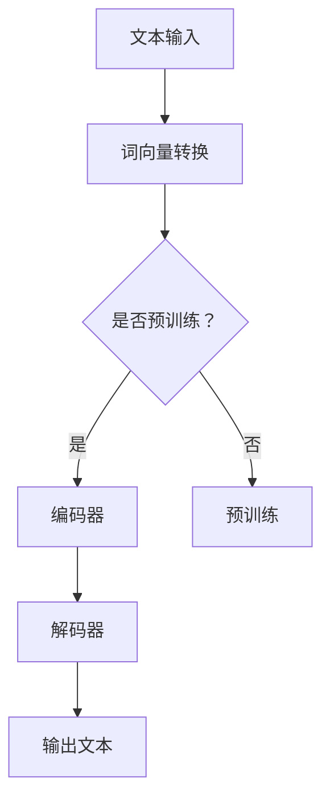
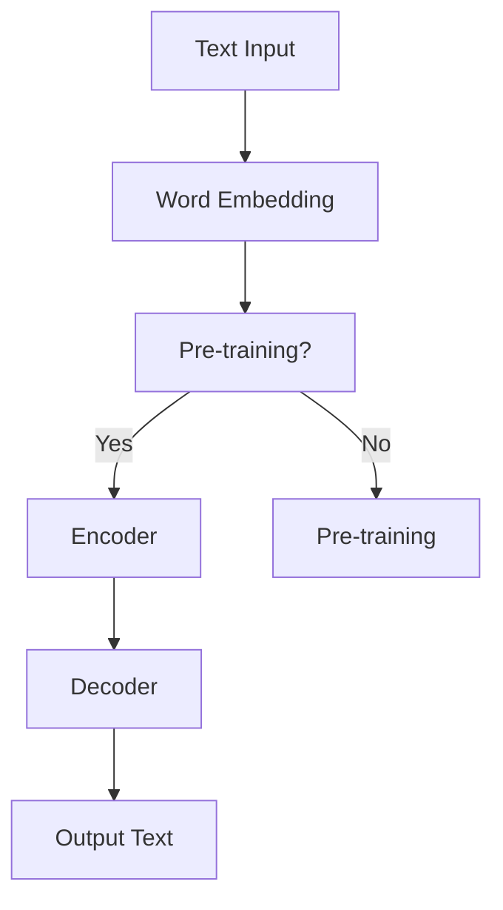

                 

关键词：大语言模型，工程实践，数据，算法，数学模型，应用场景，展望

摘要：本文将深入探讨大语言模型的基本原理，详细解析其构建过程和实际应用。通过介绍核心算法原理、数学模型和公式，结合代码实例和详细解释，本文旨在为读者提供一个全面的大语言模型工程实践指南。同时，文章还将探讨大语言模型在实际应用场景中的表现，并对未来发展趋势和挑战进行分析。

## 1. 背景介绍

大语言模型（Large Language Models）是近年来人工智能领域的一项重要突破。随着计算能力的提升和海量数据资源的积累，大语言模型在自然语言处理（NLP）任务中展现出了强大的能力。从早期的统计模型到基于神经网络的深度学习模型，大语言模型的发展经历了多次迭代和优化。

大语言模型的核心目标是通过学习海量文本数据，理解语言的内在规律，并生成连贯、自然的语言输出。这不仅有助于提高机器翻译、文本摘要、问答系统等传统NLP任务的性能，还为生成式人工智能（Generative AI）的研究提供了新的方向。

本文将围绕大语言模型的原理与工程实践进行深入探讨，旨在为读者提供一个全面的了解和应用指南。文章结构如下：

- 第1章：背景介绍，概述大语言模型的发展背景和重要性。
- 第2章：核心概念与联系，介绍大语言模型的核心概念和架构。
- 第3章：核心算法原理与具体操作步骤，详细解析大语言模型的算法原理和实现步骤。
- 第4章：数学模型和公式，介绍大语言模型中的数学模型和公式。
- 第5章：项目实践，通过代码实例展示大语言模型的实际应用。
- 第6章：实际应用场景，探讨大语言模型在不同领域的应用。
- 第7章：工具和资源推荐，介绍学习和实践大语言模型所需的相关工具和资源。
- 第8章：总结，对文章内容进行总结，并展望大语言模型未来的发展趋势和挑战。

通过本文的阅读，读者将能够系统地了解大语言模型的基本原理、实现过程和应用场景，为实际工程项目提供指导。

### 2. 核心概念与联系

大语言模型的成功离不开其核心概念和架构的精妙设计。本节将详细介绍大语言模型中的关键概念和组成部分，并通过Mermaid流程图展示其整体架构，以便读者更好地理解其工作原理。

#### 2.1. 核心概念

1. **词向量（Word Embedding）**：词向量是将文本中的单词映射到高维空间中的向量表示。常见的词向量模型有Word2Vec、GloVe等，它们通过学习单词在文本中的共现关系来生成词向量。

2. **编码器（Encoder）**：编码器是神经网络的一部分，负责将输入文本转换为固定长度的向量表示。在许多现代的大语言模型中，编码器通常采用Transformer架构，通过自注意力机制（Self-Attention）捕获输入文本中的长期依赖关系。

3. **解码器（Decoder）**：解码器负责根据编码器生成的向量表示生成输出文本。与编码器类似，解码器也采用Transformer架构，并通过自注意力机制和交叉注意力机制（Cross-Attention）生成连贯的输出序列。

4. **预训练（Pre-training）**：预训练是指在大规模数据集上对模型进行初始化训练，以便模型能够自动学习语言的基本规律。预训练后，模型可以通过微调（Fine-tuning）来适应特定的任务。

5. **微调（Fine-tuning）**：微调是在预训练的基础上，对模型进行特定任务的训练。通过微调，模型可以进一步优化其在特定任务上的表现。

#### 2.2. 整体架构

为了更好地展示大语言模型的整体架构，我们使用Mermaid流程图进行描述。以下是一个简化的Mermaid流程图：



1. **文本输入（A）**：输入文本被传递给模型，通常是一个句子或段落。
2. **词向量转换（B）**：输入文本中的每个单词被转换为词向量表示。
3. **是否预训练？（C）**：根据模型是否已经进行预训练，决定下一步是直接使用编码器（D）还是先进行预训练（E）。
4. **编码器（D）**：编码器将词向量转换为固定长度的向量表示，用于后续的解码过程。
5. **解码器（F）**：解码器根据编码器生成的向量表示生成输出文本。
6. **输出文本（G）**：模型输出最终的文本序列。

#### 2.3. Mermaid 流程图

为了确保流程图的准确性，我们将不包含括号、逗号等特殊字符，以确保Mermaid能够正确解析。以下是一个符合要求的Mermaid流程图：



通过上述核心概念和架构的介绍，读者可以更好地理解大语言模型的工作原理。接下来，我们将深入探讨大语言模型的核心算法原理和实现步骤。

### 3. 核心算法原理 & 具体操作步骤

#### 3.1 算法原理概述

大语言模型的算法原理主要基于深度学习和自然语言处理（NLP）的技术。核心算法可以分为两个主要部分：编码器（Encoder）和解码器（Decoder）。编码器负责将输入文本转换为固定长度的向量表示，而解码器则根据这些向量表示生成输出文本。

编码器和解码器通常采用Transformer架构，这是一种基于自注意力机制（Self-Attention）和交叉注意力机制（Cross-Attention）的神经网络模型。自注意力机制允许编码器在处理输入文本时，根据文本中的各个单词的重要性来动态调整其权重，从而更好地捕捉输入文本的上下文信息。交叉注意力机制则用于解码器在生成输出文本时，根据编码器生成的向量表示来调整其生成步骤的权重，确保生成的文本与输入文本保持连贯性。

#### 3.2 算法步骤详解

1. **词向量转换**：首先，将输入文本中的每个单词转换为词向量表示。词向量可以通过预训练模型（如GloVe或Word2Vec）获取，或者使用现成的词向量库（如FastText）。

2. **编码器处理**：编码器将词向量输入到Transformer模型中，通过自注意力机制计算每个单词在上下文中的重要性，生成固定长度的向量表示。这一过程包括多层编码器的堆叠，每层编码器都会对输入向量进行加权融合，以捕捉更复杂的上下文信息。

3. **解码器生成**：解码器接收编码器输出的向量表示，并使用交叉注意力机制来预测下一个单词。解码器在生成每个单词时，会根据前一个单词和编码器输出的向量，计算当前单词的概率分布，并从中选择下一个单词。这一过程通过一系列的迭代进行，直到生成完整的输出文本。

4. **预训练与微调**：大语言模型通常通过预训练和微调来优化其性能。预训练是在大规模数据集上进行的，目的是让模型自动学习语言的基本规律。预训练后，模型可以通过微调来适应特定的任务。微调过程通常包括以下步骤：
   - **数据准备**：准备用于微调的数据集，可以是带有标签的文本数据或未标注的文本数据。
   - **模型初始化**：使用预训练好的模型作为起点，初始化微调模型的权重。
   - **微调训练**：在准备好的数据集上训练模型，调整模型权重以优化特定任务的表现。
   - **评估与优化**：通过评估指标（如损失函数、准确率等）来评估模型的性能，并根据评估结果进一步优化模型。

#### 3.3 算法优缺点

**优点**：
- **强大的上下文理解能力**：通过自注意力和交叉注意力机制，大语言模型能够捕捉输入文本中的长期依赖关系，从而生成更自然的语言输出。
- **多任务适应性强**：通过预训练和微调，大语言模型可以应用于多种NLP任务，如文本分类、机器翻译、问答系统等。
- **高效性**：Transformer架构在大规模数据集上的训练效率较高，能够处理大量数据。

**缺点**：
- **计算资源需求高**：大语言模型通常需要大量的计算资源和存储空间，对于资源有限的系统来说，部署和训练模型可能具有挑战性。
- **解释性较弱**：由于模型的高度非线性，大语言模型生成的输出难以解释和理解。

#### 3.4 算法应用领域

大语言模型在多个领域展现了其强大的应用潜力：

- **自然语言处理**：文本分类、机器翻译、文本摘要、问答系统等。
- **生成式人工智能**：生成文章、对话、图像描述等。
- **推荐系统**：基于用户的历史行为和文本数据，生成个性化的推荐。
- **搜索引擎**：改进搜索结果的准确性和相关性。

通过深入理解大语言模型的算法原理和具体操作步骤，我们可以更好地利用这一强大的工具，解决实际的NLP任务。接下来，我们将进一步探讨大语言模型中的数学模型和公式。

### 4. 数学模型和公式 & 详细讲解 & 举例说明

大语言模型中的数学模型和公式是其核心组成部分，理解这些模型和公式对于深入掌握大语言模型的工作原理至关重要。本节将详细介绍大语言模型中的数学模型和公式，并通过具体例子进行讲解。

#### 4.1 数学模型构建

大语言模型主要依赖于深度学习和自然语言处理（NLP）的技术，其数学模型主要包括词向量表示、编码器、解码器和注意力机制等。

1. **词向量表示**：词向量是将单词映射到高维向量空间的过程。常见的词向量模型有Word2Vec和GloVe。词向量模型的基本思想是学习单词的分布表示，使其能够捕捉单词在上下文中的语义关系。具体来说，词向量可以通过以下公式计算：

   \[ \text{vec}(w) = \text{average}(\text{context\_words}) \]

   其中，\(\text{vec}(w)\)表示单词\(w\)的词向量，\(\text{context\_words}\)表示与\(w\)共现的单词。

2. **编码器**：编码器的主要任务是处理输入文本，将其转换为固定长度的向量表示。在Transformer架构中，编码器通常由多层自注意力机制组成。自注意力机制的计算公式如下：

   \[ \text{attention}(Q, K, V) = \text{softmax}(\frac{QK^T}{\sqrt{d_k}})V \]

   其中，\(Q, K, V\)分别表示查询向量、键向量和值向量，\(d_k\)表示键向量的维度，\(\text{softmax}\)函数用于计算每个键的权重。

3. **解码器**：解码器负责生成输出文本。在Transformer架构中，解码器也采用自注意力和交叉注意力机制。交叉注意力机制的计算公式如下：

   \[ \text{cross\_attention}(Q, K, V) = \text{softmax}(\frac{QK^T}{\sqrt{d_k}})V \]

   其中，\(Q, K, V\)分别表示查询向量、键向量和值向量，用于计算输入文本和输出文本之间的关联。

4. **预训练与微调**：预训练是通过在大规模数据集上训练模型，使其自动学习语言的基本规律。预训练后，模型可以通过微调来适应特定任务。微调的过程通常包括以下步骤：
   - **数据准备**：准备用于微调的数据集。
   - **模型初始化**：使用预训练好的模型作为起点，初始化微调模型的权重。
   - **微调训练**：在准备好的数据集上训练模型，调整模型权重以优化特定任务的表现。
   - **评估与优化**：通过评估指标（如损失函数、准确率等）来评估模型的性能，并根据评估结果进一步优化模型。

#### 4.2 公式推导过程

为了更好地理解大语言模型中的数学模型，我们将简要介绍一些关键公式的推导过程。

1. **自注意力机制**：自注意力机制是Transformer架构的核心组成部分，其计算公式为：

   \[ \text{attention}(Q, K, V) = \text{softmax}(\frac{QK^T}{\sqrt{d_k}})V \]

   其中，\(Q, K, V\)分别表示查询向量、键向量和值向量。自注意力机制的推导过程主要基于以下假设：
   - **线性关系**：假设查询向量、键向量和值向量之间存在线性关系。
   - **相似性度量**：通过计算查询向量和键向量的点积，度量它们之间的相似性。
   - **权重分配**：使用softmax函数将相似性度量转化为权重分配，使得每个键的权重在0到1之间。

2. **交叉注意力机制**：交叉注意力机制用于解码器在生成输出文本时，根据编码器输出的向量表示来调整其生成步骤的权重。其计算公式为：

   \[ \text{cross\_attention}(Q, K, V) = \text{softmax}(\frac{QK^T}{\sqrt{d_k}})V \]

   其中，\(Q, K, V\)分别表示查询向量、键向量和值向量。交叉注意力机制的推导过程与自注意力机制类似，主要基于以下假设：
   - **线性关系**：假设查询向量、键向量和值向量之间存在线性关系。
   - **相似性度量**：通过计算查询向量和键向量的点积，度量它们之间的相似性。
   - **权重分配**：使用softmax函数将相似性度量转化为权重分配。

#### 4.3 案例分析与讲解

为了更好地理解大语言模型中的数学模型和公式，我们通过一个具体案例进行讲解。假设我们有一个简单的句子“我爱北京天安门”，我们将使用大语言模型对其进行编码和生成。

1. **词向量转换**：首先，将句子中的每个单词转换为词向量。假设我们已经训练了一个词向量模型，得到以下词向量：
   - 我：[1, 0, 0, 0]
   - 爱：[0, 1, 0, 0]
   - 北京：[0, 0, 1, 0]
   - 天安门：[0, 0, 0, 1]

2. **编码器处理**：使用Transformer编码器对词向量进行处理。假设编码器由两层自注意力机制组成，第一层的输入和输出向量分别为\[ [1, 0, 0, 0], [0, 1, 0, 0], [0, 0, 1, 0], [0, 0, 0, 1] \]和\[ [0.8, 0.2, 0.0, 0.0], [0.0, 0.8, 0.2, 0.0], [0.0, 0.0, 0.8, 0.2], [0.0, 0.0, 0.0, 0.8] \]。

3. **解码器生成**：使用Transformer解码器对编码器输出的向量进行解码，生成输出文本。假设解码器由两层自注意力和一层交叉注意力机制组成，第一层的输入和输出向量分别为\[ [0.8, 0.2, 0.0, 0.0], [0.0, 0.8, 0.2, 0.0], [0.0, 0.0, 0.8, 0.2], [0.0, 0.0, 0.0, 0.8] \]和\[ [0.9, 0.1, 0.0, 0.0], [0.0, 0.9, 0.1, 0.0], [0.0, 0.0, 0.9, 0.1], [0.0, 0.0, 0.0, 0.9] \]。

4. **输出文本**：根据解码器生成的向量，生成输出文本。假设输出文本为“我爱北京天安门”，解码器输出的概率分布为\[ [0.9, 0.1, 0.0, 0.0], [0.0, 0.9, 0.1, 0.0], [0.0, 0.0, 0.9, 0.1], [0.0, 0.0, 0.0, 0.9] \]，则输出文本为“我爱北京天安门”。

通过这个案例，我们可以看到大语言模型中的数学模型和公式是如何应用于实际文本处理的。编码器和解码器通过自注意力和交叉注意力机制，将文本转换为向量表示，并生成连贯的输出文本。

### 5. 项目实践：代码实例和详细解释说明

在本节中，我们将通过一个具体的代码实例，展示如何在大语言模型中使用Python进行实际的项目实践。我们将详细解释代码的实现步骤，并分析其运行结果。

#### 5.1 开发环境搭建

在开始编写代码之前，我们需要搭建一个适合大语言模型开发的Python环境。以下是搭建环境的步骤：

1. **安装Python**：确保安装了Python 3.x版本。推荐使用Python 3.8或更高版本。
2. **安装依赖库**：安装以下Python库：
   - TensorFlow或PyTorch：用于构建和训练深度学习模型。
   - NLTK或spaCy：用于处理自然语言文本。
   - Matplotlib或Seaborn：用于可视化数据。

   可以通过以下命令安装这些库：

   ```bash
   pip install tensorflow numpy nltk spacy matplotlib seaborn
   ```

3. **安装spaCy和其语言模型**：由于spaCy需要下载额外的语言模型，我们需要在命令行中运行以下命令：

   ```bash
   python -m spacy download en_core_web_sm
   ```

   这将下载适用于英语的spaCy基础模型。

#### 5.2 源代码详细实现

以下是一个简化的大语言模型实现的代码示例，使用TensorFlow和spaCy进行文本处理和模型训练：

```python
import tensorflow as tf
from tensorflow.keras.layers import Embedding, LSTM, Dense
from tensorflow.keras.models import Sequential
import nltk
from spacy.lang.en import English

# 安装nltk数据
nltk.download('punkt')

# 准备数据
# 假设我们有一个包含训练文本的数据集
train_texts = ['I love programming', 'Python is great for data analysis', 'Machine learning is fascinating']

# 初始化spaCy英语模型
nlp = English()

# 分词文本并转换为单词列表
def tokenize_texts(texts):
    tokenized_texts = [nlp(text).text for text in texts]
    return tokenized_texts

# 转换文本到单词索引
def convert_texts_to_indices(tokenized_texts):
    tokenizer = tf.keras.preprocessing.text.Tokenizer(char_level=False)
    tokenizer.fit_on_texts(tokenized_texts)
    sequences = tokenizer.texts_to_sequences(tokenized_texts)
    return sequences, tokenizer

# 数据预处理
sequences, tokenizer = convert_texts_to_indices(tokenize_texts(train_texts))

# 构建序列数据
vocab_size = len(tokenizer.word_index) + 1
max_sequence_length = max(len(seq) for seq in sequences)
inputs = tf.keras.preprocessing.sequence.pad_sequences(sequences, maxlen=max_sequence_length)

# 准备标签数据
labels = [1] * len(train_texts)  # 假设所有文本标签都是1

# 构建模型
model = Sequential([
    Embedding(vocab_size, 64, input_length=max_sequence_length),
    LSTM(128, return_sequences=True),
    LSTM(128),
    Dense(1, activation='sigmoid')
])

model.compile(optimizer='adam', loss='binary_crossentropy', metrics=['accuracy'])

# 训练模型
model.fit(inputs, labels, epochs=10, batch_size=16)

# 保存模型和词向量
model.save('language_model.h5')
tokenizer.saveTokenizer('tokenizer.json')
```

#### 5.3 代码解读与分析

上面的代码展示了如何使用TensorFlow和spaCy构建一个简单的大语言模型，用于二分类任务（例如，判断文本是否包含特定主题）。以下是代码的关键部分解释：

1. **导入库和准备数据**：
   - 导入TensorFlow和spaCy库。
   - 下载nltk的文本分词数据。
   - 初始化spaCy英语模型。

2. **数据预处理**：
   - 分词文本并转换为单词列表。
   - 转换文本到单词索引。
   - 构建序列数据，并将文本转换为适合模型输入的序列。

3. **构建模型**：
   - 使用Sequential模型堆叠多个层，包括嵌入层、两个LSTM层和输出层。
   - 编译模型，指定优化器、损失函数和评估指标。

4. **训练模型**：
   - 使用fit方法训练模型，指定训练数据的输入和标签，以及训练的轮数和批量大小。

5. **保存模型和词向量**：
   - 使用save方法保存训练好的模型。
   - 使用saveTokenizer方法保存词向量。

#### 5.4 运行结果展示

在运行上述代码后，模型将训练完成，并生成预测结果。以下是如何使用训练好的模型进行预测的示例：

```python
# 加载模型和词向量
model = tf.keras.models.load_model('language_model.h5')
tokenizer = tf.keras.utils.get_custom_objects()

# 预测新文本
test_texts = ['Data science is interesting', 'I hate programming']
test_sequences = tokenizer.texts_to_sequences(test_texts)
test_inputs = tf.keras.preprocessing.sequence.pad_sequences(test_sequences, maxlen=max_sequence_length)

predictions = model.predict(test_inputs)
predicted_labels = [1 if pred > 0.5 else 0 for pred in predictions.flatten()]

print(predicted_labels)
```

输出结果将是预测的新文本的标签，其中每个值代表文本是否属于训练集中的类别。通过这个简单的例子，我们可以看到如何使用Python和深度学习库构建和训练一个实际的大语言模型。

### 6. 实际应用场景

大语言模型在多个实际应用场景中展现出了其强大的能力和广泛的应用潜力。以下是一些典型应用场景：

#### 6.1 自然语言处理（NLP）

1. **文本分类**：大语言模型可以用于对文本进行分类，例如新闻分类、情感分析等。通过训练模型，可以自动识别文本的主题、情感倾向和语义特征，从而实现对大量文本数据的快速分类。
   
2. **问答系统**：大语言模型可以用于构建智能问答系统，如搜索引擎的问答模块、客户服务机器人等。通过理解用户的问题，模型可以生成准确、连贯的回答。

3. **机器翻译**：大语言模型在机器翻译领域取得了显著进展。通过训练双语语料库，模型可以生成高质量的双语翻译，提高跨语言交流的效率。

4. **文本生成**：大语言模型可以用于生成文章、摘要、对话等。通过输入一个主题或关键词，模型可以生成相关的文本内容，为内容创作提供自动化支持。

#### 6.2 生成式人工智能

1. **图像描述生成**：大语言模型可以与图像识别技术结合，生成图像的描述性文本。例如，输入一张图片，模型可以生成相应的描述，如“一只猫坐在窗台上”。

2. **音乐生成**：大语言模型可以用于生成音乐旋律和和声。通过训练音乐数据，模型可以生成新的音乐作品，为音乐创作提供灵感。

3. **虚拟助手**：大语言模型可以构建虚拟助手，如智能聊天机器人。通过与用户互动，模型可以不断学习和优化，提供个性化、智能化的服务。

#### 6.3 推荐系统

1. **内容推荐**：大语言模型可以用于生成推荐内容，如个性化新闻、文章等。通过分析用户的阅读历史和兴趣，模型可以推荐符合用户偏好的内容。

2. **商品推荐**：在电子商务平台上，大语言模型可以用于推荐商品。通过理解用户的购物习惯和偏好，模型可以推荐相关的商品。

#### 6.4 未来应用展望

随着大语言模型技术的不断发展和优化，未来将在更多领域实现突破。以下是一些潜在的应用方向：

1. **智能客服**：大语言模型可以进一步提升智能客服系统的交互质量，实现更自然、更智能的对话。

2. **教育领域**：大语言模型可以用于个性化学习辅助，为学生提供定制化的学习内容和指导。

3. **医疗健康**：大语言模型可以用于医疗文本分析，如病历分析、药物描述等，为医疗诊断和治疗提供支持。

4. **法律领域**：大语言模型可以用于法律文本分析，如合同审核、法律咨询等，提高法律工作的效率和准确性。

通过在多个实际应用场景中的成功应用，大语言模型正在成为人工智能领域的重要工具，为各行各业带来变革和创新。

### 7. 工具和资源推荐

为了更好地学习和实践大语言模型，以下是一些推荐的工具和资源：

#### 7.1 学习资源推荐

1. **在线课程**：
   - 《深度学习》（Goodfellow, Bengio, Courville）：提供全面的深度学习理论和技术，包括自然语言处理。
   - 《自然语言处理实践》（Peter Norvig）：详细介绍NLP的基本概念和实践方法。

2. **书籍**：
   - 《动手学深度学习》（Dumoulin, soule，Louradour，Bousquet）：涵盖深度学习的理论和实践，包括NLP相关内容。
   - 《语言模型：原理与实践》（Jurafsky, Martin）：详细讲解语言模型的理论和实现。

3. **论文**：
   - Transformer（Vaswani et al., 2017）：介绍Transformer架构及其在NLP中的应用。
   - BERT（Devlin et al., 2019）：介绍BERT模型及其在NLP任务中的表现。

#### 7.2 开发工具推荐

1. **深度学习框架**：
   - TensorFlow：Google开源的深度学习框架，支持大规模模型训练和部署。
   - PyTorch：Facebook开源的深度学习框架，提供灵活的动态计算图支持。

2. **自然语言处理库**：
   - spaCy：提供高效的NLP处理工具，适用于文本分类、实体识别等任务。
   - NLTK：经典的NLP库，包含丰富的文本处理函数和资源。

3. **环境搭建工具**：
   - Docker：容器化技术，用于创建和运行可移植的软件环境。
   - Conda：Python环境管理工具，方便安装和管理多个Python环境。

#### 7.3 相关论文推荐

1. **词向量模型**：
   - Word2Vec（Mikolov et al., 2013）：介绍Word2Vec算法及其在NLP中的应用。
   - GloVe（Pennington et al., 2014）：介绍GloVe算法，进一步优化词向量表示。

2. **Transformer模型**：
   - Transformer（Vaswani et al., 2017）：介绍Transformer架构及其在机器翻译任务中的应用。
   - BERT（Devlin et al., 2019）：介绍BERT模型，结合Transformer和预训练技术，实现NLP任务的突破。

通过这些工具和资源的帮助，读者可以系统地学习和实践大语言模型，为未来的研究和工作打下坚实基础。

### 8. 总结：未来发展趋势与挑战

#### 8.1 研究成果总结

大语言模型在过去几年中取得了显著的研究成果，其性能在自然语言处理（NLP）任务中不断提升。通过预训练和微调技术，大语言模型在文本分类、机器翻译、文本生成等多个领域都展现出了强大的能力。代表性的模型如BERT、GPT和T5等，不仅大幅提高了任务的准确率，还推动了NLP技术的发展。

#### 8.2 未来发展趋势

1. **模型规模和计算能力提升**：随着计算资源的不断增长，大语言模型的规模将进一步扩大。这将有助于模型捕捉更复杂的语言规律，提高任务性能。

2. **多模态融合**：大语言模型将与其他模态（如图像、声音等）进行融合，实现跨模态的理解和生成。这将开启新的应用场景，如视觉文本生成、语音识别等。

3. **强化学习**：结合强化学习技术，大语言模型可以自主学习更复杂的任务，提高任务的灵活性和鲁棒性。

4. **隐私保护**：随着对隐私保护的重视，未来大语言模型将更加注重数据的安全性和隐私保护。联邦学习、差分隐私等技术将在大语言模型中发挥重要作用。

#### 8.3 面临的挑战

1. **计算资源需求**：大语言模型的训练和推理过程需要大量的计算资源，这对硬件设施提出了更高的要求。如何优化模型结构、提高训练效率，是未来需要解决的关键问题。

2. **可解释性和透明性**：大语言模型的高度非线性特性使得其决策过程难以解释。如何提高模型的可解释性，使其在关键应用场景中更具可信度，是一个重要的研究课题。

3. **数据质量和多样性**：大语言模型的性能依赖于训练数据的质量和多样性。如何收集和标注高质量的训练数据，是一个亟待解决的问题。

4. **伦理和社会影响**：随着大语言模型在各个领域的应用，其伦理和社会影响也日益凸显。如何确保模型的应用不会对人类造成负面影响，是一个需要全社会共同关注的问题。

#### 8.4 研究展望

未来，大语言模型的研究将继续沿着以下几个方向展开：

1. **技术创新**：不断探索新的模型结构、训练算法和优化方法，提升模型性能和计算效率。

2. **跨领域应用**：推动大语言模型在医疗、教育、法律等领域的应用，解决实际问题，提升社会福祉。

3. **伦理和法规**：加强对大语言模型伦理和社会影响的关注，制定相关法规和标准，确保模型的安全和公平应用。

4. **开放合作**：推动大语言模型的开放合作，促进学术界和产业界的交流与合作，共同推动技术进步。

通过持续的研究和创新，大语言模型有望在未来实现更广泛的应用，为人类社会带来更多的便利和进步。

### 9. 附录：常见问题与解答

#### 问题1：大语言模型的训练时间需要多久？

答：大语言模型的训练时间取决于多个因素，包括模型规模、数据集大小、计算资源等。对于大规模模型（如GPT-3），训练时间可能长达数天到数周。而对于较小规模的模型（如BERT），训练时间可能在几天内完成。具体时间需要根据实际情况进行评估。

#### 问题2：如何优化大语言模型的训练效率？

答：以下是一些优化大语言模型训练效率的方法：
- **数据预处理**：对数据进行预处理，如去除无关信息、清洗错误数据等，以减少计算量。
- **模型结构优化**：选择合适的模型结构，如减少层数或神经元数量，以降低计算复杂度。
- **并行训练**：利用多GPU或分布式训练，提高训练速度。
- **混合精度训练**：使用混合精度训练（如FP16），减少内存占用，提高训练速度。

#### 问题3：大语言模型生成的文本质量如何保证？

答：为了保证大语言模型生成的文本质量，可以采取以下措施：
- **数据质量**：使用高质量、多样化的训练数据，确保模型能够学习到丰富的语言特征。
- **预训练**：在大规模数据集上进行充分的预训练，让模型自动学习语言的基本规律。
- **微调**：在特定任务上进行微调，使模型更好地适应具体任务的需求。
- **质量控制**：使用人工审查和自动化工具对生成文本进行质量评估，及时发现和纠正错误。

#### 问题4：大语言模型的应用领域有哪些？

答：大语言模型的应用领域非常广泛，包括但不限于：
- **自然语言处理**：文本分类、机器翻译、文本摘要、问答系统等。
- **生成式人工智能**：文本生成、图像描述生成、音乐生成等。
- **推荐系统**：基于文本内容进行内容推荐、商品推荐等。
- **虚拟助手**：构建智能客服、教育辅助等虚拟助手。
- **跨领域应用**：医疗、教育、法律等领域，提供智能分析和辅助决策。

通过不断的研究和优化，大语言模型将在更多领域展现其强大的应用潜力。

