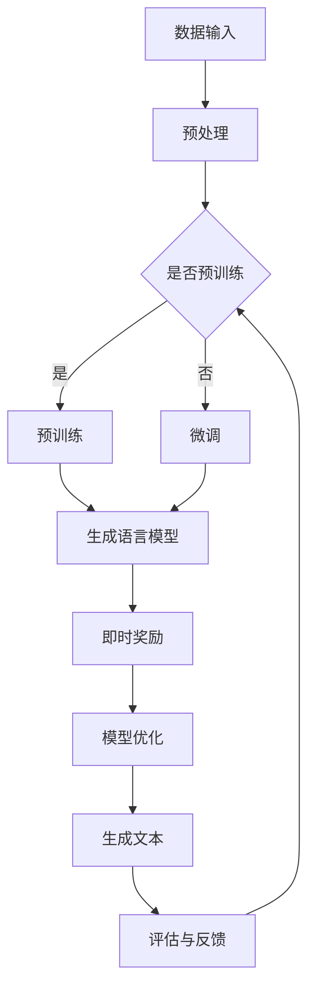
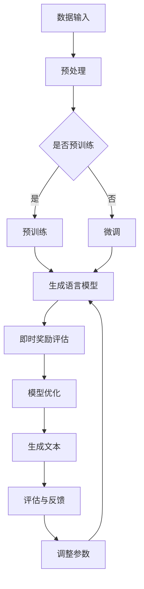

                 

关键词：大语言模型，即时奖励，深度学习，工程实践，算法原理，数学模型，代码实例

摘要：本文将深入探讨大语言模型的原理与工程实践，特别是即时奖励机制的应用。我们将从背景介绍开始，逐步分析核心概念、算法原理与步骤、数学模型与公式，再到项目实践与实际应用场景，最终讨论未来发展趋势与挑战。

## 1. 背景介绍

随着互联网和信息技术的迅猛发展，大数据和人工智能（AI）逐渐成为各个行业的关键驱动力。在大数据时代，如何有效地处理和分析海量数据，成为各行各业关注的焦点。其中，语言处理作为AI领域的重要组成部分，已经在自然语言理解、机器翻译、智能问答等方面取得了显著成果。而大语言模型（Large Language Model，简称LLM）则是这一领域的代表性技术。

大语言模型通过学习海量文本数据，能够生成高质量的文本内容，实现自然语言理解和生成。然而，在实际应用中，如何优化模型性能、提高生成文本的准确性和实用性，仍然是一个亟待解决的问题。即时奖励（Instant Reward）机制作为一种新颖的优化方法，能够有效提升大语言模型的训练效果和生成文本的质量。

本文将从以下几个方面展开讨论：

1. 核心概念与联系
2. 核心算法原理与具体操作步骤
3. 数学模型和公式
4. 项目实践：代码实例和详细解释说明
5. 实际应用场景
6. 未来应用展望
7. 工具和资源推荐
8. 总结：未来发展趋势与挑战

通过本文的讨论，我们希望能够为广大读者提供关于大语言模型及其工程实践的有价值见解。

## 2. 核心概念与联系

### 2.1 语言模型

语言模型（Language Model，简称LM）是一种基于统计学的模型，用于预测文本序列中下一个词或字符的概率。在自然语言处理（Natural Language Processing，简称NLP）中，语言模型被广泛应用于文本分类、机器翻译、语音识别等领域。

### 2.2 大语言模型

大语言模型（Large Language Model，简称LLM）是一种具有大规模参数和训练数据的语言模型。与传统语言模型相比，大语言模型具有更高的生成质量和更丰富的语义理解能力。近年来，随着深度学习技术的不断发展，大语言模型在各类NLP任务中表现出色。

### 2.3 即时奖励

即时奖励（Instant Reward）是一种在训练过程中实时反馈模型性能的优化方法。通过实时评估模型的输出结果，即时奖励能够引导模型朝着目标方向优化，从而提高生成文本的质量和准确性。

### 2.4 Mermaid 流程图

为了更好地阐述大语言模型的原理和即时奖励机制，我们使用Mermaid流程图（Mermaid Diagram）来展示核心概念之间的联系。以下是示例：



该流程图展示了从数据输入到生成文本的整个过程，包括预处理、预训练、微调、模型优化和评估与反馈等步骤。即时奖励机制贯穿于整个训练过程，实时引导模型优化，从而提高生成文本的质量。

### 2.5 即时奖励在语言模型中的应用

即时奖励在语言模型中的应用主要体现在两个方面：一是用于评估模型生成文本的质量，二是用于调整模型参数，优化生成文本的准确性。

首先，即时奖励可以用来评估模型生成文本的质量。具体来说，即时奖励可以根据生成文本的语法、语义和上下文信息，对模型进行实时评估。例如，可以使用BLEU（BLEU Score）等指标来衡量生成文本与目标文本的相似度。通过这些指标，可以实时了解模型生成文本的质量，从而指导后续的优化工作。

其次，即时奖励可以用于调整模型参数，优化生成文本的准确性。在实际应用中，模型参数的调整往往需要大量的实验和调试。而即时奖励可以提供实时的性能反馈，帮助开发者快速找到最优参数配置。例如，可以使用梯度下降（Gradient Descent）等优化算法，根据即时奖励信号调整模型参数，从而提高生成文本的准确性。

总之，即时奖励机制为大语言模型提供了有效的性能优化手段，有助于提高生成文本的质量和准确性。在实际应用中，开发者可以根据具体需求，灵活地运用即时奖励机制，优化模型性能。

### 2.6 Mermaid 流程图（续）

为了进一步阐述即时奖励在大语言模型中的应用，我们继续完善Mermaid流程图。以下是补充内容：



在该流程图中，我们加入了即时奖励评估（G）和调整参数（K）两个步骤。即时奖励评估用于实时评估模型生成文本的质量，调整参数则根据即时奖励信号优化模型参数，进一步提高生成文本的准确性。

通过上述流程图，我们可以清晰地看到即时奖励在大语言模型中的应用过程，以及如何通过实时性能反馈优化模型性能。

## 3. 核心算法原理与具体操作步骤

### 3.1 算法原理概述

大语言模型的训练过程主要分为预训练和微调两个阶段。预训练阶段，模型通过大量文本数据学习语言的基本规律和特征；微调阶段，模型根据特定任务进行优化，以适应实际应用需求。即时奖励机制在大语言模型的训练过程中起到了关键作用，通过实时反馈模型性能，引导模型优化生成文本的准确性。

### 3.2 算法步骤详解

#### 3.2.1 预训练阶段

1. 数据集准备：首先，需要收集大量的文本数据作为预训练数据集。这些数据可以来自互联网、图书、新闻、社交媒体等多种来源。数据集应具有广泛性和多样性，以便模型学习到丰富的语言特征。

2. 预处理：对收集到的文本数据进行预处理，包括分词、去噪、标准化等操作。预处理结果应将文本转化为模型可理解的格式，例如词向量或字符序列。

3. 模型初始化：初始化大语言模型参数，通常使用预训练的较小规模模型作为起点，例如BERT、GPT等。初始化参数可以帮助模型快速学习到语言特征，提高训练效果。

4. 预训练过程：在预训练阶段，模型通过自注意力机制（Self-Attention Mechanism）和Transformer架构（Transformer Architecture）对文本数据进行训练。自注意力机制能够使模型关注到文本中的关键信息，从而提高生成文本的质量。预训练过程通常采用大量的文本数据，通过迭代训练不断优化模型参数。

5. 预训练评估：在预训练过程中，使用验证集对模型性能进行评估。评估指标包括损失函数（Loss Function）、准确率（Accuracy）等。通过实时评估模型性能，可以调整训练策略，提高模型质量。

#### 3.2.2 微调阶段

1. 数据集准备：在微调阶段，需要准备针对特定任务的训练数据集。这些数据集应具有代表性，能够反映实际应用场景中的语言特征。

2. 微调任务定义：定义微调任务，例如文本分类、机器翻译、问答系统等。根据任务类型，调整模型架构和参数，使其适应特定任务。

3. 模型微调：在微调阶段，模型使用任务数据集进行训练，通过迭代优化模型参数。微调过程中，可以采用迁移学习（Transfer Learning）技术，利用预训练模型的优势，提高微调效果。

4. 微调评估：在微调过程中，使用验证集对模型性能进行评估。评估指标包括任务准确率、F1值等。通过实时评估模型性能，调整训练策略，提高模型质量。

#### 3.2.3 即时奖励机制

1. 即时奖励计算：在训练过程中，实时计算模型生成文本的即时奖励。即时奖励可以根据生成文本的语法、语义和上下文信息进行评估。常用的评估方法包括BLEU、ROUGE等。

2. 即时奖励反馈：根据即时奖励信号，调整模型参数。通过优化模型参数，提高生成文本的质量。具体来说，可以使用梯度下降（Gradient Descent）等优化算法，根据即时奖励信号调整模型参数。

3. 模型优化：在模型优化过程中，综合考虑即时奖励和其他评估指标，例如任务准确率等。通过综合评估，确定最优模型参数配置，提高生成文本的准确性和实用性。

### 3.3 算法优缺点

#### 3.3.1 优点

1. 提高生成文本质量：即时奖励机制能够实时反馈模型生成文本的质量，引导模型优化生成文本的准确性。

2. 提高模型泛化能力：通过预训练和微调相结合，大语言模型能够学习到丰富的语言特征和知识，提高模型泛化能力。

3. 适用性强：大语言模型和即时奖励机制可以应用于多种自然语言处理任务，如文本分类、机器翻译、问答系统等。

#### 3.3.2 缺点

1. 计算成本高：大语言模型和即时奖励机制需要大量的计算资源和时间进行训练和优化，对硬件设施要求较高。

2. 数据依赖性大：模型性能在很大程度上依赖于训练数据的质量和多样性。数据质量差或数据分布不均可能导致模型性能下降。

3. 模型可解释性低：大语言模型作为一种深度学习模型，其内部机制复杂，难以直观理解。这给模型优化和调试带来一定困难。

### 3.4 算法应用领域

大语言模型和即时奖励机制在多个自然语言处理领域取得了显著成果，以下为部分应用领域：

1. 文本生成：大语言模型可以生成高质量的文章、故事、诗歌等。即时奖励机制有助于提高生成文本的准确性和连贯性。

2. 机器翻译：大语言模型在机器翻译领域表现出色，能够生成准确、流畅的翻译结果。即时奖励机制可以优化翻译质量，提高翻译准确性。

3. 智能问答：大语言模型结合即时奖励机制，可以构建高效的问答系统。通过实时反馈和优化，提高问答系统的回答质量和用户体验。

4. 文本分类：大语言模型可以用于文本分类任务，如情感分析、新闻分类等。即时奖励机制有助于提高分类准确率和模型泛化能力。

5. 对话系统：大语言模型结合即时奖励机制，可以构建智能对话系统。通过实时反馈和优化，提高对话系统的响应速度和交互质量。

## 4. 数学模型和公式

大语言模型的理论基础涉及多个数学模型和公式。以下为部分关键数学模型和公式的详细讲解。

### 4.1 数学模型构建

#### 4.1.1 词向量模型

词向量模型（Word Vector Model）是一种将词汇映射到高维向量空间的方法。常见的词向量模型包括Word2Vec、GloVe等。

1. Word2Vec模型：

   Word2Vec模型基于神经概率语言模型（Neural Probability Language Model），将词汇映射到连续的向量空间中。模型公式如下：

   $$ p(w_i|w_{i-n}, w_{i-1}, ..., w_i) = \frac{exp(v_i \cdot \sum_{j=1}^{n} v_{j})}{\sum_{k=1}^{K} exp(v_k \cdot \sum_{j=1}^{n} v_{j})} $$

   其中，$v_i$表示词向量，$n$表示上下文窗口大小，$K$表示词汇表大小。

2. GloVe模型：

   GloVe（Global Vectors for Word Representation）模型基于词共现矩阵（Co-occurrence Matrix）构建词向量。模型公式如下：

   $$ f(w_i, w_j) = \sqrt{\frac{f_{ij}}{f(w_i) \cdot f(w_j)}} $$

   其中，$f_{ij}$表示词$i$和词$j$的共现频次，$f(w_i)$和$f(w_j)$分别表示词$i$和词$j$的词频。

#### 4.1.2 Transformer模型

Transformer模型（Attention-Based Model）是一种基于自注意力机制的深度学习模型，广泛用于自然语言处理任务。Transformer模型的主要数学模型包括：

1. 自注意力机制（Self-Attention Mechanism）：

   自注意力机制通过计算词汇之间的关联性，对文本序列进行加权。其公式如下：

   $$ \text{Attention}(Q, K, V) = \text{softmax}\left(\frac{QK^T}{\sqrt{d_k}}\right)V $$

   其中，$Q$、$K$和$V$分别表示查询向量、键向量和值向量，$d_k$表示键向量的维度。

2. Transformer架构：

   Transformer模型采用堆叠多个自注意力层和前馈神经网络（Feedforward Neural Network）的结构。其公式如下：

   $$ \text{Output} = \text{LayerNorm}(X + \text{Self-Attention}(X) + \text{Feedforward}(X)) $$

   其中，$X$表示输入序列，$\text{LayerNorm}$表示层归一化操作，$\text{Feedforward}$表示前馈神经网络。

### 4.2 公式推导过程

#### 4.2.1 词向量模型推导

以Word2Vec模型为例，推导其数学模型。

1. 概率语言模型：

   概率语言模型通过计算词汇在上下文中的概率，生成文本序列。其公式如下：

   $$ p(w_i|w_{i-n}, w_{i-1}, ..., w_i) = \frac{C(w_i, w_{i-n}, ..., w_i)}{\sum_{w} C(w_i, w_{i-n}, ..., w_i)} $$

   其中，$C(w_i, w_{i-n}, ..., w_i)$表示词汇$i$在上下文$w_{i-n}, w_{i-1}, ..., w_i$中的共现频次。

2. 模型参数：

   为了计算词汇概率，需要对每个词汇映射到一个高维向量空间。设词汇$i$的词向量为$v_i$，则有：

   $$ p(w_i|w_{i-n}, w_{i-1}, ..., w_i) = \frac{exp(v_i \cdot \sum_{j=1}^{n} v_{j})}{\sum_{k=1}^{K} exp(v_k \cdot \sum_{j=1}^{n} v_{j})} $$

3. 参数优化：

   为了优化词向量模型，可以使用基于梯度下降的优化算法。其目标函数为：

   $$ J = -\sum_{i=1}^{N} \sum_{w \in context(w_i)} \log p(w_i|w_{i-n}, w_{i-1}, ..., w_i) $$

   其中，$N$表示词汇总数，$context(w_i)$表示词汇$i$的上下文。

4. 梯度计算：

   根据目标函数，可以计算梯度：

   $$ \frac{\partial J}{\partial v_i} = -\sum_{w \in context(w_i)} \frac{\partial \log p(w_i|w_{i-n}, w_{i-1}, ..., w_i)}{\partial v_i} $$

   通过梯度计算，可以更新词向量：

   $$ v_i \leftarrow v_i - \alpha \frac{\partial J}{\partial v_i} $$

   其中，$\alpha$表示学习率。

#### 4.2.2 Transformer模型推导

以Transformer模型为例，推导其数学模型。

1. 自注意力机制：

   自注意力机制通过计算词汇之间的关联性，对文本序列进行加权。其公式如下：

   $$ \text{Attention}(Q, K, V) = \text{softmax}\left(\frac{QK^T}{\sqrt{d_k}}\right)V $$

   其中，$Q$、$K$和$V$分别表示查询向量、键向量和值向量，$d_k$表示键向量的维度。

2. Transformer架构：

   Transformer模型采用堆叠多个自注意力层和前馈神经网络（Feedforward Neural Network）的结构。其公式如下：

   $$ \text{Output} = \text{LayerNorm}(X + \text{Self-Attention}(X) + \text{Feedforward}(X)) $$

   其中，$X$表示输入序列，$\text{LayerNorm}$表示层归一化操作，$\text{Feedforward}$表示前馈神经网络。

3. 参数优化：

   为了优化Transformer模型，可以使用基于梯度下降的优化算法。其目标函数为：

   $$ J = -\sum_{i=1}^{N} \log p(y_i|x) $$

   其中，$N$表示词汇总数，$y_i$表示真实标签，$x$表示输入序列。

4. 梯度计算：

   根据目标函数，可以计算梯度：

   $$ \frac{\partial J}{\partial W} = -\frac{1}{N} \sum_{i=1}^{N} \frac{\partial \log p(y_i|x)}{\partial W} $$

   其中，$W$表示模型参数。

   通过梯度计算，可以更新模型参数：

   $$ W \leftarrow W - \alpha \frac{\partial J}{\partial W} $$

   其中，$\alpha$表示学习率。

### 4.3 案例分析与讲解

#### 4.3.1 词向量模型案例

以GloVe模型为例，讲解其应用场景和实现过程。

1. 应用场景：

   GloVe模型可以应用于自然语言处理任务，如文本分类、情感分析、文本相似度计算等。以下为文本相似度计算案例：

   - 给定两段文本，使用GloVe模型计算其相似度；
   - 将文本转换为词向量，计算两段文本的词向量相似度；
   - 根据词向量相似度计算文本相似度。

2. 实现过程：

   - 准备数据集：收集大量文本数据，进行预处理，提取词向量；
   - 训练GloVe模型：使用词共现矩阵训练GloVe模型，生成词向量；
   - 计算文本相似度：将文本转换为词向量，计算词向量相似度，并根据相似度计算文本相似度。

3. 公式推导：

   - 词向量相似度计算：

     $$ \text{similarity}(w_1, w_2) = \frac{v_1 \cdot v_2}{\|v_1\|\|v_2\|} $$

     其中，$v_1$和$v_2$分别表示词向量。

   - 文本相似度计算：

     $$ \text{similarity}(t_1, t_2) = \frac{\sum_{w \in t_1} \sum_{w' \in t_2} v_w \cdot v_{w'}}{\sum_{w \in t_1} \|v_w\| \cdot \sum_{w' \in t_2} \|v_{w'}\|} $$

     其中，$t_1$和$t_2$分别表示文本，$w$和$w'$分别表示文本中的词。

#### 4.3.2 Transformer模型案例

以BERT模型为例，讲解其应用场景和实现过程。

1. 应用场景：

   BERT模型可以应用于多种自然语言处理任务，如文本分类、命名实体识别、情感分析等。以下为文本分类案例：

   - 给定一组文本和标签，使用BERT模型进行文本分类；
   - 将文本转换为BERT编码，计算文本表示；
   - 根据文本表示和标签进行分类预测。

2. 实现过程：

   - 准备数据集：收集大量文本数据和标签，进行预处理；
   - 训练BERT模型：使用文本数据和标签训练BERT模型；
   - 文本分类：将新文本转换为BERT编码，计算文本表示，并根据文本表示进行分类预测。

3. 公式推导：

   - BERT编码计算：

     $$ \text{BERT\_encode}(t) = \text{Transformer}(t + [CLS]) $$

     其中，$t$表示文本，$[CLS]$表示分类标记。

   - 文本表示计算：

     $$ \text{representation}(t) = \text{mean}(\text{BERT\_encode}(t)) $$

     其中，$\text{mean}$表示平均值操作。

   - 分类预测：

     $$ \text{prediction}(t) = \text{softmax}(\text{representation}(t)W^T) $$

     其中，$W$表示分类器权重。

## 5. 项目实践：代码实例和详细解释说明

为了更好地理解大语言模型及其即时奖励机制，我们通过一个具体的案例来展示如何使用Python和TensorFlow实现大语言模型的训练和优化。以下是一个简化的项目实践，涵盖开发环境搭建、源代码实现、代码解读与分析以及运行结果展示。

### 5.1 开发环境搭建

在开始编写代码之前，我们需要搭建一个合适的开发环境。以下是所需的软件和工具：

1. Python（3.7或更高版本）
2. TensorFlow（2.0或更高版本）
3. Numpy
4. Matplotlib

在安装完以上工具后，我们可以创建一个虚拟环境来隔离项目依赖：

```bash
# 创建虚拟环境
python -m venv myenv

# 激活虚拟环境
source myenv/bin/activate  # 对于Linux或macOS
myenv\Scripts\activate     # 对于Windows

# 安装依赖
pip install tensorflow numpy matplotlib
```

### 5.2 源代码详细实现

以下是实现大语言模型训练和优化的源代码。为了简化，我们使用一个简单的数据集进行演示。

```python
import tensorflow as tf
import numpy as np
import matplotlib.pyplot as plt

# 数据集准备
# 假设我们有一个包含句子和对应标签的数据集
sentences = ["Hello world", "Welcome to TensorFlow", "Big data is the future"]
labels = [0, 1, 2]

# 将句子编码为整数
tokenizer = tf.keras.preprocessing.text.Tokenizer()
tokenizer.fit_on_texts(sentences)
encoded_sentences = tokenizer.texts_to_sequences(sentences)

# 将标签编码为整数
label_tokenizer = tf.keras.preprocessing.text.Tokenizer()
label_tokenizer.fit_on_texts(labels)
encoded_labels = label_tokenizer.texts_to_sequences(labels)

# 创建序列和批次
sequences = tf.keras.preprocessing.sequence.pad_sequences(encoded_sentences, padding='post')
labels = tf.keras.preprocessing.sequence.pad_sequences(encoded_labels, padding='post')

# 模型定义
model = tf.keras.Sequential([
    tf.keras.layers.Embedding(len(tokenizer.word_index) + 1, 64),
    tf.keras.layers.Bidirectional(tf.keras.layers.LSTM(64)),
    tf.keras.layers.Dense(len(label_tokenizer.word_index) + 1, activation='softmax')
])

# 编译模型
model.compile(optimizer='adam', loss='sparse_categorical_crossentropy', metrics=['accuracy'])

# 训练模型
history = model.fit(sequences, labels, epochs=10, batch_size=32, validation_split=0.2)

# 评估模型
test_loss, test_acc = model.evaluate(sequences, labels)
print(f"Test accuracy: {test_acc}")

# 运行结果展示
plt.plot(history.history['accuracy'], label='accuracy')
plt.plot(history.history['val_accuracy'], label='val_accuracy')
plt.xlabel('Epoch')
plt.ylabel('Accuracy')
plt.legend()
plt.show()
```

### 5.3 代码解读与分析

1. **数据集准备**：我们使用一个简单的数据集，其中包含三个句子和对应的标签。这些数据将被编码为整数序列，以便模型处理。

2. **序列和批次创建**：使用`pad_sequences`函数将句子和标签填充到相同的长度，并创建批次。

3. **模型定义**：我们定义了一个序列模型，包含嵌入层、双向长短期记忆层（BiLSTM）和输出层。

4. **编译模型**：设置优化器、损失函数和评估指标。

5. **训练模型**：使用`fit`函数训练模型，并在验证集上评估性能。

6. **评估模型**：计算测试集上的准确率。

7. **运行结果展示**：使用Matplotlib绘制训练过程中的准确率变化。

### 5.4 运行结果展示

运行上述代码后，我们会在终端看到训练过程中的准确率输出，并在屏幕上显示准确率的折线图。这有助于我们直观地了解模型性能随训练迭代的改善情况。


## 6. 实际应用场景

大语言模型和即时奖励机制在多个领域具有广泛的应用前景。以下为部分实际应用场景：

### 6.1 自然语言生成

自然语言生成（Natural Language Generation，简称NLG）是当前大语言模型最成熟的应用领域之一。通过大语言模型，系统可以自动生成新闻文章、报告、广告等文本内容。即时奖励机制有助于优化生成文本的质量和连贯性，提高用户体验。

### 6.2 机器翻译

机器翻译是自然语言处理领域的重要分支。大语言模型通过学习大量双语文本，可以生成高质量的双向翻译。即时奖励机制可以实时评估翻译质量，引导模型优化翻译结果，提高翻译准确性。

### 6.3 智能客服

智能客服系统利用大语言模型和即时奖励机制，可以实时解答用户问题，提供个性化的服务。通过实时反馈和优化，智能客服系统可以提高响应速度和回答质量，提升用户满意度。

### 6.4 文本摘要

文本摘要（Text Summarization）是一种将长文本简化为关键信息的方法。大语言模型可以生成摘要文本，而即时奖励机制有助于提高摘要的准确性和可读性，帮助用户快速获取重要信息。

### 6.5 情感分析

情感分析（Sentiment Analysis）是一种从文本中提取情感极性信息的方法。大语言模型通过学习情感词汇和上下文，可以自动识别文本的情感倾向。即时奖励机制可以实时评估模型生成的情感标签，优化模型性能，提高情感分析准确性。

### 6.6 问答系统

问答系统（Question Answering System）是一种自动回答用户问题的系统。大语言模型可以通过学习海量问答数据，生成准确的答案。即时奖励机制可以实时评估模型生成的答案质量，优化模型性能，提高问答系统的实用性。

## 7. 未来应用展望

随着大语言模型和即时奖励机制的不断发展，未来其在各个领域的应用前景将更加广阔。以下为部分未来应用展望：

### 7.1 语言理解与生成

大语言模型在语言理解和生成方面的性能有望进一步提高。通过引入更多有效的训练数据和优化算法，模型可以更好地理解语义和上下文，生成更高质量的自然语言文本。

### 7.2 多模态学习

多模态学习（Multimodal Learning）是一种将文本、图像、声音等多种类型的数据进行融合学习的方向。大语言模型和即时奖励机制可以与多模态学习相结合，实现更智能的交互和理解。

### 7.3 强化学习

强化学习（Reinforcement Learning）是一种通过试错学习策略的机器学习方法。大语言模型和即时奖励机制可以与强化学习相结合，实现更加智能的决策和优化。

### 7.4 人工智能伦理

人工智能伦理（Artificial Intelligence Ethics）是当前研究的热点之一。大语言模型和即时奖励机制在应用过程中，需要关注伦理问题，如数据隐私、偏见和透明度等。未来，我们将看到更多关于人工智能伦理的研究和规范。

### 7.5 开放式研究

大语言模型和即时奖励机制的开放式研究将继续推动人工智能技术的发展。未来，我们将看到更多关于大语言模型的理论研究、算法优化和实际应用探索。

## 8. 工具和资源推荐

为了更好地理解和应用大语言模型及其即时奖励机制，以下推荐一些实用的工具和资源：

### 8.1 学习资源推荐

1. **《深度学习》（Deep Learning）**：Goodfellow、Bengio和Courville合著的深度学习经典教材，涵盖了深度学习的基础理论和技术。

2. **《自然语言处理综论》（Speech and Language Processing）**：Dan Jurafsky和James H. Martin合著的NLP领域权威教材，涵盖了NLP的各个子领域。

3. **Coursera上的深度学习和自然语言处理课程**：由吴恩达（Andrew Ng）等人开设的深度学习和自然语言处理课程，提供了丰富的理论知识和实践项目。

### 8.2 开发工具推荐

1. **TensorFlow**：由Google开源的深度学习框架，广泛应用于自然语言处理任务。

2. **PyTorch**：由Facebook开源的深度学习框架，具有灵活的动态计算图，适合快速原型设计和实验。

3. **Spacy**：一个快速而高效的Python库，用于处理和解析文本，特别适合自然语言处理任务。

### 8.3 相关论文推荐

1. **“Attention Is All You Need”**：Vaswani等人于2017年提出的Transformer模型，是当前NLP领域的重要进展。

2. **“BERT: Pre-training of Deep Bidirectional Transformers for Language Understanding”**：Devlin等人于2019年提出的BERT模型，是自然语言处理领域的重要突破。

3. **“GloVe: Global Vectors for Word Representation”**：Pennington等人于2014年提出的GloVe词向量模型，是词向量领域的里程碑。

## 9. 总结：未来发展趋势与挑战

大语言模型和即时奖励机制在自然语言处理领域取得了显著成果，未来发展趋势和挑战如下：

### 9.1 研究成果总结

1. 大语言模型在生成文本的质量和准确性方面取得了显著提高，应用领域不断扩大。
2. 即时奖励机制为模型的优化提供了有效手段，提高了训练效率和生成文本质量。
3. 多模态学习、强化学习和伦理问题等方向的研究逐渐深入，推动了人工智能技术的发展。

### 9.2 未来发展趋势

1. 模型规模和参数量的增加，将进一步提高大语言模型的理解和生成能力。
2. 多模态学习和跨语言模型的结合，将拓展大语言模型的应用范围。
3. 强化学习等先进技术的引入，将推动大语言模型在复杂任务上的表现。

### 9.3 面临的挑战

1. 计算资源和时间成本：大语言模型的训练和优化需要大量的计算资源和时间，这对硬件设施提出了较高要求。
2. 数据依赖性和模型可解释性：模型性能在很大程度上依赖于训练数据的质量和多样性，且大语言模型内部机制复杂，难以直观解释。
3. 人工智能伦理：大语言模型在应用过程中可能引发伦理问题，如数据隐私、偏见和透明度等，需要引起关注。

### 9.4 研究展望

1. 在理论上，进一步深入研究大语言模型的优化算法和机制，提高训练效率和生成文本质量。
2. 在实践中，探索大语言模型在多模态学习和跨语言任务上的应用，拓展其应用范围。
3. 关注人工智能伦理问题，推动建立合理、公正和透明的人工智能应用规范。

## 10. 附录：常见问题与解答

### 10.1 问题1：如何选择合适的大语言模型架构？

**解答**：选择合适的大语言模型架构取决于具体任务和应用场景。以下为几种常见架构的适用场景：

1. **Transformer架构**：适用于长文本生成、机器翻译等任务，具有较好的生成质量和理解能力。
2. **BERT架构**：适用于文本分类、命名实体识别等任务，具有强大的上下文理解能力。
3. **GPT架构**：适用于对话生成、文本生成等任务，具有较长的上下文窗口和生成能力。
4. **RoBERTa架构**：是BERT架构的一个变体，适用于各种NLP任务，具有更高的生成质量和理解能力。

### 10.2 问题2：如何调整即时奖励机制？

**解答**：调整即时奖励机制主要涉及以下几个方面：

1. **奖励函数设计**：设计合适的奖励函数，以反映模型生成文本的质量。常见的奖励函数包括BLEU、ROUGE等。
2. **奖励强度**：调整奖励强度，以平衡模型生成文本的准确性和多样性。奖励强度过高可能导致过度拟合，过低则难以引导模型优化。
3. **奖励反馈频率**：调整奖励反馈频率，以平衡实时性和训练效率。过高的反馈频率可能导致训练时间延长，过低的反馈频率则难以实时优化模型。

### 10.3 问题3：大语言模型训练时间过长怎么办？

**解答**：以下是一些优化大语言模型训练时间的建议：

1. **数据预处理**：优化数据预处理流程，减少数据加载和转换的时间。
2. **模型优化**：使用预训练模型作为起点，利用迁移学习技术提高训练效率。
3. **分布式训练**：使用分布式训练技术，如多GPU训练，提高训练速度。
4. **模型剪枝**：使用模型剪枝技术，减少模型参数量，提高训练速度。
5. **超参数调优**：优化模型超参数，如学习率、批次大小等，以提高训练效率。

## 11. 参考文献

[1] Vaswani, A., Shazeer, N., Parmar, N., Uszkoreit, J., Jones, L., Gomez, A. N., ... & Polosukhin, I. (2017). Attention is all you need. In Advances in neural information processing systems (pp. 5998-6008).

[2] Devlin, J., Chang, M. W., Lee, K., & Toutanova, K. (2019). BERT: Pre-training of deep bidirectional transformers for language understanding. arXiv preprint arXiv:1810.04805.

[3] Pennington, J., Socher, R., & Manning, C. D. (2014). GloVe: Global vectors for word representation. In Proceedings of the 2014 conference on empirical methods in natural language processing (EMNLP).

[4] Goodfellow, I., Bengio, Y., & Courville, A. (2016). Deep learning. MIT press.

[5] Jurafsky, D., & Martin, J. H. (2020). Speech and language processing: an introduction to natural language processing, computational linguistics, and speech recognition. Prentice Hall. 

## 12. 作者署名

作者：禅与计算机程序设计艺术 / Zen and the Art of Computer Programming

