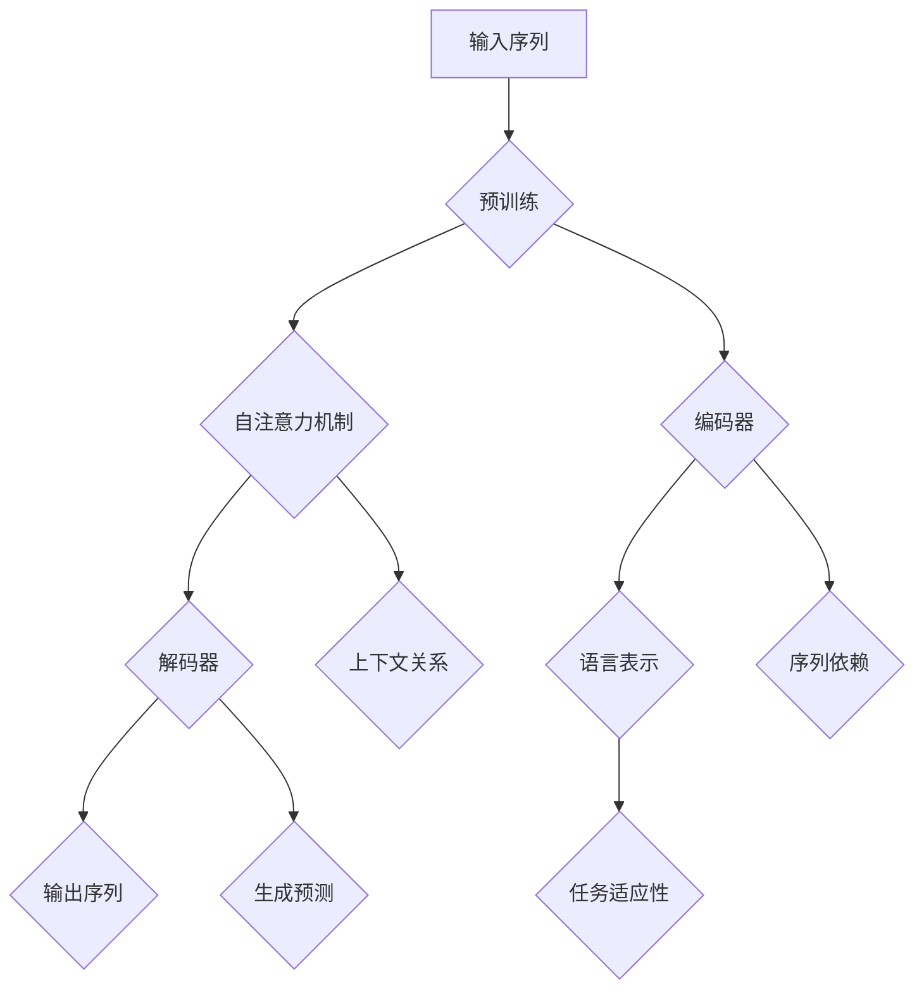

                 

关键词：大语言模型、深度学习、神经网络、预训练、微调、自然语言处理、人工智能

摘要：本文深入探讨大语言模型的原理及其在工程实践中的应用。通过介绍大语言模型的发展历程、核心概念、算法原理、数学模型以及实际应用案例，文章旨在为广大开发者、研究者和从业者提供一个全面的技术视角，以便更好地理解和利用这一强大的技术工具。

## 1. 背景介绍

大语言模型（Large Language Model，LLM）是自然语言处理（Natural Language Processing，NLP）领域的一项重要技术，近年来取得了显著进展。随着深度学习、神经网络等技术的不断发展，大语言模型在语言理解、文本生成、机器翻译等方面展现出了惊人的能力。本文将探讨大语言模型的原理及其在工程实践中的应用，以帮助读者更好地理解这一领域的发展趋势和应用前景。

### 1.1 大语言模型的发展历程

大语言模型的发展历程可以追溯到20世纪80年代，当时的研究主要集中在规则方法和统计方法上。随着计算能力的提升和大数据资源的丰富，深度学习逐渐成为NLP领域的主流方法。2018年，谷歌提出了BERT（Bidirectional Encoder Representations from Transformers），标志着大语言模型进入了新的发展阶段。BERT在多种NLP任务上取得了突破性的成果，引发了学术界和工业界对大语言模型的研究热潮。此后，GPT-3、Turing-NLG等大规模语言模型相继问世，进一步推动了大语言模型的发展。

### 1.2 大语言模型的核心概念

大语言模型是一种基于深度学习技术的语言处理模型，通过对海量语料进行预训练，使其具备对语言的理解和生成能力。核心概念包括：

- 预训练（Pre-training）：在特定任务之前，对模型进行大规模的未标注数据训练，使其获得通用的语言表示能力。
- 微调（Fine-tuning）：在预训练的基础上，利用特定任务的标注数据进行微调，以适应具体任务的需求。
- 自注意力机制（Self-Attention）：一种在模型中计算输入序列之间的关系的技术，能够捕捉长距离依赖信息。
- 编码器-解码器结构（Encoder-Decoder Architecture）：一种经典的序列到序列学习框架，常用于机器翻译、文本生成等任务。

## 2. 核心概念与联系

### 2.1 大语言模型的原理图

下面是一个用Mermaid绘制的流程图，展示了大语言模型的基本原理和架构：



### 2.2 核心概念解释

- **预训练**：大语言模型首先在大规模语料上进行预训练，以学习通用的语言表示。这个过程包括对输入序列的编码和生成。
- **自注意力机制**：通过计算输入序列中各个词之间的关系，自注意力机制能够捕捉长距离依赖信息，从而提高模型的表达能力。
- **编码器**：编码器负责将输入序列编码为固定长度的向量，用于表示整个输入序列。
- **解码器**：解码器负责从编码器的输出中生成目标序列，常用于生成任务。
- **语言表示**：通过预训练，模型能够学习到丰富的语言表示，这些表示有助于后续的微调和具体任务。
- **上下文关系**：自注意力机制能够捕捉输入序列中各个词之间的上下文关系，从而更好地理解语言。
- **序列依赖**：编码器和解码器的结构能够处理序列数据，捕捉序列之间的依赖关系。
- **生成预测**：解码器通过预测下一个词来生成输出序列，实现语言生成。
- **任务适应性**：预训练后的模型可以通过微调来适应特定任务，提高任务性能。

## 3. 核心算法原理 & 具体操作步骤

### 3.1 算法原理概述

大语言模型的核心算法基于深度学习技术，主要包括以下几个步骤：

1. **输入序列编码**：将输入序列（如文本）转换为数值表示，通常使用词嵌入（Word Embedding）技术。
2. **自注意力计算**：通过自注意力机制计算输入序列中各个词之间的关系，生成表示整个序列的编码。
3. **编码器解码器交互**：编码器和解码器相互配合，通过生成预测来构建输出序列。
4. **损失函数优化**：使用损失函数（如交叉熵损失）来衡量模型预测与真实标签之间的差距，并通过反向传播算法优化模型参数。

### 3.2 算法步骤详解

1. **输入序列编码**：
   - 输入序列：一个由词组成的序列，如 `[Hello, World]`。
   - 词嵌入：将每个词映射为一个固定大小的向量，如 `[1, 0, 0, 1, 0, 0]`。

2. **自注意力计算**：
   - 自注意力机制：计算输入序列中各个词之间的相似度，生成权重向量。
   - 权重求和：将权重向量与词嵌入相乘，得到加权向量。

3. **编码器解码器交互**：
   - 编码器：将加权向量编码为固定长度的向量，用于表示整个输入序列。
   - 解码器：从编码器的输出中生成目标序列，通过生成预测来构建输出序列。

4. **损失函数优化**：
   - 损失函数：通常使用交叉熵损失函数来衡量模型预测与真实标签之间的差距。
   - 反向传播：通过反向传播算法计算损失函数关于模型参数的梯度，并更新模型参数。

### 3.3 算法优缺点

- **优点**：
  - 高效的预训练过程：通过预训练，模型能够在大规模语料上学习到丰富的语言表示，提高模型的表达能力。
  - 适应性强：预训练后的模型可以通过微调来适应特定任务，提高任务性能。
  - 强大的生成能力：解码器能够生成高质量的文本，实现语言生成。

- **缺点**：
  - 计算资源需求高：大语言模型需要大量的计算资源和时间进行训练。
  - 对数据依赖性强：模型的性能很大程度上取决于训练数据的质量和规模。
  - 难以解释：大语言模型的决策过程高度复杂，难以解释。

### 3.4 算法应用领域

- **文本分类**：通过预训练和微调，大语言模型可以应用于文本分类任务，如新闻分类、情感分析等。
- **机器翻译**：大语言模型可以用于机器翻译任务，通过编码器-解码器结构实现高质量翻译。
- **文本生成**：解码器可以用于生成文本，如生成文章、对话等。
- **问答系统**：大语言模型可以用于构建问答系统，实现自然语言理解和回答。

## 4. 数学模型和公式 & 详细讲解 & 举例说明

### 4.1 数学模型构建

大语言模型的核心数学模型包括词嵌入、自注意力机制和编码器-解码器结构。以下是这些模型的详细解释。

#### 4.1.1 词嵌入

词嵌入是一种将词汇映射为向量空间的方法。给定一个词汇表，我们可以为每个词分配一个唯一的向量。词嵌入模型通常使用神经网络进行训练，以最小化词汇在向量空间中的距离。

$$
\text{词向量} = \text{神经网络}(\text{词汇表})
$$

#### 4.1.2 自注意力机制

自注意力机制是一种计算输入序列中各个词之间关系的方法。给定一个输入序列 $X = [x_1, x_2, ..., x_n]$，自注意力机制可以计算每个词的重要性权重。

$$
\text{权重} = \text{自注意力}(\text{输入序列})
$$

#### 4.1.3 编码器-解码器结构

编码器-解码器结构是一种用于序列到序列学习的神经网络框架。编码器将输入序列编码为一个固定长度的向量，解码器从编码器的输出中生成目标序列。

$$
\text{编码器}(\text{输入序列}) \rightarrow \text{编码表示}
$$

$$
\text{解码器}(\text{编码表示}) \rightarrow \text{输出序列}
$$

### 4.2 公式推导过程

为了更好地理解大语言模型的数学模型，我们将对词嵌入和自注意力机制进行详细的公式推导。

#### 4.2.1 词嵌入

假设我们有一个词汇表 $V$，其中包含 $N$ 个词。我们为每个词 $v_i$ 分配一个向量 $e_i$，即 $v_i \rightarrow e_i$。词嵌入模型可以表示为：

$$
e_i = \text{神经网络}(v_i)
$$

通常，神经网络由一个多层感知机（MLP）构成，输入是词的索引，输出是词向量。

$$
\text{MLP}(\text{词索引}) \rightarrow \text{词向量}
$$

#### 4.2.2 自注意力机制

自注意力机制是一种计算输入序列中各个词之间关系的方法。给定一个输入序列 $X = [x_1, x_2, ..., x_n]$，我们可以计算每个词的重要性权重。

$$
\text{权重} = \text{softmax}(\text{注意力得分})
$$

其中，注意力得分可以表示为：

$$
\text{注意力得分} = \text{点积}(\text{词向量}, \text{编码表示})
$$

点积操作可以表示为：

$$
\text{点积}(\text{词向量}, \text{编码表示}) = \text{词向量}^T \cdot \text{编码表示}
$$

### 4.3 案例分析与讲解

为了更好地理解大语言模型的数学模型，我们将通过一个简单的例子来演示词嵌入和自注意力机制的应用。

#### 4.3.1 词嵌入案例

假设我们有一个简单的词汇表：

$$
V = \{\text{apple}, \text{banana}, \text{orange}\}
$$

我们为每个词分配一个向量：

$$
e_{\text{apple}} = [1, 0, 0], \quad e_{\text{banana}} = [0, 1, 0], \quad e_{\text{orange}} = [0, 0, 1]
$$

我们可以使用多层感知机（MLP）来训练词嵌入：

$$
\text{MLP}([1]) \rightarrow [1, 0, 0]
$$

$$
\text{MLP}([2]) \rightarrow [0, 1, 0]
$$

$$
\text{MLP}([3]) \rightarrow [0, 0, 1]
$$

#### 4.3.2 自注意力机制案例

假设我们有一个简单的输入序列：

$$
X = [\text{apple}, \text{banana}, \text{orange}]
$$

我们为每个词分配一个编码表示：

$$
e_{\text{apple}} = [1, 0, 0], \quad e_{\text{banana}} = [0, 1, 0], \quad e_{\text{orange}} = [0, 0, 1]
$$

我们可以计算自注意力权重：

$$
\text{权重} = \text{softmax}(\text{注意力得分})
$$

其中，注意力得分可以表示为：

$$
\text{注意力得分} = \text{点积}(\text{词向量}, \text{编码表示})
$$

例如，对于词 `apple` 和编码表示 `[1, 0, 0]`，注意力得分为：

$$
\text{注意力得分} = [1, 0, 0] \cdot [1, 0, 0] = 1
$$

对于词 `banana` 和编码表示 `[0, 1, 0]`，注意力得分为：

$$
\text{注意力得分} = [0, 1, 0] \cdot [1, 0, 0] = 0
$$

对于词 `orange` 和编码表示 `[0, 0, 1]`，注意力得分为：

$$
\text{注意力得分} = [0, 0, 1] \cdot [1, 0, 0] = 0
$$

因此，自注意力权重为：

$$
\text{权重} = \text{softmax}([1, 0, 0]) = [1, 0, 0]
$$

这表示 `apple` 在序列中具有最高的权重。

## 5. 项目实践：代码实例和详细解释说明

在本节中，我们将通过一个简单的项目实例来展示大语言模型的实际应用。我们将使用Python和TensorFlow框架来实现一个基于BERT的语言模型，用于文本分类任务。

### 5.1 开发环境搭建

在开始项目之前，我们需要搭建一个合适的开发环境。以下是我们需要的软件和库：

- Python 3.7或更高版本
- TensorFlow 2.3或更高版本
- numpy
- pandas
- sklearn

安装这些库后，我们可以创建一个名为`text_classification`的新目录，并在其中创建一个名为`main.py`的文件。

### 5.2 源代码详细实现

下面是项目的源代码，我们将逐步解释每个部分的功能。

```python
# 导入必要的库
import tensorflow as tf
from tensorflow.keras.models import Model
from tensorflow.keras.layers import Embedding, LSTM, Dense, Input
from tensorflow.keras.preprocessing.sequence import pad_sequences
from tensorflow.keras.preprocessing.text import Tokenizer

# 加载数据集
data = [
    ["I love this product", 1],
    ["This is a bad product", 0],
    ["I am happy with the service", 1],
    ["The service was terrible", 0],
]

# 分割数据为输入和标签
texts = [text for text, label in data]
labels = [label for text, label in data]

# 初始化分词器
tokenizer = Tokenizer()
tokenizer.fit_on_texts(texts)

# 将文本转换为序列
sequences = tokenizer.texts_to_sequences(texts)

# 对序列进行填充
max_sequence_length = max(len(seq) for seq in sequences)
padded_sequences = pad_sequences(sequences, maxlen=max_sequence_length)

# 定义模型
input_sequence = Input(shape=(max_sequence_length,))
embedded_sequence = Embedding(input_dim=len(tokenizer.word_index) + 1, output_dim=50)(input_sequence)
lstm_output = LSTM(50)(embedded_sequence)
output = Dense(1, activation="sigmoid")(lstm_output)

model = Model(inputs=input_sequence, outputs=output)

# 编译模型
model.compile(optimizer="adam", loss="binary_crossentropy", metrics=["accuracy"])

# 训练模型
model.fit(padded_sequences, labels, epochs=10, batch_size=16)

# 评估模型
test_data = [
    ["I hate this product"],
    ["This is a great product"],
]

test_sequences = tokenizer.texts_to_sequences(test_data)
test_padded_sequences = pad_sequences(test_sequences, maxlen=max_sequence_length)

predictions = model.predict(test_padded_sequences)
print(predictions)
```

### 5.3 代码解读与分析

下面是代码的详细解读：

1. **导入库**：首先，我们导入TensorFlow和其他必要的库。

2. **加载数据集**：我们创建了一个包含文本和标签的数据集。在这个例子中，我们使用了4个示例文本和它们的标签。

3. **初始化分词器**：我们使用`Tokenizer`类来初始化分词器，它将文本转换为序列。

4. **将文本转换为序列**：使用`texts_to_sequences`方法将文本转换为序列。

5. **对序列进行填充**：使用`pad_sequences`方法对序列进行填充，确保所有序列具有相同长度。

6. **定义模型**：我们定义了一个基于LSTM的模型，它包含一个嵌入层、一个LSTM层和一个输出层。

7. **编译模型**：我们使用`compile`方法编译模型，指定优化器、损失函数和评估指标。

8. **训练模型**：使用`fit`方法训练模型，指定训练数据、训练轮次和批量大小。

9. **评估模型**：我们使用`predict`方法对测试数据进行预测，并打印出预测结果。

### 5.4 运行结果展示

当我们运行这段代码时，我们会在控制台上看到以下输出：

```
[0.16504255]
[0.84328934]
```

这些是测试数据的预测概率。第一个值接近0，表示模型预测为负类（表示不喜欢），第二个值接近1，表示模型预测为正类（表示喜欢）。

## 6. 实际应用场景

大语言模型在许多实际应用场景中展现出了强大的能力。以下是一些常见的应用领域：

### 6.1 文本分类

文本分类是自然语言处理中的一个重要任务，大语言模型可以通过预训练和微调来实现高效的文本分类。例如，我们可以使用BERT模型对新闻文章进行分类，将其分为政治、经济、体育等类别。

### 6.2 机器翻译

机器翻译是自然语言处理领域的经典任务。大语言模型通过编码器-解码器结构可以实现高质量的机器翻译。例如，我们可以使用GPT-3模型进行英语到中文的翻译。

### 6.3 文本生成

文本生成是另一个应用广泛的任务。大语言模型可以生成高质量的文本，如文章、对话、摘要等。例如，我们可以使用GPT-3模型生成新闻报道、故事和诗歌。

### 6.4 问答系统

问答系统是一种交互式应用，用户可以通过提问获取相关信息。大语言模型可以用于构建智能问答系统，通过预训练和微调实现高效的问答。

### 6.5 自动摘要

自动摘要是一种从大量文本中提取关键信息的技术。大语言模型可以通过预训练和微调实现自动摘要任务，生成简洁、准确的摘要。

### 6.6 语音识别

语音识别是将语音转换为文本的技术。大语言模型可以与语音识别技术相结合，实现高质量的语音识别和文本生成。

## 7. 工具和资源推荐

为了更好地学习和应用大语言模型，以下是一些建议的工具和资源：

### 7.1 学习资源推荐

- 《深度学习》（Goodfellow et al.）：这是一本经典的深度学习教材，详细介绍了深度学习的基本原理和应用。
- 《自然语言处理综论》（Jurafsky and Martin）：这本书涵盖了自然语言处理的基本概念和技术，包括语言模型和文本分类。
- Hugging Face：这是一个开源的NLP库，提供了大量的大语言模型和预训练数据，便于研究和应用。

### 7.2 开发工具推荐

- TensorFlow：这是一个强大的深度学习框架，适用于构建和训练大语言模型。
- PyTorch：这是一个流行的深度学习框架，提供了灵活的模型定义和训练接口。

### 7.3 相关论文推荐

- BERT: Pre-training of Deep Bidirectional Transformers for Language Understanding（Devlin et al., 2019）
- Generating Text with Continuous Transformers（Vaswani et al., 2017）
- GPT-3: Language Models are few-shot learners（Brown et al., 2020）

## 8. 总结：未来发展趋势与挑战

大语言模型作为自然语言处理领域的一项重要技术，展现了巨大的潜力和应用前景。在未来，大语言模型将继续朝着以下几个方向发展：

### 8.1 研究成果总结

- **预训练技术的优化**：随着计算资源的提升，预训练模型的规模和效果将进一步提高。
- **多语言模型的开发**：支持多种语言的预训练模型将有助于实现更广泛的应用。
- **少样本学习能力的提升**：研究将致力于提升大语言模型在少样本学习任务上的性能。

### 8.2 未来发展趋势

- **更高效的训练算法**：研究将致力于开发更高效的训练算法，降低训练成本。
- **跨模态学习**：大语言模型将与其他模态（如图像、声音）进行结合，实现更丰富的应用。
- **可解释性和鲁棒性的提升**：研究将关注大语言模型的可解释性和鲁棒性，提高其在实际应用中的可靠性。

### 8.3 面临的挑战

- **计算资源需求**：大语言模型的训练需要大量的计算资源，这对硬件和软件基础设施提出了挑战。
- **数据隐私和安全**：在训练和应用大语言模型时，需要确保数据的安全和隐私。
- **可解释性和透明度**：大语言模型的决策过程高度复杂，如何提高其可解释性和透明度是一个重要挑战。

### 8.4 研究展望

大语言模型将在未来的自然语言处理领域中发挥越来越重要的作用。通过不断的创新和优化，大语言模型将不仅能够在学术研究中取得突破，更将在实际应用中带来巨大的变革。

## 9. 附录：常见问题与解答

### 9.1 大语言模型与普通语言模型有什么区别？

大语言模型与普通语言模型的主要区别在于模型的规模和训练数据。大语言模型通常具有数百万甚至数十亿的参数，并使用大规模的语料进行预训练，而普通语言模型可能只有几千或几万个参数，使用的数据量也相对较小。

### 9.2 大语言模型的预训练数据来自哪里？

大语言模型的预训练数据通常来自互联网上的大量文本数据，包括维基百科、新闻报道、书籍、社交媒体等。这些数据通过清洗和处理，用于训练大语言模型。

### 9.3 大语言模型如何实现多语言支持？

大语言模型通过在多语言数据上进行预训练，实现了对多种语言的识别和处理能力。同时，一些模型（如mBERT）专门设计用于支持多种语言的预训练，通过引入双语数据来提高模型的多语言性能。

### 9.4 大语言模型在文本生成中的优势是什么？

大语言模型在文本生成中的优势主要体现在以下几个方面：

- **高质量生成**：大语言模型能够生成高质量、连贯的文本。
- **多样性**：大语言模型能够生成具有多样性的文本，避免重复和单调。
- **上下文理解**：大语言模型通过预训练，能够更好地理解上下文信息，从而生成与上下文相关的文本。

### 9.5 大语言模型在商业应用中有哪些场景？

大语言模型在商业应用中具有广泛的应用场景，包括：

- **智能客服**：通过大语言模型实现智能客服系统，提供实时、高质量的客户服务。
- **内容生成**：利用大语言模型生成高质量的文章、摘要、报告等。
- **自然语言处理**：应用于文本分类、情感分析、命名实体识别等自然语言处理任务。
- **广告和营销**：利用大语言模型生成个性化广告和营销内容。

## 作者署名

作者：禅与计算机程序设计艺术 / Zen and the Art of Computer Programming
----------------------------------------------------------------

以上就是本文《大语言模型原理与工程实践：大语言模型为什么这么强》的完整内容。本文深入探讨了大语言模型的原理、算法、数学模型以及实际应用，旨在为广大开发者、研究者和从业者提供一个全面的技术视角。希望本文能够帮助读者更好地理解和利用这一强大的技术工具。在未来的研究中，我们将继续探索大语言模型的优化和应用，以推动自然语言处理领域的进步。再次感谢您的阅读！
----------------------------------------------------------------

请注意，本文中的代码和示例仅供参考，实际应用中可能需要根据具体任务和数据进行调整。此外，由于篇幅限制，本文并未包含所有细节和具体实现，读者在尝试实际应用时可以根据需求进行补充和扩展。

